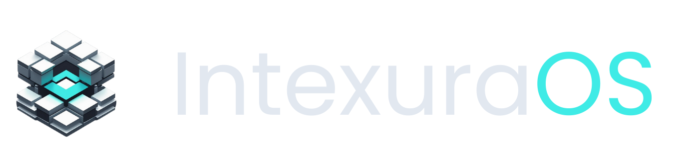
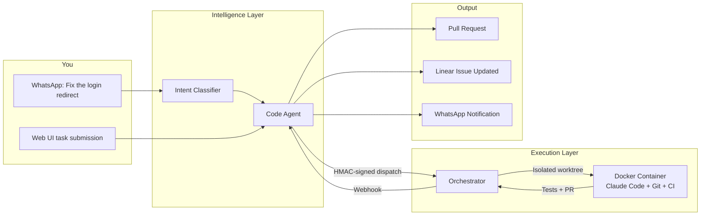
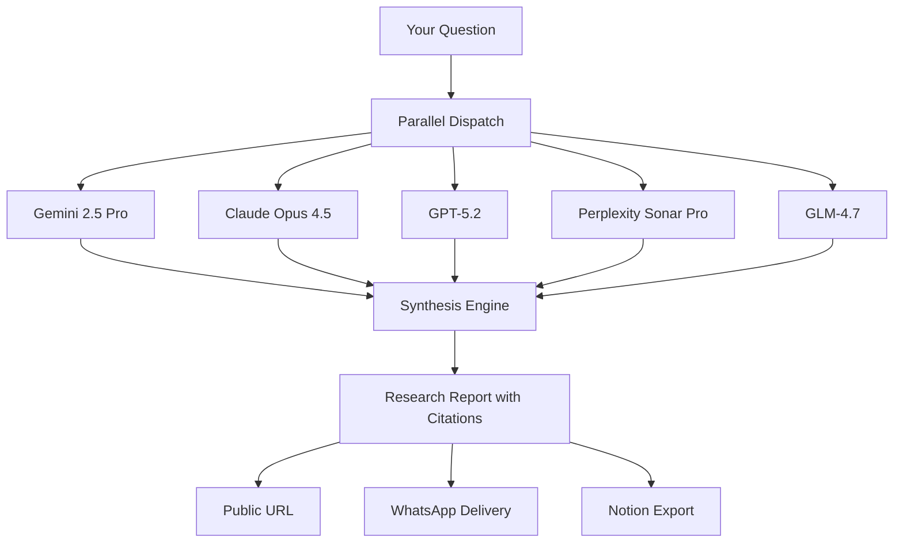
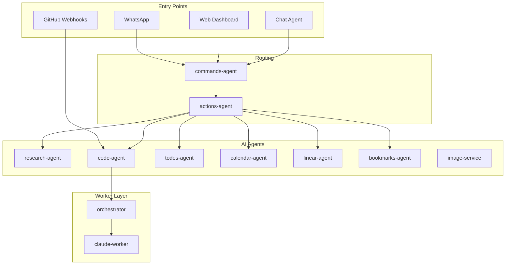

<div align="center">
  

  <h2><a href="https://intexuraos.cloud/" target="_blank">intexuraos.cloud</a></h2>

  <p>
    <em>From Latin <strong>intexere</strong> (to weave together) + <strong>textura</strong> (structure)</em><br>
    <strong>The software that builds itself.</strong>
  </p>

  <p>
    <a href="https://github.com/pbuchman/intexuraos/actions"></a>
    
    
    
    
    
  </p>
</div>

---

> Send a WhatsApp message describing a bug. Walk away. Come back to a pull request — with tests passing, Linear issue updated, and a code review waiting.

IntexuraOS is an autonomous agent platform that turned a single developer into an engineering team. It doesn't just use AI as a feature — it deploys AI agents that use software as a tool. The platform researches, schedules, manages tasks, and as of v3.0.0, **writes and ships its own code**.

---

## What's New in v3.1.0

| Improvement                    | Impact                                                                       |
| ------------------------------ | ---------------------------------------------------------------------------- |
| **Auto-Trigger Code Tasks**    | Linear issue assignment automatically dispatches Phase 1 design              |
| **Simplified PR Dispatch**     | Direct worker dispatch replaces Gemini classification for PR comments        |
| **Phase 2 Enhancements**       | Planning stage, dual code review loop, and turn summary for execution agents |
| **Prompt Sanitization**        | AWS keys, API tokens, PEM keys stripped from worker inputs                   |
| **CI Pipeline Optimization**   | 5m to 3m43s with 3-way test sharding and parallel type/lint matrix           |
| **Log Viewer Improvements**    | Collapsible tool output blocks with per-block expand/collapse                |

---

## The Self-Building System

Most AI coding tools wait for you to sit at a keyboard. IntexuraOS doesn't.

You describe what needs to change — via WhatsApp voice note, text message, or web UI. The platform takes it from there: it designs the approach, writes the code inside a sandboxed Docker container, runs CI, creates a pull request, and updates the Linear issue. If the first attempt doesn't pass verification, it retries with preserved context.

The entire pipeline runs without human intervention. You approve the PR when you're ready.



### How It Actually Works

**Phase 1 — Design.** A design agent analyzes the task, enriches the Linear issue with technical context, creates subissues for complex work, and labels the issue `code-task` when the plan is sound.

**Phase 2 — Execution.** A strict execution agent picks up the labeled issue, writes code in a Docker container with git worktree isolation, runs the full CI suite, creates a PR, and moves the Linear issue to "In Review."

**Verification.** After each attempt, a Gemini-powered completion verifier checks the work against a contract: Are the right files modified? Do tests pass? Is the PR created? If not, the system resumes with `--continue` and tries again.

### Isolation and Security

Every task runs in its own world:

- **Docker containers** with all Linux capabilities dropped, non-root execution (UID 1001)
- **Git worktrees** so concurrent tasks never interfere with each other
- **Read-only secrets** mounted per-task, never shared between tasks
- **Network isolation** blocking cloud metadata endpoints and private IPs
- **Sensitive file guard** that automatically reverts commits touching `.env`, `.pem`, or credentials
- **HMAC-signed dispatch** with nonce, timestamp, and Cloudflare Access tunnel

---

## The Council of AI

When IntexuraOS needs to research a topic, it doesn't ask one model and hope for the best. It asks five.

**17 models across 5 providers** — Google, OpenAI, Anthropic, Perplexity, and Zai — each queried in parallel, each reasoning independently, then synthesized into a single report with source attribution and confidence scoring.



Single-model assistants hallucinate. A council of models cross-checks. When three models agree and two disagree, that disagreement is surfaced — not hidden.

---

## Voice-First Intelligence

Speak to WhatsApp. IntexuraOS classifies your intent, routes to the right agent, and executes.

| You Say                                            | What Happens                                          |
| -------------------------------------------------- | ----------------------------------------------------- |
| _"Fix the login redirect on Safari"_               | Code Agent dispatches to worker, you get a PR         |
| _"Research quantum computing with Claude and GPT"_ | Council of AI queries specified models, synthesizes   |
| _"Schedule a sync with engineering Tuesday at 2"_  | Shows preview, waits for approval, then creates event |
| _"Remind me to review the Q4 report by Friday"_    | Extracts task with priority and deadline              |
| _"Save this link about TypeScript 5.0"_            | AI-generated summary with metadata extraction         |
| _"Create a Linear issue for the auth refactor"_    | Issue filed with AI-generated title and description   |

**7 action types**: research, todo, note, link, calendar, linear, code — classified by a 5-step decision tree that isolates URL keywords, detects explicit intent, and supports Polish language input.

**Approval built in.** Reply "yes" or react with an emoji to approve calendar events, code tasks, or any action requiring confirmation. The system understands natural language intent — "looks good", "go ahead", "nah" all work.

---

## Architecture

### 46 Components

**20 microservices** on Cloud Run, **4 workers** (Docker containers + Cloud Functions), and **22 shared packages** — all in a pnpm monorepo with strict TypeScript and hexagonal architecture.



### Technology Stack

| Layer              | Technologies                                                                 |
| ------------------ | ---------------------------------------------------------------------------- |
| **Runtime**        | Node.js 22, TypeScript 5.7 (strict), pnpm workspaces                         |
| **Framework**      | Fastify, Hexagonal Architecture, Domain-Driven Design                        |
| **AI Providers**   | Anthropic, OpenAI, Google AI, Perplexity, Zai                                |
| **AI Tooling**     | Claude Code (autonomous worker), OpenAI Embeddings (RAG)                     |
| **Data**           | Firestore (NoSQL), Google Cloud Storage                                      |
| **Messaging**      | Cloud Pub/Sub (event-driven, push-only)                                      |
| **Auth**           | Auth0, Google OAuth, Cloudflare Access, HMAC signing                         |
| **Infrastructure** | Terraform, Cloud Run, Cloud Functions, Docker, PM2                           |
| **Observability**  | OpenTelemetry + Dash0 (traces & metrics), Sentry (errors)                    |
| **Integrations**   | WhatsApp Business API, Linear, GitHub, Google Calendar, Notion, Speechmatics |

### AI Provider Matrix

| Provider       | Models                                        | Strengths                                  |
| -------------- | --------------------------------------------- | ------------------------------------------ |
| **Google**     | Gemini 2.5 Pro, Flash, Flash-Image, 2.0 Flash | Classification, fast ops, image generation |
| **OpenAI**     | GPT-5.2, o4-mini-deep-research, GPT Image 1   | Deep research, synthesis, embeddings       |
| **Anthropic**  | Claude Opus 4.5, Sonnet 4.5, Haiku 3.5        | Analysis, validation, autonomous coding    |
| **Perplexity** | Sonar, Sonar Pro, Sonar Deep Research         | Real-time web search with citations        |
| **Zai**        | GLM-4.7, GLM-4.7-Flash                        | Multilingual, cost-efficient, guest access |

---

## Engineering Standards

### 100% Branch Coverage

Not a target. A gate. Every branch in every service is either tested or explicitly exempted with `/* v8 ignore <CATEGORY> -- reason */`. CI fails on any unaccounted branch. No exceptions.

```bash
pnpm run ci:tracked  # TypeCheck → Lint → Tests (100% branches) → Build
```

### The Development Playbook

This isn't a codebase that "uses" AI — **AI is a first-class team member** with its own skills, agents, and development commands:

| Type         | Examples                                      | What They Do                                                                         |
| ------------ | --------------------------------------------- | ------------------------------------------------------------------------------------ |
| **Skills**   | `/linear`, `/sentry`, `/document-service`     | Issue creation with auto-splitting, error triage with Seer, autonomous documentation |
| **Agents**   | `service-scribe`, `llm-manager`               | Generate service docs in parallel, audit LLM pricing across providers                |
| **Commands** | `/create-service`, `/refactoring`, `/release` | Scaffold services, detect code smells, orchestrate semantic versioning               |

**Cross-linking is automatic.** `INT-XXX` in a PR title connects Linear to GitHub. `[sentry]` prefix on Linear issues connects to Sentry. Every artifact traces back to every other.

### Strict TypeScript

`noUncheckedIndexedAccess`, `exactOptionalPropertyTypes`, `strictBooleanExpressions` — the compiler catches what tests might miss. Every operation returns `Result<T, E>`. No silent failures. No `any` types.

### Infrastructure as Code

Everything in Terraform. No manual Cloud Console clicks. Reproducible, auditable, version-controlled.

---

## Quick Start

```bash
# Prerequisites: Node.js 22+, pnpm 9+, Docker

pnpm install
cp .envrc.local.example .envrc.local
direnv allow
pnpm run dev
```

| Service     | URL                        |
| ----------- | -------------------------- |
| Web App     | http://localhost:3000      |
| API Docs    | http://localhost:8115/docs |
| Firebase UI | http://localhost:8100      |

Full setup: **[Development Setup Guide](docs/setup/05-local-dev-with-gcp-deps.md)**

---

## Documentation

| Document                                                    | Description                                        |
| ----------------------------------------------------------- | -------------------------------------------------- |
| **[Platform Overview](docs/overview.md)**                   | Architecture, agents, and the self-building system |
| **[Services Catalog](docs/services/index.md)**              | All 20 apps + 4 workers + 22 packages              |
| **[AI Architecture](docs/architecture/ai-architecture.md)** | Deep dive into 17 models across 5 providers        |
| **[Setup Guide](docs/setup/01-gcp-project.md)**             | Step-by-step GCP and local environment setup       |

### Key Services

| Service                                                            | What It Does                                                                               |
| ------------------------------------------------------------------ | ------------------------------------------------------------------------------------------ |
| **[code-agent](docs/services/code-agent/features.md)**             | Autonomous code execution — task dispatch, deduplication, rate limiting, PR lifecycle      |
| **[orchestrator](docs/services/orchestrator/features.md)**         | Docker-isolated Claude Code sessions with worktree parallelism and completion verification |
| **[chat-agent](docs/services/chat-agent/features.md)**             | In-app AI assistant with RAG-powered documentation Q&A and guest access                    |
| **[research-agent](docs/services/research-agent/features.md)**     | Multi-model research with parallel synthesis across 11 models                              |
| **[commands-agent](docs/services/commands-agent/features.md)**     | 5-step intent classification with URL isolation and Polish support                         |
| **[whatsapp-service](docs/services/whatsapp-service/features.md)** | Voice transcription, message handling, approval workflows                                  |

---

## About

IntexuraOS is what happens when a single engineer refuses to accept that one person can't build and maintain a 46-component distributed system with enterprise-grade reliability.

The answer isn't working harder. It's building agents that work for you — then building agents that build agents.

**Built by [Piotr Buchman](https://www.linkedin.com/in/piotrbuchman/).**

---

<div align="center">
  <sub>20 services. 4 workers. 22 packages. 17 AI models. 100% branch coverage. One developer.</sub>
</div>
