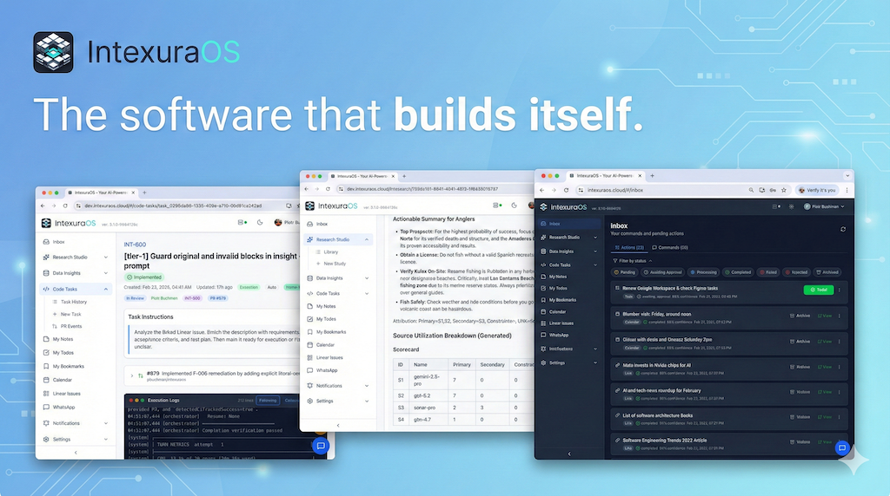
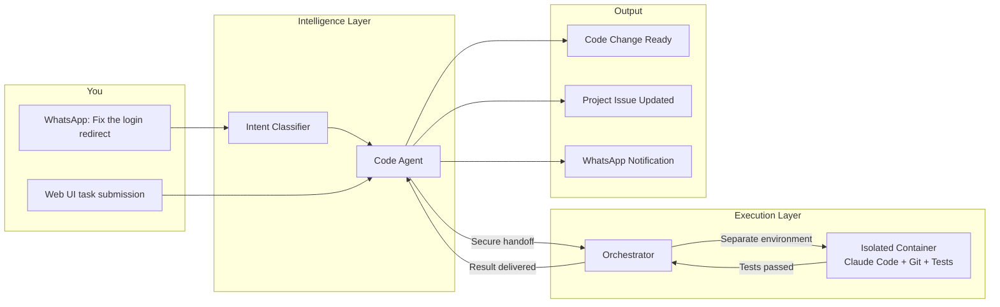
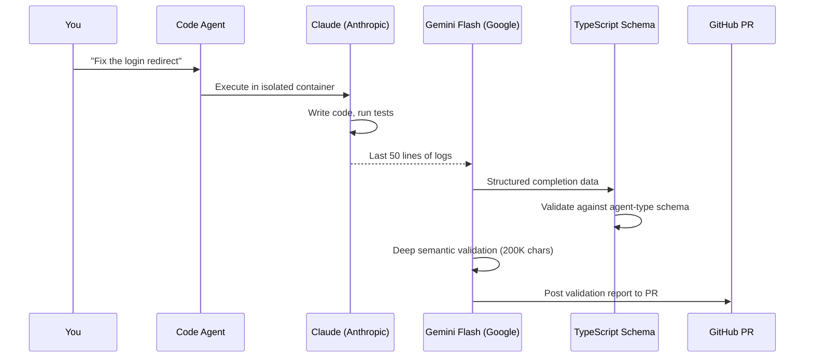
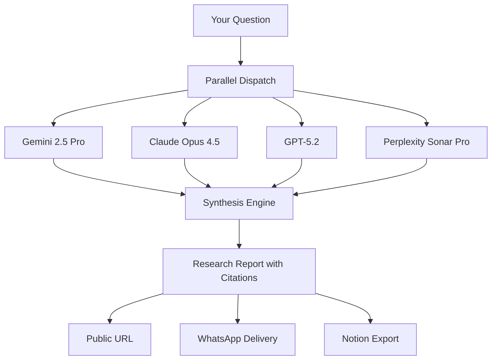
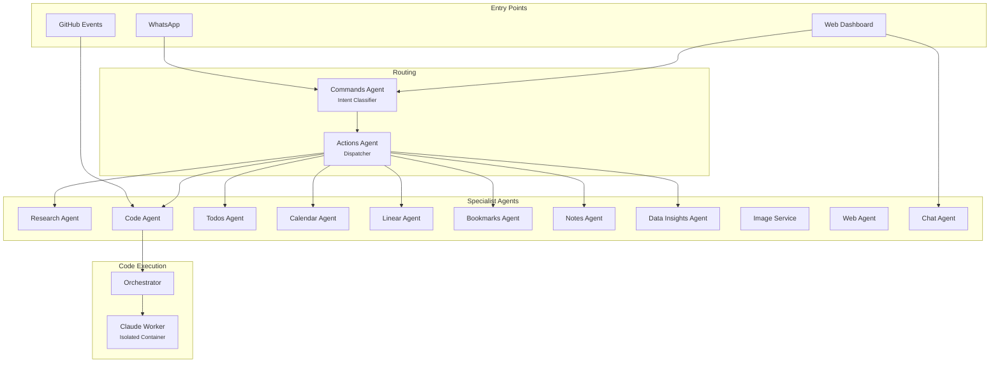

<div align="center">
  <a href="https://intexuraos.cloud/" target="_blank">
    
  </a>

  <p>
    <a href="https://github.com/pbuchman/intexuraos/actions"></a>
    
    
    
    
    
    
    
  </p>
</div>

> 48-component TypeScript monorepo — 20 apps, 6 workers, 22 shared packages — built and maintained by a single developer under strict engineering discipline: 100% branch coverage as a CI gate, cross-LLM verification where no model evaluates its own output, 27 CI verification scripts, and 26 Claude Code hooks enforcing quality at every stage. The system takes a WhatsApp voice note and turns it into a tested pull request. It researches topics across 14 AI models from 5 providers. It schedules, tracks tasks, and manages project issues — all from a single voice or text command.
>
> IntexuraOS does not use AI as a feature. It deploys AI agents that use software as a tool. The platform researches, schedules, manages tasks, and **writes and ships its own code**.

### Engineering Highlights

|                                  |                                                                                                             |
| -------------------------------- | ----------------------------------------------------------------------------------------------------------- |
| **Cross-LLM Verification**       | Writer and verifier are always different providers — Claude executes, Gemini verifies, TypeScript validates |
| **48 Components, One Developer** | 20 apps, 6 workers, 22 packages in a strict TypeScript monorepo                                             |
| **Autonomous Code Pipeline**     | WhatsApp voice note → intent classification → Docker-isolated execution → tested PR                         |
| **Container Isolation**          | Non-root, all capabilities dropped, network-restricted, read-only secrets per task                          |
| **26 Claude Code Hooks**         | 1 SessionStart, 15 PreToolUse, 7 PostToolUse, 3 Stop — enforcing patterns before code is written            |
| **27 CI Verification Scripts**   | Automated gates covering coverage, types, contracts, env vars, and cross-linking                            |
| **Prompt Versioning**            | Semver-versioned prompts with SHA-256 audit trail and CI-enforced bump validation                           |
| **Multi-Provider AI Council**    | 14 models across 5 providers queried in parallel with attributed synthesis                                  |
| **Result Type Discipline**       | Every operation returns typed success or failure — no silent crashes, no unhandled exceptions               |
| **Event-Driven Architecture**    | 41 Pub/Sub topics decoupling 20 services with crash-safe state persistence                                  |

**[The Self-Building System](#the-self-building-system)** · **[Cross-LLM Verification](#cross-llm-verification-pipeline)** · **[The Council of AI](#the-council-of-ai)** · **[Architecture](#architecture)** · **[Engineering Standards](#engineering-standards)** · **[Voice-First Intelligence](#voice-first-intelligence)** · **[Getting Started](#getting-started)** · **[Documentation](#documentation)**

---

## Ambient Task Submission

You submit tasks while walking, while commuting, while thinking of something else. The primary interface is WhatsApp — an app already on your phone, already open, always available. This is not a convenience shortcut to a desktop workflow. It is a fundamentally different interaction model: ambient task submission that fits into the gaps of a working day.

Speak to WhatsApp. IntexuraOS classifies your intent, routes to the right agent, and executes. A voice note about a bug becomes a code task. A question about solid-state batteries becomes a five-model research report. A mention of lunch Friday becomes a calendar event you approve with one tap.

## The Self-Building System

Most AI coding tools wait for you to sit at a keyboard. IntexuraOS does not.

You describe what needs to change — via WhatsApp voice note, text message, or web dashboard. The platform takes it from there: it designs the approach, writes the code inside an isolated container, runs automated tests, creates a code change for review, and updates the project issue. If the first attempt fails verification, it retries with preserved context. The entire pipeline runs without human intervention. You approve the result when you are ready.

Your source code never leaves your network. The coding agent runs on your machine, under your AI subscription, inside containers you control. Any Unix machine becomes a worker station, connected through a single secure outbound connection — no firewall changes, no open ports. No third-party cloud touches your codebase.



### End-to-End: From Voice Note to Research Report

You record a WhatsApp voice note: _"Research the latest developments in solid-state batteries."_ The WhatsApp service transcribes it with domain-aware vocabulary. The commands agent reads the transcript, recognizes a research intent, and classifies it. The actions agent checks the confidence score — well above the auto-execution threshold — and dispatches to the research agent without asking for approval. Five AI models receive the same structured research plan simultaneously. Minutes later, a synthesis arrives with attributed claims, rated disagreements, and full source reports. A WhatsApp notification tells you the results are ready.

The same path works for every domain. A voice note about a bug becomes a code task. A message about lunch Friday becomes a calendar preview you approve with one tap. A shared link becomes an enriched bookmark with an AI summary delivered to your phone. The entry point is always the same — say what you need — and the system decides which specialists handle it, whether to ask permission or act immediately, and how to deliver the result.

### The Code Pipeline

**Step 1 — Planning.** A planning agent analyzes the task, enriches the project issue with technical context, creates subissues for complex work, and labels the issue when the plan is sound.

**Step 2 — Execution.** A strict execution agent picks up the labeled issue, writes code in an isolated container with separate repository copies for each task, runs the full automated test suite, creates a code change for review, and moves the project issue to "In Review."

**Verification.** After each attempt, a completion verifier checks the work against a checklist: Are the right files modified? Do tests pass? Is the code change created? If not, the system resumes with preserved context and tries again. Per-user limits on concurrency, hourly rate, and daily spend keep costs predictable — the estimated cost per task is about $1.17.

### Isolation and Security

Every task runs in its own world:

- **Isolated containers** with all Linux capabilities dropped, non-root execution, no privilege escalation
- **Separate repository copies** so concurrent tasks never interfere with each other
- **Read-only secrets** mounted per task, never shared between tasks
- **Network isolation** blocking cloud metadata endpoints, private IP ranges, and localhost
- **Sensitive file guard** that automatically reverts commits touching credentials or secret keys
- **Verified task requests** — every dispatch is cryptographically signed and checked before it runs

---

## Cross-LLM Verification Pipeline

The system that writes code must not be the system that approves it. IntexuraOS enforces this at the provider level.



**Stage 1 — Execution.** Claude (Anthropic) writes code inside an isolated Docker container, runs the full test suite, and creates a code change.

**Stage 2 — Structured extraction.** Gemini 2.5 Flash (Google) independently extracts structured completion data from the last 50 lines of container logs and validates it against agent-type-specific schemas.

**Stage 3 — Schema validation.** TypeScript validates the extracted data against strict schemas — no untyped pass-through.

**Stage 4 — Deep semantic review.** A second Gemini pass reads up to 200,000 characters of the full session transcript, cross-references the project issue requirements, and posts a [detailed validation report](docs/architecture/webhook-verification-pipeline.md) directly to the GitHub PR.

Neither model evaluates its own work. The writer never sees the verification criteria. The verifier never modifies the code.

---

## The Council of AI

When IntexuraOS needs to research a topic, it does not ask one model and hope for the best. It asks multiple models.

**9 research models across 4 providers** — Google, OpenAI, Anthropic, and Perplexity — each queried in parallel, each reasoning independently, then synthesized into a single report with source attribution and confidence scoring.



Single-model assistants hallucinate. A council of models cross-checks. When three models agree and two disagree, that disagreement is surfaced — not hidden.

---

## Architecture

_This section is for developers and builders evaluating the system internals. As a user, this complexity exists so you do not have to think about it — you say what you need, and the platform routes your request to the right agent automatically._

### From Voice to Merged Code

48 components — 20 services, 6 workers, and 22 shared packages — all in a single repository with strict TypeScript. 24 of these operate as autonomous agents. The architecture exists because one person needed leverage: each agent handles one domain, so research output can feed a code task, a code task result can be pushed to project tracking and WhatsApp simultaneously, and the full loop closes without a human switching tools. No single-domain tool — coding assistant, research chatbot, or project tracker — can replicate this chain.



### Technology Stack

| Layer              | Technologies                                                                 |
| ------------------ | ---------------------------------------------------------------------------- |
| **Runtime**        | Node.js 22, TypeScript 5.7 (strict mode)                                     |
| **Framework**      | Fastify (web framework)                                                      |
| **AI Providers**   | Anthropic, OpenAI, Google AI, Perplexity                                     |
| **AI Tooling**     | Claude Code (autonomous worker), OpenAI (semantic document search)           |
| **Data**           | Firestore, Google Cloud Storage                                              |
| **Messaging**      | Cloud Pub/Sub (real-time message delivery)                                   |
| **Auth**           | Auth0 (login), Google sign-in, Cloudflare Access, signed dispatch            |
| **Infrastructure** | Terraform, Cloud Run, Cloud Functions, Docker, PM2                           |
| **Observability**  | Dash0 (performance monitoring), Sentry (error tracking)                      |
| **Integrations**   | WhatsApp Business API, Linear, GitHub, Google Calendar, Notion, Speechmatics |

### AI Provider Matrix

| Provider       | Models                                                   | Strengths                                                        |
| -------------- | -------------------------------------------------------- | ---------------------------------------------------------------- |
| **Google**     | Gemini 2.5 Pro, Flash, Flash-Image, 2.0 Flash            | Classification, fast operations, image generation                |
| **OpenAI**     | GPT-5.2, O4 Mini Deep Research, GPT-4o Mini, GPT Image 1 | Deep research, synthesis, fast classification, document matching |
| **Anthropic**  | Claude Opus 4.5, Sonnet 4.5, Haiku 3.5                   | Analysis, validation, autonomous coding                          |
| **Perplexity** | Sonar, Sonar Pro, Sonar Deep Research                    | Real-time web search with citations                              |

---

## Engineering Standards

The system writes and ships its own code. That only works if verification is rigorous enough to trust. Every guardrail below exists to make autonomy reliable — so an agent working at 3 AM produces the same quality as a human working at 10 AM.

### 100% Branch Coverage

Not a target. A gate. Every branch in every service is either tested or explicitly exempted with a documented reason. Automated tests fail on any unaccounted branch. No exceptions.

### Strict TypeScript

The compiler is configured to catch what tests might miss. Array access requires fallback handling. Optional properties must be declared precisely. Boolean checks must be explicit. Every operation returns a typed result — success or failure, never silent crashes. The system enforces these rules across all 46 components, so autonomous agents cannot introduce subtle type errors that pass tests but fail in production.

### Automated Cross-Linking

Project tracking issue numbers in a code change title connect to GitHub automatically. Error tracking prefixes on project issues connect to the monitoring system. Every artifact traces back to every other — so when the coding agent creates a change, the full chain from task to deployment is connected without human intervention.

### Infrastructure as Code

Everything in Terraform. No manual cloud console changes. Reproducible, auditable, version-controlled.

### 26 Claude Code Hooks

Every autonomous development session is governed by hooks that fire before and after tool use:

- **1 SessionStart** hook loads project context and enforces development patterns
- **15 PreToolUse** hooks validate inputs, prevent common mistakes, and enforce conventions before actions execute
- **7 PostToolUse** hooks verify outputs, check formatting, and ensure consistency after actions complete
- **3 Stop** hooks run final validations before a session ends

Hooks encode the patterns that would otherwise live only in a developer's head — making autonomous work reproducible.

### 27 CI Verification Scripts

Automated gates that run on every commit, covering:

- Branch coverage enforcement (100% or documented exemption)
- TypeScript strict mode compliance across all 48 components
- API contract validation and cross-service consistency
- Environment variable verification (no missing vars in deployment)
- Cross-linking between project tracking, error monitoring, and code changes
- Prompt version bump enforcement with SHA-256 audit trail

### Prompt Versioning

Every AI prompt in the system is semver-versioned. CI enforces that prompt changes include a version bump. Each version is hashed (SHA-256) and stored, creating an audit trail that answers: what prompt produced this output, and when did it change?

---

## Voice-First Intelligence

You submit tasks while walking, while commuting, while thinking of something else. The primary interface is WhatsApp — an app already on your phone, already open, always available. Cursor and Copilot accelerate a developer at the keyboard. IntexuraOS operates while you are away from one.

| You Say                                            | What Happens                                                      |
| -------------------------------------------------- | ----------------------------------------------------------------- |
| _"Fix the login redirect on Safari"_               | Code Agent dispatches to worker, you get a code change for review |
| _"Research quantum computing with Claude and GPT"_ | Council of AI queries specified models, synthesizes               |
| _"Schedule a sync with engineering Tuesday at 2"_  | Shows preview, waits for approval, then creates event             |
| _"Add a task to review the Q4 report by Friday"_   | Extracts task with priority and deadline                          |
| _"Save this link about TypeScript 5.0"_            | AI-generated summary and preview card                             |
| _"Create a Linear issue for the auth refactor"_    | Issue filed with AI-generated title and description               |
| _"Remind me to follow up with the designer"_       | Reminder created with extracted deadline                          |

**8 action types**: research, todo, note, link, calendar, linear, reminder, code — classified by a 5-step decision tree that isolates URL keywords, detects explicit intent, and supports Polish language input.

**Approval as a design principle.** The system never acts irreversibly without your permission. Calendar events, code tasks, and project tracking changes all pause for your "yes." Reply with text, react with an emoji — "looks good", "go ahead", "nah" all work. High-confidence actions execute immediately; everything else asks first. You stay in control without becoming a bottleneck.

---

<details>
<summary><h2>What's New in v3.4.0</h2></summary>

> See [CHANGELOG.md](CHANGELOG.md) for the complete history.

#### v3.4.0

| Improvement                            | Impact                                                                                          |
| -------------------------------------- | ----------------------------------------------------------------------------------------------- |
| **Hellscript Agent**                   | A new scripting service with backend, web UI, and infrastructure for authoring Hellscript tasks |
| **Merge Queue**                        | Pull requests are queued and auto-merged in order without conflicts                             |
| **Review Agent Plan Awareness**        | Code reviews check whether implementation matches the original plan                             |
| **Cron Agent**                         | Schedule and execute recurring tasks automatically with a dedicated service                     |
| **Merge Conflict Cron Reconciliation** | Conflict detection moved to a dedicated cron job for reliable, non-blocking operation           |

#### v3.3.0

| Improvement                      | Impact                                                                                                                       |
| -------------------------------- | ---------------------------------------------------------------------------------------------------------------------------- |
| **GitHub Agent**                 | A new agent evaluates pull requests using tool calling, with a unified webhook evaluator routing GitHub events automatically |
| **Alibaba Cloud Model Studio**   | Unified integration for Chinese LLMs — Qwen, Kimi, and GLM-5 — via Alibaba Cloud Model Studio, replacing the ZAI provider    |
| **Code Task Detail V2**          | Completely redesigned code task experience with a modern detail page and issue-centric grouped list view                     |
| **Unified PR Automation Log**    | Every action taken on a pull request is now visible in a single, auditable automation log                                    |
| **Structured Output Validation** | GitHub Agent triage produces reliable results with automatic repair prompts when structured output is malformed              |
| **Gemini Tool-Call Mode**        | PR triage enforces Gemini tool-call mode with retry on failure and live pipeline progress display                            |
| **Review Dispatch Overhaul**     | Fresh-start retry logic, notification deduplication, queue support, and per-user default worker type                         |
| **PR Branch Inheritance**        | Code task retries inherit open PR branches so work-in-progress is never lost                                                 |
| **Orchestrator Reliability**     | Deep validation plans from Linear issues, fatal exit code handling, and resume result preservation                           |
| **Mandatory /simplify**          | Every orchestrator workflow now includes a mandatory code simplification step                                                |
| **Planning-Task Gate**           | Autonomous planning only runs on issues explicitly tagged for planning                                                       |
| **Agent-Based Routing**          | Requests automatically routed to the right specialist based on issue labels                                                  |
| **One-Click Implement**          | Planned tasks go from design to pull request with a single button press                                                      |
| **Task Queueing**                | New requests wait in line when workers are busy instead of being dropped                                                     |
| **PR Comment Tasks**             | Leave a comment on a pull request and a code task is created automatically                                                   |
| **More AI Models**               | Qwen, Sonnet, and MiniMax worker types join the coding agent lineup                                                          |
| **WhatsApp Deep Links**          | Tap CTA buttons to navigate directly to tasks and dashboards                                                                 |
| **Auto-Trigger Code Tasks**      | Assign a project issue and the coding agent starts designing immediately                                                     |
| **Smarter Code Execution**       | The agent now plans before writing, reviews its own code twice, and summarizes progress                                      |
| **Secret Stripping**             | API keys and tokens are automatically removed before reaching the coding agent                                               |
| **Faster Verification**          | Full test and check pipeline runs in 3m43s, down from 5 minutes                                                              |
| **Collapsible Log Output**       | Expand and collapse individual tool outputs when watching code tasks live                                                    |

</details>

---

## Getting Started

### For Users

You need three things: a WhatsApp account, a Google account, and a web browser.

1. **Sign up** through the [web app](https://intexuraos.cloud/) and connect your WhatsApp number with a one-time verification code.
2. **Link your Google account** for calendar access.
3. **Send your first message** — typed or spoken — and the system handles it immediately.

The platform provides fallback AI model access, so you can run research, generate bookmarks, and use the chat assistant before configuring your own API keys. For coding tasks, connect a worker machine — any Mac or Linux computer. For project tracking, connect Linear. For research exports, connect Notion. Each integration is optional and independent.

### For Developers

> **Note:** Full setup requires Google Cloud credentials and external service accounts (Auth0, WhatsApp Business, Linear, etc.). See the setup guide below for complete prerequisites.

```bash
# Prerequisites: Node.js 22+, pnpm 9+, Docker
pnpm install
cp .envrc.local.example .envrc.local
direnv allow
pnpm run dev
```

| Service               | URL                        |
| --------------------- | -------------------------- |
| Web App               | http://localhost:3000      |
| API Docs              | http://localhost:8115/docs |
| Firestore Emulator UI | http://localhost:8100      |

Full setup: **[Development Setup Guide](docs/setup/05-local-dev-with-gcp-deps.md)**

---

## Documentation

| Document                                                    | Description                                                         |
| ----------------------------------------------------------- | ------------------------------------------------------------------- |
| **[Platform Overview](docs/overview.md)**                   | What IntexuraOS does — 24 agents, from voice notes to finished code |
| **[Services Catalog](docs/services/index.md)**              | All 20 apps + 6 workers + 22 packages with technical details        |
| **[AI Architecture](docs/architecture/ai-architecture.md)** | Deep dive into 14 models across 5 providers                         |
| **[Setup Guide](docs/setup/01-gcp-project.md)**             | Step-by-step cloud and local environment setup                      |

<details>
<summary><strong>All Services</strong></summary>

| Service                                                                                    | What It Does                                                                    |
| ------------------------------------------------------------------------------------------ | ------------------------------------------------------------------------------- |
| **[code-agent](docs/services/code-agent/features.md)**                                     | Autonomous code execution — design review, code-change lifecycle, cost controls |
| **[orchestrator](docs/services/orchestrator/features.md)**                                 | Container-isolated coding sessions with completion verification                 |
| **[claude-worker](docs/services/claude-worker/features.md)**                               | Pre-configured coding environment inside each container                         |
| **[research-agent](docs/services/research-agent/features.md)**                             | Multi-model research with conflict analysis across 5 providers                  |
| **[web-agent](docs/services/web-agent/features.md)**                                       | Reads web pages for other agents, preserving source language                    |
| **[commands-agent](docs/services/commands-agent/features.md)**                             | 8-category intent classification with URL isolation and Polish support          |
| **[actions-agent](docs/services/actions-agent/features.md)**                               | Confidence-based dispatch — auto-execute or ask for approval                    |
| **[whatsapp-service](docs/services/whatsapp-service/features.md)**                         | Voice transcription, message routing, interactive approval workflows            |
| **[chat-agent](docs/services/chat-agent/features.md)**                                     | In-app AI assistant with documentation Q&A and guest access                     |
| **[calendar-agent](docs/services/calendar-agent/features.md)**                             | Voice-to-calendar with preview, multilingual dates, failed event recovery       |
| **[todos-agent](docs/services/todos-agent/features.md)**                                   | Auto-structured tasks with priority and deadline extraction                     |
| **[notes-agent](docs/services/notes-agent/features.md)**                                   | Tag-based notes from dashboard or voice commands                                |
| **[bookmarks-agent](docs/services/bookmarks-agent/features.md)**                           | Link saving with AI-generated summary and metadata extraction                   |
| **[linear-agent](docs/services/linear-agent/features.md)**                                 | Voice-to-issue with AI-generated titles and urgency mapping                     |
| **[data-insights-agent](docs/services/data-insights-agent/features.md)**                   | AI-powered data visualization from uploads and notification streams             |
| **[mobile-notifications-service](docs/services/mobile-notifications-service/features.md)** | Android notification capture with filtering and pattern discovery               |
| **[user-service](docs/services/user-service/features.md)**                                 | Encrypted API key vault, multi-method auth, provider key validation             |
| **[app-settings-service](docs/services/app-settings-service/features.md)**                 | AI cost tracking per provider, model, and call type                             |
| **[image-service](docs/services/image-service/features.md)**                               | AI-generated cover images for shared research reports                           |
| **[notion-service](docs/services/notion-service/features.md)**                             | Research export to Notion with synthesis and per-model child pages              |
| **[web](docs/services/web/features.md)**                                                   | Real-time dashboard with code streaming, approvals, and share menu              |
| **[vm-lifecycle](docs/services/vm-lifecycle/features.md)**                                 | Weekday auto-start/stop for coding worker machines                              |
| **[log-cleanup](docs/services/log-cleanup/features.md)**                                   | Nightly log rotation in controlled batches                                      |
| **[api-docs-hub](docs/services/api-docs-hub/features.md)**                                 | Unified interactive API reference for all backend services                      |

</details>

---

<details>
<summary><h2>Deliberate Scope Decisions</h2></summary>

IntexuraOS is designed for individual power users who want depth in one workflow over breadth across many.

- **WhatsApp-only mobile** — No SMS, email, or native push. WhatsApp's 24-hour messaging policy means you send the next message to reopen the window.
- **Google Calendar only** — Primary, secondary, and shared calendars. Outlook and Apple Calendar are not connected.
- **Linear for project tracking** — Jira, Asana, and other trackers are not connected.
- **Android for notification capture** — iOS is not supported.
- **English and Polish natively** — Other languages may work through pattern matching but are not explicitly tested.
- **Designed for individual use** — No shared workspaces or team collaboration features.
- **No recurring events or tasks** — Calendar events and todos are single instances. Recurring patterns are not yet built.
- **Two worker machines** — You can configure a primary and a fallback coding worker, but not a larger pool.
- **API keys configured manually** — Connecting AI providers requires generating and pasting keys yourself. The system validates every key before accepting it, but there is no one-click sign-in for most providers.
- **Design review before code execution** — Code tasks pause between design and implementation for your approval. This is a deliberate quality gate, not an optimization to be removed.

</details>

---

## About

IntexuraOS is what happens when a single engineer builds agents that work for him — then builds agents that build agents. The system that verifies code was not written by the system that wrote it.

**Built by [Piotr Buchman](https://www.linkedin.com/in/piotrbuchman/).**

---

<div align="center">
  <sub>20 apps. 6 workers. 22 packages. 14 AI models. 26 hooks. 27 CI scripts. 100% branch coverage. One developer.</sub>
</div>
