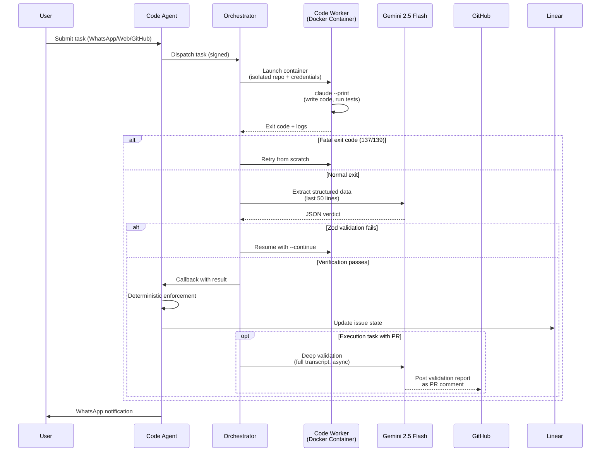

# Webhook Verification Pipeline

## Overview

Claude writes code. Gemini verifies it. Code-agent enforces the result.

Every code task in IntexuraOS passes through a four-stage verification pipeline that separates execution from verification. No model evaluates its own work. The pipeline ensures that autonomous coding tasks produce verifiable, enforceable outcomes — even at 3 AM with no human present.

## The Verification Flow

### Stage 1: Task Execution (Code Worker)

The code-worker runs inside an isolated Docker container with strict security constraints:

- **Non-root execution** — the entrypoint refuses to run as root (`entrypoint.sh:225-228`)
- **Network isolation** — cloud metadata endpoints are blocked (`entrypoint.sh:234-239`)
- **Read-only secrets** — system and user prompts mounted at `/secrets/` (`entrypoint.sh:123-131`)
- **Runtime-specific execution** — `claude --print --verbose --output-format stream-json --dangerously-skip-permissions` or `codex exec --json`, depending on `workerType`
- **Managed attempt mode** — the orchestrator can run multiple attempts via `docker exec` with the `run-attempt` subcommand (`entrypoint.sh:204-217`)

Each container gets a fresh repository copy (via git worktree), its own credentials, and a pre-installed dependency cache. When the task finishes, the entrypoint logs the exit code and terminates lingering child processes.

**Evidence:** `workers/code-worker/entrypoint.sh`

### Stage 2: Completion Verification (Gemini 2.5 Flash)

After Claude finishes, the orchestrator's completion verifier extracts structured data from the session logs using Gemini 2.5 Flash — an entirely different AI provider from the execution model.

**How it works:**

1. Extract the last 50 lines of Claude's log output (`completion-verifier.ts:140-142`, `getLast50Lines()`)
2. Build an agent-type-specific prompt with extraction rules (`completion-verifier.ts:160-248`)
3. Send to Gemini 2.5 Flash for structured JSON extraction (`completion-verifier.ts:397`)
4. Validate the response against one of 4 agent-type-specific Zod schemas (`completion-verifier.ts:83-116`)

**The 4 Zod schemas:**

| Agent Type     | Schema                | Key Fields                                                                             |
| -------------- | --------------------- | -------------------------------------------------------------------------------------- |
| `planning`     | `PLANNING_SCHEMA`     | outcome, linear_url, is_complex, subtask_urls, pr_url (`completion-verifier.ts:83-92`) |
| `execution`    | `EXECUTION_SCHEMA`    | outcome, gh_pr_url, superpowers usage (`completion-verifier.ts:94-100`)                |
| `pull_request` | `PULL_REQUEST_SCHEMA` | gh_pr_url, comments_replied, tracking_comment_id (`completion-verifier.ts:102-107`)    |
| `review`       | `REVIEW_SCHEMA`       | gh_pr_url, review_comments_posted, review_types (`completion-verifier.ts:109-116`)     |

**Retry logic:**

- **Missing fields** (Zod validation fails) → re-launch Claude with preserved context, then re-verify
- **Verifier failure** (Gemini returns no response or unparseable JSON) → retry Gemini verification
- **Fatal exit codes 137/139** (SIGKILL/SIGSEGV) → skip verification entirely, retry Claude from scratch (`completion-verifier.ts:130-138`)
- Retry budget controlled by `CompletionVerifierInput.maxAttempts` (`completion-verifier.ts:14`)

**Model enforcement:** The verifier constructor throws if `config.model !== LlmModels.Gemini25Flash` (`completion-verifier.ts:531-533`). This is not configurable — verification always uses Gemini.

**Evidence:** `workers/orchestrator/src/services/completion-verifier.ts`

### Stage 3: Deep Validation (Gemini 2.5 Flash, execution tasks only)

For execution tasks that produce a PR, a second, deeper validation layer reads the full Claude session transcript and cross-references it against the original Linear issue requirements and plan document.

**Key parameters:**

| Parameter                | Value       | Source                           |
| ------------------------ | ----------- | -------------------------------- |
| Prompt version           | `5.1.0`     | `execution-deep-validator.ts:20` |
| Max transcript chars     | `200,000`   | `execution-deep-validator.ts:22` |
| GitHub comment max chars | `65,536`    | `execution-deep-validator.ts:23` |
| Safety margin            | `512` chars | `execution-deep-validator.ts:24` |

**5 required report sections** (`execution-deep-validator.ts:34-40`):

1. **Overall** — high-level assessment
2. **Claim Verification** — confirms or contradicts the agent's self-reported claims
3. **Contract Verification** — checks mandatory skill sequence was followed
4. **Plan vs Reality** — maps Linear issue requirements to transcript evidence
5. **Anomalies** — errors ignored, fabrication, lazy patterns

**4 severity levels** (`execution-deep-validator.ts:27-32`):

| Level       | Meaning                                                             |
| ----------- | ------------------------------------------------------------------- |
| 🔴 Critical | Blocking issue, fabricated evidence, or complete contract violation |
| 🟠 Warning  | Partial compliance, missed requirement, or ignored error            |
| 🟡 Minor    | Non-blocking observation, minor deviation, or style concern         |
| 🟢 Pass     | Verified, compliant, no issues found                                |

**Output format enforcement:** The validator rejects responses containing bullet lists or numbered lists — only markdown tables are accepted (`execution-deep-validator.ts:358-363`). Each section must contain exactly one markdown table with a header separator row (`execution-deep-validator.ts:429-458`). Reports exceeding the GitHub comment size limit are automatically split into multiple comments (`execution-deep-validator.ts:461-514`).

**Non-blocking execution:** Deep validation runs as fire-and-forget — `void this.executeDeepValidation(...)` (`task-dispatcher.ts:1059`). The main task flow completes and reports back to the code-agent without waiting for the validation report. The report is posted as a PR comment asynchronously.

**Evidence:** `workers/orchestrator/src/services/execution-deep-validator.ts`, `workers/orchestrator/src/services/task-dispatcher.ts:1059`

### Stage 4: Deterministic Enforcement (code-agent)

When the orchestrator calls back to the code-agent with the verified result, four enforcement functions apply deterministic business logic — no AI involved, pure code rules.

**4 enforcement functions** in `webhookRoutes.ts`:

| Function                    | Lines   | What It Enforces                                                                                                                                                                   |
| --------------------------- | ------- | ---------------------------------------------------------------------------------------------------------------------------------------------------------------------------------- |
| `enforcePlanningOutcome`    | 271–471 | Validates Linear issue exists, normalizes state to `todo`, handles complex vs simple plans, validates subtask parent-child relationships, labels issues (`code-task` or `unclear`) |
| `enforceExecutionOutcome`   | 473–642 | Detects routed-vs-reported issue mismatch (the agent claimed to work on issue X but was dispatched for issue Y), comments PR URL, moves issue to `in_review`                       |
| `enforcePullRequestOutcome` | 644–708 | Validates PR URL and comment status, comments on Linear issue, moves to `in_review`                                                                                                |
| `enforceReviewOutcome`      | 710–739 | Validates review_comments_posted is a numeric string, validates review_types is non-empty                                                                                          |

**Issue mismatch detection** is a critical safety feature of `enforceExecutionOutcome`. The function compares the Linear issue the agent was *dispatched* to work on (`task.linearIssueId`) against the issue the agent *claims* it worked on (`executionResult.execution_linear_issue_url`). If these don't match, the enforcement returns error code `EXECUTION_AGENT_WRONG_ISSUE_MISMATCH` and the task is rejected (`webhookRoutes.ts:549-598`).

**Evidence:** `apps/code-agent/src/routes/webhookRoutes.ts:271-739`

## The Cross-LLM Trust Model

The verification pipeline deliberately uses two different AI providers:

| Role                        | Provider             | Model                                        | Why                                                                                   |
| --------------------------- | -------------------- | -------------------------------------------- | ------------------------------------------------------------------------------------- |
| **Execution**               | Anthropic            | Claude (Opus/Sonnet/Haiku via code-worker) | Optimized for autonomous coding — tool use, file editing, test execution              |
| **Completion Verification** | Google               | Gemini 2.5 Flash                             | Fast structured extraction from logs; independent provider prevents self-verification |
| **Deep Validation**         | Google               | Gemini 2.5 Flash                             | Reads full transcript with 200K context; same independence guarantee                  |
| **Enforcement**             | None (deterministic) | Code-agent business logic                    | No AI — pure TypeScript validation of data structures and Linear state                |

**Neither model verifies its own work.** Claude executes. Gemini verifies. Code-agent enforces. The orchestrator is the deterministic coordinator between them — it never interprets results, only routes them.

## Sequence Diagram

## Error Recovery Matrix

| Scenario                           | Detection                                   | Recovery                                           | Max Retries   |
| ---------------------------------- | ------------------------------------------- | -------------------------------------------------- | ------------- |
| Claude crashes (SIGKILL 137)       | `FATAL_EXIT_CODE_PATTERN` regex on logs     | Skip verification, retry from scratch              | `maxAttempts` |
| Claude segfaults (SIGSEGV 139)     | Same pattern + forensics collection         | Same + crash artifacts saved                       | `maxAttempts` |
| Gemini returns no response         | `generated.ok === false`                    | Mark as `verifierFailure`, retry verification      | Per-attempt   |
| Gemini returns unparseable JSON    | `extractAndParseJson` throws                | Same as above                                      | Per-attempt   |
| Zod schema validation fails        | `schema.safeParse` returns `success: false` | Re-launch Claude with `--continue`, re-verify      | `maxAttempts` |
| Agent worked on wrong issue        | `reportedIssueId !== routedIssueId`         | Reject with `EXECUTION_AGENT_WRONG_ISSUE_MISMATCH` | No retry      |
| Deep validation response has lists | `LIST_LINE_REGEX` test                      | Reject report, skip PR comment                     | No retry      |
| Single section exceeds 65KB        | `buildCommentBodies` check                  | Reject report (Gemini must be more concise)        | No retry      |
| Report exceeds 65KB total          | `buildCommentBodies` splitting              | Split into multiple PR comments                    | Automatic     |
