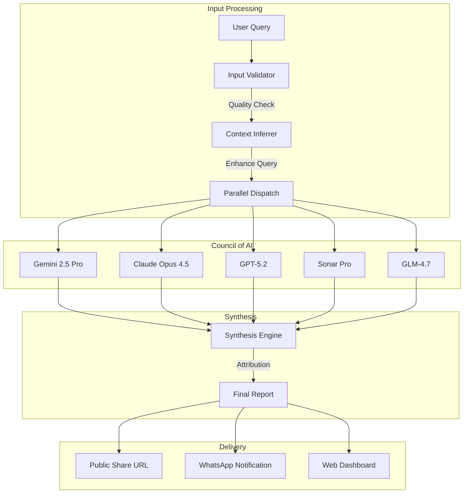
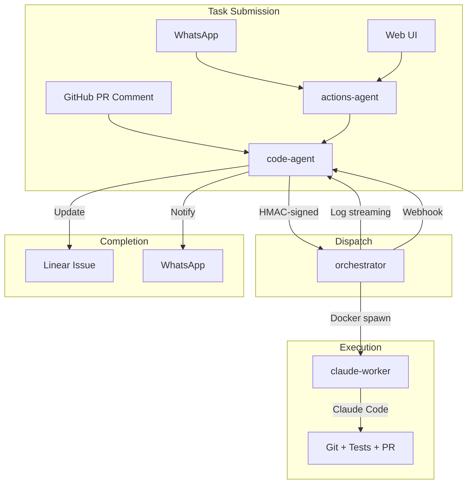
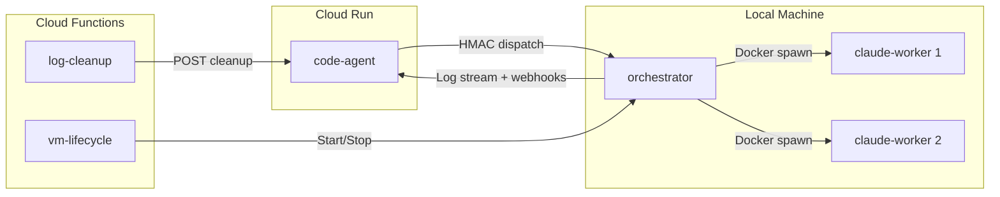
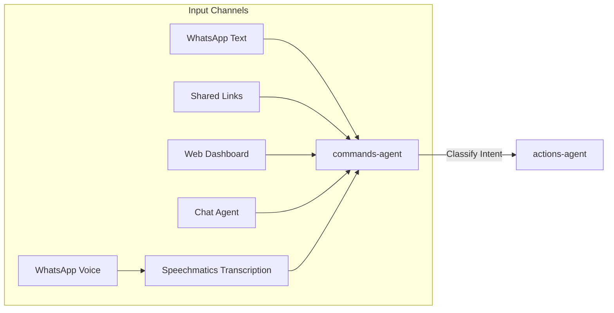
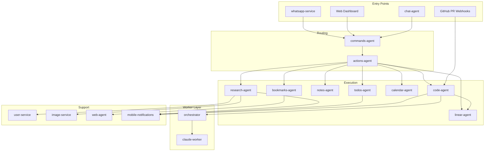

# IntexuraOS Platform Overview

> **The AI-Native Personal Operating System** — An autonomous agent platform that transforms fragmented information into structured intelligence.

**Version 3.0.0** — Updated February 19, 2026

---

## Vision: Intelligence as Infrastructure

IntexuraOS reimagines personal productivity as an **AI-first system**. Instead of building another app that uses AI as a feature, IntexuraOS builds AI agents that use apps as tools.

**The Core Insight**: Your brain excels at creative thinking and decision-making. It struggles with remembering, scheduling, aggregating, and cross-referencing. IntexuraOS handles the cognitive load while you remain the commander.

---

## What's New in v3.0.0

### Autonomous Code Execution Pipeline

This release introduces a complete autonomous coding pipeline, an in-app AI assistant, worker orchestration infrastructure, and a 21-package shared library ecosystem:

**Code Agent (code-agent)**

- Submit coding tasks via WhatsApp or web UI and receive pull requests back
- Multi-layer deduplication (approval event, action ID, SHA-256 dedup key) prevents duplicate work
- Per-user worker infrastructure with encrypted Cloudflare Access credentials and HMAC signing
- Rate limiting with concurrent (3), hourly (10), daily ($20), and monthly ($200) caps
- GitHub PR comment auto-response for `@claude` mentions
- Retry and feedback loops with Linear issue tracking throughout the lifecycle

**Chat Agent (chat-agent)**

- In-app AI assistant for documentation Q&A with source citations
- Command creation through natural conversation with multilingual confirmation (English/Polish)
- Guest access without sign-up using GLM-4.7-Flash at zero cost
- Conversation context preserved across follow-up questions
- RAG-based documentation retrieval with 1536-dimension OpenAI embeddings

**Orchestrator (worker)**

- PM2-based local worker orchestration engine running behind Cloudflare Tunnel
- Docker container isolation with dropped capabilities, memory limits, and read-only secrets
- Git worktree parallelism for concurrent task execution (default: 2 slots)
- Real-time log forwarding to code-agent in 64KB chunks at 3-second intervals
- System prompt phases: Phase 1 (design validation) vs Phase 2 (autonomous execution) based on Linear issue labels
- HMAC-signed webhooks with 3 retries, exponential backoff, and pending queue with 24-hour TTL
- Crash-safe state persistence with startup recovery
- LLM-backed completion verification: Gemini 2.5 Flash checks phase contract blocks, PR presence, and CI status after each attempt
- Per-task turn metrics collection: CPU time, peak memory, token counts from cgroups
- Git identity propagation: host git config injected into containers for correct commit authorship
- Mid-task message injection: messages queued while task runs, delivered at next turn boundary

**Claude Worker (worker)**

- Docker-based sandbox container for Claude Code sessions
- Filesystem sandboxing (worktree at `/repo`, read-only `/secrets`), resource enforcement (4 CPU, 8 GB RAM)
- Non-root execution (UID 1001) with all Linux capabilities dropped
- Three worker types: `opus` (Claude Opus 4.5), `auto` (API-selected), `glm` (ZAI GLM)
- Pre-baked developer toolchain (git, pnpm, ripgrep, fd, bat, jq, terraform, gcloud, gh)
- GitHub token auto-refresh every 30 minutes

**VM Lifecycle (worker)**

- Scheduled VM start/stop on weekday schedule (7 AM start, 11 PM stop, Europe/Warsaw)
- Health-aware startup with automatic restart of unhealthy VMs
- Graceful shutdown with orchestrator coordination (waits for running tasks)

**Log Cleanup (worker)**

- Scheduled daily cleanup of execution logs older than 90 days
- Runs at 3 AM UTC via Cloud Scheduler with configurable retention and batch size

**Package Ecosystem (22 packages)**

- Grew from 6 to 22 shared packages covering core types, HTTP infrastructure, 6 AI provider clients, Pub/Sub, Sentry, OpenTelemetry, and the full LLM toolchain
- `infra-claude`, `infra-gemini`, `infra-glm`, `infra-gpt`, `infra-perplexity` provide standardized AI provider wrappers
- `llm-audit`, `llm-contract`, `llm-factory`, `llm-pricing`, `llm-prompts`, `llm-utils` form the complete LLM management stack
- `infra-otel` provides zero-code OpenTelemetry distributed tracing and metrics export to Dash0 via `--import` side-effect bootstrap

---

## What's New in v2.1.0

### Code Quality & Refactoring Focus

This release consolidates duplicate code, standardizes validation patterns, and improves infrastructure efficiency:

**Internal Clients Package (INT-269)**

- Eliminated ~4,200 lines of duplicate code across 8 services
- Created `@intexuraos/internal-clients` package for shared user-service client
- Standardized HTTP client initialization and API key management

**Zod Schema Validation (INT-218)**

- Migrated all 8 LLM response validations from manual type guards to Zod schemas
- Field-level error messages for easier debugging (e.g., `priority: expected 'low' | 'medium' | 'high', received 'urgent'`)
- Single source of truth for runtime validation and TypeScript types

**Usage Logger Migration (INT-266)**

- All 5 LLM client packages migrated to structured `UsageLogger` class
- Proper dependency injection via constructor
- Removed deprecated `logUsage()` function usage

**Cloud Build Optimization (INT-243)**

- Reduced build costs by 63% ($98/month → $36/month)
- Trade-off: +60% build time increase (7.75 min → 12.4 min)
- All builds remain under 15-minute SLA target

**Bug Fix: Duplicate Approval Messages**

- Fixed race condition causing duplicate WhatsApp notifications after action approval
- Extended direct execution pattern to all action types

---

## What's New in v2.0.0

### WhatsApp Approval Workflow

Approve or reject actions directly from WhatsApp using:

- **Text replies** — "Yes", "Ok", "Reject" with LLM-based intent classification
- **Emoji reactions** — to approve, to reject

### Calendar Preview Before Commit

See exactly what will be created before approving calendar events:

- Event title, time, duration, and all-day detection
- Preview generation via async Pub/Sub workflow
- Users approve with full visibility

### Natural Language Model Selection

Specify LLM models directly in your WhatsApp messages:

- "Research AI using Claude and GPT"
- "Research with all models except Perplexity"
- "Synthesize with Gemini Pro"

### LLM Package Restructuring

Modular architecture with clear separation of concerns:

- `llm-factory` — Provider creation and configuration
- `llm-prompts` — All prompt templates and builders with Zod validation
- `llm-utils` — Shared utilities (redaction, error parsing)

### Linear Board Redesign

New 3-column layout optimized for workflow visibility:

- **Planning** — Todo + Backlog (stacked)
- **In Progress** — In Progress → In Review → To Test
- **Recently Closed** — Done (last 7 days)

---

## What's New Since v3.0.0

### Distributed Tracing and Dev Logging (research-agent v2.4.0)

Research-agent now emits distributed traces to Dash0 via OpenTelemetry and improves local development ergonomics:

- Traces propagate across Pub/Sub, HTTP, and Firestore boundaries — enabled via `INTEXURAOS_DASH0_OTLP_ENDPOINT`
- Powered by `@intexuraos/infra-otel` preloaded via `--import` flag (zero source-code changes)
- PM2 log output colorized and human-readable in development; production JSON logging unchanged

### Research Notion Export (v2.2.0)

Completed research reports can be automatically exported to Notion as structured pages:

- Fire-and-forget export triggers after synthesis completes (or manually via `POST /research/:id/export-notion`)
- Hierarchical page structure: main research page with child LLM report pages
- Markdown-to-Notion block conversion preserving headings, lists, code, bold, italic, and links
- Cover images included in Notion pages
- Configurable target page via export settings UI; duplicate export prevention enforced

### Platform API Key Fallbacks (v2.3.0)

Research-agent now serves users who have not configured their own LLM provider keys:

- **Gemini primary fallback** — `INTEXURAOS_GEMINI_APP_API_KEY` enables `gemini-2.0-flash` for users without a Google API key
- **Zai secondary fallback** — `INTEXURAOS_ZAI_APP_API_KEY` enables `glm-4.7-flash` when Gemini fallback is unavailable
- Fallback ordering: user key → Gemini platform key → Zai platform key → error

### Default Model Selection (user-service)

Users can set a preferred fast model that all agents inherit for quick generation tasks:

- Provider-grouped dropdown in Settings; validated against supported model list
- All subsequent `generate()` calls across every agent default to that model unless overridden
- Works with platform-owned keys — no personal API key required

### OpenTelemetry Distributed Tracing (infra-otel)

New `@intexuraos/infra-otel` package provides zero-code observability across all 20 services:

- Loaded via PM2 `NODE_OPTIONS: '--import @intexuraos/infra-otel/register'` — no source-code changes
- OTLP HTTP export of traces and metrics to Dash0 at 30-second intervals
- Auto-instrumentation for Fastify routes, HTTP/undici calls, DNS, and TCP connections
- Graceful SIGTERM shutdown; disabled entirely when `INTEXURAOS_DASH0_OTLP_ENDPOINT` is unset

---

## The AI Stack

### Multi-Model Intelligence Layer

IntexuraOS integrates with **5 AI providers** and **17 models**, treating them as a **council of experts** rather than a single oracle:

| Provider   | Models                                        | Capabilities                                                    |
| ---------- | --------------------------------------------- | --------------------------------------------------------------- |
| Google     | Gemini 2.5 Pro, Flash, Flash-Image, 2.0 Flash | Reasoning, classification, images, fast internal ops (fallback) |
| OpenAI     | GPT-5.2, o4-mini-deep-research, GPT Image 1   | Deep research, synthesis, images, embeddings (RAG)              |
| Anthropic  | Claude Opus 4.5, Sonnet 4.5, Haiku 3.5        | Analysis, research, validation, autonomous code execution       |
| Perplexity | Sonar, Sonar Pro, Sonar Deep Research         | Web search, real-time information                               |
| Zai        | GLM-4.7, GLM-4.7-Flash                        | Multilingual, lightweight, cost-efficient code tasks            |

### Intelligent Routing

The **commands-agent** uses Gemini 2.5 Flash to classify natural language into action types with a **5-step decision tree** (v2.0.0). In v3.0.0, two new action types were added:

```
"Schedule a call with the team for Tuesday at 3pm"
    → calendar action (confidence: 0.94)

"Remind me to review the quarterly report"
    → todo action (confidence: 0.91)

"What are the latest developments in quantum computing?"
    → research action (confidence: 0.97)

"Fix the login redirect that loops on Safari"
    → code action (v3.0.0: dispatched to autonomous worker)

"Save bookmark https://research-world.com"
    → link action (v2.0.0: URL keywords ignored, explicit intent detected)
```

### Research Synthesis Protocol

The **research-agent** implements a unique **parallel consensus** protocol:



### Autonomous Code Execution Pipeline

The **code-agent** dispatches coding tasks to local worker machines running Claude Code in Docker containers:



---

## Agent Architecture

IntexuraOS deploys **20 apps**, **4 workers**, and **22 packages** — a total of **46 components** across three architectural layers:

### AI Agents (Primary Intelligence)

| Agent                   | AI Capabilities                                                                                            |
| ----------------------- | ---------------------------------------------------------------------------------------------------------- |
| **research-agent**      | Multi-model orchestration, parallel queries, synthesis, Notion export, platform API key fallbacks (v2.3.0) |
| **commands-agent**      | 5-step classification, URL isolation, explicit intent detection (v2.0.0)                                   |
| **code-agent**          | Autonomous code execution, worker dispatch, deduplication, rate limiting (v3.0.0)                          |
| **chat-agent**          | Documentation RAG Q&A, command creation, guest access (v3.0.0)                                             |
| **data-insights-agent** | Data analysis, chart generation, trend detection via LLM                                                   |
| **bookmarks-agent**     | AI summarization with WhatsApp delivery, language preservation (v2.0.0)                                    |
| **todos-agent**         | Natural language task extraction, priority inference                                                       |
| **calendar-agent**      | Preview generation before commit, duration/all-day detection (v2.0.0)                                      |
| **linear-agent**        | 3-column dashboard, Todo/To Test categories (v2.0.0)                                                       |
| **notes-agent**         | Content structuring, tag inference                                                                         |
| **web-agent**           | Separated crawling from LLM summarization, parser+repair pattern (v2.0.0)                                  |

### Infrastructure Services

| Service                          | Purpose                                                                     |
| -------------------------------- | --------------------------------------------------------------------------- |
| **actions-agent**                | Atomic status transitions, race condition prevention via Firestore (v2.0.0) |
| **image-service**                | GPT Image 1 & Gemini Flash Image image generation                           |
| **whatsapp-service**             | Approval via replies/reactions, OutboundMessage correlation (v2.0.0)        |
| **user-service**                 | Rate limit detection precedence, API key validation (v2.0.0)                |
| **mobile-notifications-service** | Push notifications, device management                                       |
| **notion-service**               | Notion integration, sync management                                         |
| **app-settings-service**         | LLM pricing, usage analytics                                                |
| **api-docs-hub**                 | OpenAPI documentation aggregator                                            |
| **web**                          | Progressive Web App (PWA) dashboard                                         |

---

## Worker Architecture

Workers are event-driven components that run outside Cloud Run, either as Cloud Functions (serverless) or as local processes on dedicated machines:

### Workers

| Worker            | Runtime          | Purpose                                                                |
| ----------------- | ---------------- | ---------------------------------------------------------------------- |
| **orchestrator**  | Local (PM2)      | Dispatches code tasks to Docker containers, manages worktrees and logs |
| **claude-worker** | Docker container | Sandboxed Claude Code execution with filesystem and resource isolation |
| **log-cleanup**   | Cloud Function   | Daily retention-based deletion of old execution logs (90-day default)  |
| **vm-lifecycle**  | Cloud Function   | Scheduled VM start/stop with health checks and graceful shutdown       |

### Worker Deployment Model



---

## Package Ecosystem

The monorepo contains **22 shared packages** organized into four layers:

### Core Packages

| Package            | Purpose                                          |
| ------------------ | ------------------------------------------------ |
| `common-core`      | Result types, error codes, redaction utilities   |
| `common-http`      | Fastify plugins, JWT auth, API response helpers  |
| `http-contracts`   | OpenAPI schemas, Fastify JSON schemas            |
| `http-server`      | Health check utilities, validation error handler |
| `internal-clients` | Shared HTTP clients for service-to-service calls |

### Infrastructure Packages

| Package           | Purpose                                                                |
| ----------------- | ---------------------------------------------------------------------- |
| `infra-firestore` | Firestore singleton, fake implementation                               |
| `infra-pubsub`    | Cloud Pub/Sub publisher base class and utilities                       |
| `infra-sentry`    | Sentry integration, `createAppLogger()` factory, OTel log transport    |
| `infra-whatsapp`  | WhatsApp Business API client                                           |
| `infra-notion`    | Notion client, error mapping, connection repo                          |
| `infra-otel`      | OpenTelemetry bootstrap: traces + metrics to Dash0 via `--import` hook |

### AI Provider Packages

| Package            | Provider   | Purpose                   |
| ------------------ | ---------- | ------------------------- |
| `infra-claude`     | Anthropic  | Claude API client wrapper |
| `infra-gemini`     | Google     | Gemini API client wrapper |
| `infra-gpt`        | OpenAI     | GPT API client wrapper    |
| `infra-glm`        | Zai        | GLM API client wrapper    |
| `infra-perplexity` | Perplexity | Sonar API client wrapper  |

### LLM Toolchain Packages

| Package        | Purpose                                           |
| -------------- | ------------------------------------------------- |
| `llm-contract` | Shared types and interfaces for LLM providers     |
| `llm-factory`  | Provider creation and configuration               |
| `llm-prompts`  | Prompt templates and builders with Zod validation |
| `llm-utils`    | Shared utilities (redaction, error parsing)       |
| `llm-pricing`  | Per-model cost calculation and usage aggregation  |
| `llm-audit`    | LLM call audit logging and token usage tracking   |

---

## The Capture-to-Action Pipeline

### Phase 1: Multi-Channel Ingestion



- **WhatsApp Voice**: Audio transcribed via Speechmatics API
- **WhatsApp Text**: Direct message parsing
- **Shared Links**: OpenGraph extraction + AI summarization
- **Web Dashboard**: Direct action creation
- **Chat Agent**: Conversational command creation via in-app assistant (v3.0.0)

### Phase 2: Intelligent Classification

The **commands-agent** analyzes input to determine:

1. **Action Type**: research, todo, note, link, calendar, linear, code (v3.0.0)
2. **Confidence Score**: 0.0 - 1.0 (low confidence = draft for review)
3. **Model Preference**: User's preferred LLM for this task type
4. **Context Extraction**: Dates, priorities, entities

### Phase 3: Specialized Execution

Each agent type executes domain-specific logic:

| Action Type | Agent           | AI Operations                                           |
| ----------- | --------------- | ------------------------------------------------------- |
| Research    | research-agent  | Parallel LLM queries, synthesis, cover generation       |
| Todo        | todos-agent     | Item extraction, priority inference                     |
| Note        | notes-agent     | Content structuring                                     |
| Link        | bookmarks-agent | Summarization, metadata extraction                      |
| Calendar    | calendar-agent  | Date parsing, availability checking                     |
| Linear      | linear-agent    | Issue creation, project mapping                         |
| Code        | code-agent      | Worker dispatch, Docker execution, PR creation (v3.0.0) |

### Phase 4: Notification & Storage

- Results persisted in Firestore (one collection per service)
- WhatsApp notification sent via Pub/Sub
- Web dashboard updated in real-time
- Shareable URLs generated for research
- Live terminal logs streamed for code tasks (v3.0.0)

---

## Event-Driven Architecture

### Pub/Sub Topics

All inter-service communication uses Cloud Pub/Sub:

| Topic                   | Publisher        | Subscriber(s)               | Version |
| ----------------------- | ---------------- | --------------------------- | ------- |
| `commands-ingest`       | whatsapp-service | commands-agent              |         |
| `action-created`        | actions-agent    | research-agent, todos-agent |         |
| `action-approval-reply` | whatsapp-service | actions-agent               | v2.0.0  |
| `calendar-preview`      | actions-agent    | calendar-agent              | v2.0.0  |
| `research-process`      | actions-agent    | research-agent              |         |
| `whatsapp-send`         | All agents       | whatsapp-service            |         |
| `llm-call`              | All LLM services | usage tracking              |         |
| `bookmark-enrich`       | bookmarks-agent  | web-agent                   |         |
| `bookmark-summarize`    | bookmarks-agent  | web-agent                   |         |
| `log-cleanup`           | Cloud Scheduler  | log-cleanup worker          | v3.0.0  |

### Firestore Collections

Each service owns its collections (enforced by CI):

| Collection                   | Owner               | Version |
| ---------------------------- | ------------------- | ------- |
| `researches`                 | research-agent      |         |
| `actions`                    | actions-agent       |         |
| `commands`                   | commands-agent      |         |
| `todos`                      | todos-agent         |         |
| `bookmarks`                  | bookmarks-agent     |         |
| `notes`                      | notes-agent         |         |
| `custom_data_sources`        | data-insights-agent |         |
| `user_settings`              | user-service        |         |
| `calendar_previews`          | calendar-agent      | v2.0.0  |
| `whatsapp_outbound_messages` | whatsapp-service    | v2.0.0  |
| `code_tasks`                 | code-agent          | v3.0.0  |
| `user_usage`                 | code-agent          | v3.0.0  |
| `code_worker_settings`       | code-agent          | v3.0.0  |
| `github-pr-events`           | code-agent          | v3.0.0  |
| `pr_task_locks`              | code-agent          | v3.0.0  |
| `doc_embeddings`             | chat-agent          | v3.0.0  |
| `research_export_settings`   | research-agent      | v2.2.0  |

---

## Service Dependencies



---

## Cost Intelligence

### LLM Usage Tracking

Every LLM call is tracked with:

- Model used
- Input/output tokens
- Cost calculation (per-model pricing)
- User attribution
- Timestamp

### Pricing Transparency

The **app-settings-service** maintains real-time pricing for all 17 models, enabling:

- Pre-execution cost estimates
- Post-execution cost reporting
- Monthly usage analytics
- Per-model cost comparison

### Code Task Cost Controls (v3.0.0)

The **code-agent** enforces per-user cost limits:

- 3 concurrent tasks maximum
- 10 tasks per hour
- $20 daily spend cap
- $200 monthly spend cap

---

## Security & Privacy

### API Key Management

```
User API Keys → AES-256-GCM Encryption → Firestore
                      ↓
            Decrypted at Runtime Only
                      ↓
            Never Logged, Never Stored Unencrypted
```

### Authentication Flow

- **Auth0 Integration**: Device code flow for CLI/WhatsApp
- **Google OAuth**: Calendar and Gmail access
- **Internal Auth**: Service-to-service with `X-Internal-Auth` header
- **Mobile**: Signature-based device authentication
- **HMAC Signing**: Nonce + timestamp + HMAC-SHA256 for worker dispatch (v3.0.0)
- **Cloudflare Access**: Tunnel-based secure connectivity to local workers (v3.0.0)

### Worker Isolation (v3.0.0)

- Docker containers with all Linux capabilities dropped
- Non-root execution (UID 1001) with tmpfs ephemeral home
- Per-task secrets directory (never shared between tasks)
- Network isolation blocking cloud metadata and private IPs
- Sensitive file guard reverts commits touching `.env`, `.pem`, or credentials

---

## Technology Stack

| Layer          | Technology                                         |
| -------------- | -------------------------------------------------- |
| Runtime        | Node.js 22 on Cloud Run                            |
| Framework      | Fastify with OpenAPI                               |
| Workers        | Cloud Functions, Docker, PM2 (v3.0.0)              |
| Database       | Firestore (NoSQL)                                  |
| Storage        | Google Cloud Storage                               |
| Messaging      | Cloud Pub/Sub                                      |
| AI Providers   | Google, OpenAI, Anthropic, Perplexity, Zai         |
| AI Tooling     | Claude Code (autonomous worker), OpenAI Embeddings |
| Transcription  | Speechmatics                                       |
| Authentication | Auth0, Google OAuth, Cloudflare Access             |
| Infrastructure | Terraform, GCE Spot VMs, Cloudflare Tunnels        |
| Observability  | OpenTelemetry (traces + metrics), Dash0, Sentry    |
| Monorepo       | pnpm workspaces (22 packages)                      |
| Language       | TypeScript 5.7 (strict mode)                       |

---

## Services Quick Reference

### By AI Capability

**Multi-Model Orchestration**

- [research-agent](services/research-agent/features.md) - Parallel LLM research with synthesis

**Autonomous Code Execution**

- [code-agent](services/code-agent/features.md) - Worker dispatch, Docker isolation, PR creation (v3.0.0)
- [orchestrator](services/orchestrator/features.md) - Local task orchestration with Claude Code (v3.0.0)
- [claude-worker](services/claude-worker/features.md) - Sandboxed Docker execution environment (v3.0.0)

**Conversational AI**

- [chat-agent](services/chat-agent/features.md) - Documentation Q&A and command creation (v3.0.0)

**Intent Classification**

- [commands-agent](services/commands-agent/features.md) - Natural language to action routing

**Data Analysis**

- [data-insights-agent](services/data-insights-agent/features.md) - AI-powered data visualization

**Image Generation**

- [image-service](services/image-service/features.md) - GPT Image 1 and Gemini Flash Image

**Content Intelligence**

- [bookmarks-agent](services/bookmarks-agent/features.md) - AI link summarization
- [web-agent](services/web-agent/features.md) - Web scraping with AI

**Task Intelligence**

- [todos-agent](services/todos-agent/features.md) - Natural language task extraction

### By Integration

**External APIs**

- [whatsapp-service](services/whatsapp-service/features.md) - WhatsApp Business API
- [calendar-agent](services/calendar-agent/features.md) - Google Calendar
- [notion-service](services/notion-service/features.md) - Notion API
- [linear-agent](services/linear-agent/features.md) - Linear API
- [code-agent](services/code-agent/features.md) - GitHub API (v3.0.0)

**Infrastructure**

- [actions-agent](services/actions-agent/features.md) - Action orchestration
- [user-service](services/user-service/features.md) - Auth & settings
- [mobile-notifications-service](services/mobile-notifications-service/features.md) - Push notifications
- [api-docs-hub](services/api-docs-hub/features.md) - API documentation

**Workers**

- [orchestrator](services/orchestrator/features.md) - Code task orchestration (v3.0.0)
- [claude-worker](services/claude-worker/features.md) - Docker sandbox (v3.0.0)
- [log-cleanup](services/log-cleanup/features.md) - Log retention management (v3.0.0)
- [vm-lifecycle](services/vm-lifecycle/features.md) - VM schedule management (v3.0.0)

---

## Documentation Index

| Document                                              | Purpose                                          |
| ----------------------------------------------------- | ------------------------------------------------ |
| [AI Architecture](architecture/ai-architecture.md)    | Deep dive into LLM integration                   |
| [Services Catalog](services/index.md)                 | All 20 apps + 4 workers + 22 packages documented |
| [Architecture Patterns](architecture/)                | System design decisions                          |
| [Setup Guide](setup/01-gcp-project.md)                | Getting started                                  |
| [API Contracts](architecture/api-contracts.md)        | HTTP API standards                               |
| [Pub/Sub Standards](architecture/pubsub-standards.md) | Event messaging patterns                         |

---

**Last updated:** 2026-02-19 (v3.0.0 + v2.4.0 distributed tracing + orchestrator completion verification)
