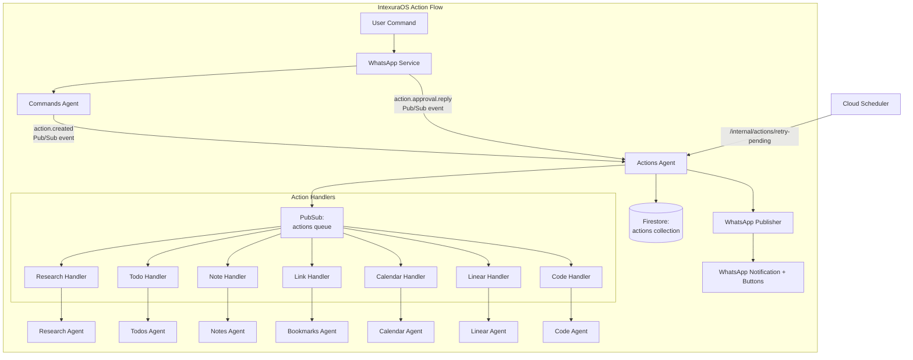
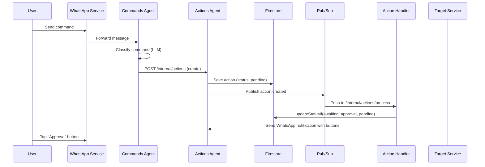
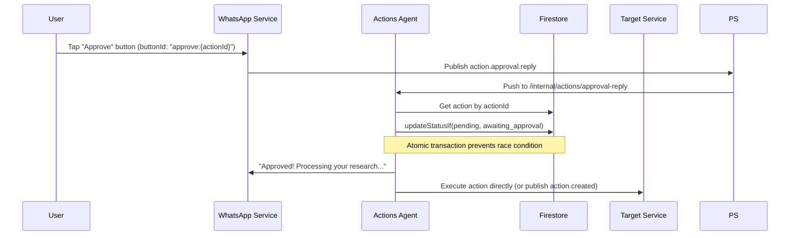
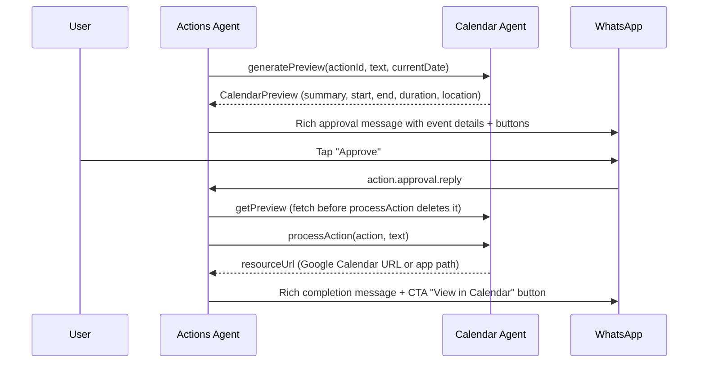

# Actions Agent — Technical Reference

## Overview

Actions-agent is the central action lifecycle management service for IntexuraOS. It receives classified commands from commands-agent, maintains action state in Firestore, routes actions to appropriate handlers via Pub/Sub, and tracks execution status. It supports confidence-based auto-execution, WhatsApp interactive button approval, calendar previews, code task dispatch, worker type detection from natural language, and type correction tracking.

## Architecture



## Recent Changes

| Commit      | Description                                                                | Date       |
| ----------- | -------------------------------------------------------------------------- | ---------- |
| `62870df9`  | Address PR review comments for worker type detection                       | 2026-03-21 |
| `784de2ab`  | Detect worker type from message keywords in code actions                   | 2026-03-21 |
| `fe7b7244`  | Inject logger in commandsAgentHttpClient and fix blank lines               | 2026-03-18 |
| `1f5d1cad`  | Audit sibling HTTP clients for same optional-logger pattern                | 2026-03-18 |
| `4fb483d3`  | Make logger required in LinearAgentHttpClientConfig                        | 2026-03-18 |
| `ab3c016f`  | Condense handleAction template to meet 80-line acceptance criteria         | 2026-03-18 |
| `fac2d792`  | Address code review feedback for handleAction template                     | 2026-03-18 |
| `882aa91f`  | Fix leaky abstraction in handleActionTemplate                              | 2026-03-18 |
| `22018d1b`  | Extract shared handleAction template (INT-887)                             | 2026-03-18 |
| `eb94ab98`  | Extract auth middleware from internalRoutes.ts (INT-888)                   | 2026-03-17 |
| `72887a79`  | Add v8 ignore comments for uncovered template branches                     | 2026-03-16 |
| `0839daab`  | Extract shared executeAction template (INT-885)                            | 2026-03-16 |
| `a6325fe0`  | Split handleApprovalReply.ts into approval/ modules (INT-884)              | 2026-03-16 |
| `295a0485`  | Extract PATCH handler business logic to updateActionUseCase (INT-914)      | 2026-03-16 |

### Shared handleAction Template (INT-887)

Extracted common logic (logging, auto-execution, WhatsApp approval notification) from all 7 `handle*Action` use cases into `handleActionTemplate.ts`. Each handler now provides only a `buildMessage` function and optional `extraButtons`/`preProcess`/`onAutoExecuteSuccess` callbacks. Template is under 80 lines. Eliminates duplicated auto-execution gating, WhatsApp publishing, and correlation ID construction.

### Shared executeAction Template (INT-885)

Extracted common workflow (get action, null check, idempotency for completed actions, status validation, update to processing, call service, handle failure/success, send WhatsApp notification) into `executeActionTemplate.ts`. Used by executeResearchAction, executeTodoAction, executeNoteAction, executeCalendarAction, and executeLinearAction. executeLinkAction and executeCodeAction are not migrated due to significant deviations (URL extraction logic in link, special error handling in code).

### Auth Middleware Extraction (INT-888)

Extracted `validatePubSubOrInternalAuth` into `pubsubAuth.ts` and `decodePubSubMessage` into `decodePubSubMessage.ts`. Removes repeated auth/decode patterns from internalRoutes.ts.

### updateAction Use Case (INT-914)

Extracted PATCH `/actions/:actionId` business logic (action lookup, ownership check, type change delegation, status update) from the route handler into `updateAction.ts` use case. The route handler now calls `updateActionUseCase` and returns its result.

### Approval Module Decomposition (INT-884)

Split `handleApprovalReply.ts` from a single large file into `approval/` submodules: `types.ts`, `handleButtonResponse.ts`, `handleCancelTaskButton.ts`, `handleProceedToImplementationButton.ts`, `executeActionByType.ts`, `executeRejection.ts`. The main file now orchestrates these modules.

### Logger Injection in HTTP Clients (INT-889)

All HTTP client configurations (`commandsAgentHttpClient`, `linearAgentHttpClient`, `calendarServiceHttpClient`, `codeAgentHttpClient`) now require a `logger` parameter. Previously optional or absent.

### Worker Type Detection from Keywords

Added `detectWorkerTypeFromMessage` in `domain/utils/workerTypeDetection.ts`. Scans the user's message for patterns like "use opus", "use sonnet", etc. Automatically builds rules from the `CODE_TASK_WORKER_TYPES` array — adding a new worker type to the array requires no code change in the detection logic. Returns `undefined` if zero or multiple matches (ambiguous).

## Data Flow

### Standard Action Flow



### Approval Reply Flow (button-based)



### Calendar Action Flow (synchronous preview)



## API Endpoints

### Public Endpoints

| Method | Path                                   | Description                            | Auth         |
| ------ | -------------------------------------- | -------------------------------------- | ------------ |
| GET    | `/actions`                             | List actions for authenticated user    | Bearer token |
| PATCH  | `/actions/:actionId`                   | Update action status or type           | Bearer token |
| DELETE | `/actions/:actionId`                   | Delete an action                       | Bearer token |
| POST   | `/actions/batch`                       | Fetch multiple actions by IDs (max 50) | Bearer token |
| POST   | `/actions/:actionId/execute`           | Synchronously execute an action        | Bearer token |
| GET    | `/actions/:actionId/preview`           | Get calendar action preview            | Bearer token |
| POST   | `/actions/:actionId/resolve-duplicate` | Skip or update duplicate bookmark      | Bearer token |

### Internal Endpoints

| Method | Path                                   | Description                                      | Auth                    |
| ------ | -------------------------------------- | ------------------------------------------------ | ----------------------- |
| POST   | `/internal/actions`                    | Create new action from classification            | Internal header or OIDC |
| POST   | `/internal/actions/:actionType`        | Process action from Pub/Sub (type-specific)      | Pub/Sub OIDC            |
| POST   | `/internal/actions/process`            | Process action from Pub/Sub (unified)            | Pub/Sub OIDC            |
| POST   | `/internal/actions/retry-pending`      | Retry actions stuck in pending (Cloud Scheduler) | OIDC or Internal        |
| POST   | `/internal/actions/approval-reply`     | Handle WhatsApp button taps                      | Pub/Sub OIDC            |
| PATCH  | `/internal/actions/:actionId/status`   | Update action resource status                    | Internal header         |

## Domain Models

### Action

| Field             | Type                    | Description                             |
| ----------------- | ----------------------- | --------------------------------------- |
| `id`              | string (UUID)           | Unique action identifier                |
| `userId`          | string                  | User who owns the action                |
| `commandId`       | string                  | Original command ID from commands-agent |
| `type`            | ActionType              | Classification result                   |
| `confidence`      | number (0–1)            | Classification confidence score         |
| `title`           | string                  | Action title/description                |
| `status`          | ActionStatus            | Current lifecycle state                 |
| `payload`         | Record<string, unknown> | Action-specific data                    |
| `resource_status` | ResourceStatus (opt)    | Status of associated resource           |
| `resource_error`  | string (optional)       | Error message from resource execution   |
| `createdAt`       | string (ISO 8601)       | Creation timestamp                      |
| `updatedAt`       | string (ISO 8601)       | Last update timestamp                   |

### ActionType Enum

| Value      | Handler                     | Auto-Execute |
| ---------- | --------------------------- | ------------ |
| `todo`     | HandleTodoActionUseCase     | Yes (>= 90%) |
| `research` | HandleResearchActionUseCase | Yes (>= 90%) |
| `note`     | HandleNoteActionUseCase     | Yes (>= 90%) |
| `link`     | HandleLinkActionUseCase     | Yes (>= 90%) |
| `calendar` | HandleCalendarActionUseCase | Yes (>= 90%) |
| `linear`   | HandleLinearActionUseCase   | No           |
| `code`     | HandleCodeActionUseCase     | Yes (>= 90%) |
| `reminder` | Not implemented             | N/A          |

### ActionStatus Enum

| Value               | Description                            |
| ------------------- | -------------------------------------- |
| `pending`           | Approved and ready for processing      |
| `awaiting_approval` | Low confidence, requires user approval |
| `processing`        | Handler is executing                   |
| `completed`         | Successfully executed                  |
| `failed`            | Execution failed                       |
| `rejected`          | User rejected the action               |
| `archived`          | No longer relevant                     |

### ApprovalMessage

| Field         | Type              | Description                           |
| ------------- | ----------------- | ------------------------------------- |
| `id`          | string (UUID)     | Firestore document ID                 |
| `wamid`       | string            | WhatsApp message ID (indexed)         |
| `actionId`    | string            | Reference to action awaiting approval |
| `userId`      | string            | User who should approve/reject        |
| `sentAt`      | string (ISO 8601) | When approval request was sent        |
| `actionType`  | ActionType        | Action type for logging               |
| `actionTitle` | string            | Action title for logging              |

### ApprovalReplyEvent (button-based)

| Field          | Type              | Description                                       |
| -------------- | ----------------- | ------------------------------------------------- |
| `type`         | string            | Always `action.approval.reply`                    |
| `replyToWamid` | string            | Original approval message wamid                   |
| `replyText`    | string            | User's reply text (may be empty for button taps)  |
| `userId`       | string            | User ID                                           |
| `timestamp`    | string (ISO 8601) | Reply timestamp                                   |
| `actionId`     | string (optional) | Action ID extracted from correlation ID           |
| `buttonId`     | string (optional) | Button ID (see Button ID Formats below)           |
| `buttonTitle`  | string (optional) | User-visible text of the clicked button           |

### Button ID Formats

| Format                                  | Purpose                                      |
| --------------------------------------- | -------------------------------------------- |
| `approve:{actionId}`                    | Approve the action                           |
| `reject:{actionId}`                     | Reject the action                            |
| `cancel:{actionId}`                     | Cancel (same as reject)                      |
| `convert:{actionId}`                    | Reject + convert to Linear issue             |
| `cancel-task:{taskId}:{nonce}`          | Cancel running code task (one-time token)    |
| `view-task:{taskId}`                    | View code task URL                           |
| `proceed-implementation:{taskId}`       | Proceed to phase 2 implementation (INT-628)  |

### ApprovalIntent

| Value     | Description                      |
| --------- | -------------------------------- |
| `approve` | User approved the action         |
| `reject`  | User rejected the action         |
| `unclear` | Button re-sent (no LLM fallback) |

### ResourceStatus

| Value         | Description                              |
| ------------- | ---------------------------------------- |
| `dispatched`  | Code task sent to code-agent             |
| `running`     | Code task executing                      |
| `completed`   | Code task finished successfully          |
| `failed`      | Code task failed                         |
| `cancelled`   | Code task cancelled by user              |
| `interrupted` | Code task interrupted (e.g., VM stopped) |

### CodeActionPayload

| Field              | Type               | Description                                                         |
| ------------------ | ------------------ | ------------------------------------------------------------------- |
| `prompt`           | string             | User's request (what they want Claude to do)                        |
| `workerType`       | CodeTaskWorkerType | Which model to use: auto, opus, sonnet, minimax, glm, qwen, or kimi |
| `linearIssueId`    | string (optional)  | Existing Linear issue to work on                                    |
| `linearIssueTitle` | string (optional)  | Title of the Linear issue                                           |
| `approvalEventId`  | string (optional)  | UUID for idempotency (set on approval)                              |
| `resource_url`     | string (optional)  | URL of created code task (set by code-agent)                        |

### ActionTransition

| Field                | Type              | Description                 |
| -------------------- | ----------------- | --------------------------- |
| `id`                 | string (UUID)     | Unique transition ID        |
| `userId`             | string            | User who made correction    |
| `actionId`           | string            | Reference to action         |
| `commandId`          | string            | Original command ID         |
| `commandText`        | string            | Original command text       |
| `originalType`       | ActionType        | Original type               |
| `newType`            | ActionType        | Corrected type              |
| `originalConfidence` | number            | Original confidence score   |
| `createdAt`          | string (ISO 8601) | When correction occurred    |

## Key Use Cases

### handleActionTemplate (INT-887)

Shared template factory for all 7 `handle*Action` use cases. Extracts common logic: logging, auto-execution gating via `shouldAutoExecute`, WhatsApp approval notification with interactive buttons.

**Configuration interface:**

```typescript
interface HandleActionConfig {
  actionType: string;
  buildMessage: (event, webAppUrl, preProcessData?) => string;
  extraButtons?: (event) => WhatsAppInteractiveButton[];
  preProcess?: (event, deps) => Promise<Record<string, unknown> | undefined>;
  onAutoExecuteSuccess?: (result, event, logger) => void;
}
```

Each handler provides a `buildMessage` function and optional hooks. The template handles auto-execution (if `executeAction` dependency is injected and confidence >= 90%), WhatsApp message construction with `buildApprovalButtons`, and non-fatal notification failure handling.

### executeActionTemplate (INT-885)

Shared template for execute use cases. Handles the common workflow: get action by ID, null check, idempotency for completed actions, status validation, update to processing, call service, handle failure, handle success, send WhatsApp notification if `resourceUrl` exists.

**Not migrated:** `executeLinkAction` (URL extraction logic) and `executeCodeAction` (WORKER_UNAVAILABLE/DUPLICATE error handling) due to significant deviations.

### handleApprovalReply

Processes WhatsApp button taps for action approval. All approval intents are resolved deterministically via WhatsApp interactive buttons — no LLM classification. Decomposed into `approval/` submodules (INT-884):

- `handleButtonResponse.ts` — Routes button IDs to approve/reject/convert/cancel handlers
- `handleCancelTaskButton.ts` — Code task cancellation with nonce validation
- `handleProceedToImplementationButton.ts` — Phase 2 implementation dispatch (INT-628)
- `executeActionByType.ts` — Dispatches execution to the correct type-specific executor
- `executeRejection.ts` — Handles action rejection and WhatsApp notification
- `types.ts` — Shared types (`ApprovalIntent`, `ApprovalReplyResult`)

**Flow:**

1. Receive `action.approval.reply` event from whatsapp-service
2. If `buttonId` starts with `cancel-task:` — handle code task cancellation (no action lookup needed)
3. If `buttonId` starts with `proceed-implementation:` — submit task to phase 2 via code-agent (INT-628)
4. Look up action by `actionId` (from correlationId) or `replyToWamid` (from approval_messages)
5. If action not found (deleted/expired) — return 200 with WhatsApp notification (prevents Pub/Sub retry)
6. Verify user ownership and action is not in terminal state
7. If `buttonId` present — dispatch to `handleButtonResponse` for deterministic intent resolution
8. If text reply (no button) — re-send approval buttons via WhatsApp

**Race Condition Prevention:**

```typescript
const updateResult = await actionRepository.updateStatusIf(
  action.id,
  'pending', // new status
  'awaiting_approval' // expected current status
);

if (updateResult.outcome === 'status_mismatch') {
  // Another handler already processed this - idempotent return
  return ok({ matched: true, actionId: action.id });
}
```

### updateAction (INT-914)

Handles the PATCH `/actions/:actionId` business logic. Fetches action, verifies ownership, delegates type changes to `changeActionTypeUseCase`, and persists status changes.

### handleCalendarAction

Processes calendar action creation requests. Generates a synchronous preview via HTTP call to calendar-agent and includes it in the WhatsApp approval message.

**Flow:**

1. Check if action should be auto-executed via `shouldAutoExecute`
2. If auto-execute: call `executeCalendarAction` directly
3. Otherwise: compute current date with day of week (for relative date parsing)
4. Call `calendarServiceClient.generatePreview` synchronously
5. Format rich approval message with event details via `formatCalendarApprovalMessage`
6. Send WhatsApp approval notification with interactive buttons

### executeCalendarAction

Executes calendar actions by delegating to calendar-agent.

**Flow:**

1. Retrieve action from repository
2. Validate action status
3. Fetch preview BEFORE `processAction` (calendar-agent deletes preview after event creation)
4. Call `calendarServiceClient.processAction` with the action
5. On success: store `resource_url` in payload (may be absolute Google Calendar URL or relative app path)
6. Format rich completion message via `formatCalendarCompletionMessage` (event title, date, time, duration, location)
7. Send WhatsApp notification with CTA button ("View in Calendar" linking to the event URL)

### shouldAutoExecute

Determines whether an action should be auto-executed based on classification confidence. The threshold is 90% (`>= 0.9`). This function is type-agnostic — any action type can auto-execute. However, auto-execution only occurs when the handler injects an `executeAction` dependency. All types except `linear` and `reminder` support auto-execution.

### detectWorkerTypeFromMessage

Scans user message text for "use {workerType}" patterns. Dynamically builds regex rules from the `CODE_TASK_WORKER_TYPES` constant — new worker types are automatically supported with no code change. Returns `undefined` if zero matches or ambiguous (multiple matches).

### changeActionType

Allows users to correct AI classification. Validates the action is in a mutable status (`pending`, `awaiting_approval`, `failed`), fetches the original command text from commands-agent, logs the transition to `actions_transitions` for ML training, and updates the action type.

### retryPendingActions

Scheduled by Cloud Scheduler to find and re-process actions stuck in `pending` status for over 1 hour. Re-publishes `action.created` events to trigger handler processing. Skips actions with no registered handler and actions younger than the threshold.

### createIdempotentActionHandler

Wraps action handlers with idempotency protection to prevent duplicate WhatsApp notifications.

```typescript
const handler = registerActionHandler(createHandleXxxActionUseCase, deps);
// Internally calls updateStatusIf(awaiting_approval, [pending, failed])
// before invoking the wrapped handler
```

## Pub/Sub Events

### Published

| Event Type       | Topic           | Payload              |
| ---------------- | --------------- | -------------------- |
| `action.created` | `actions` queue | `ActionCreatedEvent` |

### Subscribed

| Event Type              | Subscription       | Handler                            |
| ----------------------- | ------------------ | ---------------------------------- |
| `action.created`        | `actions-queue`    | `/internal/actions/process`        |
| `action.approval.reply` | `approval-replies` | `/internal/actions/approval-reply` |

### Published (via shared publishers)

| Event Type            | Topic           | Purpose               |
| --------------------- | --------------- | --------------------- |
| WhatsApp send message | `whatsapp-send` | Notification delivery |

## Dependencies

### Internal Services

| Service                | Purpose                                                                                       |
| ---------------------- | --------------------------------------------------------------------------------------------- |
| `commands-agent`       | Fetch command text for type transitions, create new commands                                  |
| `research-agent`       | Execute research actions                                                                      |
| `todos-agent`          | Execute todo actions                                                                          |
| `notes-agent`          | Execute note actions                                                                          |
| `bookmarks-agent`      | Execute link actions, force-refresh duplicate bookmarks                                       |
| `calendar-agent`       | Execute calendar actions, generate previews, fetch previews                                   |
| `linear-agent`         | Execute Linear issue creation actions                                                         |
| `code-agent`           | Execute code tasks, cancel tasks, submit to phase 2 implementation                            |
| `user-service`         | Fetch user API keys for LLM (via `@intexuraos/internal-clients/user-service`)                 |
| `app-settings-service` | Fetch LLM pricing configuration at startup                                                    |

### Infrastructure

| Component                                    | Purpose                            |
| -------------------------------------------- | ---------------------------------- |
| Firestore (`actions` collection)             | Action persistence                 |
| Firestore (`actions_transitions` collection) | Type correction tracking           |
| Firestore (`approval_messages` collection)   | WhatsApp message to action mapping |
| Pub/Sub (`actions` queue)                    | Event distribution                 |
| Pub/Sub (`whatsapp-send`)                    | Notification delivery              |
| Pub/Sub (`approval-replies`)                 | Approval reply events              |

## Configuration

| Environment Variable                     | Required | Description                                               |
| ---------------------------------------- | -------- | --------------------------------------------------------- |
| `INTEXURAOS_GCP_PROJECT_ID`              | Yes      | Google Cloud project ID                                   |
| `INTEXURAOS_AUTH_JWKS_URL`               | Yes      | Auth0 JWKS URL for JWT validation                         |
| `INTEXURAOS_AUTH_ISSUER`                 | Yes      | Auth0 issuer                                              |
| `INTEXURAOS_AUTH_AUDIENCE`               | Yes      | Auth0 audience                                            |
| `INTEXURAOS_RESEARCH_AGENT_URL`          | Yes      | Research-agent base URL                                   |
| `INTEXURAOS_USER_SERVICE_URL`            | Yes      | User-service base URL                                     |
| `INTEXURAOS_COMMANDS_AGENT_URL`          | Yes      | Commands-agent base URL                                   |
| `INTEXURAOS_TODOS_AGENT_URL`             | Yes      | Todos-agent base URL                                      |
| `INTEXURAOS_NOTES_AGENT_URL`             | Yes      | Notes-agent base URL                                      |
| `INTEXURAOS_BOOKMARKS_AGENT_URL`         | Yes      | Bookmarks-agent base URL                                  |
| `INTEXURAOS_CALENDAR_AGENT_URL`          | Yes      | Calendar-agent base URL                                   |
| `INTEXURAOS_LINEAR_AGENT_URL`            | Yes      | Linear-agent base URL                                     |
| `INTEXURAOS_CODE_AGENT_URL`              | Yes      | Code-agent base URL                                       |
| `INTEXURAOS_APP_SETTINGS_SERVICE_URL`    | Yes      | App settings service URL (for LLM pricing)                |
| `INTEXURAOS_INTERNAL_AUTH_TOKEN`         | Yes      | Shared secret for service-to-service calls                |
| `INTEXURAOS_PUBSUB_ACTIONS_QUEUE`        | Yes      | Unified actions queue topic name                          |
| `INTEXURAOS_PUBSUB_WHATSAPP_SEND_TOPIC`  | Yes      | WhatsApp send topic                                       |
| `INTEXURAOS_WEB_APP_URL`                 | Yes      | Web app URL for notification links                        |
| `INTEXURAOS_GEMINI_APP_API_KEY`          | No       | Gemini platform API key for LLM fallback via user service |

## Gotchas

**Unified queue routing**: The `/internal/actions/process` endpoint receives all action types and dynamically selects handlers. Unknown types are ignored (action stays pending) rather than failing.

**Pub/Sub authentication**: Pub/Sub push requests use OIDC tokens validated by Cloud Run. Direct service calls use `X-Internal-Auth` header. Both paths are supported via `validatePubSubOrInternalAuth` (extracted to `pubsubAuth.ts`).

**Action type correction**: When user changes action type, the old type is logged to `actions_transitions` for ML training data.

**Duplicate link handling**: Link actions may fail with `existingBookmarkId` in payload. Use `/actions/:id/resolve-duplicate` to skip or refresh the existing bookmark.

**Batch endpoint limit**: Maximum 50 action IDs per batch request to prevent abuse.

**Reminder actions**: The reminder type is defined in the enum but has no handler. Actions of this type remain in pending status indefinitely.

**Auto-execution threshold**: All action types with confidence >= 90% are auto-executed immediately via `shouldAutoExecute()`. The function is purely confidence-based — no type filtering. Linear still always requires approval because its handler does not inject an `executeAction` dependency into the idempotent wrapper.

**Calendar preview generation**: Calendar approval messages include a synchronous preview generated via HTTP call to calendar-agent (`generatePreview`). The current date and day of week are passed to support relative date parsing (e.g., "next Thursday"). If preview generation fails, the handler falls back to a basic approval message.

**Calendar resource URLs**: Calendar actions may return either a relative app URL (`/#/calendar/...`) or an absolute Google Calendar URL (`https://calendar.google.com/...`). The `executeCalendarAction` use case detects absolute URLs and avoids prepending `webAppUrl`.

**Calendar completion messages**: Calendar completions use `formatCalendarCompletionMessage` to generate rich WhatsApp messages with event title, date/time, duration, and location. The Google Calendar URL is sent as a CTA button (`ctaUrl`) rather than embedded in the message text.

**Calendar preview fetch ordering**: The `executeCalendarAction` use case fetches the preview BEFORE calling `processAction`. This is necessary because calendar-agent deletes the preview from Firestore after creating the event.

**Approval reply idempotency**: The `updateStatusIf` method uses Firestore transactions to atomically check and update status. If the status does not match expectations, the operation is a no-op, preventing race conditions when multiple Pub/Sub messages arrive concurrently.

**Text replies re-send buttons**: When a user sends a text reply to an approval message (no buttonId), the system re-sends fresh interactive buttons. There is no LLM fallback — approval is button-only.

**Deleted action handling**: When an action is not found during approval reply processing, the endpoint returns 200 OK (not 500) so Pub/Sub stops retrying. A WhatsApp message informs the user the action is no longer available. Any orphaned approval_messages are cleaned up.

**Cancel-task button nonce**: The `cancel-task:{taskId}:{nonce}` button format retains nonce validation, but this is for code task cancellation security (cancelling a running task is irreversible), not approval.

**Proceed-implementation button (INT-628)**: The `proceed-implementation:{taskId}` button submits a task to phase 2 implementation via `codeAgentClient.submitToPhase2`. Error codes include `TASK_NOT_FOUND`, `INVALID_STATUS`, `NO_LINEAR_ISSUE`, `LABEL_NOT_READY`, `ALREADY_IMPLEMENTED`, `ACTIVE_TASK_EXISTS`, `WORKER_NOT_CONFIGURED`, and `NETWORK_ERROR`.

**Worker type detection**: `detectWorkerTypeFromMessage` uses word-boundary regex (`\buse {type}\b`) to prevent false positives. If multiple worker types are mentioned, the function returns `undefined` (ambiguous), falling back to `auto`. Rules are built dynamically from `CODE_TASK_WORKER_TYPES`.

**Worker types**: Code action payload `workerType` supports: `auto`, `opus`, `sonnet`, `minimax`, `glm`, `qwen`, and `kimi`.

**Create action endpoint no longer publishes events**: The `POST /internal/actions` endpoint only creates the action record. Event publishing is the caller's responsibility (commands-agent) to prevent duplicate events.

**Resource status updates**: The `PATCH /internal/actions/:actionId/status` endpoint allows code-agent to report task progress (`dispatched`, `running`, `completed`, `failed`, `cancelled`). This updates the `resource_status` field on the action, independent of the action's own `status` field.

**Response contract enforcement**: All routes use `reply.ok()` / `reply.fail()` exclusively. Raw `reply.send()` is forbidden unless annotated with `@allow-raw-send`.

**OpenAPI description mismatch**: The `server.ts` OpenAPI info still references "Research Agent" in the description field, leftover from the rename from research-agent to actions-agent.

**handleAction template callbacks**: The `preProcess` hook runs before `buildMessage` and passes data through. Used by `handleCalendarAction` to generate the preview synchronously before constructing the approval message. The `onAutoExecuteSuccess` hook enables type-specific logging (e.g., code action failure-despite-success logging).

## File Structure

```
apps/actions-agent/src/
  domain/
    models/
      action.ts              # Action entity, factory, CodeActionPayload, ResourceStatus
      actionEvent.ts         # Event schemas
      actionTransition.ts    # Type correction tracking
      approvalMessage.ts     # WhatsApp approval tracking
      approvalReplyEvent.ts  # Approval reply event schema
    ports/
      actionRepository.ts    # Action storage interface + updateStatusIf
      actionTransitionRepository.ts
      approvalMessageRepository.ts   # Approval message storage
      actionEventPublisher.ts        # Event publishing port
      notificationSender.ts  # WhatsApp notifications
      codeAgentClient.ts     # Code-agent HTTP client port (submitToPhase2)
      calendarServiceClient.ts  # Calendar-agent client (processAction, getPreview, generatePreview)
      *ServiceClient.ts      # HTTP clients for other services
    usecases/
      handleActionTemplate.ts      # Shared template for handle*Action (INT-887)
      executeActionTemplate.ts     # Shared template for execute*Action (INT-885)
      handleApprovalReply.ts       # Orchestrates approval/ submodules
      approval/                    # Decomposed approval handling (INT-884)
        types.ts                   # ApprovalIntent, ApprovalReplyResult
        handleButtonResponse.ts    # Button ID routing
        handleCancelTaskButton.ts  # Code task cancellation
        handleProceedToImplementationButton.ts  # Phase 2 dispatch (INT-628)
        executeActionByType.ts     # Type-specific execution dispatch
        executeRejection.ts        # Rejection handling
      handleCodeAction.ts          # Code action handler (uses template)
      handleCalendarAction.ts      # Calendar handler with preview (uses template)
      handle*Action.ts             # All handlers use handleActionTemplate
      execute*Action.ts            # Most use executeActionTemplate
      createIdempotentActionHandler.ts  # Idempotency wrapper
      shouldAutoExecute.ts         # Auto-execution logic (>= 90% confidence)
      changeActionType.ts          # Type correction with transition logging
      updateAction.ts              # PATCH handler business logic (INT-914)
      retryPendingActions.ts       # Scheduled retry (1-hour threshold)
      actionHandlerRegistry.ts     # Handler routing
    utils/
      approvalButtons.ts                  # buildApprovalButtons() -- unified button factory
      workerTypeDetection.ts              # detectWorkerTypeFromMessage (keyword-based)
      formatCalendarApprovalMessage.ts    # Rich calendar approval message formatting
      formatCalendarCompletionMessage.ts  # Rich calendar completion message with CTA button
      calendarMessageFormatting.ts        # Shared date/time formatting utilities
  infra/
    action/
      localActionServiceClient.ts    # Local action service client
    firestore/
      actionRepository.ts            # Includes atomic updateStatusIf
      actionTransitionRepository.ts
      approvalMessageRepository.ts   # Approval message persistence
    pubsub/
      actionEventPublisher.ts
      config.ts                      # Actions queue topic config
    http/
      commandsAgentHttpClient.ts     # Commands-agent client (logger required)
      codeAgentHttpClient.ts         # Code-agent HTTP client (logger required)
      calendarServiceHttpClient.ts   # Calendar-agent HTTP client (logger required)
      linearAgentHttpClient.ts       # Linear-agent HTTP client (logger required)
      *ServiceHttpClient.ts          # HTTP clients for other services
    notification/
      whatsappNotificationSender.ts
    research/
      researchAgentClient.ts    # Research-agent HTTP client
  routes/
    publicRoutes.ts          # User-facing endpoints (7 endpoints)
    internalRoutes.ts        # Service-to-service + Pub/Sub (6 endpoints)
    pubsubAuth.ts            # Extracted Pub/Sub/internal auth middleware (INT-888)
    decodePubSubMessage.ts   # Extracted base64 PubSub decode helper (INT-888)
  services.ts                # DI container
  server.ts                  # Fastify server setup, OpenAPI, health check
```
