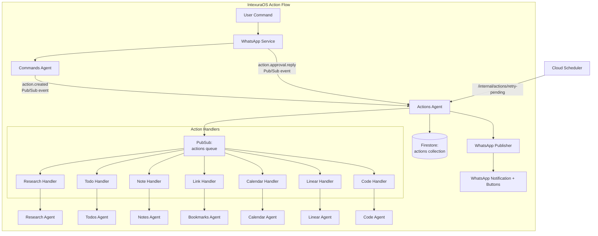
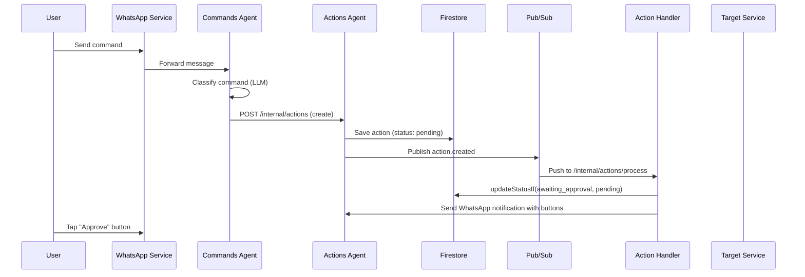
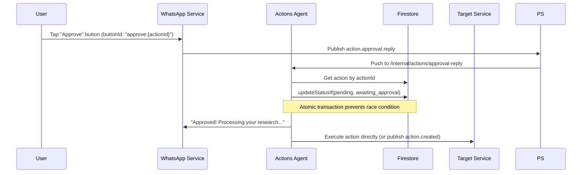

# Actions Agent - Technical Reference

## Overview

Actions-agent is the central action lifecycle management service for IntexuraOS. It receives classified commands from
commands-agent, maintains action state in Firestore, routes actions to appropriate handlers via Pub/Sub, and tracks
execution status. In v2.0.0, it gained WhatsApp approval handling with atomic status transitions to prevent race
conditions. In v2.1.0, it migrated to the centralized `@intexuraos/internal-clients/user-service` package. In v3.0.0,
it added the `code` action type for dispatching Claude Code tasks via code-agent. In v3.1.0, calendar actions gained
auto-execute support and Google Calendar event linking. In v4.0.0 (INT-524), the LLM classification layer was removed
entirely -- all approval intents are now resolved deterministically via WhatsApp interactive buttons.

## Architecture



## Recent Changes

| Commit     | Description                                                                    | Date       |
| ---------- | ------------------------------------------------------------------------------ | ---------- |
| `b3f34d85` | Release v3.1.0                                                                 | 2026-02-22 |
| `5ee70b37` | Link calendar approval to Google Calendar event (absolute URL support)         | 2026-02-20 |
| `6f2d8e21` | Add auto-execute support to calendar action handler                            | 2026-02-20 |
| `735f7ef3` | Fix missing userId in code-agent requests                                      | 2026-02-20 |
| `c8a42105` | Release v3.0.0                                                                 | 2026-02-19 |
| `884bc168` | Add semver versioning to PromptBuilder; auto-execute now applies all types     | 2026-02-19 |
| `32e6e641` | Ack deleted actions in approval reply, notify via WhatsApp                     | 2026-02-16 |
| `a52a6bbc` | Add Dash0 OpenTelemetry integration                                            | 2026-02-16 |
| `e60eafc1` | Rename INTEXURAOS_GUEST_ZAI_API_KEY to INTEXURAOS_ZAI_APP_API_KEY              | 2026-02-15 |
| `c72b7c53` | Add INTEXURAOS_GEMINI_APP_API_KEY for Gemini fallback in user service client   | 2026-02-15 |
| `d81ee125` | Fix view-task button URL: /#/tasks/ to /#/code-tasks/                          | 2026-02-15 |
| `090e1d9d` | INT-524 Unified interactive approval buttons (removed LLM + nonces)            | 2026-02-09 |

## Data Flow

### Standard Action Flow



### Approval Reply Flow (v2.0.0, buttons-only in v4.0.0)



## API Endpoints

### Public Endpoints

| Method | Path                                   | Description                            | Auth         |
| ------ | -------------------------------------- | -------------------------------------- | ------------ |
| GET    | `/actions`                             | List actions for authenticated user    | Bearer token |
| PATCH  | `/actions/:actionId`                   | Update action status or type           | Bearer token |
| DELETE | `/actions/:actionId`                   | Delete an action                       | Bearer token |
| POST   | `/actions/batch`                       | Fetch multiple actions by IDs (max 50) | Bearer token |
| POST   | `/actions/:actionId/execute`           | Synchronously execute an action        | Bearer token |
| GET    | `/actions/:actionId/preview`           | Get calendar action preview            | Bearer token |
| POST   | `/actions/:actionId/resolve-duplicate` | Skip or update duplicate bookmark      | Bearer token |

### Internal Endpoints

| Method | Path                                   | Description                                      | Auth                    |
| ------ | -------------------------------------- | ------------------------------------------------ | ----------------------- |
| POST   | `/internal/actions`                    | Create new action from classification            | Internal header or OIDC |
| POST   | `/internal/actions/:actionType`        | Process action from Pub/Sub (type-specific)      | Pub/Sub OIDC            |
| POST   | `/internal/actions/process`            | Process action from Pub/Sub (unified)            | Pub/Sub OIDC            |
| POST   | `/internal/actions/retry-pending`      | Retry actions stuck in pending (Cloud Scheduler) | OIDC or Internal        |
| POST   | `/internal/actions/approval-reply`     | Handle WhatsApp button taps (v2.0.0)             | Pub/Sub OIDC            |
| PATCH  | `/internal/actions/:actionId/status`   | Update action resource status (v3.0.0)           | Internal header         |

## Domain Models

### Action

| Field             | Type                    | Description                             |
| ----------------- | ----------------------- | --------------------------------------- |
| `id`              | string (UUID)           | Unique action identifier                |
| `userId`          | string                  | User who owns the action                |
| `commandId`       | string                  | Original command ID from commands-agent |
| `type`            | ActionType              | Classification result                   |
| `confidence`      | number (0-1)            | Classification confidence score         |
| `title`           | string                  | Action title/description                |
| `status`          | ActionStatus            | Current lifecycle state                 |
| `payload`         | Record<string, unknown> | Action-specific data                    |
| `resource_status` | ResourceStatus (opt)    | Status of associated resource           |
| `resource_error`  | string (optional)       | Error message from resource execution   |
| `createdAt`       | string (ISO 8601)       | Creation timestamp                      |
| `updatedAt`       | string (ISO 8601)       | Last update timestamp                   |

> **Note:** `approvalNonce` and `approvalNonceExpiresAt` fields were removed in v4.0.0 (INT-524).

### ActionType Enum

| Value      | Handler                     | Auto-Execute |
| ---------- | --------------------------- | ------------ |
| `todo`     | HandleTodoActionUseCase     | Yes (>= 90%) |
| `research` | HandleResearchActionUseCase | Yes (>= 90%) |
| `note`     | HandleNoteActionUseCase     | Yes (>= 90%) |
| `link`     | HandleLinkActionUseCase     | Yes (>= 90%) |
| `calendar` | HandleCalendarActionUseCase | Yes (>= 90%) |
| `linear`   | HandleLinearActionUseCase   | No           |
| `code`     | HandleCodeActionUseCase     | Yes (>= 90%) |
| `reminder` | Not implemented             | N/A          |

> **Note (v3.1.0):** Calendar actions now support auto-execution when confidence >= 90%. The handler injects `executeCalendarAction` as a dependency. Linear still requires approval because its handler does not inject an `executeAction` dependency into the idempotent handler wrapper.

### ActionStatus Enum

| Value               | Description                            |
| ------------------- | -------------------------------------- |
| `pending`           | Approved and ready for processing      |
| `awaiting_approval` | Low confidence, requires user approval |
| `processing`        | Handler is executing                   |
| `completed`         | Successfully executed                  |
| `failed`            | Execution failed                       |
| `rejected`          | User rejected the action               |
| `archived`          | No longer relevant                     |

### ApprovalMessage

| Field         | Type              | Description                           |
| ------------- | ----------------- | ------------------------------------- |
| `id`          | string (UUID)     | Firestore document ID                 |
| `wamid`       | string            | WhatsApp message ID (indexed)         |
| `actionId`    | string            | Reference to action awaiting approval |
| `userId`      | string            | User who should approve/reject        |
| `sentAt`      | string (ISO 8601) | When approval request was sent        |
| `actionType`  | ActionType        | Action type for logging               |
| `actionTitle` | string            | Action title for logging              |

### ApprovalReplyEvent (v2.0.0, button-based in v4.0.0)

| Field          | Type              | Description                                                                                                                     |
| -------------- | ----------------- | ------------------------------------------------------------------------------------------------------------------------------- |
| `type`         | string            | Always `action.approval.reply`                                                                                                  |
| `replyToWamid` | string            | Original approval message wamid                                                                                                 |
| `replyText`    | string            | User's reply text (may be empty for button taps)                                                                                |
| `userId`       | string            | User ID                                                                                                                         |
| `timestamp`    | string (ISO 8601) | Reply timestamp                                                                                                                 |
| `actionId`     | string (optional) | Action ID extracted from correlation ID                                                                                         |
| `buttonId`     | string (optional) | Button ID: `approve:{actionId}`, `reject:{actionId}`, `cancel:{actionId}`, `convert:{actionId}`, `cancel-task:{taskId}:{nonce}` |
| `buttonTitle`  | string (optional) | User-visible text of the clicked button                                                                                         |

### ApprovalIntent

| Value     | Description                      |
| --------- | -------------------------------- |
| `approve` | User approved the action         |
| `reject`  | User rejected the action         |
| `unclear` | Button re-sent (no LLM fallback) |

### ResourceStatus (v3.0.0)

| Value         | Description                              |
| ------------- | ---------------------------------------- |
| `dispatched`  | Code task sent to code-agent             |
| `running`     | Code task executing                      |
| `completed`   | Code task finished successfully          |
| `failed`      | Code task failed                         |
| `cancelled`   | Code task cancelled by user              |
| `interrupted` | Code task interrupted (e.g., VM stopped) |

### CodeActionPayload (v3.0.0)

| Field              | Type              | Description                                            |
| ------------------ | ----------------- | ------------------------------------------------------ |
| `prompt`           | string            | User's request (what they want Claude to do)           |
| `workerType`       | enum              | Which model to use: opus, auto, or glm (default: auto) |
| `linearIssueId`    | string (optional) | Existing Linear issue to work on                       |
| `linearIssueTitle` | string (optional) | Title of the Linear issue                              |
| `approvalEventId`  | string (optional) | UUID for idempotency (set on approval)                 |
| `resource_url`     | string (optional) | URL of created code task (set by code-agent)           |

### ActionTransition

| Field                | Type              | Description                 |
| -------------------- | ----------------- | --------------------------- |
| `id`                 | string (UUID)     | Unique transition ID        |
| `userId`             | string            | User who made correction    |
| `actionId`           | string            | Reference to action         |
| `commandId`          | string            | Original command ID         |
| `commandText`        | string            | Original command text       |
| `originalType`       | ActionType        | Original type               |
| `newType`            | ActionType        | Corrected type              |
| `originalConfidence` | number            | Original confidence score   |
| `createdAt`          | string (ISO 8601) | When correction occurred    |

## Key Use Cases

### handleApprovalReply (v2.0.0, redesigned in v4.0.0)

Processes WhatsApp button taps for action approval. In v4.0.0, LLM classification was removed entirely.

**Flow:**

1. Receive `action.approval.reply` event from whatsapp-service
2. If `buttonId` starts with `cancel-task:` -- handle code task cancellation (no action lookup needed)
3. If `buttonId` starts with `view-task:` -- send task URL to user (no action lookup needed)
4. Look up action by `actionId` (from correlationId) or `replyToWamid` (from approval_messages)
5. If action not found (deleted/expired) -- return 200 with WhatsApp notification (prevents Pub/Sub retry)
6. Verify user ownership and action is not in terminal state
7. If `buttonId` present -- dispatch to `handleButtonResponse` for deterministic intent resolution
8. If text reply (no button) -- re-send approval buttons via WhatsApp

**Button ID formats:**

- `approve:{actionId}` -- atomically update status, execute action, send confirmation
- `reject:{actionId}` / `cancel:{actionId}` -- atomically mark rejected, send confirmation
- `convert:{actionId}` -- mark rejected, send "Converting to Linear issue..." message
- `cancel-task:{taskId}:{nonce}` -- cancel running code task via code-agent
- `view-task:{taskId}` -- send task URL to user

**Race Condition Prevention:**

```typescript
const updateResult = await actionRepository.updateStatusIf(
  action.id,
  'pending', // new status
  'awaiting_approval' // expected current status
);

if (updateResult.outcome === 'status_mismatch') {
  // Another handler already processed this - idempotent return
  return ok({ matched: true, actionId: action.id });
}
```

### buildApprovalButtons (v4.0.0)

Creates WhatsApp interactive buttons for any action type.

```typescript
// Standard buttons (all action types)
buildApprovalButtons({ actionId });
// -> [{ id: 'approve:{actionId}', title: 'Approve' }, { id: 'reject:{actionId}', title: 'Reject' }]

// Code actions (extra "Convert to Issue" button)
buildApprovalButtons({
  actionId,
  extraButtons: [
    { type: 'reply', reply: { id: `convert:${actionId}`, title: 'Convert to Issue' } },
  ],
});
```

### shouldAutoExecute

Determines whether an action should be auto-executed based on classification confidence. The threshold is 90% (`>= 0.9`). This function is type-agnostic -- any action type can auto-execute. However, auto-execution only occurs when the handler injects an `executeAction` dependency. As of v3.1.0, all types except `linear` and `reminder` support auto-execution.

### handleCodeAction (v3.0.0, simplified in v4.0.0)

Processes code action creation requests. Sends WhatsApp message with interactive buttons (no nonces).

**Flow:**

1. Check if action should be auto-executed via `shouldAutoExecute`
2. If auto-execute: call `executeCodeAction` directly
3. Otherwise: send WhatsApp message with Approve / Reject / Convert to Issue buttons

### handleCalendarAction (v3.1.0: auto-execute support)

Processes calendar action creation requests. Triggers calendar preview generation via Pub/Sub for the web UI approval flow.

**Flow:**

1. Check if action should be auto-executed via `shouldAutoExecute`
2. If auto-execute: call `executeCalendarAction` directly
3. Otherwise: trigger preview generation via `calendarPreviewPublisher`, send WhatsApp approval buttons

### executeCalendarAction (v3.1.0: Google Calendar linking)

Executes calendar actions by delegating to calendar-agent.

**Flow:**

1. Retrieve action from repository
2. Validate action status
3. Call `calendarServiceClient.processAction` with the action
4. On success: store `resource_url` in payload (may be an absolute Google Calendar URL or relative app path)
5. Send WhatsApp completion notification with direct link

### executeCodeAction (v3.0.0)

Executes code actions by dispatching to code-agent.

**Flow:**

1. Retrieve action from repository
2. Validate action status (must be pending, awaiting_approval, or failed)
3. Generate `approvalEventId` UUID for idempotency
4. Call `codeAgentClient.submitTask` with action payload
5. Handle error codes: `WORKER_UNAVAILABLE` (mark failed), `DUPLICATE` (return existing task), network errors
6. On success: update action to completed with `resource_url` and `approvalEventId`
7. Send WhatsApp completion notification (best-effort)

### createIdempotentActionHandler

Wraps action handlers with idempotency protection to prevent duplicate WhatsApp notifications.

**Pattern:**

```typescript
const handler = registerActionHandler(createHandleXxxActionUseCase, deps);
// Internally calls updateStatusIf(awaiting_approval, [pending, failed])
// before invoking the wrapped handler
```

### retryPendingActions

Scheduled by Cloud Scheduler to find and re-process actions stuck in `pending` status for over 1 hour. Re-publishes `action.created` events to trigger handler processing. Skips actions with no registered handler and actions younger than the threshold.

### changeActionType

Allows users to correct AI classification. Validates the action is in a mutable status (`pending`, `awaiting_approval`, `failed`), fetches the original command text from commands-agent, logs the transition to `actions_transitions` for ML training, and updates the action type.

## Pub/Sub Events

### Published

| Event Type       | Topic           | Payload              |
| ---------------- | --------------- | -------------------- |
| `action.created` | `actions` queue | `ActionCreatedEvent` |

### Subscribed

| Event Type              | Subscription       | Handler                            |
| ----------------------- | ------------------ | ---------------------------------- |
| `action.created`        | `actions-queue`    | `/internal/actions/process`        |
| `action.approval.reply` | `approval-replies` | `/internal/actions/approval-reply` |

### Published (via shared publishers)

| Event Type               | Topic                       | Purpose                    |
| ------------------------ | --------------------------- | -------------------------- |
| WhatsApp send message    | `whatsapp-send`             | Notification delivery      |
| Calendar preview request | `calendar-preview`          | Trigger preview generation |

## Dependencies

### Internal Services

| Service                | Purpose                                                                          |
| ---------------------- | -------------------------------------------------------------------------------- |
| `commands-agent`       | Fetch command text for type transitions, create new commands                     |
| `research-agent`       | Execute research actions                                                         |
| `todos-agent`          | Execute todo actions                                                             |
| `notes-agent`          | Execute note actions                                                             |
| `bookmarks-agent`      | Execute link actions, force-refresh duplicate bookmarks                          |
| `calendar-agent`       | Execute calendar actions, fetch calendar previews                                |
| `linear-agent`         | Execute Linear issue creation actions                                            |
| `code-agent`           | Execute code tasks (Claude Code) via submitTask and cancelTaskWithNonce (v3.0.0) |
| `user-service`         | Fetch user API keys for LLM (via `@intexuraos/internal-clients/user-service`)    |
| `app-settings-service` | Fetch LLM pricing configuration at startup                                       |

### Infrastructure

| Component                                    | Purpose                            |
| -------------------------------------------- | ---------------------------------- |
| Firestore (`actions` collection)             | Action persistence                 |
| Firestore (`actions_transitions` collection) | Type correction tracking           |
| Firestore (`approval_messages` collection)   | WhatsApp message to action mapping |
| Pub/Sub (`actions` queue)                    | Event distribution                 |
| Pub/Sub (`whatsapp-send`)                    | Notification delivery              |
| Pub/Sub (`approval-replies`)                 | Approval reply events              |
| Pub/Sub (`calendar-preview`)                 | Calendar preview generation        |

## Configuration

| Environment Variable                       | Required | Description                                               |
| ------------------------------------------ | -------- | --------------------------------------------------------- |
| `INTEXURAOS_GCP_PROJECT_ID`                | Yes      | Google Cloud project ID                                   |
| `INTEXURAOS_AUTH_JWKS_URL`                 | Yes      | Auth0 JWKS URL for JWT validation                         |
| `INTEXURAOS_AUTH_ISSUER`                   | Yes      | Auth0 issuer                                              |
| `INTEXURAOS_AUTH_AUDIENCE`                 | Yes      | Auth0 audience                                            |
| `INTEXURAOS_RESEARCH_AGENT_URL`            | Yes      | Research-agent base URL                                   |
| `INTEXURAOS_USER_SERVICE_URL`              | Yes      | User-service base URL                                     |
| `INTEXURAOS_COMMANDS_AGENT_URL`            | Yes      | Commands-agent base URL                                   |
| `INTEXURAOS_TODOS_AGENT_URL`               | Yes      | Todos-agent base URL                                      |
| `INTEXURAOS_NOTES_AGENT_URL`               | Yes      | Notes-agent base URL                                      |
| `INTEXURAOS_BOOKMARKS_AGENT_URL`           | Yes      | Bookmarks-agent base URL                                  |
| `INTEXURAOS_CALENDAR_AGENT_URL`            | Yes      | Calendar-agent base URL                                   |
| `INTEXURAOS_LINEAR_AGENT_URL`              | Yes      | Linear-agent base URL                                     |
| `INTEXURAOS_CODE_AGENT_URL`                | Yes      | Code-agent base URL (v3.0.0)                              |
| `INTEXURAOS_APP_SETTINGS_SERVICE_URL`      | Yes      | App settings service URL (for LLM pricing)                |
| `INTEXURAOS_INTERNAL_AUTH_TOKEN`           | Yes      | Shared secret for service-to-service calls                |
| `INTEXURAOS_PUBSUB_ACTIONS_QUEUE`          | Yes      | Unified actions queue topic name                          |
| `INTEXURAOS_PUBSUB_WHATSAPP_SEND_TOPIC`    | Yes      | WhatsApp send topic                                       |
| `INTEXURAOS_PUBSUB_CALENDAR_PREVIEW_TOPIC` | Yes      | Calendar preview topic                                    |
| `INTEXURAOS_WEB_APP_URL`                   | Yes      | Web app URL for notification links                        |
| `INTEXURAOS_ZAI_APP_API_KEY`               | No       | ZAI platform API key for LLM fallback via user service    |
| `INTEXURAOS_GEMINI_APP_API_KEY`            | No       | Gemini platform API key for LLM fallback via user service |

## Gotchas

**Unified queue routing**: The `/internal/actions/process` endpoint receives all action types and dynamically selects
handlers. Unknown types are ignored (action stays pending) rather than failing.

**Pub/Sub authentication**: Pub/Sub push requests use OIDC tokens validated by Cloud Run. Direct service calls use
`X-Internal-Auth` header. Both paths are supported.

**Action type correction**: When user changes action type, the old type is logged to `actions_transitions` for ML
training data.

**Duplicate link handling**: Link actions may fail with `existingBookmarkId` in payload. Use
`/actions/:id/resolve-duplicate` to skip or refresh the existing bookmark.

**Batch endpoint limit**: Maximum 50 action IDs per batch request to prevent abuse.

**Reminder actions**: The reminder type is defined in the enum but has no handler. Actions of this type remain
in pending status indefinitely.

**Auto-execution threshold**: All action types with confidence >= 90% are auto-executed immediately via `shouldAutoExecute()`. The function is purely confidence-based -- no type filtering. Linear still always requires approval because its handler does not inject an `executeAction` dependency into the idempotent wrapper. As of v3.1.0, calendar does support auto-execution.

**Calendar resource URLs (v3.1.0)**: Calendar actions may return either a relative app URL (`/#/calendar/...`) or an
absolute Google Calendar URL (`https://calendar.google.com/...`). The `executeCalendarAction` use case detects absolute
URLs and avoids prepending `webAppUrl`.

**Approval reply idempotency (v2.0.0)**: The `updateStatusIf` method uses Firestore transactions to atomically check
and update status. If the status doesn't match expectations, the operation is a no-op, preventing race conditions
when multiple Pub/Sub messages arrive concurrently.

**Text replies re-send buttons (v4.0.0)**: When a user sends a text reply to an approval message (no buttonId),
the system re-sends fresh interactive buttons. There is no LLM fallback -- approval is button-only.

**Deleted action handling (v4.0.0)**: When an action is not found during approval reply processing, the endpoint
returns 200 OK (not 500) so Pub/Sub stops retrying. A WhatsApp message informs the user the action is no longer
available. Any orphaned approval_messages are cleaned up.

**Cancel-task button nonce**: The `cancel-task:{taskId}:{nonce}` button format retains nonce validation, but this
is for code task cancellation security (cancelling a running task is irreversible), not approval.

**Error codes UPPER_CASE (v4.0.0)**: Cancel-task error codes are normalized: `INVALID_NONCE`, `NONCE_EXPIRED`,
`NOT_OWNER` (HTTP 403), `TASK_NOT_CANCELLABLE`.

**Create action endpoint no longer publishes events (v3.0.0)**: The `POST /internal/actions` endpoint only creates
the action record. Event publishing is the caller's responsibility (commands-agent) to prevent duplicate events.

**Resource status updates (v3.0.0)**: The `PATCH /internal/actions/:actionId/status` endpoint allows code-agent to
report task progress (`dispatched`, `running`, `completed`, `failed`, `cancelled`). This updates the `resource_status`
field on the action, independent of the action's own `status` field.

**Response contract enforcement**: All routes use `reply.ok()` / `reply.fail()` exclusively. Raw `reply.send()` is
forbidden unless annotated with `@allow-raw-send`.

**OpenAPI description mismatch**: The `server.ts` OpenAPI info still references "Research Agent" in the description
field, leftover from the rename from research-agent to actions-agent.

## File Structure

```
apps/actions-agent/src/
  domain/
    models/
      action.ts              # Action entity, factory, CodeActionPayload, ResourceStatus
      actionEvent.ts         # Event schemas
      actionTransition.ts    # Type correction tracking
      approvalMessage.ts     # WhatsApp approval tracking
      approvalReplyEvent.ts  # Approval reply event schema
    ports/
      actionRepository.ts    # Action storage interface + updateStatusIf
      actionTransitionRepository.ts
      approvalMessageRepository.ts   # Approval message storage
      actionEventPublisher.ts        # Event publishing port
      notificationSender.ts  # WhatsApp notifications
      codeAgentClient.ts     # Code-agent HTTP client port (v3.0.0)
      calendarServiceClient.ts  # Calendar-agent client (processAction, getPreview)
      *ServiceClient.ts      # HTTP clients for other services
    usecases/
      handleApprovalReply.ts     # WhatsApp button tap handling (v4.0.0: buttons-only)
      handleCodeAction.ts        # Code action handler with interactive buttons
      handleCalendarAction.ts    # Calendar action handler with auto-execute (v3.1.0)
      executeCodeAction.ts       # Code action execution via code-agent
      executeCalendarAction.ts   # Calendar action execution with Google Calendar linking (v3.1.0)
      handle*Action.ts           # Pub/Sub handlers (async, all use buildApprovalButtons)
      execute*Action.ts          # Direct execution (sync)
      createIdempotentActionHandler.ts  # Idempotency wrapper
      shouldAutoExecute.ts       # Auto-execution logic (>= 90% confidence, type-agnostic)
      changeActionType.ts        # Type correction with transition logging
      retryPendingActions.ts     # Scheduled retry (1-hour threshold)
      actionHandlerRegistry.ts   # Handler routing
    utils/
      approvalButtons.ts         # buildApprovalButtons() - unified button factory (v4.0.0)
  infra/
    action/
      commandsAgentClient.ts         # Commands-agent client
      localActionServiceClient.ts    # Local action service client
    firestore/
      actionRepository.ts            # Includes atomic updateStatusIf
      actionTransitionRepository.ts
      approvalMessageRepository.ts   # Approval message persistence
    pubsub/
      actionEventPublisher.ts
      config.ts                      # Actions queue topic config
    http/
      codeAgentHttpClient.ts   # Code-agent HTTP client (v3.0.0)
      calendarServiceHttpClient.ts  # Calendar-agent HTTP client
      *ServiceHttpClient.ts    # HTTP clients for other services
    notification/
      whatsappNotificationSender.ts
    research/
      researchAgentClient.ts    # Research-agent HTTP client
  routes/
    publicRoutes.ts          # User-facing endpoints (7 endpoints)
    internalRoutes.ts        # Service-to-service + Pub/Sub (6 endpoints)
  services.ts                # DI container
  server.ts                  # Fastify server setup, OpenAPI, health check
```
