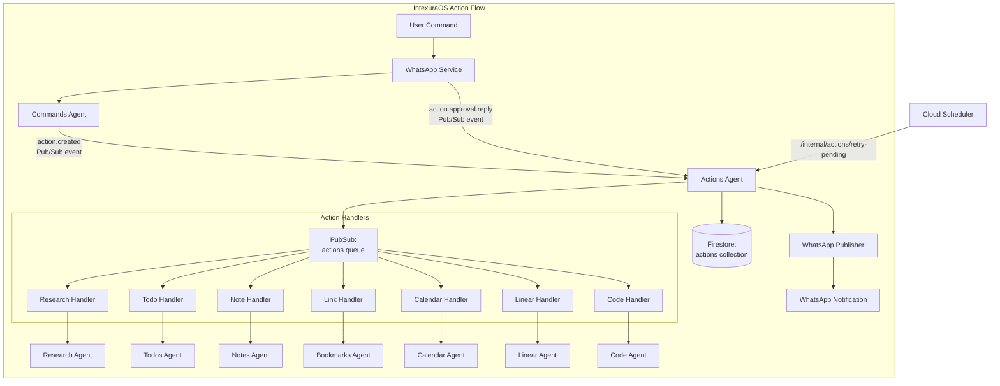
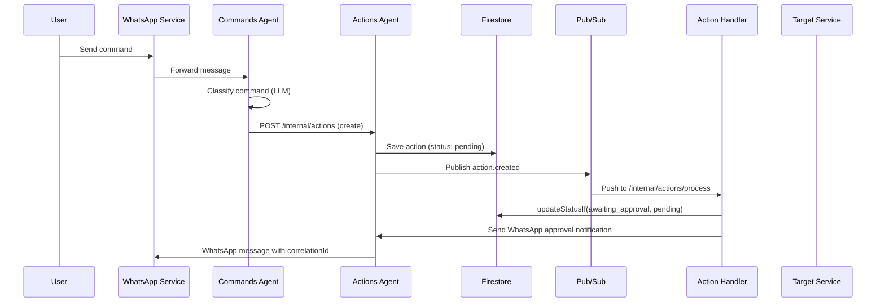
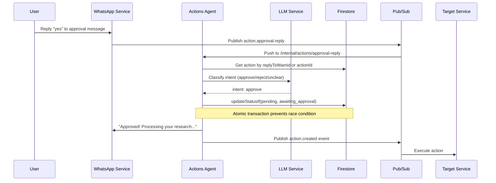

# Actions Agent - Technical Reference

## Overview

Actions-agent is the central action lifecycle management service for IntexuraOS. It receives classified commands from
commands-agent, maintains action state in Firestore, routes actions to appropriate handlers via Pub/Sub, and tracks
execution status. In v2.0.0, it gained WhatsApp approval reply handling with LLM-based intent classification and
atomic status transitions to prevent race conditions. In v2.1.0, it migrated to the centralized
`@intexuraos/internal-clients/user-service` package for improved code quality and consistency. In v3.0.0, it added
the `code` action type for dispatching Claude Code tasks via code-agent, interactive WhatsApp button approvals with
nonce-based validation, response contract standardization, and 100% branch coverage enforcement.

## Architecture



## Recent Changes

| Commit     | Description                                                  | Date       |
| ---------- | ------------------------------------------------------------ | ---------- |
| `44017d5c` | INT-473 Fix ESLint OOM with batched parallel lint runner     | 2026-02-01 |
| `d713d754` | INT-156 Fix ActionDoc missing approvalNonce fields           | 2026-01-31 |
| `96258560` | INT-427 100% branch coverage enforcement                     | 2026-01-31 |
| `5aa3e1bd` | INT-427 Enable strict 100% coverage enforcement (Phase 3)    | 2026-01-31 |
| `46c026cc` | Fix apps HTTP clients to unwrap response contract            | 2026-01-31 |
| `9723dc24` | Standardize DELETE endpoints to return consistent contract   | 2026-01-30 |
| `c3198407` | Fix all 132 response contract violations across codebase     | 2026-01-30 |
| `f08f890e` | Improve handleApprovalReply branch coverage to 98.23%        | 2026-01-30 |
| `39b6be5b` | Fix duplicate Pub/Sub events on action creation              | 2026-01-30 |
| `dfd702f1` | Add Sentry-enabled logger factory and migrate all apps       | 2026-01-30 |
| `3a83941d` | INT-424 Fix code review issues from PR #616                  | 2026-01-30 |
| `95468bd9` | INT-422 Fix Polish date parsing in calendar actions          | 2026-01-29 |
| `19f9a081` | Fix action payload serialization in API responses            | 2026-01-29 |

## Data Flow

### Standard Action Flow



### Approval Reply Flow (New in v2.0.0)



## API Endpoints

### Public Endpoints

| Method | Path                                   | Description                            | Auth         |
| ------ | -------------------------------------- | -------------------------------------- | ------------ |
| GET    | `/actions`                             | List actions for authenticated user    | Bearer token |
| PATCH  | `/actions/:actionId`                   | Update action status or type           | Bearer token |
| DELETE | `/actions/:actionId`                   | Delete an action                       | Bearer token |
| POST   | `/actions/batch`                       | Fetch multiple actions by IDs (max 50) | Bearer token |
| POST   | `/actions/:actionId/execute`           | Synchronously execute an action        | Bearer token |
| GET    | `/actions/:actionId/preview`           | Get calendar action preview            | Bearer token |
| POST   | `/actions/:actionId/resolve-duplicate` | Skip or update duplicate bookmark      | Bearer token |

### Internal Endpoints

| Method | Path                               | Description                                      | Auth                    |
| ------ | ---------------------------------- | ------------------------------------------------ | ----------------------- |
| POST   | `/internal/actions`                | Create new action from classification            | Internal header or OIDC |
| POST   | `/internal/actions/:actionType`    | Process action from Pub/Sub (type-specific)      | Pub/Sub OIDC            |
| POST   | `/internal/actions/process`        | Process action from Pub/Sub (unified)            | Pub/Sub OIDC            |
| POST   | `/internal/actions/retry-pending`  | Retry actions stuck in pending (Cloud Scheduler) | OIDC or Internal        |
| POST   | `/internal/actions/approval-reply` | Handle WhatsApp approval replies (v2.0.0)        | Pub/Sub OIDC            |

## Domain Models

### Action

| Field                    | Type                    | Description                                       |
| ------------------------ | ----------------------- | ------------------------------------------------- |
| `id`                     | string (UUID)           | Unique action identifier                          |
| `userId`                 | string                  | User who owns the action                          |
| `commandId`              | string                  | Original command ID from commands-agent           |
| `type`                   | ActionType              | Classification result                             |
| `confidence`             | number (0-1)            | Classification confidence score                   |
| `title`                  | string                  | Action title/description                          |
| `status`                 | ActionStatus            | Current lifecycle state                           |
| `payload`                | Record<string, unknown> | Action-specific data                              |
| `resource_status`        | ResourceStatus (opt)    | Status of associated resource (e.g., code task)   |
| `resource_error`         | string (optional)       | Error message from resource execution             |
| `approvalNonce`          | string (optional)       | 4-char hex nonce for code action approvals        |
| `approvalNonceExpiresAt` | string (optional)       | Nonce expiration timestamp (ISO 8601, 15-min TTL) |
| `createdAt`              | string (ISO 8601)       | Creation timestamp                                |
| `updatedAt`              | string (ISO 8601)       | Last update timestamp                             |

### ActionType Enum

| Value      | Handler                     | Auto-Execute |
| ---------- | --------------------------- | ------------ |
| `todo`     | HandleTodoActionUseCase     | No           |
| `research` | HandleResearchActionUseCase | No           |
| `note`     | HandleNoteActionUseCase     | No           |
| `link`     | HandleLinkActionUseCase     | Yes (>= 90%) |
| `calendar` | HandleCalendarActionUseCase | No           |
| `linear`   | HandleLinearActionUseCase   | No           |
| `code`     | HandleCodeActionUseCase     | No           |
| `reminder` | Not implemented             | N/A          |

### ActionStatus Enum

| Value               | Description                            |
| ------------------- | -------------------------------------- |
| `pending`           | Approved and ready for processing      |
| `awaiting_approval` | Low confidence, requires user approval |
| `processing`        | Handler is executing                   |
| `completed`         | Successfully executed                  |
| `failed`            | Execution failed                       |
| `rejected`          | User rejected the action               |
| `archived`          | No longer relevant                     |

### ApprovalMessage (New in v2.0.0)

| Field         | Type              | Description                           |
| ------------- | ----------------- | ------------------------------------- |
| `id`          | string (UUID)     | Firestore document ID                 |
| `wamid`       | string            | WhatsApp message ID (indexed)         |
| `actionId`    | string            | Reference to action awaiting approval |
| `userId`      | string            | User who should approve/reject        |
| `sentAt`      | string (ISO 8601) | When approval request was sent        |
| `actionType`  | ActionType        | Action type for logging               |
| `actionTitle` | string            | Action title for logging              |

### ApprovalReplyEvent (v2.0.0, enhanced in v3.0.0)

| Field          | Type              | Description                                                                               |
| -------------- | ----------------- | ----------------------------------------------------------------------------------------- |
| `type`         | string            | Always `action.approval.reply`                                                            |
| `replyToWamid` | string            | Original approval message wamid                                                           |
| `replyText`    | string            | User's reply text                                                                         |
| `userId`       | string            | User ID                                                                                   |
| `timestamp`    | string (ISO 8601) | Reply timestamp                                                                           |
| `actionId`     | string (optional) | Action ID extracted from correlation ID                                                   |
| `buttonId`     | string (optional) | v3.0.0: Button ID (e.g., `approve:actionId:nonce`, `cancel:actionId`, `convert:actionId`) |
| `buttonTitle`  | string (optional) | v3.0.0: User-visible text of the clicked button                                           |

### ApprovalIntent (New in v2.0.0)

| Value     | Description                      |
| --------- | -------------------------------- |
| `approve` | User wants to approve the action |
| `reject`  | User wants to reject the action  |
| `unclear` | Intent couldn't be determined    |

### ResourceStatus (New in v3.0.0)

| Value         | Description                              |
| ------------- | ---------------------------------------- |
| `dispatched`  | Code task sent to code-agent             |
| `running`     | Code task executing                      |
| `completed`   | Code task finished successfully          |
| `failed`      | Code task failed                         |
| `cancelled`   | Code task cancelled by user              |
| `interrupted` | Code task interrupted (e.g., VM stopped) |

### CodeActionPayload (New in v3.0.0)

| Field              | Type              | Description                                            |
| ------------------ | ----------------- | ------------------------------------------------------ |
| `prompt`           | string            | User's request (what they want Claude to do)           |
| `workerType`       | enum              | Which model to use: opus, auto, or glm (default: auto) |
| `linearIssueId`    | string (optional) | Existing Linear issue to work on                       |
| `linearIssueTitle` | string (optional) | Title of the Linear issue                              |
| `approvalEventId`  | string (optional) | UUID for idempotency (set on approval)                 |
| `resource_url`     | string (optional) | URL of created code task (set by code-agent)           |

### ActionTransition

| Field       | Type              | Description              |
| ----------- | ----------------- | ------------------------ |
| `id`        | string            | Unique transition ID     |
| `actionId`  | string            | Reference to action      |
| `fromType`  | ActionType        | Original type            |
| `toType`    | ActionType        | Corrected type           |
| `userId`    | string            | User who made correction |
| `timestamp` | string (ISO 8601) | When correction occurred |

## Key Use Cases

### handleApprovalReply (New in v2.0.0)

Processes WhatsApp approval replies using LLM-based intent classification.

**Flow:**

1. Receive `action.approval.reply` event from whatsapp-service
2. Look up action by `actionId` (from correlationId) or `replyToWamid` (from approval_messages)
3. Verify user ownership and action is not in terminal state
4. Create LLM classifier using user's configured API key
5. Classify intent: approve, reject, or unclear
6. On approve: atomically update status via `updateStatusIf`, send confirmation, publish `action.created`
7. On reject: atomically update status, record rejection reason, send confirmation
8. On unclear: request clarification via WhatsApp

**Race Condition Prevention:**

```typescript
const updateResult = await actionRepository.updateStatusIf(
  action.id,
  'pending', // new status
  'awaiting_approval' // expected current status
);

if (updateResult.outcome === 'status_mismatch') {
  // Another handler already processed this - idempotent return
  return ok({ matched: true, actionId: action.id });
}
```

### handleCodeAction (New in v3.0.0)

Processes code action creation requests with interactive WhatsApp button approvals.

**Flow:**

1. Check if action should be auto-executed (via `shouldAutoExecute`)
2. If auto-execute: call `executeCodeAction` directly
3. Otherwise: generate 4-char hex approval nonce and expiration (15 min TTL)
4. Update action with nonce fields
5. Send WhatsApp message with interactive buttons (Approve with nonce, Cancel, Convert to Issue)
6. Message includes prompt preview, estimated cost ($1-2), and estimated time (30-60 min)

### executeCodeAction (New in v3.0.0)

Executes code actions by dispatching to code-agent.

**Flow:**

1. Retrieve action from repository
2. Validate action status (must be pending, awaiting_approval, or failed)
3. Generate `approvalEventId` UUID for idempotency
4. Call `codeAgentClient.submitTask` with action payload
5. Handle error codes: `WORKER_UNAVAILABLE` (mark failed), `DUPLICATE` (return existing task), network errors
6. On success: update action to completed with `resource_url` and `approvalEventId`
7. Send WhatsApp completion notification (best-effort)

### createIdempotentActionHandler

Wraps action handlers with idempotency protection to prevent duplicate WhatsApp notifications.

**Pattern:**

```typescript
const handler = registerActionHandler(createHandleXxxActionUseCase, deps);
// Internally calls updateStatusIf(awaiting_approval, [pending, failed])
// before invoking the wrapped handler
```

## Pub/Sub Events

### Published

| Event Type       | Topic           | Payload              |
| ---------------- | --------------- | -------------------- |
| `action.created` | `actions` queue | `ActionCreatedEvent` |

### Subscribed

| Event Type              | Subscription       | Handler                            |
| ----------------------- | ------------------ | ---------------------------------- |
| `action.created`        | `actions-queue`    | `/internal/actions/process`        |
| `action.approval.reply` | `approval-replies` | `/internal/actions/approval-reply` |

## Dependencies

### Internal Services

| Service           | Purpose                                                                                 |
| ----------------- | --------------------------------------------------------------------------------------- |
| `commands-agent`  | Create new commands from transitions                                                    |
| `research-agent`  | Execute research actions                                                                |
| `todos-agent`     | Execute todo actions                                                                    |
| `notes-agent`     | Execute note actions                                                                    |
| `bookmarks-agent` | Execute link actions                                                                    |
| `calendar-agent`  | Execute calendar actions                                                                |
| `linear-agent`    | Execute Linear issue creation actions                                                   |
| `code-agent`      | Execute code tasks (Claude Code) via submitTask and cancelTaskWithNonce (v3.0.0)        |
| `user-service`    | Fetch user API keys for LLM (via `@intexuraos/internal-clients/user-service` in v2.1.0) |

### Infrastructure

| Component                                    | Purpose                            |
| -------------------------------------------- | ---------------------------------- |
| Firestore (`actions` collection)             | Action persistence                 |
| Firestore (`actions_transitions` collection) | Type correction tracking           |
| Firestore (`approval_messages` collection)   | WhatsApp message to action mapping |
| Pub/Sub (`actions` queue)                    | Event distribution                 |
| Pub/Sub (`whatsapp-send`)                    | Notification delivery              |
| Pub/Sub (`approval-replies`)                 | Approval reply events              |

## Configuration

| Environment Variable                       | Required | Description                                |
| ------------------------------------------ | -------- | ------------------------------------------ |
| `INTEXURAOS_RESEARCH_AGENT_URL`            | Yes      | Research-agent base URL                    |
| `INTEXURAOS_USER_SERVICE_URL`              | Yes      | User-service base URL                      |
| `INTEXURAOS_COMMANDS_AGENT_URL`            | Yes      | Commands-agent base URL                    |
| `INTEXURAOS_TODOS_AGENT_URL`               | Yes      | Todos-agent base URL                       |
| `INTEXURAOS_NOTES_AGENT_URL`               | Yes      | Notes-agent base URL                       |
| `INTEXURAOS_BOOKMARKS_AGENT_URL`           | Yes      | Bookmarks-agent base URL                   |
| `INTEXURAOS_CALENDAR_AGENT_URL`            | Yes      | Calendar-agent base URL                    |
| `INTEXURAOS_LINEAR_AGENT_URL`              | Yes      | Linear-agent base URL                      |
| `INTEXURAOS_CODE_AGENT_URL`                | Yes      | Code-agent base URL (v3.0.0)               |
| `INTEXURAOS_APP_SETTINGS_SERVICE_URL`      | Yes      | App settings service URL (for LLM pricing) |
| `INTEXURAOS_INTERNAL_AUTH_TOKEN`           | Yes      | Shared secret for service-to-service calls |
| `INTEXURAOS_GCP_PROJECT_ID`                | Yes      | Google Cloud project ID                    |
| `INTEXURAOS_PUBSUB_ACTIONS_QUEUE`          | Yes      | Unified actions queue topic name           |
| `INTEXURAOS_PUBSUB_WHATSAPP_SEND_TOPIC`    | Yes      | WhatsApp send topic                        |
| `INTEXURAOS_PUBSUB_CALENDAR_PREVIEW_TOPIC` | Yes      | Calendar preview topic                     |
| `INTEXURAOS_WEB_APP_URL`                   | Yes      | Web app URL for notification links         |

## Gotchas

**Unified queue routing**: The `/internal/actions/process` endpoint receives all action types and dynamically selects
handlers. Unknown types are ignored (action stays pending) rather than failing.

**Pub/Sub authentication**: Pub/Sub push requests use OIDC tokens validated by Cloud Run. Direct service calls use
`X-Internal-Auth` header. Both paths are supported.

**Action type correction**: When user changes action type, the old type is logged to `actions_transitions` for ML
training data.

**Duplicate link handling**: Link actions may fail with `existingBookmarkId` in payload. Use
`/actions/:id/resolve-duplicate` to skip or refresh the existing bookmark.

**Batch endpoint limit**: Maximum 50 action IDs per batch request to prevent abuse.

**Reminder actions**: The reminder type is defined in the enum but has no handler. Actions of this type remain
in pending status indefinitely.

**Auto-execution for links**: Link actions with confidence >= 90% are auto-executed immediately via `shouldAutoExecute()`.
All other action types require manual approval before execution.

**Approval reply idempotency (v2.0.0)**: The `updateStatusIf` method uses Firestore transactions to atomically check
and update status. If the status doesn't match expectations, the operation is a no-op, preventing race conditions
when multiple Pub/Sub messages arrive concurrently.

**Note actions direct execution (v2.0.0)**: When approving note actions, the system executes directly rather than
publishing `action.created` to avoid duplicate "ready for approval" notifications.

**LLM classifier creation**: The approval intent classifier is created per-user using their configured LLM API key.
If no key is configured, the user receives an error message asking them to configure their API key.

**Code action approval nonces (v3.0.0)**: Code actions use 4-character hex nonces embedded in WhatsApp interactive
buttons. Nonces expire after 15 minutes. If a user clicks an expired button, the approval fails. The text fallback
("approve XXXX") falls through to the LLM classifier if nonce validation fails.

**Interactive button responses bypass LLM (v3.0.0)**: When a WhatsApp button is clicked (buttonId is present),
the approval handler bypasses the LLM classifier entirely for deterministic intent resolution. This reduces latency
and cost for button-based approvals.

**Create action endpoint no longer publishes events (v3.0.0)**: The `POST /internal/actions` endpoint only creates
the action record. Event publishing is now the caller's responsibility (commands-agent) to prevent duplicate events.

**Response contract enforcement**: All routes use `reply.ok()` / `reply.fail()` exclusively. Raw `reply.send()` is
forbidden unless annotated with `@allow-raw-send`.

## File Structure

```
apps/actions-agent/src/
  domain/
    models/
      action.ts              # Action entity, factory, CodeActionPayload, ResourceStatus
      actionEvent.ts         # Event schemas
      actionTransition.ts    # Type correction tracking
      approvalMessage.ts     # WhatsApp approval tracking (v2.0.0)
      approvalReplyEvent.ts  # Approval reply event schema (v2.0.0, enhanced v3.0.0)
    ports/
      actionRepository.ts    # Action storage interface + updateStatusIf
      actionTransitionRepository.ts
      approvalMessageRepository.ts   # Approval message storage (v2.0.0)
      approvalIntentClassifier.ts    # LLM intent classification port (v2.0.0)
      approvalIntentClassifierFactory.ts  # Classifier factory port (v2.0.0)
      actionEventPublisher.ts        # Event publishing port
      notificationSender.ts  # WhatsApp notifications
      codeAgentClient.ts     # Code-agent HTTP client port (v3.0.0)
      *ServiceClient.ts      # HTTP clients for other services
    usecases/
      handleApprovalReply.ts     # WhatsApp reply handling (v2.0.0, buttons+nonce v3.0.0)
      handleCodeAction.ts        # Code action handler with interactive buttons (v3.0.0)
      executeCodeAction.ts       # Code action execution via code-agent (v3.0.0)
      handle*Action.ts           # Pub/Sub handlers (async)
      execute*Action.ts          # Direct execution (sync)
      createIdempotentActionHandler.ts  # Idempotency wrapper
      shouldAutoExecute.ts       # Auto-execution logic
      changeActionType.ts        # Type correction
      retryPendingActions.ts     # Scheduled retry
      actionHandlerRegistry.ts   # Handler routing
    utils/
      approvalNonce.ts           # Nonce generation and validation (v3.0.0)
  infra/
    firestore/
      actionRepository.ts            # Includes atomic updateStatusIf
      actionTransitionRepository.ts
      approvalMessageRepository.ts   # Approval message persistence (v2.0.0)
    llm/
      llmApprovalIntentClassifier.ts  # LLM-based classifier (v2.0.0)
      approvalIntentClassifierFactory.ts  # Factory implementation (v2.0.0)
    pubsub/
      actionEventPublisher.ts
    http/
      codeAgentHttpClient.ts   # Code-agent HTTP client (v3.0.0)
      *ServiceHttpClient.ts    # HTTP clients for other services
    notification/
      whatsappNotificationSender.ts
  routes/
    publicRoutes.ts          # User-facing endpoints
    internalRoutes.ts        # Service-to-service + Pub/Sub (includes approval-reply)
  services.ts                # DI container
```
