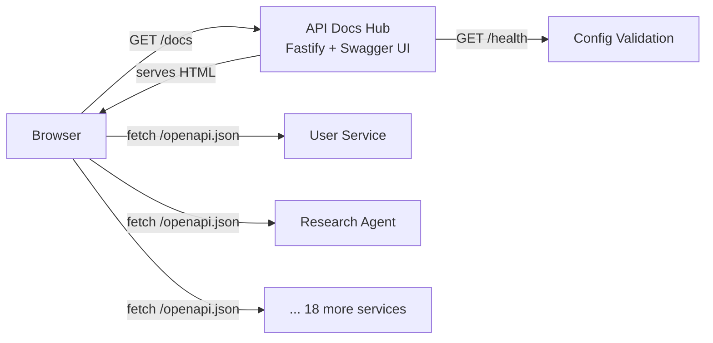
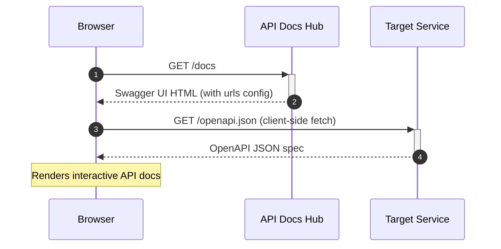

# API Docs Hub — Technical Reference

## Overview

API Docs Hub is a lightweight Fastify server that aggregates OpenAPI specifications from all 20 IntexuraOS services into a single Swagger UI instance. It runs on Cloud Run with zero minimum instances and fetches specs client-side from each service's `/openapi.json` endpoint. The service has no database, no domain logic, and no Pub/Sub integration — it exists solely to serve a configured Swagger UI.

**Versions:** Package `3.4.0` / OpenAPI spec `0.0.5`

## Architecture



Note: The hub serves the Swagger UI HTML/JS. The browser then fetches individual OpenAPI specs directly from each service. The hub itself does not proxy spec requests.

## Data Flow



## Recent Changes

| Commit      | Description                                                        | Date       |
| ----------- | ------------------------------------------------------------------ | ---------- |
| `fff14842`  | Address Opus code review findings for shared catalog               | 2026-03-20 |
| `0fc320f9`  | Improve cron tool selection authoring                              | 2026-03-20 |
| `4c9e4003`  | Implement LLM-driven recurring schedule backend (cron-agent added) | 2026-03-18 |
| `969f43fa`  | Merge PR #1232 — fix PR automation log race condition              | 2026-03-15 |

**v3.4.0 summary:** The hardcoded 18-service configuration was replaced with a shared internal API catalog from `@intexuraos/common-core`. This refactoring added `@intexuraos/common-core` as a dependency, deleted ~70 lines of duplicated environment variable definitions from `config.ts`, and introduced `buildInternalApiOpenApiSources()` to construct the source list dynamically. Two new services were added to the catalog: Cron Agent and Hellscript Agent, bringing the total from 18 to 20. Tests were also added for the first time (`server.test.ts`).

## API Endpoints

### Public Endpoints

| Method | Path      | Purpose                                         | Auth |
| ------ | --------- | ----------------------------------------------- | ---- |
| GET    | `/docs`   | Swagger UI with multi-spec dropdown             | None |
| GET    | `/health` | Health check — validates config source count    | None |

There are no internal endpoints. This service does not expose any `/internal/*` routes.

## Domain Model

This service has no domain model. It is a configuration-driven static documentation server.

### Configuration Model

```typescript
interface OpenApiSource {
  name: string;  // Display name in Swagger UI dropdown
  url: string;   // URL to service's OpenAPI JSON endpoint
}

interface Config {
  port: number;
  host: string;
  openApiSources: OpenApiSource[];  // Built from shared INTERNAL_API_SERVICE_CATALOG
}
```

## Aggregated Services (20)

| Display Name                     | Environment Variable                                      |
| -------------------------------- | --------------------------------------------------------- |
| User Service API                 | `INTEXURAOS_USER_SERVICE_OPENAPI_URL`                     |
| Notion Service API               | `INTEXURAOS_NOTION_SERVICE_OPENAPI_URL`                   |
| WhatsApp Service API             | `INTEXURAOS_WHATSAPP_SERVICE_OPENAPI_URL`                 |
| Mobile Notifications Service API | `INTEXURAOS_MOBILE_NOTIFICATIONS_SERVICE_OPENAPI_URL`     |
| Research Agent API               | `INTEXURAOS_RESEARCH_AGENT_OPENAPI_URL`                   |
| Commands Agent API               | `INTEXURAOS_COMMANDS_AGENT_OPENAPI_URL`                   |
| Actions Agent API                | `INTEXURAOS_ACTIONS_AGENT_OPENAPI_URL`                    |
| Data Insights Agent API          | `INTEXURAOS_DATA_INSIGHTS_AGENT_OPENAPI_URL`              |
| Image Service API                | `INTEXURAOS_IMAGE_SERVICE_OPENAPI_URL`                    |
| Application Settings API         | `INTEXURAOS_APP_SETTINGS_SERVICE_OPENAPI_URL`             |
| Notes Agent API                  | `INTEXURAOS_NOTES_AGENT_OPENAPI_URL`                      |
| Todos Agent API                  | `INTEXURAOS_TODOS_AGENT_OPENAPI_URL`                      |
| Bookmarks Agent API              | `INTEXURAOS_BOOKMARKS_AGENT_OPENAPI_URL`                  |
| Calendar Agent API               | `INTEXURAOS_CALENDAR_AGENT_OPENAPI_URL`                   |
| Chat Agent API                   | `INTEXURAOS_CHAT_AGENT_OPENAPI_URL`                       |
| Code Agent API                   | `INTEXURAOS_CODE_AGENT_OPENAPI_URL`                       |
| Linear Agent API                 | `INTEXURAOS_LINEAR_AGENT_OPENAPI_URL`                     |
| Web Agent API                    | `INTEXURAOS_WEB_AGENT_OPENAPI_URL`                        |
| Cron Agent API                   | `INTEXURAOS_CRON_AGENT_OPENAPI_URL`                       |
| Hellscript Agent API             | `INTEXURAOS_HELLSCRIPT_AGENT_OPENAPI_URL`                 |

## Pub/Sub

None. This service does not publish or subscribe to any Pub/Sub topics.

## Dependencies

### Packages

| Package                      | Purpose                                             |
| ---------------------------- | --------------------------------------------------- |
| `@fastify/swagger`           | OpenAPI 3.1.1 spec generation                       |
| `@fastify/swagger-ui`        | Swagger UI with multi-spec `urls` support           |
| `@intexuraos/common-core`    | Shared internal API service catalog                 |
| `@intexuraos/common-http`    | `intexuraFastifyPlugin`, quiet health check logging |
| `@intexuraos/http-server`    | `buildHealthResponse`, `HealthCheck` types          |
| `@intexuraos/infra-sentry`   | Sentry error capture, `createLogStream()`           |
| `@intexuraos/infra-otel`     | Dash0 OpenTelemetry log forwarding (optional)       |

### External Services

None. The hub has no direct external service dependencies.

### Internal Services

None. The hub does not call any internal service APIs. It only provides URLs for the browser to fetch specs from.

## Logging Pipeline

`createLogStream()` from `@intexuraos/infra-sentry` assembles a multi-destination pino stream:

| Environment  | Output                                                      |
| ------------ | ----------------------------------------------------------- |
| `test`       | Logger disabled                                             |
| `dev` (PM2)  | Human-readable formatted output                             |
| `production` | Raw JSON + Sentry error forwarding                          |
| Any + Dash0  | + OTLP forwarding when `INTEXURAOS_DASH0_OTLP_ENDPOINT` set |

Health check routes are excluded from request logging via `registerQuietHealthCheckLogging`.

## Configuration

### Required Environment Variables (20)

| Variable                                              | Description                        |
| ----------------------------------------------------- | ---------------------------------- |
| `INTEXURAOS_USER_SERVICE_OPENAPI_URL`                 | User Service OpenAPI JSON URL      |
| `INTEXURAOS_NOTION_SERVICE_OPENAPI_URL`               | Notion Service OpenAPI URL         |
| `INTEXURAOS_WHATSAPP_SERVICE_OPENAPI_URL`             | WhatsApp Service OpenAPI URL       |
| `INTEXURAOS_MOBILE_NOTIFICATIONS_SERVICE_OPENAPI_URL` | Mobile Notifications URL           |
| `INTEXURAOS_RESEARCH_AGENT_OPENAPI_URL`               | Research Agent OpenAPI URL         |
| `INTEXURAOS_COMMANDS_AGENT_OPENAPI_URL`               | Commands Agent OpenAPI URL         |
| `INTEXURAOS_ACTIONS_AGENT_OPENAPI_URL`                | Actions Agent OpenAPI URL          |
| `INTEXURAOS_DATA_INSIGHTS_AGENT_OPENAPI_URL`          | Data Insights Agent URL            |
| `INTEXURAOS_IMAGE_SERVICE_OPENAPI_URL`                | Image Service OpenAPI URL          |
| `INTEXURAOS_NOTES_AGENT_OPENAPI_URL`                  | Notes Agent OpenAPI URL            |
| `INTEXURAOS_TODOS_AGENT_OPENAPI_URL`                  | Todos Agent OpenAPI URL            |
| `INTEXURAOS_APP_SETTINGS_SERVICE_OPENAPI_URL`         | Application Settings URL           |
| `INTEXURAOS_BOOKMARKS_AGENT_OPENAPI_URL`              | Bookmarks Agent OpenAPI URL        |
| `INTEXURAOS_CALENDAR_AGENT_OPENAPI_URL`               | Calendar Agent OpenAPI URL         |
| `INTEXURAOS_CHAT_AGENT_OPENAPI_URL`                   | Chat Agent OpenAPI URL             |
| `INTEXURAOS_CODE_AGENT_OPENAPI_URL`                   | Code Agent OpenAPI URL             |
| `INTEXURAOS_LINEAR_AGENT_OPENAPI_URL`                 | Linear Agent OpenAPI URL           |
| `INTEXURAOS_WEB_AGENT_OPENAPI_URL`                    | Web Agent OpenAPI URL              |
| `INTEXURAOS_CRON_AGENT_OPENAPI_URL`                   | Cron Agent OpenAPI URL             |
| `INTEXURAOS_HELLSCRIPT_AGENT_OPENAPI_URL`             | Hellscript Agent OpenAPI URL       |

### Optional Environment Variables

| Variable                         | Default       | Description                          |
| -------------------------------- | ------------- | ------------------------------------ |
| `INTEXURAOS_SENTRY_DSN`          | -             | Sentry DSN for error tracking        |
| `INTEXURAOS_ENVIRONMENT`         | `development` | Environment name for Sentry          |
| `PORT`                           | `8080`        | Server listen port                   |
| `HOST`                           | `0.0.0.0`     | Server listen host                   |
| `LOG_LEVEL`                      | `info`        | Pino log level                       |

## Gotchas

- **Client-side spec fetching** — Swagger UI fetches specs in the browser, not on the server. Services must be accessible from the browser's network and must allow CORS from the hub's origin.
- **Config validation scope** — The health check only validates that env vars were present at startup. It does not verify that the service URLs are reachable or returning valid OpenAPI specs.
- **Empty sources = "down"** — If `openApiSources` array is empty (which cannot happen in practice due to fail-fast), the health check returns status `"down"`.
- **Static config** — OpenAPI source URLs are loaded once at startup. Adding or removing a service requires redeployment.
- **Health endpoint uses raw reply.send()** — The `/health` endpoint bypasses the `reply.ok()` / `reply.fail()` response contract. This is intentional for infrastructure monitoring stability.
- **Not in ecosystem.config.cjs** — This service is not listed in `ecosystem.config.cjs` for local PM2 development. It must be run manually via `pnpm --filter api-docs-hub start:local`.
- **Max scale 1** — Terraform limits this service to a single Cloud Run instance (min_scale=0, max_scale=1), which is appropriate for a documentation-only service.

## Terraform Configuration

```hcl
module "api_docs_hub" {
  source       = "../../modules/cloud-run-service"
  service_name = "intexuraos-api-docs-hub"
  port         = 8080
  min_scale    = 0
  max_scale    = 1

  # OpenAPI URLs reference other module outputs
  env_vars = {
    INTEXURAOS_USER_SERVICE_OPENAPI_URL = "${module.user_service.service_url}/openapi.json"
    # ... 19 more service URLs
  }

  depends_on = [module.user_service, module.notion_service, ...]
}
```

The Terraform module uses `depends_on` for all 20 upstream services to ensure their Cloud Run URLs are available before the hub deploys.

## File Structure

```
apps/api-docs-hub/src/
  config.ts         # OpenApiSource[] config via shared catalog + env var validation
  server.ts         # Fastify server, Swagger UI registration, health endpoint
  index.ts          # Entry point: Sentry init, loadConfig(), listen
  __tests__/
    server.test.ts  # Health check and Swagger UI integration tests
```

This is one of the simplest services in the monorepo — three source files with no domain logic, plus a test file.
