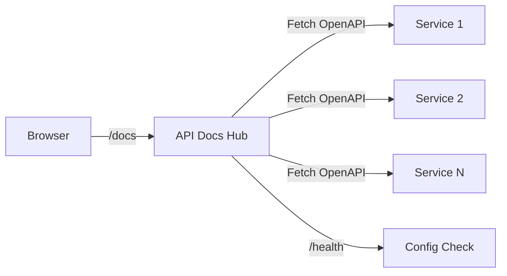

# API Docs Hub - Technical Reference

## Overview

API-docs-hub is a lightweight Fastify server that aggregates OpenAPI specifications from all IntexuraOS services into a
single Swagger UI instance.

**Versions:** Package `2.1.0` · OpenAPI spec `0.0.4`

## Architecture



## API Endpoints

| Method | Path      | Description  | Auth |
| ------ | --------- | ------------ | ---- |
| GET    | `/docs`   | Swagger UI   | None |
| GET    | `/health` | Health check | None |

## Configuration

The service loads `openApiSources` from config:

```typescript
interface OpenApiSource {
  name: string; // Display name in dropdown
  url: string; // URL to OpenAPI JSON/YAML
}
```

All 15 sources are **required** at startup — missing any env var causes a fail-fast error.

## Health Check

Response includes:

- `status`: "ok" if sources configured, "down" otherwise
- `sourceCount`: Number of configured sources

Note: The health endpoint uses raw `reply.send()` deliberately — health check format must remain independent of the app-level response contract (`reply.ok()` / `reply.fail()`).

## Dependencies

**Packages:**

- `@fastify/swagger` - OpenAPI 3.1.1 generation
- `@fastify/swagger-ui` - Swagger UI with multi-spec support
- `@intexuraos/common-http` - `intexuraFastifyPlugin`, `registerQuietHealthCheckLogging`
- `@intexuraos/http-server` - `buildHealthResponse`, `HealthCheck` types
- `@intexuraos/infra-sentry` - Sentry error capture, `createLogStream()`
- `@intexuraos/infra-otel` - Dash0 OpenTelemetry integration (optional, via env var)

**No external service dependencies.**

**No database dependencies.**

## Logging Pipeline

`createLogStream()` from `@intexuraos/infra-sentry` assembles a multi-destination pino stream:

| Environment  | Output                                                      |
| ------------ | ----------------------------------------------------------- |
| `test`       | Logger disabled                                             |
| `dev` (PM2)  | Human-readable formatted output                             |
| `production` | Raw JSON + Sentry error forwarding                          |
| Any + Dash0  | + OTLP forwarding when `INTEXURAOS_DASH0_OTLP_ENDPOINT` set |

Health check routes are excluded from request logging via `registerQuietHealthCheckLogging`.

## Environment Variables

| Variable                                              | Required | Description                                                        |
| ----------------------------------------------------- | -------- | ------------------------------------------------------------------ |
| `INTEXURAOS_USER_SERVICE_OPENAPI_URL`                 | Yes      | User Service OpenAPI JSON URL                                      |
| `INTEXURAOS_NOTION_SERVICE_OPENAPI_URL`               | Yes      | Notion Service OpenAPI JSON URL                                    |
| `INTEXURAOS_WHATSAPP_SERVICE_OPENAPI_URL`             | Yes      | WhatsApp Service OpenAPI URL                                       |
| `INTEXURAOS_MOBILE_NOTIFICATIONS_SERVICE_OPENAPI_URL` | Yes      | Mobile Notifications URL                                           |
| `INTEXURAOS_RESEARCH_AGENT_OPENAPI_URL`               | Yes      | Research Agent OpenAPI URL                                         |
| `INTEXURAOS_COMMANDS_AGENT_OPENAPI_URL`               | Yes      | Commands Agent OpenAPI URL                                         |
| `INTEXURAOS_ACTIONS_AGENT_OPENAPI_URL`                | Yes      | Actions Agent OpenAPI URL                                          |
| `INTEXURAOS_DATA_INSIGHTS_AGENT_OPENAPI_URL`          | Yes      | Data Insights Agent OpenAPI URL                                    |
| `INTEXURAOS_IMAGE_SERVICE_OPENAPI_URL`                | Yes      | Image Service OpenAPI URL                                          |
| `INTEXURAOS_NOTES_AGENT_OPENAPI_URL`                  | Yes      | Notes Agent OpenAPI URL                                            |
| `INTEXURAOS_TODOS_AGENT_OPENAPI_URL`                  | Yes      | Todos Agent OpenAPI URL                                            |
| `INTEXURAOS_APP_SETTINGS_SERVICE_OPENAPI_URL`         | Yes      | Application Settings URL                                           |
| `INTEXURAOS_BOOKMARKS_AGENT_OPENAPI_URL`              | Yes      | Bookmarks Agent OpenAPI URL                                        |
| `INTEXURAOS_CALENDAR_AGENT_OPENAPI_URL`               | Yes      | Calendar Agent OpenAPI URL                                         |
| `INTEXURAOS_CHAT_AGENT_OPENAPI_URL`                   | Yes      | Chat Agent OpenAPI URL                                             |
| `INTEXURAOS_SENTRY_DSN`                               | No       | Sentry DSN for error tracking                                      |
| `INTEXURAOS_DASH0_OTLP_ENDPOINT`                      | No       | Dash0 OTLP endpoint for log forwarding                             |
| `INTEXURAOS_ENVIRONMENT`                              | No       | Runtime environment name passed to Sentry (default: "development") |
| `PORT`                                                | No       | Server port (default: 8080)                                        |
| `HOST`                                                | No       | Server host (default: 0.0.0.0)                                     |

## Gotchas

**Config validation** - Empty `openApiSources` array returns health status "down".

**URL accessibility** - Swagger UI fetches specs client-side. Services must be accessible from browser.

**CORS** - Services must allow cross-origin requests from docs hub.

**Static config** - Changes require redeployment.

**15 sources** - Currently aggregates 15 service OpenAPI specs: User Service, Notion Service, WhatsApp Service, Mobile Notifications Service, Research Agent, Commands Agent, Actions Agent, Data Insights Agent, Image Service, Notes Agent, Todos Agent, Application Settings, Bookmarks Agent, Calendar Agent, and Chat Agent.

## File Structure

```
apps/api-docs-hub/src/
  config.ts         # OpenAPI sources configuration + env var validation
  server.ts         # Fastify server with Swagger UI + health endpoint
  index.ts          # Entry point: Sentry init, loadConfig, listen
```

## Recent Changes

| Date       | Change                                                                                   |
| ---------- | ---------------------------------------------------------------------------------------- |
| 2026-02-16 | `@intexuraos/infra-otel` added as dependency; Dash0 OTLP log forwarding enabled          |
| 2026-02-16 | Dev-mode log formatting: PM2 runs now emit human-readable output via `createLogStream()` |
| 2026-02-14 | `start:local` script switched from `node --experimental-strip-types` to `tsx`            |
| 2026-02-14 | PM2 ecosystem updated to use `pnpm --filter` with `start:local` scripts                  |
| 2026-02-01 | Chat Agent spec added (`INTEXURAOS_CHAT_AGENT_OPENAPI_URL`) — INT-431                    |
| 2026-01-27 | PromptVault spec removed — INT-319                                                       |
