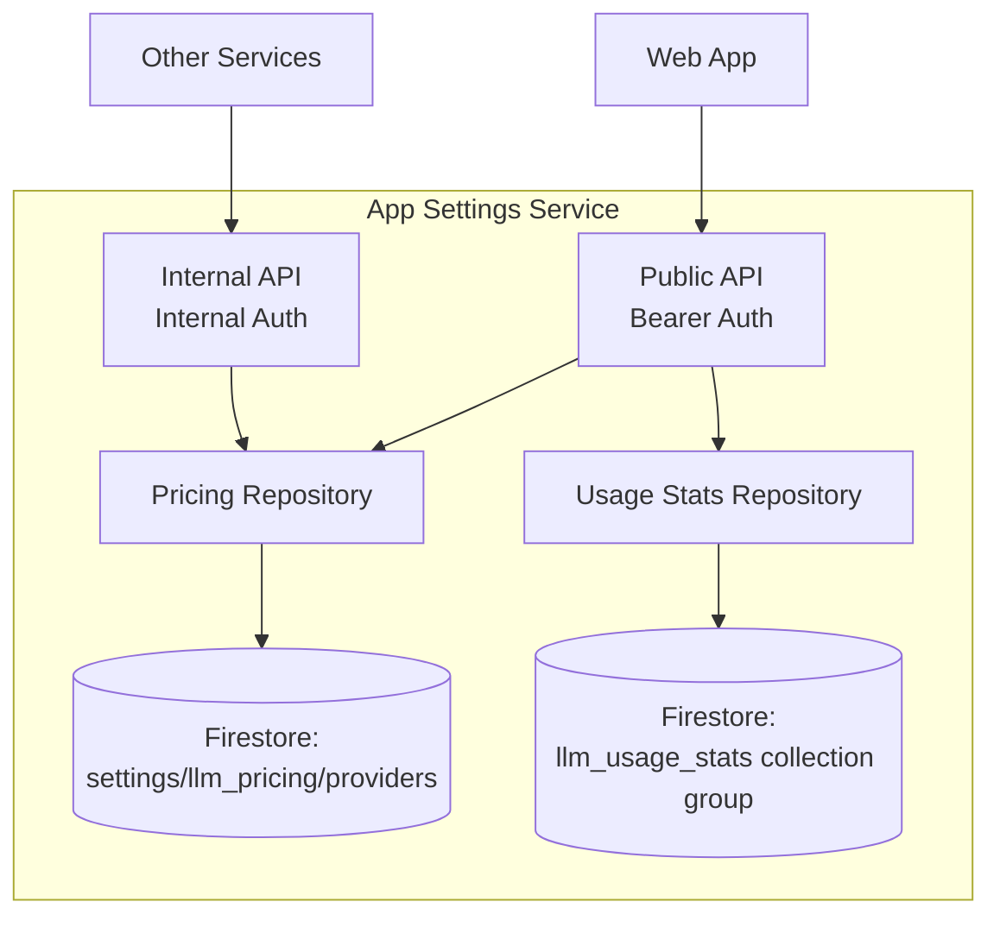

# App Settings Service - Technical Reference

## Overview

App-settings-service provides application-wide LLM pricing configuration and user-specific usage cost analytics. It serves both internal (service-to-service) and public (authenticated user) endpoints.

## Architecture



## API Endpoints

### Public Endpoints

| Method | Path                    | Description                          | Auth         |
| ------ | ----------------------- | ------------------------------------ | ------------ |
| GET    | `/settings/pricing`     | Get all LLM provider pricing         | Bearer token |
| GET    | `/settings/usage-costs` | Get authenticated user's usage costs | Bearer token |

### Internal Endpoints

| Method | Path                         | Description                  | Auth            |
| ------ | ---------------------------- | ---------------------------- | --------------- |
| GET    | `/internal/settings/pricing` | Get all LLM provider pricing | Internal header |

### Pricing Response

```typescript
{
  google: ProviderPricing,
  openai: ProviderPricing,
  anthropic: ProviderPricing,
  perplexity: ProviderPricing,
  zai: ProviderPricing
}
```

### Usage Costs Query Parameters

| Parameter | Type    | Default | Max | Description                        |
| --------- | ------- | ------- | --- | ---------------------------------- |
| `days`    | integer | 90      | 365 | Number of days of history to fetch |

### Usage Costs Response

```typescript
{
  totalCostUsd: number,
  totalCalls: number,
  totalInputTokens: number,
  totalOutputTokens: number,
  monthlyBreakdown: MonthlyCost[],
  byModel: ModelCost[],
  byCallType: CallTypeCost[]
}
```

## Domain Models

### ProviderPricing

| Field       | Type                         | Description                   |
| ----------- | ---------------------------- | ----------------------------- |
| `provider`  | string                       | Provider name                 |
| `models`    | Record<string, ModelPricing> | Per-model pricing             |
| `updatedAt` | string                       | ISO date of last price update |

### ModelPricing

| Field                     | Type                            | Description                                        |
| ------------------------- | ------------------------------- | -------------------------------------------------- |
| `inputPricePerMillion`    | number                          | Cost per 1M input tokens (USD)                     |
| `outputPricePerMillion`   | number                          | Cost per 1M output tokens (USD)                    |
| `cacheReadMultiplier`     | number (optional)               | Multiplier on input cost for cache reads           |
| `cacheWriteMultiplier`    | number (optional)               | Multiplier on input cost for cache writes          |
| `webSearchCostPerCall`    | number (optional)               | Fixed cost per web search call (USD)               |
| `groundingCostPerRequest` | number (optional)               | Fixed cost per grounding request (USD)             |
| `imagePricing`            | Record<ImageSize, number> (opt) | Cost per image generation by size                  |
| `useProviderCost`         | boolean (optional)              | Use provider's reported cost instead of calculated |

### AggregatedCosts

| Field               | Type           | Description                                    |
| ------------------- | -------------- | ---------------------------------------------- |
| `totalCostUsd`      | number         | Total cost across all calls                    |
| `totalCalls`        | number         | Total number of calls                          |
| `totalInputTokens`  | number         | Total input tokens consumed                    |
| `totalOutputTokens` | number         | Total output tokens consumed                   |
| `monthlyBreakdown`  | MonthlyCost[]  | Cost grouped by month (newest first)           |
| `byModel`           | ModelCost[]    | Cost grouped by model (highest cost first)     |
| `byCallType`        | CallTypeCost[] | Cost grouped by call type (highest cost first) |

### MonthlyCost

| Field          | Type   | Description                       |
| -------------- | ------ | --------------------------------- |
| `month`        | string | Month key (e.g. "2026-01")        |
| `costUsd`      | number | Total cost for the month          |
| `calls`        | number | Total calls for the month         |
| `inputTokens`  | number | Total input tokens for the month  |
| `outputTokens` | number | Total output tokens for the month |
| `percentage`   | number | % of total cost (0-100, rounded)  |

### ModelCost

| Field        | Type   | Description                      |
| ------------ | ------ | -------------------------------- |
| `model`      | string | Model identifier                 |
| `costUsd`    | number | Total cost for this model        |
| `calls`      | number | Total calls using this model     |
| `percentage` | number | % of total cost (0-100, rounded) |

### CallTypeCost

| Field        | Type   | Description                      |
| ------------ | ------ | -------------------------------- |
| `callType`   | string | Call type identifier             |
| `costUsd`    | number | Total cost for this call type    |
| `calls`      | number | Total calls of this type         |
| `percentage` | number | % of total cost (0-100, rounded) |

## Configuration

| Environment Variable             | Required | Description                                |
| -------------------------------- | -------- | ------------------------------------------ |
| `INTEXURAOS_GCP_PROJECT_ID`      | Yes      | GCP project ID for Firestore access        |
| `INTEXURAOS_INTERNAL_AUTH_TOKEN` | Yes      | Shared secret for service-to-service calls |
| `INTEXURAOS_SENTRY_DSN`          | No       | Sentry DSN for error reporting             |

> **Note:** Firestore collection paths are hardcoded in the repository implementations:
>
> - Pricing: `settings/llm_pricing/providers/{provider}`
> - Usage stats: collection group `by_user` within `llm_usage_stats/{model}/by_call_type/{callType}/by_period/{YYYY-MM-DD}/by_user/{userId}`

## Dependencies

### Infrastructure

| Component                                      | Purpose                                           |
| ---------------------------------------------- | ------------------------------------------------- |
| Firestore (`settings/llm_pricing/providers`)   | Provider pricing config (document per provider)   |
| Firestore (`llm_usage_stats` collection group) | User usage statistics (written by other services) |

### Internal Services

| Service    | Purpose                                        |
| ---------- | ---------------------------------------------- |
| (multiple) | Fetch pricing via internal endpoint at startup |

## Startup Validation

On startup, `validateAllModelPricing()` fetches pricing for all 5 providers and verifies that every model listed in `ALL_LLM_MODELS` (from `@intexuraos/llm-contract`) has pricing configured. If any model is missing, the service **refuses to start** and prints a detailed error listing the missing models and their providers.

This ensures no service can boot with stale pricing data.

## Gotchas

**Response contract** - All endpoints use `reply.ok(data)` / `reply.fail(code, message)`. Internal auth errors return `{ success: false, error: { code: "UNAUTHORIZED", message: "..." } }`. Missing provider errors return `{ success: false, error: { code: "INTERNAL_ERROR", message: "Missing pricing for providers: ..." } }`.

**Sentry logging** - `FirestoreUsageStatsRepository` uses `createAppLogger()` from `@intexuraos/infra-sentry`, not direct `pino()`.

**Missing providers** - Returns 500 with `reply.fail('INTERNAL_ERROR', ...)` if any provider pricing is missing from Firestore. All 5 providers (Google, OpenAI, Anthropic, Perplexity, Zai) must be present.

**Default days** - Usage endpoint defaults to 90 days if not specified.

**Max days** - Maximum 365 days. Requesting higher returns 400 error.

**User scoping** - Usage costs automatically scoped to authenticated user via `requireAuth()`.

**Internal vs Public** - Internal endpoint used by services to load pricing at startup. Public endpoint used by web UI.

**No per-day breakdown** - The usage response does NOT include a daily breakdown array. Aggregation is by month, model, and call type only.

**Collection group queries** - Usage stats use a Firestore collection group query (`by_user`), not a standard collection query. This queries across all nested `by_user` subcollections regardless of model/call type path.

**Price precision** - All cost values are rounded to 6 decimal places (`Math.round(cost * 1_000_000) / 1_000_000`).

## Recent Changes

- **Dash0 OpenTelemetry integration** - Added distributed tracing via Dash0 OTLP endpoint (2026-02-16)
- **Dev-mode log formatting** - Added structured log formatting for PM2 readability in local development (2026-02-16)
- **PM2 ecosystem migration** - Switched from direct node invocation to `pnpm --filter` with `start:local` scripts (2026-02-14)
- **Response contract standardization** - Internal endpoints now use `reply.ok(data)` / `reply.fail(code, message)` (2026-02-01)
- **Sentry-enabled logging** - `FirestoreUsageStatsRepository` migrated from direct `pino()` to `createAppLogger()` (2026-02-01)
- **100% branch coverage** - Added v8 ignore exemptions for TypeScript-only safety branches (2026-02-02)

## File Structure

```
apps/app-settings-service/src/
  domain/ports/
    index.ts                 # Port interfaces: PricingRepository, UsageStatsRepository, all types
  infra/firestore/
    index.ts                 # FirestorePricingRepository (reads settings/llm_pricing/providers)
    usageStatsRepository.ts  # FirestoreUsageStatsRepository (collection group query)
  routes/
    publicRoutes.ts          # GET /settings/pricing, GET /settings/usage-costs (Bearer auth)
    internalRoutes.ts        # GET /internal/settings/pricing (Internal auth)
  services.ts                # DI container (getServices, setServices, resetServices)
  server.ts                  # Fastify server setup, OpenAPI schemas, health check
  index.ts                   # Entry point: startup validation, env check, server start
```
