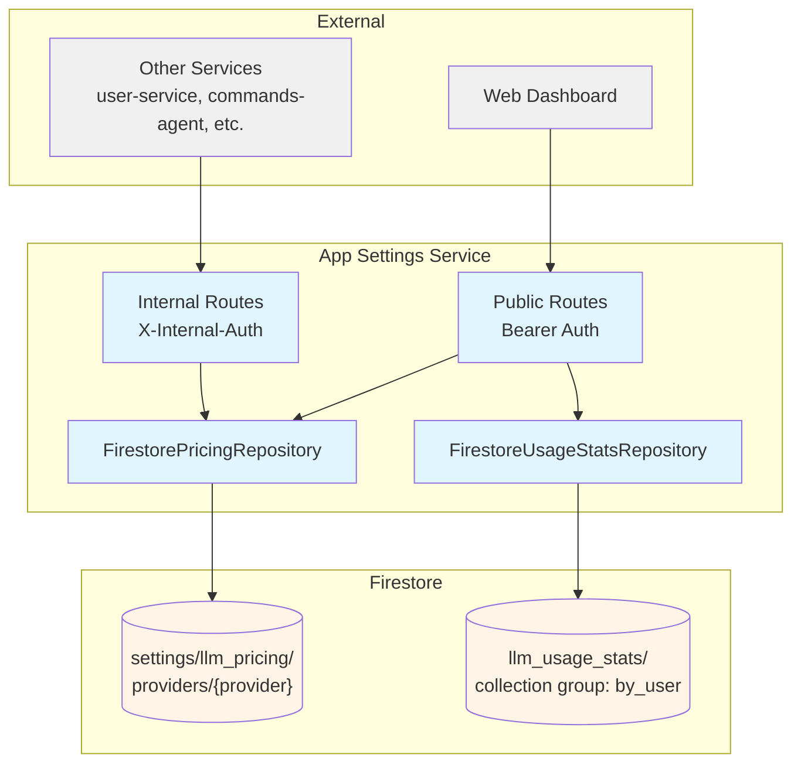
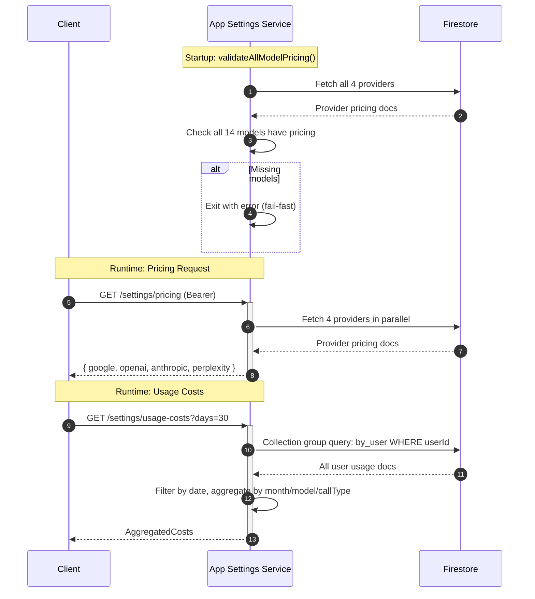

# App Settings Service -- Technical Reference

## Overview

App-settings-service provides centralized LLM pricing configuration and user-specific usage cost analytics. It runs on Cloud Run (port 8122 locally) and depends on Firestore for pricing data (`settings/llm_pricing/providers`) and usage statistics (`llm_usage_stats` collection group). The service validates pricing completeness at startup and serves both internal (service-to-service) and public (authenticated user) endpoints.

## Architecture



## Data Flow



## Recent Changes

| Commit     | Description                                                 | Date       |
| ---------- | ----------------------------------------------------------- | ---------- |
| `93aeac4a` | Remove ZAI provider and GLM-4.7 models (INT-836)            | 2026-03-12 |
| `b3f34d85` | Release v3.1.0                                              | 2026-02-22 |
| `c8a42105` | Release v3.0.0                                              | 2026-02-19 |
| `6063175b` | Add dev-mode log formatting for PM2 readability             | 2026-02-16 |
| `a52a6bbc` | Add Dash0 OpenTelemetry integration                         | 2026-02-16 |
| `d5fbb354` | Fix start:local to use tsx instead of experimental types    | 2026-02-14 |
| `45f001c1` | Switch PM2 ecosystem to pnpm --filter with start:local      | 2026-02-14 |
| `5aa3e1bd` | Enable strict 100% coverage enforcement (Phase 3)           | 2026-01-31 |
| `c3198407` | Fix all 132 response contract violations across codebase    | 2026-01-30 |
| `dfd702f1` | Add Sentry-enabled logger factory and migrate all apps      | 2026-01-30 |

## API Endpoints

### Public Endpoints

| Method | Path                    | Purpose                                   | Auth         |
| ------ | ----------------------- | ----------------------------------------- | ------------ |
| GET    | `/settings/pricing`     | Get LLM pricing for all 4 providers       | Bearer token |
| GET    | `/settings/usage-costs` | Get authenticated user's aggregated costs | Bearer token |

### Internal Endpoints

| Method | Path                         | Purpose                                         | Caller                                            |
| ------ | ---------------------------- | ----------------------------------------------- | ------------------------------------------------- |
| GET    | `/internal/settings/pricing` | Get all LLM provider pricing (service startup)  | user-service, commands-agent, actions-agent, etc. |

### System Endpoints

| Method | Path            | Purpose              | Auth |
| ------ | --------------- | -------------------- | ---- |
| GET    | `/health`       | Health check         | None |
| GET    | `/openapi.json` | OpenAPI spec         | None |
| GET    | `/docs`         | Swagger UI           | None |

### Pricing Response

```typescript
{
  google: ProviderPricing,
  openai: ProviderPricing,
  anthropic: ProviderPricing,
  perplexity: ProviderPricing
}
```

### Usage Costs Query Parameters

| Parameter | Type    | Default | Max | Description                        |
| --------- | ------- | ------- | --- | ---------------------------------- |
| `days`    | integer | 90      | 365 | Number of days of history to fetch |

### Usage Costs Response

```typescript
{
  totalCostUsd: number,
  totalCalls: number,
  totalInputTokens: number,
  totalOutputTokens: number,
  monthlyBreakdown: MonthlyCost[],
  byModel: ModelCost[],
  byCallType: CallTypeCost[]
}
```

## Domain Model

### ProviderPricing

| Field       | Type                           | Description                   |
| ----------- | ------------------------------ | ----------------------------- |
| `provider`  | `LlmProvider`                  | Provider name                 |
| `models`    | `Record<string, ModelPricing>` | Per-model pricing             |
| `updatedAt` | `string`                       | ISO date of last price update |

### ModelPricing

| Field                     | Type                              | Description                                         |
| ------------------------- | --------------------------------- | --------------------------------------------------- |
| `inputPricePerMillion`    | `number`                          | Cost per 1M input tokens (USD)                      |
| `outputPricePerMillion`   | `number`                          | Cost per 1M output tokens (USD)                     |
| `cacheReadMultiplier`     | `number` (optional)               | Multiplier on input cost for cache reads            |
| `cacheWriteMultiplier`    | `number` (optional)               | Multiplier on input cost for cache writes           |
| `webSearchCostPerCall`    | `number` (optional)               | Fixed cost per web search call (USD)                |
| `groundingCostPerRequest` | `number` (optional)               | Fixed cost per grounding request (USD)              |
| `imagePricing`            | `Record<ImageSize, number>` (opt) | Cost per image generation by size                   |
| `useProviderCost`         | `boolean` (optional)              | Use provider's reported cost instead of calculated  |

### ImageSize

```typescript
type ImageSize = '1024x1024' | '1536x1024' | '1024x1536';
```

### AggregatedCosts

| Field               | Type             | Description                                    |
| ------------------- | ---------------- | ---------------------------------------------- |
| `totalCostUsd`      | `number`         | Total cost across all calls                    |
| `totalCalls`        | `number`         | Total number of calls                          |
| `totalInputTokens`  | `number`         | Total input tokens consumed                    |
| `totalOutputTokens` | `number`         | Total output tokens consumed                   |
| `monthlyBreakdown`  | `MonthlyCost[]`  | Cost grouped by month (newest first)           |
| `byModel`           | `ModelCost[]`    | Cost grouped by model (highest cost first)     |
| `byCallType`        | `CallTypeCost[]` | Cost grouped by call type (highest cost first) |

### MonthlyCost

| Field          | Type     | Description                       |
| -------------- | -------- | --------------------------------- |
| `month`        | `string` | Month key (e.g. "2026-01")        |
| `costUsd`      | `number` | Total cost for the month          |
| `calls`        | `number` | Total calls for the month         |
| `inputTokens`  | `number` | Total input tokens for the month  |
| `outputTokens` | `number` | Total output tokens for the month |
| `percentage`   | `number` | % of total cost (0-100, rounded)  |

### ModelCost

| Field        | Type     | Description                      |
| ------------ | -------- | -------------------------------- |
| `model`      | `string` | Model identifier                 |
| `costUsd`    | `number` | Total cost for this model        |
| `calls`      | `number` | Total calls using this model     |
| `percentage` | `number` | % of total cost (0-100, rounded) |

### CallTypeCost

| Field        | Type     | Description                      |
| ------------ | -------- | -------------------------------- |
| `callType`   | `string` | Call type identifier             |
| `costUsd`    | `number` | Total cost for this call type    |
| `calls`      | `number` | Total calls of this type         |
| `percentage` | `number` | % of total cost (0-100, rounded) |

## Configuration

| Environment Variable             | Required | Description                                |
| -------------------------------- | -------- | ------------------------------------------ |
| `INTEXURAOS_GCP_PROJECT_ID`      | Yes      | GCP project ID for Firestore access        |
| `INTEXURAOS_INTERNAL_AUTH_TOKEN` | Yes      | Shared secret for service-to-service calls |
| `INTEXURAOS_SENTRY_DSN`          | No       | Sentry DSN for error reporting             |
| `INTEXURAOS_ENVIRONMENT`         | No       | Environment name (default: "development")  |
| `PORT`                           | No       | HTTP port (default: 8080, local: 8122)     |
| `HOST`                           | No       | Bind address (default: 0.0.0.0)            |
| `LOG_LEVEL`                      | No       | Pino log level (default: "info")           |

> **Note:** Firestore collection paths are hardcoded in the repository implementations:
>
> - Pricing: `settings/llm_pricing/providers/{provider}`
> - Usage stats: collection group `by_user` within `llm_usage_stats/{model}/by_call_type/{callType}/by_period/{YYYY-MM-DD}/by_user/{userId}`

## Dependencies

### Infrastructure

| Component                                      | Purpose                                           |
| ---------------------------------------------- | ------------------------------------------------- |
| Firestore (`settings/llm_pricing/providers`)   | Provider pricing config (document per provider)   |
| Firestore (`llm_usage_stats` collection group) | User usage statistics (written by other services) |

### Internal Services

| Service    | Direction | Purpose                                        |
| ---------- | --------- | ---------------------------------------------- |
| (multiple) | Inbound   | Fetch pricing via internal endpoint at startup |

### Packages

| Package                       | Purpose                               |
| ----------------------------- | ------------------------------------- |
| `@intexuraos/common-http`     | Fastify plugin, auth, request logging |
| `@intexuraos/common-core`     | Error message utilities               |
| `@intexuraos/http-contracts`  | Core JSON schemas                     |
| `@intexuraos/http-server`     | Health checks, env validation         |
| `@intexuraos/infra-firestore` | Firestore client singleton            |
| `@intexuraos/infra-sentry`    | Sentry init, app logger, log stream   |
| `@intexuraos/infra-otel`      | OpenTelemetry distributed tracing     |
| `@intexuraos/llm-contract`    | Model/provider types, ALL_LLM_MODELS  |

## Startup Validation

On startup, `validateAllModelPricing()` fetches pricing for all 4 providers and verifies that every model listed in `ALL_LLM_MODELS` (14 models from `@intexuraos/llm-contract`) has pricing configured. If any model is missing, the service refuses to start and prints a detailed error listing the missing models and their providers.

This ensures no downstream service can boot with stale or incomplete pricing data.

## Gotchas

- **Startup boot order** -- Other services (user-service, commands-agent, actions-agent) depend on app-settings-service and poll its `/health` endpoint before starting. The `ecosystem.config.cjs` configures `waitForService: 'http://localhost:8122/health'` for these dependents.

- **Missing providers return 500** -- If any of the 4 providers is missing from Firestore, both public and internal pricing endpoints return `reply.fail('INTERNAL_ERROR', ...)`. All 4 providers must be present.

- **Collection group query reads all history** -- `FirestoreUsageStatsRepository.getUserCosts()` fetches ALL documents for a user via collection group query, then filters by date client-side. The `days` parameter does not reduce Firestore reads.

- **Price precision** -- All cost values are rounded to 6 decimal places (`Math.round(cost * 1_000_000) / 1_000_000`).

- **Usage data is read-only** -- This service reads usage stats written by other services (via `llm-pricing` package). It does not write usage data.

- **No per-day breakdown** -- The usage response does NOT include a daily breakdown array. Aggregation dimensions are month, model, and call type only.

- **Internal vs Public auth** -- Internal endpoint uses `X-Internal-Auth` header with shared secret. Public endpoints use Bearer JWT tokens validated via `requireAuth()`.

- **Response contract** -- All endpoints use `reply.ok(data)` / `reply.fail(code, message)`. Returns `{ success: true, data }` or `{ success: false, error: { code, message } }`.

## File Structure

```
apps/app-settings-service/src/
  domain/ports/
    index.ts                 # Port interfaces: PricingRepository, UsageStatsRepository, all types
  infra/firestore/
    index.ts                 # FirestorePricingRepository (reads settings/llm_pricing/providers)
    usageStatsRepository.ts  # FirestoreUsageStatsRepository (collection group query, aggregation)
  routes/
    publicRoutes.ts          # GET /settings/pricing, GET /settings/usage-costs (Bearer auth)
    internalRoutes.ts        # GET /internal/settings/pricing (Internal auth)
  __tests__/
    routes/
      publicRoutes.test.ts   # 15 tests covering auth, pricing, usage-costs
      internalRoutes.test.ts # 10 tests covering auth, pricing
    infra/
      FirestorePricingRepository.test.ts  # 2 tests
      usageStatsRepository.test.ts        # 12 tests covering aggregation, filtering, sorting
  services.ts                # DI container (getServices, setServices, resetServices)
  server.ts                  # Fastify server setup, OpenAPI schemas, health check
  index.ts                   # Entry point: startup validation, env check, server start
```
