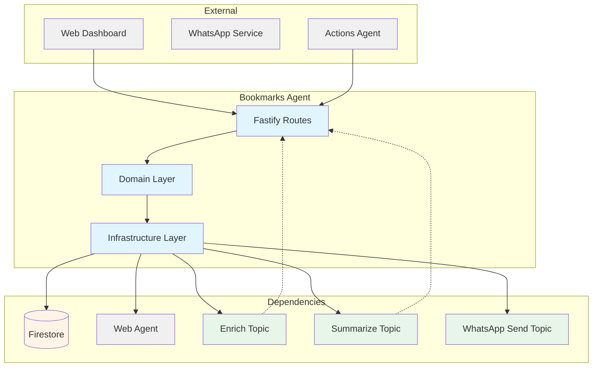
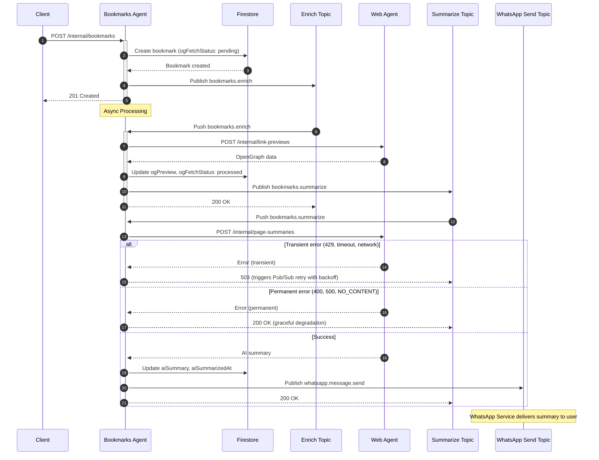

# Bookmarks Agent — Technical Reference

## Overview

Bookmarks-agent provides CRUD operations for user bookmarks with automatic OpenGraph metadata fetching via web-agent and AI summarization with WhatsApp delivery. Runs on Cloud Run with Fastify. Uses a decoupled event-driven architecture where bookmark enrichment and summarization are processed asynchronously via Pub/Sub.

## Architecture



## Data Flow

### Bookmark Creation and Enrichment Flow



## Recent Changes

| Commit     | Description                                            | Date       |
| ---------- | ------------------------------------------------------ | ---------- |
| `c4e3a13c` | Release v3.3.0                                         | 2026-03-15 |
| `b6524aaa` | Write tests for v8-ignore blocks (INT-786)             | 2026-03-13 |
| `44ea683a` | Release v3.2.0                                         | 2026-03-07 |
| `b3f34d85` | Release v3.1.0                                         | 2026-02-22 |
| `c8a42105` | Release v3.0.0                                         | 2026-02-19 |
| `6063175b` | Add dev-mode log formatting for PM2 readability        | 2026-02-16 |
| `a52a6bbc` | Add Dash0 OpenTelemetry integration                    | 2026-02-16 |
| `45f001c1` | Switch PM2 ecosystem to pnpm --filter with start:local | 2026-02-14 |
| `5aa3e1bd` | Enable strict 100% coverage enforcement (Phase 3)      | 2026-01-31 |
| `c3198407` | Fix response contract violations across codebase       | 2026-01-30 |
| `d105688f` | Add RATE_LIMITED error code for Crawl4AI 429 responses | 2026-01-30 |

## API Endpoints

### Public Endpoints

| Method | Path                       | Description                        | Auth         |
| ------ | -------------------------- | ---------------------------------- | ------------ |
| GET    | `/bookmarks`               | List user's bookmarks (filterable) | Bearer token |
| POST   | `/bookmarks`               | Create new bookmark                | Bearer token |
| GET    | `/bookmarks/:id`           | Get specific bookmark              | Bearer token |
| PATCH  | `/bookmarks/:id`           | Update bookmark                    | Bearer token |
| DELETE | `/bookmarks/:id`           | Delete bookmark                    | Bearer token |
| POST   | `/bookmarks/:id/archive`   | Archive a bookmark                 | Bearer token |
| POST   | `/bookmarks/:id/unarchive` | Unarchive a bookmark               | Bearer token |
| GET    | `/images/proxy`            | Proxy external images (no auth)    | None         |

### Internal Endpoints

| Method | Path                                    | Description                                                  | Auth            |
| ------ | --------------------------------------- | ------------------------------------------------------------ | --------------- |
| POST   | `/internal/bookmarks`                   | Create bookmark from other services                          | Internal header |
| GET    | `/internal/bookmarks/:id`               | Get bookmark for internal services                           | Internal header |
| PATCH  | `/internal/bookmarks/:id`               | Update bookmark (AI summary, OG data)                        | Internal header |
| POST   | `/internal/bookmarks/:id/force-refresh` | Force refresh OG metadata                                    | Internal header |
| POST   | `/internal/bookmarks/pubsub/enrich`     | Pub/Sub push handler for enrichment                          | Pub/Sub OIDC    |
| POST   | `/internal/bookmarks/pubsub/summarize`  | Pub/Sub push handler for AI summary (503 on transient error) | Pub/Sub OIDC    |

### System Endpoints

| Method | Path            | Description           | Auth |
| ------ | --------------- | --------------------- | ---- |
| GET    | `/health`       | Health check          | None |
| GET    | `/docs`         | Swagger UI            | None |
| GET    | `/openapi.json` | OpenAPI specification | None |

## Domain Model

### Bookmark

| Field            | Type                              | Description                      |
| ---------------- | --------------------------------- | -------------------------------- |
| `id`             | `string`                          | Unique bookmark identifier       |
| `userId`         | `string`                          | Owner user ID                    |
| `status`         | `'draft' \                        | 'active'`                        | Draft or active status |
| `url`            | `string`                          | Bookmark URL                     |
| `title`          | `string \                         | null`                            | Page title |
| `description`    | `string \                         | null`                            | Page description |
| `tags`           | `string[]`                        | User-defined tags                |
| `ogPreview`      | `OpenGraphPreview \               | null`                            | Fetched metadata |
| `ogFetchedAt`    | `Date \                           | null`                            | When metadata was fetched |
| `ogFetchStatus`  | `'pending' \                      | 'processed' \                    | 'failed'` | Metadata fetch status |
| `aiSummary`      | `string \                         | null`                            | AI-generated summary |
| `aiSummarizedAt` | `Date \                           | null`                            | When summary was generated |
| `source`         | `string`                          | Source system (e.g., 'whatsapp') |
| `sourceId`       | `string`                          | ID in source system              |
| `archived`       | `boolean`                         | Soft delete flag                 |
| `createdAt`      | `Date`                            | Creation timestamp               |
| `updatedAt`      | `Date`                            | Last update timestamp            |

### OpenGraphPreview

| Field         | Type             | Description    |
| ------------- | ---------------- | -------------- |
| `title`       | `string \        | null`          | OG title |
| `description` | `string \        | null`          | OG description |
| `image`       | `string \        | null`          | OG image URL |
| `siteName`    | `string \        | null`          | OG site name |
| `type`        | `string \        | null`          | OG type |
| `favicon`     | `string \        | null`          | Favicon URL |

### OgFetchStatus Values

| Status      | Meaning                              |
| ----------- | ------------------------------------ |
| `pending`   | Awaiting OG fetch                    |
| `processed` | OG metadata successfully fetched     |
| `failed`    | OG fetch failed (site blocked, etc.) |

### BookmarkStatus Values

| Status   | Meaning                          |
| -------- | -------------------------------- |
| `draft`  | Created but not yet visible      |
| `active` | Normal active bookmark (default) |

### BookmarkErrorCode Values

| Code                | Meaning                             |
| ------------------- | ----------------------------------- |
| `NOT_FOUND`         | Bookmark does not exist             |
| `STORAGE_ERROR`     | Firestore operation failed          |
| `INVALID_OPERATION` | Invalid state transition            |
| `DUPLICATE_URL`     | URL already bookmarked by this user |

## Pub/Sub Events

### Published Events

| Topic                                   | Event Type              | Payload                              | Trigger                          |
| --------------------------------------- | ----------------------- | ------------------------------------ | -------------------------------- |
| `INTEXURAOS_PUBSUB_BOOKMARK_ENRICH`     | `bookmarks.enrich`      | `{ bookmarkId, userId, url }`        | After internal bookmark creation |
| `INTEXURAOS_PUBSUB_BOOKMARK_SUMMARIZE`  | `bookmarks.summarize`   | `{ bookmarkId, userId }`             | After successful OG enrichment   |
| `INTEXURAOS_PUBSUB_WHATSAPP_SEND_TOPIC` | `whatsapp.message.send` | `{ userId, message, correlationId }` | After successful AI summary      |

### Subscribed Events

| Topic                                  | Handler                                | Action                                                     |
| -------------------------------------- | -------------------------------------- | ---------------------------------------------------------- |
| `INTEXURAOS_PUBSUB_BOOKMARK_ENRICH`    | `/internal/bookmarks/pubsub/enrich`    | Fetch OG metadata, trigger summarize                       |
| `INTEXURAOS_PUBSUB_BOOKMARK_SUMMARIZE` | `/internal/bookmarks/pubsub/summarize` | Generate AI summary, send WhatsApp; 503 on transient error |

### Transient Error Handling

The summarization pipeline classifies errors as transient or permanent to enable Pub/Sub retry:

| Error Source          | Transient                           | Permanent                    |
| --------------------- | ----------------------------------- | ---------------------------- |
| HTTP status           | 429 (rate limit), 503, 504          | 400, 500                     |
| Network               | Connection failures                 | —                            |
| web-agent error codes | TIMEOUT, FETCH_FAILED, RATE_LIMITED | NO_CONTENT, invalid response |

**Behavior:**

- Transient errors: `summarizeBookmark` returns `TRANSIENT_ERROR`; Pub/Sub route responds HTTP 503 with `{ error, retryable: true }`, triggering Pub/Sub exponential backoff retry
- Permanent errors: `summarizeBookmark` returns success (graceful degradation); Pub/Sub route responds HTTP 200, acknowledging the message to prevent infinite retries

## Dependencies

### Internal Services

| Service     | Endpoint                   | Purpose                       |
| ----------- | -------------------------- | ----------------------------- |
| `web-agent` | `/internal/link-previews`  | OpenGraph metadata fetching   |
| `web-agent` | `/internal/page-summaries` | AI-powered page summarization |

### Infrastructure

| Component                          | Purpose                       |
| ---------------------------------- | ----------------------------- |
| Firestore (`bookmarks` collection) | Bookmark persistence          |
| Pub/Sub (3 topics)                 | Event-driven async processing |
| Sentry                             | Error reporting               |
| Dash0 OpenTelemetry                | Distributed tracing           |

### Decoupled WhatsApp Delivery

The service uses `WhatsAppSendPublisher` from `@intexuraos/infra-pubsub` to publish `SendMessageEvent` events. This decouples bookmarks-agent from whatsapp-service:

```typescript
interface SendMessageEvent {
  type: 'whatsapp.message.send';
  userId: string;
  message: string;
  correlationId: string;
  timestamp: string;
  replyToMessageId?: string;
}
```

The `summarizeBookmark` use case publishes this event after successful AI summarization. whatsapp-service's SendMessageWorker processes the event and delivers the message.

### Transient Error Type

The `summarizeBookmark` use case returns a `TransientError` discriminated union variant for retryable failures:

```typescript
interface TransientError {
  code: 'TRANSIENT_ERROR';
  message: string;
}
```

The Pub/Sub route checks for this error code and responds with HTTP 503 to trigger Pub/Sub retry.

## Configuration

All required env vars are validated at startup via `validateRequiredEnv()` in `index.ts`. `INTEXURAOS_SENTRY_DSN` is validated separately before `validateRequiredEnv()`.

| Environment Variable                    | Required | Description                                   |
| --------------------------------------- | -------- | --------------------------------------------- |
| `INTEXURAOS_GCP_PROJECT_ID`             | Yes      | GCP project for Pub/Sub                       |
| `INTEXURAOS_AUTH_JWKS_URL`              | Yes      | Auth0 JWKS endpoint                           |
| `INTEXURAOS_AUTH_ISSUER`                | Yes      | Auth0 token issuer                            |
| `INTEXURAOS_AUTH_AUDIENCE`              | Yes      | Auth0 token audience                          |
| `INTEXURAOS_INTERNAL_AUTH_TOKEN`        | Yes      | Internal auth header value                    |
| `INTEXURAOS_WEB_AGENT_URL`              | Yes      | Web-agent base URL                            |
| `INTEXURAOS_PUBSUB_WHATSAPP_SEND_TOPIC` | Yes      | WhatsApp send topic name                      |
| `INTEXURAOS_PUBSUB_BOOKMARK_ENRICH`     | Yes      | Enrichment topic name                         |
| `INTEXURAOS_PUBSUB_BOOKMARK_SUMMARIZE`  | Yes      | Summarization topic name                      |
| `INTEXURAOS_SENTRY_DSN`                 | Yes      | Sentry DSN for error reporting                |
| `INTEXURAOS_ENVIRONMENT`                | No       | Sentry environment tag (default: development) |
| `PORT`                                  | No       | Server port (default: 8080)                   |

## Gotchas

- **Enrichment is async** — `POST /internal/bookmarks` returns immediately with `{ id, url, bookmark }` where `url` is the app deep link (`/#/bookmarks/{id}`); OG data and AI summary populate later via Pub/Sub
- **Enrichment only triggers on internal create** — The public `POST /bookmarks` endpoint does NOT trigger the enrichment pipeline; only `POST /internal/bookmarks` publishes the `bookmarks.enrich` event
- **Duplicate detection by userId+url** — Same URL can exist for different users
- **OG fetch can fail** — Some sites block scrapers; status will be `failed`
- **WhatsApp delivery is fire-and-forget** — If Pub/Sub publish fails, no retry for WhatsApp notification (summary is still saved)
- **Force refresh always fetches** — Unlike enrichment, force-refresh ignores `processed` status and always re-fetches
- **Transient vs permanent errors** — Only transient errors (429, timeout, network) trigger Pub/Sub retry; permanent errors (NO_CONTENT, 400) result in graceful degradation with HTTP 200
- **Legacy bookmarks have no status field** — Firestore repository defaults to `'active'` for documents missing the `status` field
- **Logging requires Sentry integration** — All loggers use `createAppLogger()` from `@intexuraos/infra-sentry`; never use `pino()` directly
- **Image proxy has 10-second timeout** — Requests to fetch external images abort after 10 seconds
- **Image proxy validates content type** — Returns 400 if the proxied URL does not return an `image/*` content type
- **Pub/Sub auth dual-mode** — Pub/Sub push handlers accept either Google OIDC (`From: noreply@google.com`) or `X-Internal-Auth` header for local development

## File Structure

```
apps/bookmarks-agent/src/
  domain/
    models/
      bookmark.ts                    # Bookmark entity and types
    ports/
      bookmarkRepository.ts          # Repository interface
      bookmarkSummaryService.ts      # Summary service interface
      linkPreviewFetcher.ts          # Link preview interface
      summarizePublisher.ts          # Summarize event publisher interface
    usecases/
      createBookmark.ts              # Create with duplicate check
      getBookmark.ts                 # Get by ID with ownership check
      listBookmarks.ts               # List with filters
      updateBookmark.ts              # User-facing update
      deleteBookmark.ts              # Hard delete with ownership check
      archiveBookmark.ts             # Soft delete
      unarchiveBookmark.ts           # Restore from archive
      enrichBookmark.ts              # OG fetch + trigger summarize
      summarizeBookmark.ts           # AI summary + WhatsApp delivery
      updateBookmarkInternal.ts      # Internal updates (OG, AI)
      forceRefreshBookmark.ts        # Force OG re-fetch
  infra/
    firestore/
      firestoreBookmarkRepository.ts # Firestore implementation
    linkpreview/
      webAgentClient.ts              # Web-agent OG client
    summary/
      webAgentSummaryClient.ts       # Web-agent summary client
      index.ts                       # Re-export barrel
    pubsub/
      enrichPublisher.ts             # Enrich event publisher
      summarizePublisher.ts          # Summarize event publisher
  routes/
    bookmarkRoutes.ts                # Public CRUD routes + image proxy
    internalRoutes.ts                # Internal service routes
    pubsubRoutes.ts                  # Pub/Sub push handlers
  services.ts                        # DI container
  server.ts                          # Fastify setup with Swagger
  config.ts                          # Configuration loading
  index.ts                           # Entry point
```
