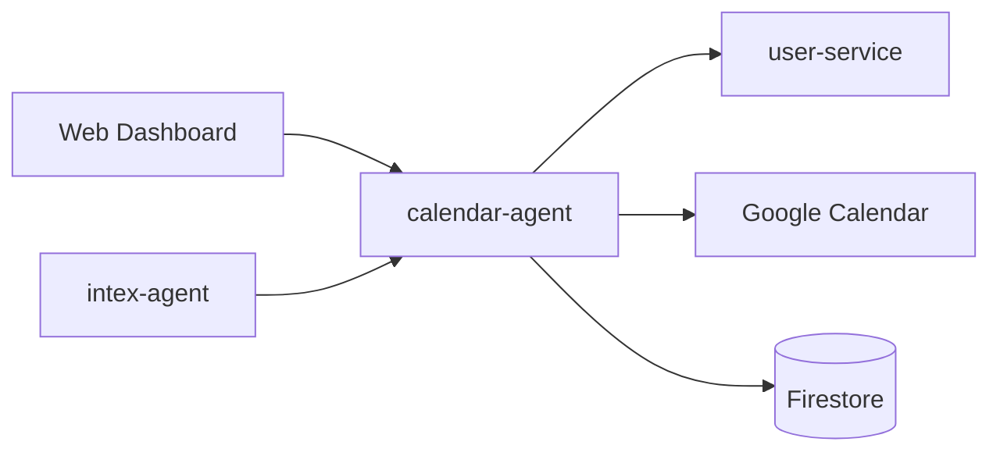

# Calendar Agent Technical Reference

Calendar Agent provides Google Calendar operations using the Google APIs client, user-service OAuth token retrieval, LLM-powered event extraction, and Firestore-backed failed-event recovery.

## Architecture

## Public Routes

| Method | Path | Purpose |
| --- | --- | --- |
| `GET` | `/connection` | Check Google Calendar connection |
| `GET` | `/events` | List calendar events |
| `POST` | `/events` | Create an event |
| `GET` | `/failed-events` | List failed extractions |
| `POST` | `/failed-events/:id/retry` | Retry a failed event |

## Internal Routes

| Method | Path | Purpose | Caller |
| --- | --- | --- | --- |
| `POST` | `/internal/calendar/events` | Create an event from a trusted service | Intex/internal clients |
| `POST` | `/internal/calendar/preview` | Generate a synchronous event preview | Internal clients |
| `GET` | `/internal/calendar/preview/:actionId` | Fetch a stored preview | Internal clients |

Every internal route must call `logIncomingRequest()` before auth validation.

