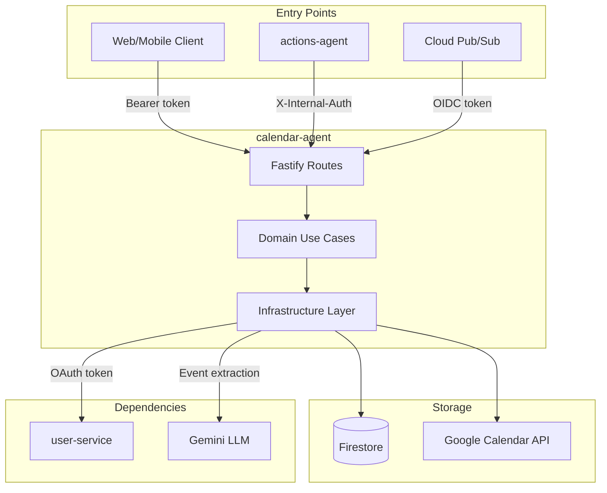
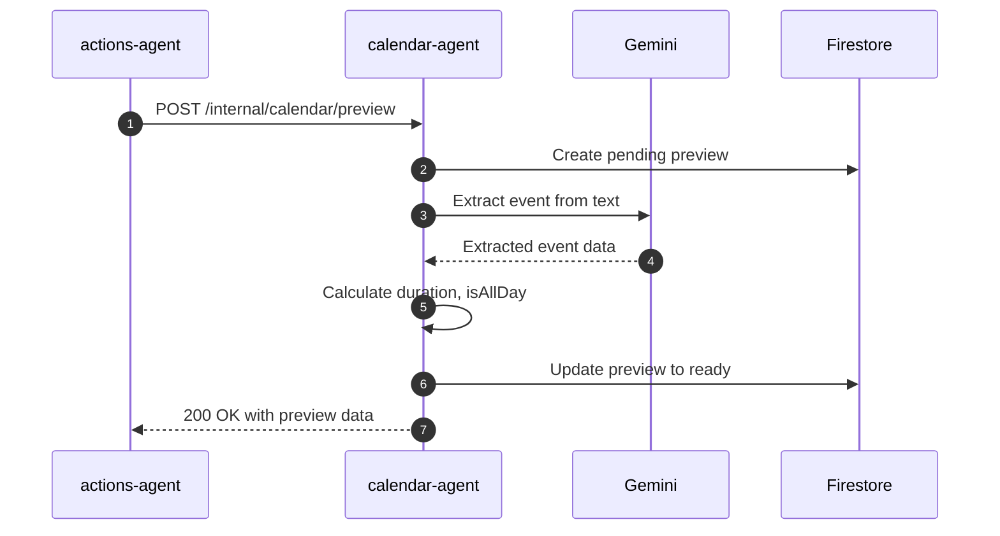
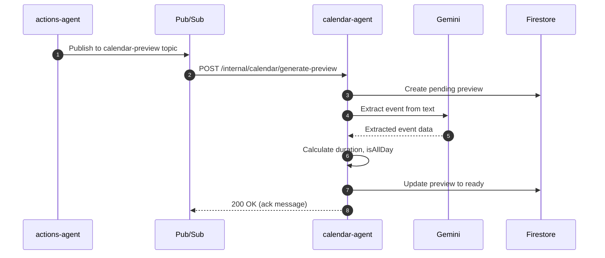
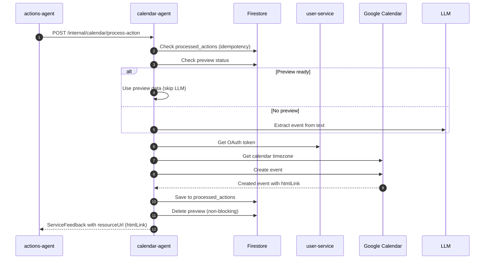

# Calendar Agent — Technical Reference

## Overview

Calendar-agent provides a REST API for Google Calendar operations using the googleapis library. It handles OAuth token retrieval via user-service, LLM-powered event extraction via Gemini, and maps Google Calendar errors to IntexuraOS error codes. Runs on Cloud Run with auto-scaling. Supports both asynchronous (Pub/Sub) and synchronous (direct HTTP) preview generation for calendar actions.

## Architecture



## Data Flow

### Preview Generation Flow (Synchronous)



### Preview Generation Flow (Asynchronous via Pub/Sub)



### Event Creation Flow



## Recent Changes

| Commit     | Description                                                        | Date       |
| ---------- | ------------------------------------------------------------------ | ---------- |
| `93aeac4a` | Remove ZAI provider and GLM-4.7 models, finalize GLM-5 (INT-836)   | 2026-03-12 |
| `155c2b6b` | Write tests for v8-ignore blocks (INT-787)                         | 2026-03-10 |
| `99febe66` | Wire GitHub OAuth integration and update cross-service mocks       | 2026-03-02 |
| `14a4085d` | Pass full user prompt to calendar-agent instead of title only      | 2026-02-24 |
| `9f80098e` | Address all PR review findings for calendar preview [INT-535]      | 2026-02-23 |
| `aca56231` | Implement synchronous calendar preview in approval messages        | 2026-02-23 |
| `5ee70b37` | Link calendar approval to Google Calendar event (htmlLink)         | 2026-02-20 |
| `6063175b` | Add dev-mode log formatting for PM2 readability                    | 2026-02-16 |
| `a52a6bbc` | Add Dash0 OpenTelemetry integration                                | 2026-02-16 |
| `e60eafc1` | Standardize API key secrets to APP naming convention               | 2026-02-15 |
| `c72b7c53` | Switch default LLM to Gemini 2.5 Flash + add fallbacks             | 2026-02-15 |
| `0f69a74b` | Add default model selector with platform fallback                  | 2026-02-08 |
| `5aa3e1bd` | Enable strict 100% coverage enforcement (Phase 3)                  | 2026-01-31 |
| `7ae05245` | Add delete/retry for failed issues and events                      | 2026-01-31 |
| `d60f2ee6` | Improve calendar extraction with date-only support and repair      | 2026-01-30 |
| `95468bd9` | Fix Polish date parsing in calendar actions                        | 2026-01-29 |

## API Endpoints

### Public Endpoints

| Method | Path                                | Description                      | Auth         |
| ------ | ----------------------------------- | -------------------------------- | ------------ |
| GET    | `/calendar/events`                  | List events with filters         | Bearer token |
| GET    | `/calendar/events/:eventId`         | Get specific event               | Bearer token |
| POST   | `/calendar/events`                  | Create event                     | Bearer token |
| PATCH  | `/calendar/events/:eventId`         | Update event                     | Bearer token |
| DELETE | `/calendar/events/:eventId`         | Delete event                     | Bearer token |
| POST   | `/calendar/freebusy`                | Get free/busy info               | Bearer token |
| GET    | `/calendar/failed-events`           | List failed extractions          | Bearer token |
| DELETE | `/calendar/failed-events/:id`       | Delete a failed event            | Bearer token |
| POST   | `/calendar/failed-events/:id/retry` | Retry creating from failed event | Bearer token |

### Internal Endpoints

| Method | Path                                   | Description                           | Caller        |
| ------ | -------------------------------------- | ------------------------------------- | ------------- |
| POST   | `/internal/calendar/process-action`    | Process calendar action               | actions-agent |
| POST   | `/internal/calendar/generate-preview`  | Generate event preview (Pub/Sub)      | Cloud Pub/Sub |
| POST   | `/internal/calendar/preview`           | Generate preview synchronously (HTTP) | actions-agent |
| GET    | `/internal/calendar/preview/:actionId` | Get preview by action ID              | actions-agent |

## Query Parameters

**listEvents:**

| Parameter    | Type     | Description                      |
| ------------ | -------- | -------------------------------- |
| `calendarId` | string   | Calendar ID (default: primary)   |
| `timeMin`    | datetime | Lower bound for event start time |
| `timeMax`    | datetime | Upper bound for event start time |
| `maxResults` | integer  | Max events (1–2500)              |
| `q`          | string   | Free text search                 |

## Domain Models

### CalendarEvent

| Field         | Type             | Description                     |
| ------------- | ---------------- | ------------------------------- |
| `id`          | string           | Google event ID                 |
| `summary`     | string           | Event title                     |
| `description` | string?          | Event description               |
| `location`    | string?          | Event location                  |
| `start`       | EventDateTime    | Start time                      |
| `end`         | EventDateTime    | End time                        |
| `status`      | EventStatus      | confirmed, tentative, cancelled |
| `htmlLink`    | string?          | Google Calendar web link        |
| `created`     | string?          | Creation timestamp              |
| `updated`     | string?          | Last update timestamp           |
| `organizer`   | EventPerson?     | Event organizer                 |
| `attendees`   | EventAttendee[]? | Event attendees                 |

### CalendarPreview

| Field         | Type          | Description                                       |
| ------------- | ------------- | ------------------------------------------------- |
| `actionId`    | string        | Action ID (document ID)                           |
| `userId`      | string        | User ID                                           |
| `status`      | PreviewStatus | pending, ready, or failed                         |
| `summary`     | string?       | Extracted event title                             |
| `start`       | string?       | ISO 8601 start datetime or YYYY-MM-DD for all-day |
| `end`         | string?       | ISO 8601 end datetime                             |
| `location`    | string?       | Extracted location                                |
| `description` | string?       | Extracted description                             |
| `duration`    | string?       | Human-readable duration                           |
| `isAllDay`    | boolean?      | True if all-day event                             |
| `error`       | string?       | Error message (if failed)                         |
| `reasoning`   | string?       | LLM reasoning for extraction                      |
| `generatedAt` | string        | ISO 8601 generation timestamp                     |

### ProcessedAction

| Field         | Type   | Description                      |
| ------------- | ------ | -------------------------------- |
| `actionId`    | string | Action ID (document ID)          |
| `userId`      | string | User ID                          |
| `eventId`     | string | Created Google Calendar event ID |
| `resourceUrl` | string | URL to view created event        |
| `createdAt`   | string | ISO 8601 creation timestamp      |

### FailedEvent

| Field          | Type    | Description           |
| -------------- | ------- | --------------------- |
| `id`           | string  | Firestore document ID |
| `userId`       | string  | User ID               |
| `actionId`     | string  | Action ID             |
| `originalText` | string  | Original user input   |
| `summary`      | string  | Attempted extraction  |
| `start`        | string? | Extracted start time  |
| `end`          | string? | Extracted end time    |
| `location`     | string? | Extracted location    |
| `description`  | string? | Extracted description |
| `error`        | string  | Failure reason        |
| `reasoning`    | string  | LLM reasoning         |
| `createdAt`    | Date    | Failure timestamp     |

### EventDateTime

| Field      | Type    | Description                         |
| ---------- | ------- | ----------------------------------- |
| `dateTime` | string? | ISO 8601 datetime (timed events)    |
| `date`     | string? | ISO 8601 date (all-day events)      |
| `timeZone` | string? | Timezone (e.g., "America/New_York") |

## Pub/Sub

### Subscribed Events

| Topic                               | Handler                               | Action                     |
| ----------------------------------- | ------------------------------------- | -------------------------- |
| `intexuraos-calendar-preview-{env}` | `/internal/calendar/generate-preview` | Generate preview from text |

**Message Format:**

```typescript
interface GeneratePreviewMessage {
  actionId: string;
  userId: string;
  text: string;
  currentDate: string; // YYYY-MM-DD
}
```

## Firestore Collections

| Collection                   | Document ID | Purpose                        |
| ---------------------------- | ----------- | ------------------------------ |
| `calendar_previews`          | actionId    | Pending/ready event previews   |
| `calendar_processed_actions` | actionId    | Idempotency for event creation |
| `calendar_failed_events`     | auto        | Failed extraction for review   |

## Error Codes

| Code                | HTTP Status | Description                          |
| ------------------- | ----------- | ------------------------------------ |
| `NOT_CONNECTED`     | 403         | User hasn't connected Google account |
| `TOKEN_ERROR`       | 401         | OAuth token invalid/expired          |
| `NOT_FOUND`         | 404         | Event/calendar not found             |
| `INVALID_REQUEST`   | 400         | Malformed request                    |
| `PERMISSION_DENIED` | 403         | Insufficient permissions             |
| `QUOTA_EXCEEDED`    | 403         | API rate limit exceeded              |
| `INTERNAL_ERROR`    | 500/502     | Downstream error                     |

## Dependencies

### Internal Services

| Service        | Endpoint                                 | Purpose                             |
| -------------- | ---------------------------------------- | ----------------------------------- |
| `user-service` | `/internal/users/:id/oauth/google/token` | Fetch Google OAuth access token     |
| `user-service` | `/internal/users/:id/llm-client`         | Get LLM client for event extraction |

### External APIs

| Service                   | Purpose                                                          |
| ------------------------- | ---------------------------------------------------------------- |
| Google Calendar API v3    | Event CRUD and free/busy queries                                 |
| Gemini 2.5 Flash          | Primary LLM for natural language event extraction                |
| Gemini 2.5 Pro            | Secondary LLM (fallback)                                         |

## Configuration

| Environment Variable                  | Required | Description                             |
| ------------------------------------- | -------- | --------------------------------------- |
| `INTEXURAOS_GCP_PROJECT_ID`           | Yes      | GCP project ID                          |
| `INTEXURAOS_AUTH_JWKS_URL`            | Yes      | JWT key set URL for auth validation     |
| `INTEXURAOS_AUTH_ISSUER`              | Yes      | JWT issuer for auth validation          |
| `INTEXURAOS_AUTH_AUDIENCE`            | Yes      | JWT audience for auth validation        |
| `INTEXURAOS_INTERNAL_AUTH_TOKEN`      | Yes      | Shared secret for internal auth         |
| `INTEXURAOS_USER_SERVICE_URL`         | Yes      | user-service base URL                   |
| `INTEXURAOS_APP_SETTINGS_SERVICE_URL` | Yes      | app-settings-service URL for pricing    |
| `INTEXURAOS_SENTRY_DSN`               | Yes      | Sentry DSN for error reporting          |
| `INTEXURAOS_GEMINI_APP_API_KEY`       | No       | Platform Gemini LLM API key (fallback)  |
| `INTEXURAOS_ENVIRONMENT`              | No       | Environment name (default: development) |
| `PORT`                                | No       | Server port (default: 8125)             |

## Gotchas

**Default calendar** — If `calendarId` not provided, defaults to `primary`.

**EventDateTime format** — Use `dateTime` for timed events, `date` for all-day. Never both.

**All-day detection** — Events with date format `YYYY-MM-DD` (no time) are treated as all-day.

**Duration calculation** — Calculated from start/end difference. Returns null for invalid dates.

**Preview idempotency** — If preview already exists for actionId, returns existing preview.

**Preview cleanup** — Deletion after successful event creation is non-blocking (logs warning on failure).

**Synchronous vs async preview** — `POST /internal/calendar/preview` generates previews synchronously via direct HTTP (used for approval messages). `POST /internal/calendar/generate-preview` is the Pub/Sub push handler for asynchronous generation. Both call the same `generateCalendarPreview` use case.

**LLM fallback** — If preview is not ready, processCalendarAction falls back to direct LLM extraction.

**LLM repair** — When extraction returns invalid JSON or fails schema validation, a repair prompt is sent (up to 1 retry) before marking as failed.

**Date context** — processCalendarAction includes day of week in currentDate (e.g., "2026-02-08 Saturday") for accurate relative date parsing across languages.

**Date-only format** — LLM responses with date-only format (YYYY-MM-DD) are accepted for all-day events instead of requiring ISO datetime.

**Smart singleEvents** — listEvents auto-sets `singleEvents=true` and `orderBy=startTime` when time filters (timeMin/timeMax) are provided. Explicit values override.

**Patch vs update** — Update uses `events.patch` (partial), not `events.update` (full replace).

**OAuth tokens** — Access tokens fetched via shared `@intexuraos/internal-clients` UserServiceClient with `getOAuthToken(userId, 'google')`. Error mapping via `mapUserServiceError()`.

**Error mapping** — Google API errors mapped to IntexuraOS codes (403 PERMISSION_DENIED vs QUOTA_EXCEEDED). UserServiceError codes (CONNECTION_NOT_FOUND, TOKEN_REFRESH_FAILED) mapped to CalendarError codes.

**Resource URL** — `processCalendarAction` returns the Google Calendar `htmlLink` as `resourceUrl` when available. Falls back to `/#/calendar` only when the created event has no `htmlLink`. This means approval actions (e.g., via WhatsApp) link directly to the Google Calendar event.

**Full prompt text** — `process-action` accepts an optional `text` field containing the full user prompt. Falls back to `action.title` when not provided. This ensures the LLM extraction receives the complete natural language input rather than a short classifier-generated title.

**Failed event retry** — Retry requires both start and end times. Returns 422 if missing. On success, deletes the failed event record (non-blocking on delete failure).

**Failed event ownership** — Delete and retry endpoints verify userId ownership, returning 404 if the event belongs to a different user.

**maxResults maximum** — Google caps at 2500. Requesting higher returns error.

**Error status codes** — Internal endpoints return 502 (Bad Gateway) for downstream failures, not 500. The `reply.fail()` helper handles status codes automatically.

## File Structure

```
apps/calendar-agent/src/
  domain/
    models.ts                    # CalendarEvent, CalendarPreview, etc.
    errors.ts                    # CalendarError types
    ports.ts                     # Repository/client interfaces
    useCases/
      listEvents.ts              # List operation
      getEvent.ts                # Get single event
      createEvent.ts             # Create operation
      updateEvent.ts             # Patch operation
      deleteEvent.ts             # Delete operation
      getFreeBusy.ts             # Free/busy query
      processCalendarAction.ts   # Action processing with preview
      generateCalendarPreview.ts # Preview generation
  infra/
    google/
      googleCalendarClient.ts    # Google Calendar API v3 wrapper
    firestore/
      failedEventRepository.ts   # Failed events storage
      processedActionRepository.ts # Idempotency tracking
      calendarPreviewRepository.ts # Preview storage
    gemini/
      calendarActionExtractionService.ts # LLM extraction with repair mechanism
  routes/
    calendarRoutes.ts            # Public endpoints
    internalRoutes.ts            # Internal + Pub/Sub + direct HTTP endpoints
  services.ts                    # DI container
  server.ts                      # Fastify server
```

---

**Last updated:** 2026-03-07
