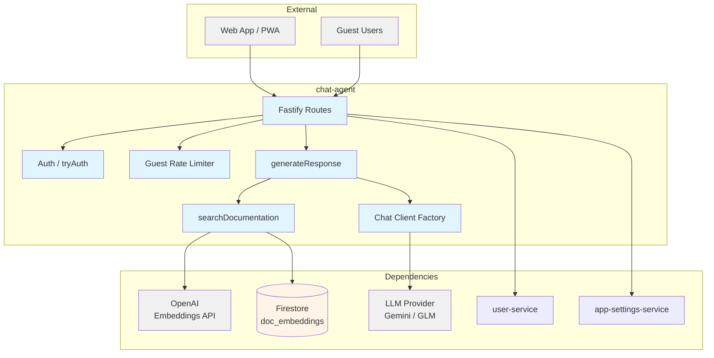
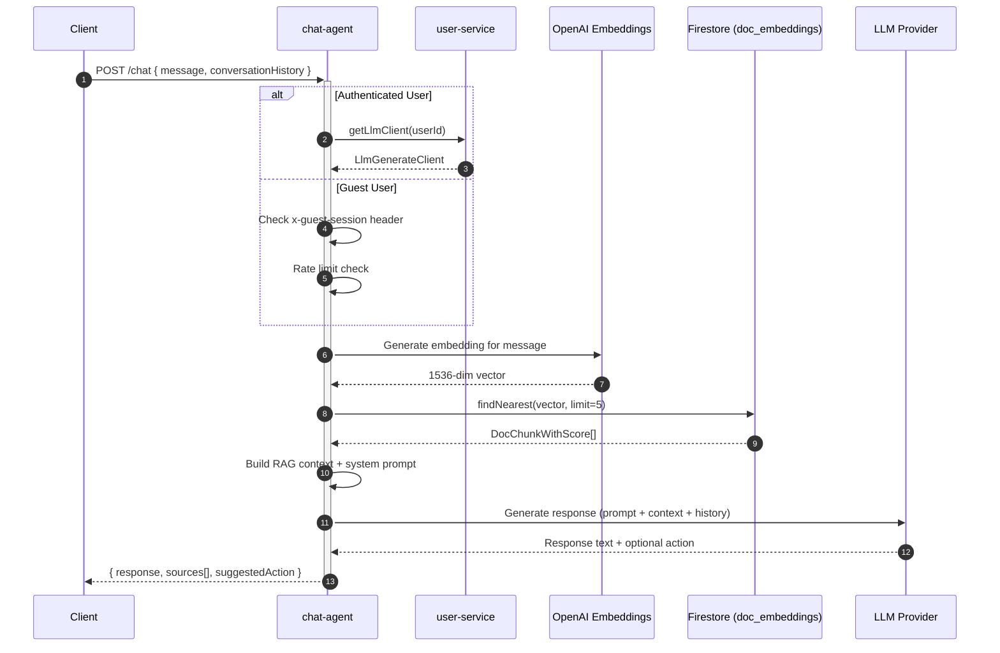

# Chat Agent -- Technical Reference

## Overview

Chat-agent is the in-app AI assistant for IntexuraOS. It combines Retrieval-Augmented Generation (RAG) with conversational LLM capabilities to answer documentation questions, explain APIs, and create commands on behalf of users. Runs on Cloud Run with auto-scaling, uses Firestore vector search for semantic document retrieval, and supports both authenticated and guest sessions. OpenTelemetry instrumentation via `@intexuraos/infra-otel` is loaded as a Node.js preload module (`--import ./dist/otel-register.js`), exporting traces, metrics, and logs to Dash0 when `INTEXURAOS_DASH0_OTLP_ENDPOINT` is configured.

## Architecture



## Data Flow



## Recent Changes

| Hash       | Description                                              | Date       |
| ---------- | -------------------------------------------------------- | ---------- |
| `b3f34d85` | Release v3.1.0                                           | 2026-02-22 |
| `c8a42105` | Release v3.0.0                                           | 2026-02-19 |
| `6063175b` | Add dev-mode log formatting for PM2 readability          | 2026-02-16 |
| `a52a6bbc` | Add Dash0 OpenTelemetry integration                      | 2026-02-16 |
| `e60eafc1` | Standardize API key secrets to APP naming convention     | 2026-02-15 |
| `c72b7c53` | Switch default LLM to Gemini 2.5 Flash + Gemini fallback | 2026-02-15 |
| `45f001c1` | Switch PM2 ecosystem to pnpm --filter with start:local   | 2026-02-14 |
| `0f69a74b` | Add default model selector with platform Zai fallback    | 2026-02-09 |
| `63170e4a` | Remove "free" GLM terminology, use createLlmClient       | 2026-02-07 |
| `996c4179` | Add chat-agent to Cloud Build pipeline                   | 2026-02-06 |
| `ea6652f7` | Add guest chat sessions with rate limiting               | 2026-02-06 |

## API Endpoints

### Public Endpoints

| Method | Path    | Auth         | Description                       |
| ------ | ------- | ------------ | --------------------------------- |
| POST   | `/chat` | JWT or Guest | Send a message and get a response |
| GET    | `/docs` | None         | Swagger UI documentation          |

### System Endpoints

| Method | Path            | Auth | Description               |
| ------ | --------------- | ---- | ------------------------- |
| GET    | `/health`       | None | Health check              |
| GET    | `/openapi.json` | None | OpenAPI 3.1.1 spec (JSON) |

### POST /chat

**Request:**

```json
{
  "message": "How do I create a todo?",
  "conversationHistory": [
    { "role": "user", "content": "Previous question" },
    { "role": "assistant", "content": "Previous answer" }
  ],
  "pendingAction": {
    "type": "create_command",
    "payload": { "text": "buy groceries", "source": "pwa-shared" },
    "awaitingConfirmation": true
  }
}
```

| Field                 | Type                        | Required | Description                              |
| --------------------- | --------------------------- | -------- | ---------------------------------------- |
| `message`             | `string`                    | Yes      | User message (min 1 char)                |
| `conversationHistory` | `ConversationHistory[]`     | No       | Previous messages (max 20 used)          |
| `pendingAction`       | `SuggestedAction` or `null` | No       | Action from previous response to confirm |

**Response (200):**

```json
{
  "success": true,
  "data": {
    "response": "To create a todo, use POST /todos...",
    "sources": [{ "filePath": "docs/services/todos-agent/API.md", "section": "POST /todos" }],
    "suggestedAction": {
      "type": "create_command",
      "payload": { "text": "buy groceries", "source": "pwa-shared" },
      "awaitingConfirmation": true
    }
  }
}
```

**Authentication modes:**

- **JWT Bearer token**: Authenticated users. LLM client fetched from user-service based on user preferences.
- **`x-guest-session` header**: Guest users. Uses platform-provided GLM-4.7-Flash model. Rate limited to 100 messages/hour/session.
- **Neither**: Returns 401.

**Error codes:**

| HTTP | Code               | When                                   |
| ---- | ------------------ | -------------------------------------- |
| 400  | `INVALID_REQUEST`  | Empty message or invalid body          |
| 401  | `UNAUTHORIZED`     | No JWT and no guest session header     |
| 429  | `RATE_LIMITED`     | Guest session exceeded hourly limit    |
| 502  | `DOWNSTREAM_ERROR` | LLM generation or user-service failure |

## Domain Model

### ChatMessage

| Field             | Type                         | Description             |
| ----------------- | ---------------------------- | ----------------------- |
| `id`              | `string`                     | Unique message ID       |
| `role`            | `'user' \                    | 'assistant' \           | 'system'` | Message sender role |
| `content`         | `string`                     | Message text content    |
| `timestamp`       | `number`                     | Unix timestamp          |
| `sources`         | `DocSource[]` (optional)     | Documentation citations |
| `suggestedAction` | `SuggestedAction` (optional) | Proposed command action |

### DocChunk (Firestore: `doc_embeddings`)

| Field       | Type                         | Description                            |
| ----------- | ---------------------------- | -------------------------------------- |
| `id`        | `string`                     | Firestore document ID                  |
| `content`   | `string`                     | Chunk text content                     |
| `embedding` | `number[]`                   | 1536-dimension OpenAI embedding vector |
| `filePath`  | `string`                     | Source file path                       |
| `section`   | `string`                     | Section heading within the source file |
| `docType`   | `'markdown' \                | 'openapi'`                             | Document type |
| `createdAt` | `Firestore.Timestamp`        | Creation timestamp                     |

### SuggestedAction

| Field                  | Type                      | Description                           |
| ---------------------- | ------------------------- | ------------------------------------- |
| `type`                 | `'create_command'`        | Action type (only command creation)   |
| `payload`              | `Record<string, unknown>` | Action data (`text`, `source` fields) |
| `awaitingConfirmation` | `boolean`                 | `true` until user confirms            |

### ConversationHistory

| Field     | Type                       | Description    |
| --------- | -------------------------- | -------------- |
| `role`    | `'user' \                  | 'assistant'`   | Message sender |
| `content` | `string`                   | Message text   |

## Pub/Sub Events

Chat-agent does not publish or subscribe to any Pub/Sub topics. All communication is synchronous HTTP.

## Dependencies

### External Services

| Service           | Purpose                                              |
| ----------------- | ---------------------------------------------------- |
| OpenAI Embeddings | Generate 1536-dim vectors (text-embedding-3-small)   |
| LLM (Gemini/GLM)  | Generate chat responses                              |
| Firestore         | Store and search document embeddings (vector search) |

### Internal Services

| Service              | Purpose                                |
| -------------------- | -------------------------------------- |
| user-service         | Fetch per-user LLM client and API keys |
| app-settings-service | Fetch LLM pricing data at startup      |

### Packages

| Package                        | Purpose                             |
| ------------------------------ | ----------------------------------- |
| `@intexuraos/common-core`      | Result types, error helpers         |
| `@intexuraos/common-http`      | Auth plugins, request logging       |
| `@intexuraos/http-server`      | Health checks, env validation       |
| `@intexuraos/http-contracts`   | Core API schema definitions         |
| `@intexuraos/infra-firestore`  | Firestore singleton + vector search |
| `@intexuraos/infra-otel`       | Dash0 OpenTelemetry instrumentation |
| `@intexuraos/infra-sentry`     | Sentry logging, error handler       |
| `@intexuraos/internal-clients` | user-service client                 |
| `@intexuraos/llm-contract`     | LLM model enums, error types        |
| `@intexuraos/llm-factory`      | LLM client factory                  |
| `@intexuraos/llm-pricing`      | Pricing context for LLM models      |

## Configuration

### Environment Variables

| Variable                              | Required | Description                                                   |
| ------------------------------------- | -------- | ------------------------------------------------------------- |
| `INTEXURAOS_GCP_PROJECT_ID`           | Yes      | GCP project ID for Firestore                                  |
| `INTEXURAOS_AUTH_JWKS_URL`            | Yes      | JWKS URL for JWT validation                                   |
| `INTEXURAOS_AUTH_ISSUER`              | Yes      | JWT issuer for token validation                               |
| `INTEXURAOS_AUTH_AUDIENCE`            | Yes      | JWT audience for token validation                             |
| `INTEXURAOS_OPENAI_APP_API_KEY`       | Yes      | OpenAI API key for embeddings                                 |
| `INTEXURAOS_USER_SERVICE_URL`         | Yes      | URL for user-service                                          |
| `INTEXURAOS_INTERNAL_AUTH_TOKEN`      | Yes      | Token for internal service-to-service calls                   |
| `INTEXURAOS_APP_SETTINGS_SERVICE_URL` | Yes      | URL for app-settings-service (pricing data)                   |
| `INTEXURAOS_ZAI_APP_API_KEY`          | Yes      | ZAI API key for guest chat sessions (GLM-4.7-Flash)           |
| `INTEXURAOS_GEMINI_APP_API_KEY`       | No       | Platform Gemini API key for authenticated user model fallback |
| `INTEXURAOS_SENTRY_DSN`               | No       | Sentry DSN for error tracking                                 |
| `INTEXURAOS_ENVIRONMENT`              | No       | Environment name (defaults to `development`)                  |
| `INTEXURAOS_DASH0_OTLP_ENDPOINT`      | No       | Dash0 OTLP endpoint for distributed tracing and metrics       |
| `OTEL_SERVICE_NAME`                   | No       | OpenTelemetry service name (set to `chat-agent` in Docker)    |
| `PORT`                                | No       | Server port (defaults to `8080`)                              |
| `HOST`                                | No       | Server host (defaults to `0.0.0.0`)                           |
| `LOG_LEVEL`                           | No       | Pino log level (defaults to `info`)                           |

### Supported Chat Models

The following models are validated at startup for pricing availability:

| Model              | Provider | Role                                        |
| ------------------ | -------- | ------------------------------------------- |
| Gemini 2.5 Flash   | Google   | Default for authenticated users             |
| GLM-4.7            | Zai      | Alternative for authenticated users         |
| GLM-4.7-Flash      | Zai      | Guest sessions (platform-provided, no cost) |

### Terraform

Deployed as `intexuraos-chat-agent` via Cloud Run module. Secrets `INTEXURAOS_OPENAI_APP_API_KEY`, `INTEXURAOS_ZAI_APP_API_KEY`, and `INTEXURAOS_GEMINI_APP_API_KEY` injected from Secret Manager. `INTEXURAOS_DASH0_OTLP_ENDPOINT` injected for Dash0 observability. Common service env vars inherited. Scales from 0 to 1 instance. Dockerfile runs with `--import ./dist/otel-register.js` preload for transparent OpenTelemetry instrumentation.

### Local Development

Port `8129` in `ecosystem.config.cjs`. Requires `INTEXURAOS_OPENAI_APP_API_KEY` and `INTEXURAOS_ZAI_APP_API_KEY` in `.envrc`.

## Gotchas

1. **Pricing fetch at startup**: The service calls `app-settings-service` on startup to load LLM pricing. If app-settings-service is down, chat-agent fails to start.

2. **Firestore vector search requires composite index**: The `doc_embeddings` collection uses Firestore `findNearest()` for vector search. The embedding field must be indexed as a vector field.

3. **Conversation history is truncated**: Only the last 20 messages from `conversationHistory` are passed to the LLM. Older messages are silently dropped.

4. **Guest rate limiter is in-memory**: The rate limiter resets when the service restarts or scales to a new instance. This means rate limiting is per-instance, not global.

5. **Action extraction depends on LLM output format**: The `[ACTION: create_command {...}]` annotation must appear in the LLM response exactly matching the regex pattern. If the LLM outputs a slightly different format, the action is not detected.

6. **Embedding model is hardcoded**: The OpenAI embedding model (`text-embedding-3-small`) is hardcoded in `EmbeddingClient`. Changing it requires reindexing all existing embeddings.

7. **`tryAuth` returns null for guests**: The route uses `tryAuth` (not `requireAuth`), so unauthenticated requests fall through to the guest path rather than being rejected.

## File Structure

```
apps/chat-agent/src/
  index.ts                            # Entry point, env validation, Sentry init
  server.ts                           # Fastify server, plugins, health check
  services.ts                         # DI container, service wiring
  domain/
    index.ts                          # Domain exports
    models/
      chatMessage.ts                  # ChatMessage, ChatRequest, ChatResponse, SuggestedAction
      docChunk.ts                     # DocChunk, DocChunkWithScore, EmbeddingRepositoryPort
    ports/
      embeddingRepository.ts          # Re-exports from models (port interface)
    prompts/
      systemPrompt.ts                 # Intex system prompt definition
    usecases/
      generateResponse.ts             # Main use case: RAG + LLM + confirmation flow
      generateResponse.test.ts        # Unit tests
      searchDocumentation.ts          # Semantic search use case
      searchDocumentation.test.ts     # Unit tests
  infra/
    firestore/
      embeddingRepository.ts          # Firestore vector search implementation
      embeddingRepository.test.ts     # Repository tests
    llm/
      chatClient.ts                   # LLM adapter with action extraction
      embeddingClient.ts              # OpenAI embedding client with retry logic
      embeddingClient.test.ts         # Embedding client tests
    rateLimit/
      guestRateLimiter.ts             # In-memory guest rate limiter
      guestRateLimiter.test.ts        # Rate limiter tests
      index.ts                        # Rate limiter exports
  routes/
    chatRoutes.ts                     # POST /chat route handler
    index.ts                          # Route exports
  __tests__/
    fakes.fixture.ts                  # Fake implementations for testing
    routes.test.ts                    # Integration tests (app.inject)
    services.test.ts                  # Service container tests
    testUtils.ts                      # JWKS server setup for auth testing
    logger.test.ts                    # Logger integration test
```
