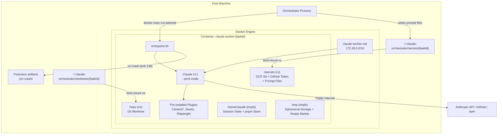

# Claude Worker — Technical Reference

## Overview

Claude Worker is a Docker container image that provides an isolated execution environment for Claude Code sessions. It is not a standalone service with HTTP endpoints; instead, the orchestrator manages its lifecycle via the Docker API (dockerode). The image bundles Claude CLI, a full developer toolchain (including Playwright/Chromium, pre-installed MCP servers, and pre-installed Claude Code plugins), and a bash entrypoint that handles authentication, secret syncing, dependency installation, and prompt-driven execution. Two image variants exist: a production image (`Dockerfile`) and a test image (`Dockerfile.test`) that substitutes a bash stub for the real Claude CLI. The image is stored at `europe-central2-docker.pkg.dev/intexuraos-dev-pbuchman/intexuraos-dev/claude-worker:latest` and is rebuilt daily at 4 AM UTC via Cloud Build.

## Architecture



## Recent Changes

| Commit      | Description                                                  | Date       |
| ----------- | ------------------------------------------------------------ | ---------- |
| `5e1fdda3`  | Docker cache busting for Claude CLI + add Codex CLI          | 2026-03-15 |
| `191488b4`  | Enable tasks env var in claude-worker settings               | 2026-03-13 |
| `393fbbde`  | Clean up orphaned child processes after Claude attempt exits | 2026-03-10 |
| `57354c70`  | Read GitHub token from file instead of stale env var         | 2026-03-06 |
| `c8c09941`  | Move secret sync from orchestrator to container entrypoint   | 2026-03-03 |
| `2a75b75a`  | Fix container.envrc mount failure, add direnv                | 2026-03-02 |
| `afc1cb24`  | Build multi-arch image for amd64+arm64                       | 2026-02-26 |
| `36bca370`  | Add claude worker crash forensics mode                       | 2026-02-26 |
| `98caac48`  | Pre-install Claude Code plugins in image                     | 2026-02-25 |

### Docker Cache Busting and Codex CLI (5e1fdda3)

Added a `CACHE_BUST` build arg (set to the commit SHA by the build script) that invalidates Docker layer cache after the gcloud SDK install, ensuring the Claude CLI is always re-downloaded with the latest version rather than served from a stale cached layer. Also installs `@openai/codex` globally for A/B evaluation of alternative AI coding agent backends within the same worker infrastructure.

### Tasks Env Var (191488b4)

Enabled `CLAUDE_CODE_ENABLE_TASKS=1` in the settings.local.json config defaults, activating the Claude Code tasks feature within the worker container.

### Orphaned Child Process Cleanup (393fbbde)

After each Claude attempt exits, the entrypoint now sends SIGTERM to all child processes (MCP servers, background tools), waits 0.5 seconds, then sends SIGKILL to any survivors. This prevents lingering processes from holding Docker exec file descriptors open, which could cause container cleanup issues.

## Container Configuration

### Security Controls

| Control          | Setting                                            |
| ---------------- | -------------------------------------------------- |
| User             | Host user (dynamic UID/GID)                        |
| CapDrop          | ALL                                                |
| CapAdd           | NET_RAW (+ SYS_PTRACE in forensics mode)           |
| SecurityOpt      | no-new-privileges                                  |
| Secrets mount    | Read-only bind mount                               |
| Repo mount       | Read-write bind mount                              |
| Root filesystem  | Writable (required by Claude Code)                 |
| Docker socket    | NOT mounted                                        |
| Removed binaries | wget, nc                                           |
| Max concurrent   | 4 (configurable via `maxConcurrent`)               |
| Timeout          | 2 hours per attempt (configurable via `timeoutMs`) |

### Network Isolation

| Target                                    | Access  | Enforcement                 |
| ----------------------------------------- | ------- | --------------------------- |
| Public internet                           | Allowed | Default Docker bridge       |
| Cloud metadata                            | Blocked | iptables on production host |
| Localhost (127.0.0.0/8)                   | Blocked | iptables on production host |
| Private IPs (10/8, 172.16/12, 192.168/16) | Blocked | iptables on production host |

Network: `claude-worker-net` (bridge driver, subnet `172.28.0.0/16`, IP masquerade enabled).

## Mount Points

| Container Path            | Host Source                                 | Mode      | Purpose                                            |
| ------------------------- | ------------------------------------------- | --------- | -------------------------------------------------- |
| `/repo`                   | `{secretsBasePath}/../worktrees/{taskId}`   | rw        | Git worktree for the task                          |
| `/secrets`                | `{secretsBasePath}/{taskId}`                | ro        | GCP SA key + GitHub token + prompt files           |
| `/home/claude/pnpm-store` | `{secretsBasePath}/../pnpm-store`           | rw        | Shared pnpm content-addressable store              |
| `/home/claude/.claude`    | `{secretsBasePath}/claude-session-{taskId}` | rw        | Claude session state (persists across attempts)    |
| `/tmp`                    | tmpfs (2 GB)                                | rw,noexec | Ephemeral scratch + ready marker                   |
| `/home/claude`            | tmpfs (500 MB)                              | rw,noexec | Home directory (pnpm-store and .claude overlaid)   |
| `/repo/node_modules`      | tmpfs (4 GB)                                | rw,exec   | Linux-native node_modules (shadows Mac host mount) |
| `{mainGitDir}`            | Main `.git` directory (for worktrees)       | rw        | Git operations on worktrees                        |

### Secrets Directory Files

| File                | Required | Description                                       |
| ------------------- | -------- | ------------------------------------------------- |
| `gcp-sa.json`       | Optional | GCP service account key for gcloud auth           |
| `github-token`      | Optional | GitHub access token (refreshed every 30 min)      |
| `system-prompt.txt` | Required | Claude system prompt (read at `run-attempt` time) |
| `user-prompt.txt`   | Required | Claude user prompt (read via stdin redirect)      |

## Environment Variables

| Variable                              | Source           | Description                                                                              |
| ------------------------------------- | ---------------- | ---------------------------------------------------------------------------------------- |
| `TASK_ID`                             | Orchestrator     | Unique task identifier                                                                   |
| `ANTHROPIC_API_KEY`                   | Orchestrator env | API key for Anthropic (opus/auto/sonnet types); omitted when shared credentials are used |
| `ANTHROPIC_BASE_URL`                  | Worker type map  | API endpoint URL; omitted when shared credentials are used                               |
| `ANTHROPIC_MODEL`                     | Worker type map  | Model override (set per worker type when defined)                                        |
| `LINEAR_API_KEY`                      | Orchestrator env | Linear integration key                                                                   |
| `SENTRY_AUTH_TOKEN`                   | Orchestrator env | Sentry error tracking token                                                              |
| `GOOGLE_APPLICATION_CREDENTIALS`      | Fixed            | `/secrets/gcp-sa.json`                                                                   |
| `CLAUDE_PROJECT_DIR`                  | Fixed            | `/repo`                                                                                  |
| `CLAUDE_WORKER_MODE`                  | Fixed            | `1` — identifies this as an automated worker process                                     |
| `CLAUDE_MANAGED_MODE`                 | Orchestrator     | `1` = stay alive, accept `run-attempt` via docker exec                                   |
| `CLAUDE_CONTINUE`                     | Orchestrator     | `1` = pass `--continue` to resume previous session                                       |
| `CLAUDE_FORENSICS`                    | Orchestrator     | `1` = enable crash forensics collection                                                  |
| `CLAUDE_FORENSICS_DIR`                | Orchestrator     | Base directory for forensics output (default: `/var/crash`)                              |
| `GIT_USER_NAME`                       | Orchestrator env | Git commit author name                                                                   |
| `GIT_USER_EMAIL`                      | Orchestrator env | Git commit author email                                                                  |
| `HOME`                                | Dockerfile       | `/home/claude`                                                                           |
| `NODE_ENV`                            | Dockerfile       | `production` (or `test` in test image)                                                   |
| `COREPACK_ENABLE_DOWNLOAD_PROMPT`     | Dockerfile/env   | `0` — suppress corepack prompts in CI                                                    |
| `PLAYWRIGHT_SKIP_BROWSER_DOWNLOAD`    | Dockerfile       | `1` — use system Chromium                                                                |
| `PLAYWRIGHT_CHROMIUM_EXECUTABLE_PATH` | Dockerfile       | `/usr/bin/chromium-browser`                                                              |

## Worker Types

| Type      | API Base URL                                                | API Key Env Var     | Model Override  |
| --------- | ----------------------------------------------------------- | ------------------- | --------------- |
| `auto`    | `https://api.anthropic.com`                                 | `ANTHROPIC_API_KEY` | None            |
| `opus`    | `https://api.anthropic.com`                                 | `ANTHROPIC_API_KEY` | `opus`          |
| `sonnet`  | `https://api.anthropic.com`                                 | `ANTHROPIC_API_KEY` | `sonnet`        |
| `minimax` | `https://api.minimax.io/anthropic`                          | `MINIMAX_API_KEY`   | `MiniMax-M2.7`  |
| `glm`     | `https://coding-intl.dashscope.aliyuncs.com/apps/anthropic` | `DASHSCOPE_API_KEY` | `glm-5`         |
| `qwen`    | `https://coding-intl.dashscope.aliyuncs.com/apps/anthropic` | `DASHSCOPE_API_KEY` | `qwen3.5-plus`  |
| `kimi`    | `https://coding-intl.dashscope.aliyuncs.com/apps/anthropic` | `DASHSCOPE_API_KEY` | `kimi-k2.5`     |

GLM-5, Qwen, and Kimi are Chinese LLMs accessed via the unified Alibaba Cloud Model Studio (DashScope) integration. All three share the same API base URL and `DASHSCOPE_API_KEY`, with models differentiated by the model override parameter.

## Entrypoint Flow

The `entrypoint.sh` script supports two invocation modes:

### Primary Container Startup (always runs)

1. **Root check** — Exits with error if running as UID 0
2. **Network verification** — Background check that cloud metadata server (169.254.169.254) is unreachable
3. **Directory creation** — Creates `/home/claude/.config/gcloud` and `/home/claude/.claude` (tmpfs wipes image-time directories)
4. **Config restoration** — Copies baked-in Claude defaults from `/opt/claude-defaults/` to `/home/claude/`
5. **Plugin restoration** — Copies pre-installed Claude Code plugins from `/opt/claude-plugins/.claude/plugins/` to `/home/claude/.claude/plugins/`, rewriting staging paths to match the runtime HOME directory
6. **Mount verification** — Checks that `/repo` exists and contains a git repository (supports both `.git` directory and worktree `.git` file)
7. **GCP authentication** — Activates GCP service account from `/secrets/gcp-sa.json` via `gcloud auth`
8. **Secret sync** — Runs `scripts/sync-secrets.sh dev` to pull environment variables from GCP Secret Manager into `/repo/.envrc`
9. **Environment loading** — Sources `/repo/.envrc` and runs `direnv allow /repo` so env vars auto-load for all subsequent commands
10. **Git identity setup** — Configures `user.name` / `user.email` from `GIT_USER_NAME` / `GIT_USER_EMAIL` env vars at both global and repo level
11. **GitHub token setup** — Reads token from `/secrets/github-token`; configures git credential helper to read the token file directly on each git operation
12. **Token freshness** — No background watcher needed. The git credential helper re-reads `/secrets/github-token` on every git operation, and the `gh` CLI wrapper (`/usr/local/bin/gh`) re-reads it before each invocation. The orchestrator's `TokenRefresher` updates the bind-mounted file every 30 minutes.
13. **pnpm configuration** — Configures pnpm to use `/home/claude/pnpm-store` as the persistent store directory
14. **pnpm install** — If `/repo/pnpm-lock.yaml` exists, runs `pnpm install --frozen-lockfile` with `CI=true`
15. **Attribution config** — Picks a random verb from 25 options and writes `{ attribution: { commit, pr } }` to `/repo/.claude/settings.local.json`
16. **Readiness marker** — Writes `/tmp/worker-ready`

### Managed Mode (`CLAUDE_MANAGED_MODE=1`)

After startup, sleeps in an infinite loop. The orchestrator triggers work via:

```bash
docker exec <container> /entrypoint.sh run-attempt
```

The `run-attempt` handler:

1. Verifies `/tmp/worker-ready` exists
2. Checks `/secrets/system-prompt.txt` and `/secrets/user-prompt.txt` are present
3. Sets up git identity and GitHub token for this attempt
4. If `CLAUDE_FORENSICS=1`: enables core dumps (`ulimit -c unlimited`), creates a timestamped forensics directory, and writes attempt metadata
5. Runs `claude --print --verbose --output-format stream-json --dangerously-skip-permissions --system-prompt <content> < /secrets/user-prompt.txt`
6. If `CLAUDE_CONTINUE=1`: adds `--continue` flag to resume previous session
7. If forensics enabled and exit code is 139 (segfault): captures crash forensics (core dumps, GDB backtraces, debug logs, session state, shell snapshots)
8. If forensics enabled: tees all Claude output to `claude-stream.log` in the forensics directory

### Legacy Mode (default, `CLAUDE_MANAGED_MODE` unset)

After startup, immediately calls `run_claude_attempt` and exits with its exit code. No `docker exec` needed.

## Crash Forensics

When `CLAUDE_FORENSICS=1` is set, the entrypoint collects diagnostic artifacts on crash:

| Artifact                   | Location in forensics dir          | Content                                         |
| -------------------------- | ---------------------------------- | ----------------------------------------------- |
| `crash-summary.txt`        | Root                               | Task ID, user, system info, Claude binary info  |
| `claude-exit-code.txt`     | Root                               | Numeric exit code                               |
| `claude-stream.log`        | Root                               | Full Claude stdout/stderr output                |
| `attempt-meta.txt`         | Root                               | Start time, task ID, continue flag              |
| `claude-cmd-timing`        | `claude-cmd-timing/`               | Command timing data from `/tmp`                 |
| `claude-debug`             | `claude-debug/`                    | Claude debug directory contents                 |
| `claude-projects-repo`     | `claude-projects-repo/`            | Claude project state for `/repo`                |
| `shell-snapshots`          | `shell-snapshots/`                 | Claude shell snapshot files                     |
| `.claude.json`             | Root                               | Claude config at time of crash                  |
| `core*`                    | Root                               | Core dump files (if generated)                  |
| `core*.gdb.txt`            | Root                               | GDB backtrace of core dump                      |
| `core-files.txt`           | Root                               | List of found core files                        |

Forensics directories are named `attempt-{timestamp}-{pid}` under `CLAUDE_FORENSICS_DIR` (default `/var/crash`).

## Pre-installed Claude Code Plugins

Plugins are installed at image build time into `/opt/claude-plugins/.claude/plugins/` and restored to the runtime `.claude` directory at container start:

| Plugin                | Marketplace                     | Purpose                        |
| --------------------- | ------------------------------- | ------------------------------ |
| superpowers           | superpowers-marketplace         | Enhanced tool capabilities     |
| context7              | claude-plugins-official         | Documentation lookup via MCP   |
| commit-commands       | claude-plugins-official         | Commit attribution management  |
| pr-review-toolkit     | claude-plugins-official         | PR review automation           |
| playwright            | claude-plugins-official         | Browser automation via MCP     |
| frontend-design       | claude-plugins-official         | Frontend design assistance     |

## Config Defaults

### claude.json (baked at `/opt/claude-defaults/.claude.json`)

Pre-populates onboarding and migration state to skip all interactive setup flows:

```json
{
  "firstStartTime": "2026-01-01T00:00:00.000Z",
  "hasCompletedOnboarding": true,
  "lastOnboardingVersion": "2.1.37",
  "autoUpdates": false,
  "sonnet45MigrationComplete": true,
  "opus45MigrationComplete": true,
  "opusProMigrationComplete": true,
  "thinkingMigrationComplete": true,
  "cachedChromeExtensionInstalled": false,
  "bypassPermissionsModeAccepted": true
}
```

### .bashrc (baked at `/opt/claude-defaults/.bashrc`)

Hooks direnv into bash so environment variables from `.envrc` auto-load when entering `/repo`:

```bash
eval "$(direnv hook bash)"
```

### settings.local.json (runtime-generated at `/repo/.claude/settings.local.json`)

Written by the entrypoint at startup with a randomized attribution verb. The dev reference file also configures `CLAUDE_CODE_ENABLE_TASKS=1` via the `env` key:

```json
{
  "preferredNotifChannel": "terminal_bell",
  "outputStyle": "explanatory",
  "env": {
    "CLAUDE_CODE_ENABLE_TASKS": "1"
  },
  "attribution": {
    "commit": "Crafted with love by ... Intex",
    "pr": "Crafted with love by ... Intex"
  }
}
```

If `/repo/.claude/settings.local.json` already exists, the entrypoint merges the `attribution` key using `jq` rather than overwriting.

## Installed Toolchain

| Tool                  | Install Source         | Purpose                                                    |
| --------------------- | ---------------------- | ---------------------------------------------------------- |
| git                   | Alpine package         | Version control                                            |
| openssh-client        | Alpine package         | SSH keys for git operations                                |
| pnpm                  | Corepack               | Package management (CI)                                    |
| ripgrep               | Alpine edge/community  | Fast code search                                           |
| fd                    | Alpine edge/community  | Fast file finder                                           |
| bat                   | Alpine edge/community  | Syntax-highlighted file viewer                             |
| jq                    | Alpine package         | JSON processing                                            |
| gh                    | Alpine edge/community  | GitHub CLI (PR creation)                                   |
| chromium              | Alpine edge/community  | Browser for @playwright/mcp                                |
| direnv                | Alpine edge/community  | Automatic .envrc loading                                   |
| terraform             | HashiCorp binary 1.7.0 | Infrastructure validation                                  |
| gcloud                | Google Cloud SDK       | GCP authentication and ops                                 |
| python3 / py3-pip     | Alpine package         | gcloud CLI dependency + MCP deps                           |
| curl                  | Alpine package         | HTTP requests                                              |
| strace / gdb          | Alpine package         | Crash forensics debugging                                  |
| file                  | Alpine package         | File type identification                                   |
| @upstash/context7-mcp | npm global             | Context7 MCP server                                        |
| @sentry/mcp-server    | npm global             | Sentry MCP server                                          |
| @playwright/mcp       | npm global             | Playwright MCP server (uses system Chromium)               |
| @openai/codex         | npm global             | Codex CLI (A/B evaluation of alternative AI coding agents) |

## Build and CI

### Local Build

```bash
# Build for local architecture
./scripts/build-worker-image.sh

# Build and push multi-arch (amd64 + arm64)
PUSH=true ./scripts/build-worker-image.sh latest
```

The build script uses Docker BuildKit with `docker buildx` for multi-architecture support. The build context is the repository root (not the worker directory), enabling `COPY` of files from `workers/claude-worker/`.

### Cloud Build

The image is built and pushed via Cloud Build using `workers/claude-worker/cloudbuild.yaml`. The trigger does not fire on git push — it is invoked manually or by the daily rebuild schedule.

### Daily Rebuild

A Cloud Scheduler job (`claude-worker-daily-rebuild-{env}`) triggers the Cloud Build at 4 AM UTC daily. This ensures the image picks up the latest Claude CLI release from Anthropic's installer. The schedule targets the window after Anthropic's peak release hours (3–6 PM PST / 23:00–02:00 UTC).

### Image Registry

```
europe-central2-docker.pkg.dev/intexuraos-dev-pbuchman/intexuraos-dev/claude-worker:latest
```

The `DockerProvider` pulls the image before each container creation (with `imagePullPolicy: 'always'`), resolves the immutable digest from `RepoDigests`, and uses that digest as the actual image reference. Registry auth uses the GCP service account (`username: '_json_key'`).

## Orchestrator Integration

The `DockerProvider` class in the orchestrator manages the full container lifecycle:

| Operation           | Method                          | Description                                                               |
| ------------------- | ------------------------------- | ------------------------------------------------------------------------- |
| Create container    | `createWorker(config)`          | Creates, starts container; waits for ready marker; triggers first attempt |
| Destroy container   | `destroyWorker(taskId, force?)` | SIGTERM (10s grace) or SIGKILL, then remove + cleanup                     |
| Check status        | `isWorkerRunning(taskId)`       | Docker inspect on container state                                         |
| Get logs            | `getWorkerLogs(taskId)`         | Container stdout/stderr + buffered attempt logs                           |
| Stream logs         | `streamLogs(taskId, onChunk)`   | Real-time log streaming via Docker follow                                 |
| Wait for completion | `waitForCompletion(taskId, ms)` | Blocks until exit or timeout (returns exit code)                          |
| Get resource usage  | `getResourceUsage(taskId)`      | CPU%, memory used/limit from Docker stats                                 |
| List workers        | `listWorkers()`                 | All active worker handles                                                 |
| Cleanup orphans     | `cleanupOrphanedContainers()`   | Remove containers older than 24 hours from previous runs                  |
| Cleanup session     | `cleanupTaskSession(taskId)`    | Delete per-task Claude session directory                                  |
| Preserve worker     | `preserveWorker(taskId)`        | Park container in preserved map (keep alive for debugging)                |
| List preserved      | `listPreservedWorkers()`        | Active preserved (not-yet-destroyed) worker entries                       |
| List containers     | `listWorkerContainers()`        | Discover all claude-worker containers on the Docker engine                |
| Image info          | `getImageInfo()`                | Configured image ref, last pulled digest, pull policy                     |

### Shared Credentials Mode

When `DockerProviderConfig.sharedCredsPath` is set, Anthropic workers (opus, auto, sonnet) use pre-fetched OAuth credentials stored in a `.credentials.json` file at that path. The file is mounted at `/home/claude/.claude/.credentials.json`. In this mode, `ANTHROPIC_API_KEY` and `ANTHROPIC_BASE_URL` are omitted from the container environment — Claude CLI reads credentials directly from the mounted file.

### Container Ready Detection (Managed Mode)

After `container.start()`, the orchestrator polls for the `/tmp/worker-ready` marker file before sending work. This marker is written by the entrypoint after setup (GCP auth, secret sync, pnpm install, attribution config) is complete. The orchestrator should not call `runAttempt` until the marker is present.

## File Structure

```
workers/claude-worker/
  Dockerfile                          # Production image (multi-arch: amd64+arm64)
  Dockerfile.test                     # Test image (stub CLI)
  entrypoint.sh                       # Container entrypoint script
  cloudbuild.yaml                     # Cloud Build config (build+push only)
  config-defaults/
    claude.json                       # Pre-baked Claude onboarding state
    settings.local.json               # Dev reference (not baked into image)
  test-fixtures/
    claude-stub.sh                    # Bash stub for E2E testing
```

## Gotchas

**Managed mode vs. legacy mode** — If `CLAUDE_MANAGED_MODE=1` is not set, the container runs Claude once and exits. The orchestrator must set this flag if it wants to reuse the container across multiple attempts or resume sessions.

**Readiness marker before run-attempt** — The `run-attempt` handler checks for `/tmp/worker-ready` and exits with error if it's missing. The orchestrator must wait for this marker before calling `docker exec run-attempt`, or the attempt will fail silently.

**Worktree git mounts** — Git worktrees use a `.git` file (not directory) pointing to the main repo's `.git/worktrees/` directory. The DockerProvider detects this and bind-mounts the main `.git` directory so that git operations (commit, push) work inside the container.

**tmpfs wipes image contents** — The `/home/claude` tmpfs mount replaces the image-time directory contents at container start. Config defaults are baked into `/opt/claude-defaults/` and plugins into `/opt/claude-plugins/` (both outside the tmpfs) and copied in by the entrypoint.

**Plugin path rewriting** — Plugins are installed at build time with `HOME=/opt/claude-plugins`. At runtime, the entrypoint copies the plugin cache and rewrites paths in `installed_plugins.json` and `known_marketplaces.json` from `/opt/claude-plugins/.claude` to `/home/claude/.claude`.

**pnpm store is host-mounted** — The orchestrator creates `{secretsBasePath}/../pnpm-store` on the host and bind-mounts it at `/home/claude/pnpm-store:rw`. This directory survives container teardown and is shared across all containers started by the same orchestrator instance. However, the entrypoint still calls `pnpm install --frozen-lockfile` at startup, which re-links packages from the store — the first container may be slow, but subsequent ones benefit from the populated store cache.

**GitHub token is read from file, not env** — The `GITHUB_TOKEN` env var set at startup is a point-in-time snapshot that may go stale within long-running attempts. The git credential helper reads `/secrets/github-token` directly on each git operation (`$(cat /secrets/github-token)` in gitconfig). The `gh` CLI uses a wrapper at `/usr/local/bin/gh` that re-reads the file before each invocation. Both mechanisms pick up token refreshes from the orchestrator's `TokenRefresher` without any background watcher.

**Secret sync runs inside the container** — The entrypoint calls `scripts/sync-secrets.sh dev` to pull environment variables from GCP Secret Manager into `/repo/.envrc`. This requires the GCP service account key to be mounted. If sync fails, the entrypoint continues with any pre-existing `.envrc` file.

**direnv hook in .bashrc** — The entrypoint bakes `eval "$(direnv hook bash)"` into `.bashrc` so that environment variables from `.envrc` auto-load when Claude (or any bash subprocess) enters `/repo`. The `.envrc` is also sourced explicitly during startup before the direnv hook takes effect.

**Attribution file uses jq merge** — If `/repo/.claude/settings.local.json` already exists (e.g. from a previous orchestrator run on the same worktree), the entrypoint uses `jq` to merge the `attribution` key rather than overwriting the file. This preserves any user settings already present.

**Host UID, not UID 1001** — The `DockerProvider` sets the container user to the host's current UID/GID (via `os.userInfo().uid`), not the fixed UID 1001 defined in the Dockerfile. The tmpfs mounts specify matching `uid` and `gid` options so file permissions are correct.

**Multi-arch build** — The image is built for both `linux/amd64` and `linux/arm64` using Docker BuildKit (`docker buildx`). This allows the same image tag to run natively on x86_64 servers (production GCE host) and Apple Silicon Macs (local development) without Rosetta emulation.

**Forensics require gdb** — The crash forensics system uses `gdb` (installed in the production image) to generate backtraces from core dumps. The test image does not include gdb or strace.

**No Docker-level resource limits** — The `DockerProvider` does not set `Memory` or `NanoCpus` limits on the container. Resource constraints depend on the host machine's capacity and the `maxConcurrent` setting (default 4) that limits how many containers run simultaneously.
