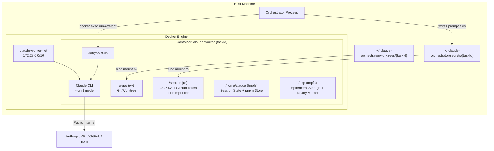

# Claude Worker - Technical Reference

## Overview

Claude Worker is a Docker container image that provides an isolated execution environment for Claude Code sessions. It is not a standalone service with HTTP endpoints; instead, the orchestrator manages its lifecycle via the Docker API (dockerode). The image bundles Claude CLI, a full developer toolchain (including Playwright/Chromium and pre-installed MCP servers), and a bash entrypoint that handles authentication, dependency installation, and prompt-driven execution. Two image variants exist: a production image (`Dockerfile`) and a test image (`Dockerfile.test`) that substitutes a bash stub for the real Claude CLI. The image is stored at `europe-central2-docker.pkg.dev/intexuraos-dev-pbuchman/intexuraos-dev/claude-worker:latest`.

## Architecture



## Container Configuration

### Resource Limits

| Resource | Limit                    | Enforcement         |
| -------- | ------------------------ | ------------------- |
| Memory   | 30 GB                    | Docker cgroup       |
| CPU      | 20 cores (20e9 NanoCpu)  | Docker cgroup       |
| tmpfs    | /tmp: 2 GB               | Mount option        |
| tmpfs    | /home/claude: 500 MB     | Mount option        |
| tmpfs    | /repo/node_modules: 4 GB | Mount option        |
| Timeout  | 2 hours                  | Orchestrator timer  |
| Max pool | 4 concurrent             | DockerProvider code |

### Security Controls

| Control          | Setting                            |
| ---------------- | ---------------------------------- |
| User             | claude (UID 1001, non-root)        |
| CapDrop          | ALL                                |
| CapAdd           | NET_RAW (for network diagnostics)  |
| SecurityOpt      | no-new-privileges                  |
| Secrets mount    | Read-only bind mount               |
| Repo mount       | Read-write bind mount              |
| Root filesystem  | Writable (required by Claude Code) |
| Docker socket    | NOT mounted                        |
| Removed binaries | wget, nc                           |

### Network Isolation

| Target                                    | Access  | Enforcement                 |
| ----------------------------------------- | ------- | --------------------------- |
| Public internet                           | Allowed | Default Docker bridge       |
| Cloud metadata                            | Blocked | iptables on production host |
| Localhost (127.0.0.0/8)                   | Blocked | iptables on production host |
| Private IPs (10/8, 172.16/12, 192.168/16) | Blocked | iptables on production host |

Network: `claude-worker-net` (bridge driver, subnet `172.28.0.0/16`, IP masquerade enabled).

## Mount Points

| Container Path            | Host Source                                 | Mode      | Purpose                                            |
| ------------------------- | ------------------------------------------- | --------- | -------------------------------------------------- |
| `/repo`                   | `{secretsBasePath}/../worktrees/{taskId}`   | rw        | Git worktree for the task                          |
| `/secrets`                | `{secretsBasePath}/{taskId}`                | ro        | GCP SA key + GitHub token + prompt files           |
| `/home/claude/pnpm-store` | `{secretsBasePath}/../pnpm-store`           | rw        | Shared pnpm content-addressable store              |
| `/home/claude/.claude`    | `{secretsBasePath}/claude-session-{taskId}` | rw        | Claude session state (persists across attempts)    |
| `/tmp`                    | tmpfs                                       | rw,noexec | Ephemeral scratch + ready marker                   |
| `/home/claude`            | tmpfs (500 MB)                              | rw,noexec | Home directory (pnpm-store and .claude overlaid)   |
| `/repo/node_modules`      | tmpfs (4 GB)                                | rw,exec   | Linux-native node_modules (shadows Mac host mount) |
| `{mainGitDir}`            | Main `.git` directory (for worktrees)       | rw        | Git operations on worktrees                        |

### Secrets Directory Files

| File                | Required | Description                                       |
| ------------------- | -------- | ------------------------------------------------- |
| `gcp-sa.json`       | Optional | GCP service account key for gcloud auth           |
| `github-token`      | Optional | GitHub access token (refreshed every 30 min)      |
| `system-prompt.txt` | Required | Claude system prompt (read at `run-attempt` time) |
| `user-prompt.txt`   | Required | Claude user prompt (read via stdin redirect)      |

## Environment Variables

| Variable                              | Source           | Description                                                                       |
| ------------------------------------- | ---------------- | --------------------------------------------------------------------------------- |
| `TASK_ID`                             | Orchestrator     | Unique task identifier                                                            |
| `ANTHROPIC_API_KEY`                   | Orchestrator env | API key for Anthropic (opus/auto types); omitted when shared credentials are used |
| `ANTHROPIC_BASE_URL`                  | Worker type map  | API endpoint URL; omitted when shared credentials are used                        |
| `ANTHROPIC_MODEL`                     | Worker type map  | Model override (opus only)                                                        |
| `LINEAR_API_KEY`                      | Orchestrator env | Linear integration key                                                            |
| `SENTRY_AUTH_TOKEN`                   | Orchestrator env | Sentry error tracking token                                                       |
| `GOOGLE_APPLICATION_CREDENTIALS`      | Fixed            | `/secrets/gcp-sa.json`                                                            |
| `CLAUDE_PROJECT_DIR`                  | Fixed            | `/repo`                                                                           |
| `CLAUDE_WORKER_MODE`                  | Fixed            | `1` — identifies this as an automated worker process                              |
| `CLAUDE_MANAGED_MODE`                 | Orchestrator     | `1` = stay alive, accept `run-attempt` via docker exec                            |
| `CLAUDE_CONTINUE`                     | Orchestrator     | `1` = pass `--continue` to resume previous session                                |
| `GIT_USER_NAME`                       | Orchestrator env | Git commit author name                                                            |
| `GIT_USER_EMAIL`                      | Orchestrator env | Git commit author email                                                           |
| `HOME`                                | Dockerfile       | `/home/claude`                                                                    |
| `NODE_ENV`                            | Dockerfile       | `production` (or `test` in test image)                                            |
| `COREPACK_ENABLE_DOWNLOAD_PROMPT`     | Dockerfile/env   | `0` — suppress corepack prompts in CI                                             |
| `PLAYWRIGHT_SKIP_BROWSER_DOWNLOAD`    | Dockerfile       | `1` — use system Chromium                                                         |
| `PLAYWRIGHT_CHROMIUM_EXECUTABLE_PATH` | Dockerfile       | `/usr/bin/chromium-browser`                                                       |

## Worker Types

| Type   | API Base URL                     | API Key Env Var     | Model Override             |
| ------ | -------------------------------- | ------------------- | -------------------------- |
| `opus` | `https://api.anthropic.com`      | `ANTHROPIC_API_KEY` | `claude-opus-4-5-20251101` |
| `auto` | `https://api.anthropic.com`      | `ANTHROPIC_API_KEY` | None (API default)         |
| `glm`  | `https://api.z.ai/api/anthropic` | `ZAI_API_KEY`       | None                       |

## Entrypoint Flow

The `entrypoint.sh` script supports two invocation modes:

### Primary Container Startup (always runs)

1. **Root check** - Exits with error if running as UID 0
2. **Network verification** - Background check that cloud metadata server (169.254.169.254) is unreachable
3. **Directory creation** - Creates `/home/claude/.config/gcloud` and `/home/claude/.claude` (tmpfs wipes image-time directories)
4. **Config restoration** - Copies baked-in Claude defaults from `/opt/claude-defaults/` to `/home/claude/`
5. **Mount verification** - Checks that `/repo` exists and contains a git repository (supports both `.git` directory and worktree `.git` file)
6. **GCP authentication** - Activates GCP service account from `/secrets/gcp-sa.json` via `gcloud auth`
7. **Git identity setup** - Configures `user.name` / `user.email` from `GIT_USER_NAME` / `GIT_USER_EMAIL` env vars
8. **GitHub token setup** - Reads token from `/secrets/github-token` into `GITHUB_TOKEN` env var (point-in-time snapshot for convenience); configures git credential helper to read the token file directly on each git operation
9. **Token freshness** - No background watcher needed. The git credential helper re-reads `/secrets/github-token` on every git operation, and the `gh` CLI wrapper (`/usr/local/bin/gh`) re-reads it before each invocation. The orchestrator's `TokenRefresher` updates the bind-mounted file every 30 minutes.
10. **pnpm install** - If `/repo/pnpm-lock.yaml` exists, runs `pnpm install --frozen-lockfile` with `CI=true`
11. **Attribution config** - Picks a random verb from 25 options and writes `{ attribution: { commit, pr } }` to `/repo/.claude/settings.local.json`
12. **Readiness marker** - Writes `/tmp/worker-ready`

### Managed Mode (`CLAUDE_MANAGED_MODE=1`)

After startup, sleeps in an infinite loop. The orchestrator triggers work via:

```bash
docker exec <container> /entrypoint.sh run-attempt
```

The `run-attempt` handler:

1. Verifies `/tmp/worker-ready` exists
2. Checks `/secrets/system-prompt.txt` and `/secrets/user-prompt.txt` are present
3. Sets up git identity and GitHub token for this attempt
4. Runs `claude --print --verbose --output-format stream-json --dangerously-skip-permissions --system-prompt <content> < /secrets/user-prompt.txt`
5. If `CLAUDE_CONTINUE=1`: adds `--continue` flag to resume previous session

### Legacy Mode (default, `CLAUDE_MANAGED_MODE` unset)

After startup, immediately calls `run_claude_attempt` and exits with its exit code. No `docker exec` needed.

## Config Defaults

### claude.json (baked at `/opt/claude-defaults/.claude.json`)

Pre-populates onboarding and migration state to skip all interactive setup flows:

```json
{
  "firstStartTime": "2026-01-01T00:00:00.000Z",
  "hasCompletedOnboarding": true,
  "lastOnboardingVersion": "2.1.37",
  "autoUpdates": false,
  "sonnet45MigrationComplete": true,
  "opus45MigrationComplete": true,
  "opusProMigrationComplete": true,
  "thinkingMigrationComplete": true,
  "cachedChromeExtensionInstalled": false,
  "bypassPermissionsModeAccepted": true
}
```

### settings.local.json (runtime-generated at `/repo/.claude/settings.local.json`)

Written by the entrypoint at startup with a randomized attribution verb:

```json
{
  "attribution": {
    "commit": "Crafted with love by 🤖 <a href=\"mailto:intex@intexuraos.cloud\">Intex</a>",
    "pr": "Crafted with love by 🤖 <a href=\"mailto:intex@intexuraos.cloud\">Intex</a>"
  }
}
```

If `/repo/.claude/settings.local.json` already exists, the entrypoint merges the `attribution` key using `jq` rather than overwriting.

## Installed Toolchain

| Tool                  | Install Source         | Purpose                                      |
| --------------------- | ---------------------- | -------------------------------------------- |
| git                   | Alpine package         | Version control                              |
| openssh-client        | Alpine package         | SSH keys for git operations                  |
| pnpm                  | Corepack               | Package management (CI)                      |
| ripgrep               | Alpine edge/community  | Fast code search                             |
| fd                    | Alpine edge/community  | Fast file finder                             |
| bat                   | Alpine edge/community  | Syntax-highlighted file viewer               |
| jq                    | Alpine package         | JSON processing                              |
| gh                    | Alpine edge/community  | GitHub CLI (PR creation)                     |
| chromium              | Alpine edge/community  | Browser for @playwright/mcp                  |
| terraform             | HashiCorp binary 1.7.0 | Infrastructure validation                    |
| gcloud                | Google Cloud SDK       | GCP authentication and ops                   |
| python3 / py3-pip     | Alpine package         | gcloud CLI dependency + MCP deps             |
| curl                  | Alpine package         | HTTP requests                                |
| @upstash/context7-mcp | npm global             | Context7 MCP server                          |
| @sentry/mcp-server    | npm global             | Sentry MCP server                            |
| @playwright/mcp       | npm global             | Playwright MCP server (uses system Chromium) |

## Orchestrator Integration

The `DockerProvider` class in the orchestrator manages the full container lifecycle:

| Operation           | Method                          | Description                                                               |
| ------------------- | ------------------------------- | ------------------------------------------------------------------------- |
| Create container    | `createWorker(config)`          | Creates, starts container; waits for ready marker; triggers first attempt |
| Destroy container   | `destroyWorker(taskId, force?)` | SIGTERM (10s grace) or SIGKILL, then remove + cleanup                     |
| Check status        | `isWorkerRunning(taskId)`       | Docker inspect on container state                                         |
| Get logs            | `getWorkerLogs(taskId)`         | Container stdout/stderr + buffered attempt logs                           |
| Stream logs         | `streamLogs(taskId, onChunk)`   | Real-time log streaming via Docker follow                                 |
| Wait for completion | `waitForCompletion(taskId, ms)` | Blocks until exit or timeout (returns exit code)                          |
| Get resource usage  | `getResourceUsage(taskId)`      | CPU%, memory used/limit from Docker stats                                 |
| List workers        | `listWorkers()`                 | All active worker handles                                                 |
| Cleanup orphans     | `cleanupOrphanedContainers()`   | Remove containers older than 24 hours from previous runs                  |
| Cleanup session     | `cleanupTaskSession(taskId)`    | Delete per-task Claude session directory                                  |
| Preserve worker     | `preserveWorker(taskId)`        | Park container in preserved map (keep alive for debugging)                |
| List preserved      | `listPreservedWorkers()`        | Active preserved (not-yet-destroyed) worker entries                       |
| Image info          | `getImageInfo()`                | Configured image ref, last pulled digest, pull policy                     |

### Shared Credentials Mode

When `DockerProviderConfig.sharedCredsPath` is set, opus and auto workers use pre-fetched Anthropic OAuth credentials stored in a `.credentials.json` file at that path. The file is mounted at `/home/claude/.claude` instead of the per-task session directory. In this mode, `ANTHROPIC_API_KEY` and `ANTHROPIC_BASE_URL` are omitted from the container environment — Claude CLI reads credentials directly from the mounted file.

### Image Pull and Digest Resolution

With `imagePullPolicy: 'always'` (default), `DockerProvider` pulls the image before each container creation using GCP service account credentials for registry auth (`username: '_json_key'`). After pulling, it resolves the immutable image digest from `RepoDigests` and uses that digest as the actual image reference for container creation. The last resolved digest is available via `getImageInfo()`. A warning is emitted when the `:latest` tag is used.

### Container Ready Detection (Managed Mode)

After `container.start()`, the orchestrator polls for the `/tmp/worker-ready` marker file before sending work. This marker is written by the entrypoint after setup (GCP auth, pnpm install, attribution config) is complete. The orchestrator should not call `runAttempt` until the marker is present.

## File Structure

```
workers/claude-worker/
  Dockerfile                          # Production image
  Dockerfile.test                     # Test image (stub CLI)
  entrypoint.sh                       # Container entrypoint script
  config-defaults/
    claude.json                       # Pre-baked Claude onboarding state
    settings.local.json               # Dev reference (not baked into image)
  test-fixtures/
    claude-stub.sh                    # Bash stub for E2E testing
```

## Gotchas

**Managed mode vs. legacy mode** - If `CLAUDE_MANAGED_MODE=1` is not set, the container runs Claude once and exits. The orchestrator must set this flag if it wants to reuse the container across multiple attempts or resume sessions.

**Readiness marker before run-attempt** - The `run-attempt` handler checks for `/tmp/worker-ready` and exits with error if it's missing. The orchestrator must wait for this marker before calling `docker exec run-attempt`, or the attempt will fail silently.

**Worktree git mounts** - Git worktrees use a `.git` file (not directory) pointing to the main repo's `.git/worktrees/` directory. The DockerProvider detects this and bind-mounts the main `.git` directory so that git operations (commit, push) work inside the container.

**tmpfs wipes image contents** - The `/home/claude` tmpfs mount replaces the image-time directory contents at container start. Config defaults are baked into `/opt/claude-defaults/` (outside the tmpfs) and copied in by the entrypoint.

**pnpm store is host-mounted** - The orchestrator creates `{secretsBasePath}/../pnpm-store` on the host and bind-mounts it at `/home/claude/pnpm-store:rw`. This directory survives container teardown and is shared across all containers started by the same orchestrator instance. However, the entrypoint still calls `pnpm install --frozen-lockfile` at startup, which re-links packages from the store — the first container may be slow, but subsequent ones benefit from the populated store cache.

**GitHub token is read from file, not env** - The `GITHUB_TOKEN` env var set at startup is a point-in-time snapshot that may go stale within long-running attempts. The git credential helper reads `/secrets/github-token` directly on each git operation (`$(cat /secrets/github-token)` in gitconfig). The `gh` CLI uses a wrapper at `/usr/local/bin/gh` that re-reads the file before each invocation. Both mechanisms pick up token refreshes from the orchestrator's `TokenRefresher` without any background watcher.

**Attribution file uses jq merge** - If `/repo/.claude/settings.local.json` already exists (e.g. from a previous orchestrator run on the same worktree), the entrypoint uses `jq` to merge the `attribution` key rather than overwriting the file. This preserves any user settings already present.

**UID 1001, not 1000** - The `node:22-alpine` base image assigns UID 1000 to the `node` user. The `claude` user uses UID 1001 to avoid conflicts. The tmpfs mounts specify `uid=1001,gid=1001` to match.
