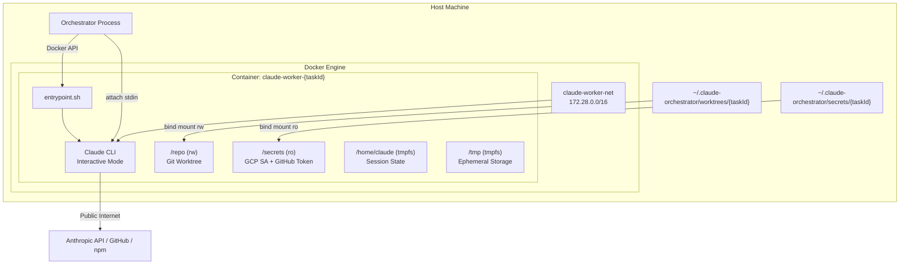

# Claude Worker - Technical Reference

## Overview

Claude Worker is a Docker container image that provides an isolated execution environment for Claude Code sessions. It is not a standalone service with HTTP endpoints; instead, the orchestrator manages its lifecycle via the Docker API (dockerode). The image bundles Claude CLI, a full developer toolchain, and a bash entrypoint that handles authentication, mount verification, and process startup. Two image variants exist: a production image (`Dockerfile`) and a test image (`Dockerfile.test`) that substitutes a bash stub for the real Claude CLI.

## Architecture



## Container Configuration

### Resource Limits

| Resource | Limit                 | Enforcement         |
| -------- | --------------------- | ------------------- |
| Memory   | 8 GB                  | Docker cgroup       |
| CPU      | 4 cores (4e9 NanoCpu) | Docker cgroup       |
| tmpfs    | /tmp: 2 GB            | Mount option        |
| tmpfs    | /home/claude: 500 MB  | Mount option        |
| Timeout  | 2 hours               | Orchestrator timer  |
| Max pool | 4 concurrent          | DockerProvider code |

### Security Controls

| Control          | Setting                            |
| ---------------- | ---------------------------------- |
| User             | claude (UID 1001, non-root)        |
| CapDrop          | ALL                                |
| CapAdd           | NET_RAW (for network diagnostics)  |
| SecurityOpt      | no-new-privileges                  |
| Secrets mount    | Read-only bind mount               |
| Repo mount       | Read-write bind mount              |
| Root filesystem  | Writable (required by Claude Code) |
| Docker socket    | NOT mounted                        |
| Removed binaries | wget, nc                           |

### Network Isolation

| Target                                    | Access  | Enforcement                 |
| ----------------------------------------- | ------- | --------------------------- |
| Public internet                           | Allowed | Default Docker bridge       |
| Cloud metadata                            | Blocked | iptables on production host |
| Localhost (127.0.0.0/8)                   | Blocked | iptables on production host |
| Private IPs (10/8, 172.16/12, 192.168/16) | Blocked | iptables on production host |

Network: `claude-worker-net` (bridge driver, subnet `172.28.0.0/16`, IP masquerade enabled).

## Mount Points

| Container Path | Host Source                                 | Mode      | Purpose                     |
| -------------- | ------------------------------------------- | --------- | --------------------------- |
| `/repo`        | `~/.claude-orchestrator/worktrees/{taskId}` | rw        | Git worktree for the task   |
| `/secrets`     | `~/.claude-orchestrator/secrets/{taskId}`   | ro        | GCP SA key + GitHub token   |
| `/tmp`         | tmpfs                                       | rw,noexec | Ephemeral scratch space     |
| `/home/claude` | tmpfs                                       | rw,noexec | Claude session state        |
| `{mainGitDir}` | Main `.git` directory (for worktrees)       | rw        | Git operations on worktrees |

## Environment Variables

| Variable                            | Source           | Description                             |
| ----------------------------------- | ---------------- | --------------------------------------- |
| `TASK_ID`                           | Orchestrator     | Unique task identifier                  |
| `ANTHROPIC_API_KEY`                 | Orchestrator env | API key for Anthropic (opus/auto types) |
| `ANTHROPIC_BASE_URL`                | Worker type map  | API endpoint URL                        |
| `ANTHROPIC_MODEL`                   | Worker type map  | Model override (opus only)              |
| `LINEAR_API_KEY`                    | Orchestrator env | Linear integration key                  |
| `SENTRY_AUTH_TOKEN`                 | Orchestrator env | Sentry error tracking token             |
| `GOOGLE_APPLICATION_CREDENTIALS`    | Fixed            | `/secrets/gcp-sa.json`                  |
| `CLAUDE_PROJECT_DIR`                | Fixed            | `/repo`                                 |
| `CLAUDE_CODE_EXIT_AFTER_STOP_DELAY` | Fixed            | `10000` (exit 10s after idle)           |
| `HOME`                              | Dockerfile       | `/home/claude`                          |
| `NODE_ENV`                          | Dockerfile       | `production` (or `test` in test image)  |

## Worker Types

| Type   | API Base URL                     | API Key Env Var     | Model Override             |
| ------ | -------------------------------- | ------------------- | -------------------------- |
| `opus` | `https://api.anthropic.com`      | `ANTHROPIC_API_KEY` | `claude-opus-4-5-20251101` |
| `auto` | `https://api.anthropic.com`      | `ANTHROPIC_API_KEY` | None (API default)         |
| `glm`  | `https://api.z.ai/api/anthropic` | `ZAI_API_KEY`       | None                       |

## Entrypoint Flow

The `entrypoint.sh` script executes the following sequence:

1. **Root check** - Exits with error if running as UID 0
2. **Network verification** - Background check that cloud metadata server (169.254.169.254) is unreachable
3. **Directory creation** - Creates `/home/claude/.config/gcloud` and `/home/claude/.claude` (tmpfs wipes image-time directories)
4. **Config restoration** - Copies baked-in Claude defaults from `/opt/claude-defaults/` to `/home/claude/`
5. **Mount verification** - Checks that `/repo` exists and contains a git repository (supports both `.git` directory and worktree `.git` file)
6. **GCP authentication** - Activates GCP service account from `/secrets/gcp-sa.json` via `gcloud auth`
7. **GitHub token setup** - Reads token from `/secrets/github-token` into `GITHUB_TOKEN` env var
8. **Token refresh watcher** - Background loop checks `/secrets/github-token` every 60 seconds for updates
9. **Claude startup** - Exec into `claude --dangerously-skip-permissions --verbose` (interactive mode)

## Config Defaults

### claude.json (baked at `/opt/claude-defaults/.claude.json`)

Pre-populates onboarding state to skip the interactive setup flow:

```json
{
  "hasCompletedOnboarding": true,
  "autoUpdates": false,
  "bypassPermissionsModeAccepted": true
}
```

### settings.json (baked at `/opt/claude-defaults/.claude/settings.json`)

```json
{
  "preferredNotifChannel": "terminal_bell"
}
```

## Installed Toolchain

| Tool      | Install Source         | Purpose                        |
| --------- | ---------------------- | ------------------------------ |
| git       | Alpine package         | Version control                |
| pnpm      | Corepack               | Package management (CI)        |
| ripgrep   | Alpine edge/community  | Fast code search               |
| fd        | Alpine edge/community  | Fast file finder               |
| bat       | Alpine edge/community  | Syntax-highlighted file viewer |
| jq        | Alpine package         | JSON processing                |
| gh        | Alpine edge/community  | GitHub CLI (PR creation)       |
| terraform | HashiCorp binary 1.7.0 | Infrastructure validation      |
| gcloud    | Google Cloud SDK       | GCP authentication and ops     |
| python3   | Alpine package         | gcloud CLI dependency          |
| curl      | Alpine package         | HTTP requests                  |

## Orchestrator Integration

The `DockerProvider` class in the orchestrator manages the full container lifecycle:

| Operation           | Method                          | Description                                           |
| ------------------- | ------------------------------- | ----------------------------------------------------- |
| Create container    | `createWorker(config)`          | Creates, attaches, starts, sends system prompt        |
| Destroy container   | `destroyWorker(taskId, force?)` | SIGTERM (10s grace) or SIGKILL, then remove + cleanup |
| Check status        | `isWorkerRunning(taskId)`       | Docker inspect on container state                     |
| Get logs            | `getWorkerLogs(taskId)`         | Full stdout/stderr with timestamps                    |
| Stream logs         | `streamLogs(taskId, onChunk)`   | Real-time log streaming via Docker follow             |
| Wait for completion | `waitForCompletion(taskId, ms)` | Blocks until exit or timeout (returns exit code)      |
| Send input          | `sendInput(taskId, input)`      | Writes to attach stream stdin                         |
| Attach TTY          | `attachTTY(taskId)`             | Interactive bash session for debugging                |
| Get resource usage  | `getResourceUsage(taskId)`      | CPU%, memory used/limit from Docker stats             |
| List workers        | `listWorkers()`                 | All active worker handles                             |
| Cleanup orphans     | `cleanupOrphanedContainers()`   | Remove containers from previous orchestrator runs     |

### Container Ready Detection

After `container.start()`, the orchestrator waits for the container to become ready before sending the system prompt:

1. Wait 8 seconds for initial boot (entrypoint + Claude CLI startup)
2. Send an arrow-up keypress (`\x1b[A`) followed by Enter (`\r`) to handle the API key confirmation prompt
3. Wait for output to settle (2 seconds of silence after approval)
4. Hard timeout at 30 seconds (proceeds anyway)

## File Structure

```
workers/claude-worker/
  Dockerfile                          # Production image
  Dockerfile.test                     # Test image (stub CLI)
  entrypoint.sh                       # Container entrypoint script
  config-defaults/
    claude.json                       # Pre-baked Claude onboarding state
    settings.json                     # Pre-baked Claude settings
  test-fixtures/
    claude-stub.sh                    # Bash stub for E2E testing
```

## Gotchas

**Attach before start** - The `container.attach()` call must happen before `container.start()`. If attach is called after start, the stream misses output emitted during container startup, causing the ready-detection logic to hang.

**Worktree git mounts** - Git worktrees use a `.git` file (not directory) pointing to the main repo's `.git/worktrees/` directory. The DockerProvider detects this and bind-mounts the main `.git` directory so that git operations (commit, push) work inside the container.

**tmpfs wipes image contents** - The `/home/claude` tmpfs mount replaces the image-time directory contents at container start. Config defaults are baked into `/opt/claude-defaults/` (outside the tmpfs) and copied in by the entrypoint.

**Token refresh is host-side** - The background token watcher in `entrypoint.sh` reads the token file, but the actual token refresh is performed by the orchestrator's `TokenRefresher` class. The watcher only detects file changes; it does not mint new tokens.

**UID 1001, not 1000** - The `node:22-alpine` base image assigns UID 1000 to the `node` user. The `claude` user uses UID 1001 to avoid conflicts. The tmpfs mounts specify `uid=1001,gid=1001` to match.
