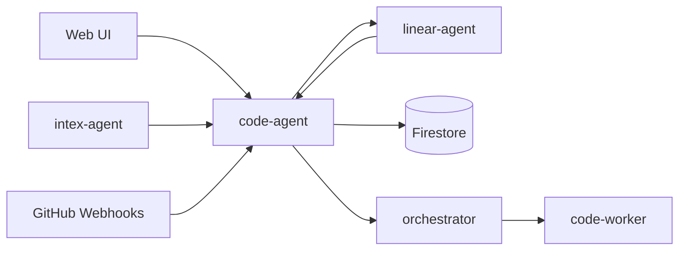

# Code Agent Technical Reference

Code Agent orchestrates autonomous code execution tasks. It accepts task submissions from the web UI, Intex, trusted internal services, GitHub PR comments, and Linear assignment automation. It sanitizes prompts, deduplicates tasks, dispatches signed worker requests, streams logs, processes completion webhooks, manages PR automation, syncs Linear state, and records task lifecycle events.

## Architecture

## Current Internal Entry Points

| Method | Path | Purpose |
| --- | --- | --- |
| `POST` | `/internal/code/tasks` | Create a code task from a trusted service |
| `POST` | `/internal/code/diagnostics` | Internal diagnostics |
| `POST` | `/internal/code/queue/drain` | Drain queued code tasks |
| `POST` | `/internal/code/webhooks/task-event` | Receive worker task events |

## Removed Compatibility Behavior

- No action status mirror service.
- No action-status callback client.
- No action approval fields on new task records.
- No public or internal command/action compatibility routes.

## Verification Notes

Task completion, cancellation, interruption, and failure should update code-task state and Linear state only. Tests should assert no removed callback route is invoked even when old stored task records contain legacy metadata.

