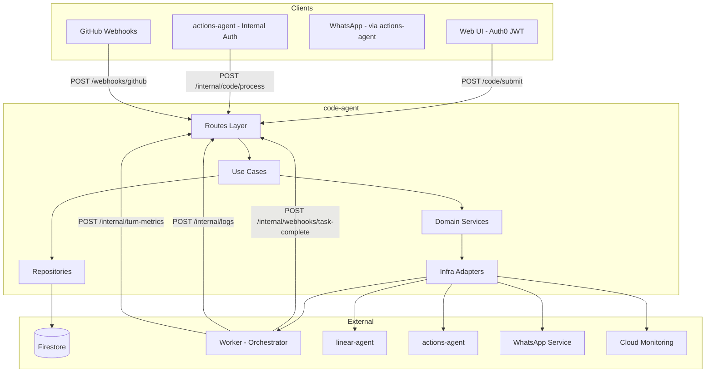
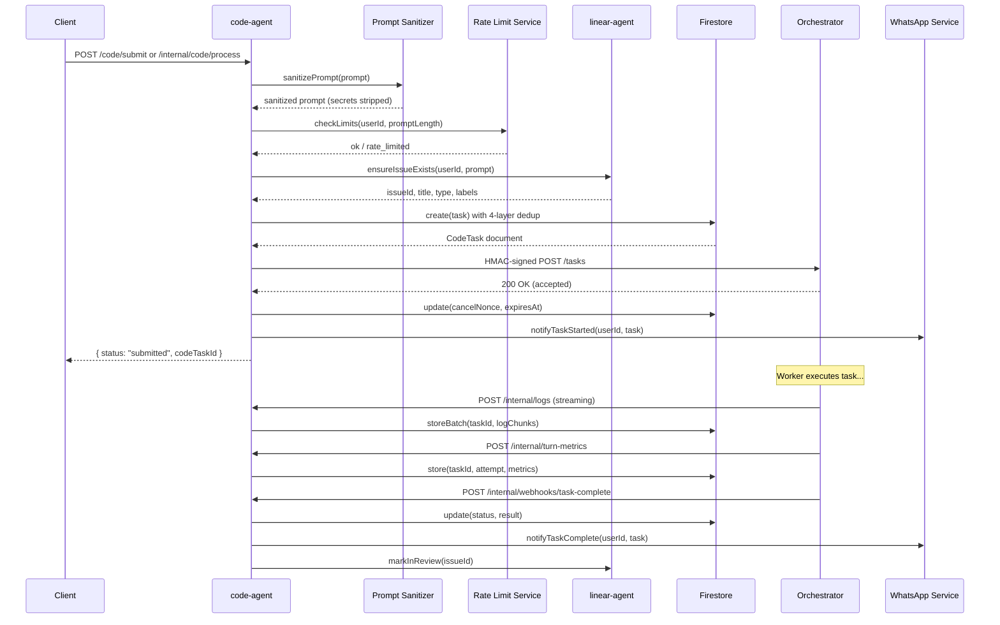

# Code Agent -- Technical Reference

## Overview

The code-agent service orchestrates autonomous code execution tasks. It accepts task submissions from the web UI (Auth0 JWT) and the actions-agent (internal auth), sanitizes prompts to strip embedded secrets, creates Firestore documents with four-layer deduplication, dispatches HMAC-signed requests to user-configured workers via Cloudflare Access, streams log chunks into Firestore subcollections, processes completion webhooks, receives GitHub PR events and dispatches follow-up instructions, and mirrors state transitions to Linear and the actions-agent.

- **Framework:** Fastify 5 on Node.js 22+
- **Port:** 8128 (local), 8080 (Cloud Run)
- **Package:** `@intexuraos/code-agent` v3.1.0
- **Deploy:** Cloud Run (scale 0-1)

## Architecture



## Data Flow: Task Submission



## Recent Changes

| Commit     | Description                                                       | Date         |
| ---------- | ----------------------------------------------------------------- | ------------ |
| `c33321e4` | Use Date.now() for metrics log line sequences                     | 52 min ago   |
| `9be25162` | Dynamic CPU cores from cgroup + metrics in task logs              | 5 hours ago  |
| `878c08b9` | Implement prompt sanitization for worker inputs (INT-612)         | 6 hours ago  |
| `483c476a` | Replace scattered webhook filters with sender whitelist           | 6 hours ago  |
| `95161acb` | Dispatch and triage edited claude[bot] review comments            | 7 hours ago  |
| `d5810213` | Use unique actionId for webhook dedup, propagate all dedup errors | 22 hours ago |
| `1db69f2a` | Transition Linear to In Review on task-complete webhook           | 28 hours ago |
| `bcbd5075` | Add multi-status filtering and fix pagination for code tasks      | 28 hours ago |
| `f6420f4b` | Populate prNumber and prBranch on task completion (INT-465)       | 2 days ago   |
| `2e7039c3` | Simplify PR comment auto-response (INT-465)                       | 2 days ago   |
| `e5637ce5` | Deduplicate PR body across pull_request events                    | 3 days ago   |
| `be0eaa8b` | Automatic turn-end metrics collection (CPU, memory, tokens)       | 3 days ago   |
| `c1bc9883` | Truncate oversized tool results and unparseable log lines         | 3 days ago   |

## API Endpoints

### Public Routes (Auth0 JWT)

| Method | Path                                       | Description                        | Auth  |
| ------ | ------------------------------------------ | ---------------------------------- | ----- |
| POST   | `/code/submit`                             | Submit code task from web UI       | Auth0 |
| GET    | `/code/tasks`                              | List user's tasks (paginated)      | Auth0 |
| GET    | `/code/tasks/:taskId`                      | Get task details                   | Auth0 |
| POST   | `/code/tasks/:taskId/cancel`               | Cancel a running task              | Auth0 |
| POST   | `/code/tasks/:taskId/retry`                | Retry a failed/cancelled task      | Auth0 |
| POST   | `/code/tasks/:taskId/feedback`             | Submit feedback on completed task  | Auth0 |
| POST   | `/code/tasks/:taskId/messages`             | Send message to running/ended task | Auth0 |
| POST   | `/code/tasks/:taskId/implement`            | Start execution from planning task | Auth0 |
| GET    | `/code/github-pr-events`                   | Query GitHub PR events             | Auth0 |
| GET    | `/code/github-pr-summaries`                | List PRs active in last 30 days    | Auth0 |
| GET    | `/code/worker-settings`                    | Get worker settings (masked)       | Auth0 |
| POST   | `/code/worker-settings/workers`            | Add new worker                     | Auth0 |
| PATCH  | `/code/worker-settings/workers/:name`      | Update worker config               | Auth0 |
| DELETE | `/code/worker-settings/workers/:name`      | Delete worker                      | Auth0 |
| POST   | `/code/worker-settings/workers/:name/test` | Test worker connectivity           | Auth0 |
| PUT    | `/code/worker-settings/priority`           | Reorder workers by priority        | Auth0 |

### Internal Routes (X-Internal-Auth)

| Method | Path                                                | Description                            | Auth          |
| ------ | --------------------------------------------------- | -------------------------------------- | ------------- |
| POST   | `/internal/code/process`                            | Process code action from actions-agent | Internal      |
| PATCH  | `/internal/code-tasks/:taskId`                      | Update task status (worker callback)   | Internal      |
| GET    | `/internal/code-tasks/linear/:linearIssueId/active` | Check active task for Linear issue     | Internal      |
| GET    | `/internal/code-tasks/zombies`                      | Find zombie tasks                      | Internal      |
| POST   | `/internal/code/cancel`                             | Cancel task via nonce (WhatsApp)       | Internal      |
| POST   | `/internal/code/heartbeat`                          | Process heartbeat from orchestrator    | Internal+HMAC |
| POST   | `/internal/code/detect-zombies`                     | Trigger zombie detection               | Internal      |
| POST   | `/internal/code/cleanup-logs`                       | Trigger log cleanup                    | Internal      |

### Webhook Routes (HMAC Signature)

| Method | Path                               | Description                           | Auth          |
| ------ | ---------------------------------- | ------------------------------------- | ------------- |
| POST   | `/internal/webhooks/task-complete` | Task completion callback              | Internal+HMAC |
| POST   | `/internal/logs`                   | Log chunk upload from orchestrator    | Internal+HMAC |
| POST   | `/internal/turn-metrics`           | Turn metrics upload from orchestrator | Internal+HMAC |
| POST   | `/webhooks/github`                 | GitHub webhook events                 | GitHub HMAC   |

### Utility Routes

| Method | Path            | Description  |
| ------ | --------------- | ------------ |
| GET    | `/health`       | Health check |
| GET    | `/openapi.json` | OpenAPI spec |
| GET    | `/docs`         | Swagger UI   |

## Domain Model

### CodeTask (collection: `code_tasks`)

The central entity. Tracks a coding task through its lifecycle.

```typescript
interface CodeTask {
  id: string;
  traceId: string;
  actionId?: string;
  approvalEventId?: string;
  retriedFrom?: string;
  userId: string;
  workerType: 'opus' | 'auto' | 'glm';
  workerLocation: string;
  status:
    | 'dispatched'
    | 'running'
    | 'planned'      // planning agent completed
    | 'implemented'  // execution agent completed
    | 'failed'
    | 'interrupted'
    | 'cancelled';
  prompt: string;
  sanitizedPrompt: string;    // After secret stripping
  systemPromptHash: string;
  repository: string;
  baseBranch: string;
  linearIssueId?: string;
  linearIssueTitle?: string;
  linearIssueUrl?: string;
  linearIssueType?: 'feature' | 'bug' | 'refactor' | 'research';
  linearFallback?: boolean;
  prNumber?: number;          // Populated on completion
  prBranch?: string;
  parentTaskId?: string;
  followUpReason?: 'pr_comment' | 'user_feedback' | 'retry' | 'phase2_implement';
  agentType?: 'planning' | 'execution';
  implementationTaskId?: string;
  result?: TaskResult;
  error?: TaskError;
  createdAt: Timestamp;
  dispatchedAt?: Timestamp;
  completedAt?: Timestamp;
  updatedAt: Timestamp;
  callbackReceived: boolean;
  webhookSecret?: string;
  lastHeartbeat?: Timestamp;
  logChunksDropped?: number;
  statusSummary?: StatusSummary;
  pendingUserMessages?: string[];
  dedupKey: string;
  cancelNonce?: string;
  cancelNonceExpiresAt?: string;
}
```

### LogChunk (subcollection: `code_tasks/{taskId}/logs`)

Streaming log data from the worker, ordered by sequence number.

```typescript
interface LogChunk {
  id: string;
  sequence: number;
  content: string; // May contain ANSI codes
  timestamp: Timestamp;
  size: number; // Byte size
}
```

### LogLine (subcollection: `code_tasks/{taskId}/log_lines`)

Formatted log lines parsed from chunks, plus system-generated status markers and metrics blocks.

```typescript
interface LogLine {
  sequence: number;
  text: string;        // Prefixed: [assistant], [tool], [user], [system], [queued], [resumed]
  timestamp: Timestamp;
}
```

### UserUsage (collection: `user_usage`)

Rate limiting counters with time-windowed resets.

```typescript
interface UserUsage {
  userId: string;
  concurrentTasks: number;
  tasksThisHour: number;
  hourStartedAt: Timestamp;
  costToday: number;
  costThisMonth: number;
  dayStartedAt: Timestamp;
  monthStartedAt: Timestamp;
  updatedAt: Timestamp;
}
```

### UserWorkerSettings (collection: `code_worker_settings`)

Per-user encrypted worker credentials and configuration.

```typescript
interface UserWorkerSettings {
  userId: string;
  workers: WorkerConfig[]; // Max 2, ordered by priority
  createdAt: string;
  updatedAt: string;
  workerHealthStatuses?: Record<string, WorkerHealthStatus>;
}
```

### TurnMetrics (subcollection: `code_tasks/{taskId}/turn_metrics`)

Per-turn resource and performance metrics, automatically collected at turn end.

```typescript
interface TurnMetrics {
  taskId: string;
  attempt: number;
  timestamp: string;
  cpuTimeSeconds: number;
  cpuCores: number;         // Dynamic from cgroup
  peakMemoryMB: number;
  wallTimeSeconds: number;
  apiWaitSeconds: number;
  toolExecSeconds: number;
  backgroundWaitSeconds: number;
  overheadSeconds: number;
  totalInputTokens: number;
  totalOutputTokens: number;
  totalCacheReadTokens: number;
  totalCacheCreationTokens: number;
  apiCallCount: number;
  cpuUtilizationPercent: number;
  idlePercent: number;
}
```

### GitHubPREvent (collection: `github-pr-events`)

Normalized GitHub webhook events for PR timeline display.

### GitHubPRSummary (collection: `github-pr-summaries`)

One document per unique PR, upserted on every webhook event. Used for the 30-day PR list view -- O(PRs) instead of O(events).

```typescript
interface GitHubPRSummary {
  repository: string;
  pullRequestNumber: number;
  title: string | null;
  state: string | null; // 'open' | 'closed'
  mergedAt: Date | null;
  lastActivityAt: Date;
  firstSeenAt: Date;
}
```

Document ID format: `${repository.replace('/', '__')}#${pullRequestNumber}`

## Firestore Collections Owned

| Collection             | Description                                                                |
| ---------------------- | -------------------------------------------------------------------------- |
| `code_tasks`           | Code execution tasks (subcollections: `logs`, `log_lines`, `turn_metrics`) |
| `user_spend`           | User cost tracking for rate limiting                                       |
| `user_usage`           | Rate limiting counters (concurrent, hourly, cost)                          |
| `code_worker_settings` | Per-user worker configs with encrypted credentials                         |
| `github-pr-events`     | GitHub PR webhook events for timeline display                              |
| `github-pr-summaries`  | Per-PR rollup documents for O(PRs) list view (30-day window)               |
| `pr_task_locks`        | Per-PR task locks preventing concurrent modifications                      |

## Use Cases

| Use Case               | File                                        | Description                                              |
| ---------------------- | ------------------------------------------- | -------------------------------------------------------- |
| processCodeAction      | `domain/usecases/processCodeAction.ts`      | Create task with dedup, sanitize prompt, dispatch        |
| cancelTaskWithNonce    | `domain/usecases/cancelTaskWithNonce.ts`    | Cancel via WhatsApp nonce validation                     |
| processHeartbeat       | `domain/usecases/processHeartbeat.ts`       | Update heartbeat timestamps for zombie detection         |
| detectZombieTasks      | `domain/usecases/detectZombieTasks.ts`      | Find and interrupt stale tasks (30 min)                  |
| cleanupTaskLogs        | `domain/usecases/cleanupTaskLogs.ts`        | Archive logs older than 90 days                          |
| retryTask              | `domain/usecases/retryTask.ts`              | Retry failed/cancelled with cool-off and context         |
| submitTaskFeedback     | `domain/usecases/submitTaskFeedback.ts`     | Follow-up on completed tasks with feedback               |
| sendTaskMessage        | `domain/usecases/sendTaskMessage.ts`        | Send message to running task (queued) or resume ended    |
| submitToExecutionAgent | `domain/usecases/submitToExecutionAgent.ts` | Start execution agent from completed planning task       |

## Domain Services

| Service               | Interface                                   | Purpose                                           |
| --------------------- | ------------------------------------------- | ------------------------------------------------- |
| LinearIssueService    | `domain/services/linearIssueService.ts`     | Validate/create Linear issues, state transitions  |
| RateLimitService      | `domain/services/rateLimitService.ts`       | Check and record rate limits per user             |
| TaskDispatcherService | `domain/services/taskDispatcher.ts`         | Dispatch tasks to workers with HMAC and fallback  |
| WhatsAppNotifier      | `domain/services/whatsappNotifier.ts`       | Send WhatsApp notifications (start/complete/fail) |
| StatusMirrorService   | `infra/services/statusMirrorServiceImpl.ts` | Mirror task status to actions-agent               |
| MetricsClient         | `domain/services/metrics.ts`                | Record Cloud Monitoring metrics                   |

## Domain Utilities

| Utility             | File                                       | Purpose                                                    |
| ------------------- | ------------------------------------------ | ---------------------------------------------------------- |
| sanitizePrompt      | `domain/utils/promptSanitization.ts`       | Strip secrets (AWS, API keys, PEM, env vars) from prompts  |
| labelUtils          | `domain/utils/labelUtils.ts`               | Check Linear issue labels for code-task/unclear markers    |
| metricsLogFormatter | `domain/formatters/metricsLogFormatter.ts` | Format TurnMetrics as visual log blocks for the transcript |

## Dependencies (Service-to-Service)

| Target Service      | Communication         | Purpose                                         |
| ------------------- | --------------------- | ----------------------------------------------- |
| linear-agent        | HTTP (internal auth)  | Issue CRUD, state transitions, title generation |
| actions-agent       | HTTP (internal auth)  | Action status updates                           |
| whatsapp-service    | Pub/Sub               | WhatsApp message sending                        |
| Worker/Orchestrator | HTTP (CF Access+HMAC) | Task dispatch, cancellation, messaging          |

## Configuration

### Required Environment Variables

| Variable                           | Description                                   |
| ---------------------------------- | --------------------------------------------- |
| `INTEXURAOS_GCP_PROJECT_ID`        | GCP project ID                                |
| `INTEXURAOS_INTERNAL_AUTH_TOKEN`   | Internal service auth token                   |
| `INTEXURAOS_WEBHOOK_VERIFY_SECRET` | HMAC secret for webhook validation            |
| `INTEXURAOS_TOKEN_ENCRYPTION_KEY`  | AES key for encrypting worker credentials     |
| `INTEXURAOS_ORCHESTRATOR_SECRET`   | HMAC secret for orchestrator dispatch signing |
| `INTEXURAOS_GITHUB_WEBHOOK_SECRET` | GitHub webhook HMAC-SHA256 secret             |

### Production-Only Environment Variables

| Variable                                 | Description                                  |
| ---------------------------------------- | -------------------------------------------- |
| `INTEXURAOS_WHATSAPP_SERVICE_URL`        | WhatsApp service URL                         |
| `INTEXURAOS_PUBSUB_WHATSAPP_SEND_TOPIC`  | Pub/Sub topic for WhatsApp messages          |
| `INTEXURAOS_LINEAR_AGENT_URL`            | linear-agent service URL                     |
| `INTEXURAOS_ACTIONS_AGENT_URL`           | actions-agent service URL                    |
| `INTEXURAOS_SERVICE_URL`                 | This service's public URL (for webhook URLs) |
| `INTEXURAOS_AUTH_AUDIENCE`               | Auth0 audience                               |
| `INTEXURAOS_AUTH_ISSUER`                 | Auth0 issuer                                 |
| `INTEXURAOS_AUTH_JWKS_URL`               | Auth0 JWKS endpoint                          |

### Rate Limit Defaults

| Limit                | Value   |
| -------------------- | ------- |
| Max concurrent tasks | 3       |
| Max tasks per hour   | 10      |
| Max prompt length    | 10,000  |
| Daily cost cap       | $20     |
| Monthly cost cap     | $200    |
| Estimated cost/task  | $1.17   |
| Zombie threshold     | 30 min  |
| Log retention        | 90 days |
| Cancel nonce TTL     | 15 min  |
| Retry cool-off       | 5 min   |

## Gotchas

1. **Worker credentials are per-user.** There are no global/fallback workers. If a user has no configured workers, task submission fails with `worker_not_configured`.
2. **HMAC validation requires raw body.** Fastify parses JSON, so the GitHub webhook handler reconstructs the raw body via `JSON.stringify(request.body)` for signature verification.
3. **Log chunk sequence 0 triggers status transition.** When the first log chunk arrives, the service transitions the task from `dispatched` to `running`.
4. **Cancelled tasks bypass the 5-minute retry cool-off.** Only failed tasks enforce the cool-off period.
5. **E2E mode replaces all external clients with no-ops.** Set `E2E_MODE=true` to use mock Linear, WhatsApp, and actions-agent clients.
6. **PR events API applies two deduplication passes.** `GET /code/github-pr-events` runs `deduplicateCommentEvents` (keeps first occurrence, updates body to latest) then `deduplicatePRBody` (removes PR body from all but the most recent `pull_request` event) before returning results. The raw events in Firestore are unmodified.
7. **`github-pr-summaries` documents use `__` instead of `/` in repository names.** Firestore path separator conflicts with repo slugs, so `owner/repo` becomes `owner__repo#prNumber` as the document ID.
8. **Prompt sanitization runs before dispatch but after dedup key generation.** The `dedupKey` is computed from the raw prompt so that repeated submissions of the same prompt (with or without secrets) are correctly deduplicated. The worker only ever sees the sanitized version.
9. **Sender whitelist for PR comment dispatch.** Only comments from `claude[bot]`, `chatgpt-codex-connector[bot]`, and the repository owner trigger task dispatch. Other senders are silently ignored.
10. **Bot review edit triage.** When a whitelisted bot edits its comment, the dispatch message instructs the agent to check whether the review is still in progress (spinner, short body, unchecked items) before acting. This prevents premature reactions to incomplete reviews.
11. **Turn metrics use orchestrator HMAC, not per-task HMAC.** The `/internal/turn-metrics` endpoint validates signatures against `INTEXURAOS_ORCHESTRATOR_SECRET`, not the per-task webhook secret.

## File Structure

```
apps/code-agent/src/
  index.ts                          # Entry point, env validation, startup
  server.ts                         # Fastify server setup, CORS, Swagger
  config.ts                         # Config loader (env -> Config interface)
  services.ts                       # DI container (ServiceContainer)
  domain/
    models/
      codeTask.ts                   # CodeTask, TaskStatus, TaskResult, TaskError
      gitHubPREvent.ts              # GitHub webhook event model
      gitHubPRSummary.ts            # Per-PR summary for list view
      logChunk.ts                   # Log chunk model (HMAC-signed uploads)
      logLine.ts                    # FormattedLogLine (for LogLineRepository)
      signing.ts                    # Signing error types
      turnMetrics.ts                # Per-turn CPU/memory/token metrics
      userSpend.ts                  # User spend tracking model
      userUsage.ts                  # User usage + DEFAULT_LIMITS
      worker.ts                     # WorkerLocation type
      workerSettings.ts             # UserWorkerSettings, WorkerCredentials, WorkerHealthState
    ports/
      linearAgentClient.ts          # Linear agent client interface
      userUsageRepository.ts        # User usage repository interface
      workerHealthProbe.ts          # Worker health probe interface
      workerSettingsRepository.ts   # Worker settings repository interface
    repositories/
      codeTaskRepository.ts         # CodeTask CRUD + dedup interface
      gitHubPREventRepository.ts    # GitHub PR event repository interface
      gitHubPRSummaryRepository.ts  # PR summary repository interface
      logChunkRepository.ts         # Log chunk storage interface
      logLineRepository.ts          # LogLine storage interface
      turnMetricsRepository.ts      # Turn metrics storage interface
    services/
      linearIssueService.ts         # Linear issue management service
      logFormatter.ts               # Log chunk -> log line parser
      metrics.ts                    # MetricsClient interface
      rateLimitService.ts           # Rate limit checking and recording
      statusMirrorService.ts        # Status mirror service interface
      taskDispatcher.ts             # Task dispatch interface + types
      whatsappNotifier.ts           # WhatsApp notification interface
    usecases/
      cancelTaskWithNonce.ts        # Cancel via nonce
      cleanupTaskLogs.ts            # Log archival
      detectZombieTasks.ts          # Zombie detection
      processCodeAction.ts          # Main task creation + dispatch
      processHeartbeat.ts           # Heartbeat processing
      retryTask.ts                  # Task retry with cool-off
      sendTaskMessage.ts            # Send message to running/ended task
      submitTaskFeedback.ts         # Feedback follow-up
      submitToExecutionAgent.ts     # Execution agent from planning
    utils/
      labelUtils.ts                 # Linear label checks (code-task, unclear)
      promptSanitization.ts         # Secret stripping and whitespace normalization
    formatters/
      metricsLogFormatter.ts        # TurnMetrics -> formatted log block
  infra/
    auth/
      index.ts                     # Auth exports
      jwtValidator.ts              # Auth0 JWT validation
    clients/
      actionsAgentClient.ts        # Actions agent HTTP client
    firestore/
      encryption.ts                # AES-256-GCM encryption for worker creds
      gitHubPREventsRepository.ts  # GitHub PR events Firestore impl
      gitHubPRSummariesRepository.ts    # PR summary Firestore impl (upsert + list)
      userUsageFirestoreRepository.ts   # User usage Firestore impl
      workerSettingsRepository.ts  # Worker settings Firestore impl
    http/
      linearAgentHttpClient.ts     # Linear agent HTTP client
    repositories/
      firestoreCodeTaskRepository.ts    # CodeTask Firestore impl
      firestoreLogChunkRepository.ts    # LogChunk Firestore impl
      firestoreLogLineRepository.ts     # LogLine Firestore impl
      firestoreTurnMetricsRepository.ts # TurnMetrics subcollection impl
    services/
      hmacSigning.ts               # HMAC signing utilities
      statusMirrorServiceImpl.ts   # Action status mirroring impl
      taskDispatcherImpl.ts        # Task dispatch with CF Access + fallback
      whatsappNotifierImpl.ts      # WhatsApp notification via Pub/Sub
      workerHealthProbe.ts         # Worker health probing impl
    github-event-parser.ts         # GitHub webhook payload parser
    github-webhook-auth.ts         # GitHub HMAC-SHA256 verification
    metrics.ts                     # Cloud Monitoring metrics impl
    webhookValidation.ts           # Webhook HMAC validation
  routes/
    index.ts                       # Route registration
    codeRoutes.ts                  # Main code task routes (internal + public, ~3600 lines)
    webhookRoutes.ts               # Task completion + log + turn-metrics webhooks
    workerSettingsRoutes.ts        # Worker settings CRUD routes
    code/
      index.ts                     # Code route exports
      extractEventUrl.ts           # Extract clickable GitHub URLs from webhook payloads
      github-pre-events.ts         # GitHub PR events query route (with dedup passes)
      github-pr-summaries.ts       # PR summaries list route (30-day window)
    webhooks/
      index.ts                     # Webhook route aggregator
      github.ts                    # GitHub webhook handler + PR comment dispatch
```
