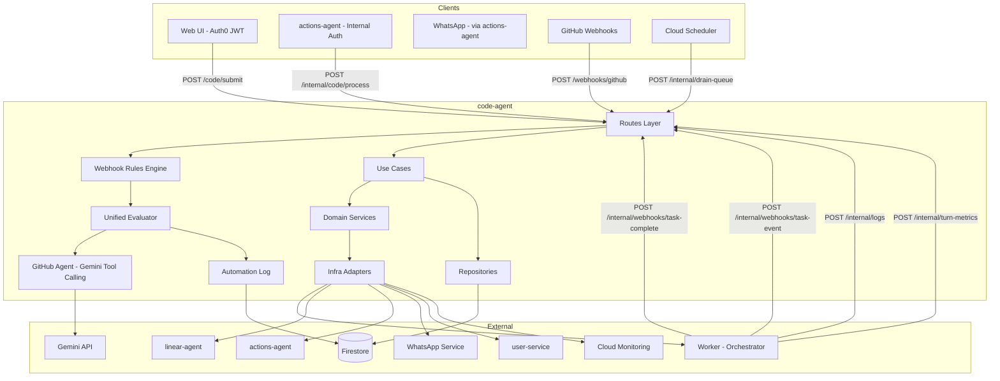
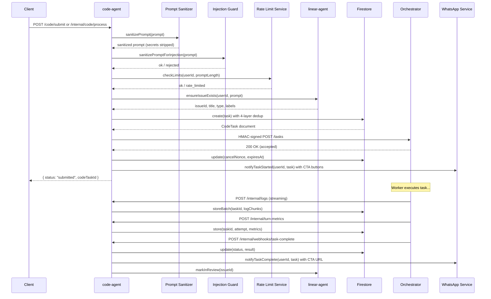
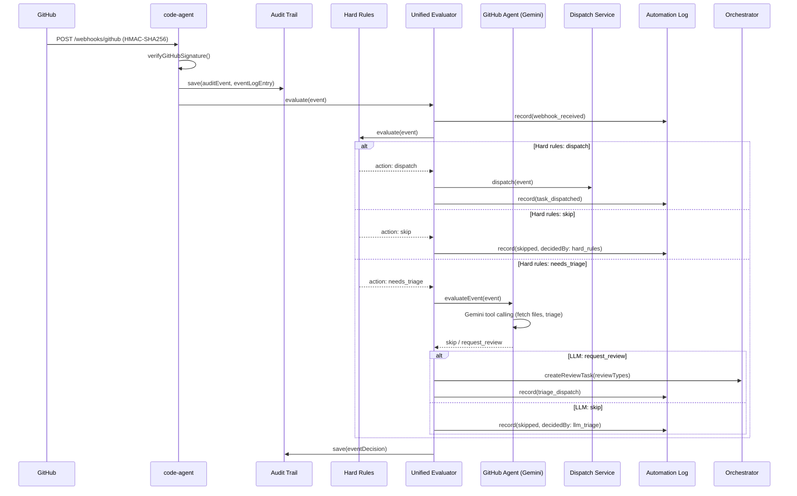

# Code Agent — Technical Reference

## Overview

The code-agent service orchestrates autonomous code execution tasks. It accepts task submissions from the web UI (Auth0 JWT) and the actions-agent (internal auth), sanitizes prompts through two layers (secret redaction and injection prevention), creates Firestore documents with four-layer deduplication, dispatches HMAC-signed requests to user-configured workers via Cloudflare Access, streams log chunks into Firestore subcollections, processes completion webhooks, receives GitHub PR events and evaluates them through a two-tier pipeline (deterministic hard rules then Gemini tool-calling triage), dispatches follow-up instructions or creates new tasks from PR comments, manages automated code reviews with structured output validation, records all PR automation decisions in a unified log, detects merge conflicts on bot-authored PRs, and mirrors state transitions to Linear and the actions-agent.

- **Framework:** Fastify 5 on Node.js 22+
- **Port:** 8128 (local), 8080 (Cloud Run)
- **Package:** `@intexuraos/code-agent`
- **Deploy:** Cloud Run (scale 0-1)

## Architecture



## Data Flow: Task Submission



## Data Flow: GitHub PR Evaluation Pipeline



## Recent Changes

Changes since v3.2.0, grouped by feature area:

**GitHub Agent with Tool Calling for PR Evaluation**

| Commit     | Description                                                                    | Date       |
| ---------- | ------------------------------------------------------------------------------ | ---------- |
| `6738fade` | Bump githubAgentPrompt to 4.2.0 with CRITICAL tool-call instruction            | 2026-03-13 |
| `3dac991a` | Add skip comment posting to unifiedEvaluator for PR events                     | 2026-03-13 |
| `0391ecca` | Add triage validation schemas and repair message builder                       | 2026-03-13 |

**Unified PR Automation Log**

| Commit     | Description                                                                    | Date       |
| ---------- | ------------------------------------------------------------------------------ | ---------- |
| `84e8d051` | Implement unified PR automation log                                            | 2026-03-14 |
| `249b95be` | Add integration tests for PR automation log event flows                        | 2026-03-15 |
| `c2cbd6c9` | Remove redundant "Automated Code Review Triage Decision" PR comments           | 2026-03-15 |
| `71ffdad5` | Improve PR event log by filtering noise and adding context                     | 2026-03-15 |

**Structured Output Validation for Triage**

| Commit     | Description                                                                    | Date       |
| ---------- | ------------------------------------------------------------------------------ | ---------- |
| `0391ecca` | Add triage validation schemas and repair message builder                       | 2026-03-13 |

**Fresh-Start Review Dispatch & Reliable Review Agent**

| Commit     | Description                                                                    | Date       |
| ---------- | ------------------------------------------------------------------------------ | ---------- |
| `0223b4bd` | Merge review notifications and add mandatory review-started comment            | 2026-03-13 |
| `5d2138d0` | Deduplicate review failure notifications into triage comment                   | 2026-03-13 |

**Gemini Tool-Call Mode & Pipeline Progress**

| Commit      | Description                                                                    | Date       |
| ----------- | ------------------------------------------------------------------------------ | ---------- |
| `987c1f8b`  | Enforce Gemini tool-call mode and retry on LLM failure for PR triage           | 2026-03-14 |
| `312955706` | Pass failed response as corrective context on LLM retry                        | 2026-03-14 |
| `b4cfc579`  | Fix Gemini tool calling loop and Firestore automation log path                 | 2026-03-15 |

**PR Branch Inheritance Across Task Retries**

| Commit     | Description                                                                    | Date       |
| ---------- | ------------------------------------------------------------------------------ | ---------- |
| Various    | Code task retries inherit open PR branches so work is not lost                 | 2026-03-12 |

**Merge Conflict Detection**

| Commit     | Description                                                                    | Date       |
| ---------- | ------------------------------------------------------------------------------ | ---------- |
| `bb9f35af` | Apply bot-to-owner remapping in merge conflict detector                        | 2026-03-13 |

**Dispatch Retry Queue**

| Commit     | Description                                                                    | Date       |
| ---------- | ------------------------------------------------------------------------------ | ---------- |
| Various    | Dispatch retry queue for failed webhook dispatches                             | 2026-03-12 |

**@review Issue Comment Triage**

| Commit     | Description                                                                    | Date       |
| ---------- | ------------------------------------------------------------------------------ | ---------- |
| Various    | @review issue comment triage with LLM-selected worker routing                  | 2026-03-12 |

**Other Notable Changes**

| Commit      | Description                                                                    | Date       |
| ----------- | ------------------------------------------------------------------------------ | ---------- |
| `56eec5d0`  | Add default review worker type per-user setting                                | 2026-03-13 |
| `ee49f3ba`  | Add dispatchedAt to all dispatch paths and fix qwen label recognition          | 2026-03-13 |
| `2284f068`  | Add GitHub event decision log                                                  | 2026-03-13 |
| `09b3592f`  | Remove "Automated Review Completed" PR notification                            | 2026-03-13 |
| `4649a1f1`  | Remove success notification outcomes, rename buildTaskOutcomeComment           | 2026-03-13 |
| `424443075` | Add already_completed execution outcome label                                  | 2026-03-14 |
| `f0f5cf3f`  | Add queue support to review tasks when workers are at capacity                 | 2026-03-15 |

## API Endpoints

### Public Routes (Auth0 JWT)

| Method | Path                                       | Description                           | Auth  |
| ------ | ------------------------------------------ | ------------------------------------- | ----- |
| POST   | `/code/submit`                             | Submit code task from web UI          | Auth0 |
| GET    | `/code/tasks`                              | List user's tasks (paginated)         | Auth0 |
| GET    | `/code/tasks/:taskId`                      | Get task details                      | Auth0 |
| DELETE | `/code/tasks/:taskId`                      | Delete a code task                    | Auth0 |
| POST   | `/code/cancel`                             | Cancel a running task                 | Auth0 |
| POST   | `/code/retry`                              | Retry a failed/cancelled task         | Auth0 |
| POST   | `/code/tasks/:taskId/feedback`             | Submit feedback on completed task     | Auth0 |
| POST   | `/code/tasks/:taskId/messages`             | Send message to running/ended task    | Auth0 |
| POST   | `/code/tasks/:taskId/implement`            | Start execution from planning task    | Auth0 |
| GET    | `/code/github-pr-events`                   | Query GitHub PR events                | Auth0 |
| GET    | `/code/github-pr-summaries`                | List PRs active in last 30 days       | Auth0 |
| GET    | `/code/github-event-log`                   | GitHub event decision log (paginated) | Auth0 |
| POST   | `/code/github-event-log/rows`              | Hydrate event log rows by ID          | Auth0 |
| GET    | `/code/workers/status`                     | Get worker health status              | Auth0 |
| POST   | `/code/workers/refresh-status`             | Refresh worker health status          | Auth0 |
| GET    | `/code/worker-settings`                    | Get worker settings (masked)          | Auth0 |
| POST   | `/code/worker-settings/workers`            | Add new worker                        | Auth0 |
| PATCH  | `/code/worker-settings/workers/:name`      | Update worker config                  | Auth0 |
| DELETE | `/code/worker-settings/workers/:name`      | Delete worker                         | Auth0 |
| POST   | `/code/worker-settings/workers/:name/test` | Test worker connectivity              | Auth0 |
| PUT    | `/code/worker-settings/priority`           | Reorder workers by priority           | Auth0 |

### Internal Routes (X-Internal-Auth)

| Method | Path                                                | Description                            | Auth          |
| ------ | --------------------------------------------------- | -------------------------------------- | ------------- |
| POST   | `/internal/code/process`                            | Process code action from actions-agent | Internal      |
| PATCH  | `/internal/code-tasks/:taskId`                      | Update task status (worker callback)   | Internal      |
| GET    | `/internal/code-tasks/linear/:linearIssueId/active` | Check active task for Linear issue     | Internal      |
| GET    | `/internal/code-tasks/zombies`                      | Find zombie tasks                      | Internal      |
| POST   | `/internal/code/cancel-with-nonce`                  | Cancel task via nonce (WhatsApp)       | Internal      |
| POST   | `/internal/code/heartbeat`                          | Process heartbeat from orchestrator    | Internal+HMAC |
| POST   | `/internal/code/detect-zombies`                     | Trigger zombie detection               | Internal      |
| POST   | `/internal/tasks/cleanup-logs`                      | Trigger log cleanup                    | Internal      |
| POST   | `/internal/code/submit-phase2`                      | Submit execution phase (internal)      | Internal      |
| POST   | `/internal/drain-queue`                             | Drain task + retry queues (Scheduler)  | Internal      |

### Webhook Routes (HMAC Signature)

| Method | Path                               | Description                             | Auth          |
| ------ | ---------------------------------- | --------------------------------------- | ------------- |
| POST   | `/internal/webhooks/task-complete` | Task completion callback                | Internal+HMAC |
| POST   | `/internal/webhooks/task-event`    | Task lifecycle events (automation log)  | Internal+HMAC |
| POST   | `/internal/logs`                   | Log chunk upload from orchestrator      | Internal+HMAC |
| POST   | `/internal/turn-metrics`           | Turn metrics upload from orchestrator   | Internal+HMAC |
| POST   | `/webhooks/github`                 | GitHub webhook events                   | GitHub HMAC   |

### Utility Routes

| Method | Path            | Description  |
| ------ | --------------- | ------------ |
| GET    | `/health`       | Health check |
| GET    | `/openapi.json` | OpenAPI spec |
| GET    | `/docs`         | Swagger UI   |

## Domain Model

### CodeTask (collection: `code_tasks`)

The central entity. Tracks a coding task through its lifecycle.

```typescript
interface CodeTask {
  id: string;
  traceId: string;
  actionId?: string;
  approvalEventId?: string;
  retriedFrom?: string;
  userId: string;
  workerType: 'opus' | 'auto' | 'sonnet' | 'minimax' | 'glm' | 'qwen' | 'kimi';
  workerLocation: string;
  status:
    | 'dispatched'
    | 'running'
    | 'queued'       // waiting for worker capacity
    | 'planned'      // planning agent completed
    | 'implemented'  // execution agent completed
    | 'reviewed'     // review agent completed
    | 'failed'
    | 'interrupted'
    | 'cancelled'
    | 'archived';    // original task archived after retry
  prompt: string;
  sanitizedPrompt: string;    // After secret stripping + injection guard
  systemPromptHash: string;
  repository: string;
  baseBranch: string;
  linearIssueId?: string;
  prNumber?: number;          // Populated on completion
  prBranch?: string;
  parentTaskId?: string;
  followUpReason?: 'pr_comment' | 'user_feedback' | 'retry' | 'execution_implement';
  agentType?: 'planning' | 'execution' | 'pull_request' | 'review';
  implementationTaskId?: string;
  result?: TaskResult;
  error?: TaskError;
  createdAt: Timestamp;
  queuedAt?: Timestamp;
  dispatchedAt?: Timestamp;
  completedAt?: Timestamp;
  updatedAt: Timestamp;
  callbackReceived: boolean;
  webhookSecret?: string;
  lastHeartbeat?: Timestamp;
  logChunksDropped?: number;
  statusSummary?: StatusSummary;
  pendingUserMessages?: string[];
  dedupKey: string;
  cancelNonce?: string;
  cancelNonceExpiresAt?: string;
}
```

**Status Lifecycle:**

```
queued -> dispatched -> running -> planned | implemented | reviewed | failed | cancelled
dispatched -> interrupted (zombie detection after 30 min)
queued -> failed (TTL expired or queue full)
failed | cancelled | interrupted -> archived (when task is retried)
```

### EventDecision (collection: `event_decisions`)

Audit trail for webhook event evaluation decisions.

```typescript
interface EventDecision {
  id: string;
  eventId: string;
  repository: string | null;
  pullRequestNumber: number | null;
  eventType: GitHubWebhookEventType;
  eventAction: GitHubWebhookAction;
  senderLogin: string | null;
  decidedBy: 'hard_rules' | 'github_agent' | 'webhook_route';
  decision: 'dispatch' | 'skip' | 'request_review';
  reason: string;
  dispatchAction?: 'create_task' | 'send_message' | 'create_review_task';
  dispatchParams?: {
    taskId?: string;
    reviewTypes?: ('code_quality' | 'security' | 'architecture')[];
    workerType?: WorkerType;
  };
  llmModel?: string;
  llmCostUsd?: number;
  llmToolCalls?: { tool: string; args: Record<string, unknown> }[];
  llmReasoning?: string;
  dispatchSuccess?: boolean;
  dispatchError?: string;
  decisionLatencyMs: number;
  createdAt: Date;
}
```

### DispatchRetry (collection: `dispatch_retries`)

Failed webhook dispatch retry queue with bounded attempts and TTL.

```typescript
interface DispatchRetry {
  id: string;
  type: 'new_task' | 'task_message';
  eventId: string;
  repository: string;
  pullRequestNumber: number;
  senderLogin: string;
  taskId?: string;
  comment?: string;
  prTitle?: string;
  baseBranch?: string;
  userId?: string;
  message?: string;
  attempts: number;
  maxAttempts: number;
  lastError: string;
  createdAt: Timestamp;
  lastAttemptAt?: Timestamp;
  ttlMinutes: number;
}
```

### GitHubWebhookAuditEvent (collection: `github-webhook-audit-events`)

Every auth-passed GitHub webhook delivery, persisted before normalization.

### GitHubEventLogEntry (collection: `github-event-log-entries`)

Lightweight live projection for the event decision log UI.

```typescript
interface GitHubEventLogEntry {
  id: string;
  githubEventName: string;
  eventType: GitHubWebhookEventType;
  action: GitHubWebhookAction | null;
  repository: string | null;
  pullRequestNumber: number | null;
  authPassedAt: Date;
  updatedAt: Date;
  decisionState: 'pending' | 'completed';
  decisionOutcome: 'dispatch' | 'skip' | 'request_review' | null;
  decisionId: string | null;
  rowVersion: number;
}
```

### PRAutomationComment (collection: `pr_automation_comments`)

Tracks the unified automation log comment per PR. One document per PR, keyed by `repository:prNumber`.

### LogChunk (subcollection: `code_tasks/{taskId}/logs`)

Streaming log data from the worker, ordered by sequence number.

### LogLine (subcollection: `code_tasks/{taskId}/log_lines`)

Formatted log lines parsed from chunks, plus system-generated status markers and metrics blocks.

### TurnMetrics (subcollection: `code_tasks/{taskId}/turn_metrics`)

Per-turn resource and performance metrics, automatically collected at turn end.

### UserUsage (collection: `user_usage`)

Rate limiting counters with time-windowed resets.

### UserWorkerSettings (collection: `code_worker_settings`)

Per-user encrypted worker credentials and configuration. Includes `defaultReviewWorkerType` for review tasks.

### GitHubPREvent (collection: `github-pr-events`)

Normalized GitHub webhook events for PR timeline display.

### GitHubPRSummary (collection: `github-pr-summaries`)

One document per unique PR, upserted on every webhook event. Includes `mergeConflictStatus`, `managedConflictCommentId`, and `managedConflictTaskId` for merge conflict tracking.

Document ID format: `${repository.replace('/', '__')}#${pullRequestNumber}`

## Firestore Collections Owned

| Collection                    | Description                                                                |
| ----------------------------- | -------------------------------------------------------------------------- |
| `code_tasks`                  | Code execution tasks (subcollections: `logs`, `log_lines`, `turn_metrics`) |
| `user_spend`                  | User cost tracking for rate limiting                                       |
| `user_usage`                  | Rate limiting counters (concurrent, hourly, cost)                          |
| `code_worker_settings`        | Per-user worker configs with encrypted credentials                         |
| `github-pr-events`            | GitHub PR webhook events for timeline display                              |
| `github-pr-summaries`         | Per-PR rollup documents for O(PRs) list view (30-day window)               |
| `pr_task_locks`               | Per-PR task locks preventing concurrent modifications                      |
| `event_decisions`             | Audit trail of webhook event evaluation decisions                          |
| `dispatch_retries`            | Failed webhook dispatch retry queue with TTL and max-attempts bounds       |
| `github-webhook-audit-events` | Auth-passed GitHub webhook deliveries persisted before normalization       |
| `github-event-log-entries`    | Lightweight live projection for the event decision log UI                  |
| `pr_automation_comments`      | PR automation comment tracking for unified PR log                          |

## Use Cases

| Use Case                      | File                                                | Description                                                            |
| ----------------------------- | --------------------------------------------------- | ---------------------------------------------------------------------- |
| processCodeAction             | `domain/usecases/processCodeAction.ts`              | Create task with dedup, sanitize prompt, dispatch                      |
| createTaskForPR               | `domain/usecases/createTaskForPR.ts`                | Create task from GitHub PR comment (user lookup + lock guard)          |
| createReviewTask              | `domain/usecases/createReviewTask.ts`               | Create automated PR review task (dedup, Linear linking, review agent)  |
| githubAgent                   | `domain/usecases/githubAgent.ts`                    | Evaluate webhook events via Gemini tool-calling LLM                    |
| detectMergeConflictsOnPush    | `domain/usecases/detectMergeConflictsOnPush.ts`     | Detect merge conflicts on bot-authored PRs after push events           |
| drainRetryQueue               | `domain/usecases/drainRetryQueue.ts`                | Re-dispatch oldest failed webhook dispatch with bounded retries        |
| cancelTaskWithNonce           | `domain/usecases/cancelTaskWithNonce.ts`            | Cancel via WhatsApp nonce validation                                   |
| processHeartbeat              | `domain/usecases/processHeartbeat.ts`               | Update heartbeat timestamps for zombie detection                       |
| detectZombieTasks             | `domain/usecases/detectZombieTasks.ts`              | Find and interrupt stale tasks (30 min)                                |
| cleanupTaskLogs               | `domain/usecases/cleanupTaskLogs.ts`                | Archive logs older than 90 days                                        |
| retryTask                     | `domain/usecases/retryTask.ts`                      | Retry failed/cancelled with cool-off, archives original                |
| submitTaskFeedback            | `domain/usecases/submitTaskFeedback.ts`             | Follow-up on completed tasks with feedback                             |
| sendTaskMessage               | `domain/usecases/sendTaskMessage.ts`                | Send message to running task (queued) or resume ended                  |
| submitToExecutionAgent        | `domain/usecases/submitToExecutionAgent.ts`         | Start execution agent from completed planning task                     |
| drainTaskQueue                | `domain/usecases/drainTaskQueue.ts`                 | Dispatch oldest queued task or expire if past TTL                      |
| backLinkPlanningTask          | `domain/usecases/backLinkPlanningTask.ts`           | Back-link planning task to execution task (best-effort)                |
| enrichReviewWithComments      | `domain/usecases/enrichReviewWithComments.ts`       | Enrich PR review with comment thread context                           |

## Domain Services

| Service                   | Interface                                         | Purpose                                                               |
| ------------------------- | ------------------------------------------------- | --------------------------------------------------------------------- |
| UnifiedEvaluator          | `domain/services/unifiedEvaluator.ts`             | Two-tier webhook evaluation: hard rules then LLM triage               |
| AutomationLog             | `domain/ports/automationLog.ts`                   | Record PR automation lifecycle events to unified log                  |
| AutomationCommentRenderer | `domain/services/automationCommentRenderer.ts`    | Render automation events as GitHub PR comment markdown                |
| MergeConflictDetector     | `domain/services/mergeConflictDetector.ts`        | Detect and manage merge conflicts on bot-authored PRs                 |
| LinearIssueService        | `domain/services/linearIssueService.ts`           | Validate/create Linear issues, state transitions                      |
| RateLimitService          | `domain/services/rateLimitService.ts`             | Check and record rate limits per user                                 |
| TaskDispatcherService     | `domain/services/taskDispatcher.ts`               | Dispatch tasks to workers with HMAC and fallback                      |
| WhatsAppNotifier          | `domain/services/whatsappNotifier.ts`             | Send WhatsApp notifications with CTA URL buttons                      |
| StatusMirrorService       | `infra/services/statusMirrorServiceImpl.ts`       | Mirror task status to actions-agent                                   |
| MetricsClient             | `domain/services/metrics.ts`                      | Record Cloud Monitoring metrics                                       |
| WebhookRulesService       | `domain/services/gitHubWebhookRules.ts`           | Evaluate GitHub webhook events against domain rules                   |
| WebhookDispatchService    | `domain/services/gitHubDispatchService.ts`        | Dispatch tasks from actionable GitHub webhook events                  |
| GitHubMessageBuilder      | `domain/services/gitHubMessageBuilder.ts`         | Build task prompts from GitHub PR event context                       |

## Domain Utilities

| Utility                     | File                                             | Purpose                                                           |
| --------------------------- | ------------------------------------------------ | ----------------------------------------------------------------- |
| sanitizePrompt              | `domain/utils/promptSanitization.ts`             | Strip secrets (AWS, API keys, PEM, env vars) from prompts         |
| sanitizePromptForInjection  | `domain/utils/promptInjectionSanitizer.ts`       | Reject system override markers, base64 blobs, control chars       |
| labelUtils                  | `domain/utils/labelUtils.ts`                     | Check Linear labels (code-task, unclear, worker type)             |
| secrets                     | `domain/utils/secrets.ts`                        | Generate webhook secrets and cancel nonces                        |
| prTaskLock                  | `domain/utils/prTaskLock.ts`                     | Build and delete PR task locks for concurrent dispatch            |
| reviewTriage                | `domain/utils/reviewTriage.ts`                   | Detect @review commands, normalize review worker types            |
| taskRouting                 | `domain/utils/taskRouting.ts`                    | Resolve agent type, ensure dispatch labels                        |
| continuationPr              | `domain/utils/continuationPr.ts`                 | Inherit open PR branches across task retries                      |
| retryableErrors             | `domain/utils/retryableErrors.ts`                | Identify retryable dispatch error codes                           |
| dispatchWorkerTriage        | `domain/utils/dispatchWorkerTriage.ts`           | Worker type selection logic for dispatch                          |
| gitHubTokenResolver         | `domain/utils/gitHubTokenResolver.ts`            | Fetch GitHub OAuth token for a user                               |
| parseOwnerRepo              | `domain/utils/parseOwnerRepo.ts`                 | Parse owner/repo from full repository name                        |
| updatePRTitleWithLinearTag  | `domain/utils/updatePRTitleWithLinearTag.ts`     | Prepend [INT-XXX] to GitHub PR title                              |
| metricsLogFormatter         | `domain/formatters/metricsLogFormatter.ts`       | Format TurnMetrics as visual log blocks for the transcript        |

## Validation

| Schema                      | File                                              | Purpose                                                     |
| --------------------------- | ------------------------------------------------- | ----------------------------------------------------------- |
| TriageSkipSchema            | `domain/validation/triageSchema.ts`               | Zod schema for triage skip decisions                        |
| TriageReviewSchema          | `domain/validation/triageSchema.ts`               | Zod schema for triage review requests                       |
| buildTriageRepairMessage    | `domain/validation/buildTriageRepairMessage.ts`   | Build corrective prompt when triage output fails validation |

## Prompts

| Prompt                       | File                                             | Purpose                                               |
| ---------------------------- | ------------------------------------------------ | ----------------------------------------------------- |
| githubAgentPrompt            | `domain/prompts/githubAgentPrompt.ts`            | GitHub Agent system prompt for PR/comment evaluation  |
| issueCommentTriagePrompt     | `domain/prompts/issueCommentTriagePrompt.ts`     | Issue comment triage section for GitHub Agent prompt  |

## Dependencies (Service-to-Service)

| Target Service      | Communication         | Purpose                                             |
| ------------------- | --------------------- | --------------------------------------------------- |
| linear-agent        | HTTP (internal auth)  | Issue CRUD, state transitions, title generation     |
| actions-agent       | HTTP (internal auth)  | Action status updates                               |
| user-service        | HTTP (internal auth)  | GitHub username resolution, OAuth tokens            |
| whatsapp-service    | Pub/Sub               | WhatsApp message sending with CTA buttons           |
| Worker/Orchestrator | HTTP (CF Access+HMAC) | Task dispatch, cancellation, messaging              |
| Gemini API          | HTTP (API key)        | GitHub Agent tool-calling triage (gemini-2.5-flash) |

## Configuration

### Required Environment Variables

| Variable                           | Description                                   |
| ---------------------------------- | --------------------------------------------- |
| `INTEXURAOS_GCP_PROJECT_ID`        | GCP project ID                                |
| `INTEXURAOS_INTERNAL_AUTH_TOKEN`   | Internal service auth token                   |
| `INTEXURAOS_WEBHOOK_VERIFY_SECRET` | HMAC secret for webhook validation            |
| `INTEXURAOS_TOKEN_ENCRYPTION_KEY`  | AES key for encrypting worker credentials     |
| `INTEXURAOS_ORCHESTRATOR_SECRET`   | HMAC secret for orchestrator dispatch signing |
| `INTEXURAOS_GITHUB_WEBHOOK_SECRET` | GitHub webhook HMAC-SHA256 secret             |
| `INTEXURAOS_SERVICE_URL`           | This service's public URL (for webhook URLs)  |

### Production-Only Environment Variables

| Variable                                 | Description                                                            |
| ---------------------------------------- | ---------------------------------------------------------------------- |
| `INTEXURAOS_WHATSAPP_SERVICE_URL`        | WhatsApp service URL                                                   |
| `INTEXURAOS_PUBSUB_WHATSAPP_SEND_TOPIC`  | Pub/Sub topic for WhatsApp messages                                    |
| `INTEXURAOS_LINEAR_AGENT_URL`            | linear-agent service URL                                               |
| `INTEXURAOS_ACTIONS_AGENT_URL`           | actions-agent service URL                                              |
| `INTEXURAOS_USER_SERVICE_URL`            | user-service URL (GitHub username resolution)                          |
| `INTEXURAOS_AUTH_AUDIENCE`               | Auth0 audience                                                         |
| `INTEXURAOS_AUTH_ISSUER`                 | Auth0 issuer                                                           |
| `INTEXURAOS_AUTH_JWKS_URL`               | Auth0 JWKS endpoint                                                    |
| `INTEXURAOS_WEB_URL`                     | Web app URL for task deep links (defaults to https://intexuraos.cloud) |
| `INTEXURAOS_GEMINI_APP_API_KEY`          | Gemini API key for GitHub Agent tool-calling triage                    |

### Optional Environment Variables

| Variable                         | Description                                   |
| -------------------------------- | --------------------------------------------- |
| `INTEXURAOS_QUEUE_MAX_SIZE`      | Max queued tasks (default: 10)                |
| `INTEXURAOS_QUEUE_TTL_MINUTES`   | Queue expiry in minutes (default: 30)         |

### Rate Limit Defaults

| Limit                | Value   |
| -------------------- | ------- |
| Max concurrent tasks | 3       |
| Max tasks per hour   | 10      |
| Max prompt length    | 10,000  |
| Monthly cost cap     | $200    |
| Estimated cost/task  | $1.17   |
| Zombie threshold     | 30 min  |
| Log retention        | 90 days |
| Cancel nonce TTL     | 15 min  |
| Retry cool-off       | 5 min   |
| Queue TTL            | 30 min  |
| Queue max size       | 10      |

## Gotchas

1. **Worker credentials are per-user.** There are no global/fallback workers. If a user has no configured workers, task submission fails with `worker_not_configured`.
2. **HMAC validation requires raw body.** Fastify parses JSON, so the GitHub webhook handler reconstructs the raw body via `JSON.stringify(request.body)` for signature verification.
3. **Log chunk sequence 0 triggers status transition.** When the first log chunk arrives, the service transitions the task from `dispatched` to `running`.
4. **Cancelled tasks bypass the 5-minute retry cool-off.** Only failed tasks enforce the cool-off period.
5. **E2E mode replaces all external clients with no-ops.** Set `E2E_MODE=true` to use mock Linear, WhatsApp, and actions-agent clients.
6. **PR events API applies two deduplication passes.** `GET /code/github-pr-events` runs `deduplicateCommentEvents` (keeps first occurrence, updates body to latest) then `deduplicatePRBody` (removes PR body from all but the most recent `pull_request` event) before returning results. The raw events in Firestore are unmodified.
7. **`github-pr-summaries` documents use `__` instead of `/` in repository names.** Firestore path separator conflicts with repo slugs, so `owner/repo` becomes `owner__repo#prNumber` as the document ID.
8. **Prompt sanitization runs before dispatch but after dedup key generation.** The `dedupKey` is computed from the raw prompt so that repeated submissions of the same prompt (with or without secrets) are correctly deduplicated. The worker only ever sees the sanitized version.
9. **Sender whitelist for PR comment dispatch.** Only comments from `claude[bot]`, `chatgpt-codex-connector[bot]`, `intexuraos-code-worker[bot]`, and the repository owner trigger task dispatch. Other senders are silently ignored.
10. **Turn metrics use orchestrator HMAC, not per-task HMAC.** The `/internal/turn-metrics` endpoint validates signatures against `INTEXURAOS_ORCHESTRATOR_SECRET`, not the per-task webhook secret.
11. **Retried tasks archive the original.** When a task is retried, the original task's status changes to `archived`, keeping the task list focused on active work. The new task links back via `retriedFrom`.
12. **Cloudflare 520-530 errors are retryable.** The task dispatcher treats Cloudflare tunnel errors (520-530 range) as infrastructure failures and falls back to the next worker, rather than failing the task immediately. Failed webhook dispatches are enqueued in `dispatch_retries` for bounded retry.
13. **PR task locks guard concurrent dispatch.** When a GitHub PR comment triggers task creation, a Firestore transaction-based lock (`pr_task_locks` collection) prevents duplicate tasks from concurrent webhook deliveries. Locks are cleaned up when tasks reach terminal status.
14. **Linear issue labels drive worker type.** If a Linear issue has a label matching a supported worker type (e.g., `opus`, `sonnet`, `qwen`, `kimi`), that overrides the user-requested worker type for the task.
15. **SkipPrefixRule filters @claude/@codex/@ignore.** Comments starting with these prefixes are silently ignored by the webhook rules engine, preventing unwanted task dispatch from bot mentions or explicit ignore markers.
16. **Gemini-extracted task summaries.** When a task completes, the orchestrator's `CompletionVerifier` uses `gemini-2.5-flash` to extract a 3-5 sentence narrative summary from the agent's output.
17. **PR title auto-update with Linear ID.** When `createTaskForPR` creates a new Linear issue from a PR comment, it prepends `[INT-XXX]` to the GitHub PR title. This is best-effort — failures are logged but do not block task creation.
18. **GitHub Agent uses Gemini tool-call mode.** The triage LLM is configured with `toolConfig.functionCallingConfig.mode = 'ANY'` to force tool usage. If Gemini fails to call a triage tool, the evaluator retries once with the failed response as corrective context.
19. **Structured output validation for triage.** Triage results are validated against Zod schemas (`TriageSkipSchema`, `TriageReviewSchema`). Invalid results trigger an automatic repair prompt via `buildTriageRepairMessage`.
20. **Unified automation log is append-only.** The `AutomationLog` port records events as a single GitHub PR comment, updated on each new event. The `pr_automation_comments` collection tracks the comment ID per PR. Noise events (label, draft, lock changes) are filtered before rendering.
21. **Review tasks have PR-scoped dedup.** If an active review task already exists for the same PR, `createReviewTask` reuses it rather than creating a duplicate. Active review tasks are replaced if a newer review is requested with different parameters.
22. **Tasks created as queued, transitioned to dispatched.** New tasks are created with `queued` status and only transition to `dispatched` when the dispatch to the worker succeeds, ensuring restart-safe dispatch acknowledgment.
23. **Default review worker type.** Users can set a `defaultReviewWorkerType` in their worker settings. Review tasks use this value when no explicit worker type is specified by the triage decision.
24. **`/internal/webhooks/task-event` records automation log events.** The orchestrator sends task lifecycle events (started, completed, failed) to this endpoint, which records them in the PR automation log.

## File Structure

```
apps/code-agent/src/
  index.ts                          # Entry point, env validation, startup
  server.ts                         # Fastify server setup, CORS, Swagger
  config.ts                         # Config loader (env -> Config interface)
  services.ts                       # DI container (ServiceContainer)
  domain/
    models/
      codeTask.ts                   # CodeTask, TaskStatus, TaskResult, TaskError
      dispatchRetry.ts              # Dispatch retry queue model
      eventDecision.ts              # Event decision audit trail model
      gitHubEventLogEntry.ts        # Event log entry for decision log UI
      gitHubPREvent.ts              # GitHub webhook event model
      gitHubPRSummary.ts            # Per-PR summary for list view
      gitHubWebhookAuditEvent.ts    # Raw webhook audit event model
      gitHubWebhookTypes.ts         # GitHub webhook type enums
      logChunk.ts                   # Log chunk model (HMAC-signed uploads)
      logLine.ts                    # FormattedLogLine (for LogLineRepository)
      signing.ts                    # Signing error types
      turnMetrics.ts                # Per-turn CPU/memory/token metrics
      userSpend.ts                  # User spend tracking model
      userUsage.ts                  # User usage + DEFAULT_LIMITS
      worker.ts                     # WorkerLocation type
      workerSettings.ts             # UserWorkerSettings, WorkerCredentials, WorkerHealthState
    ports/
      automationLog.ts              # PR automation lifecycle event port
      gitHubPRClient.ts             # GitHub PR HTTP client interface
      gitHubUsernameResolver.ts     # GitHub username -> userId resolution
      linearAgentClient.ts          # Linear agent client interface
      prAutomationCommentRepository.ts # PR automation comment persistence
      userLookupService.ts          # GitHub login -> IntexuraOS user resolution
      userUsageRepository.ts        # User usage repository interface
      workerHealthProbe.ts          # Worker health probe interface
      workerSettingsRepository.ts   # Worker settings repository interface
    repositories/
      codeTaskRepository.ts         # CodeTask CRUD + dedup interface
      dispatchRetryRepository.ts    # Dispatch retry queue interface
      eventDecisionRepository.ts    # Event decision persistence interface
      gitHubEventLogEntryRepository.ts # Event log entry interface
      gitHubPREventRepository.ts    # GitHub PR event repository interface
      gitHubPRSummaryRepository.ts  # PR summary repository interface
      gitHubWebhookAuditEventRepository.ts # Webhook audit event interface
      logChunkRepository.ts         # Log chunk storage interface
      logLineRepository.ts          # LogLine storage interface
      turnMetricsRepository.ts      # Turn metrics storage interface
    services/
      automationCommentRenderer.ts  # Render automation events as PR comment markdown
      gitHubDispatchService.ts      # Webhook dispatch orchestration
      gitHubMessageBuilder.ts       # Build prompts from PR events
      gitHubWebhookRules.ts         # Domain rules for webhook actionability
      linearIssueService.ts         # Linear issue management service
      logFormatter.ts               # Log chunk -> log line parser
      mergeConflictDetector.ts      # Merge conflict detection interface
      metrics.ts                    # MetricsClient interface
      rateLimitService.ts           # Rate limit checking and recording
      statusMirrorService.ts        # Status mirror service interface
      taskDispatcher.ts             # Task dispatch interface + types
      unifiedEvaluator.ts           # Two-tier webhook evaluation pipeline
      whatsappNotifier.ts           # WhatsApp notification interface
    usecases/
      backLinkPlanningTask.ts       # Back-link planning -> execution
      cancelTaskWithNonce.ts        # Cancel via nonce
      cleanupTaskLogs.ts            # Log archival
      createReviewTask.ts           # Create automated PR review task
      createTaskForPR.ts            # Create task from PR comment (lock-guarded)
      detectMergeConflictsOnPush.ts # Merge conflict detection on push
      detectZombieTasks.ts          # Zombie detection
      drainRetryQueue.ts            # Retry queue draining with bounded retries
      drainTaskQueue.ts             # Queue draining
      enrichReviewWithComments.ts   # Enrich PR review with comment context
      githubAgent.ts                # GitHub Agent via Gemini tool calling
      processCodeAction.ts          # Main task creation + dispatch
      processHeartbeat.ts           # Heartbeat processing
      retryTask.ts                  # Task retry with cool-off + archival
      sendTaskMessage.ts            # Send message to running/ended task
      submitTaskFeedback.ts         # Feedback follow-up
      submitToExecutionAgent.ts     # Execution agent from planning
    utils/
      archiveRetriedTaskAfterDispatch.ts # Archive original task post-dispatch
      continuationPr.ts             # Inherit open PR branches on retry
      dispatchWorkerTriage.ts       # Worker type selection logic
      gitHubTokenResolver.ts        # GitHub OAuth token resolution
      labelUtils.ts                 # Linear label checks (code-task, unclear, worker type)
      parseOwnerRepo.ts             # Parse owner/repo from full name
      promptInjectionSanitizer.ts   # System keyword, base64, control char rejection
      promptSanitization.ts         # Secret stripping and whitespace normalization
      prTaskLock.ts                 # PR task lock helpers
      retryableErrors.ts            # Identify retryable dispatch errors
      reviewTriage.ts               # @review command detection, worker type normalization
      secrets.ts                    # Webhook secret and cancel nonce generation
      taskRouting.ts                # Agent type resolution, dispatch label management
      updatePRTitleWithLinearTag.ts # Prepend [INT-XXX] to PR title
    validation/
      buildTriageRepairMessage.ts   # Build corrective prompt for invalid triage
      triageSchema.ts               # Zod schemas for triage output validation
    formatters/
      metricsLogFormatter.ts        # TurnMetrics -> formatted log block
    prompts/
      githubAgentPrompt.ts          # GitHub Agent system prompt
      issueCommentTriagePrompt.ts   # Issue comment triage prompt section
  infra/
    auth/
      index.ts                     # Auth exports
      jwtValidator.ts              # Auth0 JWT validation
    clients/
      actionsAgentClient.ts        # Actions agent HTTP client
    firestore/
      dispatchRetryRepository.ts   # Dispatch retry Firestore impl
      encryption.ts                # AES-256-GCM encryption for worker creds
      eventDecisionRepository.ts   # Event decision Firestore impl
      gitHubEventLogEntryRepository.ts  # Event log entry Firestore impl
      gitHubPREventsRepository.ts  # GitHub PR events Firestore impl
      gitHubPRSummariesRepository.ts    # PR summary Firestore impl
      gitHubWebhookAuditEventRepository.ts # Webhook audit Firestore impl
      prAutomationCommentRepository.ts  # PR automation comment Firestore impl
      userUsageFirestoreRepository.ts   # User usage Firestore impl
      workerSettingsRepository.ts  # Worker settings Firestore impl
    http/
      gitHubPRHttpClient.ts        # GitHub PR HTTP client for title updates
      linearAgentHttpClient.ts     # Linear agent HTTP client
    migrations/
      agentRoutingContractMigration.ts  # Agent routing contract migration
    repositories/
      firestoreCodeTaskRepository.ts    # CodeTask Firestore impl
      firestoreLogChunkRepository.ts    # LogChunk Firestore impl
      firestoreLogLineRepository.ts     # LogLine Firestore impl
      firestoreTurnMetricsRepository.ts # TurnMetrics subcollection impl
    services/
      gitHubPRAutomationLog.ts     # Automation log via GitHub PR comments
      gitHubUsernameResolverImpl.ts  # GitHub username resolution via user-service
      hmacSigning.ts               # HMAC signing utilities
      statusMirrorServiceImpl.ts   # Action status mirroring impl
      taskDispatcherImpl.ts        # Task dispatch with CF Access + fallback
      userLookupServiceImpl.ts     # User lookup (GitHub -> IntexuraOS user)
      whatsappNotifierImpl.ts      # WhatsApp notification via Pub/Sub
      workerHealthProbe.ts         # Worker health probing impl
    github-event-parser.ts         # GitHub webhook payload parser
    github-webhook-auth.ts         # GitHub HMAC-SHA256 verification
    metrics.ts                     # Cloud Monitoring metrics impl
    webhookValidation.ts           # Webhook HMAC validation
  routes/
    index.ts                       # Route registration
    codeRoutes.ts                  # Main code task routes (internal + public)
    webhookRoutes.ts               # Task completion + log + turn-metrics webhooks
    workerSettingsRoutes.ts        # Worker settings CRUD routes
    code/
      index.ts                     # Code route exports
      extractEventSummary.ts       # Extract human-readable summary from webhook payloads
      extractEventUrl.ts           # Extract clickable GitHub URLs from webhook payloads
      github-event-log.ts          # Event decision log route (paginated + row hydration)
      github-pre-events.ts         # GitHub PR events query route (with dedup passes)
      github-pr-summaries.ts       # PR summaries list route (30-day window)
    webhooks/
      index.ts                     # Webhook route aggregator
      github.ts                    # GitHub webhook handler + rules evaluation + dispatch
      taskEvent.ts                 # Task lifecycle event webhook (automation log)
```
