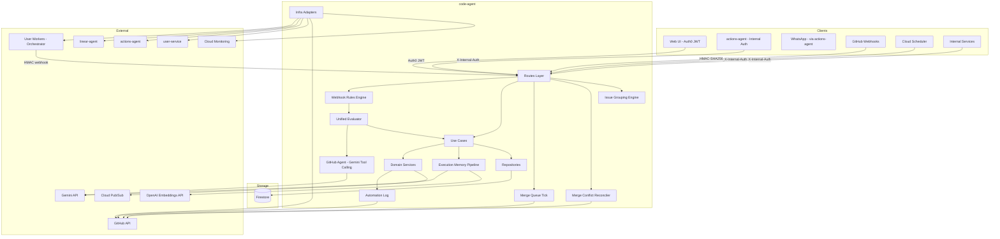

# Code Agent — Technical Reference

## Overview

The code-agent service orchestrates autonomous code execution tasks. It accepts task submissions from the web UI (Auth0 JWT), the actions-agent (internal auth), and other internal services (internal auth), sanitizes prompts through two layers (secret redaction and injection prevention), creates Firestore documents with four-layer deduplication, dispatches HMAC-signed requests to user-configured workers via Cloudflare Access, streams log chunks into Firestore subcollections, processes completion webhooks, receives GitHub PR events and evaluates them through a two-tier pipeline (deterministic hard rules then Gemini tool-calling triage), dispatches follow-up instructions or creates new tasks from PR comments, manages automated code reviews with structured output validation, runs autonomous remediation loops for review findings, records all PR automation decisions in a unified log, detects merge conflicts on bot-authored PRs via a dedicated cron job, queues and auto-merges PRs through a merge queue, manages execution memory retrieval and post-run distillation for cross-task learning, provides interactive Ask Agent sessions, groups tasks by Linear issue with server-side aggregation and pagination, auto-archives merged tasks, proxies Linear issue context for the orchestrator, and mirrors state transitions to Linear and the actions-agent.

- **Framework:** Fastify 5 on Node.js 22+
- **Port:** 8128 (local), 8080 (Cloud Run)
- **Package:** `@intexuraos/code-agent`
- **Deploy:** Cloud Run (scale 0-1)

## Architecture



## Data Flow


## Recent Changes

Changes since v3.5.0, sourced from release context and git history:

| Change                                      | Description                                                                                                                                                                                                                                                           | Reference          |
| ------------------------------------------- | --------------------------------------------------------------------------------------------------------------------------------------------------------------------------------------------------------------------------------------------------------------------- | ------------------ |
| Dedicated task status endpoint              | `PATCH /internal/code-tasks/:id/status` — lightweight, idempotent endpoint for the orchestrator to commit terminal task status directly to Firestore before the side-effect-heavy completion webhook fires. Prevents stalled tasks from webhook timeouts.             | INT-1414, PR #1875 |
| PR triage via Pub/Sub push subscription     | PR triage processing moved from inline webhook execution to a Pub/Sub push subscription (`POST /internal/code/pubsub/pr-triage`). The webhook publishes a `PRTriageEvent` and returns immediately; triage runs asynchronously through the push handler.               | INT-1406, PR #1864 |
| Important flag for issue groups             | `POST /code/issue-groups/:groupKey/important` — users mark issue groups as high-priority via the `isImportant` field on `TaskGroupSummary`.                                                                                                                           | INT-1383, PR #1830 |
| GitHub Agent inherits user LLM settings     | `resolveToolCallingClient` replaced the static `toolCallingClient` with per-user resolution. Tries the user's own Google API key first, falls back to the platform key. Ensures the GitHub Agent triage pipeline uses the user's configured LLM provider.             | INT-1389, PR #1835 |
| Task mode selector (planning/execution)     | `POST /code/submit` accepts optional `taskMode` parameter (`'planning'` or `'execution'`), letting users explicitly choose between the design-first workflow and direct implementation.                                                                               | INT-1360, PR #1788 |
| Block code tasks on draft PRs               | `DraftPRRule` added to the webhook rules chain. When `isDraft` is `true`, all code tasks are blocked — preventing wasted compute on work-in-progress branches. The `isDraft` field was added to the domain model and parsers.                                         | INT-1345, PR #1792 |
| Suppress merge step for closed/merged PRs   | The task pipeline no longer attempts the merge step when the PR is already closed or merged, avoiding unnecessary GitHub API calls and confusing error messages.                                                                                                      | INT-1380, PR #1833 |
| Self-healing failure triage                 | `triageFailedTask` classifies failures and auto-retries tasks up to 3 times, excluding the failed worker location on each retry. Tasks failing with `TASK_EXIT_CODE_OVERRIDE` trigger automatic retry on a different worker.                                          | INT-1375, PR #1855 |
| Inactivity-restart wrong-PR bug fix         | Fixed a bug where inactivity restarts dispatched to the wrong PR. Added PR URL validation (`prUrlValidationFailed`, `prUrlValidationErrors` fields) and kill-time forensics logging.                                                                                  | INT-1361, PR #1787 |
| Usage webhook gateway v2 alignment          | Migrated usage-webhook gateway and client types to the v2 schema for consistency with `llm-usage-service`.                                                                                                                                                            | INT-1378, PR #1857 |
| Zombie sweep scheduling                     | Zombie detection now runs every 5 minutes via Cloud Scheduler instead of relying solely on on-demand detection, using unified `detectZombieTasks` logic querying `lastHeartbeat`.                                                                                     | Various            |
| WhatsApp notification importance            | Resumed-task-complete and other key notifications marked as important for priority delivery.                                                                                                                                                                          | INT-1418           |

### Changes from v3.4.0 to v3.5.0 (Previous)

| Change                                    | Description                                                                                                                                                                                                                                                                   | Reference                                                                                |
| ----------------------------------------- | ----------------------------------------------------------------------------------------------------------------------------------------------------------------------------------------------------------------------------------------------------------------------------- | ---------------------------------------------------------------------------------------- |
| Execution Memory Graph (alpha)            | Data collection pipeline with vector retrieval (OpenAI embeddings) and post-run distillation (Gemini). Memories scored, fingerprinted, and deduplicated. Query normalization, reranking, and application tracking. Feature-flagged via `INTEXURAOS_EXECUTION_MEMORY_ENABLED`. | INT-1098, INT-1257, INT-1268, INT-1271, INT-1272, INT-1275, INT-1302, INT-1309           |
| Remediation Agent & Review Loop           | Autonomous remediation tasks created from review findings. Cross-LLM verification, event-sourced plan/implementation improvements. `onReviewSkipped` callback sets `ready-to-merge` label. PR evidence enforced for all task types.                                           | INT-1087, INT-1103, INT-1116, INT-1119, INT-1130, INT-1132, INT-1139, INT-1279, INT-1292 |
| Ask Agent                                 | Interactive Claude Code sessions from the web UI. `POST /code/ask-agent/start` and `GET /code/ask-agent/active` endpoints. Uses `ask_agent` agent type, opus model. Filtered from task list and issue group endpoints.                                                        | INT-1291, INT-1293, INT-1294, INT-1295, INT-1299, INT-1308                               |
| Code Tasks Pagination & Group Aggregation | Server-side issue grouping via `GET /code/issue-groups`. `TaskGroupSummary` and `UserGroupCounts` Firestore collections for precomputed aggregation. Cursor pagination, multi-status filtering, sort by linear-id/pr-number/dispatched/last-updated.                          | INT-1173, INT-1184, INT-1187, INT-1202, INT-1217, INT-1238, INT-1239, INT-1241           |
| Batch Archive & V3 Loading UX             | Archive multiple groups at once. Improved loading states for the grouped task view.                                                                                                                                                                                           | INT-1166, INT-1175, INT-1176, INT-1181, INT-1182, INT-1218                               |
| Auto-Archive Merged Tasks                 | Daily cron archives tasks whose PRs were merged 7+ days ago. `prMergedAt` field set by `handlePrClose` webhook. `POST /internal/auto-archive-merged-tasks` endpoint.                                                                                                          | INT-1276                                                                                 |
| Internal Code Submit                      | `POST /internal/code/submit` endpoint for internal task creation on behalf of a user.                                                                                                                                                                                         | INT-1287                                                                                 |
| Review-Outcome Merge Labels               | Merge labels set based on review outcomes. Merge button pipeline wired through unified evaluator.                                                                                                                                                                             | INT-1132, INT-1167                                                                       |
| CI Failure Auto-Handling                  | Failed CI checks on agent PRs detected and retried or escalated via the webhook pipeline.                                                                                                                                                                                     | INT-853                                                                                  |
| Per-Agent-Type Worker Settings            | Different agent types independently tuned for worker type and performance.                                                                                                                                                                                                    | INT-1124                                                                                 |

## API Endpoints

### Public Endpoints (Auth0 JWT)

| Method   | Path                                               | Purpose                                              |
| -------- | -------------------------------------------------- | ---------------------------------------------------- |
| `POST`   | `/code/submit`                                     | Submit a new code task                               |
| `POST`   | `/code/ask-agent/start`                            | Start an interactive Ask Agent session               |
| `GET`    | `/code/ask-agent/active`                           | Get user's active Ask Agent conversation             |
| `GET`    | `/code/tasks`                                      | List tasks (cursor pagination, multi-status filter)  |
| `GET`    | `/code/tasks/:taskId`                              | Get a single task with full detail                   |
| `DELETE` | `/code/tasks/:taskId`                              | Delete a task                                        |
| `POST`   | `/code/tasks/:taskId/archive`                      | Archive a task                                       |
| `POST`   | `/code/tasks/:taskId/feedback`                     | Submit follow-up feedback on a completed task        |
| `POST`   | `/code/tasks/:taskId/implement`                    | Start execution agent from a completed planning task |
| `POST`   | `/code/tasks/:taskId/messages`                     | Send mid-task message or resume ended task           |
| `POST`   | `/code/cancel`                                     | Cancel a running or dispatched task                  |
| `POST`   | `/code/retry`                                      | Retry a failed, cancelled, or interrupted task       |
| `GET`    | `/code/queue`                                      | Get task queue status                                |
| `GET`    | `/code/issue-groups`                               | List issue groups with aggregated status (paginated) |
| `POST`   | `/code/issue-groups/:groupKey/important`           | Toggle important flag on an issue group              |
| `GET`    | `/code/workers/status`                             | Get worker health status                             |
| `POST`   | `/code/workers/refresh-status`                     | Refresh worker health status synchronously           |
| `GET`    | `/code/worker-settings`                            | Get user's worker settings (secrets masked)          |
| `POST`   | `/code/worker-settings/workers`                    | Add a new worker                                     |
| `PATCH`  | `/code/worker-settings/workers/:name`              | Update worker configuration                          |
| `DELETE` | `/code/worker-settings/workers/:name`              | Delete a worker                                      |
| `POST`   | `/code/worker-settings/workers/:name/test`         | Test worker connectivity                             |
| `PUT`    | `/code/worker-settings/priority`                   | Reorder workers by priority                          |
| `PATCH`  | `/code/worker-settings/default-review-worker-type` | Set default review worker type                       |
| `GET`    | `/code/github-pr-summaries`                        | List PR summaries (30-day window)                    |
| `GET`    | `/code/github-pr-events`                           | List GitHub PR events timeline                       |
| `GET`    | `/code/github-event-log`                           | List GitHub event decision log (paginated)           |
| `GET`    | `/code/github-event-log/:id/payload`               | Get raw webhook payload for a specific event         |
| `POST`   | `/code/github-event-log/rows`                      | Hydrate event log rows with audit + decision detail  |
| `POST`   | `/code/merge-queue/watch`                          | Create a new merge queue watch                       |
| `DELETE` | `/code/merge-queue/watch/:watchId`                 | Cancel a merge queue watch                           |
| `PUT`    | `/code/merge-queue/watch/:watchId/exclusions`      | Set excluded PRs for a watch                         |
| `GET`    | `/code/merge-queue/watches`                        | List active merge queue watches                      |
| `GET`    | `/code/merge-queue/branches`                       | List available branches for merge queue              |
| `GET`    | `/code/merge-queue/prs`                            | List PRs eligible for merge queue                    |

### Internal Endpoints (X-Internal-Auth)

| Method  | Path                                                | Purpose                                    | Caller            |
| ------- | --------------------------------------------------- | ------------------------------------------ | ----------------- |
| `POST`  | `/internal/code/process`                            | Submit task from actions-agent             | actions-agent     |
| `POST`  | `/internal/code/submit`                             | Create task on behalf of a user            | Internal services |
| `PATCH` | `/internal/code-tasks/:taskId`                      | Worker callback — update task state        | Orchestrator      |
| `PATCH` | `/internal/code-tasks/:id/status`                   | Commit terminal task status (idempotent)   | Orchestrator      |
| `GET`   | `/internal/code-tasks/linear/:linearIssueId/active` | Check for active blocking task             | linear-agent      |
| `GET`   | `/internal/code-tasks/zombies`                      | Detect zombie (stale) tasks                | Cloud Scheduler   |
| `POST`  | `/internal/code/heartbeat`                          | Process heartbeat from orchestrator        | Orchestrator      |
| `POST`  | `/internal/code/detect-zombies`                     | Cron endpoint for zombie detection         | Cloud Scheduler   |
| `POST`  | `/internal/code/cancel-with-nonce`                  | Cancel task via WhatsApp button            | whatsapp-service  |
| `POST`  | `/internal/code/submit-phase2`                      | Submit Phase 2 from WhatsApp button        | whatsapp-service  |
| `POST`  | `/internal/tasks/cleanup-logs`                      | Cleanup old task logs (cron)               | Cloud Scheduler   |
| `POST`  | `/internal/drain-queue`                             | Drain task queue and retry queue (cron)    | Cloud Scheduler   |
| `POST`  | `/internal/archive-stale-groups`                    | Archive stale issue groups (hourly cron)   | Cloud Scheduler   |
| `POST`  | `/internal/auto-archive-merged-tasks`               | Archive tasks with merged PRs (daily cron) | Cloud Scheduler   |
| `POST`  | `/internal/execution-memory/process`                | Process execution memory backlog (cron)    | Cloud Scheduler   |
| `GET`   | `/internal/tasks/:taskId/dispatch-metadata`         | Get task dispatch metadata (fallback)      | Orchestrator      |
| `POST`  | `/internal/logs`                                    | Receive log chunks during task execution   | Orchestrator      |
| `POST`  | `/internal/turn-metrics`                            | Receive per-turn resource metrics          | Orchestrator      |
| `POST`  | `/internal/webhooks/task-complete`                  | Task completion webhook (HMAC signed)      | Orchestrator      |
| `POST`  | `/internal/webhooks/task-event`                     | Task lifecycle event webhook (HMAC signed) | Orchestrator      |
| `POST`  | `/internal/webhooks/compliance-report`              | Compliance report webhook (HMAC signed)    | Orchestrator      |
| `POST`  | `/internal/code/pubsub/pr-triage`                   | Pub/Sub push handler for PR triage events  | Cloud Pub/Sub     |
| `POST`  | `/internal/merge-conflicts/reconcile`               | Sync Firestore PR state from GitHub (cron) | Cloud Scheduler   |
| `POST`  | `/internal/merge-queue/tick`                        | Process one merge cycle for active watches | Cloud Scheduler   |
| `GET`   | `/internal/linear/issue-context/:identifier`        | Proxy issue context from linear-agent      | Orchestrator      |

### GitHub Webhook Endpoint

| Method | Path               | Purpose                              | Auth               |
| ------ | ------------------ | ------------------------------------ | ------------------ |
| `POST` | `/webhooks/github` | Receive GitHub PR/push/review events | GitHub HMAC-SHA256 |

## Domain Model

### CodeTask

| Field                    | Type                      | Description                                                                       |
| ------------------------ | ------------------------- | --------------------------------------------------------------------------------- |
| `id`                     | `string`                  | Auto-generated UUID                                                               |
| `traceId`                | `string`                  | End-to-end correlation ID                                                         |
| `userId`                 | `string`                  | Auth0 user ID                                                                     |
| `status`                 | `TaskStatus`              | Current lifecycle state                                                           |
| `agentType`              | `AgentType?`              | planning, execution, pull_request, review, remediation, or ask_agent              |
| `prompt`                 | `string`                  | Original user request                                                             |
| `sanitizedPrompt`        | `string`                  | After secret redaction and injection sanitization                                 |
| `systemPromptHash`       | `string`                  | SHA-256 of system prompt (audit trail)                                            |
| `repository`             | `string`                  | e.g., `pbuchman/intexuraos`                                                       |
| `baseBranch`             | `string`                  | e.g., `development`                                                               |
| `workerType`             | `WorkerType`              | Model selection                                                                   |
| `workerLocation`         | `string`                  | User-defined worker name (e.g., `home-mac`)                                       |
| `linearIssueId`          | `string?`                 | Linked Linear issue ID                                                            |
| `prNumber`               | `number?`                 | GitHub PR number on completion                                                    |
| `prBranch`               | `string?`                 | Git branch name                                                                   |
| `prMergedAt`             | `Timestamp?`              | When the PR was merged (set by handlePrClose webhook)                             |
| `parentTaskId`           | `string?`                 | ID of parent task if this is a follow-up                                          |
| `followUpReason`         | `string?`                 | pr_comment, user_feedback, retry, execution_implement, ci_failure, merge_conflict |
| `implementationTaskId`   | `string?`                 | Execution task ID (set by planning task)                                          |
| `fanOutChildTaskIds`     | `string[]?`               | Child task IDs for fan-out operations                                             |
| `retriedFrom`            | `string?`                 | Original task ID if this is a retry                                               |
| `result`                 | `TaskResult?`             | Populated on successful completion                                                |
| `error`                  | `TaskError?`              | Populated on failure                                                              |
| `dedupKey`               | `string`                  | sha256(userId + prompt)[0:16]                                                     |
| `cancelNonce`            | `string?`                 | 4-char hex nonce for WhatsApp cancel button                                       |
| `lastHeartbeat`          | `Timestamp?`              | Last heartbeat from orchestrator (zombie detection)                               |
| `statusSummary`          | `StatusSummary?`          | UI display fallback when logs unavailable                                         |
| `pendingUserMessages`    | `string[]?`               | Mid-task messages queued for next turn                                            |
| `callbackReceived`       | `boolean`                 | True after completion webhook received                                            |
| `executionMemoryContext` | `ExecutionMemoryContext?` | Pre-run memory retrieval context                                                  |
| `executionMemoryPostRun` | `ExecutionMemoryPostRun?` | Post-run distillation state                                                       |
| `requiresReReview`       | `boolean?`                | Set by remediation tasks before pushing code                                      |
| `reviewTypes`            | `string[]?`               | Review types requested                                                            |
| `prUrlValidationFailed`  | `boolean?`                | True if PR URL validation found issues (INT-1361)                                 |
| `prUrlValidationErrors`  | `string[]?`               | Validation error details (INT-1361)                                               |
| `failedWorkerLocation`   | `string?`                 | Worker location that failed, excluded on retry dispatch                           |
| `autoRetryAttempt`       | `number?`                 | 1-based auto-retry attempt number (max 3)                                         |
| `createdAt`              | `Timestamp`               | Creation timestamp                                                                |
| `updatedAt`              | `Timestamp`               | Last update (used in zombie detection queries)                                    |

**TaskStatus Values:**

| Status        | Meaning                                             |
| ------------- | --------------------------------------------------- |
| `queued`      | Waiting for worker capacity                         |
| `dispatched`  | Sent to worker, awaiting start confirmation         |
| `running`     | Worker actively processing                          |
| `planned`     | Planning Agent task completed successfully          |
| `implemented` | Execution Agent task completed successfully         |
| `reviewed`    | Review Agent task completed successfully            |
| `failed`      | Error occurred                                      |
| `interrupted` | Worker died unexpectedly (zombie detection trigger) |
| `cancelled`   | User cancelled                                      |
| `archived`    | Original task archived after retry                  |

**AgentType Values:**

| AgentType      | Meaning                                      |
| -------------- | -------------------------------------------- |
| `planning`     | Produces design + Linear issue, no code      |
| `execution`    | Writes code, runs tests, opens PR            |
| `pull_request` | Handles PR comment follow-up                 |
| `review`       | Performs code review and posts comments      |
| `remediation`  | Fixes review findings autonomously           |
| `ask_agent`    | Interactive Claude Code conversation session |

### ExecutionMemory

| Field                    | Type                    | Description                         |
| ------------------------ | ----------------------- | ----------------------------------- |
| `id`                     | `string`                | Auto-generated UUID                 |
| `repository`             | `string`                | Repository scope                    |
| `sourceTaskId`           | `string`                | Task that generated this memory     |
| `sourceAgentType`        | `string?`               | execution, planning, or review      |
| `memoryType`             | `ExecutionMemoryType`   | Pattern category                    |
| `title`                  | `string`                | Human-readable title                |
| `appliesWhen`            | `string`                | Conditions for applicability        |
| `action`                 | `string`                | What to do                          |
| `avoid`                  | `string`                | What to avoid                       |
| `verification`           | `string`                | How to verify                       |
| `evidenceSummary`        | `string`                | Evidence from source task           |
| `retrievalText`          | `string`                | Concatenated text for embedding     |
| `keywords`               | `string[]`              | Search keywords                     |
| `componentHints`         | `string[]`              | Component-level hints for relevance |
| `embeddingModel`         | `string`                | `text-embedding-3-small`            |
| `fingerprint`            | `string`                | Deduplication hash                  |
| `qualityScore`           | `number`                | 0-1 quality assessment              |
| `distillationConfidence` | `number`                | 0-1 confidence from distiller       |
| `applicationCount`       | `number`                | Times applied                       |
| `positiveCount`          | `number`                | Positive feedback count             |
| `negativeCount`          | `number`                | Negative feedback count             |
| `status`                 | `ExecutionMemoryStatus` | active or suppressed                |

**ExecutionMemoryType Values:**

| Type                     | Meaning                          |
| ------------------------ | -------------------------------- |
| `implementation_pattern` | Reusable implementation approach |
| `verification_pattern`   | Testing or verification strategy |
| `pitfall_pattern`        | Common mistake to avoid          |
| `decomposition_pattern`  | Task decomposition strategy      |
| `planning_decision`      | Planning-phase decision          |
| `review_finding`         | Review feedback pattern          |

### TaskGroupSummary

| Field                         | Type          | Description                                               |
| ----------------------------- | ------------- | --------------------------------------------------------- |
| `userId`                      | `string`      | Auth0 user ID                                             |
| `linearIssueId`               | `string?`     | Linear issue grouping key                                 |
| `groupKey`                    | `string`      | linearIssueId or `standalone_{taskId}`                    |
| `taskCount`                   | `number`      | Total tasks in group                                      |
| `activeTaskCount`             | `number`      | Tasks in queued/dispatched/running                        |
| `latestTaskStatus`            | `string`      | Most recent task status                                   |
| `aggregateStatus`             | `GroupStatus` | Precomputed: active, needs-action, done, failed, archived |
| `hasCompletedPlanning`        | `boolean`     | Planning phase completed                                  |
| `hasCompletedExecution`       | `boolean`     | Execution phase completed                                 |
| `hasPrUrl`                    | `boolean`     | At least one task has a PR                                |
| `prNumber`                    | `number?`     | Latest PR number                                          |
| `hasImplementationReadyLabel` | `boolean?`    | Linear issue has implementation-ready label               |
| `hasMergeReadyLabel`          | `boolean?`    | Linear issue has ready-to-merge label                     |

### MergeQueueWatch

| Field            | Type                    | Description                               |
| ---------------- | ----------------------- | ----------------------------------------- |
| `id`             | `string`                | Auto-generated UUID                       |
| `userId`         | `string`                | Auth0 user ID                             |
| `gitHubUsername` | `string`                | Resolved GitHub username                  |
| `owner`          | `string`                | Repository owner                          |
| `repo`           | `string`                | Repository name                           |
| `baseBranch`     | `string`                | Target branch (e.g., `development`)       |
| `status`         | `MergeQueueWatchStatus` | active, drained, or cancelled             |
| `mergedPrs`      | `MergedPr[]`            | PRs successfully merged during this watch |
| `skippedPrs`     | `SkippedPr[]`           | PRs skipped with reason                   |

### WorkerConfig

| Field                   | Type      | Description                                          |
| ----------------------- | --------- | ---------------------------------------------------- |
| `name`                  | `string`  | User-defined (3-32 chars, lowercase, hyphens)        |
| `url`                   | `string`  | Orchestrator URL (e.g., `https://mac.example.com`)   |
| `cfAccessClientId`      | `string`  | Cloudflare Access client ID (encrypted at rest)      |
| `cfAccessClientSecret`  | `string`  | Cloudflare Access client secret (encrypted at rest)  |
| `dispatchSigningSecret` | `string`  | HMAC secret — must match `DISPATCH_SECRET` on worker |
| `enabled`               | `boolean` | Whether worker is eligible for dispatch              |

## Pub/Sub

### Published Events

| Topic env var                            | When                                          | Payload                               |
| ---------------------------------------- | --------------------------------------------- | ------------------------------------- |
| `INTEXURAOS_PUBSUB_WHATSAPP_SEND_TOPIC`  | Task started, completed, or failed            | WhatsApp message with CTA URL buttons |
| `INTEXURAOS_PUBSUB_PR_TRIAGE_TOPIC`      | GitHub webhook receives actionable PR event   | PR triage event (push subscription)   |

### Subscribed Events

| Topic env var                            | Handler                                | Action                                  |
| ---------------------------------------- | -------------------------------------- | --------------------------------------- |
| `INTEXURAOS_PUBSUB_PR_TRIAGE_TOPIC`      | `POST /internal/code/pubsub/pr-triage` | Evaluate PR event via unified evaluator |

## Firestore Collections

| Collection                      | Owner      | Description                                               |
| ------------------------------- | ---------- | --------------------------------------------------------- |
| `code_tasks`                    | code-agent | Primary task documents                                    |
| `code_tasks/{id}/logs`          | code-agent | Log chunk subcollection                                   |
| `code_tasks/{id}/log_lines`     | code-agent | Individual log lines                                      |
| `code_tasks/{id}/log_entries`   | code-agent | Log entry subcollection                                   |
| `code_tasks/{id}/turn_metrics`  | code-agent | Per-turn resource metrics                                 |
| `user_spend`                    | code-agent | Per-user cost tracking                                    |
| `code_worker_settings`          | code-agent | Per-user worker configurations (encrypted secrets)        |
| `github-pr-events`              | code-agent | GitHub webhook event history                              |
| `github-pr-summaries`           | code-agent | PR list view cache (30-day window)                        |
| `pr_task_locks`                 | code-agent | Optimistic lock for PR-task creation                      |
| `event_decisions`               | code-agent | LLM triage decisions (reasoning, tool calls, cost)        |
| `dispatch_retries`              | code-agent | Failed webhook dispatch retry queue                       |
| `github-webhook-audit-events`   | code-agent | Raw GitHub webhook payloads for audit                     |
| `github-event-log-entries`      | code-agent | Decision log entries for UI display                       |
| `pr_automation_comments`        | code-agent | Cached automation log comment IDs per PR                  |
| `merge_queue_watches`           | code-agent | Merge queue watch state and history                       |
| `task_group_summaries`          | code-agent | Precomputed group aggregation per (userId, linearIssueId) |
| `user_group_counts`             | code-agent | Per-user group status counts for filter badges            |
| `execution_memories`            | code-agent | Distilled execution memories with embeddings              |
| `execution_memory_applications` | code-agent | Memory retrieval and application tracking                 |

## Dependencies

### Internal Services

| Service       | Endpoint                                      | Purpose                           |
| ------------- | --------------------------------------------- | --------------------------------- |
| linear-agent  | `POST /internal/linear/issues`                | Create Linear issue               |
| linear-agent  | `PATCH /internal/linear/issues/:id/state`     | Transition Linear issue state     |
| linear-agent  | `POST /internal/linear/issues/validate`       | Validate issue exists             |
| linear-agent  | `POST /internal/linear/issues/generate-title` | LLM-generated issue title         |
| linear-agent  | `POST /internal/linear/issues/:id/comments`   | Add comment to issue              |
| linear-agent  | Various fetch endpoints                       | Issue tree, display data, context |
| actions-agent | `PATCH /internal/actions/:id/status`          | Mirror action completion status   |
| user-service  | `GET /internal/users/oauth-token`             | Resolve GitHub OAuth token        |
| user-service  | `GET /internal/users/by-github-username`      | Resolve GitHub username to userId |

### External Services

| Service          | Purpose                                                                                | Failure Mode                                             |
| ---------------- | -------------------------------------------------------------------------------------- | -------------------------------------------------------- |
| Orchestrator     | Run code tasks in isolated environment                                                 | Task fails with dispatch error                           |
| GitHub API       | PR title updates, file reads, comment posting, mergeability checks, merge execution    | Automation log falls back to skip                        |
| Gemini API       | Tool-calling triage for GitHub PR events; execution memory distillation and evaluation | Falls back to direct dispatch / memory pipeline skipped  |
| OpenAI API       | Text embeddings for execution memory retrieval (`text-embedding-3-small`)              | Memory retrieval skipped, task proceeds without memories |
| Cloud Pub/Sub    | WhatsApp notification delivery                                                         | Notification skipped, task proceeds                      |
| Cloud Monitoring | Metrics emission for tasks/cost/duration                                               | No-op if unavailable                                     |

## Configuration

| Variable                                | Purpose                                                     | Required                    |
| --------------------------------------- | ----------------------------------------------------------- | --------------------------- |
| `INTEXURAOS_GCP_PROJECT_ID`             | GCP project for Firestore and Pub/Sub                       | Yes                         |
| `INTEXURAOS_INTERNAL_AUTH_TOKEN`        | Shared secret for internal endpoints                        | Yes                         |
| `INTEXURAOS_WEBHOOK_VERIFY_SECRET`      | HMAC secret for log chunk validation from orchestrator      | Yes                         |
| `INTEXURAOS_TOKEN_ENCRYPTION_KEY`       | AES-256-GCM key for encrypting worker credentials           | Yes (dev fallback)          |
| `INTEXURAOS_ORCHESTRATOR_SECRET`        | HMAC secret for task dispatch and webhook signatures        | Yes                         |
| `INTEXURAOS_GITHUB_WEBHOOK_SECRET`      | GitHub webhook signature verification secret                | Yes                         |
| `INTEXURAOS_SERVICE_URL`                | Callback URL — orchestrator reports task status here        | Yes                         |
| `INTEXURAOS_WHATSAPP_SERVICE_URL`       | WhatsApp service URL                                        | Production                  |
| `INTEXURAOS_PUBSUB_WHATSAPP_SEND_TOPIC` | Pub/Sub topic for WhatsApp send messages                    | Production                  |
| `INTEXURAOS_PUBSUB_PR_TRIAGE_TOPIC`     | Pub/Sub topic for PR triage push subscription               | Production                  |
| `INTEXURAOS_LINEAR_AGENT_URL`           | linear-agent base URL                                       | Production                  |
| `INTEXURAOS_ACTIONS_AGENT_URL`          | actions-agent base URL                                      | Production                  |
| `INTEXURAOS_USER_SERVICE_URL`           | user-service base URL                                       | Production                  |
| `INTEXURAOS_GEMINI_APP_API_KEY`         | Gemini API key for GitHub Agent triage and execution memory | Production                  |
| `INTEXURAOS_OPENAI_APP_API_KEY`         | OpenAI API key for execution memory embeddings              | Production                  |
| `INTEXURAOS_EXECUTION_MEMORY_ENABLED`   | Feature flag for execution memory retrieval/distillation    | Production                  |
| `INTEXURAOS_AUTH_AUDIENCE`              | Auth0 JWT audience                                          | Production                  |
| `INTEXURAOS_AUTH_ISSUER`                | Auth0 JWT issuer                                            | Production                  |
| `INTEXURAOS_AUTH_JWKS_URL`              | Auth0 JWKS endpoint                                         | Production                  |
| `INTEXURAOS_WEB_URL`                    | Web app URL for task links in notifications                 | Optional (has default)      |
| `INTEXURAOS_SENTRY_DSN`                 | Sentry error tracking DSN                                   | Optional                    |
| `INTEXURAOS_ENABLE_METRICS`             | Enable Cloud Monitoring metrics                             | Optional                    |
| `E2E_MODE`                              | Enable E2E mode with mocked external services               | Optional                    |
| `INTEXURAOS_QUEUE_MAX_SIZE`             | Maximum queued tasks (default: 50)                          | Optional (defaults to 50)   |
| `INTEXURAOS_QUEUE_TTL_MINUTES`          | Queue task TTL in minutes (default: 1440)                   | Optional (defaults to 1440) |
| `INTEXURAOS_RETRY_QUEUE_MAX_ATTEMPTS`   | Max retry attempts (default: 3)                             | Optional (defaults to 3)    |
| `INTEXURAOS_RETRY_QUEUE_TTL_MINUTES`    | Retry queue TTL in minutes (default: 10)                    | Optional (defaults to 10)   |

## Gotchas

- **Tasks finish as `planned`, `implemented`, or `reviewed` — never `completed`.** Code that checks `status === 'completed'` will never match. Terminal success statuses are agent-type-specific.
- **`queued` status means waiting for worker capacity, not Pub/Sub.** The task queue is Firestore-backed, drained by Cloud Scheduler (`POST /internal/drain-queue`).
- **Review tasks now queue when workers are at capacity.** Previously review tasks failed immediately if no worker was available. The queue TTL applies equally.
- **Ask Agent tasks are excluded from task list and issue group endpoints.** Tasks with `agentType: 'ask_agent'` are filtered out of `GET /code/tasks` and `GET /code/issue-groups`. Use `GET /code/ask-agent/active` to retrieve them.
- **Worker credentials are encrypted in Firestore** using AES-256-GCM with `INTEXURAOS_TOKEN_ENCRYPTION_KEY`. API responses mask secrets to the last 3 characters.
- **Four deduplication layers run on every submission.** A 409 Conflict response means one of these fired: approvalEventId replay, actionId Pub/Sub retry, dedupKey (same prompt within the window), or active task on the same Linear issue.
- **Dispatch is optimistic.** Tasks are created with `queued` status first; `dispatched` status is only written after the worker ACKs the request. This prevents phantom `dispatched` tasks on restart.
- **The `INTEXURAOS_ORCHESTRATOR_SECRET` must match on both sides.** It signs task dispatch requests (outbound) and validates completion webhooks (inbound). A mismatch causes 401 on webhooks and dispatch failures.
- **GitHub Agent triage only activates when `INTEXURAOS_GEMINI_APP_API_KEY` is set** and non-empty. Without it, the `toolCallingClient` is `undefined` and `evaluateEvent` is bypassed — all events go through hard rules only.
- **Execution memory requires both `INTEXURAOS_GEMINI_APP_API_KEY` and `INTEXURAOS_OPENAI_APP_API_KEY`** plus `INTEXURAOS_EXECUTION_MEMORY_ENABLED=true`. Without all three, memory retrieval and distillation are silently skipped.
- **The automation log is a single append-only GitHub PR comment.** The `pr_automation_comments` collection caches the comment ID per PR to enable updates. If the comment is deleted externally, the next event creates a new one.
- **ESLint is disabled at the file level** in `codeRoutes.ts` and `webhookRoutes.ts`. Type safety rules are not enforced in these files.
- **Drain queue guards use module-level booleans.** The `isDraining` / `isDrainingRetries` flags work for single-instance deployment (Cloud Run scale 0-1) but would race with multiple instances.
- **The `main` branch is blocked as a merge queue base branch.** The `BLOCKED_BASE_BRANCHES` set in `mergeQueueRoutes.ts` prevents creating merge queue watches targeting `main`. The branch still appears in the branch list with a `blocked` flag for visibility.
- **Merge conflict reconciliation runs as a separate cron job.** The `POST /internal/merge-conflicts/reconcile` endpoint is triggered by Cloud Scheduler, not by webhooks. It skips closed PRs and refreshes `mergeConflictStatus` only for open PRs.
- **Merge queue tick processes one PR per watch per tick.** Each Cloud Scheduler invocation of `POST /internal/merge-queue/tick` attempts to merge the oldest eligible PR for each active watch. If the PR's CI is still pending, it is skipped until the next tick.
- **GitHub event log filters to visible event types server-side.** Only `pull_request`, `pull_request_review`, `pull_request_review_comment`, `issue_comment`, and `push` events appear in the log.
- **Remediation tasks use `agentType: 'remediation'`** and push to the existing PR branch. Multiple remediation tasks can coexist (no dedup like review tasks).
- **Group summary recomputation is incremental.** The `withGroupUpdates` repository decorator updates `task_group_summaries` on every task state change. Stale summaries are reconciled by the hourly archive cron.
- **`onReviewSkipped` sets the `ready-to-merge` label.** When LLM triage skips a review (e.g., documentation-only change), the callback sets the label on the Linear issue and recomputes the group summary. Only fires for execution-origin tasks, not planning.
- **PR triage runs asynchronously via Pub/Sub push.** The GitHub webhook handler publishes a `PRTriageEvent` to `INTEXURAOS_PUBSUB_PR_TRIAGE_TOPIC` and returns 200 immediately. The push subscription delivers the event to `POST /internal/code/pubsub/pr-triage` for evaluation. This decouples webhook response time from triage compute.
- **The status endpoint (`PATCH /internal/code-tasks/:id/status`) is idempotent.** If the task is already in a terminal state, it returns 200 no-op without calling the repository. The orchestrator calls this endpoint before the full completion webhook to ensure terminal status is persisted even if the webhook fails.
- **Draft PRs block all code tasks.** The `DraftPRRule` in the webhook rules chain skips all events where `isDraft === true`. When `isDraft` is `null` (event type does not carry draft info), the rule fails open.
- **`resolveToolCallingClient` is per-user, not static.** The GitHub Agent tries the user's own Google API key first (via `userServiceClient.getApiKeys`), then falls back to the platform `INTEXURAOS_GEMINI_APP_API_KEY`. This means different users can use different Gemini keys for triage.
- **`taskMode` on `/code/submit` is optional.** When omitted, the default behavior applies. Set `'planning'` for design-first or `'execution'` for direct implementation.
- **Auto-retry excludes the failed worker location.** Tasks that fail with `TASK_EXIT_CODE_OVERRIDE` are retried up to 3 times (`autoRetryAttempt`), each time excluding the `failedWorkerLocation` from dispatch.
- **Zombie sweep runs every 5 minutes.** The `POST /internal/code/detect-zombies` endpoint is triggered by Cloud Scheduler on a 5-minute interval, using `lastHeartbeat` field for detection.

## File Structure

```
apps/code-agent/src/
├── domain/
│   ├── constants/
│   │   ├── reviewTypes.ts           — Review type enum
│   │   └── visibleEventTypes.ts     — Event types for UI display
│   ├── issueGrouping/
│   │   ├── index.ts                 — Barrel export
│   │   ├── types.ts                 — GroupStatus, IssueGroup, PipelineState
│   │   ├── constants.ts             — ACTIVE_STATUSES, AGENT_TYPE_LABELS
│   │   ├── groupByLinearIssue.ts    — Group + aggregate status derivation
│   │   ├── sortIssueGroups.ts       — Multi-field sorting
│   │   ├── labelHelpers.ts          — Label normalization + merge readiness
│   │   ├── cursor.ts                — Cursor encode/decode
│   │   └── deriveAggregateStatusFromSummary.ts — Status from precomputed summary
│   ├── models/
│   │   ├── codeTask.ts              — CodeTask, TaskStatus, TaskResult, AgentType
│   │   ├── executionMemory.ts       — ExecutionMemory, ExecutionMemoryType
│   │   ├── executionMemoryApplication.ts — Memory application tracking
│   │   ├── taskGroupSummary.ts      — TaskGroupSummary, UserGroupCounts
│   │   ├── workerSettings.ts        — WorkerConfig, UserWorkerSettings
│   │   ├── mergeQueueWatch.ts       — MergeQueueWatch, SkipReason
│   │   ├── gitHubPREvent.ts         — GitHub PR event types
│   │   ├── gitHubPRSummary.ts       — PR summary cache
│   │   ├── gitHubEventLogEntry.ts   — Event log entry for UI
│   │   ├── gitHubWebhookAuditEvent.ts — Raw webhook payload
│   │   ├── gitHubWebhookTypes.ts    — Webhook event/action enums
│   │   ├── eventDecision.ts         — LLM triage decision record
│   │   ├── dispatchRetry.ts         — Retry queue entry
│   │   ├── turnMetrics.ts           — Per-turn resource metrics
│   │   └── signing.ts              — HMAC signing utilities
│   ├── usecases/
│   │   ├── processCodeAction.ts          — Internal task submission
│   │   ├── submitToExecutionAgent.ts     — Planning -> Execution handoff
│   │   ├── startAskAgent.ts             — Start interactive Ask Agent session
│   │   ├── getActiveAskAgent.ts         — Get active Ask Agent conversation
│   │   ├── createReviewTask.ts           — GitHub-triggered review task
│   │   ├── createRemediationTask.ts     — Autonomous remediation from review
│   │   ├── createTaskForPR.ts            — PR comment without existing task
│   │   ├── sendTaskMessage.ts            — Mid-task message / resume
│   │   ├── retryTask.ts                  — Retry with cool-off
│   │   ├── submitTaskFeedback.ts         — Follow-up on completed task
│   │   ├── detectZombieTasks.ts          — Stale task detection
│   │   ├── processHeartbeat.ts           — Orchestrator heartbeat
│   │   ├── cleanupTaskLogs.ts            — Log retention enforcement
│   │   ├── archiveStaleGroups.ts        — Hourly stale group archival
│   │   ├── autoArchiveMergedTasks.ts    — Daily merged task archival
│   │   ├── drainTaskQueue.ts             — Queue drain with distributed guard
│   │   ├── drainRetryQueue.ts            — Retry queue drain
│   │   ├── githubAgent.ts                — Gemini tool-calling triage
│   │   ├── detectMergeConflictsOnPush.ts — Merge conflict detection + reconcile
│   │   ├── mergeQueueTick.ts             — Merge queue auto-merge tick
│   │   ├── prepareExecutionMemoryContext.ts — Pre-run memory retrieval
│   │   ├── processExecutionMemoryBacklog.ts — Post-run distillation pipeline
│   │   ├── getLinearIssueContext.ts       — Linear issue context proxy
│   │   ├── backLinkPlanningTask.ts       — Link planning -> execution task
│   │   ├── cancelTaskWithNonce.ts        — WhatsApp cancel button
│   │   ├── handlePrClose.ts             — Set prMergedAt on PR close
│   │   ├── fanOutChildTasks.ts           — Fan out child tasks
│   │   ├── autoRetryTask.ts             — Auto-retry on transient failures
│   │   ├── triageFailedTask.ts          — Classify failure + decide retry/escalate
│   │   └── forwardUsageEvents.ts        — Forward usage events to llm-usage-service
│   ├── services/
│   │   ├── unifiedEvaluator.ts           — Two-tier webhook evaluation
│   │   ├── gitHubWebhookRules.ts         — Hard rule chain (6 rules)
│   │   ├── gitHubDispatchService.ts      — Webhook dispatch orchestration
│   │   ├── gitHubMessageBuilder.ts       — PR comment message construction
│   │   ├── onReviewSkippedCallback.ts   — Ready-to-merge label on skip
│   │   ├── unauthorizedSenderCommentHandler.ts — GitHub comment for rejected senders
│   │   ├── linearIssueService.ts         — Linear API abstraction
│   │   ├── rateLimitService.ts           — Concurrent/hourly/cost limits
│   │   ├── taskDispatcher.ts             — Worker dispatch with health check
│   │   ├── taskEnqueueService.ts         — Task queue enrollment
│   │   ├── statusMirrorService.ts        — actions-agent state sync
│   │   ├── mergeConflictDetector.ts      — Merge conflict orchestration (port)
│   │   ├── automationCommentRenderer.ts — PR automation comment formatting
│   │   └── whatsappNotifier.ts           — WhatsApp CTA notifications
│   ├── ports/                            — Repository and service interfaces
│   ├── repositories/                     — Repository interfaces
│   ├── formatters/                       — Metrics log formatting
│   ├── prompts/                          — System prompt templates
│   ├── utils/                            — Shared utilities
│   └── validation/                       — Prompt sanitization
├── infra/
│   ├── repositories/                     — Firestore implementations
│   ├── firestore/                        — Additional Firestore adapters
│   ├── services/                         — Service implementations
│   ├── clients/                          — HTTP clients (actions-agent, GitHub)
│   ├── http/                             — HTTP clients (linear-agent, GitHub PR)
│   ├── auth/                             — Auth0 JWT validator
│   └── migrations/                       — Firestore migration scripts
├── routes/
│   ├── codeRoutes.ts                     — Core code task, ask-agent, and worker routes
│   ├── webhookRoutes.ts                  — Orchestrator webhook endpoints
│   ├── workerSettingsRoutes.ts           — Worker configuration CRUD
│   ├── internalRoutes.ts                 — Cron endpoints + Linear proxy
│   ├── code/
│   │   ├── issueGroupRoutes.ts          — Issue group listing + important flag
│   │   ├── updateTaskStatusRoute.ts     — PATCH /internal/code-tasks/:id/status
│   │   ├── github-event-log.ts           — Event decision log endpoints
│   │   ├── github-pr-summaries.ts        — PR summary list endpoint
│   │   ├── github-pre-events.ts          — PR events timeline endpoint
│   │   ├── extractEventSummary.ts        — Event summary extraction
│   │   └── extractEventUrl.ts            — Event URL extraction
│   ├── merge-queue/
│   │   ├── mergeQueueRoutes.ts           — Merge queue CRUD (JWT)
│   │   ├── mergeQueueTickRoute.ts        — Merge queue tick (internal)
│   │   └── serializeWatch.ts             — Watch serialization utility
│   └── webhooks/
│       ├── github.ts                     — GitHub webhook receiver
│       ├── taskEvent.ts                  — Task lifecycle event webhook
│       ├── complianceReport.ts          — Compliance report webhook
│       └── prTriagePubsubRoute.ts       — Pub/Sub push handler for PR triage
├── scripts/
│   └── backfillGroupSummaries.ts        — One-time backfill for group summaries
├── config.ts
├── services.ts                           — DI container (ServiceContainer)
├── server.ts
└── index.ts
```
