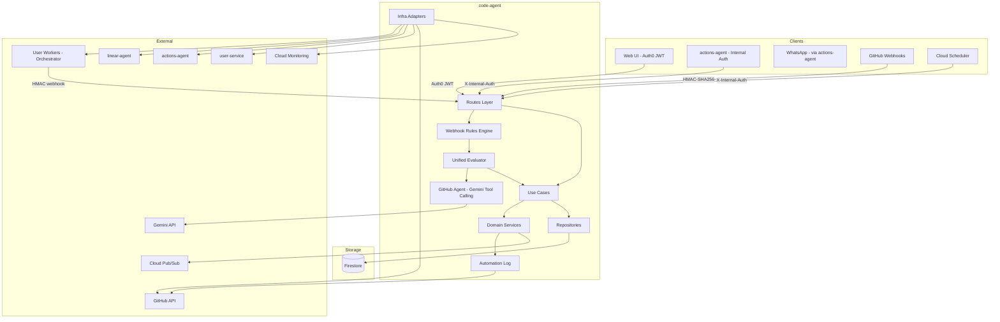
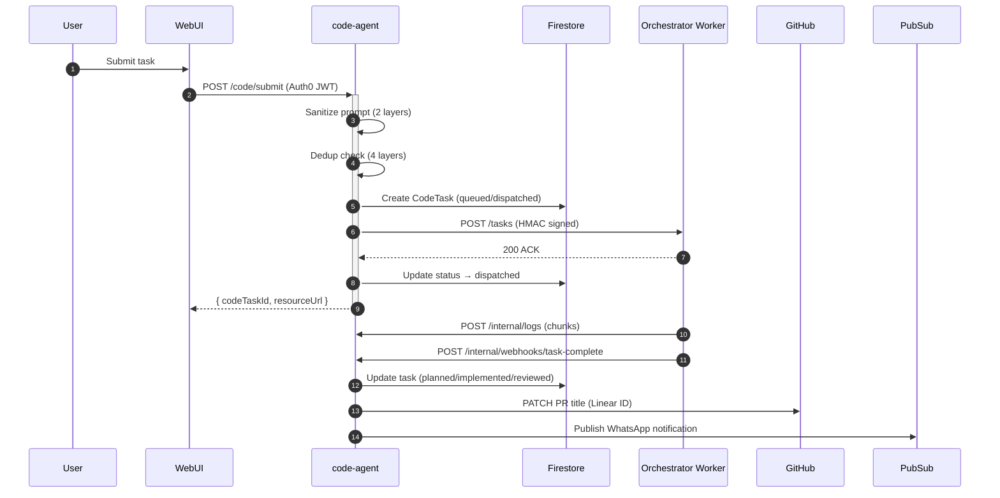

# Code Agent — Technical Reference

## Overview

The code-agent service orchestrates autonomous code execution tasks. It accepts task submissions from the web UI (Auth0 JWT) and the actions-agent (internal auth), sanitizes prompts through two layers (secret redaction and injection prevention), creates Firestore documents with four-layer deduplication, dispatches HMAC-signed requests to user-configured workers via Cloudflare Access, streams log chunks into Firestore subcollections, processes completion webhooks, receives GitHub PR events and evaluates them through a two-tier pipeline (deterministic hard rules then Gemini tool-calling triage), dispatches follow-up instructions or creates new tasks from PR comments, manages automated code reviews with structured output validation, records all PR automation decisions in a unified log, detects merge conflicts on bot-authored PRs, and mirrors state transitions to Linear and the actions-agent.

- **Framework:** Fastify 5 on Node.js 22+
- **Port:** 8128 (local), 8080 (Cloud Run)
- **Package:** `@intexuraos/code-agent`
- **Deploy:** Cloud Run (scale 0-1)

## Architecture



## Data Flow



## Recent Changes

| Commit    | Description                                                          | Date       |
| --------- | -------------------------------------------------------------------- | ---------- |
| `c4e3a13` | Release v3.3.0                                                       | 2026-03-15 |
| `c2cbd6c` | Remove redundant "Automated Code Review Triage Decision" PR comments | 2026-03-15 |
| `f0f5cf3` | Add queue support to review tasks when workers are at capacity       | 2026-03-15 |
| `71ffdad` | [INT-918] Improve PR event log by filtering noise and adding context | 2026-03-15 |
| `b4cfc57` | Fix Gemini tool calling loop and Firestore automation log path       | 2026-03-15 |
| `aec6b89` | [INT-780] Fix v8 coverage gaps by refactoring and adding tests       | 2026-03-15 |
| `7d1a33b` | Merge PR: INT-852 unified PR automation log                          | 2026-03-15 |
| `510a8f8` | Merge PR: automation log flows                                       | 2026-03-15 |

## API Endpoints

### Public Endpoints (Auth0 JWT)

| Method   | Path                                               | Purpose                                              |
| -------- | -------------------------------------------------- | ---------------------------------------------------- |
| `POST`   | `/code/submit`                                     | Submit a new code task                               |
| `GET`    | `/code/tasks`                                      | List tasks (cursor pagination, multi-status filter)  |
| `GET`    | `/code/tasks/:taskId`                              | Get a single task with full detail                   |
| `DELETE` | `/code/tasks/:taskId`                              | Delete a task                                        |
| `POST`   | `/code/tasks/:taskId/feedback`                     | Submit follow-up feedback on a completed task        |
| `POST`   | `/code/tasks/:taskId/implement`                    | Start execution agent from a completed planning task |
| `POST`   | `/code/tasks/:taskId/messages`                     | Send mid-task message or resume ended task           |
| `POST`   | `/code/cancel`                                     | Cancel a running or dispatched task                  |
| `POST`   | `/code/retry`                                      | Retry a failed, cancelled, or interrupted task       |
| `GET`    | `/code/workers/status`                             | Get worker health status                             |
| `POST`   | `/code/workers/refresh-status`                     | Refresh worker health status synchronously           |
| `GET`    | `/code/worker-settings`                            | Get user's worker settings (secrets masked)          |
| `POST`   | `/code/worker-settings/workers`                    | Add a new worker                                     |
| `PATCH`  | `/code/worker-settings/workers/:name`              | Update worker configuration                          |
| `DELETE` | `/code/worker-settings/workers/:name`              | Delete a worker                                      |
| `POST`   | `/code/worker-settings/workers/:name/test`         | Test worker connectivity                             |
| `PUT`    | `/code/worker-settings/priority`                   | Reorder workers by priority                          |
| `PATCH`  | `/code/worker-settings/default-review-worker-type` | Set default review worker type                       |
| `GET`    | `/code/github-pr-summaries`                        | List PR summaries (30-day window)                    |
| `GET`    | `/code/github-pr-events`                           | List GitHub PR events timeline                       |
| `GET`    | `/code/github-event-log`                           | List GitHub event decision log (paginated)           |
| `POST`   | `/code/github-event-log/rows`                      | Hydrate event log rows with audit + decision detail  |

### Internal Endpoints (X-Internal-Auth)

| Method  | Path                                               | Purpose                                       | Caller           |
| ------- | -------------------------------------------------- | --------------------------------------------- | ---------------- |
| `POST`  | `/internal/code/process`                           | Submit task from actions-agent                | actions-agent    |
| `PATCH` | `/internal/code-tasks/:taskId`                     | Worker callback — update task state           | Orchestrator     |
| `GET`   | `/internal/code-tasks/linear:linearIssueId/active` | Check for active blocking task                | linear-agent     |
| `GET`   | `/internal/code-tasks/zombies`                     | Detect zombie (stale) tasks                   | Cloud Scheduler  |
| `POST`  | `/internal/code/heartbeat`                         | Process heartbeat from orchestrator           | Orchestrator     |
| `POST`  | `/internal/code/detect-zombies`                    | Cron endpoint for zombie detection            | Cloud Scheduler  |
| `POST`  | `/internal/code/cancel-with-nonce`                 | Cancel task via WhatsApp button               | whatsapp-service |
| `POST`  | `/internal/code/submit-phase2`                     | Submit Phase 2 from WhatsApp button           | whatsapp-service |
| `POST`  | `/internal/tasks/cleanup-logs`                     | Cleanup old task logs (cron)                  | Cloud Scheduler  |
| `POST`  | `/internal/drain-queue`                            | Drain task queue and retry queue (cron)       | Cloud Scheduler  |
| `POST`  | `/internal/logs`                                   | Receive log chunks during task execution      | Orchestrator     |
| `POST`  | `/internal/turn-metrics`                           | Receive per-turn resource metrics             | Orchestrator     |
| `POST`  | `/internal/webhooks/task-complete`                 | Task completion webhook (HMAC signed)         | Orchestrator     |
| `POST`  | `/internal/webhooks/task-event`                    | Task lifecycle event webhook (HMAC signed)    | Orchestrator     |

### GitHub Webhook Endpoint

| Method | Path               | Purpose                              | Auth               |
| ------ | ------------------ | ------------------------------------ | ------------------ |
| `POST` | `/webhooks/github` | Receive GitHub PR/push/review events | GitHub HMAC-SHA256 |

## Domain Model

### CodeTask

| Field                  | Type                  | Description                                           |
| ---------------------- | --------------------- | ----------------------------------------------------- |
| `id`                   | `string`              | Auto-generated UUID                                   |
| `traceId`              | `string`              | End-to-end correlation ID                             |
| `userId`               | `string`              | Auth0 user ID                                         |
| `status`               | `TaskStatus`          | Current lifecycle state                               |
| `agentType`            | `AgentType?`          | planning, execution, pull_request, or review          |
| `prompt`               | `string`              | Original user request                                 |
| `sanitizedPrompt`      | `string`              | After secret redaction and injection sanitization     |
| `systemPromptHash`     | `string`              | SHA-256 of system prompt (audit trail)                |
| `repository`           | `string`              | e.g., `pbuchman/intexuraos`                           |
| `baseBranch`           | `string`              | e.g., `development`                                   |
| `workerType`           | `WorkerType`          | Model selection                                       |
| `workerLocation`       | `string`              | User-defined worker name (e.g., `home-mac`)           |
| `linearIssueId`        | `string?`             | Linked Linear issue ID                                |
| `prNumber`             | `number?`             | GitHub PR number on completion                        |
| `prBranch`             | `string?`             | Git branch name                                       |
| `parentTaskId`         | `string?`             | ID of parent task if this is a follow-up              |
| `followUpReason`       | `string?`             | pr_comment, user_feedback, retry, execution_implement |
| `implementationTaskId` | `string?`             | Execution task ID (set by planning task)              |
| `retriedFrom`          | `string?`             | Original task ID if this is a retry                   |
| `result`               | `TaskResult?`         | Populated on successful completion                    |
| `error`                | `TaskError?`          | Populated on failure                                  |
| `dedupKey`             | `string`              | sha256(userId + prompt)[0:16]                         |
| `cancelNonce`          | `string?`             | 4-char hex nonce for WhatsApp cancel button           |
| `lastHeartbeat`        | `Timestamp?`          | Last heartbeat from orchestrator (zombie detection)   |
| `statusSummary`        | `StatusSummary?`      | UI display fallback when logs unavailable             |
| `pendingUserMessages`  | `string[]?`           | Mid-task messages queued for next turn                |
| `callbackReceived`     | `boolean`             | True after completion webhook received                |
| `createdAt`            | `Timestamp`           | Creation timestamp                                    |
| `updatedAt`            | `Timestamp`           | Last update (used in zombie detection queries)        |

**TaskStatus Values:**

| Status        | Meaning                                             |
| ------------- | --------------------------------------------------- |
| `queued`      | Waiting for worker capacity                         |
| `dispatched`  | Sent to worker, awaiting start confirmation         |
| `running`     | Worker actively processing                          |
| `planned`     | Planning Agent task completed successfully          |
| `implemented` | Execution Agent task completed successfully         |
| `reviewed`    | Review Agent task completed successfully            |
| `failed`      | Error occurred                                      |
| `interrupted` | Worker died unexpectedly (zombie detection trigger) |
| `cancelled`   | User cancelled                                      |
| `archived`    | Original task archived after retry                  |

**AgentType Values:**

| AgentType      | Meaning                                     |
| -------------- | ------------------------------------------- |
| `planning`     | Produces design + Linear issue, no code     |
| `execution`    | Writes code, runs tests, opens PR           |
| `pull_request` | Handles PR comment follow-up                |
| `review`       | Performs code review and posts comments     |

### WorkerConfig

| Field                   | Type                          | Description                                          |
| ----------------------- | ----------------------------- | ---------------------------------------------------- |
| `name`                  | `string`                      | User-defined (3–32 chars, lowercase, hyphens)        |
| `url`                   | `string`                      | Orchestrator URL (e.g., `https://mac.example.com`)   |
| `cfAccessClientId`      | `string`                      | Cloudflare Access client ID (encrypted at rest)      |
| `cfAccessClientSecret`  | `string`                      | Cloudflare Access client secret (encrypted at rest)  |
| `dispatchSigningSecret` | `string`                      | HMAC secret — must match `DISPATCH_SECRET` on worker |
| `enabled`               | `boolean`                     | Whether worker is eligible for dispatch              |
| `testStatus`            | `'success' \                  | 'failure'?`                                          | Result of last connectivity test |

**WorkerHealthState Tags:**

| Tag                        | Meaning                                          |
| -------------------------- | ------------------------------------------------ |
| `healthy`                  | Reachable, capacity and running counts available |
| `orchestrator-unreachable` | Tunnel up but orchestrator not responding        |
| `tunnel-down`              | Cloudflare tunnel or DNS not reachable           |
| `unknown`                  | Unexpected error during health probe             |

## Pub/Sub

### Published Events

| Topic env var                           | When                               | Payload                                        |
| --------------------------------------- | ---------------------------------- | ---------------------------------------------- |
| `INTEXURAOS_PUBSUB_WHATSAPP_SEND_TOPIC` | Task started, completed, or failed | WhatsApp message with CTA URL buttons          |

## Firestore Collections

| Collection                      | Owner       | Description                                         |
| ------------------------------- | ----------- | --------------------------------------------------- |
| `code_tasks`                    | code-agent  | Primary task documents                              |
| `code_tasks/{id}/logs`          | code-agent  | Log chunk subcollection                             |
| `code_tasks/{id}/log_lines`     | code-agent  | Individual log lines                                |
| `code_tasks/{id}/turn_metrics`  | code-agent  | Per-turn resource metrics                           |
| `user_spend`                    | code-agent  | Per-user cost tracking                              |
| `user_usage`                    | code-agent  | Per-user rate limit tracking                        |
| `code_worker_settings`          | code-agent  | Per-user worker configurations (encrypted secrets)  |
| `github-pr-events`              | code-agent  | GitHub webhook event history                        |
| `github-pr-summaries`           | code-agent  | PR list view cache (30-day window)                  |
| `pr_task_locks`                 | code-agent  | Optimistic lock for PR-task creation                |
| `event_decisions`               | code-agent  | LLM triage decisions (reasoning, tool calls, cost)  |
| `dispatch_retries`              | code-agent  | Failed webhook dispatch retry queue                 |
| `github-webhook-audit-events`   | code-agent  | Raw GitHub webhook payloads for audit               |
| `github-event-log-entries`      | code-agent  | Decision log entries for UI display                 |
| `pr_automation_comments`        | code-agent  | Cached automation log comment IDs per PR            |

## Dependencies

### Internal Services

| Service        | Endpoint                                             | Purpose                              |
| -------------- | ---------------------------------------------------- | ------------------------------------ |
| linear-agent   | `POST /internal/linear/issues`                       | Create Linear issue                  |
| linear-agent   | `PATCH /internal/linear/issues/:id/state`            | Transition Linear issue state        |
| linear-agent   | `POST /internal/linear/issues/validate`              | Validate issue exists                |
| linear-agent   | `POST /internal/linear/issues/generate-title`        | LLM-generated issue title            |
| linear-agent   | `POST /internal/linear/issues/:id/comments`          | Add comment to issue                 |
| actions-agent  | `PATCH /internal/actions/:id/status`                 | Mirror action completion status      |
| user-service   | `GET /internal/users/oauth-token`                    | Resolve GitHub OAuth token           |
| user-service   | `GET /internal/users/by-github-username`             | Resolve GitHub username to userId    |

### External Services

| Service          | Purpose                                          | Failure Mode                        |
| ---------------- | ------------------------------------------------ | ----------------------------------- |
| Orchestrator     | Run code tasks in isolated environment           | Task fails with dispatch error      |
| GitHub API       | PR title updates, file reads, comment posting    | Automation log falls back to skip   |
| Gemini API       | Tool-calling triage for GitHub PR events         | Falls back to direct dispatch       |
| Cloud Pub/Sub    | WhatsApp notification delivery                   | Notification skipped, task proceeds |
| Cloud Monitoring | Metrics emission for tasks/cost/duration         | No-op if unavailable                |

## Configuration

| Variable                                | Purpose                                                | Required                  |
| --------------------------------------- | ------------------------------------------------------ | ------------------------- |
| `INTEXURAOS_GCP_PROJECT_ID`             | GCP project for Firestore and Pub/Sub                  | Yes                       |
| `INTEXURAOS_INTERNAL_AUTH_TOKEN`        | Shared secret for internal endpoints                   | Yes                       |
| `INTEXURAOS_WEBHOOK_VERIFY_SECRET`      | HMAC secret for log chunk validation from orchestrator | Yes                       |
| `INTEXURAOS_TOKEN_ENCRYPTION_KEY`       | AES-256-GCM key for encrypting worker credentials      | Yes (dev fallback)        |
| `INTEXURAOS_ORCHESTRATOR_SECRET`        | HMAC secret for task dispatch and webhook signatures   | Yes                       |
| `INTEXURAOS_GITHUB_WEBHOOK_SECRET`      | GitHub webhook signature verification secret           | Yes                       |
| `INTEXURAOS_SERVICE_URL`                | Callback URL — orchestrator reports task status here   | Yes                       |
| `INTEXURAOS_WHATSAPP_SERVICE_URL`       | WhatsApp service URL                                   | Production                |
| `INTEXURAOS_PUBSUB_WHATSAPP_SEND_TOPIC` | Pub/Sub topic for WhatsApp send messages               | Production                |
| `INTEXURAOS_LINEAR_AGENT_URL`           | linear-agent base URL                                  | Production                |
| `INTEXURAOS_ACTIONS_AGENT_URL`          | actions-agent base URL                                 | Production                |
| `INTEXURAOS_USER_SERVICE_URL`           | user-service base URL                                  | Production                |
| `INTEXURAOS_GEMINI_APP_API_KEY`         | Gemini API key for GitHub Agent triage                 | Production                |
| `INTEXURAOS_AUTH_AUDIENCE`              | Auth0 JWT audience                                     | Production                |
| `INTEXURAOS_AUTH_ISSUER`                | Auth0 JWT issuer                                       | Production                |
| `INTEXURAOS_AUTH_JWKS_URL`              | Auth0 JWKS endpoint                                    | Production                |
| `INTEXURAOS_WEB_URL`                    | Web app URL for task links in notifications            | Optional (has default)    |
| `INTEXURAOS_SENTRY_DSN`                 | Sentry error tracking DSN                              | Optional                  |
| `E2E_MODE`                              | Enable E2E mode with mocked external services          | Optional                  |
| `INTEXURAOS_QUEUE_MAX_SIZE`             | Maximum queued tasks (default: 50)                     | Optional (defaults to 50) |
| `INTEXURAOS_QUEUE_TTL_MINUTES`          | Queue task TTL in minutes (default: 30)                | Optional (defaults to 30) |
| `INTEXURAOS_RETRY_QUEUE_MAX_ATTEMPTS`   | Max retry attempts (default: 3)                        | Optional (defaults to 3)  |
| `INTEXURAOS_RETRY_QUEUE_TTL_MINUTES`    | Retry queue TTL in minutes (default: 10)               | Optional (defaults to 10) |

## Gotchas

- **Tasks finish as `planned`, `implemented`, or `reviewed` — never `completed`.** Code that checks `status === 'completed'` will never match. Terminal success statuses are agent-type-specific.
- **`queued` status means waiting for worker capacity, not Pub/Sub.** The task queue is Firestore-backed, drained by Cloud Scheduler (`POST /internal/drain-queue`).
- **Review tasks now queue when workers are at capacity** (added in v3.3.0). Previously review tasks failed immediately if no worker was available. The queue TTL applies equally.
- **Worker credentials are encrypted in Firestore** using AES-256-GCM with `INTEXURAOS_TOKEN_ENCRYPTION_KEY`. API responses mask secrets to the last 3 characters.
- **Four deduplication layers run on every submission.** A 409 Conflict response means one of these fired: approvalEventId replay, actionId Pub/Sub retry, dedupKey (same prompt within the window), or active task on the same Linear issue.
- **Dispatch is optimistic.** Tasks are created with `queued` status first; `dispatched` status is only written after the worker ACKs the request. This prevents phantom `dispatched` tasks on restart.
- **The `INTEXURAOS_ORCHESTRATOR_SECRET` must match on both sides.** It signs task dispatch requests (outbound) and validates completion webhooks (inbound). A mismatch causes 401 on webhooks and dispatch failures.
- **GitHub Agent triage only activates when `INTEXURAOS_GEMINI_APP_API_KEY` is set** and non-empty. Without it, the `toolCallingClient` is `undefined` and `evaluateEvent` is bypassed — all events go through hard rules only.
- **The automation log is a single append-only GitHub PR comment.** The `pr_automation_comments` collection caches the comment ID per PR to enable updates. If the comment is deleted externally, the next event creates a new one.
- **ESLint is disabled at the file level** in `codeRoutes.ts` and `webhookRoutes.ts`. Type safety rules are not enforced in these files.
- **Drain queue guards use module-level booleans.** The `isDraining` / `isDrainingRetries` flags work for single-instance deployment (Cloud Run scale 0-1) but would race with multiple instances.

## File Structure

```
apps/code-agent/src/
├── domain/
│   ├── models/
│   │   ├── codeTask.ts         — CodeTask, TaskStatus, TaskResult
│   │   ├── workerSettings.ts   — WorkerConfig, UserWorkerSettings
│   │   ├── gitHubPREvent.ts    — GitHub PR event types
│   │   ├── gitHubPRSummary.ts  — PR summary cache
│   │   ├── eventDecision.ts    — LLM triage decision record
│   │   ├── dispatchRetry.ts    — Retry queue entry
│   │   └── turnMetrics.ts      — Per-turn resource metrics
│   ├── usecases/
│   │   ├── processCodeAction.ts       — Internal task submission
│   │   ├── submitToExecutionAgent.ts  — Planning → Execution handoff
│   │   ├── createReviewTask.ts        — GitHub-triggered review task
│   │   ├── createTaskForPR.ts         — PR comment without existing task
│   │   ├── sendTaskMessage.ts         — Mid-task message / resume
│   │   ├── retryTask.ts               — Retry with cool-off
│   │   ├── submitTaskFeedback.ts      — Follow-up on completed task
│   │   ├── detectZombieTasks.ts       — Stale task detection
│   │   ├── processHeartbeat.ts        — Orchestrator heartbeat
│   │   ├── cleanupTaskLogs.ts         — Log retention enforcement
│   │   ├── drainTaskQueue.ts          — Queue drain with distributed guard
│   │   ├── drainRetryQueue.ts         — Retry queue drain
│   │   ├── githubAgent.ts             — Gemini tool-calling triage
│   │   ├── detectMergeConflictsOnPush.ts — Merge conflict detection
│   │   └── backLinkPlanningTask.ts    — Link planning → execution task
│   ├── services/
│   │   ├── unifiedEvaluator.ts        — Two-tier webhook evaluation
│   │   ├── gitHubWebhookRules.ts      — Hard rule chain
│   │   ├── gitHubDispatchService.ts   — Webhook dispatch orchestration
│   │   ├── gitHubMessageBuilder.ts    — PR comment message construction
│   │   ├── linearIssueService.ts      — Linear API abstraction
│   │   ├── rateLimitService.ts        — Concurrent/hourly/cost limits
│   │   ├── taskDispatcher.ts          — Worker dispatch with health check
│   │   ├── statusMirrorService.ts     — actions-agent state sync
│   │   ├── mergeConflictDetector.ts   — Merge conflict orchestration
│   │   └── whatsappNotifier.ts        — WhatsApp CTA notifications
│   ├── ports/                         — Repository and service interfaces
│   ├── repositories/                  — Repository interfaces
│   ├── prompts/                       — System prompt templates
│   └── validation/                    — Prompt sanitization
├── infra/
│   ├── repositories/                  — Firestore implementations
│   ├── firestore/                     — Additional Firestore adapters
│   ├── services/                      — Service implementations
│   ├── clients/                       — HTTP clients (actions-agent, GitHub)
│   ├── http/                          — HTTP clients (linear-agent, GitHub PR)
│   ├── auth/                          — Auth0 JWT validator
│   └── migrations/                    — Firestore migration scripts
├── routes/
│   ├── codeRoutes.ts                  — All code task and worker routes
│   ├── webhookRoutes.ts               — Orchestrator webhook endpoints
│   ├── workerSettingsRoutes.ts        — Worker configuration CRUD
│   ├── webhookRoutes.ts               — Orchestrator webhook endpoints
│   ├── code/
│   │   ├── github-event-log.ts        — Event decision log endpoints
│   │   ├── github-pr-summaries.ts     — PR summary list endpoint
│   │   └── github-pre-events.ts       — PR events timeline endpoint
│   └── webhooks/
│       ├── github.ts                  — GitHub webhook receiver
│       └── taskEvent.ts               — Task lifecycle event webhook
├── config.ts
├── services.ts                        — DI container (ServiceContainer)
├── server.ts
└── index.ts
```
