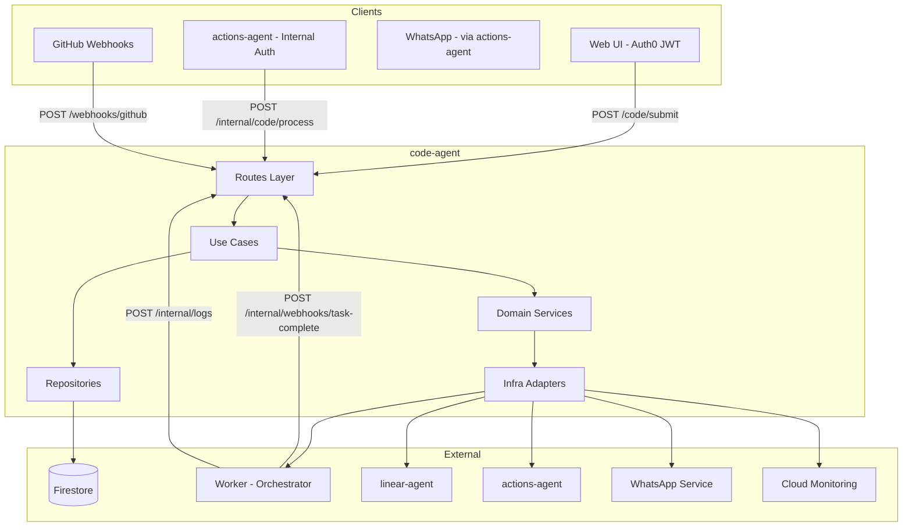
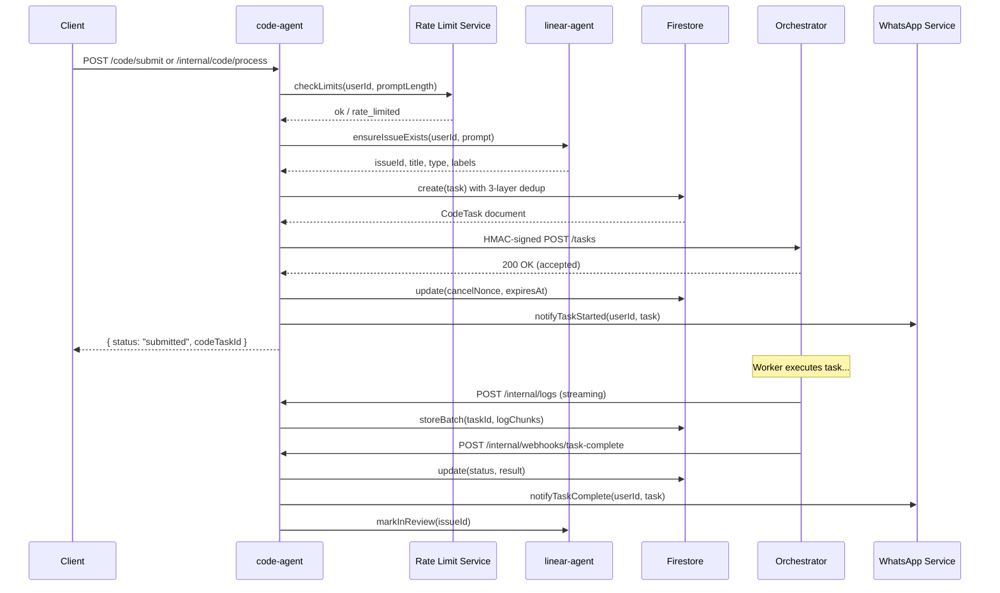

# Code Agent - Technical Reference

## Overview

The code-agent service orchestrates autonomous code execution tasks. It accepts task submissions from the web UI (Auth0 JWT) and the actions-agent (internal auth), creates Firestore documents with three-layer deduplication, dispatches HMAC-signed requests to user-configured workers via Cloudflare Access, streams log chunks into Firestore subcollections, processes completion webhooks, and mirrors state transitions to Linear and the actions-agent.

- **Framework:** Fastify 5 on Node.js 22+
- **Port:** 8128 (local), 8080 (Cloud Run)
- **Package:** `@intexuraos/code-agent` v2.1.0
- **Deploy:** Cloud Run (scale 0-1)

## Architecture



## Data Flow: Task Submission



## Recent Changes

| Commit     | Description                                                        | Date         |
| ---------- | ------------------------------------------------------------------ | ------------ |
| `e5637ce5` | Deduplicate PR body across pull_request events in API response     | 2 hours ago  |
| `be0eaa8b` | Automatic turn-end metrics collection (CPU, memory, tokens)        | 3 hours ago  |
| `c1bc9883` | Truncate oversized tool results and unparseable log lines          | 5 hours ago  |
| `27ef6a7b` | Show compare URL for PR synchronize events in timeline             | 13 hours ago |
| `60e029a8` | Deduplicate edited comments in PR events API response              | 13 hours ago |
| `0a48ed4e` | Display comment body on PR events page in GitHub style             | 14 hours ago |
| `5ead960d` | Add clickable GitHub links to PR event items                       | 16 hours ago |
| `554b716c` | Add gitHubPRSummaryRepo to ServiceContainer                        | 17 hours ago |

## API Endpoints

### Public Routes (Auth0 JWT)

| Method | Path                                       | Description                       | Auth  |
| ------ | ------------------------------------------ | --------------------------------- | ----- |
| POST   | `/code/submit`                             | Submit code task from web UI      | Auth0 |
| GET    | `/code/tasks`                              | List user's tasks (paginated)     | Auth0 |
| GET    | `/code/tasks/:taskId`                      | Get task details                  | Auth0 |
| POST   | `/code/tasks/:taskId/cancel`               | Cancel a running task             | Auth0 |
| POST   | `/code/tasks/:taskId/retry`                | Retry a failed/cancelled task     | Auth0 |
| POST   | `/code/tasks/:taskId/feedback`             | Submit feedback on completed task | Auth0 |
| GET    | `/code/github-pr-events`                   | Query GitHub PR events            | Auth0 |
| GET    | `/code/worker-settings`                    | Get worker settings (masked)      | Auth0 |
| POST   | `/code/worker-settings/workers`            | Add new worker                    | Auth0 |
| PATCH  | `/code/worker-settings/workers/:name`      | Update worker config              | Auth0 |
| DELETE | `/code/worker-settings/workers/:name`      | Delete worker                     | Auth0 |
| POST   | `/code/worker-settings/workers/:name/test` | Test worker connectivity          | Auth0 |
| PUT    | `/code/worker-settings/priority`           | Reorder workers by priority       | Auth0 |

### Internal Routes (X-Internal-Auth)

| Method | Path                                                | Description                            | Auth          |
| ------ | --------------------------------------------------- | -------------------------------------- | ------------- |
| POST   | `/internal/code/process`                            | Process code action from actions-agent | Internal      |
| PATCH  | `/internal/code-tasks/:taskId`                      | Update task status (worker callback)   | Internal      |
| GET    | `/internal/code-tasks/linear/:linearIssueId/active` | Check active task for Linear issue     | Internal      |
| GET    | `/internal/code-tasks/zombies`                      | Find zombie tasks                      | Internal      |
| POST   | `/internal/code/cancel`                             | Cancel task via nonce (WhatsApp)       | Internal      |
| POST   | `/internal/code/heartbeat`                          | Process heartbeat from orchestrator    | Internal+HMAC |
| POST   | `/internal/code/detect-zombies`                     | Trigger zombie detection               | Internal      |
| POST   | `/internal/code/cleanup-logs`                       | Trigger log cleanup                    | Internal      |

### Webhook Routes (HMAC Signature)

| Method | Path                               | Description                        | Auth          |
| ------ | ---------------------------------- | ---------------------------------- | ------------- |
| POST   | `/internal/webhooks/task-complete` | Task completion callback           | Internal+HMAC |
| POST   | `/internal/logs`                   | Log chunk upload from orchestrator | Internal+HMAC |
| POST   | `/webhooks/github`                 | GitHub webhook events              | GitHub HMAC   |

### Utility Routes

| Method | Path            | Description  |
| ------ | --------------- | ------------ |
| GET    | `/health`       | Health check |
| GET    | `/openapi.json` | OpenAPI spec |
| GET    | `/docs`         | Swagger UI   |

## Domain Model

### CodeTask (collection: `code_tasks`)

The central entity. Tracks a coding task through its lifecycle.

```typescript
interface CodeTask {
  id: string;
  traceId: string;
  actionId?: string;
  approvalEventId?: string;
  retriedFrom?: string;
  userId: string;
  workerType: 'opus' | 'auto' | 'glm';
  workerLocation: string;
  status: 'dispatched' | 'running' | 'completed' | 'failed' | 'interrupted' | 'cancelled';
  prompt: string;
  sanitizedPrompt: string;
  systemPromptHash: string;
  repository: string;
  baseBranch: string;
  linearIssueId?: string;
  linearIssueTitle?: string;
  linearIssueType?: 'feature' | 'bug' | 'refactor' | 'research';
  linearIssueLabels?: string[];
  hasChildren?: boolean;
  linearFallback?: boolean;
  prNumber?: number;
  prBranch?: string;
  parentTaskId?: string;
  followUpReason?: 'pr_comment' | 'user_feedback' | 'retry';
  result?: TaskResult;
  error?: TaskError;
  createdAt: Timestamp;
  dispatchedAt?: Timestamp;
  completedAt?: Timestamp;
  updatedAt: Timestamp;
  callbackReceived: boolean;
  webhookSecret?: string;
  lastHeartbeat?: Timestamp;
  logChunksDropped?: number;
  statusSummary?: StatusSummary;
  dedupKey: string;
  cancelNonce?: string;
  cancelNonceExpiresAt?: string;
}
```

### LogChunk (subcollection: `code_tasks/{taskId}/logs`)

Streaming log data from the worker, ordered by sequence number.

```typescript
interface LogChunk {
  id: string;
  sequence: number;
  content: string; // May contain ANSI codes
  timestamp: Timestamp;
  size: number; // Byte size
}
```

### UserUsage (collection: `user_usage`)

Rate limiting counters with time-windowed resets.

```typescript
interface UserUsage {
  userId: string;
  concurrentTasks: number;
  tasksThisHour: number;
  hourStartedAt: Timestamp;
  costToday: number;
  costThisMonth: number;
  dayStartedAt: Timestamp;
  monthStartedAt: Timestamp;
  updatedAt: Timestamp;
}
```

### UserWorkerSettings (collection: `code_worker_settings`)

Per-user encrypted worker credentials and configuration.

```typescript
interface UserWorkerSettings {
  userId: string;
  workers: WorkerConfig[]; // Max 2, ordered by priority
  createdAt: string;
  updatedAt: string;
  workerHealthStatuses?: Record<string, WorkerHealthStatus>;
}
```

### TurnMetrics (subcollection: `code_tasks/{taskId}/turn_metrics`)

Per-turn resource and performance metrics, automatically collected at turn end.

```typescript
interface TurnMetrics {
  taskId: string;
  attempt: number;
  timestamp: string;
  // Resource (cgroup-measured)
  cpuTimeSeconds: number;
  cpuCores: number;
  peakMemoryMB: number;
  // Time classification (session JSONL)
  wallTimeSeconds: number;
  apiWaitSeconds: number;
  toolExecSeconds: number;
  backgroundWaitSeconds: number;
  overheadSeconds: number;
  // Token accounting
  totalInputTokens: number;
  totalOutputTokens: number;
  totalCacheReadTokens: number;
  totalCacheCreationTokens: number;
  apiCallCount: number;
  // Derived
  cpuUtilizationPercent: number;
  idlePercent: number;
}
```

### GitHubPREvent (collection: `github-pr-events`)

Normalized GitHub webhook events for PR timeline display.

### GitHubPRSummary (collection: `github-pr-summaries`)

One document per unique PR, upserted on every webhook event. Used for the 30-day PR list view — O(PRs) instead of O(events).

```typescript
interface GitHubPRSummary {
  repository: string;
  pullRequestNumber: number;
  title: string | null;
  state: string | null; // 'open' | 'closed'
  mergedAt: Date | null;
  lastActivityAt: Date;
  firstSeenAt: Date;
}
```

Document ID format: `${repository.replace('/', '__')}#${pullRequestNumber}`

### PRTaskLock (collection: `pr_task_locks`)

Per-PR locks to prevent concurrent tasks on the same pull request. Documents use the format `${repository}:${prNumber}` as the document ID. Locks expire after 30 minutes.

## Firestore Collections Owned

| Collection               | Description                                                                |
| ------------------------ | -------------------------------------------------------------------------- |
| `code_tasks`             | Code execution tasks (subcollections: `logs`, `turn_metrics`)              |
| `user_spend`             | User cost tracking for rate limiting                                       |
| `user_usage`             | Rate limiting counters (concurrent, hourly, cost)                          |
| `code_worker_settings`   | Per-user worker configs with encrypted credentials                         |
| `github-pr-events`       | GitHub PR webhook events for timeline display                              |
| `github-pr-summaries`    | Per-PR rollup documents for O(PRs) list view (30-day window)               |
| `pr_task_locks`          | Per-PR task locks preventing concurrent modifications                      |

## Use Cases

| Use Case            | File                                     | Description                                      |
| ------------------- | ---------------------------------------- | ------------------------------------------------ |
| processCodeAction   | `domain/usecases/processCodeAction.ts`   | Create task with dedup, dispatch to worker       |
| cancelTaskWithNonce | `domain/usecases/cancelTaskWithNonce.ts` | Cancel via WhatsApp nonce validation             |
| handlePRComment     | `domain/usecases/handlePRComment.ts`     | Detect actionable PR comments, prepare task      |
| processHeartbeat    | `domain/usecases/processHeartbeat.ts`    | Update heartbeat timestamps for zombie detection |
| detectZombieTasks   | `domain/usecases/detectZombieTasks.ts`   | Find and interrupt stale tasks (30 min)          |
| cleanupTaskLogs     | `domain/usecases/cleanupTaskLogs.ts`     | Archive logs older than 90 days                  |
| retryTask           | `domain/usecases/retryTask.ts`           | Retry failed/cancelled with cool-off and context |
| submitTaskFeedback  | `domain/usecases/submitTaskFeedback.ts`  | Follow-up on completed tasks with feedback       |

## Domain Services

| Service               | Interface                                   | Purpose                                           |
| --------------------- | ------------------------------------------- | ------------------------------------------------- |
| LinearIssueService    | `domain/services/linearIssueService.ts`     | Validate/create Linear issues, state transitions  |
| RateLimitService      | `domain/services/rateLimitService.ts`       | Check and record rate limits per user             |
| TaskDispatcherService | `domain/services/taskDispatcher.ts`         | Dispatch tasks to workers with HMAC and fallback  |
| WhatsAppNotifier      | `domain/services/whatsappNotifier.ts`       | Send WhatsApp notifications (start/complete/fail) |
| StatusMirrorService   | `infra/services/statusMirrorServiceImpl.ts` | Mirror task status to actions-agent               |
| MetricsClient         | `domain/services/metrics.ts`                | Record Cloud Monitoring metrics                   |

## Dependencies (Service-to-Service)

| Target Service      | Communication         | Purpose                                         |
| ------------------- | --------------------- | ----------------------------------------------- |
| linear-agent        | HTTP (internal auth)  | Issue CRUD, state transitions, title generation |
| actions-agent       | HTTP (internal auth)  | Action status updates                           |
| whatsapp-service    | Pub/Sub               | WhatsApp message sending                        |
| Worker/Orchestrator | HTTP (CF Access+HMAC) | Task dispatch and cancellation                  |

## Configuration

### Required Environment Variables

| Variable                           | Description                                   |
| ---------------------------------- | --------------------------------------------- |
| `INTEXURAOS_GCP_PROJECT_ID`        | GCP project ID                                |
| `INTEXURAOS_INTERNAL_AUTH_TOKEN`   | Internal service auth token                   |
| `INTEXURAOS_WEBHOOK_VERIFY_SECRET` | HMAC secret for webhook validation            |
| `INTEXURAOS_TOKEN_ENCRYPTION_KEY`  | AES key for encrypting worker credentials     |
| `INTEXURAOS_ORCHESTRATOR_SECRET`   | HMAC secret for orchestrator dispatch signing |
| `INTEXURAOS_GITHUB_WEBHOOK_SECRET` | GitHub webhook HMAC-SHA256 secret             |

### Production-Only Environment Variables

| Variable                                | Description                                  |
| --------------------------------------- | -------------------------------------------- |
| `INTEXURAOS_WHATSAPP_SERVICE_URL`       | WhatsApp service URL                         |
| `INTEXURAOS_PUBSUB_WHATSAPP_SEND_TOPIC` | Pub/Sub topic for WhatsApp messages          |
| `INTEXURAOS_LINEAR_AGENT_URL`           | linear-agent service URL                     |
| `INTEXURAOS_ACTIONS_AGENT_URL`          | actions-agent service URL                    |
| `INTEXURAOS_SERVICE_URL`                | This service's public URL (for webhook URLs) |
| `INTEXURAOS_AUTH_AUDIENCE`              | Auth0 audience                               |
| `INTEXURAOS_AUTH_ISSUER`                | Auth0 issuer                                 |
| `INTEXURAOS_AUTH_JWKS_URL`              | Auth0 JWKS endpoint                          |

### Rate Limit Defaults

| Limit                | Value   |
| -------------------- | ------- |
| Max concurrent tasks | 3       |
| Max tasks per hour   | 10      |
| Max prompt length    | 10,000  |
| Daily cost cap       | $20     |
| Monthly cost cap     | $200    |
| Estimated cost/task  | $1.17   |
| Zombie threshold     | 30 min  |
| Log retention        | 90 days |
| Cancel nonce TTL     | 15 min  |
| Retry cool-off       | 5 min   |

## Gotchas

1. **Worker credentials are per-user.** There are no global/fallback workers. If a user has no configured workers, task submission fails with `worker_not_configured`.
2. **HMAC validation requires raw body.** Fastify parses JSON, so the GitHub webhook handler reconstructs the raw body via `JSON.stringify(request.body)` for signature verification.
3. **Log chunk sequence 0 triggers status transition.** When the first log chunk arrives, the service transitions the task from `dispatched` to `running`.
4. **PR task locks have a 30-minute TTL.** Expired locks are automatically overwritten when a new task attempts to acquire the same lock.
5. **Cancelled tasks bypass the 5-minute retry cool-off.** Only failed tasks enforce the cool-off period.
6. **E2E mode replaces all external clients with no-ops.** Set `E2E_MODE=true` to use mock Linear, WhatsApp, and actions-agent clients.
7. **PR events API applies two deduplication passes.** `GET /code/github-pr-events` runs `deduplicateCommentEvents` (keeps first occurrence, updates body to latest) then `deduplicatePRBody` (removes PR body from all but the most recent `pull_request` event) before returning results. The raw events in Firestore are unmodified.
8. **`github-pr-summaries` documents use `__` instead of `/` in repository names.** Firestore path separator conflicts with repo slugs, so `owner/repo` becomes `owner__repo#prNumber` as the document ID.

## File Structure

```
apps/code-agent/src/
  index.ts                          # Entry point, env validation, startup
  server.ts                         # Fastify server setup, CORS, Swagger
  config.ts                         # Config loader (env -> Config interface)
  services.ts                       # DI container (ServiceContainer)
  domain/
    models/
      codeTask.ts                   # CodeTask, TaskStatus, TaskResult, TaskError
      gitHubPREvent.ts              # GitHub webhook event model
      gitHubPRSummary.ts            # Per-PR summary for list view
      logChunk.ts                   # Log chunk model
      prTaskLock.ts                 # PR task lock model
      signing.ts                    # Signing error types
      turnMetrics.ts                # Per-turn CPU/memory/token metrics
      userSpend.ts                  # User spend tracking model
      userUsage.ts                  # User usage + DEFAULT_LIMITS
      worker.ts                    # WorkerConfig, WorkerHealth, WorkerError
      workerSettings.ts            # UserWorkerSettings, WorkerCredentials
    ports/
      linearAgentClient.ts          # Linear agent client interface
      userUsageRepository.ts        # User usage repository interface
      workerHealthProbe.ts          # Worker health probe interface
      workerSettingsRepository.ts   # Worker settings repository interface
    repositories/
      codeTaskRepository.ts         # CodeTask CRUD + dedup interface
      gitHubPREventRepository.ts    # GitHub PR event repository interface
      gitHubPRSummaryRepository.ts  # PR summary repository interface
      logChunkRepository.ts         # Log chunk storage interface
      prTaskLockRepository.ts       # PR task lock interface
      turnMetricsRepository.ts      # Turn metrics storage interface
    services/
      linearIssueService.ts         # Linear issue management service
      metrics.ts                    # MetricsClient interface
      rateLimitService.ts           # Rate limit checking and recording
      taskDispatcher.ts             # Task dispatch interface + types
      whatsappNotifier.ts           # WhatsApp notification interface
    usecases/
      cancelTaskWithNonce.ts        # Cancel via nonce
      cleanupTaskLogs.ts            # Log archival
      detectZombieTasks.ts          # Zombie detection
      handlePRComment.ts            # PR comment -> task
      processCodeAction.ts          # Main task creation + dispatch
      processHeartbeat.ts           # Heartbeat processing
      retryTask.ts                  # Task retry with cool-off
      submitTaskFeedback.ts         # Feedback follow-up
    utils/
      isActionableComment.ts        # PR comment actionability check
  infra/
    auth/
      index.ts                     # Auth exports
      jwtValidator.ts              # Auth0 JWT validation
    clients/
      actionsAgentClient.ts        # Actions agent HTTP client
    firestore/
      encryption.ts                # AES-256-GCM encryption for worker creds
      firestorePRTaskLockRepository.ts  # PR task lock Firestore impl
      gitHubPREventsRepository.ts  # GitHub PR events Firestore impl
      gitHubPRSummariesRepository.ts    # PR summary Firestore impl (upsert + list)
      userUsageFirestoreRepository.ts   # User usage Firestore impl
      workerSettingsRepository.ts  # Worker settings Firestore impl
    http/
      linearAgentHttpClient.ts     # Linear agent HTTP client
    repositories/
      firestoreCodeTaskRepository.ts    # CodeTask Firestore impl
      firestoreLogChunkRepository.ts    # LogChunk Firestore impl
      firestoreLogLineRepository.ts     # LogLine Firestore impl
      firestoreTurnMetricsRepository.ts # TurnMetrics subcollection impl
    services/
      hmacSigning.ts               # HMAC signing utilities
      statusMirrorServiceImpl.ts   # Action status mirroring impl
      taskDispatcherImpl.ts        # Task dispatch with CF Access + fallback
      whatsappNotifierImpl.ts      # WhatsApp notification via Pub/Sub
      workerHealthProbe.ts         # Worker health probing impl
    github-event-parser.ts         # GitHub webhook payload parser
    github-webhook-auth.ts         # GitHub HMAC-SHA256 verification
    metrics.ts                     # Cloud Monitoring metrics impl
    webhookValidation.ts           # Webhook HMAC validation
  routes/
    index.ts                       # Route registration
    codeRoutes.ts                  # Main code task routes (internal + public)
    webhookRoutes.ts               # Task completion + log webhooks
    workerSettingsRoutes.ts        # Worker settings CRUD routes
    code/
      index.ts                     # Code route exports
      github-pre-events.ts        # GitHub PR events query route (with dedup passes)
      extractEventUrl.ts           # Extract clickable GitHub URLs from webhook payloads
    webhooks/
      index.ts                     # Webhook route aggregator
      github.ts                    # GitHub webhook handler
```
