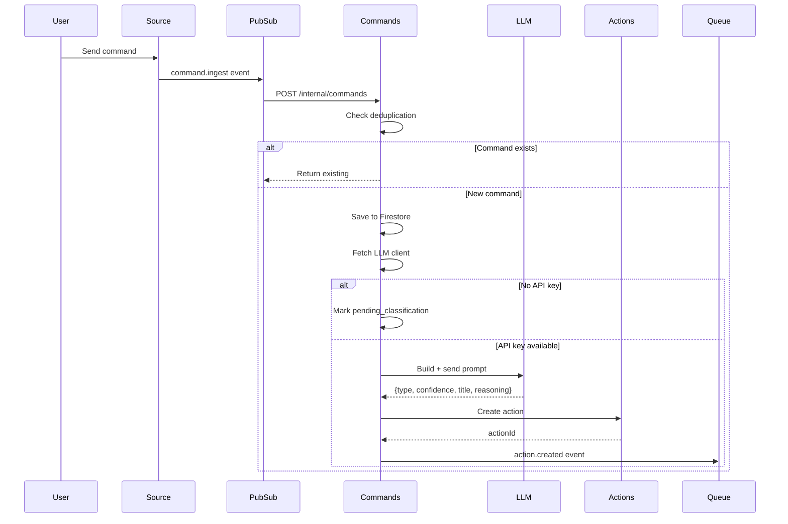

# Commands Agent — Technical Reference

## Overview

Commands-agent classifies natural language input into action types using a structured 5-step LLM prompt backed by Gemini 2.5 Flash. It receives commands from WhatsApp (via Pub/Sub push) and the PWA (via REST), creates actions through actions-agent, and publishes `action.created` events for downstream processing. Runs on Cloud Run with Fastify, Firestore persistence, and Dash0 OpenTelemetry for distributed tracing.

## Architecture

```mermaid
graph TB
    subgraph Sources
        WhatsApp[WhatsApp Service]
        PWA[PWA Web App]
    end

    subgraph PubSub
        Ingest[command.ingest topic]
    end

    subgraph CommandsAgent[Commands Agent]
        IngestRoute[/internal/commands]
        ProcessUC[processCommand useCase]
        Classifier[LLM Classifier]
        ActionsClient[actions-agent client]
        UserClient[user-service client]
    end

    subgraph LLMPrompts[llm-prompts package]
        Prompt[commandClassifierPrompt]
    end

    subgraph Storage
        Commands[(Firestore:<br/>commands)]
    end

    subgraph Actions
        ActionsSvc[actions-agent]
        ActionsQueue[actions PubSub]
    end

    WhatsApp -->|PubSub push| IngestRoute
    PWA -->|POST /commands| ProcessUC

    ProcessUC -->|getLlmClient| UserClient
    ProcessUC -->|classify| Classifier
    Classifier -->|build prompt| Prompt
    ProcessUC -->|createAction| ActionsClient
    ProcessUC -->|save| Commands
    ActionsClient -->|HTTP| ActionsSvc
    ActionsSvc -->|publishes| ActionsQueue

    ProcessUC -->|action.created| ActionsQueue
```

## Classification Prompt Structure

The classification prompt in `packages/llm-prompts/src/classification/commandClassifierPrompt.ts` uses a 5-step decision tree executed in strict order:

### Step 1: Explicit Prefix Override

If message starts with a category keyword (with or without colon), that category wins.

```
"linear: buy groceries" -> linear
"todo: meeting tomorrow" -> todo
"do lineara: fix bug" -> linear (Polish)
```

### Step 2: Explicit Intent Command Detection (HIGH PRIORITY)

Explicit command phrases override all other signals including URL content.

**Critical: Linear vs Code Disambiguation**

- `linear` — ONLY when the user EXPLICITLY wants to create/track a Linear issue (must include "linear", "issue", "track", "log", or "report")
- `code` — ANY engineering task describing work to do (fix, implement, design, add, refactor, change, update, build, etc.)

When ambiguous, prefer `code`. Engineering tasks default to code execution. Code actions automatically create a Linear issue, so tracking is never lost.

**English phrases (confidence 0.90+):**

- link: "save bookmark", "save link", "bookmark this"
- todo: "create todo", "add todo", "add task"
- research: "perform research", "do research", "investigate"
- note: "create note", "save note", "write note"
- reminder: "set reminder", "remind me"
- calendar: "schedule", "add to calendar", "book appointment"
- linear (explicit tracking intent): "create issue", "report bug", "track this", "log this bug"
- code (default for engineering): "fix X", "implement X", "refactor X", "add X", "build X"

**Polish phrases:**

- link: "zapisz link", "dodaj zakladke"
- todo: "stworz zadanie", "dodaj zadanie"
- research: "zbadaj", "sprawdz", "przeprowadz research"
- note: "stworz notatke", "zapisz notatke"
- reminder: "przypomnij mi"
- calendar: "zaplanuj", "dodaj do kalendarza"
- linear: "zglos blad", "stworz issue", "dodaj do lineara"

### Step 3: Code Detection (Engineering Task Fallback)

Engineering tasks that did not match an explicit phrase in Step 2 classify as `code`.

- Action verbs: fix, implement, design, add, remove, refactor, change, update, build
- Bug descriptions, feature descriptions

**Exception:** Math/science context ("linear regression", "linear algebra") classifies as `research`, not `linear`.

### Step 4: URL Presence Check

If message contains `http://` or `https://`, strongly prefer `link` classification.

**Critical:** Keywords inside URLs are IGNORED. "https://research-world.com" does not trigger `research`.

### Step 5: Category Detection (Fallback)

Traditional signal matching when no URL and no explicit intent:

| Category | Signals                                             |
| -------- | --------------------------------------------------- |
| calendar | tomorrow, today, weekday names, time (3pm), meeting |
| reminder | remind me, przypomnij, don't forget                 |
| research | how does, what is, why, find out, learn about, ?    |
| note     | notes, idea, remember that, jot down                |
| code     | fix bug, refactor, implement, deploy, debug         |
| todo     | (default for actionable requests)                   |

## Data Flow



## Recent Changes

| Commit     | Description                                                          | Date       |
| ---------- | -------------------------------------------------------------------- | ---------- |
| `34fde5ee` | Add tests for commandsRoutes.ts owner auth + status (INT-867)        | 2026-03-15 |
| `a5a59aaf` | Remove override entry and improve test assertions (INT-790)          | 2026-03-13 |
| `bc4138e7` | Replace v8-ignore blocks with real tests in internalRoutes (INT-790) | 2026-03-13 |
| `93aeac4a` | Remove ZAI provider and GLM-4.7 models, finalize GLM-5 (INT-836)     | 2026-03-12 |
| `e348b66e` | Fix silent dispatch failures and nested transaction (INT-810/811)    | 2026-03-10 |
| `cc52e50d` | Increase classification title limit to 200 chars                     | 2026-03-07 |
| `99febe66` | Wire GitHub OAuth integration and update cross-service mocks         | 2026-03-02 |
| `35abc346` | Persist prompt version with command classification                   | 2026-02-19 |
| `6063175b` | Dev-mode log formatting via createLogStream()                        | 2026-02-16 |
| `a52a6bbc` | Dash0 OpenTelemetry integration                                      | 2026-02-16 |

## API Endpoints

### Public Endpoints

| Method | Path                   | Description                                   | Auth         |
| ------ | ---------------------- | --------------------------------------------- | ------------ |
| GET    | `/commands`            | List user's commands                          | Bearer token |
| POST   | `/commands`            | Create command from web app                   | Bearer token |
| DELETE | `/commands/:commandId` | Delete command (received/pending/failed only) | Bearer token |
| PATCH  | `/commands/:commandId` | Archive classified command                    | Bearer token |

### Internal Endpoints

| Method | Path                            | Description                   | Auth                           |
| ------ | ------------------------------- | ----------------------------- | ------------------------------ |
| POST   | `/internal/commands`            | Ingest command from Pub/Sub   | Pub/Sub OIDC or internal token |
| POST   | `/internal/retry-pending`       | Retry pending classifications | OIDC or internal token         |
| GET    | `/internal/commands/:commandId` | Get command by ID             | Internal token                 |

## Domain Models

### Command

| Field            | Type                      | Description                                                              |
| ---------------- | ------------------------- | ------------------------------------------------------------------------ |
| `id`             | `string`                  | `{sourceType}:{externalId}` composite key                                |
| `userId`         | `string`                  | Owner user ID                                                            |
| `sourceType`     | `CommandSourceType`       | `whatsapp_text`, `whatsapp_voice`, `pwa-shared`                          |
| `externalId`     | `string`                  | Source system identifier (e.g., WhatsApp message ID)                     |
| `text`           | `string`                  | Original command text                                                    |
| `summary`        | `string` (optional)       | Summary for voice transcriptions                                         |
| `timestamp`      | `string`                  | ISO 8601 timestamp from source                                           |
| `status`         | `CommandStatus`           | `received`, `classified`, `pending_classification`, `failed`, `archived` |
| `classification` | `CommandClassification`   | Classification result (absent if not yet classified)                     |
| `actionId`       | `string` (optional)       | Created action ID                                                        |
| `failureReason`  | `string` (optional)       | Error details if failed                                                  |
| `createdAt`      | `string`                  | ISO 8601 creation time                                                   |
| `updatedAt`      | `string`                  | ISO 8601 last update                                                     |

### CommandClassification

| Field           | Type          | Description                                                                  |
| --------------- | ------------- | ---------------------------------------------------------------------------- |
| `type`          | `CommandType` | `todo`, `research`, `note`, `link`, `calendar`, `linear`, `reminder`, `code` |
| `confidence`    | `number`      | 0–1 confidence score                                                         |
| `reasoning`     | `string`      | LLM explanation for classification                                           |
| `promptVersion` | `string`      | Semver version of the prompt that produced this result                       |
| `classifiedAt`  | `string`      | ISO 8601 classification timestamp                                            |

### Confidence Semantics

| Range     | Meaning                                         |
| --------- | ----------------------------------------------- |
| 0.90+     | Clear match (explicit prefix, multiple signals) |
| 0.70–0.90 | Strong match (single clear signal)              |
| 0.50–0.70 | Choosing between 2–3 plausible categories       |
| <0.50     | Genuinely uncertain, defaults to `note`         |

## Status Enums

**CommandStatus:**

- `received` — Initial state, not yet processed
- `classified` — Successfully classified with action created
- `pending_classification` — Waiting for LLM API keys
- `failed` — Classification or action creation failed
- `archived` — Soft deleted by user

**CommandSourceType:**

- `whatsapp_text` — Text message from WhatsApp
- `whatsapp_voice` — Voice note from WhatsApp (transcribed before classification)
- `pwa-shared` — Link or text shared via PWA share menu

## Pub/Sub Events

### Subscribed

| Event Type       | Topic env var (inferred) | Handler                   |
| ---------------- | ------------------------ | ------------------------- |
| `command.ingest` | (configured externally)  | `POST /internal/commands` |

### Published

| Event Type       | Topic env var                     | Payload                                                     | Trigger                          |
| ---------------- | --------------------------------- | ----------------------------------------------------------- | -------------------------------- |
| `action.created` | `INTEXURAOS_PUBSUB_ACTIONS_QUEUE` | `{actionId, userId, commandId, actionType, title, payload}` | After successful classification  |

## Dependencies

### Internal Services

| Service                | Endpoint                   | Purpose                                        |
| ---------------------- | -------------------------- | ---------------------------------------------- |
| `user-service`         | (via internal-clients)     | Fetch LLM client for classification            |
| `actions-agent`        | `POST /internal/actions`   | Create actions from classified commands        |
| `app-settings-service` | (via llm-pricing)          | Fetch LLM pricing data at startup              |

### Packages

| Package              | Purpose                                                 |
| -------------------- | ------------------------------------------------------- |
| `llm-prompts`        | Classification prompt builder                           |
| `llm-factory`        | LLM client abstraction                                  |
| `llm-pricing`        | Fetch and cache LLM pricing from app-settings           |
| `llm-contract`       | Shared `LlmModels` enum and type contracts              |
| `internal-clients`   | Shared user-service HTTP client                         |
| `infra-sentry`       | Sentry-enabled logger factory                           |
| `infra-otel`         | OpenTelemetry distributed tracing via Dash0             |
| `infra-pubsub`       | `BasePubSubPublisher` base class                        |
| `common-http`        | `requireAuth`, `validateInternalAuth`, response helpers |
| `common-core`        | `Result<T>`, `ok()`, `err()`, `getErrorMessage()`       |

### Infrastructure

| Component                                       | Purpose                                                             |
| ----------------------------------------------- | ------------------------------------------------------------------- |
| Firestore (`commands` collection)               | Command persistence                                                 |
| Pub/Sub (via `INTEXURAOS_PUBSUB_ACTIONS_QUEUE`) | Action creation events                                              |
| Cloud Scheduler                                 | Triggers `/internal/retry-pending` for pending classification retry |
| Dash0 (via OTLP/HTTP)                           | Distributed tracing and metrics                                     |

### External APIs

| Service          | Purpose                | Model              |
| ---------------- | ---------------------- | ------------------ |
| Google Gemini    | Command classification | Gemini 2.5 Flash   |

## Configuration

| Environment Variable                  | Required | Description                                                       |
| ------------------------------------- | -------- | ----------------------------------------------------------------- |
| `INTEXURAOS_GCP_PROJECT_ID`           | Yes      | Google Cloud project ID                                           |
| `INTEXURAOS_AUTH_JWKS_URL`            | Yes      | Auth0 JWKS URL for JWT validation                                 |
| `INTEXURAOS_AUTH_ISSUER`              | Yes      | Auth0 issuer for JWT validation                                   |
| `INTEXURAOS_AUTH_AUDIENCE`            | Yes      | Auth0 audience for JWT validation                                 |
| `INTEXURAOS_USER_SERVICE_URL`         | Yes      | user-service base URL                                             |
| `INTEXURAOS_ACTIONS_AGENT_URL`        | Yes      | actions-agent base URL                                            |
| `INTEXURAOS_APP_SETTINGS_SERVICE_URL` | Yes      | app-settings-service base URL (pricing data fetched at startup)   |
| `INTEXURAOS_INTERNAL_AUTH_TOKEN`      | Yes      | Shared secret for internal auth                                   |
| `INTEXURAOS_PUBSUB_ACTIONS_QUEUE`     | Yes      | Pub/Sub topic for action creation events                          |
| `INTEXURAOS_GEMINI_APP_API_KEY`       | No       | Platform-level Gemini fallback API key for classification         |
| `INTEXURAOS_SENTRY_DSN`               | No       | Sentry DSN for error tracking                                     |
| `INTEXURAOS_ENVIRONMENT`              | No       | Environment name for Sentry (defaults to "development")           |

## Gotchas

**URL keyword isolation** — The prompt instructs the LLM to ignore keywords inside URLs. This is prompt-level guidance, not code-level URL parsing. LLM compliance is high but not guaranteed.

**Explicit intent priority** — Step 2 executes BEFORE Step 4. "research this https://example.com" classifies as `research` (explicit intent), not `link` (URL presence).

**PWA-shared confidence boost** — Links from `pwa-shared` source get +0.1 confidence boost toward `link` (capped at 1.0) because share sheet usage strongly indicates link-saving intent.

**Idempotency key format** — The command ID is `{sourceType}:{externalId}`. If a command with that composite key already exists, `processCommand` returns the existing record with `isNew: false`. WhatsApp message IDs are not globally unique — they can repeat across different phone numbers.

**Default classification model** — Gemini 2.5 Flash is the sole classification model as of v3.3.0. GLM-4.7 and all ZAI/DashScope models have been removed.

**Pub/Sub push authentication** — Uses `from: noreply@google.com` header to detect Pub/Sub pushes vs direct service calls. Pub/Sub requests are authenticated by Cloud Run OIDC validation before reaching the handler; direct calls use `X-Internal-Auth`.

**Archive vs delete** — Classified commands can only be archived (`PATCH /commands/:commandId` with `status: "archived"`). Only commands with status `received`, `pending_classification`, or `failed` can be deleted.

**Pricing context at startup** — `initServices()` calls `fetchAllPricing()` from `app-settings-service` before accepting any requests. If app-settings-service is unavailable at startup, the service fails to initialize entirely.

**Response contract** — All endpoints use `reply.ok(data)` and `reply.fail(code, message)`. Responses wrap data under `{ success: true, data: {...} }` and errors under `{ success: false, error: { code, message } }`.

**Logging** — All loggers use `createAppLogger()` from `@intexuraos/infra-sentry` (not raw `pino()`), which sends errors to Sentry automatically.

**OpenTelemetry** — The Dockerfile uses `--import` flag to preload the `@intexuraos/infra-otel` register module. Tracing exports to Dash0 via OTLP/HTTP when configured. No-op when unset.

**Title length limit** — The Zod schema for classification responses enforces a 200-character maximum on titles. Increased from 50 in v3.3.0 to prevent valid classifications from being discarded when the LLM generates descriptive titles.

**Retry pending endpoint** — `POST /internal/retry-pending` is called by Cloud Scheduler. It processes all commands in `pending_classification` status up to a limit of 100 at a time, skipping those for which no LLM client can be retrieved.

## File Structure

```
apps/commands-agent/src/
  domain/
    models/
      command.ts              # Command entity, factory functions, status types
      action.ts               # Action entity (forwarded type)
    ports/
      classifier.ts           # Classifier interface + ClassificationResult
      commandRepository.ts    # Repository interface
      eventPublisher.ts       # PubSub publisher interface
      actionsAgentClient.ts   # actions-agent HTTP client interface
    usecases/
      processCommand.ts       # Main command processing pipeline
      retryPendingCommands.ts # Retry logic for pending_classification commands
    events/
      actionCreatedEvent.ts   # ActionCreatedEvent type
  infra/
    firestore/
      commandRepository.ts    # Firestore implementation of CommandRepository
    llm/
      classifier.ts           # Gemini classifier implementation
    pubsub/
      actionEventPublisher.ts # BasePubSubPublisher implementation
      config.ts               # Topic name helper (INTEXURAOS_PUBSUB_ACTIONS_QUEUE)
      index.ts
    actionsAgent/
      client.ts               # HTTP client for actions-agent
  routes/
    commandsRoutes.ts         # Public endpoints (GET/POST/DELETE/PATCH /commands)
    internalRoutes.ts         # Internal endpoints (/internal/*)
    index.ts
  services.ts                 # DI container (initServices, getServices, setServices)
  server.ts                   # Fastify server setup

packages/llm-prompts/src/
  classification/
    commandClassifierPrompt.ts  # 5-step classification prompt with semver version
```
