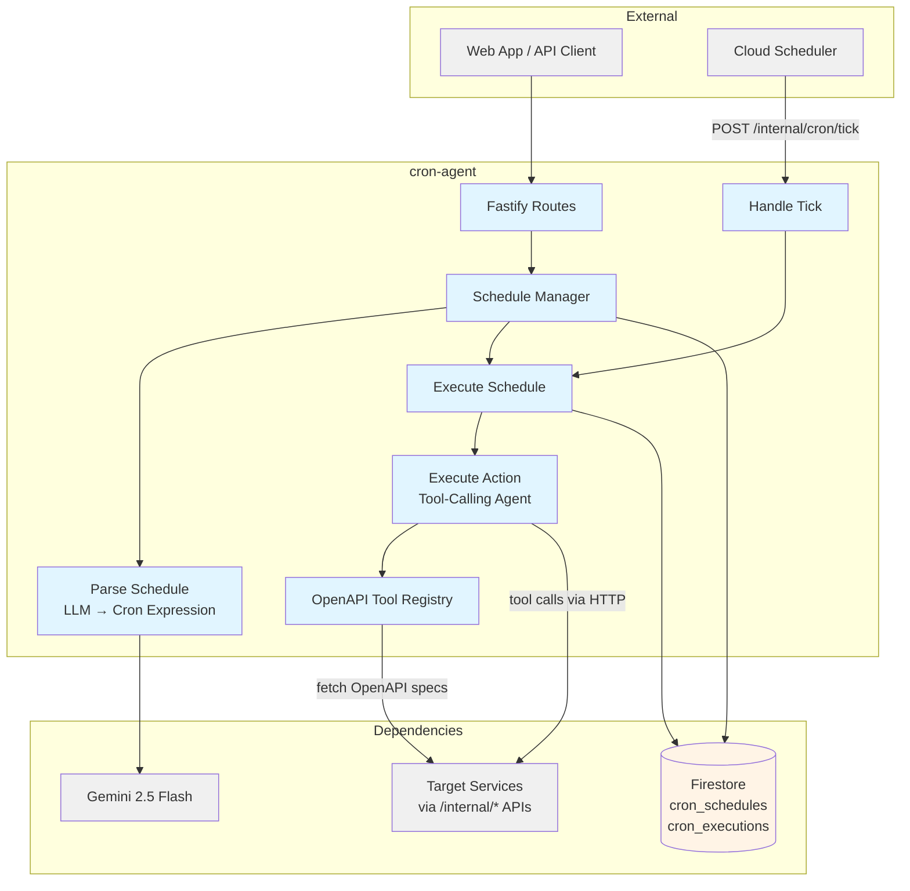
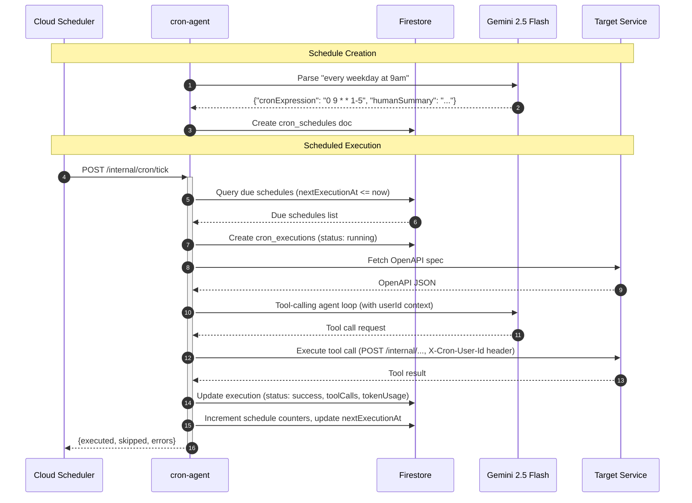

# Cron Agent — Technical Reference

## Overview

Cron Agent is an LLM-driven recurring schedule execution service. It accepts natural language schedule descriptions, converts them to cron expressions via Gemini 2.5 Flash, and executes user-defined instructions as autonomous tool-calling agents at scheduled intervals. Each tool call is scoped to the schedule owner's identity and restricted to per-service operation allowlists. Runs on Cloud Run as a Fastify application backed by Firestore for schedule and execution storage.

## Architecture



## Data Flow



## Recent Changes

Changes since v3.4.0, grouped by feature:

**Cron Agent Security & Config (INT-1288)**

| Commit      | Description                                                       | Date       |
| ----------- | ----------------------------------------------------------------- | ---------- |
| `c1247035`  | Inject schedule-owner userId into all tool calls                  | 2026-04-05 |
| `33f795a9`  | Populate allowedOperations per service; filter empty services     | 2026-04-05 |
| `fb8f52bf`  | Replace `description` with `schedule` input and `scheduleSummary` | 2026-04-05 |
| `e2611ffd`  | Remove legacy `description` fallback from Firestore repository    | 2026-04-05 |

**Tool Registry Logging (INT-1078)**

| Commit      | Description                                                       | Date       |
| ----------- | ----------------------------------------------------------------- | ---------- |
| `11800b8f`  | Improve tool registry logging for multi-service visibility        | 2026-03-24 |
| `7613bfc6`  | Add warn log when OpenAPI spec has no paths field                 | 2026-03-24 |
| `9e1e88b3`  | Re-add startup log in index.ts with differentiated context        | 2026-03-24 |

**Code Review & Fixes**

| Commit      | Description                                                       | Date       |
| ----------- | ----------------------------------------------------------------- | ---------- |
| `2462cdfc`  | Strengthen assertions and improve test style                      | 2026-03-26 |
| `6a8301a2`  | Move createSpyLogger to test-helpers for reusability              | 2026-03-24 |
| `089005e2`  | Address PR review comments                                        | 2026-03-24 |

## API Endpoints

### Public Endpoints

| Method | Path                          | Purpose                                       | Auth   |
| ------ | ----------------------------- | --------------------------------------------- | ------ |
| GET    | `/cron/services`              | List available services and their tools       | Bearer |
| GET    | `/cron/schedules`             | List schedules with status filter, pagination | Bearer |
| POST   | `/cron/schedules`             | Create a new schedule                         | Bearer |
| GET    | `/cron/schedules/:id`         | Get a specific schedule                       | Bearer |
| PATCH  | `/cron/schedules/:id`         | Update a schedule                             | Bearer |
| DELETE | `/cron/schedules/:id`         | Soft-delete a schedule                        | Bearer |
| POST   | `/cron/schedules/:id/trigger` | Manually trigger a schedule execution         | Bearer |
| GET    | `/cron/executions`            | List executions with filters                  | Bearer |
| GET    | `/cron/executions/:id`        | Get a specific execution                      | Bearer |

### Internal Endpoints

| Method | Path                   | Purpose                              | Caller          |
| ------ | ---------------------- | ------------------------------------ | --------------- |
| POST   | `/internal/cron/tick`  | Process all due schedules            | Cloud Scheduler |

### System Endpoints

| Method | Path             | Purpose             |
| ------ | ---------------- | ------------------- |
| GET    | `/health`        | Health check        |
| GET    | `/openapi.json`  | OpenAPI spec        |
| GET    | `/docs`          | Swagger UI          |

## Domain Model

### CronSchedule

| Field              | Type                                  | Description                                    |
| ------------------ | ------------------------------------- | ---------------------------------------------- |
| `id`               | `string`                              | Unique identifier                              |
| `userId`           | `string`                              | Owner user ID                                  |
| `name`             | `string`                              | Display name                                   |
| `scheduleSummary`  | `string`                              | Human-readable summary of the cron schedule    |
| `cronExpression`   | `string`                              | 5-field cron expression (LLM-generated)        |
| `timezone`         | `string`                              | IANA timezone (default: UTC)                   |
| `action`           | `ScheduleAction`                      | What to execute                                |
| `status`           | `'active' \                           | 'paused' \                                     | 'deleted'` | Current state |
| `lastExecutedAt`   | `string \                             | null`                                          | ISO timestamp of last execution |
| `nextExecutionAt`  | `string \                             | null`                                          | ISO timestamp of next scheduled run |
| `executionCount`   | `number`                              | Total executions                               |
| `failureCount`     | `number`                              | Total failed executions                        |
| `createdAt`        | `string`                              | ISO creation timestamp                         |
| `updatedAt`        | `string`                              | ISO last-update timestamp                      |

### ScheduleAction

| Field            | Type       | Description                                               |
| ---------------- | ---------- | --------------------------------------------------------- |
| `services`       | `string[]` | Service keys the agent can call (e.g., `["notes-agent"]`) |
| `instruction`    | `string`   | Natural language task instruction                         |
| `preferredTools` | `string[]` | Tool names to try first (optional)                        |

### CronExecution

| Field           | Type                                                       | Description                     |
| --------------- | ---------------------------------------------------------- | ------------------------------- |
| `id`            | `string`                                                   | Unique identifier               |
| `scheduleId`    | `string`                                                   | Parent schedule ID              |
| `scheduleName`  | `string`                                                   | Schedule name at execution time |
| `userId`        | `string`                                                   | Owner user ID                   |
| `status`        | `'running' \                                               | 'success' \                     | 'failure' \ | 'skipped'` | Execution state |
| `trigger`       | `'scheduled' \                                             | 'manual'`                       | How it was triggered |
| `startedAt`     | `string`                                                   | ISO start timestamp             |
| `completedAt`   | `string \                                                  | null`                           | ISO completion timestamp |
| `durationMs`    | `number \                                                  | null`                           | Total execution time |
| `toolCalls`     | `ToolCallLog[]`                                            | Detailed tool call records      |
| `agentResponse` | `string \                                                  | null`                           | Final agent summary |
| `tokenUsage`    | `TokenUsage \                                              | null`                           | LLM token consumption |
| `error`         | `string \                                                  | null`                           | Error message on failure |
| `createdAt`     | `string`                                                   | ISO creation timestamp          |

**Status Values:**

| Status    | Meaning                                     |
| --------- | ------------------------------------------- |
| `running` | Execution in progress                       |
| `success` | Completed without errors                    |
| `failure` | Completed with errors                       |
| `skipped` | Skipped due to overlapping execution        |

## Service Catalog

The cron-agent maintains an internal catalog of target services with per-service operation allowlists. Only operations explicitly listed in `allowedOperations` are exposed as tools. Services with empty allowlists and no `/internal/*` endpoints produce zero tools and are filtered from the discovery response.

| Service Key                    | Allowed Operations                                                                                                                        |
| ------------------------------ | ----------------------------------------------------------------------------------------------------------------------------------------- |
| `notion-service`               | `getInternalNotionContext`, `getPagePreview`                                                                                              |
| `mobile-notifications-service` | `queryNotificationsInternal`                                                                                                              |
| `research-agent`               | `createInternalResearchDraft`                                                                                                             |
| `actions-agent`                | `createAction`                                                                                                                            |
| `image-service`                | `generatePromptInternal`, `generateImageInternal`                                                                                         |
| `notes-agent`                  | `createNoteInternal`                                                                                                                      |
| `todos-agent`                  | `createTodoInternal`                                                                                                                      |
| `bookmarks-agent`              | `createBookmarkInternal`, `getBookmarkInternal`, `updateBookmarkInternal`                                                                 |
| `calendar-agent`               | `processCalendarAction`, `generateCalendarPreview`, `getCalendarPreview`, `generateCalendarPreviewDirect`                                 |
| `code-agent`                   | `getTaskDispatchMetadata`, `getLinearIssueContext`                                                                                        |
| `linear-agent`                 | `processLinearAction`, `validateIssue`, `generateIssueTitle`, `createIssueInternal`, `getLinearIssueInternal`, `updateIssueStateInternal` |
| `web-agent`                    | `fetchLinkPreviewsInternal`, `summarizePageInternal`                                                                                      |

Services with empty `allowedOperations` arrays (e.g., `user-service`, `whatsapp-service`, `commands-agent`, `app-settings-service`, `chat-agent`, `cron-agent`, `hellscript-agent`) expose all their `/internal/*` operations without restriction.

## Firestore Collections

| Collection         | Owner      | Purpose                     |
| ------------------ | ---------- | --------------------------- |
| `cron_schedules`   | cron-agent | Schedule definitions        |
| `cron_executions`  | cron-agent | Execution history and logs  |

## Dependencies

### External Services

| Service            | Purpose                                     | Failure Mode                             |
| ------------------ | ------------------------------------------- | ---------------------------------------- |
| Gemini 2.5 Flash   | Schedule parsing and tool-calling execution | Schedule creation fails; execution fails |
| Cloud Scheduler    | Periodic tick invocation                    | Schedules stop executing                 |

### Internal Services (Dynamic)

The cron-agent does not have fixed internal service dependencies. Instead, it dynamically discovers target services at runtime by fetching their OpenAPI specs. The set of available services is configured via the `INTERNAL_API_SERVICE_CATALOG` in `config.ts` and resolved from environment variables at startup. The agent only calls `/internal/*` endpoints on these target services, using `X-Internal-Auth` for authentication and `X-Cron-User-Id` to propagate the schedule owner's identity.

## Configuration

| Variable                          | Purpose                                 | Required |
| --------------------------------- | --------------------------------------- | -------- |
| `INTEXURAOS_GCP_PROJECT_ID`       | GCP project ID                          | Yes      |
| `INTEXURAOS_INTERNAL_AUTH_TOKEN`  | Shared token for internal service calls | Yes      |
| `INTEXURAOS_GEMINI_APP_API_KEY`   | Gemini API key for LLM calls            | Yes      |
| `INTEXURAOS_SENTRY_DSN`           | Sentry error tracking DSN               | Yes      |
| `INTEXURAOS_ENVIRONMENT`          | Environment name (dev/production)       | Yes      |
| `INTEXURAOS_AUTH_AUDIENCE`        | Auth0 audience (production only)        | Prod     |
| `INTEXURAOS_AUTH_ISSUER`          | Auth0 issuer URL (production only)      | Prod     |
| `INTEXURAOS_AUTH_JWKS_URL`        | Auth0 JWKS URL (production only)        | Prod     |

Additionally, each target service in `INTERNAL_API_SERVICE_CATALOG` requires a pair of environment variables: `INTEXURAOS_<SERVICE>_URL` and `INTEXURAOS_<SERVICE>_OPENAPI_URL`. Services without a configured URL are excluded at startup.

## Gotchas

- **Tick auth is dual-mode:** The `/internal/cron/tick` endpoint accepts both Cloud Scheduler OIDC tokens (JWT structure validated) and `X-Internal-Auth` headers. In production, OIDC validation relies on Cloud Run's infrastructure-level token check, not application-level verification. If Cloud Run ingress settings change, this endpoint would need explicit OIDC validation added.
- **Schedule re-parse on update:** Changing a schedule's `schedule` field triggers an LLM call to re-parse the cron expression. This means updates with a new schedule description are slower and can fail if the LLM cannot parse the new text.
- **Soft deletes only:** The DELETE endpoint sets `status: 'deleted'` and clears `nextExecutionAt` — it does not remove the Firestore document.
- **OpenAPI tool cache:** The `OpenApiToolRegistry` caches fetched tools in memory. Empty results (fetch failures) are intentionally not cached to allow recovery, but successful results persist until the service restarts. Cache is bypassed when a `userId` context is provided (to ensure user-specific headers).
- **Overlap protection:** Both scheduled ticks and manual triggers check for a running execution before starting a new one. The check queries Firestore for `status === 'running'` — there is no distributed lock, so a narrow race window exists under very high concurrency.
- **Response truncation:** Tool call responses are truncated at 50,000 bytes to prevent context overflow in the LLM agent loop.
- **User ID propagation:** The execute-action prompt enforces that the LLM agent must use exactly the schedule owner's `userId` when calling tools that require it. The `X-Cron-User-Id` header is also set on every outbound HTTP tool call for downstream services to verify ownership.
- **Empty service filtering:** Services that produce zero tools after OpenAPI discovery are filtered from the `GET /cron/services` response. This means a misconfigured service (no OpenAPI spec, no `/internal/*` routes) silently disappears from the available services list.

## File Structure

```
apps/cron-agent/src/
├── domain/
│   ├── cron-utils.ts              # computeNextExecution helper
│   ├── types.ts                   # CronSchedule, CronExecution, ScheduleAction
│   ├── ports/
│   │   ├── schedule-repository.ts # Schedule persistence interface
│   │   ├── execution-repository.ts# Execution persistence interface
│   │   └── tool-registry.ts       # Tool discovery interface
│   └── use-cases/
│       ├── parse-schedule.ts      # LLM-based cron expression parsing
│       ├── manage-schedule.ts     # CRUD + trigger orchestration
│       ├── execute-schedule.ts    # Single schedule execution lifecycle
│       ├── execute-action.ts      # LLM tool-calling agent loop
│       └── handle-tick.ts         # Process all due schedules
├── infra/
│   ├── firestore-schedule-repository.ts
│   ├── firestore-execution-repository.ts
│   └── openapi-tool-registry.ts   # Discovers tools from service OpenAPI specs
├── prompts/
│   ├── parse-schedule-prompt.ts   # v1.1.0 — NL → cron expression
│   └── execute-action-prompt.ts   # v3.0.0 — tool-calling system prompt with userId enforcement
├── routes/
│   ├── schedule-routes.ts         # Public schedule CRUD + trigger
│   ├── execution-routes.ts        # Public execution listing
│   ├── internal-routes.ts         # /internal/cron/tick
│   └── schemas.ts                 # Shared response schemas
├── config.ts                      # Service catalog with allowedOperations
├── services.ts
├── server.ts
├── openapi.config.ts
└── index.ts
```
