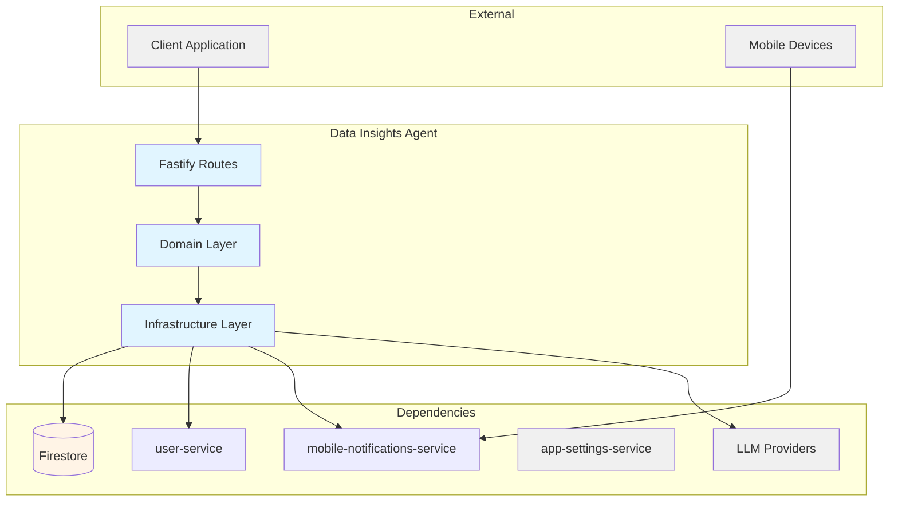
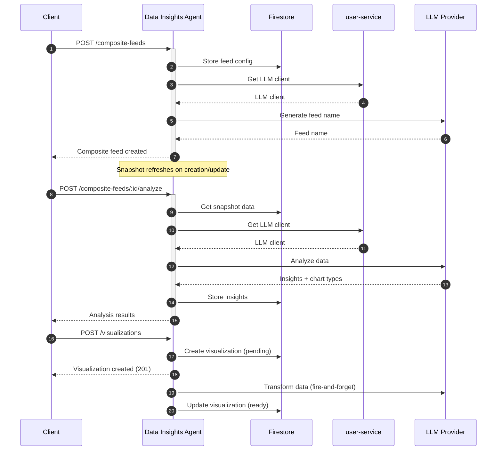

# Data Insights Agent — Technical Reference

## Overview

AI-powered data analysis service that combines static data sources with mobile notifications into composite feeds, performs LLM-driven analysis using user's configured API keys, and generates Vega-Lite chart definitions. Supports persistent visualizations with on-demand refresh. Runs on Cloud Run with Firestore persistence.

## Architecture



## Data Flow



## Recent Changes

| Commit     | Description                                                           | Date       |
| ---------- | --------------------------------------------------------------------- | ---------- |
| `93aeac4a` | Remove ZAI provider and GLM-4.7 models, finalize GLM-5 (INT-836)      | 2026-03-12 |
| `ace7850b` | Write tests for v8-ignore blocks (INT-791)                            | 2026-03-13 |
| `44ea683a` | Release v3.2.0                                                        | 2026-03-07 |
| `99febe66` | Wire GitHub OAuth integration and update cross-service mocks          | 2026-03-02 |
| `3608e1d6` | INT-595: Align TransformedDataSchema with prompt empty-array contract | 2026-02-23 |
| `b3f34d85` | Release v3.1.0                                                        | 2026-02-22 |
| `f1e27f57` | Remove scheduled snapshot refresh (saves ~6.5M tokens/day)            | 2026-02-21 |
| `c8a42105` | Release v3.0.0                                                        | 2026-02-19 |
| `f00798da` | Add saved visualizations feature (full CRUD + auto-refresh)           | 2026-02-17 |
| `6063175b` | Add dev-mode log formatting for PM2 readability                       | 2026-02-16 |
| `a52a6bbc` | Add Dash0 OpenTelemetry integration                                   | 2026-02-16 |
| `e60eafc1` | Standardize API key secrets to APP naming convention                  | 2026-02-15 |
| `c72b7c53` | Switch default LLM to Gemini 2.5 Flash + add fallback                 | 2026-02-15 |

## API Endpoints

### Public Endpoints

| Method | Path                                                            | Purpose                          | Auth   |
| ------ | --------------------------------------------------------------- | -------------------------------- | ------ |
| POST   | `/data-sources`                                                 | Create data source               | Bearer |
| GET    | `/data-sources`                                                 | List user's data sources         | Bearer |
| GET    | `/data-sources/:id`                                             | Get specific data source         | Bearer |
| PUT    | `/data-sources/:id`                                             | Update data source               | Bearer |
| DELETE | `/data-sources/:id`                                             | Delete data source               | Bearer |
| POST   | `/data-sources/generate-title`                                  | Generate AI title for content    | Bearer |
| POST   | `/composite-feeds`                                              | Create composite feed            | Bearer |
| GET    | `/composite-feeds`                                              | List composite feeds             | Bearer |
| GET    | `/composite-feeds/:id`                                          | Get composite feed               | Bearer |
| PUT    | `/composite-feeds/:id`                                          | Update composite feed            | Bearer |
| DELETE | `/composite-feeds/:id`                                          | Delete composite feed            | Bearer |
| GET    | `/composite-feeds/:id/schema`                                   | Get JSON schema for feed data    | Bearer |
| GET    | `/composite-feeds/:id/data`                                     | Get aggregated feed data         | Bearer |
| GET    | `/composite-feeds/:id/snapshot`                                 | Get pre-computed snapshot        | Bearer |
| POST   | `/composite-feeds/:feedId/analyze`                              | Analyze feed with AI             | Bearer |
| POST   | `/composite-feeds/:feedId/insights/:insightId/chart-definition` | Generate chart config            | Bearer |
| POST   | `/composite-feeds/:feedId/preview`                              | Transform data for chart preview | Bearer |
| POST   | `/visualizations`                                               | Create visualization             | Bearer |
| GET    | `/visualizations`                                               | List user's visualizations       | Bearer |
| GET    | `/visualizations/:id`                                           | Get visualization (poll status)  | Bearer |
| DELETE | `/visualizations/:id`                                           | Delete visualization             | Bearer |
| POST   | `/visualizations/:id/refresh`                                   | Manually refresh visualization   | Bearer |

### Internal Endpoints

| Method | Path                               | Purpose                    | Caller            |
| ------ | ---------------------------------- | -------------------------- | ----------------- |
| POST   | `/internal/visualizations/compute` | Compute visualization data | Internal services |

### System Endpoints

| Method | Path            | Purpose               | Auth |
| ------ | --------------- | --------------------- | ---- |
| GET    | `/health`       | Health check          | None |
| GET    | `/openapi.json` | OpenAPI specification | None |

## Domain Model

### DataSource

| Field       | Type     | Description                   |
| ----------- | -------- | ----------------------------- |
| `id`        | `string` | Unique identifier             |
| `userId`    | `string` | Owner user ID                 |
| `title`     | `string` | Data source title (max 200)   |
| `content`   | `string` | Data content (max 60,000)     |
| `createdAt` | `Date`   | Creation timestamp            |
| `updatedAt` | `Date`   | Last update timestamp         |

### CompositeFeed

| Field                 | Type                         | Description                    |
| --------------------- | ---------------------------- | ------------------------------ |
| `id`                  | `string`                     | Unique identifier              |
| `userId`              | `string`                     | Owner user ID                  |
| `name`                | `string`                     | AI-generated feed name         |
| `purpose`             | `string`                     | User-provided purpose (max 1K) |
| `staticSourceIds`     | `string[]`                   | Data source IDs (max 5)        |
| `notificationFilters` | `NotificationFilterConfig[]` | Notification filter configs    |
| `dataInsights`        | `DataInsight[] \             | null`                          | AI analysis results |
| `createdAt`           | `Date`                       | Creation timestamp             |
| `updatedAt`           | `Date`                       | Last update timestamp          |

### NotificationFilterConfig

| Field    | Type       | Description                  |
| -------- | ---------- | ---------------------------- |
| `id`     | `string`   | Filter identifier            |
| `name`   | `string`   | Filter name                  |
| `app`    | `string[]` | Multi-select app filter      |
| `source` | `string`   | Single-select source filter  |
| `title`  | `string`   | Title filter substring match |

### DataInsight

| Field                | Type          | Description                    |
| -------------------- | ------------- | ------------------------------ |
| `id`                 | `string`      | Unique identifier              |
| `title`              | `string`      | Insight title                  |
| `description`        | `string`      | Insight description            |
| `trackableMetric`    | `string`      | Measurable metric to track     |
| `suggestedChartType` | `ChartTypeId` | Recommended chart type (C1–C6) |
| `generatedAt`        | `string`      | ISO timestamp                  |

**Chart Type Values:**

| Type | Name         | Best For                         |
| ---- | ------------ | -------------------------------- |
| `C1` | Line Chart   | Time-series trends               |
| `C2` | Bar Chart    | Category comparison              |
| `C3` | Scatter Plot | Correlation analysis             |
| `C4` | Area Chart   | Cumulative trends                |
| `C5` | Pie Chart    | Part-to-whole composition        |
| `C6` | Heatmap      | Density patterns and matrix data |

### Snapshot (DataInsightSnapshot)

| Field         | Type     | Description                  |
| ------------- | -------- | ---------------------------- |
| `id`          | `string` | Unique identifier            |
| `feedId`      | `string` | Associated composite feed ID |
| `userId`      | `string` | Owner user ID                |
| `feedName`    | `string` | Feed name at snapshot time   |
| `generatedAt` | `Date`   | Snapshot creation timestamp  |
| `expiresAt`   | `Date`   | Snapshot expiration (15 min) |
| `data`        | `object` | Aggregated feed data         |

### Visualization

| Field                   | Type                                              | Description                     |
| ----------------------- | ------------------------------------------------- | ------------------------------- |
| `id`                    | `string`                                          | Unique identifier               |
| `userId`                | `string`                                          | Owner user ID                   |
| `feedId`                | `string`                                          | Associated composite feed ID    |
| `feedName`              | `string`                                          | Feed name at creation time      |
| `insightId`             | `string`                                          | Associated insight ID           |
| `insightTitle`          | `string`                                          | Insight title at creation time  |
| `trackableMetric`       | `string`                                          | Metric being tracked            |
| `chartConfig`           | `object`                                          | Vega-Lite spec (without data)   |
| `transformInstructions` | `string`                                          | LLM data transform instructions |
| `chartData`             | `unknown[] \                                      | null`                           | Computed chart data |
| `status`                | `'pending' \                                      | 'ready' \                       | 'refreshing' \ | 'error'` | Computation lifecycle status |
| `lastError`             | `string?`                                         | Last error message if any       |
| `lastRefreshedAt`       | `Date?`                                           | Timestamp of last data refresh  |
| `createdAt`             | `Date`                                            | Creation timestamp              |
| `updatedAt`             | `Date`                                            | Last update timestamp           |

**Status Lifecycle:** `pending` -> `ready` (or `error`). Manual refreshes use `refreshing` as intermediate state.

**Limit:** Max 10 visualizations per composite feed.

## Dependencies

### External Services

| Service              | Purpose                                            | Failure Mode                       |
| -------------------- | -------------------------------------------------- | ---------------------------------- |
| LLM Providers        | Data analysis, title generation, chart generation  | Return error, prompt configure key |
| Firestore            | Data persistence                                   | Propagate error                    |
| user-service         | LLM client management, API key resolution          | Propagate error                    |
| app-settings-service | LLM pricing data at startup                        | Fail-fast (startup crash)          |

### Internal Services

| Service                      | Endpoint          | Purpose                      |
| ---------------------------- | ----------------- | ---------------------------- |
| user-service                 | (internal client) | Get user's LLM API key       |
| mobile-notifications-service | (internal client) | Query filtered notifications |
| app-settings-service         | (internal client) | Fetch LLM pricing at boot    |

## Configuration

| Variable                                      | Required | Description                                           |
| --------------------------------------------- | -------- | ----------------------------------------------------- |
| `INTEXURAOS_GCP_PROJECT_ID`                   | Yes      | GCP project ID                                        |
| `INTEXURAOS_AUTH_JWKS_URL`                    | Yes      | Auth0 JWKS endpoint                                   |
| `INTEXURAOS_AUTH_ISSUER`                      | Yes      | Auth0 issuer URL                                      |
| `INTEXURAOS_AUTH_AUDIENCE`                    | Yes      | Auth0 audience                                        |
| `INTEXURAOS_INTERNAL_AUTH_TOKEN`              | Yes      | Internal service auth token                           |
| `INTEXURAOS_USER_SERVICE_URL`                 | Yes      | user-service base URL                                 |
| `INTEXURAOS_MOBILE_NOTIFICATIONS_SERVICE_URL` | Yes      | mobile-notifications base URL                         |
| `INTEXURAOS_APP_SETTINGS_SERVICE_URL`         | Yes      | app-settings base URL (for pricing)                   |
| `INTEXURAOS_SENTRY_DSN`                       | No       | Sentry DSN for error tracking (omit to disable)       |
| `INTEXURAOS_ENVIRONMENT`                      | No       | Environment name for Sentry (default: `development`)  |
| `INTEXURAOS_GEMINI_APP_API_KEY`               | No       | Platform-level Gemini API key (fallback LLM provider) |

## LLM Models

| Model             | Constant          | Purpose                             |
| ----------------- | ----------------- | ----------------------------------- |
| Gemini 2.5 Flash  | `Gemini25Flash`   | Default model for all LLM tasks     |

## Gotchas

- **Delete protection**: Data sources used by composite feeds return 409 Conflict with feed names listed
- **LLM repair pattern**: Analysis auto-retries with repair prompt on parse failure (INT-79)
- **Empty insights**: Returns success with empty array and `noInsightsReason` instead of error (INT-77)
- **Empty transform results**: Data transform accepts empty arrays (`[]`) as valid output when zero rows match the transformation criteria (INT-595)
- **Chart type IDs**: Use compact format (C1–C6) not full names in storage
- **Snapshot refresh**: Snapshots refresh on feed creation and update only (scheduled refresh was removed to save ~6.5M tokens/day)
- **Snapshot ?refresh=true**: The `GET /composite-feeds/:id/snapshot` endpoint accepts a `refresh=true` query param to force on-demand refresh
- **Visualization async compute**: `POST /visualizations` returns 201 immediately with `status: pending`; poll `GET /visualizations/:id` until `status: ready` or `error`
- **Visualization limit**: Max 10 per feed; creation returns 400 `INVALID_REQUEST` when exceeded
- **Visualization refresh idempotency**: `POST /visualizations/:id/refresh` returns current state without queuing duplicate computation if already `refreshing`
- **Orphaned visualizations**: When re-analysis replaces insights, visualizations linked to removed insights are marked as `error` with "Parent insight was replaced during re-analysis"
- **Feed deletion cascade**: Deleting a composite feed also deletes its snapshot and all associated visualizations (non-fatal warnings on failure)
- **Default LLM**: Gemini 2.5 Flash (with platform Gemini fallback)
- **Internal client**: Uses `@intexuraos/internal-clients` package for user-service access (INT-269)
- **Response contract**: All routes use `reply.ok()` / `reply.fail()` instead of raw `reply.send()`
- **Sentry logging**: Uses `createAppLogger()` from `@intexuraos/infra-sentry` (not raw `pino()`)
- **Pricing at startup**: Fetches LLM pricing from app-settings-service at boot; fails fast if unavailable

## File Structure

```
apps/data-insights-agent/src/
├── domain/
│   ├── dataSource/          # Data source models and ports
│   │   ├── models/          # DataSource entity, MAX_CONTENT_LENGTH, MAX_TITLE_LENGTH
│   │   └── ports/           # DataSourceRepository interface
│   ├── compositeFeed/       # Composite feed models and ports
│   │   ├── models/          # CompositeFeed, NotificationFilterConfig, limits
│   │   ├── schemas/         # Zod schemas (CompositeFeedData, getCompositeFeedJsonSchema)
│   │   ├── ports/           # Repository, FeedNameGenerationService, MobileNotificationsClient
│   │   └── usecases/        # createCompositeFeed, getCompositeFeedData
│   ├── snapshot/            # Snapshot caching
│   │   ├── models/          # DataInsightSnapshot entity, SNAPSHOT_TTL_MINUTES
│   │   ├── ports/           # SnapshotRepository interface
│   │   └── usecases/        # refreshSnapshot, getDataInsightSnapshot
│   ├── dataInsights/        # AI analysis capabilities
│   │   ├── types.ts         # DataInsight, ChartTypeDefinition, MAX_INSIGHTS_PER_FEED
│   │   ├── chartTypes.ts    # CHART_TYPES array (C1–C6 with Vega-Lite schemas)
│   │   ├── ports.ts         # DataAnalysisService, ChartDefinitionService, DataTransformService
│   │   ├── utils.ts         # buildCompositeFeedSchema helper
│   │   └── usecases/        # analyzeData, generateChartDefinition, transformDataForPreview
│   └── visualization/       # Saved visualization management
│       ├── models/          # Visualization entity, VisualizationStatus, MAX_VISUALIZATIONS_PER_FEED
│       ├── ports/           # VisualizationRepository interface
│       └── usecases/        # createVisualization, computeVisualization, refreshFeedVisualizations
│                            # listVisualizations, getVisualization, deleteVisualization
├── infra/
│   ├── firestore/           # Repository implementations
│   │   ├── dataSourceRepository.ts
│   │   ├── compositeFeedRepository.ts
│   │   ├── snapshotRepository.ts
│   │   └── visualizationRepository.ts
│   ├── gemini/              # LLM service implementations
│   │   ├── dataAnalysisService.ts      # Includes LLM repair pattern
│   │   ├── chartDefinitionService.ts
│   │   ├── dataTransformService.ts
│   │   ├── titleGenerationService.ts
│   │   └── feedNameGenerationService.ts
│   └── http/                # External service clients
│       └── mobileNotificationsClient.ts
├── routes/
│   ├── dataSourceRoutes.ts        # CRUD + generate-title
│   ├── compositeFeedRoutes.ts     # CRUD + schema/data/snapshot
│   ├── dataInsightsRoutes.ts      # analyze + chart-definition + preview
│   ├── visualizationRoutes.ts     # CRUD + refresh
│   └── internalRoutes.ts          # compute visualization
├── services.ts              # DI container (10 services)
├── config.ts                # Environment configuration (Zod validated)
├── server.ts                # Fastify app builder
└── index.ts                 # Entry point (pricing fetch, service wiring)
```

## Firestore Collections

| Collection                 | Owner               | Access Pattern              |
| -------------------------- | ------------------- | --------------------------- |
| `custom_data_sources`      | data-insights-agent | By userId, by id            |
| `composite_feeds`          | data-insights-agent | By userId, by id            |
| `composite_feed_snapshots` | data-insights-agent | By feedId+userId            |
| `visualizations`           | data-insights-agent | By userId, by feedId, by id |
