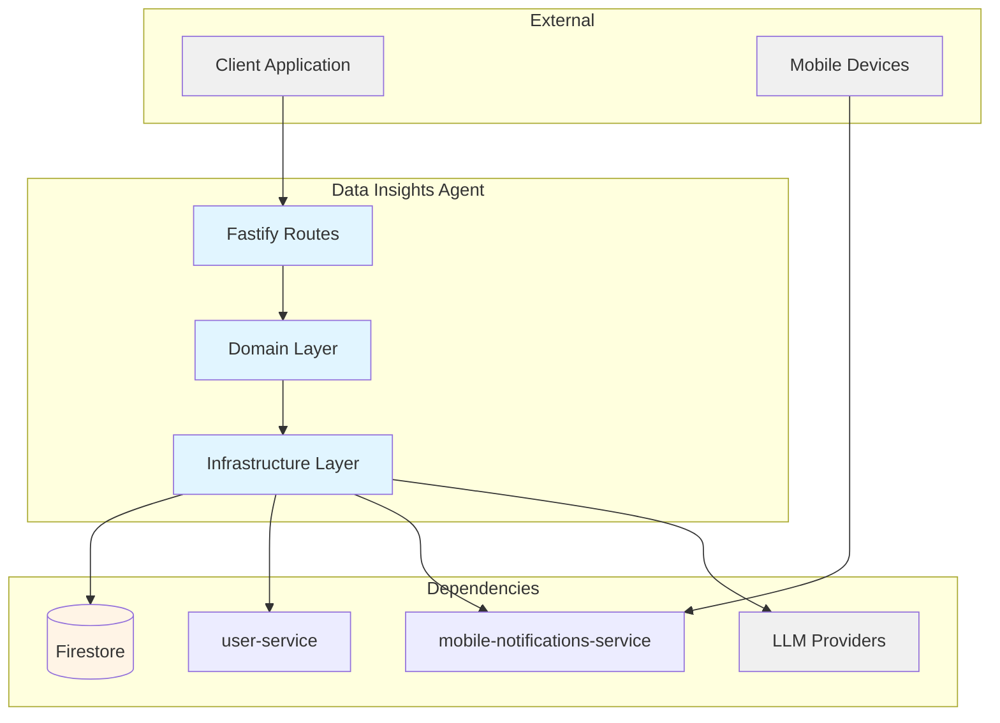
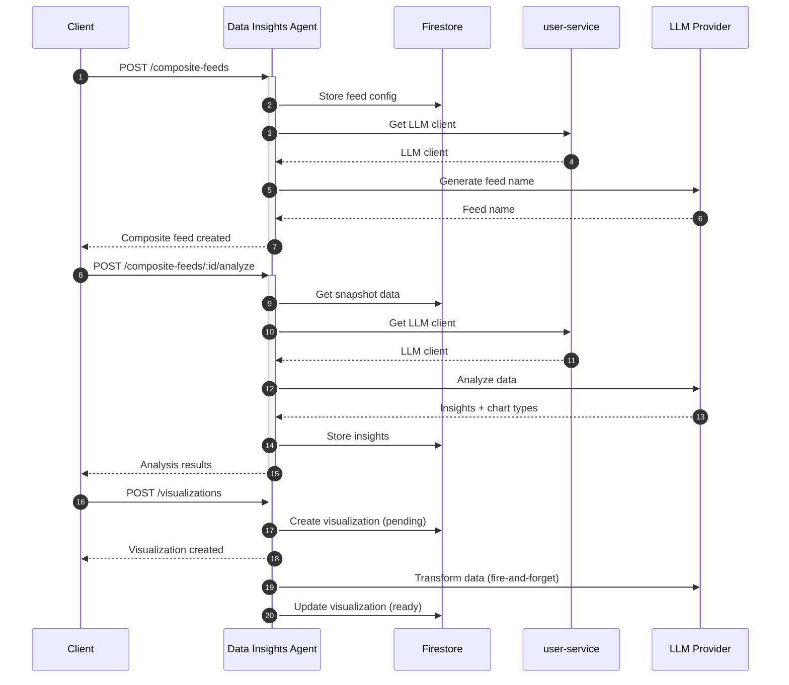

# Data Insights Agent — Technical Reference

## Overview

AI-powered data analysis service that combines static data sources with mobile notifications into composite feeds, performs LLM-driven analysis using user's configured API keys, and generates Vega-Lite chart definitions. Supports persistent visualizations that auto-refresh with snapshot data. Runs on Cloud Run with Firestore persistence.

## Architecture



## Data Flow



## Recent Changes

| Commit     | Description                                                | Date       |
| ---------- | ---------------------------------------------------------- | ---------- |
| `f00798da` | Add saved visualizations feature (full CRUD + auto-refresh)| 2026-02-17 |
| `6063175b` | Add dev-mode log formatting for PM2 readability            | 2026-02-16 |
| `a52a6bbc` | Add Dash0 OpenTelemetry integration                        | 2026-02-16 |
| `e60eafc1` | Standardize API key secrets to APP naming convention       | 2026-02-15 |
| `c72b7c53` | Switch default LLM to Gemini 2.5 Flash + add fallback      | 2026-02-15 |
| `0f69a74b` | Add default model selector with platform Zai fallback      | 2026-02-08 |
| `5aa3e1bd` | INT-427 Enable strict 100% coverage enforcement            | 2026-01-31 |
| `c3198407` | Fix response contract violations (reply.ok/reply.fail)     | 2026-01-30 |
| `dfd702f1` | Migrate to Sentry-enabled createAppLogger                  | 2026-01-30 |
| `73e8375f` | INT-408 Enforce mandatory env var registration             | 2026-01-28 |
| `1faa1d3b` | INT-301 Consolidate user service client architecture       | 2026-01-26 |

## API Endpoints

### Public Endpoints

| Method | Path                                                            | Purpose                          | Auth   |
| ------ | --------------------------------------------------------------- | -------------------------------- | ------ |
| POST   | `/data-sources`                                                 | Create data source               | Bearer |
| GET    | `/data-sources`                                                 | List user's data sources         | Bearer |
| GET    | `/data-sources/:id`                                             | Get specific data source         | Bearer |
| PUT    | `/data-sources/:id`                                             | Update data source               | Bearer |
| DELETE | `/data-sources/:id`                                             | Delete data source               | Bearer |
| POST   | `/data-sources/generate-title`                                  | Generate AI title for content    | Bearer |
| POST   | `/composite-feeds`                                              | Create composite feed            | Bearer |
| GET    | `/composite-feeds`                                              | List composite feeds             | Bearer |
| GET    | `/composite-feeds/:id`                                          | Get composite feed               | Bearer |
| PUT    | `/composite-feeds/:id`                                          | Update composite feed            | Bearer |
| DELETE | `/composite-feeds/:id`                                          | Delete composite feed            | Bearer |
| GET    | `/composite-feeds/:id/schema`                                   | Get JSON schema for feed data    | Bearer |
| GET    | `/composite-feeds/:id/data`                                     | Get aggregated feed data         | Bearer |
| GET    | `/composite-feeds/:id/snapshot`                                 | Get pre-computed snapshot        | Bearer |
| POST   | `/composite-feeds/:feedId/analyze`                              | Analyze feed with AI             | Bearer |
| POST   | `/composite-feeds/:feedId/insights/:insightId/chart-definition` | Generate chart config            | Bearer |
| POST   | `/composite-feeds/:feedId/preview`                              | Transform data for chart preview | Bearer |
| POST   | `/visualizations`                                               | Create visualization             | Bearer |
| GET    | `/visualizations`                                               | List user's visualizations       | Bearer |
| GET    | `/visualizations/:id`                                           | Get visualization (poll status)  | Bearer |
| DELETE | `/visualizations/:id`                                           | Delete visualization             | Bearer |
| POST   | `/visualizations/:id/refresh`                                   | Manually refresh visualization   | Bearer |

### Internal Endpoints

| Method | Path                              | Purpose                        | Caller                    |
| ------ | --------------------------------- | ------------------------------ | ------------------------- |
| POST   | `/internal/snapshots/refresh`     | Refresh all feed snapshots     | Cloud Scheduler (Pub/Sub) |
| POST   | `/internal/visualizations/compute`| Compute visualization data     | Internal services         |

## Domain Model

### DataSource

| Field       | Type   | Description                   |
| ----------- | ------ | ----------------------------- |
| `id`        | string | Unique identifier             |
| `userId`    | string | Owner user ID                 |
| `title`     | string | Data source title             |
| `content`   | string | Data content (CSV, JSON, etc) |
| `createdAt` | Date   | Creation timestamp            |
| `updatedAt` | Date   | Last update timestamp         |

### CompositeFeed

| Field                 | Type                       | Description                 |
| --------------------- | -------------------------- | --------------------------- |
| `id`                  | string                     | Unique identifier           |
| `userId`              | string                     | Owner user ID               |
| `name`                | string                     | AI-generated feed name      |
| `purpose`             | string                     | User-provided feed purpose  |
| `staticSourceIds`     | string[]                   | Data source IDs (max 5)     |
| `notificationFilters` | NotificationFilterConfig[] | Notification filter configs |
| `dataInsights`        | DataInsight[] \| null      | AI analysis results         |
| `createdAt`           | Date                       | Creation timestamp          |
| `updatedAt`           | Date                       | Last update timestamp       |

### NotificationFilterConfig

| Field    | Type     | Description                  |
| -------- | -------- | ---------------------------- |
| `id`     | string   | Filter identifier            |
| `name`   | string   | Filter name                  |
| `app`    | string[] | Multi-select app filter      |
| `source` | string   | Single-select source filter  |
| `title`  | string   | Title filter substring match |

### DataInsight

| Field                | Type        | Description                    |
| -------------------- | ----------- | ------------------------------ |
| `id`                 | string      | Unique identifier              |
| `title`              | string      | Insight title                  |
| `description`        | string      | Insight description            |
| `trackableMetric`    | string      | Measurable metric to track     |
| `suggestedChartType` | ChartTypeId | Recommended chart type (C1-C6) |
| `generatedAt`        | string      | ISO timestamp                  |

**Chart Type Values:**

| Type | Name         | Best For                         |
| ---- | ------------ | -------------------------------- |
| `C1` | Line Chart   | Time-series trends               |
| `C2` | Bar Chart    | Category comparison              |
| `C3` | Scatter Plot | Correlation analysis             |
| `C4` | Area Chart   | Cumulative trends                |
| `C5` | Pie Chart    | Part-to-whole composition        |
| `C6` | Heatmap      | Density patterns and matrix data |

### Snapshot

| Field         | Type   | Description                  |
| ------------- | ------ | ---------------------------- |
| `id`          | string | Unique identifier            |
| `feedId`      | string | Associated composite feed ID |
| `userId`      | string | Owner user ID                |
| `feedName`    | string | Feed name at snapshot time   |
| `generatedAt` | Date   | Snapshot creation timestamp  |
| `expiresAt`   | Date   | Snapshot expiration (15 min) |
| `data`        | object | Aggregated feed data         |

### Visualization

| Field                  | Type                                             | Description                      |
| ---------------------- | ------------------------------------------------ | -------------------------------- |
| `id`                   | string                                           | Unique identifier                |
| `userId`               | string                                           | Owner user ID                    |
| `feedId`               | string                                           | Associated composite feed ID     |
| `feedName`             | string                                           | Feed name at creation time       |
| `insightId`            | string                                           | Associated insight ID            |
| `insightTitle`         | string                                           | Insight title at creation time   |
| `trackableMetric`      | string                                           | Metric being tracked             |
| `chartConfig`          | object                                           | Vega-Lite spec (without data)    |
| `transformInstructions`| string                                           | LLM data transform instructions  |
| `chartData`            | unknown[] \| null                                | Computed chart data              |
| `status`               | `pending` \| `ready` \| `refreshing` \| `error` | Computation lifecycle status     |
| `lastError`            | string?                                          | Last error message if any        |
| `lastRefreshedAt`      | Date?                                            | Timestamp of last data refresh   |
| `createdAt`            | Date                                             | Creation timestamp               |
| `updatedAt`            | Date                                             | Last update timestamp            |

**Status Lifecycle:** `pending` → `ready` (or `error`). Manual and scheduled refreshes use `refreshing` as intermediate state.

**Limit:** Max 10 visualizations per composite feed.

## Pub/Sub

### Subscribed Events

| Topic       | Handler                        | Action                                          |
| ----------- | ------------------------------ | ----------------------------------------------- |
| (scheduled) | `/internal/snapshots/refresh`  | Refresh all feed snapshots + feed visualizations |

## Dependencies

### External Services

| Service       | Purpose                                           | Failure Mode                       |
| ------------- | ------------------------------------------------- | ---------------------------------- |
| LLM Providers | Data analysis, title generation, chart generation | Return error, prompt configure key |
| Firestore     | Data persistence                                  | Propagate error                    |
| user-service  | LLM client management                             | Propagate error                    |

### Internal Services

| Service                      | Endpoint          | Purpose                      |
| ---------------------------- | ----------------- | ---------------------------- |
| user-service                 | (internal client) | Get user's LLM API key       |
| mobile-notifications-service | (internal client) | Query filtered notifications |

## Configuration

| Variable                                      | Required | Description                                          |
| --------------------------------------------- | -------- | ---------------------------------------------------- |
| `INTEXURAOS_GCP_PROJECT_ID`                   | Yes      | GCP project ID                                       |
| `INTEXURAOS_AUTH_JWKS_URL`                    | Yes      | Auth0 JWKS endpoint                                  |
| `INTEXURAOS_AUTH_ISSUER`                      | Yes      | Auth0 issuer URL                                     |
| `INTEXURAOS_AUTH_AUDIENCE`                    | Yes      | Auth0 audience                                       |
| `INTEXURAOS_INTERNAL_AUTH_TOKEN`              | Yes      | Internal service auth token                          |
| `INTEXURAOS_USER_SERVICE_URL`                 | Yes      | user-service base URL                                |
| `INTEXURAOS_MOBILE_NOTIFICATIONS_SERVICE_URL` | Yes      | mobile-notifications base URL                        |
| `INTEXURAOS_APP_SETTINGS_SERVICE_URL`         | Yes      | app-settings base URL (for pricing)                  |
| `INTEXURAOS_SENTRY_DSN`                       | No       | Sentry DSN for error tracking (omit to disable)      |
| `INTEXURAOS_ENVIRONMENT`                      | No       | Environment name for Sentry (default: `development`) |
| `INTEXURAOS_ZAI_APP_API_KEY`                  | No       | Platform-level Zai API key (fallback LLM provider)   |
| `INTEXURAOS_GEMINI_APP_API_KEY`               | No       | Platform-level Gemini API key (fallback LLM provider)|

## Gotchas

- **Delete protection**: Data sources used by composite feeds return 409 Conflict with feed names
- **LLM repair pattern**: Analysis auto-retries with repair prompt on parse failure (INT-79)
- **Empty insights**: Returns success with empty array and `noInsightsReason` instead of error (INT-77)
- **Chart type IDs**: Use compact format (C1-C6) not full names in storage
- **Snapshot expiration**: Snapshots expire after 15 minutes, scheduled job refreshes all feeds
- **Visualization async compute**: `POST /visualizations` returns 201 immediately with `status: pending`; poll `GET /visualizations/:id` until `status: ready` or `error`
- **Visualization auto-refresh**: Every scheduled snapshot refresh also recomputes all feed visualizations via `refreshFeedVisualizations`
- **Visualization limit**: Max 10 per feed; creation returns 400 `INVALID_REQUEST` when exceeded
- **Default LLM**: Gemini 2.5 Flash (with Gemini fallback); Zai available as alternative platform
- **Internal client**: Uses `@intexuraos/internal-clients` package for user-service access (INT-269)
- **Response contract**: All routes use `reply.ok()` / `reply.fail()` instead of raw `reply.send()`
- **Sentry logging**: Uses `createAppLogger()` from `@intexuraos/infra-sentry` (not raw `pino()`)

## File Structure

```
apps/data-insights-agent/src/
├── domain/
│   ├── dataSource/          # Data source models and ports
│   │   ├── models/          # DataSource entity
│   │   └── ports/           # DataSourceRepository interface
│   ├── compositeFeed/       # Composite feed models and ports
│   │   ├── models/          # CompositeFeed, NotificationFilterConfig
│   │   ├── schemas/         # Zod schemas
│   │   ├── ports/           # Repository and service interfaces
│   │   └── usecases/        # createCompositeFeed, getCompositeFeedData
│   ├── snapshot/            # Snapshot caching
│   │   ├── models/          # Snapshot entity
│   │   ├── ports/           # SnapshotRepository interface
│   │   └── usecases/        # refreshSnapshot, refreshAllSnapshots, getDataInsightSnapshot
│   ├── dataInsights/        # AI analysis capabilities
│   │   ├── types.ts         # DataInsight, ChartTypeDefinition
│   │   ├── chartTypes.ts    # CHART_TYPES array (C1-C6)
│   │   ├── ports.ts         # Service interfaces
│   │   └── usecases/        # analyzeData, generateChartDefinition, transformDataForPreview
│   └── visualization/       # Saved visualization management
│       ├── models/          # Visualization entity, VisualizationStatus
│       ├── ports/           # VisualizationRepository interface
│       └── usecases/        # createVisualization, computeVisualization, refreshFeedVisualizations
│                            # listVisualizations, getVisualization, deleteVisualization
├── infra/
│   ├── firestore/           # Repository implementations
│   │   ├── dataSourceRepository.ts
│   │   ├── compositeFeedRepository.ts
│   │   ├── snapshotRepository.ts
│   │   └── visualizationRepository.ts
│   ├── gemini/              # LLM service implementations
│   │   ├── dataAnalysisService.ts
│   │   ├── chartDefinitionService.ts
│   │   ├── dataTransformService.ts
│   │   ├── titleGenerationService.ts
│   │   └── feedNameGenerationService.ts
│   ├── http/                # External service clients
│   │   └── mobileNotificationsClient.ts
├── routes/
│   ├── dataSourceRoutes.ts
│   ├── compositeFeedRoutes.ts
│   ├── dataInsightsRoutes.ts
│   ├── visualizationRoutes.ts  # Full visualization CRUD + refresh
│   └── internalRoutes.ts    # Scheduled snapshot refresh + compute visualization
├── services.ts              # DI container
├── config.ts                # Environment configuration
├── server.ts                # Fastify app builder
└── index.ts                 # Entry point
```

## Firestore Collections

| Collection                 | Owner               | Access Pattern               |
| -------------------------- | ------------------- | ---------------------------- |
| `custom_data_sources`      | data-insights-agent | By userId, by id             |
| `composite_feeds`          | data-insights-agent | By userId, by id             |
| `composite_feed_snapshots` | data-insights-agent | By feedId+userId, TTL 15m    |
| `visualizations`           | data-insights-agent | By userId, by feedId, by id  |
