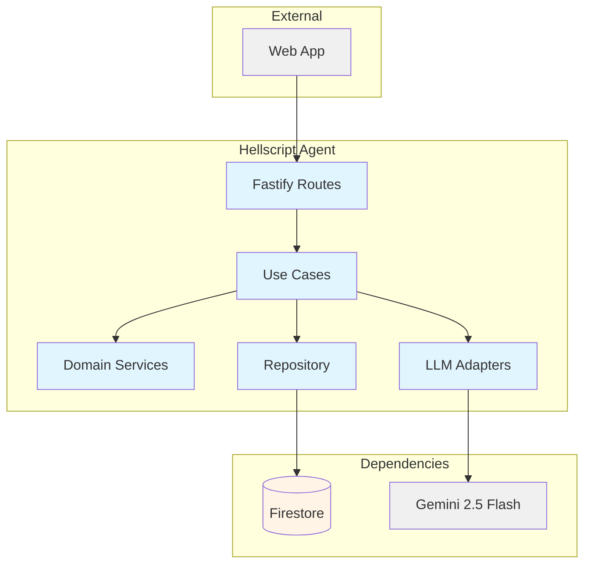
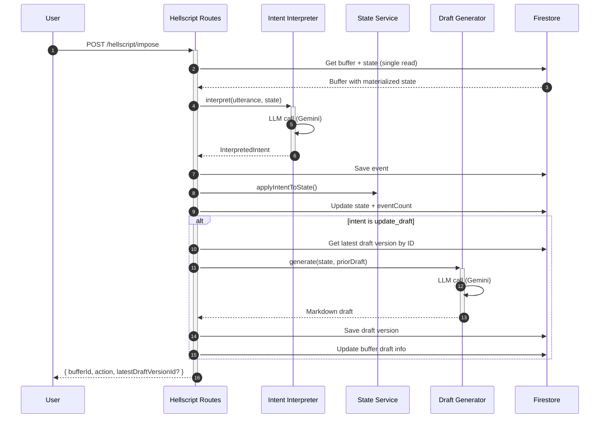

# Hellscript Agent — Technical Reference

## Overview

Hellscript Agent is a voice-to-draft writing assistant that accumulates user utterances into a structured buffer, interprets intent via Gemini 2.5 Flash, and generates versioned markdown drafts. Runs on Cloud Run as a Fastify service. Depends on Firestore for persistence and the `@intexuraos/infra-gemini` package for LLM access.

## Architecture



## Data Flow



## Recent Changes

New service introduced in v3.4.0 (INT-1032).

| Commit      | Description                                                    | Date       |
| ----------- | -------------------------------------------------------------- | ---------- |
| `9d648f74c` | Return Result from DraftGenerator to prevent permanent failure | 2026-03-20 |
| `400736876` | Wrap state fields in XML tags in interpret prompt              | 2026-03-20 |
| `011143ad4` | Eliminate redundant Firestore reads in imposeOnBuffer          | 2026-03-20 |
| `fc5533e45` | Address third code review findings                             | 2026-03-20 |
| `5b3ba5e26` | Address second code review findings                            | 2026-03-20 |
| `86c15b031` | Address security and code quality review findings              | 2026-03-20 |
| `3547b7407` | Implement Hellscript Agent MVP                                 | 2026-03-20 |

## API Endpoints

### Public Endpoints

| Method | Path                      | Purpose                                           | Auth   |
| ------ | ------------------------- | ------------------------------------------------- | ------ |
| POST   | `/hellscript/impose`      | Send an utterance to a buffer (creates if needed) | Bearer |
| GET    | `/hellscript/buffers`     | List all buffers for the authenticated user       | Bearer |
| GET    | `/hellscript/buffers/:id` | Get buffer workspace (events, drafts, state)      | Bearer |

### System Endpoints

| Method | Path             | Purpose                | Auth |
| ------ | ---------------- | ---------------------- | ---- |
| GET    | `/health`        | Health check           | None |
| GET    | `/openapi.json`  | OpenAPI specification  | None |
| GET    | `/docs`          | Swagger UI             | None |

## Domain Model

### HellscriptBuffer

| Field                      | Type             | Description                              |
| -------------------------- | ---------------- | ---------------------------------------- |
| `id`                       | `string`         | Unique identifier (Firestore doc ID)     |
| `userId`                   | `string`         | Owner user ID                            |
| `title`                    | `string`         | Auto-derived from first thought (max 80) |
| `eventCount`               | `number`         | Cached count of events                   |
| `latestDraftVersionNumber` | `number \        | null`                                    | Cached latest draft version number |
| `latestDraftVersionId`     | `string \        | null`                                    | Cached latest draft version ID |
| `createdAt`                | `string`         | ISO 8601 timestamp                       |
| `updatedAt`                | `string`         | ISO 8601 timestamp                       |

### HellscriptEvent

| Field          | Type                | Description                          |
| -------------- | ------------------- | ------------------------------------ |
| `id`           | `string`            | Unique identifier (Firestore doc ID) |
| `bufferId`     | `string`            | Parent buffer ID                     |
| `rawUtterance` | `string`            | Original user input                  |
| `intent`       | `InterpretedIntent` | Parsed intent from LLM               |
| `createdAt`    | `string`            | ISO 8601 timestamp                   |

### InterpretedIntent

| Field            | Type                       | Description                     |
| ---------------- | -------------------------- | ------------------------------- |
| `kind`           | `IntentKind`               | Intent type                     |
| `payload`        | `Record<string, unknown>`  | Intent-specific data            |
| `fallbackReason` | `string \                  | undefined`                      | Why fallback was used (if any) |

**IntentKind Values:**

| Kind                     | Meaning                               | Payload                            |
| ------------------------ | ------------------------------------- | ---------------------------------- |
| `append_thought`         | Add a new thought                     | `{ text }`                         |
| `add_writing_sample`     | Provide a writing sample              | `{ text }`                         |
| `set_style_instructions` | Set writing style preferences         | `{ instructions }`                 |
| `set_metadata`           | Set audience or content goal          | `{ audience?, contentGoal? }`      |
| `delete_thought`         | Remove a thought by ID                | `{ thoughtId }`                    |
| `reorder_thoughts`       | Reorder thoughts                      | `{ thoughtIds: string[] }`         |
| `update_draft`           | Generate or update the draft          | `{ text }`                         |
| `fallback_append`        | Unclear intent — treat as new thought | `{ text }`                         |

### HellscriptDraftVersion

| Field           | Type     | Description                          |
| --------------- | -------- | ------------------------------------ |
| `id`            | `string` | Unique identifier (Firestore doc ID) |
| `bufferId`      | `string` | Parent buffer ID                     |
| `versionNumber` | `number` | Sequential version number            |
| `markdown`      | `string` | Generated markdown content           |
| `requestText`   | `string` | Text that triggered the draft        |
| `createdAt`     | `string` | ISO 8601 timestamp                   |

### MaterializedBufferState

| Field               | Type               | Description                              |
| ------------------- | ------------------ | ---------------------------------------- |
| `thoughts`          | `ThoughtEntry[]`   | Ordered list of thoughts                 |
| `writingSamples`    | `string[]`         | Writing samples for style reference      |
| `styleInstructions` | `string \          | null`                                    | Writing style preferences |
| `audience`          | `string \          | null`                                    | Target audience description |
| `contentGoal`       | `string \          | null`                                    | What the content should achieve |

### ThoughtEntry

| Field     | Type     | Description             |
| --------- | -------- | ----------------------- |
| `id`      | `string` | UUID                    |
| `text`    | `string` | Thought content         |
| `addedAt` | `string` | ISO 8601 timestamp      |

## Firestore Collections

| Collection            | Type           | Purpose                                        |
| --------------------- | -------------- | ---------------------------------------------- |
| `hellscript_buffers`  | Top-level      | Buffer documents with embedded state           |
| `events`              | Subcollection  | Events under `hellscript_buffers/{id}`         |
| `draft_versions`      | Subcollection  | Draft versions under `hellscript_buffers/{id}` |

The materialized state is stored as an embedded field (`materializedState`) within the buffer document itself, allowing buffer + state retrieval in a single Firestore read.

## Dependencies

### External Services

| Service           | Purpose               | Failure Mode                                         |
| ----------------- | --------------------- | ---------------------------------------------------- |
| Gemini 2.5 Flash  | Intent interpretation | Falls back to `fallback_append` intent               |
| Gemini 2.5 Flash  | Draft generation      | Returns `update_draft_failed` action; no draft saved |

### Packages

| Package                       | Purpose                       |
| ----------------------------- | ----------------------------- |
| `@intexuraos/infra-gemini`    | Gemini client                 |
| `@intexuraos/llm-contract`    | LLM model constants           |
| `@intexuraos/llm-prompts`     | PromptBuilder interface       |
| `@intexuraos/common-core`     | Result types, Logger          |
| `@intexuraos/common-http`     | Auth, logging, reply helpers  |
| `@intexuraos/http-server`     | Health checks, env validation |
| `@intexuraos/infra-firestore` | Firestore access              |
| `@intexuraos/infra-sentry`    | Error tracking                |
| `@intexuraos/http-contracts`  | Shared JSON schemas           |

## Configuration

| Variable                         | Purpose                     | Required |
| -------------------------------- | --------------------------- | -------- |
| `INTEXURAOS_GCP_PROJECT_ID`      | GCP project                 | Yes      |
| `INTEXURAOS_AUTH_JWKS_URL`       | JWT verification URL        | Yes      |
| `INTEXURAOS_AUTH_ISSUER`         | JWT issuer                  | Yes      |
| `INTEXURAOS_AUTH_AUDIENCE`       | JWT audience                | Yes      |
| `INTEXURAOS_INTERNAL_AUTH_TOKEN` | Internal service auth       | Yes      |
| `INTEXURAOS_GEMINI_APP_API_KEY`  | Gemini API key              | Yes      |
| `INTEXURAOS_SENTRY_DSN`          | Sentry error tracking DSN   | Yes      |
| `PORT`                           | HTTP port (default: 8131)   | No       |

## Prompts

Two versioned prompts using `PromptBuilder`:

| Prompt              | Version | Purpose                                       |
| ------------------- | ------- | --------------------------------------------- |
| `interpret-impose`  | 1.2.0   | Interprets utterance into structured intent   |
| `generate-draft`    | 1.1.0   | Generates markdown from materialized state    |

Both prompts wrap untrusted user input in XML-style tags with injection defense instructions.

## Gotchas

- The materialized state is stored as an embedded field on the buffer document, not as a separate Firestore document. This means a single read retrieves both buffer metadata and state.
- Buffer titles are auto-derived from the first thought's text (truncated at 80 characters). There is no endpoint to set the title directly.
- Event count and latest draft version info are cached on the buffer document to avoid reading all subcollection documents. These are updated transactionally during impose operations.
- If draft generation fails (LLM error), the impose operation still succeeds with action `update_draft_failed` — the event and state update are preserved, but no draft version is created.
- The `fallback_append` intent is used as a safety net when the LLM cannot parse the utterance or returns an invalid response. The raw utterance text is appended as a thought.

## File Structure

```
apps/hellscript-agent/src/
├── domain/
│   ├── models/
│   │   ├── hellscriptBuffer.ts
│   │   ├── hellscriptDraftVersion.ts
│   │   ├── hellscriptEvent.ts
│   │   ├── materializedBufferState.ts
│   │   └── index.ts
│   ├── ports/
│   │   ├── draftGenerator.ts
│   │   ├── hellscriptRepository.ts
│   │   ├── intentInterpreter.ts
│   │   └── index.ts
│   ├── services/
│   │   └── applyIntentToState.ts
│   └── usecases/
│       ├── getBufferWorkspace.ts
│       ├── imposeOnBuffer.ts
│       └── listBuffers.ts
├── infra/
│   ├── firestore/
│   │   └── firestoreHellscriptRepository.ts
│   └── llm/
│       ├── geminiDraftGenerator.ts
│       └── geminiIntentInterpreter.ts
├── prompts/
│   ├── generate-draft-prompt.ts
│   └── interpret-impose-prompt.ts
├── routes/
│   └── hellscriptRoutes.ts
├── __tests__/
│   ├── applyIntentToState.test.ts
│   ├── config.test.ts
│   ├── fakeDraftGenerator.ts
│   ├── fakeHellscriptRepository.ts
│   ├── fakeIntentInterpreter.ts
│   ├── firestoreHellscriptRepository.test.ts
│   ├── geminiDraftGenerator.test.ts
│   ├── geminiIntentInterpreter.test.ts
│   ├── hellscriptRoutes.test.ts
│   ├── imposeOnBuffer.test.ts
│   ├── prompts.test.ts
│   ├── server.test.ts
│   ├── services.test.ts
│   ├── testUtils.ts
│   └── usecases.test.ts
├── config.ts
├── index.ts
├── server.ts
└── services.ts
```
