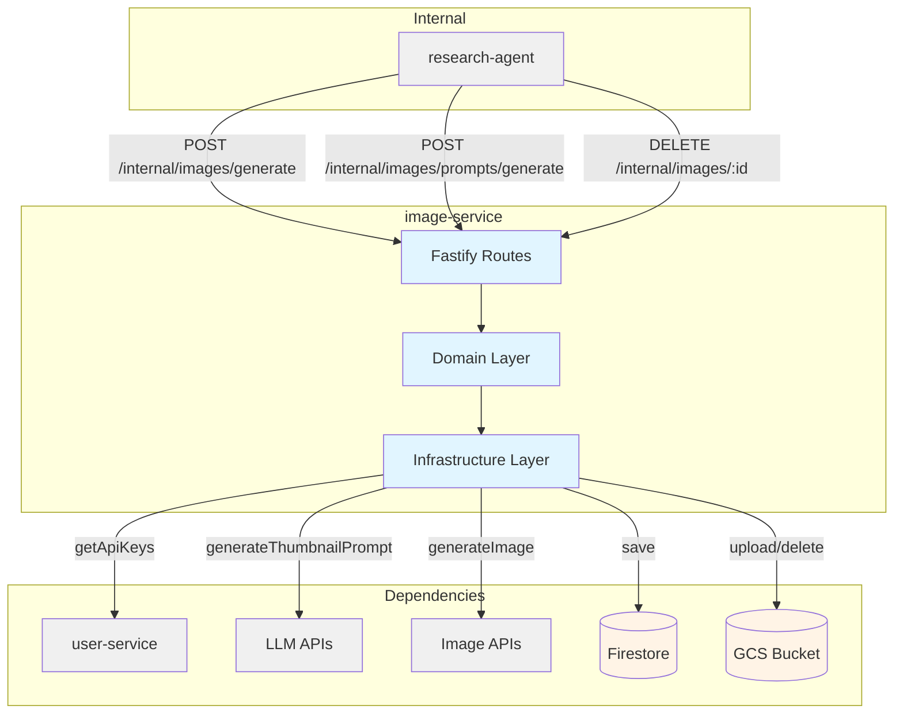
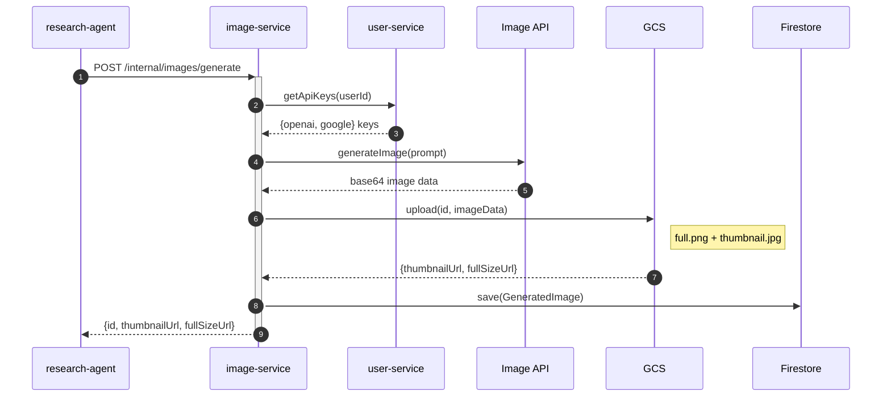
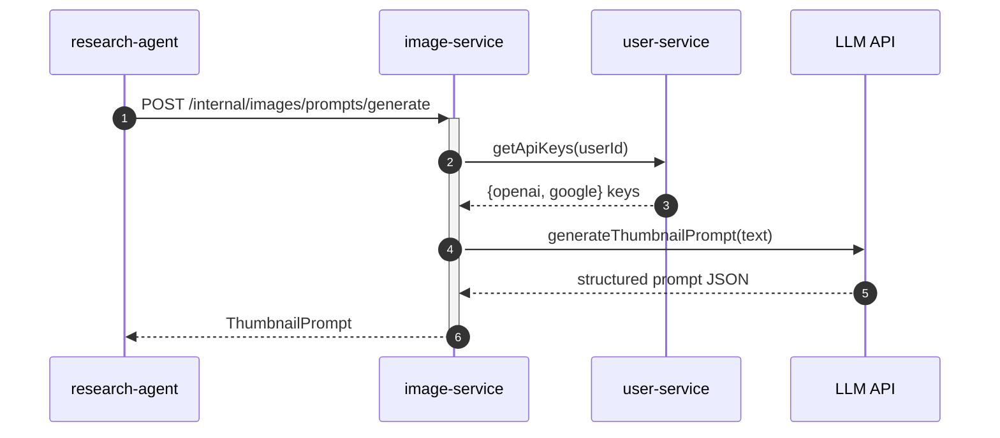

# Image Service — Technical Reference

## Overview

Image-service generates AI images using OpenAI GPT Image 1 and Google Gemini 2.5 Flash Image, with LLM-powered prompt enhancement via GPT-4.1 and Gemini 2.5 Pro. Images are stored in GCS with automatic thumbnail generation (256px max edge, JPEG at 80% quality). Image metadata is persisted in Firestore. Runs on Cloud Run with auto-scaling.

## Architecture



## Data Flow

### Image Generation



### Prompt Generation



## Recent Changes

| Commit     | Description                                                           | Date       |
| ---------- | --------------------------------------------------------------------- | ---------- |
| `93aeac4a` | Remove ZAI provider and GLM-4.7 models (INT-836)                      | 2026-03-12 |
| `e348b66e` | Fix silent dispatch failures and nested transaction (INT-810/811)     | 2026-03-10 |
| `44ea683a` | Release v3.2.0 (package.json version bump only)                       | 2026-03-07 |
| `99febe66` | Wire GitHub OAuth integration, update cross-service mocks             | 2026-03-02 |
| `7fbf7668` | Remove stale fields from test fixtures per code review                | 2026-02-27 |
| `8fb90669` | Align thumbnail output contract with consumed parser fields (INT-605) | 2026-02-27 |
| `b3f34d85` | Release v3.1.0                                                        | 2026-02-22 |
| `c8a42105` | Release v3.0.0                                                        | 2026-02-19 |
| `6063175b` | Add dev-mode log formatting for PM2 readability                       | 2026-02-16 |
| `a52a6bbc` | Add Dash0 OpenTelemetry integration across all services               | 2026-02-16 |
| `e60eafc1` | Standardize API key secrets to APP naming convention                  | 2026-02-15 |
| `c72b7c53` | Switch default LLM to Gemini 2.5 Flash, add Gemini fallback           | 2026-02-15 |
| `d5fbb354` | Fix start:local to use tsx instead of node                            | 2026-02-14 |
| `45f001c1` | Switch PM2 ecosystem to pnpm --filter with start:local                | 2026-02-14 |
| `0f69a74b` | Add default model selector with platform fallback                     | 2026-02-09 |
| `5aa3e1bd` | Enable strict 100% coverage enforcement (Phase 3)                     | 2026-02-01 |
| `c3198407` | Fix all 132 response contract violations across codebase              | 2026-01-30 |

## API Endpoints

### Internal Endpoints

| Method | Path                                | Purpose                         | Auth            |
| ------ | ----------------------------------- | ------------------------------- | --------------- |
| POST   | `/internal/images/prompts/generate` | Generate image prompt from text | Internal header |
| POST   | `/internal/images/generate`         | Generate image from prompt      | Internal header |
| DELETE | `/internal/images/:id`              | Delete image (used on unshare)  | Internal header |

### System Endpoints

| Method | Path            | Purpose               | Auth |
| ------ | --------------- | --------------------- | ---- |
| GET    | `/health`       | Health check          | None |
| GET    | `/docs`         | Swagger UI            | None |
| GET    | `/openapi.json` | OpenAPI specification | None |

## Domain Model

### GeneratedImage

| Field          | Type                | Description                                       |
| -------------- | ------------------- | ------------------------------------------------- |
| `id`           | `string`            | Unique image identifier (UUID v4)                 |
| `userId`       | `string`            | User who requested generation                     |
| `prompt`       | `string`            | Prompt used for generation                        |
| `thumbnailUrl` | `string`            | GCS public URL for thumbnail (256px, JPEG)        |
| `fullSizeUrl`  | `string`            | GCS public URL for full-size image (PNG)          |
| `model`        | `string`            | Model used (e.g., `gpt-image-1`)                  |
| `createdAt`    | `string` (ISO 8601) | Creation timestamp                                |
| `slug`         | `string?`           | URL-safe identifier derived from title (optional) |

### ThumbnailPrompt

| Field            | Type                        | Description                                  |
| ---------------- | --------------------------- | -------------------------------------------- |
| `title`          | `string`                    | Short title for the image (max 10 words)     |
| `visualSummary`  | `string`                    | One sentence describing the visual metaphor  |
| `prompt`         | `string`                    | Image generation prompt (80–180 words)       |
| `negativePrompt` | `string`                    | What to avoid (20–80 words)                  |
| `parameters`     | `ThumbnailPromptParameters` | Generation settings (framing, style, people) |

### ThumbnailPromptParameters

| Field     | Type           | Values                                                           |
| --------- | -------------- | ---------------------------------------------------------------- |
| `framing` | `string`       | LLM-generated framing description                                |
| `realism` | `RealismStyle` | `"photorealistic"`, `"cinematic illustration"`, `"clean vector"` |
| `people`  | `string`       | LLM-generated people description                                 |

## Supported Models

### Image Generation Models

| Model                    | Provider | Description                           |
| ------------------------ | -------- | ------------------------------------- |
| `gpt-image-1`            | OpenAI   | GPT Image 1 (image generation model)  |
| `gemini-2.5-flash-image` | Google   | Gemini Flash Image (image generation) |

### Prompt Generation Models

| Model            | Provider | Purpose            |
| ---------------- | -------- | ------------------ |
| `gpt-4.1`        | OpenAI   | Prompt enhancement |
| `gemini-2.5-pro` | Google   | Prompt enhancement |

### Pricing Models (from index.ts REQUIRED_MODELS)

| Model                    | Purpose                    |
| ------------------------ | -------------------------- |
| `gemini-2.5-flash`       | Pricing context for Gemini |
| `gpt-4o-mini`            | Pricing context for OpenAI |
| `gpt-image-1`            | Image generation pricing   |
| `gemini-2.5-flash-image` | Image generation pricing   |

**Note:** The pricing models (`gemini-2.5-flash`, `gpt-4o-mini`) differ from the actual prompt generation models (`gemini-2.5-pro`, `gpt-4.1`). See Gotchas section.

## Pub/Sub

None. Image-service does not publish or subscribe to Pub/Sub events.

## Dependencies

### Internal Services

| Service        | Endpoint                           | Purpose                  |
| -------------- | ---------------------------------- | ------------------------ |
| `user-service` | `/internal/users/:userId/api-keys` | Fetch encrypted API keys |

### External Services

| Service           | Purpose                             | Failure Mode     |
| ----------------- | ----------------------------------- | ---------------- |
| OpenAI API        | GPT Image 1, GPT-4.1                | DOWNSTREAM_ERROR |
| Google Gemini API | Gemini Flash Image, Gemini 2.5 Pro  | DOWNSTREAM_ERROR |

### Infrastructure

| Component                                 | Purpose                    |
| ----------------------------------------- | -------------------------- |
| Firestore (`generated_images` collection) | Image metadata persistence |
| GCS (`INTEXURAOS_IMAGE_BUCKET`)           | Image file storage         |

## Configuration

| Variable                              | Required | Description                                   |
| ------------------------------------- | -------- | --------------------------------------------- |
| `INTEXURAOS_GCP_PROJECT_ID`           | Yes      | Google Cloud project ID                       |
| `INTEXURAOS_AUTH_JWKS_URL`            | Yes      | JWKS endpoint for JWT verification            |
| `INTEXURAOS_AUTH_ISSUER`              | Yes      | JWT issuer                                    |
| `INTEXURAOS_AUTH_AUDIENCE`            | Yes      | JWT audience                                  |
| `INTEXURAOS_USER_SERVICE_URL`         | Yes      | User-service base URL                         |
| `INTEXURAOS_INTERNAL_AUTH_TOKEN`      | Yes      | Shared secret for internal auth               |
| `INTEXURAOS_IMAGE_BUCKET`             | Yes      | GCS bucket name for image storage             |
| `INTEXURAOS_IMAGE_PUBLIC_BASE_URL`    | Yes      | Public base URL for GCS objects               |
| `INTEXURAOS_APP_SETTINGS_SERVICE_URL` | Yes      | App settings service URL (pricing data)       |
| `INTEXURAOS_SENTRY_DSN`               | No       | Sentry error tracking DSN                     |
| `INTEXURAOS_GEMINI_APP_API_KEY`       | No       | Platform Gemini API key for user fallback     |
| `INTEXURAOS_DASH0_OTLP_ENDPOINT`      | No       | Dash0 OTLP endpoint for OpenTelemetry tracing |

## Gotchas

**Pricing model mismatch**: The `REQUIRED_MODELS` in `index.ts` fetches pricing for `gemini-2.5-flash` and `gpt-4o-mini`, but the prompt adapters actually use `gemini-2.5-pro` and `gpt-4.1` respectively. This means cost tracking may use incorrect per-token rates for prompt generation.

**Slug generation**: The `slug` field is derived from the title using `slugify()` — max 50 characters, lowercase, normalized unicode, hyphens for spaces. Only used when a title is provided (research cover images).

**Thumbnail size**: Thumbnails are exactly 256px on the longest edge, maintaining aspect ratio, saved as JPEG at 80% quality. Created using Sharp image processing library.

**GCS path patterns**:
- With slug: `images/{id}-{slug}.png` / `images/{id}-{slug}-thumb.jpg`
- Without slug: `images/{id}/full.png` / `images/{id}/thumbnail.jpg`

**Deletion cascade**: When deleting an image, both GCS objects and Firestore record are removed. If GCS deletion fails, the Firestore record is still deleted (best-effort cleanup, no rollback).

**API key validation**: The service validates that the user has the required provider API key before generation. If the user lacks a personal key and no platform fallback key is configured, a 400 error with the specific provider name is returned.

**Image format**: Full-size images are PNG; thumbnails are JPEG. No format selection available.

**Prompt-only endpoint**: `/internal/images/prompts/generate` only generates prompts; it does not generate images. The caller must call `/internal/images/generate` separately.

**No deduplication**: Each image generation creates a new UUID. Identical prompts generate separate images with separate storage objects.

**Internal-only access**: All functional endpoints require `X-Internal-Auth` header. No public API endpoints exist.

**Rate limit propagation**: Rate limited responses from upstream providers are propagated as `RATE_LIMITED` error code. The prompt generation endpoint returns this directly; the image generation endpoint wraps it in `DOWNSTREAM_ERROR`.

**Delete endpoint resilience**: The DELETE endpoint attempts both GCS deletion and Firestore deletion independently. If either fails, it logs the error but still returns `{ deleted: true }` to the caller.

**Prompt parameters trimmed (INT-605)**: The `ThumbnailPromptParameters` type only contains `framing`, `realism`, and `people`. Previously documented fields `aspectRatio`, `textOnImage`, and `logosTrademarks` were removed from the consumed contract. The LLM prompt may still produce them, but the parser discards any fields not in the validated schema.

## File Structure

```
apps/image-service/src/
  domain/
    models/
      ImageGenerationModel.ts      # GPT Image 1, Gemini Flash Image configs
      ImagePromptModel.ts          # GPT-4.1, Gemini 2.5 Pro configs
      GeneratedImage.ts            # GeneratedImage entity
      ThumbnailPrompt.ts           # Prompt response structure + RealismStyle
    ports/
      generatedImageRepository.ts  # Firestore persistence interface
      imageGenerator.ts            # Image generation interface
      imageStorage.ts              # GCS storage interface
      promptGenerator.ts           # LLM prompt generation interface
  infra/
    firestore/
      GeneratedImageFirestoreRepository.ts  # Firestore CRUD for generated_images
    image/
      OpenAIImageGenerator.ts      # GPT Image 1 integration
      GoogleImageGenerator.ts      # Gemini Flash Image integration
      FakeImageGenerator.ts        # Testing fake (no API calls)
    llm/
      GptPromptAdapter.ts          # GPT-4.1 prompt generation
      GeminiPromptAdapter.ts       # Gemini 2.5 Pro prompt generation
      parseResponse.ts             # LLM JSON response parser + validation
    storage/
      GcsImageStorage.ts           # GCS upload/delete with Sharp thumbnailing
  routes/
    internalRoutes.ts              # 3 internal endpoints (generate prompt, generate image, delete)
    schemas/
      imageSchemas.ts              # Image generation + delete request/response schemas
      promptSchemas.ts             # Prompt generation request/response schemas
  services.ts                      # DI container with factory functions
  index.ts                         # Entry point with env validation + pricing init
  server.ts                        # Fastify server setup with Swagger, CORS, health
```

## Migration Notes

### INT-605: Thumbnail Output Contract Alignment (2026-02-27)

- `ThumbnailPromptParameters` trimmed to 3 fields: `framing`, `realism`, `people`
- Removed `aspectRatio`, `textOnImage`, `logosTrademarks` from the consumed interface
- Parser (`parseResponse.ts`) only validates the 3 consumed fields
- Test fixtures updated to remove stale fields in `7fbf7668`

### Release v3.1.0 (2026-02-22)

- Version bump only, no functional changes to image-service

### Release v3.0.0 (2026-02-19)

- Version bump only, no functional changes to image-service

### Dev-Mode Log Formatting (2026-02-16)

- `server.ts` uses `createLogStream()` from `@intexuraos/infra-sentry` for colorized PM2 output
- Format: `service-name | HH:mm:ss | LEVEL | message | {extras}`
- No behavior change in production or test environments

### Dash0 OpenTelemetry Integration (2026-02-16)

- Distributed tracing, metrics, and log export via OTLP/HTTP to Dash0
- Loaded via Node `--import` preload in Dockerfile (`packages/infra-otel`)
- No-op when `INTEXURAOS_DASH0_OTLP_ENDPOINT` is unset

### API Key Naming Standardization (2026-02-15)

- `INTEXURAOS_GEMINI_APP_API_KEY` is the platform fallback key (ZAI key removed in v3.3.0)
- Gemini 2.5 Flash is the default platform model

### Platform Key Fallback (2026-02-09)

- Users without personal API keys fall back to platform-owned Gemini key
- `UserServiceClient.getApiKeys()` returns platform keys if user has none configured
