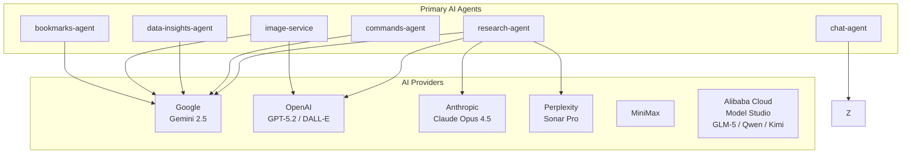
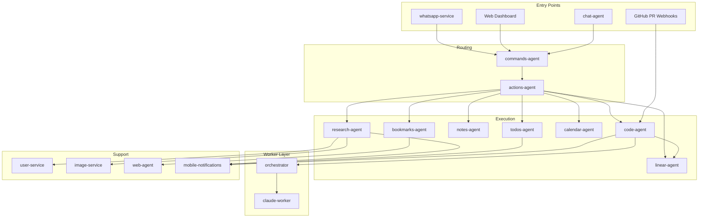

# Services Catalog

Complete documentation for all IntexuraOS services, workers, and packages.

**Version 3.3.0** — March 16, 2026

---

## v3.3.0 Highlights

| Component        | Key Changes                                                                                                                                                                                     |
| ---------------- | ----------------------------------------------------------------------------------------------------------------------------------------------------------------------------------------------- |
| **code-agent**   | GitHub Agent with tool calling, unified PR automation log, structured output triage with auto-repair                                                                                            |
| **orchestrator** | Review Agent, Execution Deep Validator, Kimi worker type, Docker health gate, fatal exit codes, PR branch inheritance, mandatory /simplify, already-completed outcome, reliability improvements |
| **web**          | Code Task Detail Page V2 (issue-centric grouped view), workers status in user menu                                                                                                              |
| **Platform**     | Alibaba Cloud Model Studio integration replacing ZAI (GLM-5, Qwen, Kimi), Gemini tool-call mode                                                                                                 |

## v3.2.0 Highlights (Previous)

| Component            | Key Changes                                                                          |
| -------------------- | ------------------------------------------------------------------------------------ |
| **code-agent**       | Agent-based routing, implement button lifecycle, task queueing, PR comment tasks     |
| **orchestrator**     | Label-based dispatch, Qwen/Sonnet/MiniMax worker types, automatic container cleanup  |
| **whatsapp-service** | CTA buttons with deep links, task progress notifications                             |
| **transcription**    | Event-driven audio processing, user-level language preferences                       |
| **linear-agent**     | Live data hydration                                                                  |
| **calendar-agent**   | Calendar event previews with rich formatting                                         |
| **web**              | Code task view enhancements, website redesign                                        |
| **actions-agent**    | Implement button (planning-to-PR lifecycle)                                          |
| **Platform**         | CI-enforced prompt versioning, prompt injection hardening, auto-archival of attempts |

## v3.0.0 Highlights (Previous)

| Component         | Key Changes                                                                         |
| ----------------- | ----------------------------------------------------------------------------------- |
| **chat-agent**    | New: In-app AI assistant with RAG, guest access, command creation                   |
| **code-agent**    | New: Autonomous code execution with worker dispatch and dedup                       |
| **orchestrator**  | New: Local worker orchestration for Claude Code sessions via Docker                 |
| **claude-worker** | New: Docker container image for isolated Claude Code execution                      |
| **log-cleanup**   | New: Cloud Function for scheduled log retention management                          |
| **vm-lifecycle**  | New: Cloud Functions for GCE VM start/stop lifecycle control                        |
| **22 packages**   | New: All shared packages documented (common, infra, LLM stack)                      |

## v2.1.0 Highlights (Older)

| Service              | Key Changes                                                                                           |
| -------------------- | ----------------------------------------------------------------------------------------------------- |
| **whatsapp-service** | Interactive approval buttons, phone verification, voice transcription                                 |
| **actions-agent**    | Confidence-based auto-execution, Google Calendar linking, resource status tracking                    |
| **calendar-agent**   | Preview generation before commit                                                                      |
| **research-agent**   | Natural language model selection, Zod schema validation                                               |
| **commands-agent**   | 5-step classification, URL isolation, Polish support                                                  |
| **bookmarks-agent**  | WhatsApp delivery for AI summaries                                                                    |
| **web-agent**        | @intexuraos/internal-clients integration (INT-269)                                                    |
| **linear-agent**     | Multi-user webhook fan-out (INT-623), composite keys, 12 internal endpoints, dual-prompt auto-trigger |
| **user-service**     | Rate limit detection precedence fix                                                                   |

---

## AI Capabilities Overview

IntexuraOS integrates **6 AI providers** with **14 LLM contract models** across **20 microservices**:

---

## Services by AI Capability

### Multi-Model Orchestration

| Service                                      | AI Models              | Capability                                      |
| -------------------------------------------- | ---------------------- | ----------------------------------------------- |
| [research-agent](research-agent/features.md) | All 10 research models | Parallel queries, synthesis, confidence scoring |

### Intent Classification

| Service                                      | AI Models                 | Capability                      |
| -------------------------------------------- | ------------------------- | ------------------------------- |
| [commands-agent](commands-agent/features.md) | Gemini 2.5 Flash          | Natural language to action type |

### Data Intelligence

| Service                                                | AI Models        | Capability                                          |
| ------------------------------------------------------ | ---------------- | --------------------------------------------------- |
| [data-insights-agent](data-insights-agent/features.md) | Gemini 2.5 Flash | Schema inference, trend detection, chart generation |

### Image Generation

| Service                                    | AI Models                       | Capability                       |
| ------------------------------------------ | ------------------------------- | -------------------------------- |
| [image-service](image-service/features.md) | GPT Image 1, Gemini Flash Image | Cover images, prompt enhancement |

### Content Intelligence

| Service                                        | AI Models          | Capability                            |
| ---------------------------------------------- | ------------------ | ------------------------------------- |
| [bookmarks-agent](bookmarks-agent/features.md) | Via web-agent      | Link summarization                    |
| [web-agent](web-agent/features.md)             | Gemini 2.5 Flash   | Content extraction, summarization     |
| [todos-agent](todos-agent/features.md)         | Via commands-agent | Task extraction from natural language |

### Conversational AI

| Service                              | AI Models                        | Capability                                        |
| ------------------------------------ | -------------------------------- | ------------------------------------------------- |
| [chat-agent](chat-agent/features.md) | Gemini 2.5 Flash                 | Documentation Q&A, command creation, guest access |

### Autonomous Code Execution

| Service                              | AI Models                                        | Capability                                                                                    |
| ------------------------------------ | ------------------------------------------------ | --------------------------------------------------------------------------------------------- |
| [code-agent](code-agent/features.md) | Claude, MiniMax, GLM-5, Qwen, Kimi (via workers) | GitHub Agent with tool calling, unified PR log, task queueing, PR creation via 7 worker types |

### Voice & Transcription

| Service                                          | AI Models       | Capability                                                       |
| ------------------------------------------------ | --------------- | ---------------------------------------------------------------- |
| [whatsapp-service](whatsapp-service/features.md) | Via srt-service | Voice transcription, approval buttons, CTA deep links            |
| [transcription](transcription/features.md)       | Speechmatics    | Audio-to-text with auto language detection and AI summaries      |

---

## All Services

### AI Agents (Primary Intelligence)

Services that directly invoke AI models for their core functionality.

| Service                                                | Purpose                           | AI                                               | Docs                                                                                                                                                                                                                              |
| ------------------------------------------------------ | --------------------------------- | ------------------------------------------------ | --------------------------------------------------------------------------------------------------------------------------------------------------------------------------------------------------------------------------------- |
| [research-agent](research-agent/features.md)           | Multi-LLM research orchestration  | Gemini, Claude, GPT, Sonar                       | [features](research-agent/features.md) / [technical](research-agent/technical.md) / [tutorial](research-agent/tutorial.md) / [debt](research-agent/technical-debt.md) / [agent](research-agent/agent.md)                          |
| [commands-agent](commands-agent/features.md)           | AI command classification         | Gemini 2.5 Flash                                 | [features](commands-agent/features.md) / [technical](commands-agent/technical.md) / [tutorial](commands-agent/tutorial.md) / [debt](commands-agent/technical-debt.md) / [agent](commands-agent/agent.md)                          |
| [data-insights-agent](data-insights-agent/features.md) | AI-powered data analysis          | Gemini 2.5 Flash                                 | [features](data-insights-agent/features.md) / [technical](data-insights-agent/technical.md) / [tutorial](data-insights-agent/tutorial.md) / [debt](data-insights-agent/technical-debt.md) / [agent](data-insights-agent/agent.md) |
| [image-service](image-service/features.md)             | AI image generation               | GPT Image 1, Gemini Flash Image                  | [features](image-service/features.md) / [technical](image-service/technical.md) / [tutorial](image-service/tutorial.md) / [debt](image-service/technical-debt.md) / [agent](image-service/agent.md)                               |
| [bookmarks-agent](bookmarks-agent/features.md)         | Link management with AI summaries | Via web-agent                                    | [features](bookmarks-agent/features.md) / [technical](bookmarks-agent/technical.md) / [tutorial](bookmarks-agent/tutorial.md) / [debt](bookmarks-agent/technical-debt.md) / [agent](bookmarks-agent/agent.md)                     |
| [web-agent](web-agent/features.md)                     | Web scraping with AI              | Gemini 2.5 Flash                                 | [features](web-agent/features.md) / [technical](web-agent/technical.md) / [tutorial](web-agent/tutorial.md) / [debt](web-agent/technical-debt.md) / [agent](web-agent/agent.md)                                                   |
| [chat-agent](chat-agent/features.md)                   | In-app AI assistant with RAG      | Gemini 2.5 Flash                                 | [features](chat-agent/features.md) / [technical](chat-agent/technical.md) / [tutorial](chat-agent/tutorial.md) / [debt](chat-agent/technical-debt.md) / [agent](chat-agent/agent.md)                                              |
| [code-agent](code-agent/features.md)                   | Autonomous code execution         | Claude, MiniMax, GLM-5, Qwen, Kimi (via workers) | [features](code-agent/features.md) / [technical](code-agent/technical.md) / [tutorial](code-agent/tutorial.md) / [debt](code-agent/technical-debt.md) / [agent](code-agent/agent.md)                                              |

### Content Management Agents

Services that manage user content with AI-enhanced features.

| Service                                      | Purpose                     | AI             | Docs                                                                                                                                                                                                     |
| -------------------------------------------- | --------------------------- | -------------- | -------------------------------------------------------------------------------------------------------------------------------------------------------------------------------------------------------- |
| [todos-agent](todos-agent/features.md)       | Task management             | NLP extraction | [features](todos-agent/features.md) / [technical](todos-agent/technical.md) / [tutorial](todos-agent/tutorial.md) / [debt](todos-agent/technical-debt.md) / [agent](todos-agent/agent.md)                |
| [notes-agent](notes-agent/features.md)       | Note-taking                 | -              | [features](notes-agent/features.md) / [technical](notes-agent/technical.md) / [tutorial](notes-agent/tutorial.md) / [debt](notes-agent/technical-debt.md) / [agent](notes-agent/agent.md)                |
| [calendar-agent](calendar-agent/features.md) | Google Calendar integration | Date parsing   | [features](calendar-agent/features.md) / [technical](calendar-agent/technical.md) / [tutorial](calendar-agent/tutorial.md) / [debt](calendar-agent/technical-debt.md) / [agent](calendar-agent/agent.md) |
| [linear-agent](linear-agent/features.md)     | Linear issue management     | Gemini, GLM    | [features](linear-agent/features.md) / [technical](linear-agent/technical.md) / [tutorial](linear-agent/tutorial.md) / [debt](linear-agent/technical-debt.md) / [agent](linear-agent/agent.md)           |

### Infrastructure Services

Core platform services that support the AI agents.

| Service                                                                  | Purpose                        | AI              | Docs                                                                                                                                                                                                                                                                           |
| ------------------------------------------------------------------------ | ------------------------------ | --------------- | ------------------------------------------------------------------------------------------------------------------------------------------------------------------------------------------------------------------------------------------------------------------------------ |
| [actions-agent](actions-agent/features.md)                               | Central action orchestration   | -               | [features](actions-agent/features.md) / [technical](actions-agent/technical.md) / [tutorial](actions-agent/tutorial.md) / [debt](actions-agent/technical-debt.md) / [agent](actions-agent/agent.md)                                                                            |
| [whatsapp-service](whatsapp-service/features.md)                         | WhatsApp messaging & approvals | Via srt-service | [features](whatsapp-service/features.md) / [technical](whatsapp-service/technical.md) / [tutorial](whatsapp-service/tutorial.md) / [debt](whatsapp-service/technical-debt.md) / [agent](whatsapp-service/agent.md)                                                             |
| [user-service](user-service/features.md)                                 | Auth, API keys, settings       | LLM validation  | [features](user-service/features.md) / [technical](user-service/technical.md) / [tutorial](user-service/tutorial.md) / [debt](user-service/technical-debt.md) / [agent](user-service/agent.md)                                                                                 |
| [mobile-notifications-service](mobile-notifications-service/features.md) | Push notification gateway      | -               | [features](mobile-notifications-service/features.md) / [technical](mobile-notifications-service/technical.md) / [tutorial](mobile-notifications-service/tutorial.md) / [debt](mobile-notifications-service/technical-debt.md) / [agent](mobile-notifications-service/agent.md) |
| [notion-service](notion-service/features.md)                             | Notion integration             | -               | [features](notion-service/features.md) / [technical](notion-service/technical.md) / [tutorial](notion-service/tutorial.md) / [debt](notion-service/technical-debt.md) / [agent](notion-service/agent.md)                                                                       |
| [app-settings-service](app-settings-service/features.md)                 | LLM pricing and analytics      | -               | [features](app-settings-service/features.md) / [technical](app-settings-service/technical.md) / [tutorial](app-settings-service/tutorial.md) / [debt](app-settings-service/technical-debt.md) / [agent](app-settings-service/agent.md)                                         |
| [api-docs-hub](api-docs-hub/features.md)                                 | OpenAPI documentation          | -               | [features](api-docs-hub/features.md) / [technical](api-docs-hub/technical.md) / [tutorial](api-docs-hub/tutorial.md) / [debt](api-docs-hub/technical-debt.md) / [agent](api-docs-hub/agent.md)                                                                                 |

### User Interface

Progressive Web App providing the unified dashboard for IntexuraOS.

| Service                | Purpose                   | AI  | Docs                                                                                                                                              |
| ---------------------- | ------------------------- | --- | ------------------------------------------------------------------------------------------------------------------------------------------------- |
| [web](web/features.md) | Progressive Web App (PWA) | -   | [features](web/features.md) / [technical](web/technical.md) / [tutorial](web/tutorial.md) / [debt](web/technical-debt.md) / [agent](web/agent.md) |

---

## Workers

Cloud Functions and local services that run outside Cloud Run.

| Worker                                     | Type            | Purpose                                                          | Trigger                     |
| ------------------------------------------ | --------------- | ---------------------------------------------------------------- | --------------------------- |
| [orchestrator](orchestrator/features.md)   | Local service   | Spawns Claude Code sessions in Docker containers via worktrees   | HTTP (HMAC-signed dispatch) |
| [claude-worker](claude-worker/features.md) | Docker image    | Isolated Claude Code execution environment with git and tools    | Started by orchestrator     |
| [log-cleanup](log-cleanup/features.md)     | Cloud Function  | Deletes old task logs via code-agent cleanup API                 | Pub/Sub (scheduled)         |
| [vm-lifecycle](vm-lifecycle/features.md)   | Cloud Functions | Starts and stops GCE VM instances with health polling            | HTTP (internal auth)        |
| [transcription](transcription/features.md) | Cloud Function  | Converts WhatsApp voice notes to text via Speechmatics           | Pub/Sub (audio-stored)      |
| predev-lifecycle                           | Cloud Functions | Manages pre-dev VM gateway, idle-check, and ready-state webhooks | HTTP / Pub/Sub (scheduled)  |

### Worker Details

**orchestrator** -- Runs on local machines (Mac or VM) behind Cloudflare Tunnel. Receives task dispatch requests from code-agent, creates isolated git worktrees, spawns Claude Code sessions in Docker containers, and reports results via webhooks. Supports 7 worker types across Anthropic (opus, auto, sonnet), MiniMax (minimax), and Alibaba Cloud Model Studio (glm/glm-5, qwen/qwen3.5-plus, kimi/kimi-k2.5). Features mandatory /simplify step, container adoption on restart, Gemini-based completion verification with agent-specific Zod schemas, versioned system prompts via PromptBuilder, planning PR branch merging, forensics mode, and mid-task messaging.

**claude-worker** -- Docker container (Node.js 22 Alpine) pre-loaded with Claude CLI, git, pnpm, GitHub CLI, ripgrep, terraform, and gcloud. Runs as non-root user with network restrictions. The orchestrator manages its lifecycle.

**log-cleanup** -- Pub/Sub-triggered Cloud Function that calls the code-agent's internal cleanup API to delete task logs older than the configured retention period (default 90 days).

**vm-lifecycle** -- Two HTTP-triggered Cloud Functions (`startVm` and `stopVm`) that manage GCE Spot VM instances. `startVm` polls for health after boot; `stopVm` gracefully drains running tasks before shutdown.

**transcription** — Pub/Sub-triggered Cloud Function that converts WhatsApp voice notes stored in GCS into text using Speechmatics Batch API. Supports auto language detection, AI-generated summaries, and 100+ custom vocabulary terms. Publishes results (success or failure) to the transcription-completed topic for whatsapp-service consumption.

---

## Packages

Shared libraries used across apps and workers.

### Core & HTTP

| Package                                                | Purpose                                               |
| ------------------------------------------------------ | ----------------------------------------------------- |
| [common-core](../packages/common-core/README.md)       | Result types, Logger interface, error codes, tracing  |
| [common-http](../packages/common-http/README.md)       | Fastify plugin (reply.ok/fail), JWT auth, request IDs |
| [http-contracts](../packages/http-contracts/README.md) | OpenAPI and Fastify JSON Schema definitions           |
| [http-server](../packages/http-server/README.md)       | Health checks, env validation, error handler          |

### Infrastructure Adapters

| Package                                                  | Purpose                                                                      |
| -------------------------------------------------------- | ---------------------------------------------------------------------------- |
| [infra-firestore](../packages/infra-firestore/README.md) | Firestore singleton client and in-memory test fake                           |
| [infra-pubsub](../packages/infra-pubsub/README.md)       | Pub/Sub publishers for WhatsApp, todos, calendar                             |
| [infra-sentry](../packages/infra-sentry/README.md)       | Sentry error tracking, Pino log stream, logger factory                       |
| [infra-whatsapp](../packages/infra-whatsapp/README.md)   | WhatsApp Cloud API client (send, media, read receipts)                       |
| [infra-notion](../packages/infra-notion/README.md)       | Notion API client, token validation, page retrieval                          |
| [infra-otel](../packages/infra-otel/README.md)           | OpenTelemetry SDK bootstrap, distributed tracing and metrics export to Dash0 |
| [infra-glm](../packages/infra-glm/README.md)             | Alibaba Cloud Model Studio GLM client implementation                         |

### LLM Provider Clients

| Package                                                    | Provider                   | Capabilities                                |
| ---------------------------------------------------------- | -------------------------- | ------------------------------------------- |
| [infra-claude](../packages/infra-claude/README.md)         | Anthropic                  | Text generation, web search, prompt caching |
| [infra-gemini](../packages/infra-gemini/README.md)         | Google                     | Text generation, web search, image gen      |
| [infra-gpt](../packages/infra-gpt/README.md)               | OpenAI                     | Text generation, web search, DALL-E         |
| [infra-perplexity](../packages/infra-perplexity/README.md) | Perplexity                 | SSE-streamed research with citations        |

### LLM Stack

| Package                                            | Purpose                                                    |
| -------------------------------------------------- | ---------------------------------------------------------- |
| [llm-contract](../packages/llm-contract/README.md) | Model/provider types, LLMClient interface, pricing types   |
| [llm-factory](../packages/llm-factory/README.md)   | Unified factory for creating provider-specific LLM clients |
| [llm-prompts](../packages/llm-prompts/README.md)   | Centralized prompt templates and Zod response schemas      |
| [llm-pricing](../packages/llm-pricing/README.md)   | Runtime pricing lookups, usage logging to Firestore        |
| [llm-audit](../packages/llm-audit/README.md)       | LLM request/response audit trail in Firestore              |
| [llm-utils](../packages/llm-utils/README.md)       | Token redaction, LLM parse error handling, Zod formatting  |

### Service Clients

| Package                                                    | Purpose                                                     |
| ---------------------------------------------------------- | ----------------------------------------------------------- |
| [internal-clients](../packages/internal-clients/README.md) | Typed HTTP clients for internal service APIs (user-service) |

---

## AI Models Used

### Research Models (9)

Used for deep research queries with parallel execution. **v2.0.0:** Users can specify models in natural language ("research with Claude and GPT").

| Model                 | Provider   | Specialty            |
| --------------------- | ---------- | -------------------- |
| Gemini 2.5 Pro        | Google     | Reasoning, analysis  |
| Gemini 2.5 Flash      | Google     | Fast responses       |
| GPT-5.2               | OpenAI     | Creative synthesis   |
| o4-mini-deep-research | OpenAI     | Deep research        |
| Claude Opus 4.5       | Anthropic  | Nuanced analysis     |
| Claude Sonnet 4.5     | Anthropic  | Balanced performance |
| Sonar                 | Perplexity | Real-time web search |
| Sonar Pro             | Perplexity | Enhanced search      |
| Sonar Deep Research   | Perplexity | Comprehensive search |

### Classification Models (1)

Used for intent classification and fast tasks. **v2.0.0:** 5-step decision tree with URL isolation and explicit intent detection.

| Model            | Provider | Use Case                                 |
| ---------------- | -------- | ---------------------------------------- |
| Gemini 2.5 Flash | Google   | Command classification, title generation |

### Image Models (2)

Used for image generation:

| Model                     | Provider | Capability            |
| ------------------------- | -------- | --------------------- |
| GPT-Image-1 (GPT Image 1) | OpenAI   | High-quality images   |
| Gemini 2.5 Flash Image    | Google   | Fast image generation |

### Validation Models (4)

Used for API key validation (cheap, fast):

| Model            | Provider   |
| ---------------- | ---------- |
| Claude Haiku 3.5 | Anthropic  |
| Gemini 2.0 Flash | Google     |
| GPT-4o Mini      | OpenAI     |
| Sonar            | Perplexity |

---

## Service Dependencies

---

## Documentation Coverage

| Metric                 | Count    |
| ---------------------- | -------- |
| Total Apps             | 20       |
| Total Workers          | 6        |
| Total Packages         | 22       |
| Apps with features.md  | 20       |
| Apps with technical.md | 20       |
| Apps with tutorial.md  | 20       |
| Apps with tech-debt.md | 20       |
| Apps with agent.md     | 20       |
| Packages with README   | 22       |
| Workers with docs      | 5        |
| **Coverage**           | **100%** |

---

## Quick Links

### By Use Case

**I want to...**

- **Do multi-model research**: [research-agent](research-agent/features.md)
- **Ask questions about the platform**: [chat-agent](chat-agent/features.md)
- **Automate coding tasks**: [code-agent](code-agent/features.md)
- **Manage tasks via voice**: [todos-agent](todos-agent/features.md) + [whatsapp-service](whatsapp-service/features.md)
- **Save and summarize links**: [bookmarks-agent](bookmarks-agent/features.md)
- **Generate images**: [image-service](image-service/features.md)
- **Analyze data**: [data-insights-agent](data-insights-agent/features.md)
- **Schedule events**: [calendar-agent](calendar-agent/features.md)
- **Manage Linear issues**: [linear-agent](linear-agent/features.md)

### By Integration

- **WhatsApp**: [whatsapp-service](whatsapp-service/features.md)
- **Google Calendar**: [calendar-agent](calendar-agent/features.md)
- **Notion**: [notion-service](notion-service/features.md)
- **Linear**: [linear-agent](linear-agent/features.md)
- **Auth0**: [user-service](user-service/features.md)
- **GitHub**: [code-agent](code-agent/features.md)
- **Sentry**: [infra-sentry](../packages/infra-sentry/README.md)

### By Package Category

- **Core types and utilities**: [common-core](../packages/common-core/README.md)
- **HTTP middleware**: [common-http](../packages/common-http/README.md) / [http-server](../packages/http-server/README.md)
- **LLM integration**: [llm-contract](../packages/llm-contract/README.md) / [llm-factory](../packages/llm-factory/README.md)
- **Error tracking**: [infra-sentry](../packages/infra-sentry/README.md)
- **Database**: [infra-firestore](../packages/infra-firestore/README.md)
- **Messaging**: [infra-pubsub](../packages/infra-pubsub/README.md) / [infra-whatsapp](../packages/infra-whatsapp/README.md)
- **Observability**: [infra-otel](../packages/infra-otel/README.md) / [infra-sentry](../packages/infra-sentry/README.md)

---

**Last updated:** 2026-03-16

**Components documented:** 20 apps + 6 workers + 22 packages = 48 total (predev-lifecycle has no docs yet)
