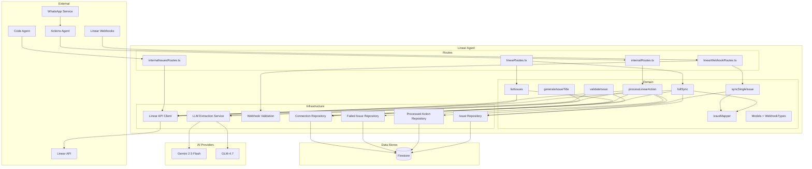
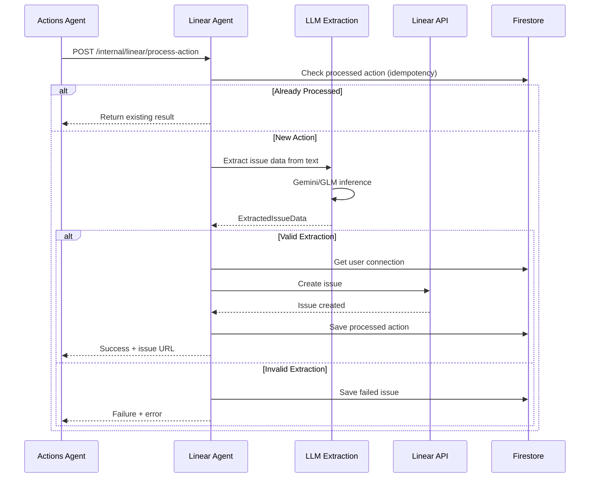
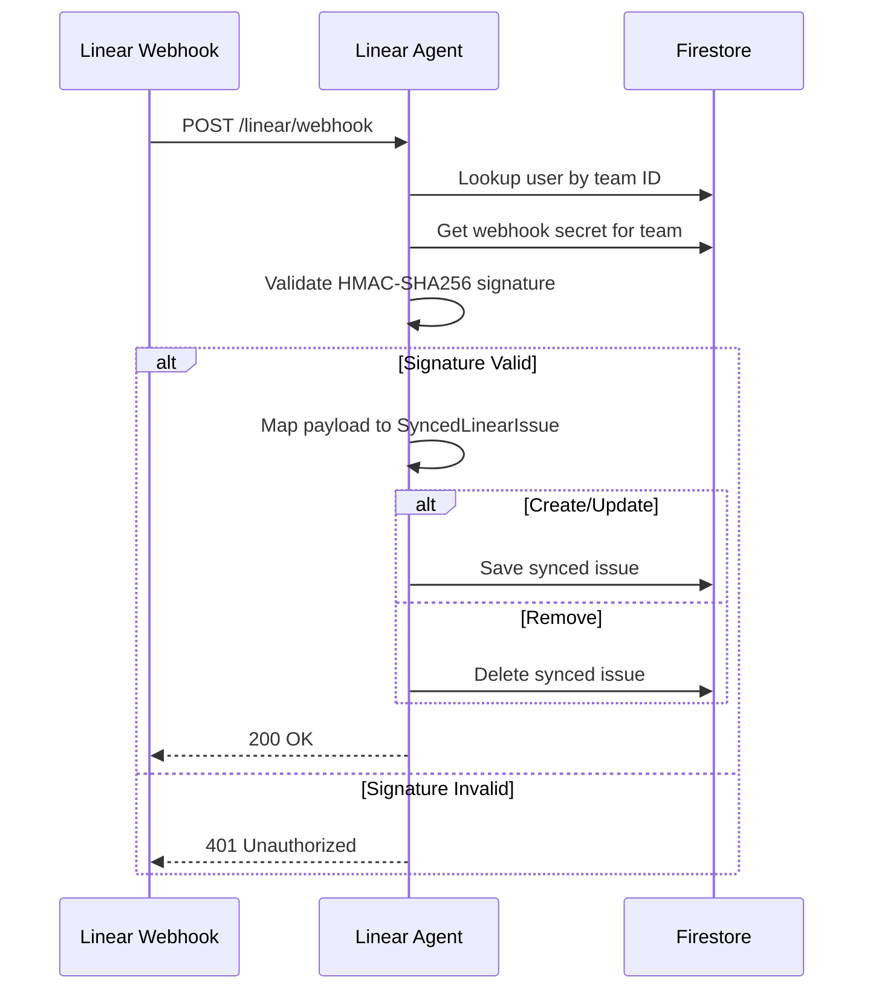
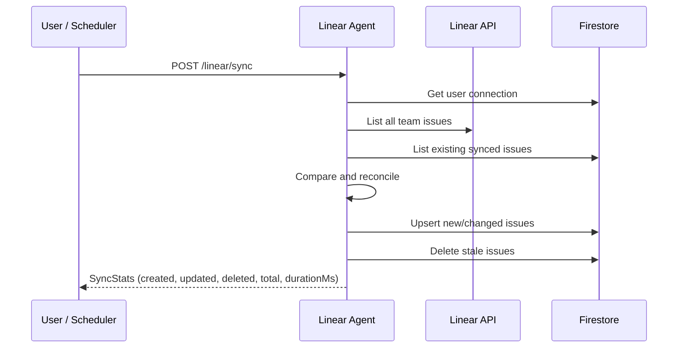

# Linear Agent - Technical Reference

## Overview

Linear Agent provides bidirectional integration between IntexuraOS and Linear project management. It enables natural language issue creation through voice messages with AI-powered extraction, real-time webhook synchronization, full issue sync, issue validation, AI title generation, and programmatic issue management for code agents. The service runs on Cloud Run with auto-scaling and uses the `@linear/sdk` for GraphQL API communication.

## Architecture



## Data Flow

### Voice-to-Issue Pipeline



### Webhook Sync Flow



### Full Sync Flow



## Recent Changes

| Commit     | Description                                                 | Date       |
| ---------- | ----------------------------------------------------------- | ---------- |
| `7b2d8d0c` | Unified Linear issue templates and two-phase execution      | 2026-02-06 |
| `8e913384` | Add multi-tenant webhook support                            | 2026-02-03 |
| `014380a0` | Add Linear webhook support and sync functionality (INT-444) | 2026-02-02 |
| `93087647` | Fix Linear integration for multi-user support (INT-443)     | 2026-02-01 |
| `a23ed1ef` | Redesign Linear board column layout (INT-208)               | 2026-01-22 |
| `5d5e17c2` | Apply rate limit fix (code audit)                           | 2026-01-24 |
| `5bd8b1a8` | Optimize Linear API to avoid rate limiting (INT-95)         | 2026-01-16 |
| `1e1647c5` | Add idempotency check (INT-97)                              | 2026-01-16 |

### INT-486: Unified Issue Templates and Two-Phase Execution

Major expansion adding programmatic issue management for code agents:

**New Use Cases:**

- `generateIssueTitle` - LLM-powered title generation with Zod schema validation and fallback pipeline
- `validateIssue` - Validates issue identifier format, existence, and team ownership
- `fullSync` / `fullSyncAllUsers` - Full reconciliation of Linear issues to local Firestore
- `syncSingleIssue` - Process individual webhook events (create/update/remove)

**New Domain Models:**

- `SyncedLinearIssue` - Locally synced issue with assignee, labels, and sync timestamp
- `LinearIssueWithTeam` - API issue enriched with team ID, labels, and child count
- `WorkflowState` - Linear workflow state for state transitions
- `LinearWebhookEvent` / `LinearWebhookPayload` - Typed webhook event structures

**New Infrastructure:**

- `linearIssueRepository` (Firestore) - CRUD for synced issues
- `linearWebhookValidation` - HMAC-SHA256 signature verification
- `issueMapper` - Maps webhook/API payloads to `SyncedLinearIssue`

**New Routes:**

- `linearWebhookRoutes.ts` - Webhook endpoint with multi-tenant routing
- `internalIssuesRoutes.ts` - Service-to-service issue creation and state updates

### INT-444: Webhook Support and Sync

Added bidirectional sync through Linear webhooks:

- Per-connection webhook secret storage in `LinearConnection`
- Team-based webhook routing (find user by team ID)
- HMAC-SHA256 signature validation using `crypto.timingSafeEqual`
- Webhook configuration endpoints (GET/POST/DELETE `/linear/webhook-config`)
- Full sync endpoint (`POST /linear/sync`)
- Failed issue retry and deletion endpoints

## API Endpoints

### Public Endpoints

| Method | Path                              | Purpose                           | Auth   |
| ------ | --------------------------------- | --------------------------------- | ------ |
| GET    | `/linear/connection`              | Get user's connection status      | Bearer |
| POST   | `/linear/connection/validate`     | Validate API key, get teams       | None   |
| POST   | `/linear/connection`              | Save connection configuration     | Bearer |
| DELETE | `/linear/connection`              | Disconnect from Linear            | Bearer |
| GET    | `/linear/issues`                  | List issues grouped by column     | Bearer |
| GET    | `/linear/failed-issues`           | List failed extractions           | Bearer |
| DELETE | `/linear/failed-issues/:id`       | Delete a failed extraction        | Bearer |
| POST   | `/linear/failed-issues/:id/retry` | Retry a failed extraction         | Bearer |
| POST   | `/linear/sync`                    | Trigger full issue sync           | Bearer |
| GET    | `/linear/webhook-config`          | Get webhook URL and secret status | Bearer |
| POST   | `/linear/webhook-config`          | Set webhook signing secret        | Bearer |
| DELETE | `/linear/webhook-config`          | Remove webhook signing secret     | Bearer |

### Webhook Endpoints

| Method | Path              | Purpose                       | Auth                   |
| ------ | ----------------- | ----------------------------- | ---------------------- |
| POST   | `/linear/webhook` | Receive Linear webhook events | HMAC-SHA256 (per-team) |

### Internal Endpoints

| Method | Path                              | Purpose                          | Auth       |
| ------ | --------------------------------- | -------------------------------- | ---------- |
| POST   | `/internal/linear/process-action` | Process action via AI extraction | X-Internal |
| POST   | `/internal/issues`                | Create a Linear issue            | X-Internal |
| PATCH  | `/internal/issues/:issueId/state` | Update issue workflow state      | X-Internal |

### GET /linear/issues Response

```typescript
interface ListIssuesResponse {
  issues: {
    todo: LinearIssue[]; // Issues in "Todo" state
    backlog: LinearIssue[]; // Issues in "Backlog" state
    in_progress: LinearIssue[]; // Issues being worked on
    in_review: LinearIssue[]; // Issues in code review
    to_test: LinearIssue[]; // Issues awaiting QA
    done: LinearIssue[]; // Completed in last 7 days
    archive: LinearIssue[]; // Older completed issues
  };
  teamName: string;
}
```

### POST /internal/issues Request/Response

```typescript
// Request
interface CreateIssueBody {
  title: string;
  description: string;
  labels?: string[]; // Accepted for future use
}

// Response
interface IssueResponse {
  id: string;
  identifier: string; // e.g., "INT-123"
  title: string;
  url: string;
}
```

### PATCH /internal/issues/:issueId/state Request

```typescript
interface UpdateStateBody {
  state: 'backlog' | 'in_progress' | 'in_review' | 'qa';
}
```

State names are mapped to Linear workflow state names: `backlog` -> "Backlog", `in_progress` -> "In Progress", `in_review` -> "In Review", `qa` -> "QA".

## Domain Models

### LinearIssue

```typescript
interface LinearIssue {
  id: string;
  identifier: string; // e.g., "INT-123"
  title: string;
  description: string | null;
  priority: 0 | 1 | 2 | 3 | 4; // 0=none, 1=urgent, 4=low
  state: {
    id: string;
    name: string;
    type: IssueStateCategory;
  };
  url: string;
  createdAt: string;
  updatedAt: string;
  completedAt: string | null;
}
```

### LinearIssueWithTeam

```typescript
interface LinearIssueWithTeam extends LinearIssue {
  teamId: string;
  labels: string[]; // Label names (e.g., ['bug', 'code-task'])
  childCount: number; // Number of child issues (subtasks)
}
```

Used by `validateIssue` and `getIssueByIdentifier` for team ownership verification and subtask tracking.

### SyncedLinearIssue

```typescript
interface SyncedLinearIssue {
  id: string; // Linear UUID (document ID)
  identifier: string; // e.g., "INT-444"
  title: string;
  description: string | null;
  state: string; // State name e.g., "In Progress"
  stateType: IssueStateCategory;
  priority: LinearPriority;
  assigneeId: string | null;
  assigneeName: string | null;
  labels: string[];
  url: string;
  userId: string; // Owner user ID (for multi-tenant)
  createdAt: string; // ISO timestamp from Linear
  updatedAt: string; // ISO timestamp from Linear
  syncedAt: string; // When we last synced this issue
}
```

Stored in Firestore. Created from webhook payloads via `mapWebhookToSyncedIssue` or from API responses via `mapApiIssueToSyncedIssue`.

### WorkflowState

```typescript
interface WorkflowState {
  id: string;
  name: string;
  type: IssueStateCategory;
}
```

Used by `getWorkflowStates` and `updateIssueState` for state transitions.

### IssueStateCategory

```typescript
type IssueStateCategory = 'backlog' | 'unstarted' | 'started' | 'completed' | 'cancelled';
```

Maps from Linear's state types to internal categories.

### DashboardColumn

```typescript
type DashboardColumn = 'todo' | 'backlog' | 'in_progress' | 'in_review' | 'to_test' | 'done';
```

Frontend display columns for the 3-column layout:

| Column        | Contains                 | Linear State Types                |
| ------------- | ------------------------ | --------------------------------- |
| `todo`        | Ready-to-start issues    | unstarted with name "Todo"        |
| `backlog`     | Planned but not ready    | backlog type or name "Backlog"    |
| `in_progress` | Actively being worked on | started type (not review/test)    |
| `in_review`   | Code review stage        | started + name contains "review"  |
| `to_test`     | QA/testing stage         | started + name contains test/qa   |
| `done`        | Recently completed       | completed/cancelled (last 7 days) |

### LinearConnection

```typescript
interface LinearConnection {
  userId: string;
  apiKey: string;
  teamId: string;
  teamName: string;
  webhookSecret: string | null; // Per-connection webhook signing secret
  connected: boolean;
  createdAt: string;
  updatedAt: string;
}
```

### ExtractedIssueData

```typescript
interface ExtractedIssueData {
  title: string;
  priority: 0 | 1 | 2 | 3 | 4;
  functionalRequirements: string | null;
  technicalDetails: string | null;
  valid: boolean;
  error: string | null;
  reasoning: string;
}
```

### FailedLinearIssue

```typescript
interface FailedLinearIssue {
  id: string;
  userId: string;
  actionId: string;
  originalText: string;
  extractedTitle: string | null;
  extractedPriority: LinearPriority | null;
  error: string;
  reasoning: string | null;
  createdAt: string;
  lastRetryAt?: string; // Tracks retry attempts
}
```

### ProcessedAction

```typescript
interface ProcessedAction {
  actionId: string;
  userId: string;
  issueId: string;
  issueIdentifier: string; // e.g., "INT-123"
  resourceUrl: string;
  createdAt: string;
}
```

Used for idempotency to prevent duplicate issue creation.

### Webhook Types

```typescript
type WebhookAction = 'create' | 'update' | 'remove';

interface LinearWebhookPayload {
  id: string;
  identifier: string;
  title: string;
  description: string | null;
  priority: number;
  url: string;
  createdAt: string;
  updatedAt: string;
  state: { id: string; name: string; type: string };
  assignee: { id: string; name: string } | null;
  labels: { id: string; name: string }[];
  team: { id: string; key: string };
}

interface LinearWebhookEvent {
  action: WebhookAction;
  type: string;
  data: LinearWebhookPayload;
  webhookTimestamp: number;
  webhookId: string;
}
```

## Use Cases

### processLinearAction

Extracts structured issue data from natural language via LLM, creates the issue in Linear, and tracks the action for idempotency. Saves failed extractions for manual review.

### listIssues

Fetches issues from the Linear API and groups them by dashboard column using `mapStateToDashboardColumn`. Returns `GroupedIssues` with `archive` for issues older than 7 days.

### generateIssueTitle

Generates a concise issue title (max 80 chars) from a task description using LLM. Returns a `GeneratedTitle` with `title` and `issueType` (bug, feature, refactor, research). Falls back to regex-based extraction on LLM failure: strips code blocks, URLs, and markdown, extracts the first sentence, and truncates with ellipsis.

### validateIssue

Validates a Linear issue identifier (format: `XXX-123`) against the user's connected workspace. Checks identifier format with regex, verifies issue existence via `getIssueByIdentifier`, and confirms team ownership. Returns `ValidatedIssue` with id, identifier, title, url, labels, and childCount.

### syncSingleIssue

Processes a single webhook event. Maps the webhook payload to `SyncedLinearIssue` via `issueMapper`, then saves (create/update) or deletes (remove) the issue in the local repository. Unknown actions are skipped.

### fullSync / fullSyncAllUsers

`fullSync` performs a complete reconciliation for one user: fetches all Linear API issues, upserts to local storage, and deletes stale issues that no longer exist in Linear. Returns `SyncStats` with created/updated/deleted counts and duration. `fullSyncAllUsers` iterates all connected users, continuing on individual failures.

## Firestore Collections

| Collection               | Owner        | Purpose                     |
| ------------------------ | ------------ | --------------------------- |
| `linearConnections`      | linear-agent | User Linear API credentials |
| `failedLinearIssues`     | linear-agent | Failed extraction records   |
| `processedLinearActions` | linear-agent | Idempotency tracking        |
| `syncedLinearIssues`     | linear-agent | Locally synced issue data   |

## AI Integration

### LLM Extraction Service

Uses Gemini 2.5 Flash or GLM-4.7 to parse natural language into structured issue data.

**Prompt Strategy:**

1. Extract concise title (max 100 chars)
2. Infer priority from urgency cues
3. Generate Functional Requirements section
4. Generate Technical Details section
5. Validate extraction completeness

### LLM Title Generation

Uses `linearIssueTitlePrompt` from `@intexuraos/llm-prompts` to generate titles. Response is validated with `LinearIssueTitleSchema` (Zod). Handles markdown code block wrapping in LLM responses.

**Fallback Pipeline:**

1. Strip markdown code blocks and inline code
2. Remove URLs and markdown formatting
3. Extract first sentence (split on `.` or `\n`)
4. Truncate to 80 characters with ellipsis
5. Default to "Code task" if description becomes empty after cleaning

**Model Selection:**

- Primary: Gemini 2.5 Flash (fast, cost-effective)
- Alternative: GLM-4.7 (multilingual support)
- Lightweight: GLM-4.7-Flash (cost-effective)

### Priority Inference

| Priority | Value | Trigger Words                             |
| -------- | ----- | ----------------------------------------- |
| Urgent   | 1     | urgent, asap, blocker, production down    |
| High     | 2     | high priority, important, critical        |
| Normal   | 3     | (default)                                 |
| Low      | 4     | when you have time, nice to have, someday |
| None     | 0     | (explicit no priority)                    |

## Webhook Integration

### Signature Validation

Linear webhooks are verified using HMAC-SHA256 signatures. The raw request body is captured via a custom Fastify content type parser and validated against the per-connection webhook secret using `crypto.timingSafeEqual` to prevent timing attacks.

**Signature Format:** `sha256=<hex-digest>` in the `Linear-Signature` header.

### Multi-Tenant Routing

1. Extract team ID from webhook payload
2. Look up connected user by team ID (`findUserIdByTeamId`)
3. Look up webhook secret for team (`findWebhookSecretByTeamId`)
4. Validate signature with the per-connection secret
5. Process webhook event for the matched user

### Issue Mapper

The `issueMapper` module provides two mapping functions:

- `mapWebhookToSyncedIssue` - Maps webhook payload with assignee, labels, and team data
- `mapApiIssueToSyncedIssue` - Maps API response (assignee and labels set to null/empty)

Both include safe parsing of state types (defaults to 'unstarted') and priority values (defaults to 0).

## Linear API Client Optimizations

The Linear API client includes performance optimizations (INT-95):

### Client Caching

- Reuses `LinearClient` instances per API key
- 5-minute TTL with automatic cleanup
- Leverages SDK connection pooling

### Request Deduplication

- Caches in-flight requests for 10 seconds
- Prevents duplicate API calls during concurrent requests
- Key format: `{operation}:{apiKeyPrefix}:{params}`

### Batch State Fetching

- Uses `Promise.all` for parallel state resolution
- Eliminates N+1 queries when listing issues

### New API Methods

| Method                 | Purpose                                   |
| ---------------------- | ----------------------------------------- |
| `getIssueByIdentifier` | Fetch issue by identifier with team ID    |
| `updateIssueState`     | Transition issue to a new workflow state  |
| `getWorkflowStates`    | List available workflow states for a team |

## Configuration

| Variable                              | Required | Description                |
| ------------------------------------- | -------- | -------------------------- |
| `INTEXURAOS_USER_SERVICE_URL`         | Yes      | User service for LLM keys  |
| `INTEXURAOS_INTERNAL_AUTH_TOKEN`      | Yes      | Service-to-service auth    |
| `INTEXURAOS_APP_SETTINGS_SERVICE_URL` | Yes      | LLM pricing context source |
| `INTEXURAOS_AUTH_JWKS_URL`            | Yes      | Auth0 JWKS endpoint        |
| `INTEXURAOS_AUTH_ISSUER`              | Yes      | Auth0 issuer               |
| `INTEXURAOS_AUTH_AUDIENCE`            | Yes      | Auth0 audience             |
| `INTEXURAOS_SENTRY_DSN`               | Yes      | Sentry error tracking      |

## Dependencies

### Internal Services

| Service              | Endpoint                    | Purpose                 |
| -------------------- | --------------------------- | ----------------------- |
| user-service         | `/internal/user/llm-client` | LLM API key retrieval   |
| app-settings-service | `/internal/pricing`         | LLM pricing data        |
| actions-agent        | (caller)                    | Upstream orchestrator   |
| code-agent           | (caller)                    | Programmatic issue mgmt |

### External Services

| Service         | Purpose                         | Failure Mode            |
| --------------- | ------------------------------- | ----------------------- |
| Linear API      | Issue CRUD, team/state queries  | Return error to client  |
| Linear Webhooks | Real-time issue change events   | Retry by Linear         |
| Gemini API      | Issue data extraction           | Return extraction error |
| GLM API         | Alternative extraction provider | Fallback available      |

## Error Handling

| Error Code          | HTTP | Description                           |
| ------------------- | ---- | ------------------------------------- |
| `NOT_CONNECTED`     | 403  | User has no Linear connection         |
| `INVALID_API_KEY`   | 401  | Linear API key is invalid             |
| `RATE_LIMIT`        | 429  | Linear API rate limit exceeded        |
| `EXTRACTION_FAILED` | 200  | LLM could not extract issue data\*    |
| `API_ERROR`         | 500  | Generic Linear API failure            |
| `TEAM_NOT_FOUND`    | 500  | Specified team not found              |
| `INTERNAL_ERROR`    | 500  | Internal database or processing error |
| `INVALID_FORMAT`    | 400  | Invalid issue identifier format       |
| `NOT_FOUND`         | 404  | Issue not found in Linear workspace   |
| `WRONG_TEAM`        | 403  | Issue belongs to a different team     |

\*Note: Extraction failures return 200 with `status: 'failed'` per ServiceFeedback contract.

## Gotchas

- Linear state names are case-insensitive for column mapping ("In Review", "IN REVIEW", "in review" all work)
- The `completedAt` field may be null even for done issues if cancelled (handled as recent)
- Archive includes issues older than 7 days only when `includeArchive=true` (default)
- Idempotency check uses `actionId`, not message content hash
- Client cache cleanup runs on interval, may hold stale clients during low traffic
- Webhook signature validation requires raw body capture via custom Fastify content type parser
- `mapApiIssueToSyncedIssue` sets assignee and labels to null/empty since the standard API response does not include them
- Unknown webhook state types default to `unstarted`; out-of-range priority values default to 0
- The retry endpoint for failed issues uses a hardcoded `teamId: 'TODO'` placeholder

## File Structure

```
apps/linear-agent/
├── src/
│   ├── domain/
│   │   ├── models.ts             # LinearIssue, SyncedLinearIssue, WorkflowState, etc.
│   │   ├── errors.ts             # LinearError definitions
│   │   ├── ports.ts              # Repository/client interfaces
│   │   ├── webhookTypes.ts       # LinearWebhookEvent, LinearWebhookPayload
│   │   ├── issueMapper.ts        # mapWebhookToSyncedIssue, mapApiIssueToSyncedIssue
│   │   ├── index.ts              # Domain barrel exports
│   │   └── useCases/
│   │       ├── processLinearAction.ts   # AI extraction + issue creation
│   │       ├── listIssues.ts            # Dashboard grouping logic
│   │       ├── generateIssueTitle.ts    # LLM-powered title generation
│   │       ├── validateIssue.ts         # Issue identifier validation
│   │       ├── syncSingleIssueUseCase.ts # Webhook event processing
│   │       └── fullSyncUseCase.ts       # Full issue reconciliation
│   ├── infra/
│   │   ├── firestore/
│   │   │   ├── linearConnectionRepository.ts
│   │   │   ├── failedIssueRepository.ts
│   │   │   ├── processedActionRepository.ts
│   │   │   └── linearIssueRepository.ts   # NEW: synced issue storage
│   │   ├── linear/
│   │   │   └── linearApiClient.ts         # @linear/sdk wrapper
│   │   ├── linearWebhookValidation.ts     # NEW: HMAC-SHA256 validation
│   │   └── llm/
│   │       └── linearActionExtractionService.ts
│   ├── routes/
│   │   ├── linearRoutes.ts          # Public API (12 endpoints)
│   │   ├── internalRoutes.ts        # Internal API: process-action
│   │   ├── internalIssuesRoutes.ts  # NEW: Internal API: issues CRUD + state
│   │   └── linearWebhookRoutes.ts   # NEW: Webhook receiver
│   ├── services.ts                  # DI container (7 services)
│   ├── server.ts                    # Fastify setup with raw body parser
│   └── index.ts                     # Entry point
├── __tests__/                       # Comprehensive test suite (21+ test files)
└── package.json
```

---

**Last updated:** 2026-02-08
