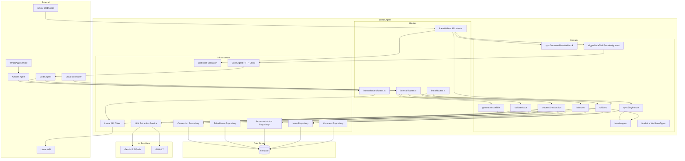
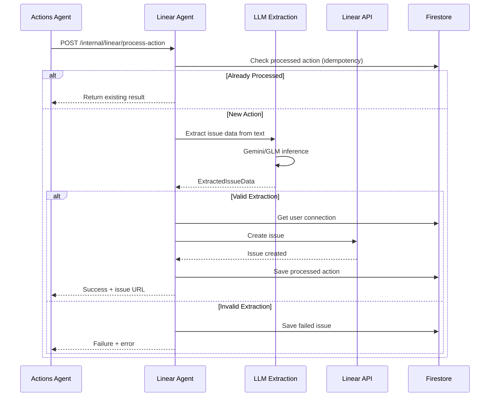
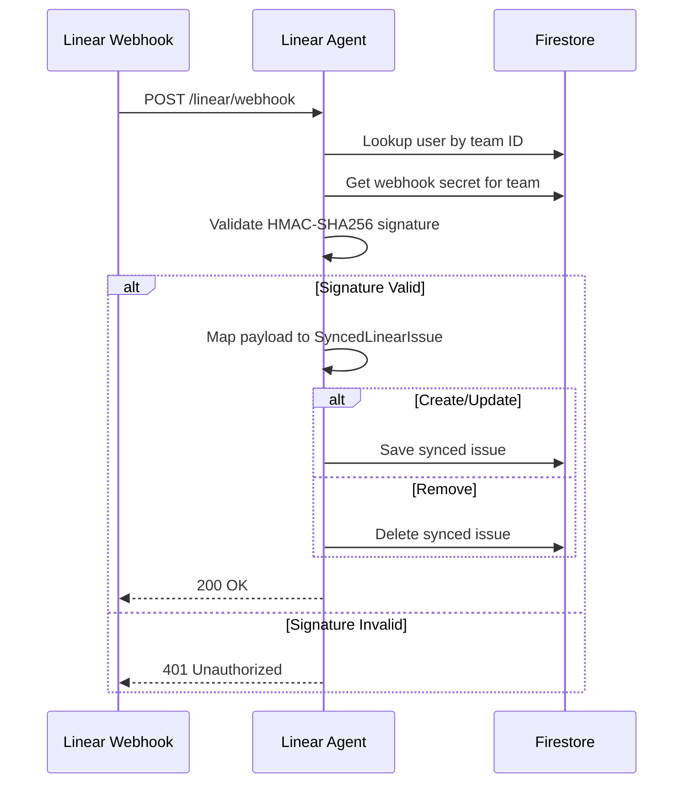
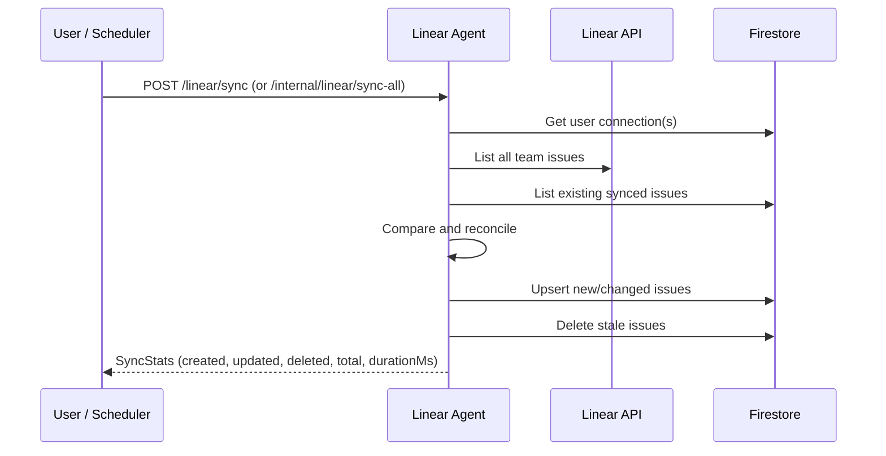

# Linear Agent - Technical Reference

## Overview

Linear Agent provides bidirectional integration between IntexuraOS and Linear project management. It enables natural language issue creation through voice messages with AI-powered extraction, real-time webhook synchronization, full issue sync, issue validation, AI title generation, and programmatic issue management for code agents. The service runs on Cloud Run with auto-scaling and uses the `@linear/sdk` for GraphQL API communication. The dashboard reads from local Firestore (populated by webhook sync) for fast, offline-capable issue listing.

## Architecture



## Data Flow

### Voice-to-Issue Pipeline



### Webhook Sync Flow



### Full Sync Flow



## Recent Changes

| Commit     | Description                                                             | Date       |
| ---------- | ----------------------------------------------------------------------- | ---------- |
| `d5810213` | Use unique actionId for webhook dedup and propagate all dedup errors    | 2026-02-21 |
| `dc45d1ea` | Align auto-trigger prompt with planning agent behavior                  | 2026-02-21 |
| `a88db80f` | Auto-trigger code tasks on Linear issue assignment                      | 2026-02-20 |
| `6f35c16a` | Pass raw errors to pino logger (improved error observability)           | 2026-02-20 |
| `b846dcc5` | Include assignee in list issues response mapper                         | 2026-02-20 |
| `99e05f19` | Preserve assignee data during full sync (INT-573)                       | 2026-02-20 |
| `75cc9eb7` | Fix validateIssue label serialization; map LinearLabel[] to string[]    | 2026-02-19 |
| `6063175b` | Add dev-mode log formatting via createLogStream() for PM2 readability   | 2026-02-16 |
| `a52a6bbc` | Add Dash0 OpenTelemetry integration (distributed tracing + metrics)     | 2026-02-16 |
| `3f58c89f` | Switch Linear dashboard to Firestore with parent-child support          | 2026-02-10 |
| `c1fe452d` | Remove regex fallback from title generation, always use LLM             | 2026-02-15 |
| `c72b7c53` | Switch default LLM to Gemini 2.5 Flash + add fallback + longer timeout  | 2026-02-15 |

### Auto-Trigger Code Tasks on Assignment (a88db80f + dc45d1ea)

When a Linear issue is assigned for the first time via a webhook event, `triggerCodeTaskFromAssignment` fires a code task through the code-agent internal API. The trigger criteria are strict:

- `action` must be `update`
- `updatedFrom.assigneeId` must be `null` (no previous assignee)
- `data.assignee` must be non-null (new assignee set)
- `data.state.type` must be `unstarted` (not already in progress)
- Issue must NOT have a `Code Task` label (prevents re-triggering)

The prompt instructs the code agent to analyze the linked Linear issue, enrich the description with requirements, acceptance criteria, and test plan, then mark it ready for execution or flag it as unclear. The action is fire-and-forget (`void` promise) -- webhook response is not blocked.

Action IDs use the format `webhook-assign-{identifier}-{timestamp}` for idempotent dedup.

### Assignee Data in Full Sync and Dashboard (99e05f19 + b846dcc5)

The Linear API client now fetches assignee data (`id`, `name`) alongside each issue during `listIssues` and `getIssue` calls. The `mapApiIssueToSyncedIssue` mapper preserves `assigneeId` and `assigneeName` from the API response, and the `listIssues` use case includes assignee data in the dashboard response via `syncedToLinearIssue`. Previously, assignee was only available from webhook payloads -- now it persists through full sync.

### Webhook Dedup Fix (d5810213)

The `triggerCodeTaskFromAssignment` function previously generated action IDs that could collide across different webhook events for the same issue. The fix uses `webhook-assign-{identifier}-{timestamp}` format, ensuring each webhook event produces a unique action ID. Additionally, all dedup errors from the code-agent response are now propagated to the logger for observability.

### Firestore-First Dashboard (0fa80ae6 + 3f58c89f)

The `listIssues` use case no longer calls the Linear API at request time. Instead, it reads from the local `linear_issues` Firestore collection (populated by webhooks and full sync). This enables:

- **Faster responses** — no Linear API round-trip on dashboard load
- **Parent-child hierarchy** — the use case builds an in-memory tree: top-level issues carry their children in a `children[]` array
- **Offline robustness** — dashboard works even if Linear API is temporarily unavailable

Issues are still sorted by `updatedAt` (most recent first) within each column.

### Comments System

New in this release: synced comments stored in Firestore via `linearCommentRepository`. Two new public endpoints allow fetching issue detail and paginated comments:

- `GET /linear/issues/:identifier` — returns issue with `commentCount` and `lastCommentAt`
- `GET /linear/issues/:identifier/comments` — paginated comments (`limit`, `offset`, `hasMore`, `total`)

### LLM Title Generation: No Regex Fallback (c1fe452d)

The `generateIssueTitle` use case no longer falls back to regex extraction when the LLM fails. It now:

1. Tries LLM generation up to 2 times (retry on failure)
2. Returns `err({ code: 'LLM_ERROR' | 'PARSE_ERROR' })` if all attempts fail
3. Returns `ok({ title: 'Code task', issueType: 'feature' })` for empty descriptions

Callers must handle the error case rather than receiving a degraded title silently.

### New Internal HTTP Endpoints

The following use cases previously had no HTTP exposure and are now accessible over the internal API:

- `GET /internal/linear/issues/:identifier/validate` — validates issue identifier and team ownership
- `POST /internal/linear/issues/generate-title` — generates a title from a task description
- `POST /internal/linear/sync-all` — full sync for all connected users (OIDC + internal auth)
- `POST /internal/linear/sync` — full sync for a specific user (service-to-service)

### Label Serialization Fix at HTTP Boundary (75cc9eb7)

The `GET /internal/linear/issues/:identifier/validate` endpoint previously returned `LinearLabel[]` objects in the `labels` field, which serialized as `"[object Object]"` strings. The fix maps label objects to name strings at the HTTP boundary in `internalRoutes.ts`:

```typescript
return await reply.ok({
  ...result.value,
  labels: result.value.labels.map((l) => l.name),
});
```

The domain `ValidatedIssue` type retains `labels: LinearLabel[]` (full objects) — the transformation is only applied at the API surface.

### OpenTelemetry / Dash0 Integration (a52a6bbc)

Distributed tracing, metrics, and log export are now enabled via the `@intexuraos/infra-otel` package. The instrumentation loads transparently via the `--import` Node.js flag:

```dockerfile
CMD ["node", "--import", "./dist/otel-register.js", "dist/index.js"]
```

The `OTEL_SERVICE_NAME` env var is set to `linear-agent` in production. When `INTEXURAOS_DASH0_OTLP_ENDPOINT` is unset (local development), telemetry is a no-op.

### Hardcoded Team ID Fixed

The `POST /linear/failed-issues/:id/retry` endpoint previously used `teamId: 'TODO'`. It now calls `connectionRepository.getFullConnection()` to retrieve the real team ID before creating the issue. This resolves a known bug where retried issues might fail or land in the wrong team.

## API Endpoints

### Public Endpoints

| Method | Path                                  | Purpose                           | Auth   |
| ------ | ------------------------------------- | --------------------------------- | ------ |
| GET    | `/linear/connection`                  | Get user's connection status      | Bearer |
| POST   | `/linear/connection/validate`         | Validate API key, get teams       | None   |
| POST   | `/linear/connection`                  | Save connection configuration     | Bearer |
| DELETE | `/linear/connection`                  | Disconnect from Linear            | Bearer |
| GET    | `/linear/issues`                      | List issues grouped by column     | Bearer |
| GET    | `/linear/issues/:identifier`          | Get single issue with comments    | Bearer |
| GET    | `/linear/issues/:identifier/comments` | List paginated issue comments     | Bearer |
| GET    | `/linear/failed-issues`               | List failed extractions           | Bearer |
| DELETE | `/linear/failed-issues/:id`           | Delete a failed extraction        | Bearer |
| POST   | `/linear/failed-issues/:id/retry`     | Retry a failed extraction         | Bearer |
| POST   | `/linear/sync`                        | Trigger full issue sync           | Bearer |
| GET    | `/linear/webhook-config`              | Get webhook URL and secret status | Bearer |
| POST   | `/linear/webhook-config`              | Set webhook signing secret        | Bearer |
| DELETE | `/linear/webhook-config`              | Remove webhook signing secret     | Bearer |

### Webhook Endpoints

| Method | Path              | Purpose                       | Auth                   |
| ------ | ----------------- | ----------------------------- | ---------------------- |
| POST   | `/linear/webhook` | Receive Linear webhook events | HMAC-SHA256 (per-team) |

### Internal Endpoints

| Method | Path                                           | Purpose                             | Auth              |
| ------ | ---------------------------------------------- | ----------------------------------- | ----------------- |
| POST   | `/internal/linear/process-action`              | Process action via AI extraction    | X-Internal        |
| GET    | `/internal/linear/issues/:identifier/validate` | Validate issue identifier           | X-Internal        |
| POST   | `/internal/linear/issues/generate-title`       | Generate title from description     | X-Internal        |
| POST   | `/internal/linear/sync`                        | Full sync for a user                | X-Internal        |
| POST   | `/internal/linear/sync-all`                    | Full sync for all users (Scheduler) | X-Internal / OIDC |
| POST   | `/internal/issues`                             | Create a Linear issue               | X-Internal        |
| PATCH  | `/internal/issues/:issueId/state`              | Update issue workflow state         | X-Internal        |

### GET /linear/issues Response

```typescript
interface ListIssuesResponse {
  issues: {
    todo: LinearIssue[]; // Issues in "Todo" state
    backlog: LinearIssue[]; // Issues in "Backlog" state
    in_progress: LinearIssue[]; // Issues being worked on
    in_review: LinearIssue[]; // Issues in code review
    to_test: LinearIssue[]; // Issues awaiting QA
    done: LinearIssue[]; // Completed in last 7 days
    archive: LinearIssue[]; // Older completed issues
  };
  teamName: string;
}
```

### GET /linear/issues/:identifier Response

```typescript
interface IssueDetailResponse {
  id: string;
  identifier: string;
  title: string;
  description: string | null;
  state: { name: string; type: IssueStateCategory };
  priority: number;
  assignee: { id: string; name: string } | null;
  labels: { id: string; name: string; color: string }[];
  url: string;
  createdAt: string;
  updatedAt: string;
  commentCount: number;
  lastCommentAt: string | null;
}
```

### GET /linear/issues/:identifier/comments Response

```typescript
interface CommentsResponse {
  comments: LinearComment[];
  total: number;
  limit: number;
  offset: number;
  hasMore: boolean;
}
```

### POST /internal/issues Request/Response

```typescript
// Request
interface CreateIssueBody {
  title: string;
  description: string;
  labels?: string[]; // Accepted for future use
}

// Response
interface IssueResponse {
  id: string;
  identifier: string; // e.g., "INT-123"
  title: string;
  url: string;
}
```

### PATCH /internal/issues/:issueId/state Request

```typescript
interface UpdateStateBody {
  state: 'backlog' | 'in_progress' | 'in_review' | 'qa';
}
```

State names are mapped to Linear workflow state names: `backlog` -> "Backlog", `in_progress` -> "In Progress", `in_review` -> "In Review", `qa` -> "QA".

## Domain Models

### LinearLabel

```typescript
interface LinearLabel {
  id: string;
  name: string;
  color: string; // Hex color from Linear
}
```

Used in `LinearIssue`, `LinearIssueWithTeam`, and `SyncedLinearIssue`. Note: label `color` is stored in Firestore as of the labels support update.

### LinearIssue

```typescript
interface LinearIssue {
  id: string;
  identifier: string; // e.g., "INT-123"
  title: string;
  description: string | null;
  priority: 0 | 1 | 2 | 3 | 4; // 0=none, 1=urgent, 4=low
  state: {
    id: string;
    name: string;
    type: IssueStateCategory;
  };
  url: string;
  createdAt: string;
  updatedAt: string;
  completedAt: string | null;
  parentId?: string | null; // Parent issue UUID
  childCount: number; // Calculated from children array
  children: LinearIssue[]; // Populated in listIssues use case
  labels: LinearLabel[]; // Full label objects with color
}
```

### LinearIssueWithTeam

```typescript
interface LinearIssueWithTeam extends LinearIssue {
  teamId: string;
  childCount: number;
}
```

Used by `validateIssue` and `getIssueByIdentifier` for team ownership verification.

### SyncedLinearIssue

```typescript
interface SyncedLinearIssue {
  id: string; // Linear UUID (document ID)
  identifier: string; // e.g., "INT-444"
  title: string;
  description: string | null;
  state: string; // State name e.g., "In Progress"
  stateType: IssueStateCategory;
  priority: LinearPriority;
  assigneeId: string | null;
  assigneeName: string | null;
  labels: LinearLabel[]; // Full objects with id, name, color
  url: string;
  userId: string; // Owner user ID (for multi-tenant)
  parentId: string | null; // Parent issue UUID (null for top-level)
  createdAt: string;
  updatedAt: string;
  syncedAt: string;
  teamId: string; // Linear team ID (for webhook secret lookup)
}
```

Stored in Firestore. Created from webhook payloads via `mapWebhookToSyncedIssue` or API responses via `mapApiIssueToSyncedIssue`.

### LinearComment

```typescript
interface LinearComment {
  id: string; // Linear UUID (document ID)
  issueId: string; // Linear issue UUID
  issueIdentifier: string; // e.g., "INT-444"
  userId: string; // Comment author Linear user ID
  userName: string; // Comment author display name
  body: string; // Comment body (markdown)
  createdAt: string;
  updatedAt: string;
  syncedAt: string;
}
```

Stored in the `linear_issue_comments` Firestore collection. Synced via webhooks or full sync.

### WorkflowState

```typescript
interface WorkflowState {
  id: string;
  name: string;
  type: IssueStateCategory;
}
```

### IssueStateCategory

```typescript
type IssueStateCategory = 'backlog' | 'unstarted' | 'started' | 'completed' | 'cancelled';
```

### DashboardColumn

```typescript
type DashboardColumn = 'todo' | 'backlog' | 'in_progress' | 'in_review' | 'to_test' | 'done';
```

Frontend display columns for the 3-column layout:

| Column        | Contains                 | Linear State Types                |
| ------------- | ------------------------ | --------------------------------- |
| `todo`        | Ready-to-start issues    | unstarted with name "Todo"        |
| `backlog`     | Planned but not ready    | backlog type or name "Backlog"    |
| `in_progress` | Actively being worked on | started type (not review/test)    |
| `in_review`   | Code review stage        | started + name contains "review"  |
| `to_test`     | QA/testing stage         | started + name contains test/qa   |
| `done`        | Recently completed       | completed/cancelled (last 7 days) |

### LinearConnection

```typescript
interface LinearConnection {
  userId: string;
  apiKey: string;
  teamId: string;
  teamName: string;
  webhookSecret: string | null;
  connected: boolean;
  createdAt: string;
  updatedAt: string;
}
```

### ExtractedIssueData

```typescript
interface ExtractedIssueData {
  title: string;
  priority: 0 | 1 | 2 | 3 | 4;
  functionalRequirements: string | null;
  technicalDetails: string | null;
  valid: boolean;
  error: string | null;
  reasoning: string;
}
```

### FailedLinearIssue

```typescript
interface FailedLinearIssue {
  id: string;
  userId: string;
  actionId: string;
  originalText: string;
  extractedTitle: string | null;
  extractedPriority: LinearPriority | null;
  error: string;
  reasoning: string | null;
  createdAt: string;
  lastRetryAt?: string;
}
```

### ProcessedAction

```typescript
interface ProcessedAction {
  actionId: string;
  userId: string;
  issueId: string;
  issueIdentifier: string;
  resourceUrl: string;
  createdAt: string;
}
```

### Webhook Types

```typescript
type WebhookAction = 'create' | 'update' | 'remove';

interface LinearWebhookPayload {
  id: string;
  identifier: string;
  title: string;
  description: string | null;
  priority: number;
  url: string;
  createdAt: string;
  updatedAt: string;
  state: { id: string; name: string; type: string };
  assignee: { id: string; name: string } | null;
  labels: { id: string; name: string }[];
  team: { id: string; key: string };
}

interface LinearWebhookEvent {
  action: WebhookAction;
  type: string;
  data: LinearWebhookPayload;
  webhookTimestamp: number;
  webhookId: string;
}
```

## Use Cases

### processLinearAction

Extracts structured issue data from natural language via LLM, creates the issue in Linear, and tracks the action for idempotency. Saves failed extractions for manual review.

### listIssues

Reads all synced issues from Firestore, builds parent-child relationships in memory (children attached to their parents), and groups top-level issues by dashboard column using `mapStateToDashboardColumn`. Returns `GroupedIssues` with `archive` for issues older than 7 days. Issues within each column are sorted by `updatedAt` (most recent first). Does **not** call the Linear API.

### generateIssueTitle

Generates a concise issue title (max 80 chars) from a task description using LLM. Returns a `GeneratedTitle` with `title` and `issueType` (bug, feature, refactor, research). Retries once on failure. Returns `err()` if all attempts fail — no regex fallback.

### validateIssue

Validates a Linear issue identifier (format: `XXX-123`) against the user's connected workspace. Checks identifier format with regex, verifies issue existence via `getIssueByIdentifier`, and confirms team ownership. Returns `ValidatedIssue` with id, identifier, title, url, labels, and childCount.

### syncSingleIssue

Processes a single webhook event. Maps the webhook payload to `SyncedLinearIssue` via `issueMapper`, then saves (create/update) or deletes (remove) the issue in the local repository. Unknown actions are skipped.

### syncCommentFromWebhook

Processes a comment webhook event. Saves new or updated comments to `linear_issue_comments` or deletes removed ones.

### triggerCodeTaskFromAssignment

Triggered by webhook events when an issue is assigned for the first time. Calls the code-agent internal API (`POST /internal/code/process`) with a prompt to analyze the issue, enrich its description, and mark it ready. Fire-and-forget execution -- does not block the webhook response. Uses `shouldTriggerCodeTask` to validate the trigger criteria (first assignment, unstarted state, no "Code Task" label).

### fullSync / fullSyncAllUsers

`fullSync` performs a complete reconciliation for one user: fetches all Linear API issues (with assignee data), upserts to local storage, and deletes stale issues. Returns `SyncStats`. `fullSyncAllUsers` iterates all connected users, continuing on individual failures.

## Firestore Collections

| Collection                 | Owner        | Purpose                     |
| -------------------------- | ------------ | --------------------------- |
| `linear_connections`       | linear-agent | User Linear API credentials |
| `linear_failed_issues`     | linear-agent | Failed extraction records   |
| `linear_processed_actions` | linear-agent | Idempotency tracking        |
| `linear_issues`            | linear-agent | Locally synced issue data   |
| `linear_issue_comments`    | linear-agent | Locally synced comments     |

## AI Integration

### LLM Extraction Service

Uses Gemini 2.5 Flash or GLM-4.7 to parse natural language into structured issue data.

**Prompt Strategy:**

1. Extract concise title (max 100 chars)
2. Infer priority from urgency cues
3. Generate Functional Requirements section
4. Generate Technical Details section
5. Validate extraction completeness

### LLM Title Generation

Uses `linearIssueTitlePrompt` from `@intexuraos/llm-prompts` to generate titles. Response is validated with `LinearIssueTitleSchema` (Zod). Handles markdown code block wrapping in LLM responses. Retries once on any failure. Returns `err()` if 2 attempts fail — callers must handle the error.

**Model Selection:**

- Primary: Gemini 2.5 Flash (fast, cost-effective, default)
- Alternative: GLM-4.7 (multilingual support)
- Lightweight: GLM-4.7-Flash (cost-effective)

### Priority Inference

| Priority | Value | Trigger Words                             |
| -------- | ----- | ----------------------------------------- |
| Urgent   | 1     | urgent, asap, blocker, production down    |
| High     | 2     | high priority, important, critical        |
| Normal   | 3     | (default)                                 |
| Low      | 4     | when you have time, nice to have, someday |
| None     | 0     | (explicit no priority)                    |

## Webhook Integration

### Signature Validation

Linear webhooks are verified using HMAC-SHA256 signatures. The raw request body is captured via a custom Fastify content type parser and validated against the per-connection webhook secret using `crypto.timingSafeEqual` to prevent timing attacks.

**Signature Format:** `sha256=<hex-digest>` in the `Linear-Signature` header.

### Multi-Tenant Routing

1. Extract team ID from webhook payload
2. Look up connected user by team ID (`findUserIdByTeamId`)
3. Look up webhook secret for team (`findWebhookSecretByTeamId`)
4. Validate signature with the per-connection secret
5. Process webhook event for the matched user

### Issue Mapper

The `issueMapper` module provides two mapping functions:

- `mapWebhookToSyncedIssue` - Maps webhook payload with assignee, labels (as `LinearLabel[]`), and team data
- `mapApiIssueToSyncedIssue` - Maps API response (assignee and labels set to null/empty)

Both include safe parsing of state types (defaults to 'unstarted') and priority values (defaults to 0).

## Linear API Client Optimizations

The Linear API client includes performance optimizations (INT-95):

### Client Caching

- Reuses `LinearClient` instances per API key
- 5-minute TTL with automatic cleanup
- Leverages SDK connection pooling

### Request Deduplication

- Caches in-flight requests for 10 seconds
- Prevents duplicate API calls during concurrent requests
- Key format: `{operation}:{apiKeyPrefix}:{params}`

### Batch State Fetching

- Uses `Promise.all` for parallel state resolution
- Eliminates N+1 queries when listing issues

### API Methods

| Method                 | Purpose                                   |
| ---------------------- | ----------------------------------------- |
| `getIssueByIdentifier` | Fetch issue by identifier with team ID    |
| `updateIssueState`     | Transition issue to a new workflow state  |
| `getWorkflowStates`    | List available workflow states for a team |

## Configuration

| Variable                              | Required | Description                           |
| ------------------------------------- | -------- | ------------------------------------- |
| `INTEXURAOS_USER_SERVICE_URL`         | Yes      | User service for LLM keys             |
| `INTEXURAOS_INTERNAL_AUTH_TOKEN`      | Yes      | Service-to-service auth               |
| `INTEXURAOS_APP_SETTINGS_SERVICE_URL` | Yes      | LLM pricing context source            |
| `INTEXURAOS_CODE_AGENT_URL`           | Yes      | Code agent for auto-trigger on assign |
| `INTEXURAOS_AUTH_JWKS_URL`            | Yes      | Auth0 JWKS endpoint                   |
| `INTEXURAOS_AUTH_ISSUER`              | Yes      | Auth0 issuer                          |
| `INTEXURAOS_AUTH_AUDIENCE`            | Yes      | Auth0 audience                        |
| `INTEXURAOS_SENTRY_DSN`               | Yes      | Sentry error tracking                 |
| `INTEXURAOS_GEMINI_APP_API_KEY`       | No       | Platform Gemini API key               |
| `INTEXURAOS_ZAI_APP_API_KEY`          | No       | Platform Zai API key                  |
| `INTEXURAOS_DASH0_OTLP_ENDPOINT`      | No       | Dash0 OTLP endpoint (no-op if unset)  |

## Dependencies

### Internal Services

| Service              | Endpoint                    | Purpose                                     |
| -------------------- | --------------------------- | ------------------------------------------- |
| user-service         | `/internal/user/llm-client` | LLM API key retrieval                       |
| app-settings-service | `/internal/pricing`         | LLM pricing data                            |
| code-agent           | `/internal/code/process`    | Auto-trigger code tasks on issue assignment |
| actions-agent        | (caller)                    | Upstream orchestrator                       |
| code-agent           | (caller)                    | Programmatic issue mgmt                     |

### External Services

| Service         | Purpose                         | Failure Mode            |
| --------------- | ------------------------------- | ----------------------- |
| Linear API      | Issue CRUD, team/state queries  | Return error to client  |
| Linear Webhooks | Real-time issue change events   | Retry by Linear         |
| Gemini API      | Issue data extraction / titles  | Return extraction error |
| GLM API         | Alternative extraction provider | Fallback available      |

## Error Handling

| Error Code          | HTTP | Description                           |
| ------------------- | ---- | ------------------------------------- |
| `NOT_CONNECTED`     | 403  | User has no Linear connection         |
| `INVALID_API_KEY`   | 401  | Linear API key is invalid             |
| `RATE_LIMIT`        | 429  | Linear API rate limit exceeded        |
| `EXTRACTION_FAILED` | 200  | LLM could not extract issue data\*    |
| `API_ERROR`         | 500  | Generic Linear API failure            |
| `TEAM_NOT_FOUND`    | 500  | Specified team not found              |
| `INTERNAL_ERROR`    | 500  | Internal database or processing error |
| `INVALID_FORMAT`    | 400  | Invalid issue identifier format       |
| `NOT_FOUND`         | 404  | Issue not found in Linear workspace   |
| `WRONG_TEAM`        | 403  | Issue belongs to a different team     |
| `LLM_ERROR`         | 500  | Title generation LLM failure          |
| `PARSE_ERROR`       | 500  | Title generation JSON parse failure   |

\*Note: Extraction failures return 200 with `status: 'failed'` per ServiceFeedback contract.

## Gotchas

- Linear state names are case-insensitive for column mapping ("In Review", "IN REVIEW", "in review" all work)
- The `completedAt` field is not stored in `SyncedLinearIssue` — `updatedAt` is used as a proxy for archive cutoff
- Idempotency check uses `actionId`, not message content hash
- Client cache cleanup runs on interval, may hold stale clients during low traffic
- Webhook signature validation requires raw body capture via custom Fastify content type parser
- `mapApiIssueToSyncedIssue` preserves assignee data from the API response (id + name); labels default to the API response values
- Unknown webhook state types default to `unstarted`; out-of-range priority values default to 0
- `generateIssueTitle` returns `err()` on LLM failure — no silent degradation
- Dashboard (`GET /linear/issues`) reads from Firestore; run a full sync if data seems stale
- `/internal/linear/sync-all` accepts both OIDC Bearer tokens (Cloud Scheduler) and X-Internal-Auth
- Labels are full objects `{ id, name, color }` internally; `validateIssue` HTTP response maps them to `string[]` (names only)
- OpenTelemetry instrumentation is transparent -- loaded via `--import otel-register.js` at process start
- Auto-trigger code task fires only on first assignment (null -> non-null assignee) while state is `unstarted` and issue has no `Code Task` label
- Webhook-triggered action IDs use `webhook-assign-{identifier}-{timestamp}` to ensure uniqueness per event

## File Structure

```
apps/linear-agent/
├── src/
│   ├── domain/
│   │   ├── models.ts             # LinearIssue, SyncedLinearIssue, LinearComment, etc.
│   │   ├── errors.ts             # LinearError definitions
│   │   ├── ports.ts              # Repository/client interfaces
│   │   ├── webhookTypes.ts       # LinearWebhookEvent, LinearWebhookPayload
│   │   ├── issueMapper.ts        # mapWebhookToSyncedIssue, mapApiIssueToSyncedIssue
│   │   ├── index.ts              # Domain barrel exports
│   │   └── useCases/
│   │       ├── processLinearAction.ts   # AI extraction + issue creation
│   │       ├── listIssues.ts            # Firestore-based dashboard grouping
│   │       ├── generateIssueTitle.ts    # LLM title generation (no regex fallback)
│   │       ├── validateIssue.ts         # Issue identifier validation
│   │       ├── syncSingleIssueUseCase.ts # Webhook event processing
│   │       ├── syncCommentFromWebhook.ts         # Comment webhook processing
│   │       ├── triggerCodeTaskFromAssignment.ts  # Auto-trigger on issue assignment
│   │       └── fullSyncUseCase.ts                # Full issue reconciliation
│   ├── infra/
│   │   ├── firestore/
│   │   │   ├── linearConnectionRepository.ts
│   │   │   ├── failedIssueRepository.ts
│   │   │   ├── processedActionRepository.ts
│   │   │   ├── linearIssueRepository.ts
│   │   │   └── linearCommentRepository.ts  # NEW: comment storage
│   │   ├── linear/
│   │   │   └── linearApiClient.ts
│   │   ├── http/
│   │   │   └── codeAgentHttpClient.ts       # Code agent HTTP client
│   │   ├── linearWebhookValidation.ts
│   │   └── llm/
│   │       └── linearActionExtractionService.ts
│   ├── routes/
│   │   ├── linearRoutes.ts          # Public API (14 endpoints)
│   │   ├── internalRoutes.ts        # Internal: process-action, validate, title, sync, sync-all
│   │   ├── internalIssuesRoutes.ts  # Internal: issues CRUD + state
│   │   └── linearWebhookRoutes.ts   # Webhook receiver
│   ├── services.ts                  # DI container (9 services)
│   ├── server.ts                    # Fastify setup with raw body parser
│   └── index.ts                     # Entry point
├── __tests__/                       # Comprehensive test suite (25+ test files)
└── package.json
```

---

**Last updated:** 2026-02-22
