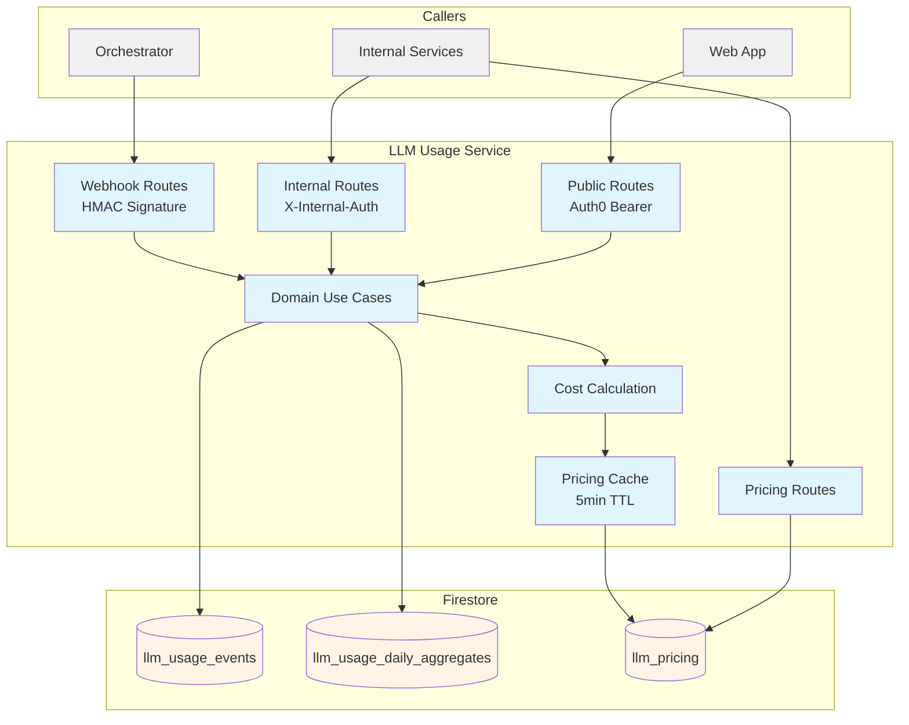
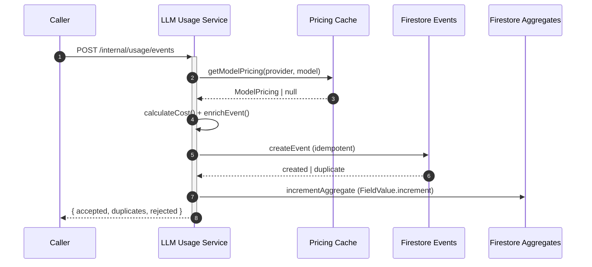

# LLM Usage Service — Technical Reference

## Overview

LLM Usage Service ingests, stores, and aggregates LLM API usage events from across IntexuraOS. It runs on Cloud Run as a Fastify application backed by three Firestore collections (`llm_usage_events`, `llm_usage_daily_aggregates`, `llm_pricing`). It supports five LLM providers: Anthropic, OpenAI, Google, Perplexity, and OpenRouter.

## Architecture



## Data Flow



## Recent Changes

| Commit       | Description                                                             | Date        |
| ------------ | ----------------------------------------------------------------------- | ----------- |
| `ece85903c`  | Reject `request.promptType` as a groupBy option (returned 500)          | 2 days ago  |
| `606417bb0`  | Add `promptType` to groupBy options (later reverted at query layer)     | 6 days ago  |
| `7ec9b2209`  | Add `promptType` to UsageEvent schema                                   | 6 days ago  |
| `a4f53cd70`  | Remove LLM pricing from 9 remaining apps (centralized in this service)  | 6 days ago  |
| `b16dd53b2`  | Enforce discriminated union on schemaVersion in request validation      | 7 days ago  |
| `9da689e4a`  | Add pricing cache, v2 event enrichment, and route refactoring           | 7 days ago  |
| `a83fd2f54`  | Add consolidated cost calculation service                               | 8 days ago  |
| `35072bc91`  | Widen try/catch to cover doc-ref construction in event creation         | 8 days ago  |
| `fbe13bda8`  | Hash `source.client` in aggregate doc-id for Firestore path safety      | 8 days ago  |
| `806c0d7e2`  | Add GET /internal/pricing route and backfill endpoint                   | 11 days ago |

## API Endpoints

### Public Endpoints (Auth0 Bearer)

| Method | Path                         | Purpose                        |
| ------ | ---------------------------- | ------------------------------ |
| POST   | `/events/list`     | List usage events (paginated)  |
| GET    | `/events/:eventId` | Get a single usage event by ID |
| POST   | `/query`           | Query aggregated usage data    |
| GET    | `/pricing`         | Get all LLM pricing            |

### Internal Endpoints (X-Internal-Auth)

| Method | Path                                | Purpose                                     | Caller               |
| ------ | ----------------------------------- | ------------------------------------------- | -------------------- |
| POST   | `/internal/usage/events`            | Ingest usage events (v2 schema)             | Any internal service |
| POST   | `/internal/webhooks/usage-events`   | Ingest usage events (orchestrator, HMAC)    | Orchestrator         |
| POST   | `/internal/pricing`                 | Write pricing for a provider                | Admin tooling        |
| GET    | `/internal/pricing`                 | Read all pricing (for consumer boot)        | Any internal service |

### System Endpoints

| Method | Path             | Purpose            |
| ------ | ---------------- | ------------------ |
| GET    | `/health`        | Health check       |
| GET    | `/openapi.json`  | OpenAPI spec       |
| GET    | `/docs`          | Swagger UI         |

## Domain Model

### UsageEvent (stored, schemaVersion: 1)

| Field         | Type                                                               | Description                                     |
| ------------- | ------------------------------------------------------------------ | ----------------------------------------------- |
| `eventId`     | `string`                                                           | Unique event identifier (used as Firestore key) |
| `occurredAt`  | `string` (ISO 8601)                                                | When the LLM call happened                      |
| `receivedAt`  | `string` (ISO 8601)                                                | When the service received the event             |
| `ingress`     | `'internal' \                                                      | 'orchestrator_webhook'`                         | Which endpoint received the event |
| `owner`       | `{ type: 'user' \                                                  | 'system', id: string }`                         | Event owner |
| `source`      | `{ service, component, client, environment, workerLocation? }`     | Call origin metadata                            |
| `request`     | `{ provider, model, operation, success, durationMs, promptType? }` | LLM request metadata                            |
| `usage`       | `UsageTokens`                                                      | Token counts (input, output, cache, reasoning)  |
| `cost`        | `{ billedUsd, providerReportedUsd, calculatedUsd, pricingSource }` | Resolved cost data                              |
| `correlation` | `{ requestId, traceId, taskId, researchId, attempt, sessionId }`   | Traceability fields                             |
| `error`       | `{ code, message } \                                               | null`                                           | Error details if the LLM call failed |

**Operation Values:** `research`, `generate`, `image_generation`, `tool_calling`, `other`

**Pricing Source Values:** `provider_reported`, `calculated`, `mixed`, `external`

### UsageEventInput (ingested, schemaVersion: 2)

Same as UsageEvent but without `receivedAt`, `ingress` (server-set), and with a simplified `cost` object containing only `providerReportedUsd` and `pricingSource` (`'pending' | 'provider_reported'`). The server enriches input to full event via `calculateCost()`.

### DailyUsageAggregate

Pre-computed daily rollups keyed by a composite ID: `{date}__{ownerType}__{ownerIdHash}__{service}__{component}__{clientHash}__{environment}__{provider}__{modelHash}__{operation}__{success}`. Uses Firestore `FieldValue.increment()` for atomic counter updates.

**Metrics:** `calls`, `costUsd`, `inputTokens`, `outputTokens`, `totalTokens`, `cacheReadTokens`, `cacheWriteTokens`, `cachedTokens`, `reasoningTokens`, `thinkingTokens`, `webSearchCalls`, `imageCount`

### UsageQueryRequest

| Field       | Type                    | Description                                                     |
| ----------- | ----------------------- | --------------------------------------------------------------- |
| `timeRange` | `{ from, to }`          | ISO date-time range                                             |
| `filters`   | `UsageEventFilters?`    | Filter by owner, service, provider, model, operation, success   |
| `groupBy`   | `string[]?`             | Group dimensions (see allowed values below)                     |
| `sortBy`    | `{ field, direction }?` | Sort by any metric field                                        |
| `limit`     | `number?`               | Max rows (default 100, max 500)                                 |

**Allowed groupBy:** `day`, `owner.type`, `owner.id`, `source.service`, `source.component`, `source.client`, `request.provider`, `request.model`, `request.operation`, `request.success`

**Allowed sortBy:** `calls`, `costUsd`, `inputTokens`, `outputTokens`, `totalTokens`, `cacheReadTokens`, `cacheWriteTokens`, `cachedTokens`, `reasoningTokens`, `thinkingTokens`, `webSearchCalls`, `imageCount`

## Cost Calculation

Provider-specific cost logic in `costCalculation.ts`:

| Provider    | Special Handling                                                                  |
| ----------- | --------------------------------------------------------------------------------- |
| Anthropic   | Cache read (0.1x input), cache write (1.25x input), web search per-call fee       |
| Google      | Thinking tokens at output price, grounding flat fee, image generation             |
| OpenAI      | Cached tokens subtracted from input (0.5x multiplier), web search fee, images     |
| Perplexity  | Minimum 1 web search call per request, per-call request fee                       |
| OpenRouter  | Standard input/output token pricing                                               |

All prices stored as per-million-tokens. Calculation uses scaled integer math with `Math.round()` for precision.

## Dependencies

### Internal Packages

| Package                       | Purpose                                            |
| ----------------------------- | -------------------------------------------------- |
| `@intexuraos/common-core`     | Result types, Logger, errors                       |
| `@intexuraos/common-http`     | Auth middleware, logging                           |
| `@intexuraos/http-server`     | Health checks, env validation                      |
| `@intexuraos/http-contracts`  | Core OpenAPI schemas                               |
| `@intexuraos/infra-firestore` | Firestore client                                   |
| `@intexuraos/infra-sentry`    | Error tracking                                     |
| `@intexuraos/llm-contract`    | LlmProvider, ModelPricing types, LlmProviders enum |

## Configuration

| Variable                          | Purpose                             | Required |
| --------------------------------- | ----------------------------------- | -------- |
| `INTEXURAOS_GCP_PROJECT_ID`       | GCP project for Firestore           | Yes      |
| `INTEXURAOS_INTERNAL_AUTH_TOKEN`  | Token for internal service auth     | Yes      |
| `INTEXURAOS_ORCHESTRATOR_SECRET`  | HMAC secret for webhook validation  | Yes      |
| `INTEXURAOS_SENTRY_DSN`           | Sentry error tracking DSN           | No       |
| `INTEXURAOS_ENVIRONMENT`          | Environment identifier              | No       |
| `PORT`                            | Server port (default 8080)          | No       |
| `HOST`                            | Server host (default 0.0.0.0)       | No       |
| `LOG_LEVEL`                       | Logging level (default info)        | No       |

## Firestore Collections

| Collection                    | Owner             | Key Strategy                                  |
| ----------------------------- | ----------------- | --------------------------------------------- |
| `llm_usage_events`            | llm-usage-service | `eventId` (idempotent create via `.create()`) |
| `llm_usage_daily_aggregates`  | llm-usage-service | Composite: date + dimensions (hashed)         |
| `llm_pricing`                 | llm-usage-service | Provider name (one doc per provider)          |

## Gotchas

- **Aggregate doc IDs hash variable-length fields** (`owner.id`, `source.client`, `request.model`) using SHA-256 truncated to 32 hex chars. This prevents Firestore path issues with slashes in client strings but means you cannot reverse-lookup the original value from the doc ID.
- **Firestore disjunction limit**: The list endpoint pushes only the first populated array filter to Firestore as an `in` clause. Additional array filters are applied in-memory post-fetch, which means pages may be shorter than the requested `limit`.
- **Pricing cache has a 5-minute TTL**. After updating pricing via `POST /internal/pricing`, consumers calling the ingestion endpoint may use stale pricing for up to 5 minutes.
- **Webhook auth uses HMAC-SHA256** with a 15-minute replay window. The signature covers `{timestamp}.{rawBody}`.
- **schemaVersion discriminated union**: Input events must have `schemaVersion: 2`. Stored events are normalized to `schemaVersion: 1`. Sending `schemaVersion: 1` on the input endpoint returns a 400.
- **Orchestrator webhook requires `source.service === 'orchestrator'`** and `source.workerLocation` — enforced by the `OrchestratorUsageEventInput` JSON schema.
- **`request.promptType` is stored on raw events** but not propagated to daily aggregates, so it cannot be used as a `groupBy` dimension in aggregate queries.
- **Perplexity cost calculation floors webSearchCalls to 1** — Perplexity always charges at least one request fee per API call, even when the event reports 0 web search calls.

## File Structure

```
apps/llm-usage-service/src/
├── domain/
│   ├── models/
│   │   ├── cursor.ts           # Base64url cursor encode/decode
│   │   ├── dailyAggregate.ts   # DailyUsageAggregate interface
│   │   ├── usageEvent.ts       # UsageEvent, UsageEventInput types
│   │   └── usageQuery.ts       # Query request/response types, allowed fields
│   ├── repositories/
│   │   ├── pricingRepository.ts        # PricingRepository port
│   │   ├── usageAggregateRepository.ts # UsageAggregateRepository port
│   │   └── usageEventRepository.ts     # UsageEventRepository port
│   ├── services/
│   │   ├── costCalculation.ts  # Provider-specific cost calculation
│   │   └── pricingCache.ts     # TTL-based pricing cache
│   └── usecases/
│       ├── getUsageEvent.ts    # Get single event by ID
│       ├── ingestUsageEvents.ts# Ingest + enrich + aggregate
│       ├── listUsageEvents.ts  # Paginated event listing
│       └── queryUsage.ts       # Aggregate query with groupBy/sortBy
├── infra/
│   ├── firestore/
│   │   ├── aggregateKeyUtils.ts              # SHA-256 hashing, date extraction
│   │   ├── firestorePricingRepository.ts     # Pricing CRUD
│   │   ├── firestoreUsageAggregateRepository.ts # Atomic increment aggregates
│   │   └── firestoreUsageEventRepository.ts  # Event CRUD + filtered listing
│   └── webhookValidation.ts    # HMAC-SHA256 orchestrator signature validation
├── routes/
│   ├── schemas/
│   │   ├── pricingSchema.ts        # ProviderPricing JSON schema
│   │   └── usageEventSchema.ts     # UsageEventInput + Orchestrator schemas
│   ├── index.ts                    # Route registration
│   ├── internalUsageRoutes.ts      # POST /internal/usage/events
│   ├── pricingRoutes.ts            # Pricing CRUD routes
│   ├── publicUsageRoutes.ts        # Auth0-protected usage routes
│   └── webhookUsageRoutes.ts       # Orchestrator webhook route
├── index.ts                        # Entry point, env validation
├── server.ts                       # Fastify setup, OpenAPI, health check
└── services.ts                     # DI container
```
