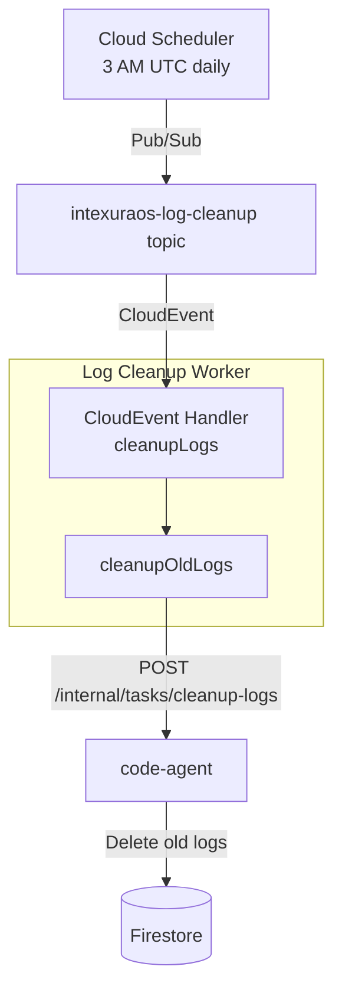

# Log Cleanup Worker - Technical Reference

## Overview

Log-cleanup is a Cloud Function (Gen2) triggered by Pub/Sub. It delegates log deletion to code-agent's internal API, passing configurable retention, batch, and task-limit parameters. Cloud Scheduler publishes to the trigger topic daily at 3 AM UTC.

## Architecture



## Trigger

| Property | Value                                              |
| -------- | -------------------------------------------------- |
| Type     | Pub/Sub CloudEvent                                 |
| Topic    | `intexuraos-log-cleanup-{env}`                     |
| Schedule | `0 3 * * *` (3 AM UTC, daily)                      |
| Timezone | UTC                                                |
| Retries  | 1 (Cloud Scheduler), plus Pub/Sub delivery retries |

## Internal API Call

The worker sends a single HTTP request to code-agent:

| Method | Path                           | Auth                     |
| ------ | ------------------------------ | ------------------------ |
| POST   | `/internal/tasks/cleanup-logs` | `X-Internal-Auth` header |

### Request Body

```typescript
{
  retentionDays?: number;  // Days to retain logs
  batchSize?: number;      // Logs per deletion batch
  tasksPerRun?: number;    // Max tasks to process
}
```

All fields are optional. When omitted, code-agent uses its own defaults.

### Response

```typescript
{
  success: boolean;
  data?: {
    tasksProcessed: number;
    tasksFailed: number;
    logsDeleted: number;
    durationMs: number;
  };
  error?: {
    code: string;
    message: string;
  };
}
```

## Domain Models

### CleanupConfig

| Field               | Type   | Required | Description                 |
| ------------------- | ------ | -------- | --------------------------- |
| `codeAgentUrl`      | string | Yes      | Base URL of code-agent      |
| `internalAuthToken` | string | Yes      | Internal auth token         |
| `retentionDays`     | number | No       | Days to keep logs           |
| `batchSize`         | number | No       | Logs deleted per batch      |
| `tasksPerRun`       | number | No       | Max tasks processed per run |

### CleanupResult

| Field            | Type    | Description                             |
| ---------------- | ------- | --------------------------------------- |
| `success`        | boolean | Whether cleanup completed               |
| `message`        | string  | Human-readable result or error          |
| `tasksProcessed` | number  | Number of tasks whose logs were checked |
| `tasksFailed`    | number  | Number of tasks that failed cleanup     |
| `logsDeleted`    | number  | Total logs deleted                      |
| `durationMs`     | number  | Execution time in milliseconds          |

## Error Handling

| Scenario                     | Behavior                                           |
| ---------------------------- | -------------------------------------------------- |
| HTTP non-2xx from code-agent | Return failure with status code and response body  |
| API returns `success: false` | Return failure with API error message              |
| API returns no `data`        | Return failure: "API returned success but no data" |
| Network/fetch error          | Catch, log, return failure with error message      |
| Worker throws                | Cloud Functions retries via Pub/Sub                |

## Dependencies

| Service    | Purpose                                       |
| ---------- | --------------------------------------------- |
| code-agent | Performs actual log deletion via internal API |

## Configuration

| Environment Variable             | Required | Default     | Description                    |
| -------------------------------- | -------- | ----------- | ------------------------------ |
| `INTEXURAOS_CODE_AGENT_URL`      | Yes      | -           | Base URL of code-agent service |
| `INTEXURAOS_INTERNAL_AUTH_TOKEN` | Yes      | -           | Shared internal auth token     |
| `INTEXURAOS_LOG_RETENTION_DAYS`  | No       | Server-side | Days to retain logs            |
| `INTEXURAOS_LOG_BATCH_SIZE`      | No       | Server-side | Logs per deletion batch        |
| `INTEXURAOS_LOG_TASKS_PER_RUN`   | No       | Server-side | Max tasks per execution        |
| `LOG_LEVEL`                      | No       | `info`      | Pino log level                 |

## Infrastructure

| Resource             | Type | Value                           |
| -------------------- | ---- | ------------------------------- |
| Cloud Function       | Gen2 | `intexuraos-log-cleanup-{env}`  |
| Entry point          | -    | `cleanupLogs`                   |
| Runtime              | -    | Node.js 22                      |
| Memory               | -    | 512 MB                          |
| Timeout              | -    | 540 seconds (9 minutes)         |
| Pub/Sub topic        | -    | `intexuraos-log-cleanup-{env}`  |
| Scheduler job        | -    | `intexuraos-log-cleanup-{env}`  |
| Service account      | -    | `intexuraos-functions-{env}`    |
| Build tool           | -    | esbuild via `build-service.mjs` |
| Source bucket object | -    | `log-cleanup/function.zip`      |

## Build & Local Development

**Build:** `pnpm build` runs `build-service.mjs log-cleanup`, which bundles source files with esbuild into `dist/`. The esbuild bundling step was introduced to fix Cloud Functions deployment — prior zip packaging caused runtime module resolution failures.

**Local dev:** `pnpm dev` uses `node --watch --experimental-strip-types src/index.ts` — Node.js's built-in TypeScript stripping (no `tsx` required). Reload is automatic on file change.

## Gotchas

**Delegated deletion** - This worker does not access Firestore directly. All deletion logic lives in code-agent. If code-agent changes its internal API contract, this worker breaks silently (returns failure).

**Timeout alignment** - The Cloud Function timeout is 540 seconds. The code-agent endpoint must complete within that window. Large backlogs of logs can exceed this if `tasksPerRun` is not constrained.

**No dead-letter queue** - Failed Pub/Sub messages are retried but eventually dropped. There is no dead-letter topic configured for persistent failures.

**Unused `firebase-admin` dependency** - `package.json` lists `firebase-admin` as a runtime dep, but no source file imports it. The worker uses native `fetch` for HTTP and `pino` for logging only. This dep is a leftover from scaffolding and adds unnecessary bundle weight.

## File Structure

```
workers/log-cleanup/src/
  index.ts       - CloudEvent handler, registers cleanupLogs function
  cleanup.ts     - Config loading, HTTP call to code-agent, result mapping
  logger.ts      - Pino logger with error serialization
  __tests__/
    index.test.ts
    cleanup.test.ts
    logger.test.ts
```
