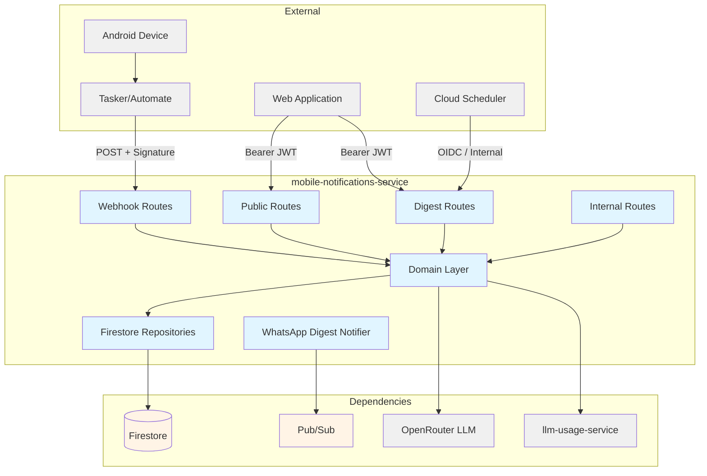
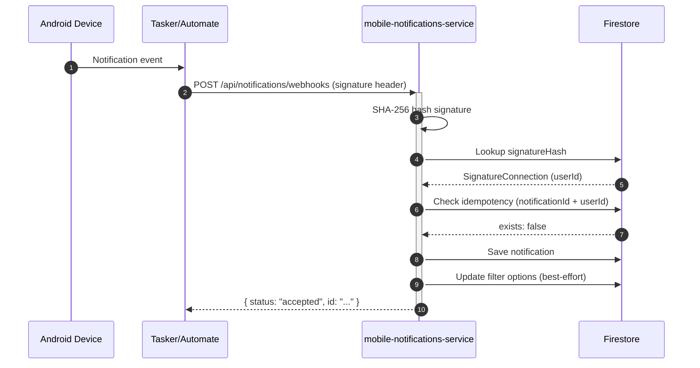
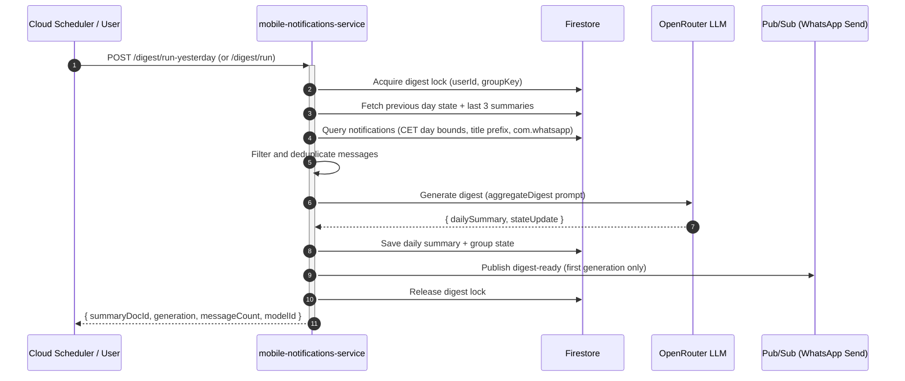

# Mobile Notifications Service — Technical Reference

## Overview

Mobile-notifications-service receives push notification data from Android devices via webhook, validates device signatures using SHA-256 hash comparison, deduplicates notifications, and stores them in Firestore. It also runs a WhatsApp group digest pipeline that aggregates daily messages into AI-generated summaries using LLM calls, persists group state across days, and delivers digest-ready notifications via Pub/Sub to WhatsApp. Production runs behind Hetzner nginx at `https://intexuraos.cloud/api/notifications`; development runs at `https://dev.intexuraos.cloud/api/notifications`. Service port: 8114.

## Architecture



## Data Flow — Notification Capture



## Data Flow — Digest Pipeline



## Recent Changes

### v3.6.0 — WhatsApp Group Digest Pipeline (INT-1382, Highlighted)

End-to-end pipeline that processes WhatsApp group messages into AI-generated digest summaries with daily highlights. Headline feature for this release.

| Change                                        | Description                                                                                               | Reference                 |
| --------------------------------------------- | --------------------------------------------------------------------------------------------------------- | ------------------------- |
| WhatsApp Group Digest pipeline                | Full digest pipeline: aggregation, LLM prompts, Firestore repos, lock mechanism, backfill, CET day bounds | INT-1382, PR #1863, #1856 |
| WhatsApp delivery for digests                 | Publish digest-ready notification via Pub/Sub to WhatsApp send topic                                      | INT-1417, PR #1879, #1877 |
| Per-day input isolation + headline/bullets UI | Digest schema changed from narrative to headline + bullets structure                                      | INT-1410, PR #1868        |
| Fixed missing daily summaries                 | Fixed digest cron run-yesterday endpoint returning 0 dispatched                                           | INT-1420, PR #1884        |
| Fixed timestamp filter (ms vs sec)            | Digest notification query used milliseconds instead of seconds for postTimeSec filter                     | INT-1412, PR #1874        |
| Added digest time-range index                 | Firestore composite index for efficient postTimeSec range queries                                         | INT-1413, PR #1872        |
| Digest filters by groupTitlePrefix            | Changed from slug-based to prefix-based group title matching                                              | INT-1409, PR #1866        |
| Restored digest LLM usage reporting           | Wired HttpInternalAuthUsageSink with brand for llm-usage-service                                          | INT-1421, PR #1887        |
| Removed 5-batch cap in title filter           | Title filter now iterates through all matching batches                                                    | INT-1398, PR #1843        |
| Notification message filter + dedup           | Added filterAndDedupeNotifications utility for cleaning raw notifications                                 | INT-1395, PR #1844        |

### Previous (pre-v3.5.0)

| Commit    | Change                                                    | Date       |
| --------- | --------------------------------------------------------- | ---------- |
| `549c969` | Enforce strict v8 ignore validation with blocker keywords | 2026-03-24 |
| `6ca6e5a` | Address review comments on v8-ignore tests                | 2026-03-11 |
| `b271a4a` | Write tests for v8-ignore blocks and remove exemptions    | 2026-03-10 |
| `5aa3e1b` | Enable strict 100% coverage enforcement (Phase 3)         | 2026-01-31 |

## API Endpoints

### Connection

| Method | Path                            | Purpose                     | Auth         |
| ------ | ------------------------------- | --------------------------- | ------------ |
| POST   | `/connect` | Create signature connection | Bearer token |
| GET    | `/status`  | Get connection status       | Bearer token |

### Notifications

| Method | Path                                     | Purpose             | Auth         |
| ------ | ---------------------------------------- | ------------------- | ------------ |
| GET    | `/`                  | List notifications  | Bearer token |
| DELETE | `/:notification_id` | Delete notification | Bearer token |

### Filters

| Method | Path                               | Purpose                    | Auth         | Response       |
| ------ | ---------------------------------- | -------------------------- | ------------ | -------------- |
| GET    | `/filters`           | Get filter options + saved | Bearer token | 200 OK         |
| POST   | `/filters/saved`     | Create saved filter        | Bearer token | 201 Created    |
| DELETE | `/filters/saved/:id` | Delete saved filter        | Bearer token | 204 No Content |

### Digest (User-Facing)

| Method | Path                                           | Purpose                            | Auth         |
| ------ | ---------------------------------------------- | ---------------------------------- | ------------ |
| GET    | `/digests`                       | List digests for date range        | Bearer token |
| GET    | `/digests/:groupKey/:date`       | Get single digest                  | Bearer token |
| GET    | `/digests/:groupKey/:date/state` | Get group state snapshot           | Bearer token |
| POST   | `/digests/run`                   | Regenerate digest for group + date | Bearer token |
| POST   | `/digests/backfill`              | Start backfill run for date range  | Bearer token |
| GET    | `/digests/backfill/:runId`       | Get backfill run status            | Bearer token |

### Digest (Internal)

| Method | Path                                           | Purpose                                          | Auth                  |
| ------ | ---------------------------------------------- | ------------------------------------------------ | --------------------- |
| POST   | `/internal/notifications/digest/run`           | Run digest for (userId, groupKey, date)          | Internal token        |
| POST   | `/internal/notifications/digest/run-yesterday` | Run digest for all subscriptions (CET yesterday) | OIDC / Internal token |

### Internal

| Method | Path                                   | Purpose                                  | Auth           |
| ------ | -------------------------------------- | ---------------------------------------- | -------------- |
| POST   | `/internal/mobile-notifications/query` | Query notifications (internal consumers) | Internal token |

### Webhook

| Method | Path                             | Purpose                          | Auth      |
| ------ | -------------------------------- | -------------------------------- | --------- |
| POST   | `/webhooks` | Receive push from mobile devices | Signature |

### System

| Method | Path            | Purpose      | Auth |
| ------ | --------------- | ------------ | ---- |
| GET    | `/health`       | Health check | None |
| GET    | `/openapi.json` | OpenAPI spec | None |
| GET    | `/docs`         | Swagger UI   | None |

## Webhook Payload

```typescript
interface WebhookPayload {
  source: string;          // e.g., "tasker"
  device: string;          // Device name
  app: string;             // App package name, e.g., "com.whatsapp"
  notification_id: string; // Idempotency key (unique per user)
  title: string;           // Notification title
  text: string;            // Notification body/content
  timestamp: number;       // Unix seconds from device
  post_time: string;       // Unix seconds as string from device
}
```

Authentication: `X-Mobile-Notifications-Signature` header. The header value is SHA-256 hashed and looked up against stored connection hashes.

## List Notifications Query Parameters

| Parameter | Type    | Description                                               |
| --------- | ------- | --------------------------------------------------------- |
| `limit`   | integer | 1-100, default 50                                         |
| `cursor`  | string  | Pagination cursor from previous response                  |
| `source`  | string  | Filter by source (comma-separated for multiple)           |
| `app`     | string  | Filter by app package name (comma-separated for multiple) |
| `title`   | string  | Case-insensitive partial match on title                   |

## Internal Query Body

```typescript
interface QueryNotificationsBody {
  userId: string;
  filter?: {
    app?: string[];   // OR logic across apps
    source?: string;  // Single value
    title?: string;   // Case-insensitive contains
  };
  limit?: number;     // 1-1000, default 50
}
```

Internal response maps `text` to `body` and `receivedAt` to `timestamp` for compatibility with consumers.

## Domain Models

### Notification

| Field            | Type   | Description                            |
| ---------------- | ------ | -------------------------------------- |
| `id`             | string | Notification ID (Firestore doc ID)     |
| `userId`         | string | Owner user ID                          |
| `source`         | string | Source identifier (e.g., "tasker")     |
| `device`         | string | Device name that sent the notification |
| `app`            | string | App package name                       |
| `title`          | string | Notification title                     |
| `text`           | string | Notification body content              |
| `timestamp`      | number | Unix seconds from device               |
| `postTime`       | string | Unix seconds as string from device     |
| `receivedAt`     | string | ISO 8601 server-side receipt timestamp |
| `notificationId` | string | Idempotency key (device-provided)      |

### SignatureConnection

| Field           | Type              | Description                         |
| --------------- | ----------------- | ----------------------------------- |
| `id`            | string            | Connection ID (Firestore doc ID)    |
| `userId`        | string            | Owner user ID                       |
| `signatureHash` | string            | SHA-256 hash of plaintext signature |
| `deviceLabel`   | string (optional) | User-provided label                 |
| `createdAt`     | string            | ISO 8601 timestamp                  |

### DailySummary (Digest)

| Field              | Type            | Description                                                            |
| ------------------ | --------------- | ---------------------------------------------------------------------- |
| `date`             | string          | YYYY-MM-DD (CET)                                                       |
| `groupKey`         | string          | Group identifier                                                       |
| `messageCount`     | number          | Messages processed                                                     |
| `headline`         | string          | One-line summary (max 200 chars)                                       |
| `bullets`          | string[]        | 3-7 key points (max 300 chars each)                                    |
| `threads`          | Thread[]        | Conversation threads with topic, participants, resolved flag, keyFacts |
| `moderatorPosts`   | ModeratorPost[] | Posts by moderators with time, topic, summary                          |
| `openQuestions`    | string[]        | Unanswered questions from the day                                      |
| `activityOutliers` | Outlier[]       | Unusually active participants with message count and note              |

### GroupState (Digest)

| Field                | Type       | Description                                                                       |
| -------------------- | ---------- | --------------------------------------------------------------------------------- |
| `userId`             | string     | Owner user ID                                                                     |
| `groupKey`           | string     | Group identifier                                                                  |
| `updatedAt`          | string     | ISO 8601 timestamp                                                                |
| `identityLedger`     | Identity[] | Known participants with sender, firstSeen, totalMessages, activeDays, role, notes |
| `moderatorEvents`    | Event[]    | Historical moderator events with date, topic, summary                             |
| `openThreads`        | Thread[]   | Unresolved threads with topic, openedOn, lastSignal, lastSignalDate               |
| `recentSummaryDates` | string[]   | Last 30 summary dates for context window                                          |

### BackfillRun

| Field                 | Type              | Description                                   |
| --------------------- | ----------------- | --------------------------------------------- |
| `runId`               | string            | Unique run identifier                         |
| `userId`              | string            | Owner user ID                                 |
| `groupKey`            | string            | Group identifier                              |
| `fromDate` / `toDate` | string            | Date range (YYYY-MM-DD)                       |
| `status`              | BackfillStatus    | `queued` / `running` / `completed` / `failed` |
| `totalDates`          | number            | Total days in range                           |
| `completedDates`      | string[]          | Successfully processed dates                  |
| `failedDates`         | BackfillFailure[] | Failed dates with error details               |
| `currentDate`         | string or null    | Currently processing date                     |

### DigestSubscription

| Field              | Type   | Description                                           |
| ------------------ | ------ | ----------------------------------------------------- |
| `userId`           | string | Subscribed user ID                                    |
| `groupKey`         | string | Group identifier slug                                 |
| `groupTitlePrefix` | string | WhatsApp group title prefix for notification matching |
| `outputLanguage`   | `"English"` or `"Polish"` | Language used for generated digest summaries, group state text, and fishing digest Markdown labels |

Currently hard-coded in `digestSubscriptions.ts`. See Future Plans in `technical-debt.md`.

## Pub/Sub

### Published Events

| Topic                                   | Event        | Payload                                                       | Trigger                      |
| --------------------------------------- | ------------ | ------------------------------------------------------------- | ---------------------------- |
| `INTEXURAOS_PUBSUB_WHATSAPP_SEND_TOPIC` | digest-ready | `{ userId, message, ctaUrl, correlationId, important: true }` | First-generation digest save |

The WhatsApp digest notifier publishes a send-message event when a digest is saved for the first time (generation === 1). Regenerations are suppressed to avoid duplicate WhatsApp messages.

## Digest Pipeline Details

### Lock Mechanism

Each digest run acquires an advisory lock on `(userId, groupKey)` with a 5-minute TTL. Three holder types: `cron` (daily scheduler), `backfill` (date-range backfill), `manual` (user-triggered). If a lock is held, the run returns `lockSkipped: true` instead of failing.

### CET Day Bounds

Day boundaries are computed using `Europe/Warsaw` timezone (CET/CEST). The `cetDayBounds` function resolves the UTC epoch range for a given local date by probing Intl.DateTimeFormat offsets.

### LLM Aggregation

`aggregateDigest` sends a prompt to OpenRouter with the day's filtered messages, previous group state, last 3 summaries, and the subscription `outputLanguage`. All human-readable summary and group-state fields must be generated in that target language; for `grupa-wedkarska-skool`, the target is Polish. If previous state or prior summaries contain English from earlier generations, the prompt requires translated/normalized Polish carry-forward text rather than copying English. The response is validated against a Zod schema (`AggregationOutputSchema`). If validation fails, up to 3 repair attempts are made using `buildDigestRepairPrompt`. LLM usage is reported to `llm-usage-service` via `HttpInternalAuthUsageSink`.

### Message Filtering

`filterAndDedupeNotifications` removes meta-rows (e.g., "3 new messages"), drops entries with invalid `postTime`, and deduplicates by (sender, text) within a 90-second window.

### Backfill Chaining

Backfill processes dates sequentially via self-referential HTTP calls. Each completed day triggers the next via `POST /internal/notifications/digest/run` with a `chainNext` payload. Progress is tracked in `notification_digest_backfill_runs`.

After changing digest prompt language behavior, rerun the affected date range through the existing backfill/regeneration flow so `notification_daily_digests` and `notification_group_states` are overwritten in the target language. Existing generation numbers increment; WhatsApp notifications remain suppressed for regenerations.

### Daily Cron

`POST /internal/notifications/digest/run-yesterday` accepts both OIDC tokens (from Cloud Scheduler) and internal auth tokens. It iterates all subscriptions and runs digests for yesterday's CET date.

## Firestore Collections

| Collection                          | Document Key                       | Description                               |
| ----------------------------------- | ---------------------------------- | ----------------------------------------- |
| `mobile_notifications`              | Auto-ID                            | Notification documents                    |
| `mobile_notification_signatures`    | Auto-ID                            | Signature-to-user binding documents       |
| `mobile_notifications_filters`      | userId                             | Filter options and saved filters per user |
| `notification_daily_digests`        | `{userId}_{groupKey}_{YYYY-MM-DD}` | Daily WhatsApp digest summaries           |
| `notification_group_states`         | `{userId}_{groupKey}_{YYYY-MM-DD}` | Per-date group state snapshots            |
| `notification_digest_locks`         | `{userId}_{groupKey}`              | Advisory locks with 5-minute TTL          |
| `notification_digest_backfill_runs` | runId                              | Backfill run progress tracking            |

## Dependencies

### External Services

| Service                | Purpose                 | Failure Mode                           |
| ---------------------- | ----------------------- | -------------------------------------- |
| OpenRouter             | LLM digest generation   | Digest run fails (lock released)       |
| llm-usage-service      | LLM usage reporting     | Fire-and-forget via sink               |
| WhatsApp (via Pub/Sub) | Digest delivery to user | Logged warning; digest still persisted |

### Internal Services

| Service               | Endpoint                             | Purpose                        |
| --------------------- | ------------------------------------ | ------------------------------ |
| Self (backfill chain) | `/internal/notifications/digest/run` | Sequential day-by-day backfill |

## Configuration

| Environment Variable                          | Required | Description                             |
| --------------------------------------------- | -------- | --------------------------------------- |
| `INTEXURAOS_GCP_PROJECT_ID`                   | Yes      | GCP project for Firestore               |
| `INTEXURAOS_AUTH_JWKS_URL`                    | Yes      | JWT JWKS endpoint URL                   |
| `INTEXURAOS_AUTH_ISSUER`                      | Yes      | JWT issuer                              |
| `INTEXURAOS_AUTH_AUDIENCE`                    | Yes      | JWT audience                            |
| `INTEXURAOS_DIGEST_LLM_MODEL`                 | Yes      | LLM model ID for digest generation      |
| `INTEXURAOS_INTERNAL_AUTH_TOKEN`              | Yes      | Shared secret for internal endpoints    |
| `INTEXURAOS_OPENROUTER_APP_API_KEY`           | Yes      | OpenRouter API key                      |
| `INTEXURAOS_MOBILE_NOTIFICATIONS_SERVICE_URL` | Yes      | Self-URL for backfill chain calls       |
| `INTEXURAOS_PUBSUB_WHATSAPP_SEND_TOPIC`       | Yes      | Pub/Sub topic for WhatsApp send         |
| `INTEXURAOS_WEB_APP_URL`                      | Yes      | Web app URL for digest deep links       |
| `INTEXURAOS_LLM_USAGE_SERVICE_URL`            | Yes      | LLM usage service URL                   |
| `INTEXURAOS_SENTRY_DSN`                       | No       | Sentry DSN for error reporting          |
| `INTEXURAOS_ENVIRONMENT`                      | No       | Environment name (default: development) |
| `PORT`                                        | No       | Server port (default: 8080)             |
| `HOST`                                        | No       | Server host (default: 0.0.0.0)          |

## Gotchas

- **Signature security** — Plaintext signature returned only on creation. Store it securely. The service stores only the SHA-256 hash. Lost tokens require creating a new connection.

- **Single signature per user** — Creating a new connection (`POST /connect`) deletes all existing signatures for the user first. Only one active signature per user at a time.

- **Hash comparison** — Webhook signatures are compared as SHA-256 hashes; plaintext is never stored or logged.

- **Idempotency** — Duplicate webhooks with the same `notification_id` per user are silently ignored (`status: "ignored"`, `reason: "duplicate"`).

- **Title filter is in-memory** — The `title` filter uses case-insensitive substring matching performed in application code after the Firestore query. The 5-batch cap was removed in v3.6.0 — it now iterates all batches.

- **Filter defaults** — `GET /filters` returns an empty options document if no notifications have been received yet; it never returns 404.

- **Response contract** — All endpoints use `reply.ok(data)` / `reply.fail(code, message)`. `DELETE /filters/saved/:id` uses raw `reply.send()` with 204 (`@allow-raw-send`).

- **DELETE notification returns 200** — `DELETE /:notification_id` returns `{ success: true, data: {} }` (not 204).

- **Filter options best-effort** — When a notification is saved, filter options (app, device, source) are updated via Firestore `arrayUnion`. If this update fails, the notification is still accepted; the failure is logged as non-critical.

- **Cursor encoding** — Pagination cursors are base64-encoded JSON containing `receivedAt` and `id`. Invalid cursors are silently ignored (treated as no cursor).

- **Raw body capture** — The webhook endpoint (`/webhooks`) captures the raw request body in a `preParsing` hook for debugging JSON parse errors.

- **Digest CET timezone** — Day boundaries use `Europe/Warsaw`. A date of `2026-04-15` resolves to midnight-to-midnight in CET/CEST, not UTC.

- **Digest lock skipping** — If a lock is held when running a digest, the endpoint returns success with `lockSkipped: true` and zero values instead of an error.

- **Digest notifications suppress on regeneration** — WhatsApp notifications are only sent on first-generation saves. Regenerating a digest does not re-notify the user.

- **Digest subscriptions are hard-coded** — `DIGEST_SUBSCRIPTIONS` is a constant array in `digestSubscriptions.ts`. Adding a group requires a code change.

- **run-yesterday dual auth** — The daily cron endpoint accepts both OIDC Bearer tokens (Cloud Scheduler) and `x-internal-auth` header (direct internal calls). Production nginx verifies scheduler OIDC tokens at the edge for `/internal/notifications/*`.

- **Backfill chain self-calls** — Backfill uses `INTEXURAOS_MOBILE_NOTIFICATIONS_SERVICE_URL` to POST to itself. If the URL is misconfigured, backfill silently fails after the first day.

## File Structure

```
apps/mobile-notifications-service/src/
  domain/
    notifications/         # Notification + SignatureConnection models and use cases
      models/              # Notification, SignatureConnection entities
      ports/               # Repository interfaces
      usecases/            # createConnection, processNotification, listNotifications, deleteNotification
    filters/               # Filter models and repository interface
    repositories/          # Digest repository port interfaces (DigestRepository, GroupStateRepository, DigestLockRepository, BackfillRunRepository)
    schemas/               # Zod schemas for DailySummary, GroupState, AggregationOutput
    services/              # DigestNotifier port + NoopDigestNotifier
    usecases/              # aggregateDigest, runDigestForGroup, runDigestBackfill, cetDayBounds, yesterdayCet, digestErrors
    digestSubscriptions.ts # Hard-coded WhatsApp group subscriptions
    messageFilter.ts       # filterAndDedupeNotifications utility
  infra/
    firestore/             # All Firestore repository implementations (7 repositories)
    notification/          # WhatsAppDigestNotifier + formatDigestMessage
  routes/
    connectRoutes.ts       # POST /connect
    statusRoutes.ts        # GET /status
    notificationRoutes.ts  # GET /, DELETE /:id
    filterRoutes.ts        # GET/POST/DELETE /filters/...
    webhookRoutes.ts       # POST /webhooks
    internalRoutes.ts      # POST /internal/mobile-notifications/query
    digestRoutes.ts        # All digest endpoints (internal + user-facing + backfill)
    digestSchemas.ts       # Request/response schemas for digest routes
    schemas.ts             # OpenAPI schema definitions
  services.ts              # DI container (7 repositories + subscriptions + notifier)
  server.ts                # Fastify server setup
  config.ts                # Zod-validated configuration
  index.ts                 # Entry point with Sentry init
```
