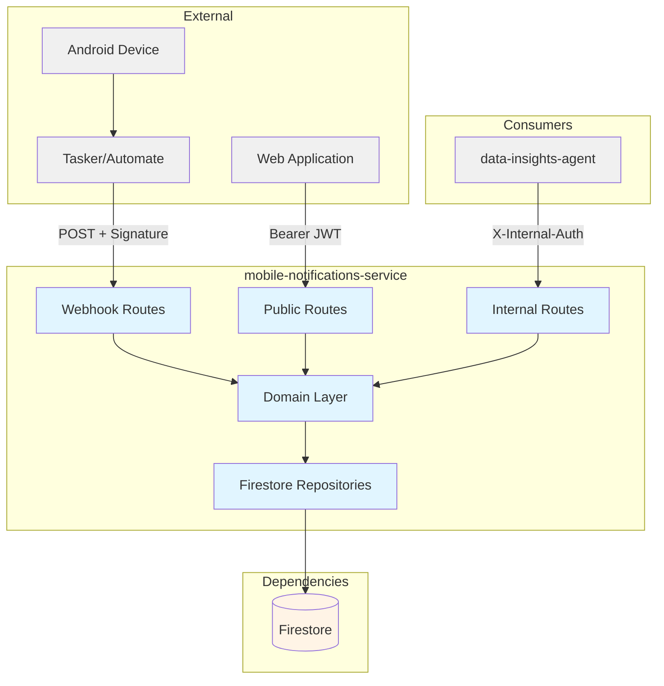
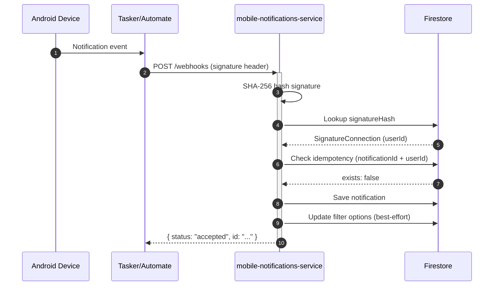

# Mobile Notifications Service -- Technical Reference

## Overview

Mobile-notifications-service receives push notification data from Android devices via Tasker/Automate webhooks, validates device signatures, deduplicates notifications, and stores them in Firestore. It runs on Cloud Run with Fastify and exposes public, internal, and webhook endpoints. Service version: 3.1.0. Local port: 8114.

## Architecture



## Data Flow



## API Endpoints

### Connection

| Method | Path                            | Purpose                     | Auth         |
| ------ | ------------------------------- | --------------------------- | ------------ |
| POST   | `/mobile-notifications/connect` | Create signature connection | Bearer token |
| GET    | `/mobile-notifications/status`  | Get connection status       | Bearer token |

### Notifications

| Method | Path                                     | Purpose             | Auth         | Response |
| ------ | ---------------------------------------- | ------------------- | ------------ | -------- |
| GET    | `/mobile-notifications`                  | List notifications  | Bearer token | 200 OK   |
| DELETE | `/mobile-notifications/:notification_id` | Delete notification | Bearer token | 200 OK   |

### Filters

| Method | Path                               | Purpose                        | Auth         | Response       |
| ------ | ---------------------------------- | ------------------------------ | ------------ | -------------- |
| GET    | `/notifications/filters`           | Get filter options + saved     | Bearer token | 200 OK         |
| POST   | `/notifications/filters/saved`     | Create saved filter            | Bearer token | 201 Created    |
| DELETE | `/notifications/filters/saved/:id` | Delete saved filter            | Bearer token | 204 No Content |

### Internal

| Method | Path                                   | Purpose                                   | Auth           |
| ------ | -------------------------------------- | ----------------------------------------- | -------------- |
| POST   | `/internal/mobile-notifications/query` | Query notifications (data-insights-agent) | Internal token |

### Webhook

| Method | Path                             | Purpose                          | Auth      |
| ------ | -------------------------------- | -------------------------------- | --------- |
| POST   | `/mobile-notifications/webhooks` | Receive push from mobile devices | Signature |

### System

| Method | Path            | Purpose          | Auth |
| ------ | --------------- | ---------------- | ---- |
| GET    | `/health`       | Health check     | None |
| GET    | `/openapi.json` | OpenAPI spec     | None |
| GET    | `/docs`         | Swagger UI       | None |

## Webhook Payload

```typescript
interface WebhookPayload {
  source: string;          // e.g., "tasker"
  device: string;          // Device name
  app: string;             // App package name, e.g., "com.whatsapp"
  notification_id: string; // Idempotency key (unique per user)
  title: string;           // Notification title
  text: string;            // Notification body/content
  timestamp: number;       // Unix milliseconds from device
  post_time: string;       // Post time string from device
}
```

Authentication: `X-Mobile-Notifications-Signature` header (SHA-256 hash lookup).

## List Notifications Query Parameters

| Parameter | Type    | Description                                               |
| --------- | ------- | --------------------------------------------------------- |
| `limit`   | integer | 1-100, default 50                                         |
| `cursor`  | string  | Pagination cursor from previous response                  |
| `source`  | string  | Filter by source (comma-separated for multiple)           |
| `app`     | string  | Filter by app package name (comma-separated for multiple) |
| `title`   | string  | Case-insensitive partial match on title                   |

## Internal Query Body

```typescript
interface QueryNotificationsBody {
  userId: string;
  filter?: {
    app?: string[];    // OR logic across apps
    source?: string;   // Single value
    title?: string;    // Case-insensitive contains
  };
  limit?: number;      // 1-1000, default 50
}
```

Internal response maps `text` to `body` and `receivedAt` to `timestamp` for compatibility with consumers.

## Domain Models

### Notification

| Field            | Type   | Description                            |
| ---------------- | ------ | -------------------------------------- |
| `id`             | string | Notification ID (Firestore doc ID)     |
| `userId`         | string | Owner user ID                          |
| `source`         | string | Source identifier (e.g., "tasker")     |
| `device`         | string | Device name that sent the notification |
| `app`            | string | App package name                       |
| `title`          | string | Notification title                     |
| `text`           | string | Notification body content              |
| `timestamp`      | number | Unix milliseconds from device          |
| `postTime`       | string | Post time string from device           |
| `receivedAt`     | string | ISO 8601 server-side receipt timestamp |
| `notificationId` | string | Idempotency key (device-provided)      |

### SignatureConnection

| Field           | Type              | Description                         |
| --------------- | ----------------- | ----------------------------------- |
| `id`            | string            | Connection ID (Firestore doc ID)    |
| `userId`        | string            | Owner user ID                       |
| `signatureHash` | string            | SHA-256 hash of plaintext signature |
| `deviceLabel`   | string (optional) | User-provided label                 |
| `createdAt`     | string            | ISO 8601 timestamp                  |

### NotificationFiltersData

| Field          | Type                      | Description                                  |
| -------------- | ------------------------- | -------------------------------------------- |
| `userId`       | string                    | Owner user ID                                |
| `options`      | NotificationFilterOptions | Available values from received notifications |
| `savedFilters` | SavedNotificationFilter[] | User's saved filter presets                  |
| `createdAt`    | string                    | ISO 8601 timestamp                           |
| `updatedAt`    | string                    | ISO 8601 timestamp                           |

### SavedNotificationFilter

| Field       | Type                | Description                             |
| ----------- | ------------------- | --------------------------------------- |
| `id`        | string              | Filter ID (UUID)                        |
| `name`      | string              | User-provided filter name (1-100 chars) |
| `app`       | string[] (optional) | App package names to filter             |
| `device`    | string[] (optional) | Device names to filter                  |
| `source`    | string (optional)   | Source to filter                        |
| `title`     | string (optional)   | Title substring to filter               |
| `createdAt` | string              | ISO 8601 timestamp                      |

## Firestore Collections

| Collection                       | Document Key | Description                                  |
| -------------------------------- | ------------ | -------------------------------------------- |
| `mobile_notifications`           | Auto-ID      | Notification documents                       |
| `mobile_notification_signatures` | Auto-ID      | Signature-to-user binding documents          |
| `mobile_notifications_filters`   | userId       | Filter options and saved filters per user    |

## Configuration

| Environment Variable             | Required | Description                             |
| -------------------------------- | -------- | --------------------------------------- |
| `INTEXURAOS_GCP_PROJECT_ID`      | Yes      | GCP project for Firestore               |
| `INTEXURAOS_AUTH_JWKS_URL`       | Yes      | JWT JWKS endpoint URL                   |
| `INTEXURAOS_AUTH_ISSUER`         | Yes      | JWT issuer                              |
| `INTEXURAOS_AUTH_AUDIENCE`       | Yes      | JWT audience                            |
| `INTEXURAOS_INTERNAL_AUTH_TOKEN` | Yes      | Shared secret for internal auth         |
| `INTEXURAOS_SENTRY_DSN`          | No       | Sentry DSN for error reporting          |
| `INTEXURAOS_ENVIRONMENT`         | No       | Environment name (default: development) |

## Gotchas

- **Signature security** -- Plaintext signature returned only on creation. Store it securely. The service stores only the SHA-256 hash. Lost tokens require creating a new connection.

- **Single signature per user** -- Creating a new connection (`POST /mobile-notifications/connect`) deletes all existing signatures for the user first. Only one active signature per user at a time.

- **Hash comparison** -- Webhook signatures compared as SHA-256 hashes; plaintext is never stored or logged.

- **Idempotency** -- Duplicate webhooks with the same `notification_id` per user are silently ignored (status: `ignored`, reason: `duplicate`).

- **Title filter is in-memory** -- The `title` filter for notifications uses case-insensitive substring matching performed in application code after Firestore query. This limits batch iterations to 5 rounds to prevent excessive reads.

- **Filter defaults** -- `GET /notifications/filters` returns an empty options document if no notifications received yet; never 404.

- **Response contract** -- All endpoints use `reply.ok(data)` / `reply.fail(code, message)`. DELETE saved filter uses raw `reply.send()` with 204 (`@allow-raw-send`).

- **DELETE notification returns 200** -- `DELETE /mobile-notifications/:notification_id` returns `{ success: true, data: {} }` (not 204).

- **Webhook raw body capture** -- A `preParsing` hook captures the raw body specifically for the `/mobile-notifications/webhooks` endpoint to aid debugging JSON parse errors.

- **Filter options best-effort** -- When a notification is saved, filter options (app, device, source) are updated using Firestore `arrayUnion`. If this update fails, the notification is still accepted; the failure is logged as non-critical.

- **Cursor encoding** -- Pagination cursors are base64-encoded JSON containing `receivedAt` and `id`. Invalid cursors are silently ignored (treated as no cursor).

- **Sentry logging** -- Uses `createAppLogger()` from `@intexuraos/infra-sentry`, not direct `pino()`.

## File Structure

```
apps/mobile-notifications-service/src/
  domain/
    notifications/         # Notification + SignatureConnection models and use cases
      models/              # Notification, SignatureConnection entities
      ports/               # Repository interfaces (NotificationRepository, SignatureConnectionRepository)
      usecases/            # createConnection, processNotification, listNotifications, deleteNotification
    filters/               # Filter models and repository interface
      models/              # NotificationFiltersData, SavedNotificationFilter, FilterOptionField
      ports/               # NotificationFiltersRepository
  infra/
    firestore/             # Repository implementations
      firestoreNotificationRepository.ts
      firestoreSignatureConnectionRepository.ts
      notificationFiltersRepository.ts
  routes/
    connectRoutes.ts       # POST /mobile-notifications/connect
    statusRoutes.ts        # GET /mobile-notifications/status
    notificationRoutes.ts  # GET /mobile-notifications, DELETE /mobile-notifications/:notification_id
    filterRoutes.ts        # GET/POST /notifications/filters/..., DELETE /notifications/filters/saved/:id
    webhookRoutes.ts       # POST /mobile-notifications/webhooks
    internalRoutes.ts      # POST /internal/mobile-notifications/query
    schemas.ts             # OpenAPI schema definitions
  services.ts              # DI container (3 repositories)
  server.ts                # Fastify server setup (auth, CORS, Swagger, health check)
  config.ts                # Zod-validated configuration
  index.ts                 # Entry point with Sentry init
```

## Recent Changes

| Commit     | Change                                                              | Date       |
| ---------- | ------------------------------------------------------------------- | ---------- |
| `b3f34d85` | Release v3.1.0 (version bump)                                       | 2026-02-22 |
| `c8a42105` | Release v3.0.0 (version bump)                                       | 2026-02-19 |
| `6063175b` | Add dev-mode log formatting for PM2 readability                     | 2026-02-16 |
| `a52a6bbc` | Add Dash0 OpenTelemetry integration (distributed tracing)           | 2026-02-16 |
| `45f001c1` | Switch PM2 ecosystem to `pnpm --filter` with `start:local` scripts  | 2026-02-14 |
| `5aa3e1bd` | Enable strict 100% coverage enforcement (Phase 3)                   | 2026-01-31 |
| `9723dc24` | Standardize DELETE endpoints to return consistent response contract | 2026-01-30 |
| `c3198407` | Fix all response contract violations (reply.ok / reply.fail)        | 2026-01-30 |
| `dfd702f1` | Migrate to createAppLogger() (Sentry-enabled logging)               | 2026-01-30 |
