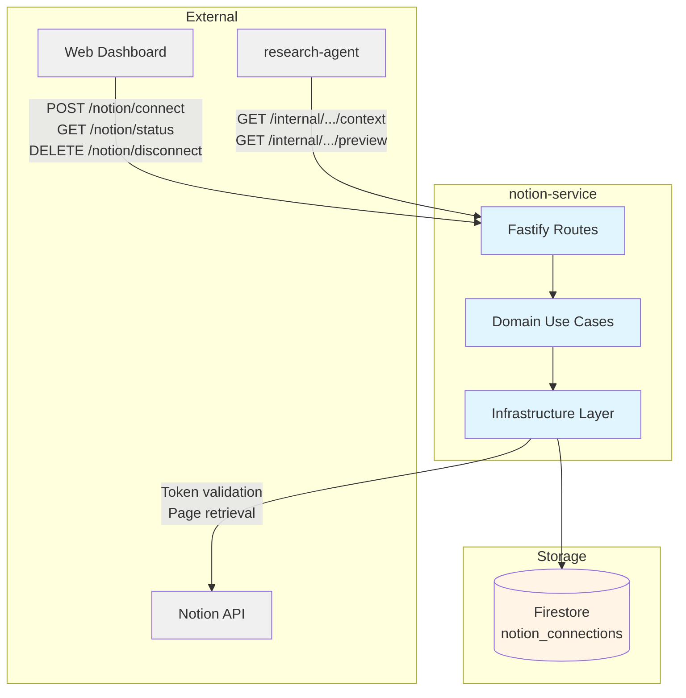
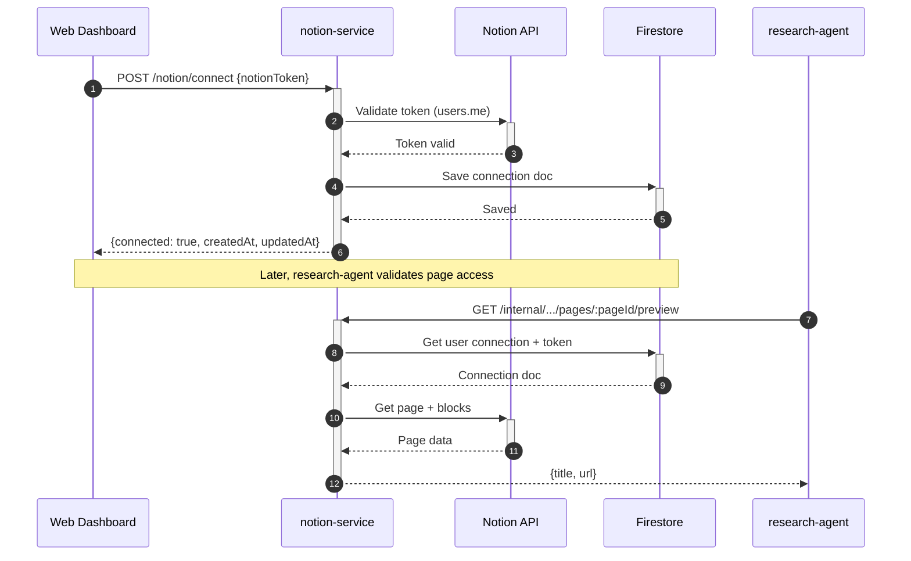

# Notion Service — Technical Reference

## Overview

Notion-service manages the lifecycle of Notion integrations for IntexuraOS users. It validates and stores Notion API tokens, tracks connection state in Firestore, and exposes internal endpoints for downstream services (primarily research-agent) to verify page access. Runs on Cloud Run with Fastify, using `@intexuraos/infra-notion` for Notion API interactions.

## Architecture



## Data Flow



## Recent Changes

| Commit     | Description                                        | Date       |
| ---------- | -------------------------------------------------- | ---------- |
| `a7f5fa98` | INT-794: Write tests for v8-ignore blocks          | 2026-03-13 |
| `c4e3a13c` | Release v3.3.0                                     | 2026-03-15 |
| `44ea683a` | Release v3.2.0                                     | 2026-03-07 |
| `b3f34d85` | Release v3.1.0                                     | 2026-02-22 |
| `c8a42105` | Release v3.0.0                                     | 2026-02-19 |
| `6063175b` | Add dev-mode log formatting for PM2 readability    | 2026-02-16 |
| `a52a6bbc` | Add Dash0 OpenTelemetry integration (#803)         | 2026-02-16 |
| `d5fbb354` | Fix start:local to use tsx (not node strip-types)  | 2026-02-14 |
| `45f001c1` | Switch PM2 ecosystem to pnpm --filter start:local  | 2026-02-14 |
| `5aa3e1bd` | INT-427: Enable strict 100% coverage enforcement   | 2026-01-31 |
| `9723dc24` | Standardize DELETE endpoint response               | 2026-01-31 |
| `c3198407` | Fix response contract violations (reply.ok/fail)   | 2026-01-30 |
| `dfd702f1` | Migrate from pino to createAppLogger (Sentry)      | 2026-01-30 |
| `3a25d55e` | Add Notion page validation for Research Export     | 2026-01-29 |
| `7c5e9153` | INT-319: Remove PromptVault, keep Notion connector | 2026-01-26 |

## API Endpoints

### Public Endpoints

| Method | Path                 | Purpose                     | Auth         |
| ------ | -------------------- | --------------------------- | ------------ |
| POST   | `/notion/connect`    | Connect Notion integration  | Bearer (JWT) |
| GET    | `/notion/status`     | Get integration status      | Bearer (JWT) |
| DELETE | `/notion/disconnect` | Disconnect integration      | Bearer (JWT) |

### Webhook Endpoints

| Method | Path               | Purpose                          | Auth |
| ------ | ------------------ | -------------------------------- | ---- |
| POST   | `/notion-webhooks` | Receive Notion webhook events    | None |

### Internal Endpoints

| Method | Path                                                   | Purpose                      | Auth                  |
| ------ | ------------------------------------------------------ | ---------------------------- | --------------------- |
| GET    | `/internal/notion/users/:userId/context`               | Get connection context/token | X-Internal-Auth       |
| GET    | `/internal/notion/users/:userId/pages/:pageId/preview` | Get Notion page preview      | X-Internal-Auth       |

### System Endpoints

| Method | Path            | Purpose      | Auth |
| ------ | --------------- | ------------ | ---- |
| GET    | `/health`       | Health check | None |
| GET    | `/openapi.json` | OpenAPI spec | None |
| GET    | `/docs`         | Swagger UI   | None |

## Request/Response Schemas

### POST /notion/connect

**Request:**

```typescript
{
  notionToken: string; // Notion integration token (min length 1)
}
```

**Response (200):**

```typescript
{
  success: true,
  data: {
    connected: boolean,
    createdAt: string, // ISO 8601
    updatedAt: string  // ISO 8601
  }
}
```

### GET /notion/status

**Response (200):**

```typescript
{
  success: true,
  data: {
    configured: boolean,  // Connection doc exists
    connected: boolean,   // Connection is active
    createdAt: string | null,
    updatedAt: string | null
  }
}
```

### DELETE /notion/disconnect

**Response (200):**

```typescript
{
  success: true,
  data: {} // Empty object
}
```

### GET /internal/notion/users/:userId/context

**Response (200):**

```typescript
{
  success: true,
  data: {
    connected: boolean,
    token: string | null
  }
}
```

### GET /internal/notion/users/:userId/pages/:pageId/preview

**Response (200):**

```typescript
{
  success: true,
  data: {
    title: string,
    url: string
  }
}
```

### POST /notion-webhooks

**Request:** Any JSON object (Zod `z.record(z.unknown())`).

**Response (200):**

```typescript
{
  success: true,
  data: {
    received: boolean // Always true
  }
}
```

## Error Codes

| Code               | HTTP Status | Description                      |
| ------------------ | ----------- | -------------------------------- |
| `INVALID_REQUEST`  | 400         | Invalid token format / payload   |
| `UNAUTHORIZED`     | 401         | Token rejected by Notion API     |
| `NOT_FOUND`        | 404         | No active connection or page     |
| `DOWNSTREAM_ERROR` | 502         | Notion API or Firestore error    |

## Domain Model

### NotionConnectionPublic

| Field       | Type      | Description                    |
| ----------- | --------- | ------------------------------ |
| `connected` | `boolean` | Whether connection is active   |
| `createdAt` | `string`  | ISO 8601 creation timestamp    |
| `updatedAt` | `string`  | ISO 8601 last update timestamp |

### NotionConnectionDoc (Firestore)

| Field         | Type      | Description                    |
| ------------- | --------- | ------------------------------ |
| `userId`      | `string`  | User identifier (document ID)  |
| `notionToken` | `string`  | Notion integration token       |
| `connected`   | `boolean` | Active connection flag         |
| `createdAt`   | `string`  | ISO 8601 creation timestamp    |
| `updatedAt`   | `string`  | ISO 8601 last update timestamp |

### NotionErrorCode

| Code               | Description                 |
| ------------------ | --------------------------- |
| `NOT_FOUND`        | Resource does not exist     |
| `UNAUTHORIZED`     | Invalid or expired token    |
| `RATE_LIMITED`     | Notion API rate limit hit   |
| `VALIDATION_ERROR` | Malformed request           |
| `INTERNAL_ERROR`   | Firestore or internal error |

## Use Cases

### connectNotion

1. Validate token against Notion API (`validateToken`)
2. Map Notion error codes to domain errors (`UNAUTHORIZED` → `INVALID_TOKEN`, others → `DOWNSTREAM_ERROR`)
3. Save connection to Firestore via `connectionRepository.saveConnection`
4. Return public connection data

### getNotionStatus

1. Fetch connection from Firestore via `connectionRepository.getConnection`
2. Return `configured: true` if document exists, `connected` from document state

### disconnectNotion

1. Update Firestore document: set `connected: false`, update timestamp
2. Return updated connection state

## Dependencies

### External Services

| Service    | Purpose                                        | Failure Mode            |
| ---------- | ---------------------------------------------- | ----------------------- |
| Notion API | Token validation (`users.me`), page retrieval  | Return DOWNSTREAM_ERROR |

### Internal Services (Consumed By)

| Service        | Endpoint                                                   | Purpose                             |
| -------------- | ---------------------------------------------------------- | ----------------------------------- |
| research-agent | `GET /internal/notion/users/:userId/context`               | Get token for Notion export         |
| research-agent | `GET /internal/notion/users/:userId/pages/:pageId/preview` | Validate page access before export  |

### Packages

| Package                       | Purpose                                               |
| ----------------------------- | ----------------------------------------------------- |
| `@intexuraos/common-core`     | Result types, Logger interface                        |
| `@intexuraos/common-http`     | Auth, logging, reply helpers                          |
| `@intexuraos/http-contracts`  | Core OpenAPI schemas                                  |
| `@intexuraos/http-server`     | Health checks, env validation                         |
| `@intexuraos/infra-firestore` | Firestore singleton client                            |
| `@intexuraos/infra-notion`    | Notion API client (validateToken, getPageWithPreview) |
| `@intexuraos/infra-otel`      | Dash0 OpenTelemetry integration                       |
| `@intexuraos/infra-sentry`    | Sentry error tracking, logger                         |

## Firestore Collection

| Collection            | Owner           | Document ID | Description                            |
| --------------------- | --------------- | ----------- | -------------------------------------- |
| `notion_connections`  | notion-service  | `userId`    | Notion OAuth connection tokens & state |

## Configuration

| Environment Variable             | Required | Description                      |
| -------------------------------- | -------- | -------------------------------- |
| `INTEXURAOS_GCP_PROJECT_ID`      | Yes      | GCP project for Firestore        |
| `INTEXURAOS_AUTH_JWKS_URL`       | Yes      | JWKS URL for JWT validation      |
| `INTEXURAOS_AUTH_ISSUER`         | Yes      | JWT issuer                       |
| `INTEXURAOS_AUTH_AUDIENCE`       | Yes      | JWT audience                     |
| `INTEXURAOS_INTERNAL_AUTH_TOKEN` | Yes      | Shared secret for internal auth  |
| `INTEXURAOS_SENTRY_DSN`          | No       | Sentry DSN (optional)            |
| `PORT`                           | No       | HTTP port (default: 8082)        |

## Gotchas

- **Token validation is eager** — `POST /notion/connect` calls the Notion API before saving. If Notion is down, the connection fails even though the token may be valid.
- **One connection per user** — Reconnecting with a new token replaces the existing connection. The old token is overwritten.
- **Disconnect does not delete** — `DELETE /notion/disconnect` sets `connected: false` but keeps the Firestore document. The token remains in storage but is inaccessible via the `getToken` path (returns `null` when `connected === false`).
- **createdAt fallback** — When disconnecting, if the existing document somehow lacks `createdAt`, the service falls back to the current timestamp (backward compatibility for early connections).
- **Page preview requires active connection** — The internal page preview endpoint checks `connected === true` and a non-null token before querying Notion. Disconnected users get a 404.
- **Webhook is a stub** — `POST /notion-webhooks` accepts any JSON, logs it, and returns `{ received: true }`. No event processing occurs. Validation uses `z.record(z.unknown())`.
- **Disconnect returns empty data** — `DELETE /notion/disconnect` returns `reply.ok({})`, not connection state.

## File Structure

```
apps/notion-service/src/
  domain/integration/
    usecases/
      connectNotion.ts       # token validation + save
      disconnectNotion.ts    # mark inactive
      getNotionStatus.ts     # check connection state
      index.ts               # Re-exports
    ports/
      ConnectionRepository.ts  # Domain interfaces (ConnectionRepository, NotionApi)
      index.ts               # Re-exports
    index.ts                 # Re-exports ports + use cases
  infra/
    firestore/
      notionConnectionRepository.ts  # CRUD on notion_connections
      index.ts                       # Re-exports
    notion/
      index.ts               # Re-exports from @intexuraos/infra-notion
  routes/
    integrationRoutes.ts     # connect/status/disconnect
    internalRoutes.ts        # context + page preview
    webhookRoutes.ts         # webhook stub
    schemas.ts               # Zod request schemas
    routes.ts                # Route URL -> file mapping docs
    index.ts                 # Plugin aggregator
  services.ts               # DI container
  server.ts                 # Fastify setup, OpenAPI, health
  index.ts                  # Entry point, env validation, Sentry init
```
