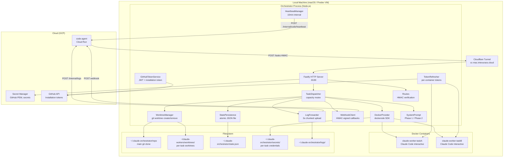
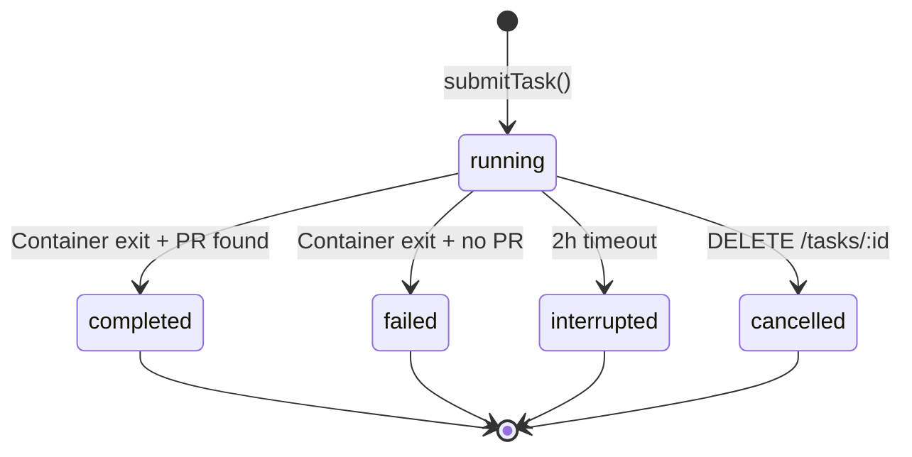

# Orchestrator - Technical Reference

## Overview

The orchestrator is a Fastify-based HTTP service (v2.1.0) that runs on local machines behind a Cloudflare Tunnel. It receives HMAC-signed task dispatch requests from code-agent, creates isolated git worktrees, spawns Docker containers running Claude Code in interactive mode, streams logs back in real time, and delivers completion results via signed webhooks. It manages GitHub App installation tokens, persists state atomically to disk, and recovers interrupted tasks on restart.

## Architecture



## Recent Changes

### INT-491: Interactive Mode Migration (2026-02-08)

Migrated Claude workers from `--print` mode to interactive mode:

- Container now runs `claude --dangerously-skip-permissions --verbose` without `--print`
- Orchestrator attaches to container stdin/stdout via Docker attach stream before start
- `waitForContainerReady()` handles API key prompt approval with up/enter keystrokes
- System prompt written to container stdin after the interactive session is ready
- `CLAUDE_CODE_EXIT_AFTER_STOP_DELAY=10000` ensures container exits 10s after Claude finishes

### INT-515: Self-Managed Repository Clone (2026-02-07)

Added `repo-manager.ts` with `ensureRepository()`:

- Validates existing repo (remote URL match, `.git` is directory not worktree, `package.json` name match)
- Clones from scratch if path does not exist
- Normalizes SSH vs HTTPS URLs for comparison
- `INTEXURAOS_REPOSITORY_URL` and `INTEXURAOS_REPOSITORY_PATH` env vars control behavior

### INT-486: Two-Phase Execution Model (2026-02-06)

Split system prompt into Phase 1 (Design & Validation) and Phase 2 (Strict Execution):

- Phase determined by presence of `code-task` label in `linearIssueLabels`
- Phase 1: Agent enriches the Linear issue description, creates sub-issues, adds labels
- Phase 2: Agent executes autonomously (tests, code, CI, PR, Linear update)
- Parent execution mode for issues with child tasks

### INT-524: Retry Mechanism (2026-02-05)

- `retriedFrom` field on tasks tracks retry chains
- `actionId` field links tasks to originating actions

## API Endpoints

| Method | Path                   | Auth        | Request Body                        | Response                                        |
| ------ | ---------------------- | ----------- | ----------------------------------- | ----------------------------------------------- |
| POST   | `/tasks`               | HMAC signed | `CreateTaskRequest` (Zod-validated) | `202 { taskId, status: "accepted" }`            |
| GET    | `/tasks/:id`           | None        | -                                   | `200 Task` or `404`                             |
| DELETE | `/tasks/:id`           | None        | -                                   | `200 { taskId, status: "cancelled" }` or `404`  |
| GET    | `/health`              | None        | -                                   | `200 { status, capacity, running, available }`  |
| POST   | `/admin/shutdown`      | HMAC signed | -                                   | `200 { status: "shutting_down" }`               |
| POST   | `/admin/refresh-token` | HMAC signed | -                                   | `200 { status: "refreshed", tokenExpiresAt }`   |

### HMAC Authentication

Dispatch requests require three headers:

| Header                  | Content                                        |
| ----------------------- | ---------------------------------------------- |
| `X-Dispatch-Timestamp`  | Unix timestamp (ms)                            |
| `X-Dispatch-Nonce`      | Unique nonce per request                       |
| `X-Dispatch-Signature`  | HMAC-SHA256 of `{timestamp}.{nonce}.{body}`    |

Verification rejects requests with timestamps older than 5 minutes and replayed nonces (10-minute TTL cache).

### CreateTaskRequest Schema

```typescript
{
  taskId: string;          // Unique task identifier
  workerType: 'opus' | 'auto' | 'glm';
  prompt: string;          // User prompt (sanitized before injection)
  repository?: string;     // GitHub repo (default: pbuchman/intexuraos)
  baseBranch?: string;     // Branch to fork from (default: development)
  linearIssueId?: string;  // Linear issue for tracking
  linearIssueTitle?: string;
  linearIssueLabels: string[];  // Determines Phase 1 vs Phase 2
  hasChildren: boolean;         // Enables parent execution mode
  slug?: string;
  webhookUrl: string;      // Callback URL for results
  webhookSecret: string;   // HMAC secret for webhook signing
  actionId?: string;       // Originating action ID
}
```

## Domain Model

### Task Lifecycle



### OrchestratorState

```typescript
interface OrchestratorState {
  tasks: Record<string, Task>;       // All tasks indexed by taskId
  githubToken: {                     // Cached GitHub installation token
    token: string;
    expiresAt: string;
  } | null;
  pendingWebhooks: PendingWebhook[]; // Failed webhook deliveries
}
```

### TaskResult

After a task completes, the orchestrator inspects the worktree for results:

```typescript
interface TaskResult {
  prUrl?: string;        // Pull request URL (if created)
  branch: string;        // Git branch name
  commits: number;       // Number of commits
  summary?: string;      // PR title
  ciFailed?: boolean;    // Whether CI checks failed
  rebaseResult?: {       // Rebase attempt outcome
    attempted: boolean;
    success: boolean;
    conflictFiles?: string[];
  };
}
```

## Service Components

### TaskDispatcher

The central coordinator. Manages the full task lifecycle:

1. Atomic capacity check via `async-mutex`
2. Worktree creation via `WorktreeManager`
3. System prompt construction via `buildSystemPrompt()`
4. Container creation via `DockerProvider`
5. Token registration via `TokenRefresher`
6. Log forwarding registration via `LogForwarder`
7. Completion monitoring (30s polling interval)
8. Timeout warning at 1h55m, hard kill at 2h
9. Result extraction via `gh pr list` and `gh pr checks`
10. Webhook delivery via `WebhookClient`

### DockerProvider

Manages Docker container lifecycle via `dockerode`:

- **Image:** `gcr.io/intexuraos-dev-pbuchman/claude-worker:latest`
- **Network:** `claude-worker-net`
- **Limits:** 8GB memory, 4 CPUs per container
- **Security:** `CapDrop: ALL`, `CapAdd: NET_RAW`, `SecurityOpt: no-new-privileges`
- **Mounts:** Worktree at `/repo` (rw), secrets at `/secrets` (ro), main `.git` dir for worktree support (rw)
- **Tmpfs:** `/tmp` (2GB, noexec) and `/home/claude` (500MB, noexec, uid=1001)
- **Interactive mode:** `OpenStdin: true`, `Tty: true`, attach before start to capture all output

### WorktreeManager

Creates isolated git worktrees per task:

- `git worktree add -b "{taskId}" "{path}" "origin/{baseBranch}"`
- Copies `.mcp.json` template with environment variable substitution
- Writes `.claude/settings.local.json` for Claude Code configuration
- Runs `pnpm install --frozen-lockfile` with 5-minute timeout
- Removes worktrees with `git worktree remove --force`

### LogForwarder

Streams container output to code-agent in near-real-time:

- Receives log chunks via `appendChunk()` callback from Docker attach stream
- Buffers content and flushes every 3 seconds or when buffer exceeds 8KB
- Splits large buffers at newline boundaries
- Sends up to 5 chunks per batch to `POST /internal/logs`
- Signs payloads with HMAC-SHA256 using the task's webhook secret
- Limits: 500 chunks per task, 4MB total per task
- Retries failed uploads 3 times with exponential backoff (1s, 2s, 4s)

### WebhookClient

Delivers signed completion notifications to code-agent:

- Signs payloads with HMAC-SHA256 (`{timestamp}.{json_body}`)
- Includes `X-Internal-Auth` header for service-to-service auth
- Retries 3 times with delays of 5s, 15s, 45s
- Does not retry 4xx errors (client errors)
- Queues failed deliveries in `pendingWebhooks` with 24-hour TTL
- Background retry job runs every 5 minutes

### StatePersistence

Atomic file-based state management:

- Write-to-temp then atomic rename (POSIX rename guarantees)
- Corruption detection: backs up corrupted files with timestamp suffix
- Orphan worktree detection: compares `git worktree list` against active tasks

### GitHubTokenService

Manages GitHub App authentication:

- Generates RS256-signed JWT (10-minute expiry) from app private key
- Exchanges JWT for installation access token via GitHub API
- Writes token atomically to `~/.claude-orchestrator/github-token`
- Background refresh every 5 minutes
- Auth degraded callback after 3 consecutive failures

### TokenRefresher

Manages per-container GitHub tokens:

- Mints fresh installation tokens via JWT every 30 minutes
- Writes tokens to `/secrets/github-token` in each task's secrets directory
- Starts/stops refresh loop based on active task count
- Uses `jose` library for JWT signing (separate from `jsonwebtoken` used by GitHubTokenService)

### HeartbeatManager

Keeps running tasks visible to code-agent:

- Sends running task IDs every 10 minutes
- HMAC-signed with orchestrator secret
- Logs escalating warnings after 3 consecutive failures
- Enables zombie task detection in code-agent

### SensitiveFileGuard

Prevents accidental secret leaks in commits:

- Matches files against 20+ glob patterns (`.env`, `.pem`, `*.key`, `terraform.tfstate`, etc.)
- Reverts matched files via `git checkout HEAD~N -- "{file}"`
- Returns guard result indicating which files were reverted

### SystemPrompt

Constructs phase-specific instructions for Claude Code workers:

- **Phase 1 (no `code-task` label):** Design agent mode, enriches Linear issue, adds labels
- **Phase 2 (has `code-task` label):** Execution mode, writes tests/code, runs CI, creates PR
- Sanitizes user prompts by stripping XML tags and forbidden keywords (prompt injection defense)
- Parent execution mode section injected when `hasChildren` is true

### RepoManager

Ensures the orchestrator has a valid local repository clone:

- `ensureRepository()`: clone if missing, validate + fetch if present
- `validateRepository()`: checks `.git` is directory (not worktree file), remote URL matches, `package.json` name matches
- `normalizeUrl()`: handles SSH vs HTTPS and trailing `.git` suffix

## Dependencies

| Package                   | Version    | Purpose                                    |
| ------------------------- | ---------- | ------------------------------------------ |
| `fastify`                 | ^5.6.2     | HTTP server                                |
| `@fastify/cors`           | ^10.1.0    | CORS support                               |
| `dockerode`               | ^4.0.9     | Docker Engine API client                   |
| `async-mutex`             | ^0.5.0     | Atomic capacity checking                   |
| `jose`                    | ^5.9.6     | JWT signing for TokenRefresher             |
| `jsonwebtoken`            | ^9.0.2     | JWT signing for GitHubTokenService         |
| `minimatch`               | ^10.1.1    | Glob pattern matching (SensitiveFileGuard) |
| `pino`                    | ^9.6.0     | Structured logging                         |
| `pino-pretty`             | ^13.0.0    | Human-readable log output                  |
| `zod`                     | ^3.24.1    | Request schema validation                  |
| `@intexuraos/common-core` | workspace  | Result types, Logger, error serialization  |

## Configuration

### Environment Variables

#### Required (startup fails if missing)

| Variable                            | Description                           |
| ----------------------------------- | ------------------------------------- |
| `INTEXURAOS_REPOSITORY_URL`         | GitHub repo URL for clone/fetch       |
| `INTEXURAOS_CODE_AGENT_URL`         | Webhook callback URL (Cloud Run)      |
| `INTEXURAOS_ORCHESTRATOR_SECRET`    | HMAC signing secret                   |
| `INTEXURAOS_PROJECT_ID`             | GCP project for Secret Manager        |
| `INTEXURAOS_GITHUB_APP_ID`          | GitHub App ID                         |
| `INTEXURAOS_GITHUB_INSTALLATION_ID` | GitHub App installation ID            |
| `INTEXURAOS_INTERNAL_AUTH_TOKEN`    | Service-to-service auth token         |
| `INTEXURAOS_LINEAR_API_KEY`         | Linear API key (passed to workers)    |
| `INTEXURAOS_SENTRY_AUTH_TOKEN`      | Sentry auth token (passed to workers) |
| `GOOGLE_APPLICATION_CREDENTIALS`    | GCP service account key path          |

#### Optional

| Variable                       | Default                           | Description                |
| ------------------------------ | --------------------------------- | -------------------------- |
| `INTEXURAOS_REPOSITORY_PATH`   | `~/.claude-orchestrator/repo`     | Local repo clone path      |
| `INTEXURAOS_ANTHROPIC_API_KEY` | `""`                              | Claude API key for workers |
| `INTEXURAOS_ZAI_API_KEY`       | `""`                              | ZAI API key for workers    |
| `INTEXURAOS_WORKER_CAPACITY`   | `2`                               | Max concurrent tasks       |
| `PORT`                         | `8199`                            | HTTP server port           |
| `LOG_LEVEL`                    | `info`                            | Pino log level             |

### Docker Container Defaults

| Setting          | Value                                                  |
| ---------------- | ------------------------------------------------------ |
| Image            | `gcr.io/intexuraos-dev-pbuchman/claude-worker:latest`  |
| Network          | `claude-worker-net`                                    |
| Max concurrent   | 4                                                      |
| Memory limit     | 8 GB                                                   |
| CPU count        | 4                                                      |
| Timeout          | 2 hours                                                |
| User             | 1001:1001                                              |

### Timer Intervals

| Timer              | Interval     | Purpose                                |
| ------------------ | ------------ | -------------------------------------- |
| Token refresh      | 5 minutes    | GitHub App token (service-level)       |
| Webhook retry      | 5 minutes    | Retry failed webhook deliveries        |
| Task polling       | 30 seconds   | Debug logging only                     |
| Heartbeat          | 10 minutes   | Running task IDs to code-agent         |
| Container token    | 30 minutes   | Per-container GitHub token refresh     |
| Completion check   | 30 seconds   | Container exit polling                 |
| Timeout warning    | 1h 55m       | Log warning before hard kill           |
| Timeout kill       | 2h           | Force-kill container                   |
| Log flush          | 3 seconds    | Send buffered log chunks               |

## Gotchas

1. **Not a Cloud Run service.** The orchestrator runs as a native Node.js process, not in a container. It is not managed by Terraform.
2. **Requires Docker daemon.** The `dockerode` client connects via `/var/run/docker.sock`. No daemon means no workers.
3. **Cloudflare Tunnel required.** code-agent reaches the orchestrator via `cc-mac.intexuraos.cloud`. Without the tunnel, task dispatch fails.
4. **HMAC secrets must match.** The `INTEXURAOS_ORCHESTRATOR_SECRET` env var must match the `dispatchSigningSecret` configured in the IntexuraOS UI worker settings. Mismatch causes 401 on every dispatch.
5. **GitHub private key is fetched from Secret Manager.** The PEM key is multiline and cannot be stored in `.envrc`. The bootstrapper fetches it via `gcloud secrets versions access` and caches it locally.
6. **Two JWT libraries.** `GitHubTokenService` uses `jsonwebtoken` (RS256 sign). `TokenRefresher` uses `jose` (RS256 sign via Web Crypto). Both produce valid GitHub App JWTs.
7. **Attach before start.** The Docker provider calls `container.attach()` before `container.start()` to capture all output from startup. Reversing this order causes missed log lines.
8. **Container name conflicts.** If a previous orchestrator run left orphaned containers, `createWorker` fails with "name already in use". Call `cleanupOrphanedContainers()` on startup.
9. **Worktree `.git` file.** Git worktrees have a `.git` file (not directory) pointing to the main repo's `.git/worktrees/`. The DockerProvider reads this file to determine the main git directory and mounts it into the container for commit/push operations.
10. **State file corruption.** If `state.json` is corrupted (e.g., partial write on crash), `StatePersistence.load()` backs up the file and starts fresh rather than crashing.

## File Structure

```
workers/orchestrator/
  src/
    index.ts                          # Barrel exports + bootstrap import
    start.ts                          # Bootstrap: env loading, service wiring
    main.ts                           # Fastify server, recovery, shutdown handlers
    routes.ts                         # HTTP endpoints + HMAC verification
    heartbeat.ts                      # HeartbeatManager (code-agent keepalive)
    worktree-cleanup.ts               # Stale worktree removal
    github/
      token-service.ts                # GitHub App JWT + installation tokens
    services/
      state-persistence.ts            # Atomic JSON file state
      task-dispatcher.ts              # Task lifecycle coordinator
      webhook-client.ts               # Signed webhook delivery + retry queue
      log-forwarder.ts                # Chunked log streaming to code-agent
      sensitive-file-guard.ts         # Secret file detection + revert
      worktree-manager.ts             # Git worktree CRUD + MCP config
      repo-manager.ts                 # Repository clone/validate/fetch
      system-prompt.ts                # Phase 1/2 prompt builder
      isolation/
        index.ts                      # Factory + re-exports
        types.ts                      # IsolationProvider interface
        docker-provider.ts            # Docker container lifecycle
        token-refresher.ts            # Per-container GitHub token refresh
    types/
      index.ts                        # Barrel exports
      api.ts                          # CreateTaskRequest, HealthResponse
      config.ts                       # OrchestratorConfig
      state.ts                        # OrchestratorState, PendingWebhook
      task.ts                         # Task, TaskStatus, TaskResult, TaskError
      schemas.ts                      # Zod schemas for request validation
    __tests__/
      main.test.ts                    # Main function tests
      routes.test.ts                  # HTTP endpoint tests
      heartbeat.test.ts               # Heartbeat manager tests
      worktree-cleanup.test.ts        # Worktree cleanup tests
      token-service.test.ts           # GitHub token service tests
      state-persistence.test.ts       # State persistence tests
      task-dispatcher.test.ts         # Task dispatcher tests
      webhook-client.test.ts          # Webhook client tests
      log-forwarder.test.ts           # Log forwarder tests
      sensitive-file-guard.test.ts    # Sensitive file guard tests
      worktree-manager.test.ts        # Worktree manager tests
      repo-manager.test.ts            # Repo manager tests
      mock-code-agent.test.ts         # Mock code-agent integration
      integration.test.ts             # Integration tests
      types/
        types.test.ts                 # Type validation tests
  package.json
  tsconfig.json
  vitest.e2e.config.ts                # E2E test config (Docker-dependent)
  README.md                           # Setup and usage guide
  DEPLOYMENT.md                       # Build, deploy, and manage reference
```
