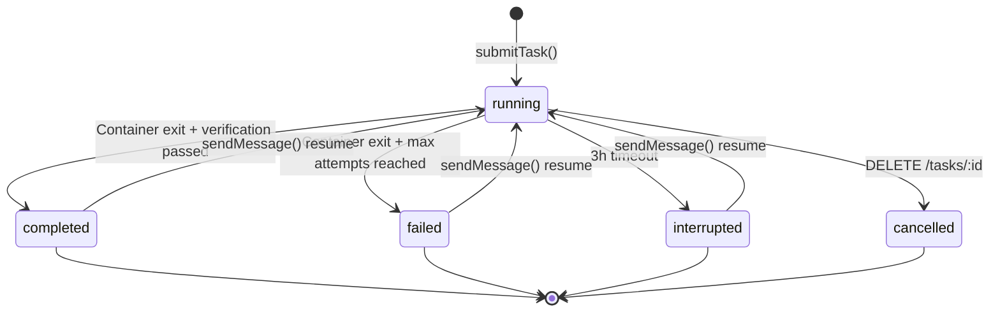

# Orchestrator — Technical Reference

## Overview

The orchestrator is a Fastify-based HTTP service that runs on local machines behind a Cloudflare Tunnel. It receives HMAC-signed task dispatch requests from code-agent, creates isolated git worktrees, spawns Docker containers running the shared code-worker runtime (Claude or Codex), streams logs back in real time, and delivers completion results via signed webhooks. It manages GitHub App installation tokens plus shared worker auth for Claude and Codex, persists state atomically to disk, and recovers interrupted tasks (including container adoption and pending resume recovery) on restart. After each worker attempt, an LLM-backed completion verifier (Gemini 2.5 Flash) evaluates whether the task met its agent-specific contract; failed verifications automatically trigger follow-up attempts up to a configurable limit. For execution tasks, an Agent Compliance Validator performs post-completion transcript analysis via OpenRouter — verifying claims, checking contract compliance, detecting anomalies, and posting a structured report on the PR. The Remediation Agent autonomously addresses review findings on existing PR branches. Execution memory from past tasks is injected into prompts to prevent repeated mistakes. The Ask Agent provides interactive code-aware Q&A sessions.

## Agent-Based Routing and Contracts

### Agent selection precedence

1. `agentType` field from code-agent (explicit routing, takes priority)
2. PR / issue comment / review event (label `pr-comment`) -> `pull_request`
3. `agentType === 'review'` -> `review`
4. `agentType === 'remediation'` -> `remediation`
5. `agentType === 'ask_agent'` -> `ask_agent`
6. Linear issue without `code-task` label -> `planning`
7. Linear issue with `code-task` label -> `execution`

### Prompt markers and final blocks

- Preserved marker: `[WORKER-MODE]`
- Exactly one injected marker: `[AGENT:PLANNING]` / `[AGENT:EXECUTION]` / `[AGENT:PULL_REQUEST]` / `[AGENT:REVIEW]`
- Final block names: `PLANNING_AGENT_FINAL`, `EXECUTION_AGENT_FINAL`, `PULL_REQUEST_AGENT_FINAL`, `REVIEW_AGENT_FINAL`
- All prompts follow the versioned `PromptBuilder` pattern (semver versioned, CI-enforced bump-on-change)

### Agent types

| Agent Type     | Description                                                  | Verification Contract                        |
| -------------- | ------------------------------------------------------------ | -------------------------------------------- |
| `planning`     | Analyze issues, produce plans, create subtasks               | Outcome label, Linear URL, plan doc presence |
| `execution`    | Implement code, run CI, create PRs                           | PR URL, skill usage, outcome label           |
| `pull_request` | Respond to PR comments/reviews, push to existing branch      | PR URL, comment reply status                 |
| `review`       | Read-only PR review with structured inline comments          | PR URL, review types, comments posted        |
| `remediation`  | Address review findings, push fixes, decide on re-review     | PR URL, re-review decision                   |
| `ask_agent`    | Interactive Q&A — no PR, no Linear, direct message delivery  | Lighter contract, no PR URL required         |

### Review Agent types

The Review Agent supports four review types, controlled by the `reviewTypes` field:

| Type           | Scope                                                                                                       |
| -------------- | ----------------------------------------------------------------------------------------------------------- |
| `code_quality` | Code style, readability, maintainability, naming, DRY, dead code, test coverage gaps                        |
| `security`     | Injection vulnerabilities, auth issues, secrets exposure, OWASP top 10                                      |
| `architecture` | Separation of concerns, dependency direction, API design, scalability, coupling/cohesion                    |
| `plan_review`  | Plan document validation — task decomposition, TDD discipline, file path accuracy, codebase cross-reference |

### Planning Agent webhook semantics

- `planned` -> webhook `status=completed`
- `unclear` -> webhook `status=failed`, `error.code=PLANNING_AGENT_UNCLEAR`

Flattened Planning Agent `result` fields:

- `planning_outcome_label`
- `planning_superpowers_writing_plans_used`
- `planning_linear_url`
- `planning_is_complex`
- `planning_has_plan_doc`
- `planning_subtask_urls`
- `planning_pr_url`
- `planning_unclear_clarification`

### Execution Agent webhook semantics

- `implemented` -> webhook `status=completed`
- `already_completed` -> webhook `status=completed` with `execution_outcome_label: 'already_completed'`

Flattened Execution Agent `result` fields:

- `execution_outcome_label` (`'implemented'` or `'already_completed'`)
- `execution_superpowers_subagent_driven_dev_used`
- `execution_superpowers_requesting_code_review_used`
- `execution_memory_ids_used`
- `execution_memory_ids_rejected`
- `execution_memory_usage_summary`
- `execution_linear_issue_url`

### Review Agent webhook semantics

- Completed review -> webhook `status=completed`

Flattened Review Agent `result` fields:

- `review_comments_posted`
- `review_types`
- `requirements_tracker_updated`
- `gh_actions_status`
- `needs_remediation`
- `review_body`
- `review_inline_comments`
- `requires_re_review`

### Ownership split

- Orchestrator: routing, prompts, completion verification, compliance validation, execution memory injection, flattened metadata
- `code-agent`: deterministic Linear issue mutations after webhook receipt

## Architecture

```mermaid
graph TB
    subgraph "Cloud (GCP)"
        CA[code-agent<br/>Cloud Run]
        SM[Secret Manager<br/>GitHub PEM, secrets]
        GH[GitHub API<br/>Installation tokens]
    end

    subgraph "Local Machine"
        CF[Cloudflare Tunnel<br/>cc-mac.intexuraos.cloud]
        CF --> ORCH

        subgraph "Orchestrator Process (Node.js)"
            ORCH[Fastify HTTP Server<br/>:8199]
            ORCH --> TD[TaskDispatcher<br/>capacity mutex]
            ORCH --> ROUTES[Routes<br/>HMAC verification]

            TD --> WM[WorktreeManager<br/>git worktree create/remove]
            TD --> DP[DockerProvider<br/>dockerode SDK]
            TD --> LF[LogForwarder<br/>3s chunked upload]
            TD --> WC[WebhookClient<br/>HMAC-signed callbacks]
            TD --> SP[StatePersistence<br/>atomic JSON file]
            TD --> SYS[SystemPrompt<br/>6 agent types<br/>PromptBuilder versioned]
            TD --> TMC[TurnMetricsCollector<br/>cgroup + session JSONL]
            TD --> CV[CompletionVerifier<br/>Gemini 2.5 Flash]
            TD --> ACV[AgentComplianceValidator<br/>OpenRouter LLM]

            GTS[GitHubTokenService<br/>JWT + installation token]
            TR[TokenRefresher<br/>per-container tokens]
            HB[HeartbeatManager<br/>10min interval]
            AAS[OrchestratorFileAuditSink<br/>LLM audit JSONL]
            CM[CredentialMonitor<br/>OAuth watcher]
            CR[CredentialRefresher<br/>Docker-based refresh]
            AKV[ApiKeyValidator<br/>key health check]
            WAR[WorkerAuthRegistry<br/>Claude + Codex auth]
        end

        subgraph "Docker Containers"
            W1[code-worker-taskA<br/>Claude Code or Codex]
            W2[code-worker-taskB<br/>Claude Code or Codex]
        end

        DP --> W1
        DP --> W2
        TR --> W1
        TR --> W2

        subgraph "Filesystem"
            REPO[~/.code-orchestrator/repo<br/>main git clone]
            WT[~/code-workers/worktrees/<br/>per-task worktrees]
            STATE[~/.code-orchestrator/state.json]
            SECRETS[~/.code-orchestrator/secrets/<br/>per-task credentials]
            LOGS[~/.code-orchestrator/logs/]
            AUDIT[~/.code-orchestrator/logs/llm-audit.log]
            CREDS[~/.code-orchestrator/claude-creds/<br/>shared OAuth credentials]
            CODEX_AUTH[~/.code-orchestrator/codex-auth/<br/>shared Codex auth]
        end

        WM --> REPO
        WM --> WT
        SP --> STATE
        DP --> SECRETS
        LF --> LOGS
        AAS --> AUDIT
        CM --> CREDS
        CR --> CREDS
    end

    CA -->|POST /tasks HMAC| CF
    GTS --> GH
    TR --> GH
    LF -->|POST /internal/logs| CA
    WC -->|POST webhook| CA
    HB -->|POST /internal/code/heartbeat| CA
    TMC -->|POST /internal/turn-metrics| CA
    ACV -->|gh pr comment| GH
    ORCH --> SM
```



## Recent Changes

### v3.5.0 Release

Key changes since v3.4.0: Codex runtime support as an execution backend, Remediation Agent with autonomous auto-improvement loop, Execution Memory Graph for cross-task learning, Ask Agent for interactive sessions, Agent Compliance Validator replacing the Deep Validator, agent dispatch refactored with `@worker` routing and container lifecycle, evidence PR required for all planned outcomes, openrouter-free worker type, startup validation and observability improvements, and numerous reliability fixes.

### Codex Runtime Support (INT-1104, INT-1109, INT-1117, INT-1125, INT-1143, INT-1205, INT-1212)

The orchestrator now supports OpenAI Codex as an execution backend alongside Claude. Two Codex worker presets were added: `codex` (standard) and `codex-xhigh` (high effort). Codex uses ChatGPT device-auth rather than API keys, with auth managed through `CodexAuthManager` and `CodexAuthRefresher`. A dedicated Codex log processor handles streaming output formatting. Codex runtime state is preserved across cleanup cycles. The orchestrator validates Codex auth at startup and exposes it on the health endpoint.

### Remediation Agent and Review Loop (INT-1087, INT-1103, INT-1116, INT-1119, INT-1130, INT-1132, INT-1139)

A new `remediation` agent type addresses review findings autonomously. When a review identifies issues above a severity threshold, the Remediation Agent receives the review comments, implements fixes on the existing PR branch, runs CI, and decides whether a re-review is needed. The remediation prompt was mandated to use `/nitpick-nuker`. Messages are rejected for review/remediation agent types via `sendMessage()`. Container lifecycle was refactored with `@worker` routing — one preserved `pull_request` container per PR, selective container preservation by agent type.

### Execution Memory Graph (INT-1098, INT-1257)

Execution memory is now injected into planning and review prompts (not just execution). The memory section includes mandatory acknowledgment — agents must explicitly list every memory they received before proceeding. Usage reporting tracks which memories were applied vs rejected. Memory types include `implementation_pattern`, `verification_pattern`, `pitfall_pattern`, `decomposition_pattern`, `planning_decision`, and `review_finding`. The review prompt captures review content for memory extraction.

### Agent Compliance Validator (replaces Deep Validator)

The monolithic `ExecutionDeepValidator` was replaced by a modular `AgentComplianceValidator` that uses OpenRouter with configurable models (default: `xiaomi/mimo-v2-pro`). The validator reads session transcripts via `readSessionTranscript()` and `formatTranscript()`, builds a compliance prompt comparing agent claims against transcript evidence, parses the response against a Zod `AgentComplianceReportSchema`, and posts formatted PR comments via `gh pr comment`. The report covers claim verification, contract compliance, anomaly detection, and execution metrics.

### Ask Agent (INT-1293, INT-1294, INT-1295, INT-1308)

A new `ask_agent` type provides interactive code-aware sessions. Ask Agent sessions skip the PR resume preamble, deliver messages directly (not wrapped in orchestrator context), check pending messages in the completion path, and prohibit `AskUserQuestion` in the prompt. The `linearIssueId` is intentionally omitted from the ask-agent prompt.

### Agent Dispatch Refactor (INT-1130)

Agent dispatch was refactored with `@worker` routing and container lifecycle improvements. Key changes: preserved `pull_request` containers enforced to one per PR, review and remediation agent types reject `sendMessage()`, dispatch metadata endpoint added (`GET /internal/tasks/:id/dispatch-metadata`), and `prNumber` field forwarded in routes for container deduplication.

### Evidence PR Required for All Outcomes (INT-1279)

All execution outcomes — including tasks where the agent determines work was already completed — now require a `gh_pr_url` evidence field. The Gemini extraction prompt was updated to enforce this. SIMPLE planning tasks also require an evidence PR (a lightweight commit with a plan summary file).

### Worker Type Additions

- `codex`: Standard Codex runtime with ChatGPT auth
- `codex-xhigh`: High-effort Codex for complex tasks
- `openrouter-free`: Zero-cost execution via OpenRouter (Qwen 3.6 Plus free tier, `disableExperimentalBetas: true`)

### Other Notable Changes

- Plan PR merge before execution dispatch removed (INT-1149)
- Thinking effort set to `high` for opus workers (INT-1088)
- V8 ignore blocks replaced with real tests across the codebase (INT-1071)
- Restart failure fixed for expired worker containers — resume allowed when container expired but worktree exists (INT-1304)
- Startup validation: port availability check, GCP credential validation, API key health checks at boot
- Fatal exit code detection restricted to tail of raw logs (prevents false positives from mid-session crashes)
- Development branch synced with origin after fetch in repo manager
- Dead MCP config processing removed from worktree manager
- Process-level timeout removed from Codex entrypoint
- Linear MCP timeout contract enforced in orchestrator and code-worker

## API Endpoints

| Method | Path                   | Auth        | Request Body                        | Response                                                       |
| ------ | ---------------------- | ----------- | ----------------------------------- | -------------------------------------------------------------- |
| POST   | `/tasks`               | HMAC signed | `CreateTaskRequest` (Zod-validated) | `202 { taskId, status: "accepted" }`                           |
| GET    | `/tasks/:id`           | None        | -                                   | `200 Task` or `404`                                            |
| DELETE | `/tasks/:id`           | None        | -                                   | `200 { taskId, status: "cancelled" }` or `404`/`409`           |
| POST   | `/tasks/:id/message`   | HMAC signed | `{ message: string }`               | `200 SendMessageResult` or `404`/`409`                         |
| GET    | `/health`              | None        | -                                   | `200 { status, capacity, running, available, workerAuths }`    |
| GET    | `/meta/worker-image`   | None        | -                                   | `200` image diagnostics or `{ error }` if unavailable          |
| POST   | `/admin/shutdown`      | HMAC signed | -                                   | `200 { status: "shutting_down" }`                              |
| POST   | `/admin/refresh-token` | HMAC signed | -                                   | `200 { status: "refreshed", tokenExpiresAt }`                  |

### HMAC Authentication

Dispatch requests require three headers:

| Header                 | Content                                     |
| ---------------------- | ------------------------------------------- |
| `X-Dispatch-Timestamp` | Unix timestamp (ms)                         |
| `X-Dispatch-Nonce`     | Unique nonce per request                    |
| `X-Dispatch-Signature` | HMAC-SHA256 of `{timestamp}.{nonce}.{body}` |

Verification rejects requests with timestamps older than 5 minutes and replayed nonces (10-minute TTL cache).

### CreateTaskRequest Schema

```typescript
{
  taskId: string;
  workerType: 'opus' | 'auto' | 'sonnet' | 'minimax' | 'glm' | 'qwen' | 'kimi' | 'codex' | 'codex-xhigh' | 'openrouter-free';
  prompt: string;
  repository?: string;
  baseBranch?: string;
  linearIssueId?: string;
  linearIssueTitle?: string;
  linearIssueLabels: string[];
  hasChildren: boolean;
  slug?: string;
  webhookUrl: string;
  webhookSecret: string;
  actionId?: string;
  agentType?: 'planning' | 'execution' | 'pull_request' | 'review' | 'remediation' | 'ask_agent';
  executionMemoryContext?: ExecutionMemoryPromptContext;
  trackingCommentId?: string;
  prNumber?: number;
  continuationPrNumber?: number;
  continuationPrBranch?: string;
  reviewTypes?: ('code_quality' | 'security' | 'architecture' | 'plan_review')[];
}
```

### SendMessage Schema

`POST /tasks/:id/message` — sends a follow-up message to a task.

```typescript
{
  message: string; // min 1, max 20000 characters
}
```

**Behavior:**

- If the task is `running`: the message is queued and delivered when the current attempt finishes
- If the task is `completed`, `failed`, or `interrupted`: a new worker session is started with the message as the prompt (using `continueSession: true`)
- If `agentType` is `review` or `remediation`: returns `409` (messages not supported)
- If `agentType` is `ask_agent`: message delivered directly without PR resume preamble
- Returns `409` if the task status does not allow messages (e.g., `cancelled`)

## Domain Model

### Task Lifecycle



### Task

```typescript
interface Task {
  taskId: string;
  workerType: 'opus' | 'auto' | 'sonnet' | 'minimax' | 'glm' | 'qwen' | 'kimi' | 'codex' | 'codex-xhigh' | 'openrouter-free';
  runtime?: 'claude' | 'codex';
  runtimeSessionId?: string;
  prompt: string;
  repository: string;
  baseBranch: string;
  linearIssueId?: string;
  linearIssueTitle?: string;
  linearIssueLabels: string[];
  hasChildren?: boolean;
  slug?: string;
  webhookUrl: string;
  webhookSecret: string;
  actionId?: string;
  retriedFrom?: string;
  agentType?: 'planning' | 'execution' | 'pull_request' | 'review' | 'remediation' | 'ask_agent';
  executionMemoryContext?: ExecutionMemoryPromptContext;
  trackingCommentId?: string;
  prNumber?: number;
  continuationPrNumber?: number;
  continuationPrBranch?: string;
  reviewTypes?: ('code_quality' | 'security' | 'architecture' | 'plan_review')[];
  status: 'queued' | 'running' | 'completed' | 'failed' | 'interrupted' | 'cancelled';
  worktreePath: string;
  containerId: string;
  startedAt: string;
  completedAt?: string;
  attemptCount?: number;
  maxAttempts?: number;
  lastExitCode?: number;
  verificationHistory?: TaskVerificationRecord[];
  resumedAfterSuccess?: boolean;
  lastSuccessResult?: TaskResult;
  pendingResumeStart?: PendingResumeStart;
}
```

### TaskResult

```typescript
interface TaskResult {
  prUrl?: string;
  branch?: string;
  commits?: number;
  commitDetails?: { sha: string; message: string }[];
  summary?: string;
  ciFailed?: boolean;
  comment_replied?: boolean;
  planning_outcome_label?: 'planned' | 'unclear';
  planning_superpowers_writing_plans_used?: '0' | '1';
  planning_linear_url?: string;
  planning_is_complex?: '0' | '1';
  planning_has_plan_doc?: '0' | '1';
  planning_subtask_urls?: string;
  planning_pr_url?: string;
  planning_unclear_clarification?: string;
  execution_outcome_label?: 'implemented' | 'already_completed';
  execution_superpowers_subagent_driven_dev_used?: '0' | '1';
  execution_superpowers_requesting_code_review_used?: '0' | '1';
  execution_memory_ids_used?: string;
  execution_memory_ids_rejected?: string;
  execution_memory_usage_summary?: string;
  execution_linear_issue_url?: string;
  review_comments_posted?: string;
  review_id?: string;
  review_types?: string;
  requirements_tracker_updated?: string;
  gh_actions_status?: string;
  needs_remediation?: string;
  review_body?: string;
  review_inline_comments?: string;
  requires_re_review?: string;
  rebaseResult?: {
    attempted: boolean;
    success: boolean;
    conflictFiles?: string[];
  };
}
```

## Service Components

### TaskDispatcher

The central coordinator. Manages the full task lifecycle:

1. Docker health check via `isHealthy()` — rejects with `503 docker_unavailable` if unhealthy
2. Worker auth availability check — rejects with `503 auth_unavailable` if selected runtime auth is not ready
3. Atomic capacity check via `async-mutex`
4. Worktree creation via `WorktreeManager` (with optional `continuationPrBranch` checkout)
5. API key validation via `ApiKeyValidator` (checks OAuth monitor or API endpoint)
6. System prompt construction via `buildSystemPrompt()` (versioned PromptBuilder, execution memory injection)
7. Image pull via `DockerProvider.pullImage()` with 15-minute timeout (separated from container creation)
8. Container creation via `DockerProvider` (`startWorkerAttempt`) with 2-minute timeout
9. Token registration via `TokenRefresher`
10. Log forwarding registration via `LogForwarder`
11. Completion monitoring (30s polling interval) with activity heartbeat logging
12. Timeout warning at 2h55m, hard kill at 3h
13. On container exit: result extraction via `gh pr list` + `gh pr checks`, then completion verification via `CompletionVerifier`
14. Fatal exit codes (137/139) — detected from tail of raw logs — skip Gemini verification and trigger immediate retry
15. If verification fails and `attempt < maxAttempts`: resume the session with a targeted follow-up prompt (auto-continue loop)
16. If verification passes: Agent Compliance Validation for execution tasks (transcript analysis, PR comment), then turn metrics collection via `TurnMetricsCollector`, then webhook delivery
17. Queued messages (from `POST /tasks/:id/message` during execution) are delivered as the next session when verification passes
18. `sendMessage()` for mid-task message injection and task resume after completion — ask_agent skips PR resume preamble
19. `adoptTask()` for startup recovery re-attachment to running containers
20. `recoverPendingResumeTask()` for recovering accepted resumes that were interrupted by a restart
21. Pending messages flushed before teardown in ask-agent completion path

### AgentComplianceValidator (replaces ExecutionDeepValidator)

Performs post-completion transcript analysis for execution tasks:

- Reads session transcripts via `readSessionTranscript()` from JSONL files
- Formats transcripts into numbered `MSG-NNN` format via `formatTranscript()`
- Builds compliance prompts comparing agent claims (from `ExecutionAgentData`) against transcript evidence
- Sends the prompt to an independent LLM via OpenRouter (configurable model, default: `xiaomi/mimo-v2-pro`)
- Validates the response against `AgentComplianceReportSchema` (Zod) with auto-repair on parse failure
- Report covers: claim verification (CI called? PR created? commit count? summary accurate?), contract compliance (skills invoked? correct order? code reviewer dispatched?), anomaly detection (fabrication, hallucination, protocol violation), execution metrics
- Posts formatted PR comments via `gh pr comment` with severity indicators (Critical, Warning, Minor, Pass)
- Uses `OrchestratorFileAuditSink` for LLM audit logging
- Transcript size limit: 720,000 characters

### DockerProvider

Manages Docker container lifecycle via `dockerode`:

- **Image:** configurable via `INTEXURAOS_CODE_WORKER_IMAGE` (default: GCR Artifact Registry latest)
- **Image pull:** Always pulls before each task (fail-fast, no cached-image fallback); 15-minute timeout separated from container creation
- **Network:** `code-worker-net`
- **Limits:** 8GB memory, 4 CPUs per container
- **Security:** `CapDrop: ALL`, `CapAdd: NET_RAW`, `SecurityOpt: no-new-privileges`
- **Mounts:** Worktree at `/repo` (rw), secrets at `/secrets` (ro), main `.git` dir for worktree support (rw), shared OAuth credentials at `/home/claude/.claude` (rw), shared Codex auth at `/home/claude/.codex` (rw)
- **Tmpfs:** `/tmp` (2GB, noexec) and `/home/claude` (500MB, noexec, uid=1001)
- **Interactive mode:** `OpenStdin: true`, `Tty: true`, attach before start to capture all output
- **Container creation timeout:** 2 minutes
- **Health gate:** `isHealthy()` checks Docker daemon connectivity and disk availability
- **Managed attempts:** When enabled, the DockerProvider handles multi-attempt container lifecycle
- **Forensics mode:** When enabled (`INTEXURAOS_CODE_WORKER_FORENSICS=1`), captures core dumps and crash snapshots
- **Container discovery:** `listWorkerContainers()` discovers running `code-worker-*` containers for startup recovery
- **Periodic stale cleanup:** Removes orphaned containers not tracked in state.json after a configurable idle threshold
- **Codex state preservation:** Codex runtime state preserved across cleanup cycles

### RuntimeAdapter

Abstracts runtime-specific log processing:

- `claude` runtime: Claude log processor strips Docker headers, detects session IDs, and surfaces `FATAL:` error markers
- `codex` runtime: Codex log processor handles different streaming output format, detects completion signals, and produces human-readable output
- Both runtimes emit `RuntimeEvent` types: `log`, `runtime_session_started`, `attempt_completed`, `attempt_failed`

### WorktreeManager

Creates isolated git worktrees per task:

- `git worktree add -b "{taskId}" "{path}" "origin/{baseBranch}"` — base branch is fetched from origin first
- Supports `continuationPrBranch` checkout for retried tasks inheriting an existing PR branch
- Copies `.claude/settings.local.json` from `workers/code-worker/config-defaults/`
- All git operations serialized via `async-mutex` to prevent index corruption
- Removes worktrees with `git worktree remove --force`
- `worktreeExists()` for resume availability checks

### LogForwarder

Streams container output to code-agent in near-real-time:

- Receives log chunks via `appendChunk()` callback from Docker attach stream
- Buffers content and flushes every 3 seconds or when buffer exceeds 64KB
- Strips Docker multiplexed stream headers and ANSI escape codes via `stripDockerHeaders()`
- Strips heavyweight `tool_use_result` metadata from JSONL lines via `stripBulkMetadata()`
- Prefixes each log line with a local timestamp (`HH:MM:ss.mmm`)
- Sends up to 5 chunks per batch to `POST /internal/logs`
- Signs payloads with HMAC-SHA256 using the task's webhook secret
- Limits: 4MB total per task
- Retries failed uploads 3 times with exponential backoff (1s, 2s, 4s)
- `flushAndStop()` drains all remaining logs on container exit

### WebhookClient

Delivers signed completion notifications to code-agent:

- Signs payloads with HMAC-SHA256 (`{timestamp}.{json_body}`)
- Includes `X-Internal-Auth` header for service-to-service auth
- Retries 3 times with delays of 5s, 15s, 45s
- Does not retry 4xx errors (client errors)
- Queues failed deliveries in `pendingWebhooks` with 24-hour TTL
- Background retry job runs every 5 minutes

### StatePersistence

Atomic file-based state management:

- Write-to-temp then atomic rename (POSIX rename guarantees)
- `modify()` uses `async-mutex` for safe read-modify-write
- Corruption detection: backs up corrupted files with timestamp suffix
- Orphan worktree detection: compares `git worktree list` against active tasks

### GitHubTokenService

Manages GitHub App authentication (service-level):

- Generates RS256-signed JWT (10-minute expiry) from app private key
- Exchanges JWT for installation access token via GitHub API (with automatic retry via `octokit-plugin-retry`)
- Writes token atomically to `~/.code-orchestrator/github-token`
- Background refresh every 5 minutes
- Auth degraded callback after 3 consecutive failures

### TokenRefresher

Manages per-container GitHub tokens:

- Mints fresh installation tokens via JWT (using `jose` library) every 30 minutes
- Writes tokens to per-task secrets directories (`~/.code-orchestrator/secrets/{taskId}/github-token`)
- Starts/stops refresh loop based on active task count

### WorkerAuthRegistry

Coordinates shared worker auth state across runtimes:

- Manages provider-specific auth for `claude` and `codex` via pluggable managers
- Exposes `/health` data via `workerAuths`
- Blocks new task submission with `503 auth_unavailable` when the selected runtime is not ready
- Triggers background refresh when credentials are expiring soon and no tasks are running
- 5-minute buffer before expiry triggers proactive refresh

### ClaudeAuthManager / CredentialRefresher

Manages Claude shared auth:

- Reads `~/.code-orchestrator/claude-creds/.credentials.json` on startup and periodically (60s)
- Exposes the current access token for Claude-backed workers
- Refreshes OAuth tokens via a lightweight `code-worker` container

### CodexAuthManager / CodexAuthRefresher

Manages Codex shared auth:

- Reads `~/.code-orchestrator/codex-auth/auth.json`
- Supports ChatGPT device-auth mode only
- Tracks runtime auth health independently from Claude
- Refreshes ChatGPT-backed auth via a lightweight `code-worker` container

### SensitiveFileGuard

Scans commits for sensitive files before results leave the machine:

- Matches 20+ patterns (`.env`, `*.pem`, `*.key`, `terraform.tfstate`, `credentials.json`, etc.)
- Reverts sensitive files from commits and reports what was removed
- Runs against the commit diff to catch only newly-added sensitive content

### TurnMetricsCollector

Collects per-task resource and token metrics after completion:

- Reads cgroup v2 CPU and memory stats from the container filesystem
- Parses Claude session JSONL for API call counts, token usage, and time classification
- Publishes metrics to code-agent via `POST /internal/turn-metrics`
- Non-fatal: zero values on macOS (no cgroup exposure)

### CompletionVerifier

LLM-backed task completion validation (Gemini 2.5 Flash):

- Six agent-specific Zod schemas: planning, execution, pull_request, review, remediation, ask_agent
- Extracts structured metadata from the last 50 lines of worker output
- Validates mandatory fields per agent type (PR URL, outcome labels, skill usage proofs)
- Fatal exit codes (137/139) skip Gemini and trigger immediate retry
- Evidence PR required for all execution outcomes including `already_completed`
- Returns verdict with `passed`, `missingFields`, `verifierFailure`, and extracted `agentData`

## Configuration

| Variable                                  | Required | Default                            |
| ----------------------------------------- | -------- | ---------------------------------- |
| `INTEXURAOS_REPOSITORY_URL`               | Yes      | -                                  |
| `INTEXURAOS_CODE_AGENT_URL`               | Yes      | -                                  |
| `INTEXURAOS_ORCHESTRATOR_SECRET`          | Yes      | -                                  |
| `INTEXURAOS_PROJECT_ID`                   | Yes      | -                                  |
| `INTEXURAOS_GITHUB_APP_ID`                | Yes      | -                                  |
| `INTEXURAOS_GITHUB_INSTALLATION_ID`       | Yes      | -                                  |
| `INTEXURAOS_INTERNAL_AUTH_TOKEN`          | Yes      | -                                  |
| `INTEXURAOS_LINEAR_API_KEY`               | Yes      | -                                  |
| `INTEXURAOS_SENTRY_AUTH_TOKEN`            | Yes      | -                                  |
| `INTEXURAOS_GEMINI_APP_API_KEY`           | Yes      | -                                  |
| `INTEXURAOS_MINIMAX_APP_API_KEY`          | Yes      | -                                  |
| `INTEXURAOS_DASHSCOPE_APP_API_KEY`        | Yes      | -                                  |
| `INTEXURAOS_ZAI_APP_API_KEY`              | Yes      | -                                  |
| `GOOGLE_APPLICATION_CREDENTIALS`          | Yes      | -                                  |
| `INTEXURAOS_OPENROUTER_APP_API_KEY`       | No       | (empty — disables compliance)      |
| `INTEXURAOS_COMPLIANCE_MODEL`             | No       | `xiaomi/mimo-v2-pro`               |
| `INTEXURAOS_REPOSITORY_PATH`              | No       | `~/.code-orchestrator/repo`        |
| `INTEXURAOS_WORKER_CAPACITY`              | No       | `2`                                |
| `INTEXURAOS_COMPLETION_MAX_ATTEMPTS`      | No       | `3`                                |
| `INTEXURAOS_PRESERVE_WORKER_CONTAINERS`   | No       | `1`                                |
| `INTEXURAOS_CODE_WORKER_IMAGE`            | No       | (GCR Artifact Registry)            |
| `INTEXURAOS_CODE_WORKER_FORENSICS`        | No       | `0`                                |
| `INTEXURAOS_CODE_WORKER_FORENSICS_PATH`   | No       | `~/.code-orchestrator/forensics`   |
| `INTEXURAOS_GIT_USER_NAME`                | No       | (host git config)                  |
| `INTEXURAOS_GIT_USER_EMAIL`               | No       | (host git config)                  |
| `INTEXURAOS_GITHUB_APP_PRIVATE_KEY`       | No       | (Secret Manager)                   |
| `KEEP_CONTAINERS_ALIVE`                   | No       | `0`                                |
| `PORT`                                    | No       | `8199`                             |
| `LOG_LEVEL`                               | No       | `info`                             |

## Gotchas

- **Image pull on every task:** The DockerProvider always pulls the worker image before each task. There is no cached-image fallback. If the registry is unreachable, the task fails.
- **Git mutex scope:** The worktree mutex serializes all git operations across all tasks. Two concurrent worktree creations are sequential, not parallel.
- **Nonce cache is in-memory:** If the orchestrator restarts, all nonces are lost. Replayed requests during the 5-minute timestamp window after a restart will be accepted.
- **State file is a single JSON blob:** All tasks are stored in one file. Very high task volumes could cause write contention.
- **Container preservation is selective:** Only execution and planning containers are preserved on completion. Review, pull request, and remediation containers are destroyed immediately. One preserved container per PR is enforced.
- **macOS metrics are zero:** `TurnMetricsCollector` relies on cgroup v2. macOS Docker does not expose cgroup paths, so CPU and memory metrics are always zero.
- **Compliance validation requires OpenRouter key:** Without `INTEXURAOS_OPENROUTER_APP_API_KEY`, the Agent Compliance Validator is not created and compliance reports are not posted on PRs. Completion verification (Gemini) still runs.
- **Ask Agent skips resume preamble:** When a completed ask_agent task is resumed via `sendMessage()`, the user's message is sent directly without the standard orchestrator context wrapper.
- **Codex auth is separate:** Codex uses ChatGPT device-auth, managed independently from Claude OAuth. Both must be configured for their respective worker types to function.
- **Fatal exit code detection reads tail only:** The orchestrator scans only the last portion of raw logs for fatal exit codes to prevent false positives from mid-session crash output.

## File Structure

```
workers/orchestrator/src/
├── github/
│   ├── octokit-client.ts
│   └── token-service.ts
├── services/
│   ├── isolation/
│   │   ├── credential-monitor.ts
│   │   ├── credential-refresher.ts
│   │   ├── docker-provider.ts
│   │   ├── token-refresher.ts
│   │   └── types.ts
│   ├── runtime/
│   │   ├── claude-runtime.ts
│   │   ├── codex-runtime.ts
│   │   ├── processors/
│   │   │   ├── claude-log-processor.ts
│   │   │   └── codex-log-processor.ts
│   │   ├── index.ts
│   │   └── types.ts
│   ├── worker-auth/
│   │   ├── claude-auth-manager.ts
│   │   ├── codex-auth-manager.ts
│   │   ├── codex-auth-refresher.ts
│   │   ├── index.ts
│   │   ├── registry.ts
│   │   └── types.ts
│   ├── agent-compliance-validator.ts
│   ├── api-key-validator.ts
│   ├── compliance-report-schema.ts
│   ├── completion-verifier.ts
│   ├── deep-validator-helpers.ts
│   ├── log-formatter.ts
│   ├── log-forwarder.ts
│   ├── orchestrator-audit-sink.ts
│   ├── prompt-builder.ts
│   ├── repo-manager.ts
│   ├── sensitive-file-guard.ts
│   ├── state-persistence.ts
│   ├── system-prompt.ts
│   ├── task-dispatcher.ts
│   ├── transcript-formatter.ts
│   ├── transcript-reader.ts
│   ├── turn-metrics-collector.ts
│   ├── webhook-client.ts
│   └── worktree-manager.ts
├── types/
│   ├── api.ts
│   ├── config.ts
│   ├── execution-memory.ts
│   ├── schemas.ts
│   ├── state.ts
│   └── task.ts
├── heartbeat.ts
├── index.ts
├── main.ts
├── routes.ts
├── start.ts
├── with-timeout.ts
└── worktree-cleanup.ts
```
