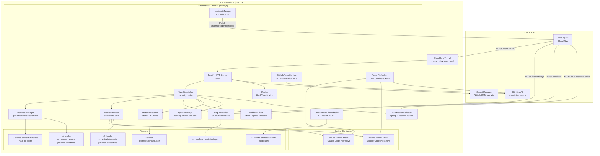
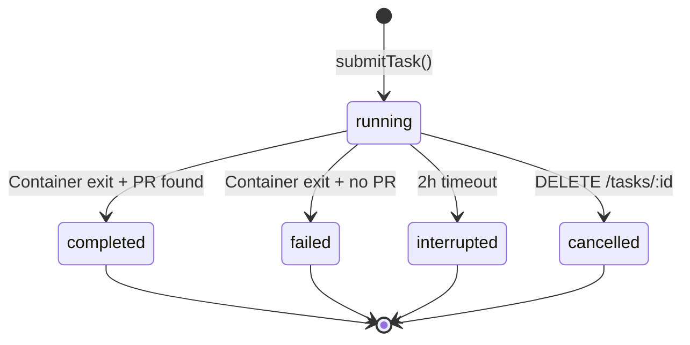

# Orchestrator - Technical Reference

## Overview

The orchestrator is a Fastify-based HTTP service that runs on local machines behind a Cloudflare Tunnel. It receives HMAC-signed task dispatch requests from code-agent, creates isolated git worktrees, spawns Docker containers running Claude Code in interactive mode, streams logs back in real time, and delivers completion results via signed webhooks. It manages GitHub App installation tokens, persists state atomically to disk, and recovers interrupted tasks on restart. After each worker attempt, an LLM-backed completion verifier (Gemini 2.5 Flash) evaluates whether the task met its agent-specific contract; failed verifications automatically trigger follow-up attempts up to a configurable limit. After each task completes, it collects per-task resource and token metrics and publishes them to code-agent.

## Agent-Based Routing and Contracts (2026-02-26)

### Agent selection precedence

1. PR / issue comment / review event -> `pull_request`
2. Linear issue without `code-task` -> `planning`
3. Linear issue with `code-task` -> `execution`

### Prompt markers and final blocks

- Preserved marker: `[WORKER-MODE]`
- Exactly one injected marker: `[AGENT:PLANNING]` / `[AGENT:EXECUTION]` / `[AGENT:PULL_REQUEST]`
- Final block names: `PLANNING_AGENT_FINAL`, `EXECUTION_AGENT_FINAL`, `PULL_REQUEST_AGENT_FINAL`

### Planning Agent webhook semantics

- `planned` -> webhook `status=completed`
- `unclear` -> webhook `status=failed`, `error.code=PLANNING_AGENT_UNCLEAR`

Flattened Planning Agent `result` fields:

- `planning_outcome_label`
- `planning_superpowers_writing_plans_used`
- `planning_linear_url`
- `planning_is_complex`
- `planning_pr_url`
- `planning_clarification_message`

Ownership split:

- Orchestrator: routing, prompts, completion verification, flattened `planning_*` metadata
- `code-agent`: deterministic Linear issue mutations after webhook receipt

> **Note:** UI enhancements for displaying execution-agent verifier results and execution metadata are deferred to a future step. Current implementation covers backend orchestrator and code-agent contracts only.

## Architecture



## Recent Changes

### Multi-Attempt Completion Verification (2026-02-19)

Added `OrchestratorCompletionVerifier` and integrated it into `TaskDispatcher`:

- After each container exit, runs deterministic checks (worker exit code, agent final contract blocks, PR URL presence, CI status)
- Then calls Gemini 2.5 Flash to adjudicate completion with the last 120 log lines and the last assistant message
- If the verifier returns `passed=false` and `attempt < maxAttempts`, the dispatcher automatically continues the session with a resume prompt listing missing criteria
- If the verifier itself is unavailable (Gemini API error), the task is marked `failed` with `TASK_COMPLETION_VERIFIER_FAILED` — prevents false-positive completions
- `maxAttempts` is configurable at startup via `CompletionControlConfig`

### Turn Metrics Collection (2026-02-19)

Added `TurnMetricsCollector` for automatic per-task resource and cost metrics:

- Reads CPU time from Linux cgroup `cpu.stat` file (`usage_usec`) post-container-exit
- Reads peak memory from `memory.peak` (falls back to `memory.current`)
- Parses Claude session JSONL files to classify time: API wait (user→assistant gaps), tool execution (assistant→user gaps), background wait, overhead
- Aggregates token counts: input, output, cache read, cache creation, API call count
- Publishes `TurnMetrics` to `POST /internal/turn-metrics` on code-agent via HMAC-signed request
- Non-fatal: failures are logged and do not affect task outcome

### Log Forwarding Improvements (2026-02-19)

- Removed `MAX_CHUNKS_PER_TASK` limit (was 500) — the 4MB total cap remains
- `MAX_CHUNK_SIZE` increased from 8KB to 64KB to accommodate large `hook_response` JSON frames
- Added `prefixTimestamps()`: prepends `HH:MM:ss.mmm` to each log line for readability
- ANSI escape code stripping via `log-formatter.ts`

### LLM Audit Sink (2026-02-19)

Added `OrchestratorFileAuditSink` implementing the `AuditSink` interface from `@intexuraos/llm-audit`. Appends structured audit records (provider, model, audit ID, timestamp) as JSONL to `~/.claude-orchestrator/llm-audit.jsonl`.

### INT-491: Interactive Mode Migration (2026-02-08)

Migrated Claude workers from `--print` mode to interactive mode:

- Container now runs `claude --dangerously-skip-permissions --verbose` without `--print`
- Orchestrator attaches to container stdin/stdout via Docker attach stream before start
- `waitForContainerReady()` handles API key prompt approval with up/enter keystrokes
- System prompt written to container stdin after the interactive session is ready
- `CLAUDE_CODE_EXIT_AFTER_STOP_DELAY=10000` ensures container exits 10s after Claude finishes

### INT-515: Self-Managed Repository Clone (2026-02-07)

Added `repo-manager.ts` with `ensureRepository()`:

- Validates existing repo (remote URL match, `.git` is directory not worktree, `package.json` name match)
- Clones from scratch if path does not exist
- Normalizes SSH vs HTTPS URLs for comparison
- `INTEXURAOS_REPOSITORY_URL` and `INTEXURAOS_REPOSITORY_PATH` env vars control behavior

### INT-486: Two-Phase Execution Model (Historical, superseded by agent-based routing) (2026-02-06)

Originally split system prompt into Phase 1 (Design & Validation) and Phase 2 (Strict Execution):

- Phase determined by presence of `code-task` label in `linearIssueLabels`
- Phase 1: Agent enriches the Linear issue description, creates sub-issues, adds labels
- Phase 2: Agent executes autonomously (tests, code, CI, PR, Linear update); includes PR description format instructions
- Superseded by explicit `agentType` routing (`planning` / `execution` / `pull_request`) and agent-specific final blocks
- Parent execution mode for issues with child tasks

### INT-524: Retry Mechanism (2026-02-05)

- `retriedFrom` field on tasks tracks retry chains
- `actionId` field links tasks to originating actions

## API Endpoints

| Method | Path                   | Auth        | Request Body                        | Response                                                       |
| ------ | ---------------------- | ----------- | ----------------------------------- | -------------------------------------------------------------- |
| POST   | `/tasks`               | HMAC signed | `CreateTaskRequest` (Zod-validated) | `202 { taskId, status: "accepted" }`                           |
| GET    | `/tasks/:id`           | None        | -                                   | `200 Task` or `404`                                            |
| DELETE | `/tasks/:id`           | None        | -                                   | `200 { taskId, status: "cancelled" }` or `404`                 |
| POST   | `/tasks/:id/message`   | HMAC signed | `{ message: string }`               | `200 SendMessageResult` or `404`/`409`                         |
| GET    | `/health`              | None        | -                                   | `200 { status, capacity, running, available, anthropicOAuth }` |
| GET    | `/meta/worker-image`   | None        | -                                   | `200` image diagnostics or `{ error }` if unavailable          |
| POST   | `/admin/shutdown`      | HMAC signed | -                                   | `200 { status: "shutting_down" }`                              |
| POST   | `/admin/refresh-token` | HMAC signed | -                                   | `200 { status: "refreshed", tokenExpiresAt }`                  |

### HMAC Authentication

Dispatch requests require three headers:

| Header                 | Content                                     |
| ---------------------- | ------------------------------------------- |
| `X-Dispatch-Timestamp` | Unix timestamp (ms)                         |
| `X-Dispatch-Nonce`     | Unique nonce per request                    |
| `X-Dispatch-Signature` | HMAC-SHA256 of `{timestamp}.{nonce}.{body}` |

Verification rejects requests with timestamps older than 5 minutes and replayed nonces (10-minute TTL cache).

### CreateTaskRequest Schema

```typescript
{
  taskId: string;               // Unique task identifier
  workerType: 'opus' | 'auto' | 'glm';
  prompt: string;               // User prompt (sanitized before injection)
  repository?: string;          // GitHub repo (default: pbuchman/intexuraos)
  baseBranch?: string;          // Branch to fork from (default: development)
  linearIssueId?: string;       // Linear issue for tracking
  linearIssueTitle?: string;
  linearIssueLabels: string[];  // Legacy label signal; orchestrator now also accepts explicit agentType routing
  hasChildren: boolean;         // Enables parent execution mode
  slug?: string;
  webhookUrl: string;           // Callback URL for results
  webhookSecret: string;        // HMAC secret for webhook signing
  actionId?: string;            // Originating action ID
}
```

### SendMessage Schema

`POST /tasks/:id/message` — sends a follow-up message to a task.

```typescript
{
  message: string; // min 1, max 10000 characters
}
```

**Behavior:**

- If the task is `running`: the message is queued and delivered when the current attempt finishes
- If the task is `completed`, `failed`, or `interrupted`: a new worker session is started with the message as the prompt (using `continueSession: true`)
- Returns `409` if the task status does not allow messages (e.g., `cancelled`)

## Domain Model

### Task Lifecycle



### OrchestratorState

```typescript
interface OrchestratorState {
  tasks: Record<string, Task>; // All tasks indexed by taskId
  githubToken: {
    // Cached GitHub installation token
    token: string;
    expiresAt: string;
  } | null;
  pendingWebhooks: PendingWebhook[]; // Failed webhook deliveries
}
```

### Task

```typescript
interface Task {
  taskId: string;
  workerType: 'opus' | 'auto' | 'glm';
  prompt: string;
  repository: string;
  baseBranch: string;
  linearIssueId?: string;
  linearIssueTitle?: string;
  linearIssueLabels: string[];
  hasChildren?: boolean;
  slug?: string;
  webhookUrl: string;
  webhookSecret: string;
  actionId?: string;
  retriedFrom?: string; // Original task ID for retry chains
  status: 'queued' | 'running' | 'completed' | 'failed' | 'interrupted' | 'cancelled';
  worktreePath: string;
  containerId: string;
  startedAt: string; // ISO 8601
  completedAt?: string; // ISO 8601
  attemptCount?: number; // Current attempt (starts at 1)
  maxAttempts?: number; // Maximum attempts before terminal failure
  lastExitCode?: number; // Exit code from most recent worker attempt
  verificationHistory?: TaskVerificationRecord[]; // Completion verifier results per attempt
}

interface TaskVerificationRecord {
  attempt: number;
  passed: boolean;
  confidence: number;
  reasons: string[];
  missingCriteria: string[];
  resumeInstruction: string;
  usedLlm: boolean;
  verifierFailure?: boolean;
  createdAt: string;
}
```

### TaskResult

After a task completes, the orchestrator inspects the worktree for results:

```typescript
interface TaskResult {
  prUrl?: string; // Pull request URL (if created)
  branch: string; // Git branch name
  commits: number; // Number of commits
  summary?: string; // PR title
  ciFailed?: boolean; // Whether CI checks failed
  rebaseResult?: {
    // Rebase attempt outcome
    attempted: boolean;
    success: boolean;
    conflictFiles?: string[];
  };
}
```

## Service Components

### TaskDispatcher

The central coordinator. Manages the full task lifecycle:

1. Atomic capacity check via `async-mutex`
2. Worktree creation via `WorktreeManager`
3. Anthropic API key validation (for `opus`/`auto` worker types)
4. System prompt construction via `buildSystemPrompt()`
5. Container creation via `DockerProvider` (`startWorkerAttempt`)
6. Token registration via `TokenRefresher`
7. Log forwarding registration via `LogForwarder`
8. Completion monitoring (30s polling interval)
9. Timeout warning at 1h55m, hard kill at 2h
10. On container exit: result extraction via `gh pr list` + `gh pr checks`, then completion verification via `CompletionVerifier`
11. If verification fails and `attempt < maxAttempts`: resume the session with a targeted follow-up prompt (auto-continue loop)
12. If verification passes or max attempts reached: turn metrics collection via `TurnMetricsCollector`, then webhook delivery
13. Queued messages (from `POST /tasks/:id/message` during execution) are delivered as the next session when verification passes

The dispatcher also exposes `sendMessage()` for mid-task message injection. Running tasks queue messages for post-completion delivery; finished tasks are resumed immediately with a new worker session.

### DockerProvider

Manages Docker container lifecycle via `dockerode`:

- **Image:** `europe-central2-docker.pkg.dev/intexuraos-dev-pbuchman/intexuraos-dev/claude-worker:latest` (overridable via `INTEXURAOS_CLAUDE_WORKER_IMAGE`)
- **Network:** `claude-worker-net`
- **Limits:** 8GB memory, 4 CPUs per container
- **Security:** `CapDrop: ALL`, `CapAdd: NET_RAW`, `SecurityOpt: no-new-privileges`
- **Mounts:** Worktree at `/repo` (rw), secrets at `/secrets` (ro), main `.git` dir for worktree support (rw)
- **Tmpfs:** `/tmp` (2GB, noexec) and `/home/claude` (500MB, noexec, uid=1001)
- **Interactive mode:** `OpenStdin: true`, `Tty: true`, attach before start to capture all output

### WorktreeManager

Creates isolated git worktrees per task:

- `git worktree add -b "{taskId}" "{path}" "origin/{baseBranch}"`
- Copies `.mcp.json` template with environment variable substitution
- Writes `.claude/settings.local.json` for Claude Code configuration
- Runs `pnpm install --frozen-lockfile` with 5-minute timeout
- Removes worktrees with `git worktree remove --force`

### LogForwarder

Streams container output to code-agent in near-real-time:

- Receives log chunks via `appendChunk()` callback from Docker attach stream
- Also supports file-polling mode (100ms interval) for non-Docker providers
- Buffers content and flushes every 3 seconds or when buffer exceeds 64KB
- Strips Docker multiplexed stream headers and ANSI escape codes via `stripDockerHeaders()`
- Prefixes each log line with a local timestamp (`HH:MM:ss.mmm`)
- Splits large buffers at newline boundaries
- Sends up to 5 chunks per batch to `POST /internal/logs`
- Signs payloads with HMAC-SHA256 using the task's webhook secret
- Limits: 4MB total per task (no per-chunk count limit)
- Retries failed uploads 3 times with exponential backoff (1s, 2s, 4s)

### WebhookClient

Delivers signed completion notifications to code-agent:

- Signs payloads with HMAC-SHA256 (`{timestamp}.{json_body}`)
- Includes `X-Internal-Auth` header for service-to-service auth
- Retries 3 times with delays of 5s, 15s, 45s
- Does not retry 4xx errors (client errors)
- Queues failed deliveries in `pendingWebhooks` with 24-hour TTL
- Background retry job runs every 5 minutes

### StatePersistence

Atomic file-based state management:

- Write-to-temp then atomic rename (POSIX rename guarantees)
- Corruption detection: backs up corrupted files with timestamp suffix
- Orphan worktree detection: compares `git worktree list` against active tasks

### GitHubTokenService

Manages GitHub App authentication:

- Generates RS256-signed JWT (10-minute expiry) from app private key
- Exchanges JWT for installation access token via GitHub API
- Writes token atomically to `~/.claude-orchestrator/github-token`
- Background refresh every 5 minutes
- Auth degraded callback after 3 consecutive failures

### TokenRefresher

Manages per-container GitHub tokens:

- Mints fresh installation tokens via JWT every 30 minutes
- Writes tokens to `/secrets/github-token` in each task's secrets directory
- Starts/stops refresh loop based on active task count
- Uses `jose` library for JWT signing (separate from `jsonwebtoken` used by GitHubTokenService)

### HeartbeatManager

Keeps running tasks visible to code-agent:

- Sends running task IDs every 10 minutes
- HMAC-signed with orchestrator secret
- Logs escalating warnings after 3 consecutive failures
- Enables zombie task detection in code-agent

### TurnMetricsCollector

Collects per-task resource and cost metrics after container exit:

- Reads CPU time (`usage_usec`) from Linux cgroup v2 at `/sys/fs/cgroup/system.slice/docker-{containerId}.scope/cpu.stat`
- Reads peak memory from `memory.peak` (falls back to `memory.current`)
- Locates Claude session JSONL files at `{secretsBasePath}/claude-session-{taskId}/projects/**/*.jsonl`
- Classifies time from JSONL event gaps: `user→assistant` = API wait, `assistant→user` = tool execution, `subtype:progress` = background wait
- Aggregates token counts across all API calls in the session
- Publishes `TurnMetrics` struct to `POST /internal/turn-metrics` on code-agent
- Errors are non-fatal: logged and swallowed so task outcome is unaffected

### OrchestratorCompletionVerifier

Evaluates whether a task attempt met its agent-specific contract using a two-stage pipeline:

**Stage 1 — Deterministic checks (Planning and Pull Request agents):**

- Non-zero worker exit code → `passed=false`
- Missing assistant final message in logs → `passed=false`
- Planning Agent: validates `PLANNING_AGENT_FINAL:` block and planning outcome contract fields
- Pull Request Agent: validates `PULL_REQUEST_AGENT_FINAL:` block and PR result expectations

**Execution Agent — Gemini-only semantic verification (no deterministic Stage 1):**

- Skips exit-code and runtime-signal checks entirely
- Gemini evaluates `EXECUTION_AGENT_FINAL:` semantics from Claude responses (latest first, prior-response fallback)
- Extracts flattened `execution_*` metadata for webhook delivery
- Hard-fails on wrong-issue mismatch (reported vs routed Linear issue)

**Stage 2 — LLM adjudication (Gemini 2.5 Flash):**

- Sends the original prompt, required contract template, deterministic signals, last assistant message, and last 120 log lines
- Returns `{ passed, confidence, reasons, missingCriteria, resumeInstruction }` as JSON
- Merges LLM and deterministic failure reasons if `passed=false`
- If Gemini is unreachable or returns invalid JSON: `verifierFailure=true`, task is marked `failed` (prevents false-positive completions)

The verifier is non-optional when `INTEXURAOS_GEMINI_APP_API_KEY` is set. It uses `@intexuraos/llm-factory` and logs all requests/responses via `OrchestratorFileAuditSink`.

### SensitiveFileGuard

Prevents accidental secret leaks in commits:

- Matches files against 20+ glob patterns (`.env`, `.pem`, `*.key`, `terraform.tfstate`, etc.)
- Reverts matched files via `git checkout HEAD~N -- "{file}"`
- Returns guard result indicating which files were reverted

### SystemPrompt

Constructs agent-specific instructions for Claude Code workers:

- **Planning Agent (`agentType=planning` or no `code-task` label):** planning mode, enriches Linear issue, adds labels
- **Execution Agent (`agentType=execution` or `code-task` label present):** execution mode, writes tests/code, runs CI, creates PR with `gh` CLI, runs code-review loop, and emits `EXECUTION_AGENT_FINAL` with superpower/subagent proofs
- **Pull Request Agent (`agentType=pull_request`):** PR-follow-up mode for comment-driven work on an existing branch/PR
- Sanitizes user prompts by stripping XML tags and forbidden keywords (prompt injection defense)
- Parent execution mode section injected when `hasChildren` is true
- Uses `/repo` (container path) not the host worktree path in system prompt instructions

### RepoManager

Ensures the orchestrator has a valid local repository clone:

- `ensureRepository()`: clone if missing, validate + fetch if present
- `validateRepository()`: checks `.git` is directory (not worktree file), remote URL matches, `package.json` name matches
- `normalizeUrl()`: handles SSH vs HTTPS and trailing `.git` suffix

### OrchestratorFileAuditSink

Appends LLM audit records to a local JSONL file:

- Implements `AuditSink` from `@intexuraos/llm-audit`
- Each record includes `{ time, audit: { id, provider, model, ... } }`
- Writes to `~/.claude-orchestrator/llm-audit.jsonl` via `appendFile`
- Non-blocking: errors are returned as `Result<void>` and handled by the caller

## Dependencies

| Package                    | Version   | Purpose                                                   |
| -------------------------- | --------- | --------------------------------------------------------- |
| `fastify`                  | ^5.6.2    | HTTP server                                               |
| `@fastify/cors`            | ^10.1.0   | CORS support                                              |
| `dockerode`                | ^4.0.9    | Docker Engine API client                                  |
| `async-mutex`              | ^0.5.0    | Atomic capacity checking                                  |
| `jose`                     | ^5.9.6    | JWT signing for TokenRefresher                            |
| `jsonwebtoken`             | ^9.0.2    | JWT signing for GitHubTokenService                        |
| `minimatch`                | ^10.1.1   | Glob pattern matching (SensitiveFileGuard)                |
| `pino`                     | ^9.6.0    | Structured logging                                        |
| `pino-pretty`              | ^13.0.0   | Human-readable log output                                 |
| `zod`                      | ^3.24.1   | Request schema validation                                 |
| `@intexuraos/common-core`  | workspace | Result types, Logger, error serialization                 |
| `@intexuraos/llm-audit`    | workspace | AuditSink interface for LLM audit logging                 |
| `@intexuraos/llm-factory`  | workspace | LLM client creation for completion verifier               |
| `@intexuraos/llm-contract` | workspace | Model enums and pricing types used by completion verifier |
| `@intexuraos/llm-pricing`  | workspace | StructuredLogUsageSink for verifier token cost logging    |

## Configuration

### Environment Variables

#### Required (startup fails if missing)

| Variable                            | Description                            |
| ----------------------------------- | -------------------------------------- |
| `INTEXURAOS_REPOSITORY_URL`         | GitHub repo URL for clone/fetch        |
| `INTEXURAOS_CODE_AGENT_URL`         | Webhook callback URL (Cloud Run)       |
| `INTEXURAOS_ORCHESTRATOR_SECRET`    | HMAC signing secret                    |
| `INTEXURAOS_PROJECT_ID`             | GCP project for Secret Manager         |
| `INTEXURAOS_GITHUB_APP_ID`          | GitHub App ID                          |
| `INTEXURAOS_GITHUB_INSTALLATION_ID` | GitHub App installation ID             |
| `INTEXURAOS_INTERNAL_AUTH_TOKEN`    | Service-to-service auth token          |
| `INTEXURAOS_LINEAR_API_KEY`         | Linear API key (passed to workers)     |
| `INTEXURAOS_SENTRY_AUTH_TOKEN`      | Sentry auth token (passed to workers)  |
| `INTEXURAOS_GEMINI_APP_API_KEY`     | Gemini API key for completion verifier |
| `INTEXURAOS_ZAI_APP_API_KEY`        | ZAI API key for GLM workers            |
| `GOOGLE_APPLICATION_CREDENTIALS`    | GCP service account key path           |

#### Optional

| Variable                                       | Default                       | Description                                         |
| ---------------------------------------------- | ----------------------------- | --------------------------------------------------- |
| `INTEXURAOS_REPOSITORY_PATH`                   | `~/.claude-orchestrator/repo` | Local repo clone path                               |
| `INTEXURAOS_WORKER_CAPACITY`                   | `2`                           | Max concurrent tasks                                |
| `INTEXURAOS_COMPLETION_MAX_ATTEMPTS`           | `3`                           | Max auto-continue attempts before terminal failure  |
| `INTEXURAOS_PRESERVE_FAILED_WORKER_CONTAINERS` | `1`                           | Keep containers alive after failure for debugging   |
| `INTEXURAOS_CLAUDE_WORKER_IMAGE`               | (GCR latest)                  | Override the Docker image used for workers          |
| `INTEXURAOS_GIT_USER_NAME`                     | host git config               | Git user.name for commits inside worker containers  |
| `INTEXURAOS_GIT_USER_EMAIL`                    | host git config               | Git user.email for commits inside worker containers |
| `INTEXURAOS_GITHUB_APP_PRIVATE_KEY`            | (Secret Manager)              | PEM key override for testing without Secret Manager |
| `KEEP_CONTAINERS_ALIVE`                        | `0`                           | `1` = never remove containers (debug mode)          |
| `PORT`                                         | `8199`                        | HTTP server port                                    |
| `LOG_LEVEL`                                    | `info`                        | Pino log level                                      |

### Docker Container Defaults

| Setting        | Value                                                                                        |
| -------------- | -------------------------------------------------------------------------------------------- |
| Image          | `europe-central2-docker.pkg.dev/intexuraos-dev-pbuchman/intexuraos-dev/claude-worker:latest` |
| Network        | `claude-worker-net`                                                                          |
| Max concurrent | configurable (default 2, `INTEXURAOS_WORKER_CAPACITY`)                                       |
| Memory limit   | 8 GB                                                                                         |
| CPU count      | 4                                                                                            |
| Timeout        | 2 hours                                                                                      |
| User           | 1001:1001                                                                                    |

### Timer Intervals

| Timer            | Interval   | Purpose                            |
| ---------------- | ---------- | ---------------------------------- |
| Token refresh    | 5 minutes  | GitHub App token (service-level)   |
| Webhook retry    | 5 minutes  | Retry failed webhook deliveries    |
| Task polling     | 30 seconds | Debug logging only                 |
| Heartbeat        | 10 minutes | Running task IDs to code-agent     |
| Container token  | 30 minutes | Per-container GitHub token refresh |
| Completion check | 30 seconds | Container exit polling             |
| Timeout warning  | 1h 55m     | Log warning before hard kill       |
| Timeout kill     | 2h         | Force-kill container               |
| Log flush        | 3 seconds  | Send buffered log chunks           |
| Log file poll    | 100ms      | Read new content from log file     |

## Gotchas

1. **Not a Cloud Run service.** The orchestrator runs as a native Node.js process, not in a container. It is not managed by Terraform.
2. **Requires Docker daemon.** The `dockerode` client connects via `/var/run/docker.sock`. No daemon means no workers.
3. **Cloudflare Tunnel required.** code-agent reaches the orchestrator via `cc-mac.intexuraos.cloud`. Without the tunnel, task dispatch fails.
4. **HMAC secrets must match.** The `INTEXURAOS_ORCHESTRATOR_SECRET` env var must match the `dispatchSigningSecret` configured in the IntexuraOS UI worker settings. Mismatch causes 401 on every dispatch.
5. **GitHub private key is fetched from Secret Manager.** The PEM key is multiline and cannot be stored in `.envrc`. The bootstrapper fetches it via `gcloud secrets versions access` and caches it locally.
6. **Two JWT libraries.** `GitHubTokenService` uses `jsonwebtoken` (RS256 sign). `TokenRefresher` uses `jose` (RS256 sign via Web Crypto). Both produce valid GitHub App JWTs.
7. **Attach before start.** The Docker provider calls `container.attach()` before `container.start()` to capture all output from startup. Reversing this order causes missed log lines.
8. **Container name conflicts.** If a previous orchestrator run left orphaned containers, `createWorker` fails with "name already in use". Call `cleanupOrphanedContainers()` on startup.
9. **Worktree `.git` file.** Git worktrees have a `.git` file (not directory) pointing to the main repo's `.git/worktrees/`. The DockerProvider reads this file to determine the main git directory and mounts it into the container for commit/push operations.
10. **State file corruption.** If `state.json` is corrupted (e.g., partial write on crash), `StatePersistence.load()` backs up the file and starts fresh rather than crashing.
11. **Turn metrics are cgroup-dependent.** `TurnMetricsCollector` reads from `/sys/fs/cgroup/system.slice/docker-{id}.scope` — this path is Linux-specific and will return zero values on macOS (where cgroup v2 is not exposed). Turn metrics collection is non-fatal.
12. **Docker header stripping handles mid-frame splits.** Long messages (e.g., `hook_response` JSON) can span multiple Docker frames, resulting in headers appearing mid-string. `log-formatter.ts` scans the entire string for the 8-byte binary pattern, not just at line boundaries.
13. **Completion verifier is required.** `INTEXURAOS_GEMINI_APP_API_KEY` is a hard-required env var since completion verification is always enabled. Missing this key causes startup failure.
14. **Verifier failure = task failure.** If Gemini is unreachable or returns unparseable JSON, the task is marked `failed` with `TASK_COMPLETION_VERIFIER_FAILED` rather than completing normally. This prevents tasks from being reported as successful when their outcomes cannot be verified.
15. **Git identity flows from host to container.** The bootstrapper reads `git config user.name` and `user.email` from the host and injects them as env vars into worker containers so commits have the correct author. Override via `INTEXURAOS_GIT_USER_NAME`/`INTEXURAOS_GIT_USER_EMAIL`.
16. **`/tasks/:id/message` requires HMAC auth.** Unlike the GET and DELETE task endpoints, sending a message to a task requires the same HMAC dispatch headers as submitting a new task.

## File Structure

```
workers/orchestrator/
  src/
    index.ts                          # Barrel exports + bootstrap import
    start.ts                          # Bootstrap: env loading, service wiring
    main.ts                           # Fastify server, recovery, shutdown handlers
    routes.ts                         # HTTP endpoints + HMAC verification
    heartbeat.ts                      # HeartbeatManager (code-agent keepalive)
    worktree-cleanup.ts               # Stale worktree removal
    github/
      token-service.ts                # GitHub App JWT + installation tokens
    services/
      state-persistence.ts            # Atomic JSON file state
      task-dispatcher.ts              # Task lifecycle coordinator
      webhook-client.ts               # Signed webhook delivery + retry queue
      log-forwarder.ts                # Chunked log streaming to code-agent
      log-formatter.ts                # Docker header + ANSI escape stripping
      sensitive-file-guard.ts         # Secret file detection + revert
      worktree-manager.ts             # Git worktree CRUD + MCP config
      repo-manager.ts                 # Repository clone/validate/fetch
      system-prompt.ts                # Agent-specific prompt builder
      turn-metrics-collector.ts       # Per-task cgroup + token metrics
      orchestrator-audit-sink.ts      # LLM audit log file sink
      completion-verifier.ts          # LLM-backed task completion verification (Gemini)
      api-key-validator.ts            # API key validation
      isolation/
        index.ts                      # Factory + re-exports
        types.ts                      # IsolationProvider interface
        docker-provider.ts            # Docker container lifecycle
        token-refresher.ts            # Per-container GitHub token refresh
        credential-monitor.ts         # Anthropic OAuth credential monitoring
        credential-refresher.ts       # Anthropic OAuth credential refreshing
    types/
      index.ts                        # Barrel exports
      api.ts                          # CreateTaskRequest, HealthResponse
      config.ts                       # OrchestratorConfig
      state.ts                        # OrchestratorState, PendingWebhook
      task.ts                         # Task, TaskStatus, TaskResult, TaskError
      schemas.ts                      # Zod schemas for request validation
    __tests__/
      main.test.ts                    # Main function tests
      routes.test.ts                  # HTTP endpoint tests
      heartbeat.test.ts               # Heartbeat manager tests
      worktree-cleanup.test.ts        # Worktree cleanup tests
      token-service.test.ts           # GitHub token service tests
      state-persistence.test.ts       # State persistence tests
      task-dispatcher.test.ts         # Task dispatcher tests
      webhook-client.test.ts          # Webhook client tests
      log-forwarder.test.ts           # Log forwarder tests
      log-formatter.test.ts           # Log formatter tests
      turn-metrics-collector.test.ts  # Turn metrics collector tests
      sensitive-file-guard.test.ts    # Sensitive file guard tests
      worktree-manager.test.ts        # Worktree manager tests
      repo-manager.test.ts            # Repo manager tests
      mock-code-agent.test.ts         # Mock code-agent integration
      integration.test.ts             # Integration tests
      types/
        types.test.ts                 # Type validation tests
  package.json
  tsconfig.json
  vitest.e2e.config.ts                # E2E test config (Docker-dependent)
  README.md                           # Setup and usage guide
  DEPLOYMENT.md                       # Build, deploy, and manage reference
```
