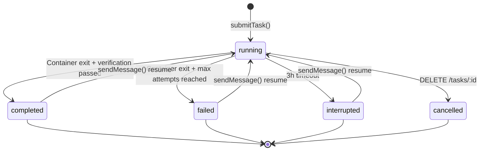

# Orchestrator — Technical Reference

## Overview

The orchestrator is a Fastify-based HTTP service that runs on local machines behind a Cloudflare Tunnel. It receives HMAC-signed task dispatch requests from code-agent, creates isolated git worktrees, spawns Docker containers running the shared code-worker runtime, streams logs back in real time, and delivers completion results via signed webhooks. It manages GitHub App installation tokens plus shared worker auth for Claude and Codex, persists state atomically to disk, and recovers interrupted tasks (including container adoption) on restart. After each worker attempt, an LLM-backed completion verifier (Gemini 2.5 Flash) evaluates whether the task met its agent-specific contract; failed verifications automatically trigger follow-up attempts up to a configurable limit. For execution tasks, a Deep Validator performs post-completion transcript analysis — verifying claims, checking contract compliance, comparing plan to reality, and posting a structured report on the PR. The Review Agent can be dispatched in `plan_review` mode to cross-reference implementations against their original plan documents. After each task completes, it collects per-task resource and token metrics and publishes them to code-agent. Linear issue context is now fetched via the code-agent proxy rather than querying Linear directly, improving resilience and decoupling.

## Agent-Based Routing and Contracts

### Agent selection precedence

1. `agentType` field from code-agent (explicit routing, takes priority)
2. PR / issue comment / review event (label `pr-comment`) -> `pull_request`
3. `agentType === 'review'` -> `review`
4. Linear issue without `code-task` label -> `planning`
5. Linear issue with `code-task` label -> `execution`

### Prompt markers and final blocks

- Preserved marker: `[WORKER-MODE]`
- Exactly one injected marker: `[AGENT:PLANNING]` / `[AGENT:EXECUTION]` / `[AGENT:PULL_REQUEST]` / `[AGENT:REVIEW]`
- Final block names: `PLANNING_AGENT_FINAL`, `EXECUTION_AGENT_FINAL`, `PULL_REQUEST_AGENT_FINAL`, `REVIEW_AGENT_FINAL`
- All prompts follow the versioned `PromptBuilder` pattern (semver versioned, CI-enforced bump-on-change)

### Review Agent types

The Review Agent supports four review types, controlled by the `reviewTypes` field:

| Type           | Scope                                                                                                       |
| -------------- | ----------------------------------------------------------------------------------------------------------- |
| `code_quality` | Code style, readability, maintainability, naming, DRY, dead code, test coverage gaps                        |
| `security`     | Injection vulnerabilities, auth issues, secrets exposure, OWASP top 10                                      |
| `architecture` | Separation of concerns, dependency direction, API design, scalability, coupling/cohesion                    |
| `plan_review`  | Plan document validation — task decomposition, TDD discipline, file path accuracy, codebase cross-reference |

When `reviewTypes` includes `plan_review`, the Review Agent reads the plan file from the worktree and validates every requirement against the codebase. Requirements coverage is tracked with a per-requirement status table (implemented / partially implemented / missing).

### Planning Agent webhook semantics

- `planned` -> webhook `status=completed`
- `unclear` -> webhook `status=failed`, `error.code=PLANNING_AGENT_UNCLEAR`

Flattened Planning Agent `result` fields:

- `planning_outcome_label`
- `planning_superpowers_writing_plans_used`
- `planning_linear_url`
- `planning_is_complex`
- `planning_subtask_urls`
- `planning_pr_url`
- `planning_unclear_clarification`

### Execution Agent webhook semantics

- `implemented` -> webhook `status=completed`
- `already_completed` -> webhook `status=completed` with `execution_outcome_label: 'already_completed'`

Flattened Execution Agent `result` fields:

- `execution_outcome_label` (`'implemented'` or `'already_completed'`)
- `execution_superpowers_executing_plans_used`
- `execution_superpowers_requesting_code_review_used`
- `execution_linear_issue_url`

### Review Agent webhook semantics

- Completed review -> webhook `status=completed`

Flattened Review Agent `result` fields:

- `review_comments_posted`
- `review_types`
- `requirements_tracker_updated`

### Ownership split

- Orchestrator: routing, prompts, completion verification, deep validation, flattened metadata
- `code-agent`: deterministic Linear issue mutations after webhook receipt

## Architecture

```mermaid
graph TB
    subgraph "Cloud (GCP)"
        CA[code-agent<br/>Cloud Run]
        SM[Secret Manager<br/>GitHub PEM, secrets]
        GH[GitHub API<br/>Installation tokens]
    end

    subgraph "Local Machine"
        CF[Cloudflare Tunnel<br/>cc-mac.intexuraos.cloud]
        CF --> ORCH

        subgraph "Orchestrator Process (Node.js)"
            ORCH[Fastify HTTP Server<br/>:8199]
            ORCH --> TD[TaskDispatcher<br/>capacity mutex]
            ORCH --> ROUTES[Routes<br/>HMAC verification]

            TD --> WM[WorktreeManager<br/>git worktree create/remove]
            TD --> DP[DockerProvider<br/>dockerode SDK]
            TD --> LF[LogForwarder<br/>3s chunked upload]
            TD --> WC[WebhookClient<br/>HMAC-signed callbacks]
            TD --> SP[StatePersistence<br/>atomic JSON file]
            TD --> SYS[SystemPrompt<br/>Planning / Execution / PR / Review<br/>PromptBuilder versioned]
            TD --> TMC[TurnMetricsCollector<br/>cgroup + session JSONL]
            TD --> CV[CompletionVerifier<br/>Gemini 2.5 Flash]
            TD --> DV[ExecutionDeepValidator<br/>Gemini 2.5 Flash]

            GTS[GitHubTokenService<br/>JWT + installation token]
            TR[TokenRefresher<br/>per-container tokens]
            HB[HeartbeatManager<br/>10min interval]
            AAS[OrchestratorFileAuditSink<br/>LLM audit JSONL]
            CM[CredentialMonitor<br/>OAuth watcher]
            CR[CredentialRefresher<br/>Docker-based refresh]
            AKV[ApiKeyValidator<br/>key health check]
        end

        subgraph "Docker Containers"
            W1[code-worker-taskA<br/>Claude Code or Codex]
            W2[code-worker-taskB<br/>Claude Code or Codex]
        end

        DP --> W1
        DP --> W2
        TR --> W1
        TR --> W2

        subgraph "Filesystem"
            REPO[~/.code-orchestrator/repo<br/>main git clone]
            WT[~/code-workers/worktrees/<br/>per-task worktrees]
            STATE[~/.code-orchestrator/state.json]
            SECRETS[~/.code-orchestrator/secrets/<br/>per-task credentials]
            LOGS[~/.code-orchestrator/logs/]
            AUDIT[~/.code-orchestrator/logs/llm-audit.log]
            CREDS[~/.code-orchestrator/claude-creds/<br/>shared OAuth credentials]
        end

        WM --> REPO
        WM --> WT
        SP --> STATE
        DP --> SECRETS
        LF --> LOGS
        AAS --> AUDIT
        CM --> CREDS
        CR --> CREDS
    end

    CA -->|POST /tasks HMAC| CF
    GTS --> GH
    TR --> GH
    LF -->|POST /internal/logs| CA
    WC -->|POST webhook| CA
    HB -->|POST /internal/code/heartbeat| CA
    TMC -->|POST /internal/turn-metrics| CA
    DV -->|GET /internal/linear/issue-context| CA
    ORCH --> SM
```



## Recent Changes

### v3.4.0 Release (2026-03-22)

Key changes since v3.3.0: Review Agent plan awareness with requirements tracking, Linear proxy via code-agent replacing direct GraphQL dependency, auto-enforcement of review findings, unified task enqueue, plan-based review dispatch, worker instruction sections in system prompts, selective container preservation by agent type, automatic sub-task creation from parent tasks, and numerous reliability fixes.

### Review Agent Plan Awareness (INT-1038, PR #1389)

The Review Agent now checks whether an implementation matches the original plan. When dispatched in `plan_review` mode, the agent reads the plan document from the worktree, cross-references every requirement against the PR diff, and posts a structured requirements coverage table on the PR. The review prompt was upgraded to v6.0.0 with a requirements tracker and per-type breakdown structure. Each review type (code quality, security, architecture, plan review) gets its own section with an independent verdict.

### Orchestrator Linear Proxy (INT-1040, PR #1414)

The Deep Validator now fetches Linear issue context via code-agent's `/internal/linear/issue-context/:identifier` endpoint instead of querying the Linear GraphQL API directly. This removes the orchestrator's direct Linear dependency, improving resilience (code-agent handles retries and caching) and decoupling. The `readPlanReferencedInLinearIssue` function is deprecated in favor of `readPlanFile` with the `planDocumentPath` from code-agent's response.

### Auto-Enforcement of Review Findings (INT-926, PR #1233)

Quality issues identified during automated code reviews are now automatically acted upon. When the review agent detects findings above a severity threshold, enforcement actions are triggered without requiring manual intervention.

### Unified Task Enqueue Service (INT-950, PR #1288)

All code tasks now go through a consistent, reliable queue before dispatch. The queue-first approach ensures tasks are durably recorded before execution begins, preventing lost dispatches during transient failures.

### Plan-Based Review Dispatch (INT-1039, PR #1391)

The review agent is now automatically triggered when plan review is needed. A new `plan_review` review type validates task decomposition, TDD discipline, file path accuracy, and missing steps — all cross-referenced against the actual codebase. The `reviewTypes` field on `CreateTaskRequest` controls which review types are requested.

### Worker Instruction Sections in System Prompts (INT-972, PR #1301)

System prompts now include a `WORKER_INSTRUCTIONS` constant with mandatory sections covering git CLI usage (prefer `gh`), GCP service account credentials, and code task debugging rules. Extracted to a shared constant to ensure consistency across all four agent types.

### Selective Container Preservation by Agent Type (INT-973, PR #1302)

Container preservation on task completion is now agent-type-aware. Only execution and planning containers are preserved; review and pull request containers are cleaned up immediately. The `preserveWorkerContainers` configuration controls the default behavior.

### Automatic Sub-Task Creation and Dispatch (INT-962, PR #1295)

Parent tasks with `hasChildren: true` can now automatically create and dispatch sub-tasks. The orchestrator handles fan-out from a parent task to its children, with queue position tracking to prevent pollution of the parent's position.

### Base Branch Fetch Before Worktree Creation (INT-984, PR #1319)

The orchestrator now fetches the base branch from origin before creating a worktree, preventing stale refs from causing worktree creation failures when the branch has been force-pushed or updated remotely.

### Queue Position and Fan-Out Fixes (INT-977, PR #1311)

Fixed an off-by-one error in queue position calculation and prevented parent task state pollution during fan-out dispatch. Queue positions are now accurately reported for both parent and child tasks.

### Image Pull Timeout Separation (INT-1022, PR #1349)

Image pulls and container creation now have separate timeouts. Image pulls get 15 minutes (`IMAGE_PULL_TIMEOUT_MS`) since they are network-bound, while container creation retains the 2-minute timeout (`CONTAINER_CREATE_TIMEOUT_MS`). This prevents slow network conditions from causing container creation to fail prematurely.

### Fetch Error Cause Chain Logging (INT-1016, PR #1344)

Fetch errors now log the full cause chain (e.g., `fetch failed -> connect ECONNREFUSED`) instead of just the top-level message, improving debugging for network-related failures.

### MiniMax Model Migration (INT-1009, PR #1327)

The MiniMax worker type now uses the M2.7 model (previously M2.5). The model identifier in `WORKER_TYPES` was updated from `MiniMax-M2.5` to `MiniMax-M2.7`.

### Timeout Configuration Changes

Task execution timeout increased from 2 hours to 3 hours (`TASK_TIMEOUT_KILL_MS = 180 * 60 * 1000`), with the warning threshold at 2 hours 55 minutes (`TASK_TIMEOUT_WARNING_MS = 175 * 60 * 1000`). Queue TTL increased to 6 hours.

## API Endpoints

| Method | Path                   | Auth        | Request Body                        | Response                                                       |
| ------ | ---------------------- | ----------- | ----------------------------------- | -------------------------------------------------------------- |
| POST   | `/tasks`               | HMAC signed | `CreateTaskRequest` (Zod-validated) | `202 { taskId, status: "accepted" }`                           |
| GET    | `/tasks/:id`           | None        | -                                   | `200 Task` or `404`                                            |
| DELETE | `/tasks/:id`           | None        | -                                   | `200 { taskId, status: "cancelled" }` or `404`/`409`           |
| POST   | `/tasks/:id/message`   | HMAC signed | `{ message: string }`               | `200 SendMessageResult` or `404`/`409`                         |
| GET    | `/health`              | None        | -                                   | `200 { status, capacity, running, available, workerAuths }` |
| GET    | `/meta/worker-image`   | None        | -                                   | `200` image diagnostics or `{ error }` if unavailable          |
| POST   | `/admin/shutdown`      | HMAC signed | -                                   | `200 { status: "shutting_down" }`                              |
| POST   | `/admin/refresh-token` | HMAC signed | -                                   | `200 { status: "refreshed", tokenExpiresAt }`                  |

### HMAC Authentication

Dispatch requests require three headers:

| Header                 | Content                                     |
| ---------------------- | ------------------------------------------- |
| `X-Dispatch-Timestamp` | Unix timestamp (ms)                         |
| `X-Dispatch-Nonce`     | Unique nonce per request                    |
| `X-Dispatch-Signature` | HMAC-SHA256 of `{timestamp}.{nonce}.{body}` |

Verification rejects requests with timestamps older than 5 minutes and replayed nonces (10-minute TTL cache).

### CreateTaskRequest Schema

```typescript
{
  taskId: string;
  workerType: 'opus' | 'auto' | 'sonnet' | 'minimax' | 'glm' | 'qwen' | 'kimi' | 'codex';
  prompt: string;
  repository?: string;
  baseBranch?: string;
  linearIssueId?: string;
  linearIssueTitle?: string;
  linearIssueLabels: string[];
  hasChildren: boolean;
  slug?: string;
  webhookUrl: string;
  webhookSecret: string;
  actionId?: string;
  agentType?: 'planning' | 'execution' | 'pull_request' | 'review';
  trackingCommentId?: string;           // Existing PR tracking comment to reuse
  continuationPrNumber?: number;         // Existing PR number to continue
  continuationPrBranch?: string;         // Existing PR branch to continue
  planningPrBranch?: string;             // Branch to merge into execution worktree
  planningPrUrl?: string;               // PR URL to close after successful execution
  reviewTypes?: ('code_quality' | 'security' | 'architecture' | 'plan_review')[];
}
```

### SendMessage Schema

`POST /tasks/:id/message` — sends a follow-up message to a task.

```typescript
{
  message: string; // min 1, max 20000 characters
}
```

**Behavior:**

- If the task is `running`: the message is queued and delivered when the current attempt finishes
- If the task is `completed`, `failed`, or `interrupted`: a new worker session is started with the message as the prompt (using `continueSession: true`)
- Returns `409` if the task status does not allow messages (e.g., `cancelled`)

## Domain Model

### Task Lifecycle



### OrchestratorState

```typescript
interface OrchestratorState {
  tasks: Record<string, Task>;
  githubToken: {
    token: string;
    expiresAt: string;
  } | null;
  pendingWebhooks: PendingWebhook[];
}
```

### Task

```typescript
interface Task {
  taskId: string;
  workerType: 'opus' | 'auto' | 'sonnet' | 'minimax' | 'glm' | 'qwen' | 'kimi' | 'codex';
  prompt: string;
  repository: string;
  baseBranch: string;
  linearIssueId?: string;
  linearIssueTitle?: string;
  linearIssueLabels: string[];
  hasChildren?: boolean;
  slug?: string;
  webhookUrl: string;
  webhookSecret: string;
  actionId?: string;
  retriedFrom?: string;
  agentType?: 'planning' | 'execution' | 'pull_request' | 'review';
  trackingCommentId?: string;
  continuationPrNumber?: number;
  continuationPrBranch?: string;
  planningPrBranch?: string;
  planningPrUrl?: string;
  reviewTypes?: ('code_quality' | 'security' | 'architecture' | 'plan_review')[];
  status: 'queued' | 'running' | 'completed' | 'failed' | 'interrupted' | 'cancelled';
  worktreePath: string;
  containerId: string;
  startedAt: string;
  completedAt?: string;
  attemptCount?: number;
  maxAttempts?: number;
  lastExitCode?: number;
  verificationHistory?: TaskVerificationRecord[];
  resumedAfterSuccess?: boolean;
  lastSuccessResult?: TaskResult;
  pendingResumeStart?: PendingResumeStart;
}

interface TaskVerificationRecord {
  attempt: number;
  passed: boolean;
  missingFields: string[];
  verifierFailure: boolean;
  createdAt: string;
}

interface PendingResumeStart {
  prompt: string;
  acceptedAt: string;
}
```

### TaskResult

```typescript
interface TaskResult {
  prUrl?: string;
  branch?: string;
  commits?: number;
  commitDetails?: { sha: string; message: string }[];
  summary?: string;
  ciFailed?: boolean;
  comment_replied?: boolean;
  planning_outcome_label?: 'planned' | 'unclear';
  planning_superpowers_writing_plans_used?: '0' | '1';
  planning_linear_url?: string;
  planning_is_complex?: '0' | '1';
  planning_subtask_urls?: string;
  planning_pr_url?: string;
  planning_unclear_clarification?: string;
  execution_outcome_label?: 'implemented' | 'already_completed';
  execution_superpowers_executing_plans_used?: '0' | '1';
  execution_superpowers_requesting_code_review_used?: '0' | '1';
  execution_linear_issue_url?: string;
  review_comments_posted?: string;
  review_types?: string;
  requirements_tracker_updated?: string;
  rebaseResult?: {
    attempted: boolean;
    success: boolean;
    conflictFiles?: string[];
  };
}
```

## Service Components

### TaskDispatcher

The central coordinator. Manages the full task lifecycle:

1. Docker health check via `isHealthy()` — rejects with `503 docker_unavailable` if unhealthy
2. Atomic capacity check via `async-mutex`
3. Worktree creation via `WorktreeManager` (with optional `continuationPrBranch` checkout)
4. Planning PR branch merge (if `planningPrBranch` is set)
5. API key validation via `ApiKeyValidator` (checks OAuth monitor or API endpoint)
6. System prompt construction via `buildSystemPrompt()` (versioned PromptBuilder)
7. Image pull via `DockerProvider.pullImage()` with 15-minute timeout (separated from container creation)
8. Container creation via `DockerProvider` (`startWorkerAttempt`) with 2-minute timeout
9. Token registration via `TokenRefresher`
10. Log forwarding registration via `LogForwarder`
11. Completion monitoring (30s polling interval) with activity heartbeat logging
12. Timeout warning at 2h55m, hard kill at 3h
13. On container exit: result extraction via `gh pr list` + `gh pr checks`, then completion verification via `CompletionVerifier`
14. Fatal exit codes (137/139) skip Gemini verification and trigger immediate retry
15. If verification fails and `attempt < maxAttempts`: resume the session with a targeted follow-up prompt (auto-continue loop)
16. If verification passes: deep validation for execution tasks (transcript analysis, PR comment via code-agent Linear proxy), then turn metrics collection via `TurnMetricsCollector`, then webhook delivery
17. Queued messages (from `POST /tasks/:id/message` during execution) are delivered as the next session when verification passes
18. Exposes `sendMessage()` for mid-task message injection and task resume after completion
19. `adoptTask()` for startup recovery re-attachment to running containers
20. `recoverPendingResumeTask()` for recovering accepted resumes that were interrupted by a restart

### OrchestratorExecutionDeepValidator

Performs post-completion transcript analysis for execution tasks:

- Reads the full Claude session transcript from JSONL files via `readSessionTranscript()`
- Formats the transcript into a human-readable MSG-NNN numbered format via `formatTranscript()`
- Fetches Linear issue context via code-agent proxy (`fetchLinearIssueContextViaCodeAgent()`) instead of querying Linear GraphQL directly
- Resolves plan documents from the code-agent response's `planDocumentPath` field (falls back to deprecated `readPlanReferencedInLinearIssue` for backwards compatibility)
- Sends the full context (transcript, agent claims, Linear issue, plan) to Gemini 2.5 Flash
- Validates the response: must contain five required sections as markdown tables, no bullet lists
- Posts the structured Deep Validation Report as a GitHub PR comment via `gh pr comment`
- Uses visual severity indicators: Critical (red), Warning (orange), Minor (yellow), Pass (green)
- Reports split across multiple comments if they exceed the 65KB GitHub comment limit
- Uses `@intexuraos/llm-factory` for client creation and `OrchestratorFileAuditSink` for audit logging

### DockerProvider

Manages Docker container lifecycle via `dockerode`:

- **Image:** configurable via `INTEXURAOS_CODE_WORKER_IMAGE` (default: GCR Artifact Registry latest)
- **Image pull:** Always pulls before each task (fail-fast, no cached-image fallback); 15-minute timeout separated from container creation
- **Network:** `code-worker-net`
- **Limits:** 8GB memory, 4 CPUs per container
- **Security:** `CapDrop: ALL`, `CapAdd: NET_RAW`, `SecurityOpt: no-new-privileges`
- **Mounts:** Worktree at `/repo` (rw), secrets at `/secrets` (ro), main `.git` dir for worktree support (rw), shared OAuth credentials at `/home/claude/.claude` (rw)
- **Tmpfs:** `/tmp` (2GB, noexec) and `/home/claude` (500MB, noexec, uid=1001)
- **Interactive mode:** `OpenStdin: true`, `Tty: true`, attach before start to capture all output
- **Container creation timeout:** 2 minutes
- **Health gate:** `isHealthy()` checks Docker daemon connectivity and disk availability
- **Managed attempts:** When enabled, the DockerProvider handles multi-attempt container lifecycle
- **Forensics mode:** When enabled (`INTEXURAOS_CODE_WORKER_FORENSICS=1`), captures core dumps and crash snapshots to the forensics directory
- **Container discovery:** `listWorkerContainers()` discovers running `code-worker-*` containers for startup recovery
- **Periodic stale cleanup:** Removes orphaned containers not tracked in state.json after a configurable idle threshold

### WorktreeManager

Creates isolated git worktrees per task:

- `git worktree add -b "{taskId}" "{path}" "origin/{baseBranch}"` — base branch is fetched from origin first
- Supports `continuationPrBranch` checkout for retried tasks inheriting an existing PR branch
- Copies `.mcp.json` template with environment variable substitution (Linear API key, Sentry auth token)
- Copies `.claude/settings.local.json` from `workers/code-worker/config-defaults/`
- `mergePlanningBranch()`: fetches and merges a planning PR branch into the execution worktree
- All git operations serialized via `async-mutex` to prevent index corruption
- Removes worktrees with `git worktree remove --force`

### LogForwarder

Streams container output to code-agent in near-real-time:

- Receives log chunks via `appendChunk()` callback from Docker attach stream
- Also supports file-polling mode (100ms interval) for non-Docker providers
- Buffers content and flushes every 3 seconds or when buffer exceeds 64KB
- Strips Docker multiplexed stream headers and ANSI escape codes via `stripDockerHeaders()`
- Strips heavyweight `tool_use_result` metadata from JSONL lines via `stripBulkMetadata()`
- Prefixes each log line with a local timestamp (`HH:MM:ss.mmm`)
- Reassembles partial lines across chunk boundaries
- Sends up to 5 chunks per batch to `POST /internal/logs`
- Signs payloads with HMAC-SHA256 using the task's webhook secret
- Limits: 4MB total per task
- Retries failed uploads 3 times with exponential backoff (1s, 2s, 4s)
- `flushAndStop()` drains all remaining logs on container exit

### WebhookClient

Delivers signed completion notifications to code-agent:

- Signs payloads with HMAC-SHA256 (`{timestamp}.{json_body}`)
- Includes `X-Internal-Auth` header for service-to-service auth
- Retries 3 times with delays of 5s, 15s, 45s
- Does not retry 4xx errors (client errors)
- Queues failed deliveries in `pendingWebhooks` with 24-hour TTL
- Background retry job runs every 5 minutes

### StatePersistence

Atomic file-based state management:

- Write-to-temp then atomic rename (POSIX rename guarantees)
- `modify()` uses `async-mutex` for safe read-modify-write
- Corruption detection: backs up corrupted files with timestamp suffix
- Orphan worktree detection: compares `git worktree list` against active tasks

### GitHubTokenService

Manages GitHub App authentication (service-level):

- Generates RS256-signed JWT (10-minute expiry) from app private key
- Exchanges JWT for installation access token via GitHub API (with automatic retry via `octokit-plugin-retry`)
- Writes token atomically to `~/.code-orchestrator/github-token`
- Background refresh every 5 minutes
- Auth degraded callback after 3 consecutive failures

### TokenRefresher

Manages per-container GitHub tokens:

- Mints fresh installation tokens via JWT (using `jose` library) every 30 minutes
- Writes tokens to per-task secrets directories (`~/.code-orchestrator/secrets/{taskId}/github-token`)
- Starts/stops refresh loop based on active task count

### WorkerAuthRegistry

Coordinates shared worker auth state across runtimes:

- Tracks provider-specific auth state for `claude` and `codex`
- Exposes `/health` data via `workerAuths`
- Blocks new task submission with `503 auth_unavailable` when the selected runtime is not ready
- Triggers background refresh only when no tasks are running

### ClaudeAuthManager / CredentialRefresher

Manages Claude shared auth:

- Reads `~/.code-orchestrator/claude-creds/.credentials.json` on startup and periodically (60s)
- Exposes the current access token for Claude-backed workers
- Refreshes OAuth tokens via a lightweight `code-worker` container

### CodexAuthManager / CodexAuthRefresher

Manages Codex shared auth:

- Reads `~/.code-orchestrator/codex-auth/auth.json`
- Supports ChatGPT auth and API-key auth modes
- Tracks runtime auth health independently from Claude
- Refreshes ChatGPT-backed auth via a lightweight `code-worker` container

### SensitiveFileGuard

Scans commits for sensitive files before results leave the machine:

- Matches 20+ patterns (`.env`, `*.pem`, `*.key`, `terraform.tfstate`, `credentials.json`, etc.)
- Reverts sensitive files from commits and reports what was removed
- Runs against the commit diff to catch only newly-added sensitive content

### TurnMetricsCollector

Collects per-task resource and token metrics after completion:

- Reads cgroup v2 CPU and memory stats from the container filesystem
- Parses Claude session JSONL for API call counts, token usage, and time classification
- Publishes metrics to code-agent via `POST /internal/turn-metrics`
- Non-fatal: zero values on macOS (no cgroup exposure)

## Configuration

| Variable                                  | Required | Default                            |
| ----------------------------------------- | -------- | ---------------------------------- |
| `INTEXURAOS_REPOSITORY_URL`               | Yes      | -                                  |
| `INTEXURAOS_CODE_AGENT_URL`               | Yes      | -                                  |
| `INTEXURAOS_ORCHESTRATOR_SECRET`          | Yes      | -                                  |
| `INTEXURAOS_PROJECT_ID`                   | Yes      | -                                  |
| `INTEXURAOS_GITHUB_APP_ID`                | Yes      | -                                  |
| `INTEXURAOS_GITHUB_INSTALLATION_ID`       | Yes      | -                                  |
| `INTEXURAOS_INTERNAL_AUTH_TOKEN`          | Yes      | -                                  |
| `INTEXURAOS_LINEAR_API_KEY`               | Yes      | -                                  |
| `INTEXURAOS_SENTRY_AUTH_TOKEN`            | Yes      | -                                  |
| `INTEXURAOS_GEMINI_APP_API_KEY`           | Yes      | -                                  |
| `INTEXURAOS_MINIMAX_APP_API_KEY`          | Yes      | -                                  |
| `INTEXURAOS_DASHSCOPE_APP_API_KEY`        | Yes      | -                                  |
| `GOOGLE_APPLICATION_CREDENTIALS`          | Yes      | -                                  |
| `INTEXURAOS_REPOSITORY_PATH`              | No       | `~/.code-orchestrator/repo`      |
| `INTEXURAOS_WORKER_CAPACITY`              | No       | `2`                                |
| `INTEXURAOS_COMPLETION_MAX_ATTEMPTS`      | No       | `3`                                |
| `INTEXURAOS_PRESERVE_WORKER_CONTAINERS`   | No       | `1`                                |
| `INTEXURAOS_CODE_WORKER_IMAGE`          | No       | (GCR Artifact Registry)            |
| `INTEXURAOS_CODE_WORKER_FORENSICS`      | No       | `0`                                |
| `INTEXURAOS_CODE_WORKER_FORENSICS_PATH` | No       | `~/.code-orchestrator/forensics` |
| `INTEXURAOS_GIT_USER_NAME`                | No       | (host git config)                  |
| `INTEXURAOS_GIT_USER_EMAIL`               | No       | (host git config)                  |
| `INTEXURAOS_GITHUB_APP_PRIVATE_KEY`       | No       | (Secret Manager)                   |
| `KEEP_CONTAINERS_ALIVE`                   | No       | `0`                                |
| `PORT`                                    | No       | `8199`                             |
| `LOG_LEVEL`                               | No       | `info`                             |

## Gotchas

- **Image pull on every task:** The DockerProvider always pulls the worker image before each task. There is no cached-image fallback. If the registry is unreachable, the task fails.
- **Git mutex scope:** The worktree mutex serializes all git operations across all tasks. Two concurrent worktree creations are sequential, not parallel.
- **Nonce cache is in-memory:** If the orchestrator restarts, all nonces are lost. Replayed requests during the 5-minute timestamp window after a restart will be accepted.
- **State file is a single JSON blob:** All tasks are stored in one file. Very high task volumes could cause write contention.
- **Container preservation is selective:** Only execution and planning containers are preserved on completion. Review and pull request containers are destroyed immediately.
- **macOS metrics are zero:** `TurnMetricsCollector` relies on cgroup v2. macOS Docker does not expose cgroup paths, so CPU and memory metrics are always zero.
- **Deep validation is fire-and-forget:** A failed Deep Validation does not affect the task outcome or webhook delivery. The task still completes successfully.
- **Linear proxy fallback:** The Deep Validator falls back to deprecated direct Linear GraphQL queries if the code-agent proxy is unreachable. This fallback will be removed in a future version.

## File Structure

```
workers/orchestrator/src/
├── github/
│   ├── octokit-client.ts
│   └── token-service.ts
├── services/
│   ├── isolation/
│   │   ├── credential-monitor.ts
│   │   ├── credential-refresher.ts
│   │   ├── docker-provider.ts
│   │   ├── token-refresher.ts
│   │   └── types.ts
│   ├── api-key-validator.ts
│   ├── completion-verifier.ts
│   ├── deep-validator-helpers.ts
│   ├── execution-deep-validator.ts
│   ├── log-formatter.ts
│   ├── log-forwarder.ts
│   ├── orchestrator-audit-sink.ts
│   ├── prompt-builder.ts
│   ├── repo-manager.ts
│   ├── sensitive-file-guard.ts
│   ├── state-persistence.ts
│   ├── system-prompt.ts
│   ├── task-dispatcher.ts
│   ├── transcript-formatter.ts
│   ├── transcript-reader.ts
│   ├── turn-metrics-collector.ts
│   ├── webhook-client.ts
│   └── worktree-manager.ts
├── types/
│   ├── api.ts
│   ├── config.ts
│   ├── schemas.ts
│   ├── state.ts
│   └── task.ts
├── heartbeat.ts
├── index.ts
├── main.ts
├── routes.ts
├── start.ts
├── with-timeout.ts
└── worktree-cleanup.ts
```
