# Orchestrator - Technical Reference

## Overview

The orchestrator is a Fastify-based HTTP service that runs on local machines behind a Cloudflare Tunnel. It receives HMAC-signed task dispatch requests from code-agent, creates isolated git worktrees, spawns Docker containers running Claude Code in interactive mode, streams logs back in real time, and delivers completion results via signed webhooks. It manages GitHub App installation tokens and Anthropic OAuth credentials, persists state atomically to disk, and recovers interrupted tasks (including container adoption) on restart. After each worker attempt, an LLM-backed completion verifier (Gemini 2.5 Flash) evaluates whether the task met its agent-specific contract; failed verifications automatically trigger follow-up attempts up to a configurable limit. After each task completes, it collects per-task resource and token metrics and publishes them to code-agent.

## Agent-Based Routing and Contracts

### Agent selection precedence

1. `agentType` field from code-agent (explicit routing, takes priority)
2. PR / issue comment / review event (label `pr-comment`) -> `pull_request`
3. Linear issue without `code-task` label -> `planning`
4. Linear issue with `code-task` label -> `execution`

### Prompt markers and final blocks

- Preserved marker: `[WORKER-MODE]`
- Exactly one injected marker: `[AGENT:PLANNING]` / `[AGENT:EXECUTION]` / `[AGENT:PULL_REQUEST]`
- Final block names: `PLANNING_AGENT_FINAL`, `EXECUTION_AGENT_FINAL`, `PULL_REQUEST_AGENT_FINAL`
- All prompts follow the versioned `PromptBuilder` pattern (semver versioned, CI-enforced bump-on-change)

### Planning Agent webhook semantics

- `planned` -> webhook `status=completed`
- `unclear` -> webhook `status=failed`, `error.code=PLANNING_AGENT_UNCLEAR`

Flattened Planning Agent `result` fields:

- `planning_outcome_label`
- `planning_superpowers_writing_plans_used`
- `planning_linear_url`
- `planning_is_complex`
- `planning_subtask_urls`
- `planning_pr_url`
- `planning_unclear_clarification`

### Execution Agent webhook semantics

- `implemented` -> webhook `status=completed`

Flattened Execution Agent `result` fields:

- `execution_outcome_label`
- `execution_superpowers_executing_plans_used`
- `execution_superpowers_requesting_code_review_used`
- `execution_linear_issue_url`

### Ownership split

- Orchestrator: routing, prompts, completion verification, flattened metadata
- `code-agent`: deterministic Linear issue mutations after webhook receipt

## Architecture

```mermaid
graph TB
    subgraph "Cloud (GCP)"
        CA[code-agent<br/>Cloud Run]
        SM[Secret Manager<br/>GitHub PEM, secrets]
        GH[GitHub API<br/>Installation tokens]
    end

    subgraph "Local Machine"
        CF[Cloudflare Tunnel<br/>cc-mac.intexuraos.cloud]
        CF --> ORCH

        subgraph "Orchestrator Process (Node.js)"
            ORCH[Fastify HTTP Server<br/>:8199]
            ORCH --> TD[TaskDispatcher<br/>capacity mutex]
            ORCH --> ROUTES[Routes<br/>HMAC verification]

            TD --> WM[WorktreeManager<br/>git worktree create/remove]
            TD --> DP[DockerProvider<br/>dockerode SDK]
            TD --> LF[LogForwarder<br/>3s chunked upload]
            TD --> WC[WebhookClient<br/>HMAC-signed callbacks]
            TD --> SP[StatePersistence<br/>atomic JSON file]
            TD --> SYS[SystemPrompt<br/>Planning / Execution / PR<br/>PromptBuilder versioned]
            TD --> TMC[TurnMetricsCollector<br/>cgroup + session JSONL]
            TD --> CV[CompletionVerifier<br/>Gemini 2.5 Flash]

            GTS[GitHubTokenService<br/>JWT + installation token]
            TR[TokenRefresher<br/>per-container tokens]
            HB[HeartbeatManager<br/>10min interval]
            AAS[OrchestratorFileAuditSink<br/>LLM audit JSONL]
            CM[CredentialMonitor<br/>OAuth watcher]
            CR[CredentialRefresher<br/>Docker-based refresh]
            AKV[ApiKeyValidator<br/>key health check]
        end

        subgraph "Docker Containers"
            W1[claude-worker-taskA<br/>Claude Code interactive]
            W2[claude-worker-taskB<br/>Claude Code interactive]
        end

        DP --> W1
        DP --> W2
        TR --> W1
        TR --> W2

        subgraph "Filesystem"
            REPO[~/.claude-orchestrator/repo<br/>main git clone]
            WT[~/claude-workers/worktrees/<br/>per-task worktrees]
            STATE[~/.claude-orchestrator/state.json]
            SECRETS[~/.claude-orchestrator/secrets/<br/>per-task credentials]
            LOGS[~/.claude-orchestrator/logs/]
            AUDIT[~/.claude-orchestrator/logs/llm-audit.log]
            CREDS[~/.claude-orchestrator/claude-creds/<br/>shared OAuth credentials]
        end

        WM --> REPO
        WM --> WT
        SP --> STATE
        DP --> SECRETS
        LF --> LOGS
        AAS --> AUDIT
        CM --> CREDS
        CR --> CREDS
    end

    CA -->|POST /tasks HMAC| CF
    GTS --> GH
    TR --> GH
    LF -->|POST /internal/logs| CA
    WC -->|POST webhook| CA
    HB -->|POST /internal/code/heartbeat| CA
    TMC -->|POST /internal/turn-metrics| CA
    ORCH --> SM
```



## Recent Changes

### Versioned PromptBuilder Pattern (2026-03-04)

Converted all system prompts to use the `PromptBuilder<TInput>` interface with semver `version` fields. CI enforcement validates version bumps on change via `scripts/verify-prompt-versions.mjs`.

### Multi-Model Worker Support (2026-03-03)

Extended `WorkerType` union from `'opus' | 'auto' | 'glm'` to include `'sonnet'`, `'minimax'`, and `'qwen3.5-plus'`. Each worker type maps to a provider-specific API base URL and key env var via the `WORKER_TYPES` registry. Startup validates all third-party API keys in parallel.

### Claude Worker Forensics Mode (2026-02-26)

Added forensics mode (`INTEXURAOS_CLAUDE_WORKER_FORENSICS=1`) that captures core dumps, exec stream persistence, and crash snapshots for failed containers. Controlled via `forensicsMode` and `forensicsBasePath` in `DockerProviderConfig`.

### Container Adoption on Restart (2026-02-26)

Startup recovery now discovers running Docker containers via `listWorkerContainers()` and attempts to adopt them (re-attach log streams) instead of immediately marking them as interrupted. Stateless orphan containers (in Docker but not in state.json) are cleaned up.

### Send Message / Task Resume (2026-03-03)

Added `POST /tasks/:id/message` endpoint. Running tasks queue messages for post-completion delivery. Completed/failed/interrupted tasks are resumed with a new worker session using `continueSession: true`.

### Planning PR Branch Merging (2026-03-03)

When a task has `planningPrBranch` set, `WorktreeManager.mergePlanningBranch()` fetches and merges the planning branch into the execution worktree before the worker starts, ensuring the execution agent has access to the planning context.

### Multi-Attempt Completion Verification (2026-02-19)

Added `OrchestratorCompletionVerifier` integrated into `TaskDispatcher`:

- After each container exit, calls Gemini 2.5 Flash to evaluate completion via agent-specific Zod schemas
- Failed verifications trigger automatic follow-up attempts with resume prompts
- Verifier unavailability marks the task `failed` (prevents false-positive completions)

### Turn Metrics Collection (2026-02-19)

Added `TurnMetricsCollector` for per-task resource and cost metrics:

- CPU time from Linux cgroup `cpu.stat`, peak memory from `memory.peak`
- Time classification from Claude session JSONL: API wait, tool execution, background wait, overhead
- Token aggregation: input, output, cache read, cache creation, API call count
- Published to `POST /internal/turn-metrics` on code-agent

## API Endpoints

| Method | Path                   | Auth        | Request Body                        | Response                                                       |
| ------ | ---------------------- | ----------- | ----------------------------------- | -------------------------------------------------------------- |
| POST   | `/tasks`               | HMAC signed | `CreateTaskRequest` (Zod-validated) | `202 { taskId, status: "accepted" }`                           |
| GET    | `/tasks/:id`           | None        | -                                   | `200 Task` or `404`                                            |
| DELETE | `/tasks/:id`           | None        | -                                   | `200 { taskId, status: "cancelled" }` or `404`/`409`           |
| POST   | `/tasks/:id/message`   | HMAC signed | `{ message: string }`               | `200 SendMessageResult` or `404`/`409`                         |
| GET    | `/health`              | None        | -                                   | `200 { status, capacity, running, available, anthropicOAuth }` |
| GET    | `/meta/worker-image`   | None        | -                                   | `200` image diagnostics or `{ error }` if unavailable          |
| POST   | `/admin/shutdown`      | HMAC signed | -                                   | `200 { status: "shutting_down" }`                              |
| POST   | `/admin/refresh-token` | HMAC signed | -                                   | `200 { status: "refreshed", tokenExpiresAt }`                  |

### HMAC Authentication

Dispatch requests require three headers:

| Header                 | Content                                     |
| ---------------------- | ------------------------------------------- |
| `X-Dispatch-Timestamp` | Unix timestamp (ms)                         |
| `X-Dispatch-Nonce`     | Unique nonce per request                    |
| `X-Dispatch-Signature` | HMAC-SHA256 of `{timestamp}.{nonce}.{body}` |

Verification rejects requests with timestamps older than 5 minutes and replayed nonces (10-minute TTL cache).

### CreateTaskRequest Schema

```typescript
{
  taskId: string;
  workerType: 'opus' | 'auto' | 'sonnet' | 'minimax' | 'glm' | 'qwen3.5-plus';
  prompt: string;
  repository?: string;
  baseBranch?: string;
  linearIssueId?: string;
  linearIssueTitle?: string;
  linearIssueLabels: string[];
  hasChildren: boolean;
  slug?: string;
  webhookUrl: string;
  webhookSecret: string;
  actionId?: string;
  agentType?: 'planning' | 'execution' | 'pull_request';
  planningPrBranch?: string;   // Branch to merge into execution worktree
  planningPrUrl?: string;      // PR URL to close after successful execution
}
```

### SendMessage Schema

`POST /tasks/:id/message` -- sends a follow-up message to a task.

```typescript
{
  message: string; // min 1, max 20000 characters
}
```

**Behavior:**

- If the task is `running`: the message is queued and delivered when the current attempt finishes
- If the task is `completed`, `failed`, or `interrupted`: a new worker session is started with the message as the prompt (using `continueSession: true`)
- Returns `409` if the task status does not allow messages (e.g., `cancelled`)

## Domain Model

### Task Lifecycle


### OrchestratorState

```typescript
interface OrchestratorState {
  tasks: Record<string, Task>;
  githubToken: {
    token: string;
    expiresAt: string;
  } | null;
  pendingWebhooks: PendingWebhook[];
}
```

### Task

```typescript
interface Task {
  taskId: string;
  workerType: 'opus' | 'auto' | 'sonnet' | 'minimax' | 'glm' | 'qwen3.5-plus';
  prompt: string;
  repository: string;
  baseBranch: string;
  linearIssueId?: string;
  linearIssueTitle?: string;
  linearIssueLabels: string[];
  hasChildren?: boolean;
  slug?: string;
  webhookUrl: string;
  webhookSecret: string;
  actionId?: string;
  retriedFrom?: string;
  agentType?: 'planning' | 'execution' | 'pull_request';
  planningPrBranch?: string;
  planningPrUrl?: string;
  status: 'queued' | 'running' | 'completed' | 'failed' | 'interrupted' | 'cancelled';
  worktreePath: string;
  containerId: string;
  startedAt: string;
  completedAt?: string;
  attemptCount?: number;
  maxAttempts?: number;
  lastExitCode?: number;
  verificationHistory?: TaskVerificationRecord[];
  resumedAfterSuccess?: boolean;
}

interface TaskVerificationRecord {
  attempt: number;
  passed: boolean;
  missingFields: string[];
  verifierFailure: boolean;
  createdAt: string;
}
```

### TaskResult

```typescript
interface TaskResult {
  prUrl?: string;
  branch?: string;
  commits?: number;
  summary?: string;
  ciFailed?: boolean;
  comment_replied?: boolean;
  planning_outcome_label?: 'planned' | 'unclear';
  planning_superpowers_writing_plans_used?: '0' | '1';
  planning_linear_url?: string;
  planning_is_complex?: '0' | '1';
  planning_subtask_urls?: string;
  planning_pr_url?: string;
  planning_unclear_clarification?: string;
  execution_outcome_label?: 'implemented';
  execution_superpowers_executing_plans_used?: '0' | '1';
  execution_superpowers_requesting_code_review_used?: '0' | '1';
  execution_linear_issue_url?: string;
  rebaseResult?: {
    attempted: boolean;
    success: boolean;
    conflictFiles?: string[];
  };
}
```

## Service Components

### TaskDispatcher

The central coordinator. Manages the full task lifecycle:

1. Atomic capacity check via `async-mutex`
2. Worktree creation via `WorktreeManager`
3. Planning PR branch merge (if `planningPrBranch` is set)
4. API key validation via `ApiKeyValidator` (checks OAuth monitor or API endpoint)
5. System prompt construction via `buildSystemPrompt()` (versioned PromptBuilder)
6. Container creation via `DockerProvider` (`startWorkerAttempt`)
7. Token registration via `TokenRefresher`
8. Log forwarding registration via `LogForwarder`
9. Completion monitoring (30s polling interval)
10. Timeout warning at 1h55m, hard kill at 2h
11. On container exit: result extraction via `gh pr list` + `gh pr checks`, then completion verification via `CompletionVerifier`
12. If verification fails and `attempt < maxAttempts`: resume the session with a targeted follow-up prompt (auto-continue loop)
13. If verification passes or max attempts reached: turn metrics collection via `TurnMetricsCollector`, then webhook delivery
14. Queued messages (from `POST /tasks/:id/message` during execution) are delivered as the next session when verification passes
15. Exposes `sendMessage()` for mid-task message injection and task resume after completion

### DockerProvider

Manages Docker container lifecycle via `dockerode`:

- **Image:** configurable via `INTEXURAOS_CLAUDE_WORKER_IMAGE` (default: GCR Artifact Registry latest)
- **Image pull:** Always pulls before each task (fail-fast, no cached-image fallback)
- **Network:** `claude-worker-net`
- **Limits:** 8GB memory, 4 CPUs per container
- **Security:** `CapDrop: ALL`, `CapAdd: NET_RAW`, `SecurityOpt: no-new-privileges`
- **Mounts:** Worktree at `/repo` (rw), secrets at `/secrets` (ro), main `.git` dir for worktree support (rw), shared OAuth credentials at `/home/claude/.claude` (rw)
- **Tmpfs:** `/tmp` (2GB, noexec) and `/home/claude` (500MB, noexec, uid=1001)
- **Interactive mode:** `OpenStdin: true`, `Tty: true`, attach before start to capture all output
- **Managed attempts:** When enabled, the DockerProvider handles multi-attempt container lifecycle
- **Forensics mode:** When enabled (`INTEXURAOS_CLAUDE_WORKER_FORENSICS=1`), captures core dumps and crash snapshots to the forensics directory
- **Container discovery:** `listWorkerContainers()` discovers running `claude-worker-*` containers for startup recovery

### WorktreeManager

Creates isolated git worktrees per task:

- `git worktree add -b "{taskId}" "{path}" "origin/{baseBranch}"`
- Copies `.mcp.json` template with environment variable substitution (Linear API key, Sentry auth token)
- Copies `.claude/settings.local.json` from `workers/claude-worker/config-defaults/`
- `mergePlanningBranch()`: fetches and merges a planning PR branch into the execution worktree
- Removes worktrees with `git worktree remove --force`

### LogForwarder

Streams container output to code-agent in near-real-time:

- Receives log chunks via `appendChunk()` callback from Docker attach stream
- Also supports file-polling mode (100ms interval) for non-Docker providers
- Buffers content and flushes every 3 seconds or when buffer exceeds 64KB
- Strips Docker multiplexed stream headers and ANSI escape codes via `stripDockerHeaders()`
- Strips heavyweight `tool_use_result` metadata from JSONL lines via `stripBulkMetadata()`
- Prefixes each log line with a local timestamp (`HH:MM:ss.mmm`)
- Reassembles partial lines across chunk boundaries
- Sends up to 5 chunks per batch to `POST /internal/logs`
- Signs payloads with HMAC-SHA256 using the task's webhook secret
- Limits: 4MB total per task
- Retries failed uploads 3 times with exponential backoff (1s, 2s, 4s)
- `flushAndStop()` drains all remaining logs on container exit

### WebhookClient

Delivers signed completion notifications to code-agent:

- Signs payloads with HMAC-SHA256 (`{timestamp}.{json_body}`)
- Includes `X-Internal-Auth` header for service-to-service auth
- Retries 3 times with delays of 5s, 15s, 45s
- Does not retry 4xx errors (client errors)
- Queues failed deliveries in `pendingWebhooks` with 24-hour TTL
- Background retry job runs every 5 minutes

### StatePersistence

Atomic file-based state management:

- Write-to-temp then atomic rename (POSIX rename guarantees)
- `modify()` uses `async-mutex` for safe read-modify-write
- Corruption detection: backs up corrupted files with timestamp suffix
- Orphan worktree detection: compares `git worktree list` against active tasks

### GitHubTokenService

Manages GitHub App authentication (service-level):

- Generates RS256-signed JWT (10-minute expiry) from app private key
- Exchanges JWT for installation access token via GitHub API (with automatic retry via `octokit-plugin-retry`)
- Writes token atomically to `~/.claude-orchestrator/github-token`
- Background refresh every 5 minutes
- Auth degraded callback after 3 consecutive failures

### TokenRefresher

Manages per-container GitHub tokens:

- Mints fresh installation tokens via JWT (using `jose` library) every 30 minutes
- Writes tokens to per-task secrets directories (`~/.claude-orchestrator/secrets/{taskId}/github-token`)
- Starts/stops refresh loop based on active task count

### CredentialMonitor

Monitors Anthropic OAuth credentials:

- Reads `~/.claude-orchestrator/claude-creds/.credentials.json` on startup and periodically (60s)
- Exposes `getState()` returning `active`/`expired`/`not_configured` with expiry details
- Exposes `getCurrentAccessToken()` for workers to use
- Reports startup credential status (subscription type, expiry time)

### CredentialRefresher

Refreshes Anthropic OAuth tokens via Docker:

- Spawns a lightweight `claude-worker` container that runs `claude --print --model haiku 'reply ok'`
- Container shares the OAuth credentials directory via bind mount
- Claude CLI automatically refreshes the token when the access token is near expiry
- Triggered by a 60-second interval when credentials are expiring and no workers are running

### ApiKeyValidator

Validates worker API keys:

- OAuth mode: checks `CredentialMonitor` state (token present and not expired)
- API key mode: validates against `https://api.anthropic.com/v1/models` endpoint
- 5-minute TTL cache prevents repeated validation calls
- De-duplicates concurrent validation requests

### HeartbeatManager

Keeps running tasks visible to code-agent:

- Sends running task IDs every 10 minutes
- HMAC-signed with orchestrator secret
- Logs escalating warnings after 3 consecutive failures
- Enables zombie task detection in code-agent

### TurnMetricsCollector

Collects per-task resource and cost metrics after container exit:

- Reads CPU time (`usage_usec`) from Linux cgroup v2 at `/sys/fs/cgroup/system.slice/docker-{containerId}.scope/cpu.stat`
- Reads peak memory from `memory.peak` (falls back to `memory.current`)
- Reads CPU core count from `cpu.max` (quota/period ratio, falls back to `availableParallelism()`)
- Locates Claude session JSONL files at `{secretsBasePath}/claude-session-{taskId}/projects/**/*.jsonl`
- Classifies time from JSONL event gaps: `user->assistant` = API wait, `assistant->user` = tool execution, `subtype:progress` = background wait
- Aggregates token counts across all API calls in the session
- Publishes `TurnMetrics` struct to `POST /internal/turn-metrics` on code-agent
- Errors are non-fatal: logged and swallowed so task outcome is unaffected

### OrchestratorCompletionVerifier

Evaluates whether a task attempt met its agent-specific contract:

- Extracts last 50 log lines, strips Docker headers
- Selects agent-specific prompt and Zod schema (planning, execution, or pull_request)
- Sends transcript to Gemini 2.5 Flash for structured JSON extraction
- Validates response against schema: `PLANNING_SCHEMA`, `EXECUTION_SCHEMA`, or `PULL_REQUEST_SCHEMA`
- Returns `CompletionVerifierVerdict` with `passed`, `missingFields`, `verifierFailure`, and typed `agentData`
- Also provides `extractResumeSummary()` for generating summaries when tasks are resumed via `sendMessage()`
- Uses `@intexuraos/llm-factory` for client creation and `OrchestratorFileAuditSink` for audit logging

### SensitiveFileGuard

Prevents accidental secret leaks in commits:

- Matches files against 20+ glob patterns (`.env`, `.pem`, `*.key`, `terraform.tfstate`, `*.tf`, `state.json`, etc.)
- Reverts matched files via `git checkout HEAD~N -- "{file}"`
- Returns guard result indicating which files were reverted

### SystemPrompt (PromptBuilder)

Constructs agent-specific instructions for Claude Code workers using the versioned `PromptBuilder` pattern:

- **Planning Agent:** Mandatory Linear issue reading (including comments), explicit complexity judgment, simple vs. complex task handling, subtask parallel work breakdown, PR title format, `PLANNING_AGENT_FINAL` completion block
- **Execution Agent:** Mandatory skill order (`executing-plans` then `requesting-code-review`), subagent-first execution, TDD workflow, zero-tolerance code review loop, `EXECUTION_AGENT_FINAL` completion block
- **Pull Request Agent:** Feedback gathering from three GitHub sources (reviews, PR comments, issue comments), single tracking comment protocol, bot-directed comment filtering, `PULL_REQUEST_AGENT_FINAL` completion block
- **PR Review Overlay:** Conditional overlay appended to planning and execution prompts for handling mid-task PR review requests
- `buildSystemPrompt()` selects the appropriate prompt based on labels and `agentType`

### RepoManager

Ensures the orchestrator has a valid local repository clone:

- `ensureRepository()`: clone if missing, validate + fetch + clean if present
- `validateRepository()`: checks `.git` is directory (not worktree file), remote URL matches, `package.json` name matches
- `normalizeUrl()`: handles SSH vs HTTPS, trailing `.git` suffix, and embedded HTTP credentials

### OrchestratorFileAuditSink

Appends LLM audit records to a local JSONL file:

- Implements `AuditSink` from `@intexuraos/llm-audit`
- Each record includes `{ time, audit: { id, provider, model, ... } }`
- Writes to `~/.claude-orchestrator/logs/llm-audit.log` via `appendFile`

## Dependencies

| Package                    | Version   | Purpose                                                    |
| -------------------------- | --------- | ---------------------------------------------------------- |
| `fastify`                  | ^5.6.2    | HTTP server                                                |
| `@fastify/cors`            | ^10.1.0   | CORS support                                               |
| `dockerode`                | ^4.0.9    | Docker Engine API client                                   |
| `async-mutex`              | ^0.5.0    | Atomic capacity checking                                   |
| `jose`                     | ^5.9.6    | JWT signing for TokenRefresher                             |
| `jsonwebtoken`             | ^9.0.2    | JWT signing for GitHubTokenService                         |
| `minimatch`                | ^10.1.1   | Glob pattern matching (SensitiveFileGuard)                 |
| `openai`                   | ^6.15.0   | OpenAI-compatible client (for third-party model providers) |
| `pino`                     | ^9.6.0    | Structured logging                                         |
| `pino-pretty`              | ^13.0.0   | Human-readable log output                                  |
| `zod`                      | ^3.24.1   | Request schema validation                                  |
| `@google/genai`            | ^1.0.0    | Google Gemini API client                                   |
| `@intexuraos/common-core`  | workspace | Result types, Logger, error serialization                  |
| `@intexuraos/llm-audit`    | workspace | AuditSink interface for LLM audit logging                  |
| `@intexuraos/llm-factory`  | workspace | LLM client creation for completion verifier                |
| `@intexuraos/llm-contract` | workspace | Model enums and pricing types                              |
| `@intexuraos/llm-pricing`  | workspace | StructuredLogUsageSink for verifier token cost logging     |

## Configuration

### Environment Variables

#### Required (startup fails if missing)

| Variable                            | Description                                |
| ----------------------------------- | ------------------------------------------ |
| `INTEXURAOS_REPOSITORY_URL`         | GitHub repo URL for clone/fetch            |
| `INTEXURAOS_CODE_AGENT_URL`         | Webhook callback URL (Cloud Run)           |
| `INTEXURAOS_ORCHESTRATOR_SECRET`    | HMAC signing secret                        |
| `INTEXURAOS_PROJECT_ID`             | GCP project for Secret Manager             |
| `INTEXURAOS_GITHUB_APP_ID`          | GitHub App ID                              |
| `INTEXURAOS_GITHUB_INSTALLATION_ID` | GitHub App installation ID                 |
| `INTEXURAOS_INTERNAL_AUTH_TOKEN`    | Service-to-service auth token              |
| `INTEXURAOS_LINEAR_API_KEY`         | Linear API key (passed to workers)         |
| `INTEXURAOS_SENTRY_AUTH_TOKEN`      | Sentry auth token (passed to workers)      |
| `INTEXURAOS_GEMINI_APP_API_KEY`     | Gemini API key for completion verifier     |
| `INTEXURAOS_ZAI_APP_API_KEY`        | ZAI API key for GLM workers                |
| `INTEXURAOS_MINIMAX_APP_API_KEY`    | MiniMax API key for MiniMax workers        |
| `INTEXURAOS_DASHSCOPE_APP_API_KEY`  | DashScope API key for qwen3.5-plus workers |
| `GOOGLE_APPLICATION_CREDENTIALS`    | GCP service account key path               |

#### Optional

| Variable                                       | Default                            | Description                                          |
| ---------------------------------------------- | ---------------------------------- | ---------------------------------------------------- |
| `INTEXURAOS_REPOSITORY_PATH`                   | `~/.claude-orchestrator/repo`      | Local repo clone path                                |
| `INTEXURAOS_WORKER_CAPACITY`                   | `2`                                | Max concurrent tasks                                 |
| `INTEXURAOS_COMPLETION_MAX_ATTEMPTS`           | `3`                                | Max auto-continue attempts before terminal failure   |
| `INTEXURAOS_PRESERVE_FAILED_WORKER_CONTAINERS` | `1`                                | Keep containers alive after failure for debugging    |
| `INTEXURAOS_CLAUDE_WORKER_IMAGE`               | (GCR latest)                       | Override the Docker image used for workers           |
| `INTEXURAOS_CLAUDE_WORKER_FORENSICS`           | `0`                                | `1` = enable forensics mode (core dumps, crash data) |
| `INTEXURAOS_CLAUDE_WORKER_FORENSICS_PATH`      | `~/.claude-orchestrator/forensics` | Forensics data output directory                      |
| `INTEXURAOS_GIT_USER_NAME`                     | host git config                    | Git user.name for commits inside worker containers   |
| `INTEXURAOS_GIT_USER_EMAIL`                    | host git config                    | Git user.email for commits inside worker containers  |
| `INTEXURAOS_GITHUB_APP_PRIVATE_KEY`            | (Secret Manager)                   | PEM key override for testing without Secret Manager  |
| `KEEP_CONTAINERS_ALIVE`                        | `0`                                | `1` = never remove containers (debug mode)           |
| `PORT`                                         | `8199`                             | HTTP server port                                     |
| `LOG_LEVEL`                                    | `info`                             | Pino log level                                       |

### Docker Container Defaults

| Setting        | Value                                                                                        |
| -------------- | -------------------------------------------------------------------------------------------- |
| Image          | `europe-central2-docker.pkg.dev/intexuraos-dev-pbuchman/intexuraos-dev/claude-worker:latest` |
| Network        | `claude-worker-net`                                                                          |
| Max concurrent | configurable (default 2, `INTEXURAOS_WORKER_CAPACITY`)                                       |
| Memory limit   | 8 GB                                                                                         |
| CPU count      | 4                                                                                            |
| Timeout        | 2 hours                                                                                      |
| User           | host uid:gid (read from `os.userInfo()`)                                                     |

### Timer Intervals

| Timer                | Interval   | Purpose                              |
| -------------------- | ---------- | ------------------------------------ |
| Token refresh        | 5 minutes  | GitHub App token (service-level)     |
| Webhook retry        | 5 minutes  | Retry failed webhook deliveries      |
| Heartbeat            | 10 minutes | Running task IDs to code-agent       |
| Container token      | 30 minutes | Per-container GitHub token refresh   |
| Completion check     | 30 seconds | Container exit polling               |
| Credential monitor   | 60 seconds | OAuth credential file reload         |
| Credential refresh   | 60 seconds | Check if OAuth needs Docker refresh  |
| Timeout warning      | 1h 55m     | Log warning before hard kill         |
| Timeout kill         | 2h         | Force-kill container                 |
| Log flush            | 3 seconds  | Send buffered log chunks             |
| Log file poll        | 100ms      | Read new content from log file       |

## Gotchas

1. **Not a Cloud Run service.** The orchestrator runs as a native Node.js process, not in a container. It is not managed by Terraform.
2. **Requires Docker daemon.** The `dockerode` client connects via `/var/run/docker.sock`. No daemon means no workers.
3. **Cloudflare Tunnel required.** code-agent reaches the orchestrator via `cc-mac.intexuraos.cloud`. Without the tunnel, task dispatch fails.
4. **HMAC secrets must match.** The `INTEXURAOS_ORCHESTRATOR_SECRET` env var must match the `dispatchSigningSecret` configured in the IntexuraOS UI worker settings. Mismatch causes 401 on every dispatch.
5. **GitHub private key is fetched from Secret Manager.** The PEM key is multiline and cannot be stored in `.envrc`. The bootstrapper fetches it via `gcloud secrets versions access` and caches it locally for 1 hour.
6. **Two JWT libraries.** `GitHubTokenService` uses `jsonwebtoken` (RS256 sign). `TokenRefresher` uses `jose` (RS256 sign via Web Crypto). Both produce valid GitHub App JWTs.
7. **Attach before start.** The Docker provider calls `container.attach()` before `container.start()` to capture all output from startup. Reversing this order causes missed log lines.
8. **Container name conflicts.** If a previous orchestrator run left orphaned containers, `createWorker` fails with "name already in use". Startup recovery cleans orphans automatically.
9. **Worktree `.git` file.** Git worktrees have a `.git` file (not directory) pointing to the main repo's `.git/worktrees/`. The DockerProvider reads this file to determine the main git directory and mounts it into the container.
10. **State file corruption.** If `state.json` is corrupted (e.g., partial write on crash), `StatePersistence.load()` backs up the file and starts fresh rather than crashing.
11. **Turn metrics are cgroup-dependent.** `TurnMetricsCollector` reads from `/sys/fs/cgroup/system.slice/docker-{id}.scope` -- this path is Linux-specific and will return zero values on macOS. Turn metrics collection is non-fatal.
12. **Docker header stripping handles mid-frame splits.** Long messages (e.g., `hook_response` JSON) can span multiple Docker frames, resulting in headers appearing mid-string. `log-formatter.ts` scans the entire string for the 8-byte binary pattern, not just at line boundaries.
13. **Completion verifier is required.** `INTEXURAOS_GEMINI_APP_API_KEY` is a hard-required env var. Missing this key causes startup failure.
14. **Verifier failure = task failure.** If Gemini is unreachable or returns unparseable JSON, the task is marked `failed` with `TASK_COMPLETION_VERIFIER_FAILED`.
15. **Git identity flows from host to container.** The bootstrapper reads `git config user.name/email` from the host and injects them as env vars into worker containers. Local repo config overrides global config -- the bootstrapper warns about this.
16. **`/tasks/:id/message` requires HMAC auth.** Unlike GET and DELETE task endpoints, sending a message requires the same HMAC dispatch headers as submitting a new task.
17. **Image pull is fail-fast.** The orchestrator pulls the worker image before each new task container. If the pull fails, the task fails immediately with no cached-image fallback.
18. **OAuth credentials are per-session.** Each task gets a copy of OAuth credentials in its session directory. Token refreshes update both the global file and all active task session directories.
19. **Worker type determines API routing.** The `WORKER_TYPES` registry maps each worker type to a specific API base URL and key env var. Invalid worker types fail at Zod validation.

## File Structure

```
workers/orchestrator/
  src/
    index.ts                          # Barrel exports + bootstrap import
    start.ts                          # Bootstrap: env loading, service wiring
    main.ts                           # Fastify server, recovery, shutdown handlers
    routes.ts                         # HTTP endpoints + HMAC verification
    heartbeat.ts                      # HeartbeatManager (code-agent keepalive)
    worktree-cleanup.ts               # Stale worktree removal
    github/
      octokit-client.ts               # Octokit with retry plugin
      token-service.ts                # GitHub App JWT + installation tokens
    services/
      state-persistence.ts            # Atomic JSON file state
      task-dispatcher.ts              # Task lifecycle coordinator
      webhook-client.ts               # Signed webhook delivery + retry queue
      log-forwarder.ts                # Chunked log streaming to code-agent
      log-formatter.ts                # Docker header + ANSI escape + bulk metadata stripping
      sensitive-file-guard.ts         # Secret file detection + revert
      worktree-manager.ts             # Git worktree CRUD + MCP config + planning merge
      repo-manager.ts                 # Repository clone/validate/fetch
      system-prompt.ts                # Agent-specific prompt builders (versioned)
      prompt-builder.ts               # PromptBuilder<T> interface definition
      turn-metrics-collector.ts       # Per-task cgroup + token metrics
      orchestrator-audit-sink.ts      # LLM audit log file sink
      completion-verifier.ts          # LLM-backed task completion verification (Gemini)
      api-key-validator.ts            # API key validation with cache
      isolation/
        index.ts                      # Factory + re-exports
        types.ts                      # IsolationProvider interface + WorkerType registry
        docker-provider.ts            # Docker container lifecycle + forensics
        token-refresher.ts            # Per-container GitHub token refresh
        credential-monitor.ts         # Anthropic OAuth credential monitoring
        credential-refresher.ts       # Docker-based OAuth credential refresh
    types/
      index.ts                        # Barrel exports
      api.ts                          # CreateTaskRequest, HealthResponse
      config.ts                       # OrchestratorConfig
      state.ts                        # OrchestratorState, PendingWebhook
      task.ts                         # Task, TaskStatus, TaskResult, TaskError
      schemas.ts                      # Zod schemas for request validation
    scripts/
      view-metrics.ts                 # Metrics viewing utility
    __tests__/                        # Unit tests (parallel to src structure)
  scripts/
    start.sh                          # Startup script
    claude-login.sh                   # OAuth login helper
    mock-code-agent.ts                # Mock server for testing
  seccomp/
    claude-worker-forensics-seccomp.json  # Seccomp profile for forensics mode
  package.json
  tsconfig.json
  vitest.e2e.config.ts                # E2E test config (Docker-dependent)
  README.md                           # Setup and usage guide
  DEPLOYMENT.md                       # Build, deploy, and manage reference
```
