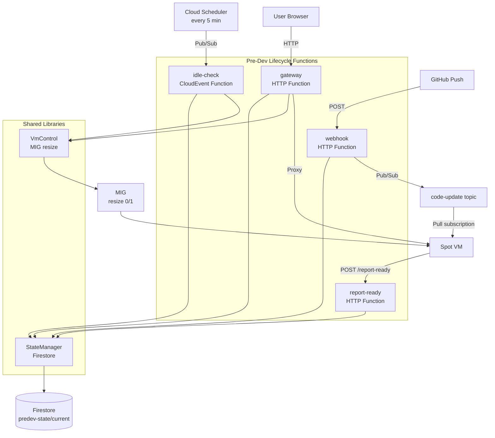
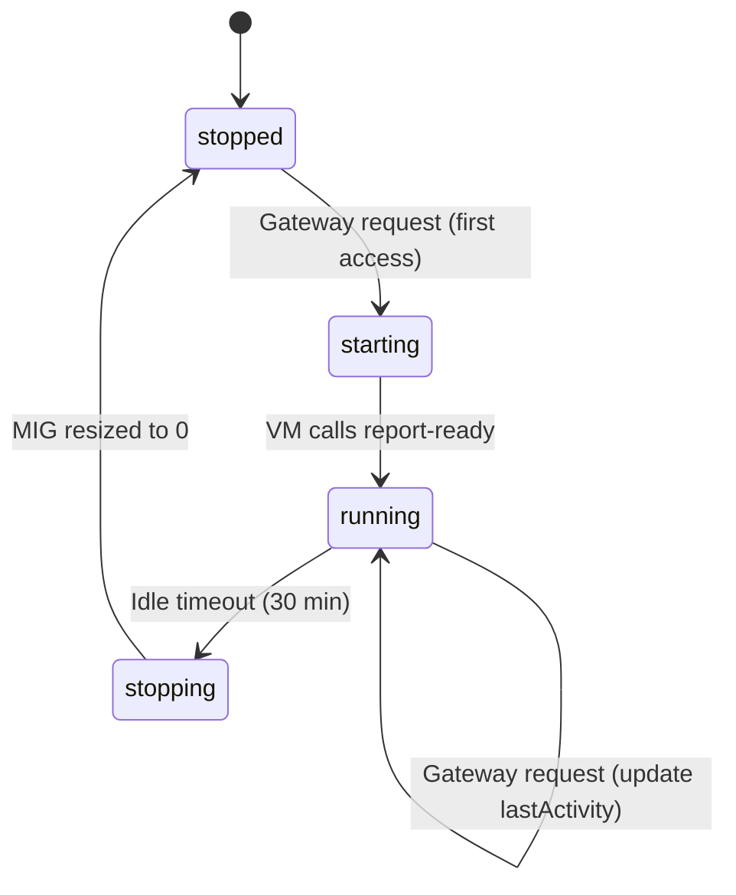

# Pre-Dev Lifecycle Worker - Technical Reference

## Overview

Predev-lifecycle is a multi-function Cloud Functions (Gen2) deployment that manages a scale-to-zero GCP Spot VM. It contains four Cloud Functions sharing a single codebase: gateway (HTTP proxy), webhook (GitHub push handler), idle-check (Pub/Sub-triggered shutdown timer), and report-ready (VM boot callback).

## Architecture



## Cloud Functions

### gateway

| Property      | Value                                        |
| ------------- | -------------------------------------------- |
| Type          | HTTP (`functions.http`)                      |
| Name          | `intexuraos-predev-gateway-{env}`            |
| Memory        | 512 MB                                       |
| CPU           | 1                                            |
| Timeout       | 3600 seconds (1 hour, for long SSE streams)  |
| Concurrency   | 200 requests per instance                    |
| Max instances | 1                                            |
| Auth          | Public (allUsers)                            |

**Routes handled internally:**

| Method | Path                    | Description                                      |
| ------ | ----------------------- | ------------------------------------------------ |
| GET    | `/devbar/logs`          | SSE proxy to VM port 8106 `/logs`                |
| GET    | `/devbar/events`        | SSE proxy to VM port 8105 `/events`              |
| GET    | `/internal/branch-lock` | Return current branch, commit, and lock status   |
| POST   | `/internal/branch-lock` | Set branch lock on or off                        |
| *      | `/*`                    | Proxy all other requests to the VM               |

**State machine behavior:**

| VM State   | Gateway Action                                                |
| ---------- | ------------------------------------------------------------- |
| `running`  | Proxy request to VM, update lastActivity                      |
| `stopped`  | Transition to `starting`, resize MIG to 1, show Starting page |
| `starting` | Show Starting page (VM still booting)                         |
| `null`     | Same as `stopped` (first-ever access)                         |

### webhook

| Property      | Value                                   |
| ------------- | --------------------------------------- |
| Type          | HTTP (`functions.http`)                 |
| Name          | `intexuraos-predev-webhook-{env}`       |
| Memory        | 512 MB                                  |
| Timeout       | 120 seconds                             |
| Max instances | 1                                       |
| Auth          | Public (allUsers, GitHub needs access)  |

**Request validation:**

1. Reject non-POST methods (405)
2. Verify `INTEXURAOS_GITHUB_WEBHOOK_SECRET` is configured (500 if missing)
3. Verify `x-hub-signature-256` header exists (401 if missing)
4. Compute HMAC-SHA256 of raw body and compare with timing-safe equality (401 if mismatch)
5. Ignore non-push events (200, "Ignored event")
6. Validate `ref` field exists in payload (400 if missing)

**Branch logic:**

| Condition                             | Action                                             |
| ------------------------------------- | -------------------------------------------------- |
| Branch locked, push from other branch | Ignore (200, "Branch locked")                      |
| VM running                            | Publish code-update Pub/Sub message                |
| Any push                              | Update Firestore state with branch, SHA, message   |

### idle-check

| Property      | Value                                        |
| ------------- | -------------------------------------------- |
| Type          | CloudEvent (`functions.cloudEvent`)          |
| Name          | `intexuraos-predev-idle-check-{env}`         |
| Memory        | 512 MB                                       |
| Timeout       | 120 seconds                                  |
| Max instances | 1                                            |
| Trigger       | Pub/Sub topic `predev-idle-check-{env}`      |
| Schedule      | Every 5 minutes via Cloud Scheduler          |

**Logic:**

1. Read current state from Firestore
2. If VM is not running, skip (no-op)
3. Calculate idle minutes from `lastActivity`
4. If idle >= 30 minutes: set state to `stopping`, resize MIG to 0, set state to `stopped`
5. If idle < 30 minutes: log remaining time

### report-ready

| Property      | Value                                          |
| ------------- | ---------------------------------------------- |
| Type          | HTTP (`functions.http`)                        |
| Name          | `intexuraos-predev-report-ready-{env}`         |
| Memory        | 512 MB                                         |
| Timeout       | 30 seconds                                     |
| Max instances | 1                                              |

**Request:**

| Method | Path | Body                                            |
| ------ | ---- | ----------------------------------------------- |
| POST   | `/`  | `{ "ip": "10.x.x.x", "branch": "development" }` |

**Logic:** Validate IP and branch are present, then set Firestore state to `running` with the VM's IP address and branch.

## Domain Models

### PredevState (Firestore: `predev-state/current`)

| Field           | Type                                       | Description                        |
| --------------- | ------------------------------------------ | ---------------------------------- |
| `status`        | `'stopped' \                               | 'starting' \                       | 'running' \ | 'stopping'` | Current VM lifecycle state |
| `vmIp`          | `string \                                  | null`                              | VM's internal IP when running |
| `branch`        | `string`                                   | Active git branch                  |
| `commitSha`     | `string \                                  | null`                              | Latest commit SHA |
| `commitMessage` | `string \                                  | null`                              | First line of latest commit |
| `branchLocked`  | `boolean`                                  | Whether branch switching is locked |
| `lastActivity`  | `Date`                                     | Timestamp of last gateway request  |
| `startedAt`     | `Date \                                    | null`                              | When the VM was last started |

### State Transitions



### VmControl

Controls the MIG (Managed Instance Group) via the GCP Compute API:

| Method         | Action                         |
| -------------- | ------------------------------ |
| `startVm()`    | Resize MIG to 1 instance       |
| `stopVm()`     | Resize MIG to 0 instances      |
| `getVmCount()` | Read current MIG target size   |

### CodeUpdateMessage (Pub/Sub)

| Field        | Type   | Description                    |
| ------------ | ------ | ------------------------------ |
| `branch`     | string | Branch that was pushed to      |
| `commitSha`  | string | Commit SHA of the push         |
| `timestamp`  | string | ISO 8601 timestamp             |

## Dependencies

| Service/Resource           | Purpose                                    |
| -------------------------- | ------------------------------------------ |
| Firestore                  | State persistence (`predev-state/current`) |
| GCP Compute API            | MIG resize (start/stop VM)                 |
| GCP Pub/Sub                | Idle-check trigger, code-update messages   |
| GitHub Webhooks            | Push event notifications                   |
| Cloud Scheduler            | Periodic idle-check trigger                |

## Configuration

| Environment Variable                   | Required | Default         | Used By      |
| -------------------------------------- | -------- | --------------- | ------------ |
| `INTEXURAOS_GCP_PROJECT_ID`            | Yes      | -               | All          |
| `INTEXURAOS_GCP_REGION`                | No       | `''`            | VmControl    |
| `INTEXURAOS_GCP_ZONE`                  | Yes      | -               | VmControl    |
| `INTEXURAOS_MIG_NAME`                  | Yes      | -               | VmControl    |
| `INTEXURAOS_ENVIRONMENT`               | No       | `'dev'`         | Config       |
| `INTEXURAOS_INTERNAL_AUTH_TOKEN`       | Yes      | -               | Gateway      |
| `INTEXURAOS_GITHUB_WEBHOOK_SECRET`     | Yes      | -               | Webhook      |
| `INTEXURAOS_PREDEV_CODE_UPDATE_TOPIC`  | Yes      | -               | Webhook      |
| `IDLE_TIMEOUT_MINUTES`                 | No       | `30`            | Idle-check   |
| `LOG_LEVEL`                            | No       | `info`          | All          |

## Security

**Webhook signature verification:** Uses HMAC-SHA256 with `crypto.timingSafeEqual` to prevent timing attacks. The secret is stored in Secret Manager.

**Gateway authentication:** The gateway is publicly accessible. It does not authenticate requests. The VM itself may enforce authentication if the application requires it.

**Internal auth:** The gateway stores `INTEXURAOS_INTERNAL_AUTH_TOKEN` but uses it for future internal-to-internal calls, not for request validation at the gateway level.

## Gotchas

**Single Firestore document** - All state lives in `predev-state/current`. The `setStartingIfStopped()` method uses a Firestore transaction to prevent race conditions when multiple gateway requests arrive simultaneously for a stopped VM.

**MIG resize is idempotent** - Calling `startVm()` when the MIG already has 1 instance is safe. The gateway calls it regardless of whether the state update succeeded.

**SSE timeout** - The gateway's 3600-second timeout accommodates long-lived SSE connections for the DevBar. Standard proxied requests complete much faster.

**eslint-disable directives** - The gateway file disables several ESLint rules due to the Express-like request/response types from Cloud Functions Framework, which lack strong typing.

## File Structure

```
workers/predev-lifecycle/src/
  index.ts                    - Re-exports all 4 Cloud Functions
  functions/
    gateway.ts                - HTTP proxy, Starting page, branch-lock API
    webhook.ts                - GitHub push handler with HMAC verification
    idle-check.ts             - Pub/Sub-triggered idle shutdown
    report-ready.ts           - VM boot callback
  lib/
    config.ts                 - Environment variable config object
    logger.ts                 - Pino logger factory
    serializeError.ts         - Local error serializer (no common-core dep)
    state.ts                  - StateManager class (Firestore CRUD)
    vm-control.ts             - VmControl class (MIG resize via Compute API)
  __tests__/
    gateway.test.ts
    webhook.test.ts
    idle-check.test.ts
    report-ready.test.ts
    state.test.ts
    vm-control.test.ts
```
