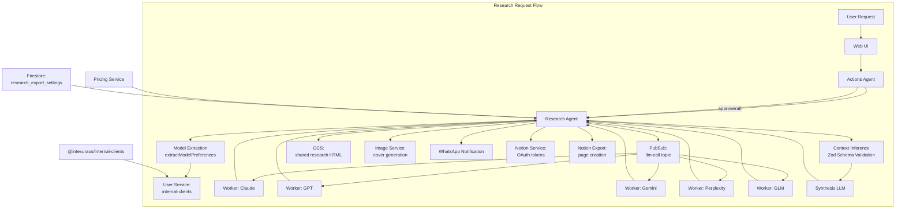
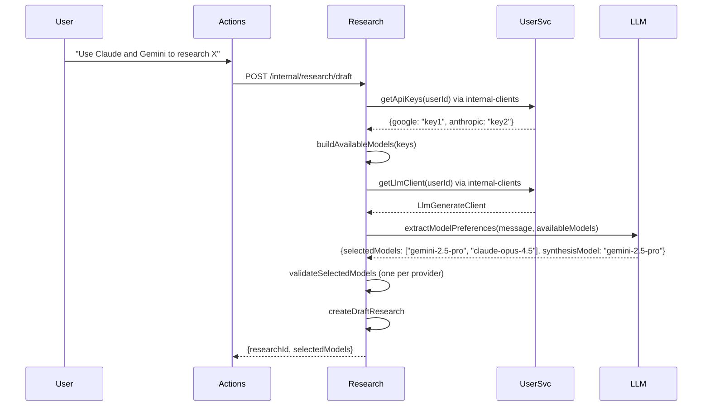
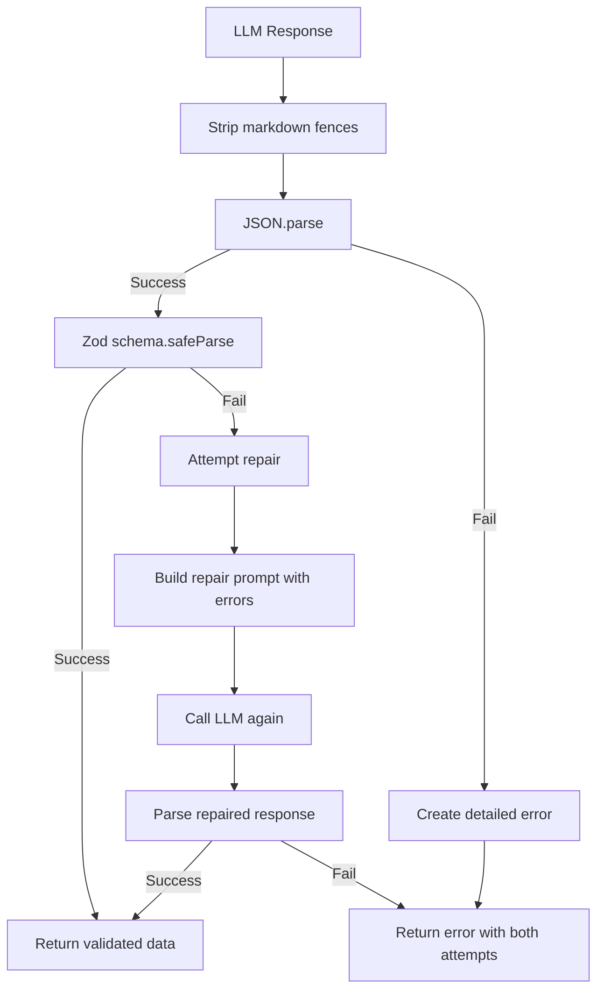
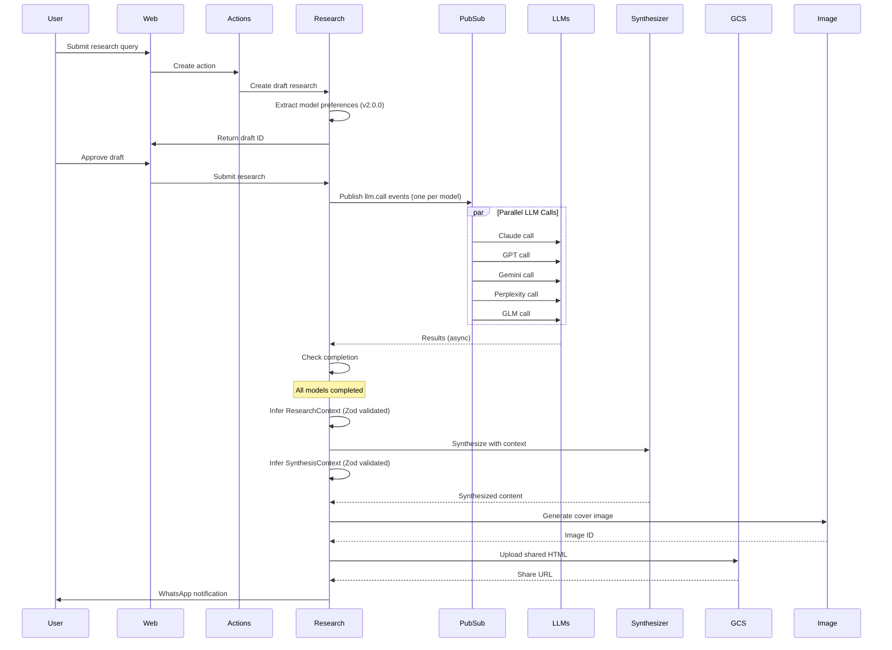

# Research Agent - Technical Reference

## Overview

Research-agent orchestrates AI research across multiple LLM providers (Claude, GPT, Gemini, Perplexity, GLM). It queries models in parallel via Pub/Sub, tracks costs and attribution, synthesizes results, and manages public sharing with generated cover images. Version 2.4.0 adds Dash0 OpenTelemetry distributed tracing and dev-mode log formatting. Version 2.3.0 added platform API key fallbacks (Gemini primary, Zai secondary), switched internal fast operations to `gemini-2.0-flash`, standardized API key naming, and improved LLM prompt quality.

## Architecture



## Recent Changes (v2.4.0)

### Dash0 OpenTelemetry Integration

Distributed tracing, metrics, and log export via OTLP/HTTP to Dash0 added across all services including research-agent:

- New `packages/infra-otel` package loaded as Node `--import` preload in Dockerfile
- `OTEL_SERVICE_NAME=research-agent` baked into image at build time
- Instrumentation is transparent — no code changes in service logic
- No-op when `INTEXURAOS_DASH0_OTLP_ENDPOINT` is unset (local dev)

**Dockerfile changes:**

```dockerfile
# otel-register.js bundled alongside index.js during build
CMD ["node", "--import", "./otel-register.js", "./index.js"]
```

### Dev-Mode Log Formatting

`server.ts` now uses `createLogStream()` from `@intexuraos/http-server` for colorized, PM2-readable output in development:

```
research-agent | 10:30:00 | INFO | Research created | {id: "abc123"}
```

Production JSON logging unchanged.

## Recent Changes (v2.3.0)

### Platform API Key Fallbacks

`createUserServiceClient` now accepts two optional platform-owned API keys to provide LLM access for users without their own provider keys:

```typescript
createUserServiceClient({
  // ...
  platformZaiApiKey: process.env['INTEXURAOS_ZAI_APP_API_KEY'], // Zai secondary fallback
  platformGeminiApiKey: process.env['INTEXURAOS_GEMINI_APP_API_KEY'], // Gemini primary fallback
});
```

**Fallback resolution order (inside `getLlmClient`):**

1. User's own API key for the requested provider
2. Platform Gemini key → `gemini-2.0-flash` (if `platformGeminiApiKey` set)
3. Platform Zai key → `glm-4.7-flash` (if `platformZaiApiKey` set)
4. Error: `NO_API_KEY`

### Fast Model Switch: Gemini 2.0 Flash

Title generation and context inference now use `LlmModels.Gemini20Flash` (`gemini-2.0-flash`):

```typescript
// REQUIRED_MODELS in index.ts
const REQUIRED_MODELS: (ResearchModel | FastModel)[] = [
  // ... research models ...
  LlmModels.Gemini20Flash, // Fast model for title generation + context inference
];
```

**Why:** `glm-4.7-flash` was taking 29s for title generation, exceeding the 10s HTTP timeout. `gemini-2.0-flash` is measurably faster and available via the platform Gemini key.

### API Key Naming Convention

All platform-owned API keys follow `INTEXURAOS_<PROVIDER>_APP_API_KEY`:

| Old Variable                   | New Variable                 |
| ------------------------------ | ---------------------------- |
| `INTEXURAOS_GUEST_ZAI_API_KEY` | `INTEXURAOS_ZAI_APP_API_KEY` |
| `INTEXURAOS_ZAI_API_KEY`       | `INTEXURAOS_ZAI_APP_API_KEY` |

### LLM Prompt Improvements

`ContextInferenceAdapter.repairSynthesisContext()` now passes `originalPrompt` directly to `buildSynthesisContextRepairPrompt`:

```typescript
// Before (v2.2.0):
buildSynthesisContextRepairPrompt(
  { originalPrompt: params.originalPrompt, reports: params.reports ?? [], ... },
  invalidResponse, errorMessage
)

// After (v2.3.0):
buildSynthesisContextRepairPrompt(params.originalPrompt, invalidResponse, errorMessage)
```

This matches the simplified API in `@intexuraos/llm-prompts` after the 27-prompt adversarial audit.

### Previous Changes (v2.2.0)

See v2.2.0 section below for Notion Export Integration, Research Export Settings, and Auth0 Namespaced Claims.

## Recent Changes (v2.2.0)

### Notion Export Integration

Completed research is automatically exported to Notion as a hierarchical page structure after synthesis completes. Users can also trigger manual export via the API.

**Automatic export (fire-and-forget):**

After synthesis and database save, `runSynthesis` dynamically imports `exportResearchToNotionUseCase` and calls it in a non-blocking `void` promise. This ensures the Notion export reads the updated `shareInfo` with `coverImageUrl`.

**Manual export:**

```typescript
POST /research/:id/export-notion
// Validates: completed status, synthesis exists, not already exported, Notion connected, page configured
```

**Page structure:**

- Main Research Page (child of user's configured target page)
  - Cover image block (if `shareInfo.coverImageUrl` exists)
  - "Synthesis" heading + synthesized content as Notion blocks
  - "Sources" heading
- LLM Report Pages (children of main page, one per completed model)
  - "Response" heading + LLM result as Notion blocks
  - "Sources" heading with linked URLs (if available)

**Markdown-to-Notion conversion:**

The `markdownToNotionBlocks` converter handles: headings (h1-h3), paragraphs, bulleted and numbered lists, code blocks with language, blockquotes, horizontal rules, tables, and inline formatting (bold, italic, code, links).

Blocks exceeding Notion's 100-block API limit are appended in batches via `appendBlocksInBatches`.

### Research Export Settings

New Firestore-backed settings for per-user Notion export configuration:

```typescript
// Collection: research_export_settings (keyed by userId)
interface ResearchExportSettings {
  researchPageId: string; // Target Notion page ID
  researchPageTitle: string; // Cached page title
  researchPageUrl: string; // Cached page URL
  createdAt: string;
  updatedAt: string;
}
```

Settings endpoints validate page IDs (32 hex or UUID format) and fetch page previews via notion-service before saving.

### Auth0 Namespaced Claims

`extractGeneratedByInfo` now reads Auth0 claims under `https://intexuraos.cloud/` namespace first (set by Auth0 Actions for API audiences), falling back to bare `name`/`email` claims for ID token compatibility.

### Previous Changes (v2.1.0)

See v2.1.0 section below for INT-269 (Internal Clients Migration) and INT-218 (Input Validation Zod Migration).

## Model Extraction Flow (v2.0.0)



## Zod Schema Validation (v2.0.0)

### Parser + Repair Pattern

The `ContextInferenceAdapter` implements a resilient parsing strategy:



### ResearchContext Schema

```typescript
const ResearchContextSchema = z.object({
  language: z.string(),
  domain: DomainSchema, // 'technical' | 'legal' | 'medical' | ...
  mode: ModeSchema, // 'compact' | 'standard' | 'audit'
  intent_summary: z.string(),
  defaults_applied: z.array(DefaultAppliedSchema),
  assumptions: z.array(z.string()),
  answer_style: z.array(AnswerStyleSchema), // 'practical' | 'evidence_first' | ...
  time_scope: TimeScopeSchema,
  locale_scope: LocaleScopeSchema,
  research_plan: ResearchPlanSchema,
  output_format: OutputFormatSchema,
  safety: SafetyInfoSchema,
  red_flags: z.array(z.string()),
});
```

### SynthesisContext Schema

```typescript
const SynthesisContextSchema = z.object({
  language: z.string(),
  domain: DomainSchema,
  mode: ModeSchema,
  synthesis_goals: z.array(SynthesisGoalSchema), // 'merge' | 'dedupe' | 'conflict_audit' | ...
  missing_sections: z.array(z.string()),
  detected_conflicts: z.array(DetectedConflictSchema),
  source_preference: SourcePreferenceSchema,
  defaults_applied: z.array(DefaultAppliedSchema),
  assumptions: z.array(z.string()),
  output_format: SynthesisOutputFormatSchema,
  safety: SafetyInfoSchema,
  red_flags: z.array(z.string()),
});
```

## Data Flow



## API Endpoints

### Public Endpoints

| Method | Path                                 | Description                             | Auth         |
| ------ | ------------------------------------ | --------------------------------------- | ------------ |
| POST   | `/research`                          | Create new research (starts processing) | Bearer token |
| POST   | `/research/draft`                    | Save as draft (v2.0.0)                  | Bearer token |
| GET    | `/research`                          | List researches for user                | Bearer token |
| GET    | `/research/:id`                      | Get research by ID                      | Bearer token |
| DELETE | `/research/:id`                      | Delete research and unshare             | Bearer token |
| POST   | `/research/:id/approve`              | Approve draft research                  | Bearer token |
| POST   | `/research/:id/enhance`              | Enhance with more models/context        | Bearer token |
| POST   | `/research/:id/retry`                | Retry failed LLM calls                  | Bearer token |
| POST   | `/research/:id/confirm`              | Confirm partial failure decision        | Bearer token |
| POST   | `/research/:id/export-notion`        | Manually export to Notion (v2.2.0)      | Bearer token |
| DELETE | `/research/:id/share`                | Remove public sharing                   | Bearer token |
| PATCH  | `/research/:id/favourite`            | Toggle favourite status                 | Bearer token |
| POST   | `/research/validate-input`           | Validate input quality                  | Bearer token |
| POST   | `/research/improve-input`            | Improve research prompt                 | Bearer token |
| PATCH  | `/research/:id`                      | Update draft research                   | Bearer token |
| GET    | `/research/settings/notion`          | Get Notion export settings (v2.2.0)     | Bearer token |
| POST   | `/research/settings/notion`          | Save Notion export settings (v2.2.0)    | Bearer token |
| POST   | `/research/settings/notion/validate` | Validate Notion page ID (v2.2.0)        | Bearer token |

### Internal Endpoints

| Method | Path                                    | Description                           | Auth            |
| ------ | --------------------------------------- | ------------------------------------- | --------------- |
| POST   | `/internal/research/draft`              | Create draft research with extraction | Internal header |
| POST   | `/internal/llm/pubsub/process-research` | Process research from Pub/Sub         | Pub/Sub OIDC    |
| POST   | `/internal/llm/pubsub/process-llm-call` | Process individual LLM call           | Pub/Sub OIDC    |
| POST   | `/internal/llm/pubsub/report-analytics` | Report LLM analytics                  | Pub/Sub OIDC    |

## Domain Models

### Research

| Field               | Type              | Description                          |
| ------------------- | ----------------- | ------------------------------------ |
| `id`                | string (UUID)     | Unique research identifier           |
| `userId`            | string            | User who owns the research           |
| `title`             | string            | AI-generated title (empty initially) |
| `prompt`            | string            | Original user query                  |
| `originalPrompt`    | string            | Pre-improvement prompt (if improved) |
| `selectedModels`    | ResearchModel[]   | Models to query                      |
| `synthesisModel`    | ResearchModel     | Model for synthesis                  |
| `status`            | ResearchStatus    | Current state                        |
| `llmResults`        | LlmResult[]       | Results from each model              |
| `inputContexts`     | InputContext[]    | User-provided context                |
| `synthesizedResult` | string            | Final synthesized content            |
| `synthesisError`    | string            | Synthesis failure message            |
| `partialFailure`    | PartialFailure    | Partial failure metadata             |
| `startedAt`         | string (ISO 8601) | Start timestamp                      |
| `completedAt`       | string            | Completion timestamp                 |
| `totalDurationMs`   | number            | Total processing time                |
| `totalInputTokens`  | number            | Sum of input tokens                  |
| `totalOutputTokens` | number            | Sum of output tokens                 |
| `totalCostUsd`      | number            | Total cost                           |
| `sourceActionId`    | string            | Originating action ID                |
| `skipSynthesis`     | boolean           | Skip synthesis (raw results only)    |
| `researchContext`   | ResearchContext   | Inferred context metadata            |
| `shareInfo`         | ShareInfo         | Public sharing details               |
| `sourceResearchId`  | string            | Enhanced from this ID                |
| `attributionStatus` | AttributionStatus | Source attribution state             |
| `auxiliaryCostUsd`  | number            | Non-LLM costs (images, etc)          |
| `sourceLlmCostUsd`  | number            | Cost from source research            |
| `favourite`         | boolean           | User favorited                       |
| `userName`          | string            | User's name for "Generated by"       |
| `userEmail`         | string            | User's email for "Generated by"      |
| `notionExportInfo`  | NotionExportInfo  | Notion export details (v2.2.0)       |

### ResearchStatus Enum

| Value                   | Description                             |
| ----------------------- | --------------------------------------- |
| `draft`                 | Awaiting user approval                  |
| `pending`               | Approved, awaiting processing           |
| `processing`            | LLMs are being queried                  |
| `awaiting_confirmation` | Partial failure, awaiting user decision |
| `retrying`              | Retrying failed LLMs                    |
| `synthesizing`          | Combining results                       |
| `completed`             | Successfully completed                  |
| `failed`                | All LLMs failed                         |

### LlmResult

| Field              | Type            | Description                             |
| ------------------ | --------------- | --------------------------------------- |
| `provider`         | LlmProvider     | claude, openai, google, perplexity, zai |
| `model`            | string          | Model name                              |
| `status`           | LlmResultStatus | pending, processing, completed, failed  |
| `result`           | string          | LLM response content                    |
| `error`            | string          | Error message if failed                 |
| `sources`          | string[]        | Source citations (if provided)          |
| `startedAt`        | string          | Start timestamp                         |
| `completedAt`      | string          | End timestamp                           |
| `durationMs`       | number          | Processing duration                     |
| `inputTokens`      | number          | Tokens consumed                         |
| `outputTokens`     | number          | Tokens generated                        |
| `costUsd`          | number          | Cost of this call                       |
| `copiedFromSource` | boolean         | Copied from enhanced source research    |

### ShareInfo (updated v2.2.0)

| Field           | Type   | Description                     |
| --------------- | ------ | ------------------------------- |
| `shareToken`    | string | HMAC-based share token          |
| `slug`          | string | URL-friendly slug               |
| `shareUrl`      | string | Full shareable URL              |
| `sharedAt`      | string | Share timestamp                 |
| `gcsPath`       | string | GCS storage path                |
| `coverImageId`  | string | Cover image identifier          |
| `coverImageUrl` | string | Full-size cover image URL (NEW) |

### NotionExportInfo (v2.2.0)

| Field              | Type                                  | Description                  |
| ------------------ | ------------------------------------- | ---------------------------- |
| `mainPageId`       | string                                | Notion main research page ID |
| `mainPageUrl`      | string                                | Notion main page URL         |
| `llmReportPageIds` | `{ model: string; pageId: string }[]` | LLM report child page IDs    |
| `exportedAt`       | string (ISO 8601)                     | Export timestamp             |

### ResearchExportSettings (v2.2.0)

| Field               | Type              | Description           |
| ------------------- | ----------------- | --------------------- |
| `researchPageId`    | string            | Target Notion page ID |
| `researchPageTitle` | string            | Cached page title     |
| `researchPageUrl`   | string            | Cached page URL       |
| `createdAt`         | string (ISO 8601) | Creation timestamp    |
| `updatedAt`         | string (ISO 8601) | Last update timestamp |

## Model Filtering Logic (v2.0.0)

The `extractModelPreferences` use case filters models based on:

1. **API Key Availability** - Only models for which the user has configured API keys
2. **One Per Provider** - Maximum one model from each provider (first match wins)
3. **Synthesis Eligibility** - Synthesis model must be in `SYNTHESIS_MODELS` list

```typescript
// Available research models
const RESEARCH_MODELS: ResearchModel[] = [
  'gemini-2.5-pro',
  'gemini-2.5-flash',
  'claude-opus-4.5',
  'claude-sonnet-4.5',
  'o4-mini-deep-research',
  'gpt-5.2',
  'sonar',
  'sonar-pro',
  'sonar-deep-research',
  'glm-4.7',
  'glm-4.7-flash',
];
```

## Pub/Sub Events

### Published

| Event Type         | Topic               | Purpose                          |
| ------------------ | ------------------- | -------------------------------- |
| `research.process` | `llm-process-queue` | Trigger research processing      |
| `llm.call`         | `llm-call-queue`    | Execute individual LLM call      |
| `llm.report`       | `llm-analytics`     | Report LLM success for analytics |

### Subscribed

| Subscription        | Handler                                 |
| ------------------- | --------------------------------------- |
| `llm-process-queue` | `/internal/llm/pubsub/process-research` |
| `llm-call-queue`    | `/internal/llm/pubsub/process-llm-call` |
| `llm-analytics`     | `/internal/llm/pubsub/report-analytics` |

## Dependencies

### Internal Services (v2.2.0)

| Service          | Purpose                                                            |
| ---------------- | ------------------------------------------------------------------ |
| `user-service`   | API keys, LLM usage, LLM client via `@intexuraos/internal-clients` |
| `image-service`  | Cover image generation                                             |
| `notion-service` | Notion OAuth tokens and page previews (NEW in v2.2.0)              |

### Infrastructure

| Component                                         | Purpose                              |
| ------------------------------------------------- | ------------------------------------ |
| Firestore (`researches` collection)               | Research persistence                 |
| `app-settings-service` (HTTP)                     | LLM pricing configuration            |
| Firestore (`llm_api_logs` collection)             | API call audit                       |
| Firestore (`research_export_settings` collection) | Notion export configuration (v2.2.0) |
| Pub/Sub (`llm-call-queue`)                        | LLM call distribution                |
| Pub/Sub (`llm-process-queue`)                     | Research processing trigger          |
| Pub/Sub (`whatsapp-send`)                         | Notification delivery                |
| GCS                                               | Shared research HTML storage         |

### LLM Providers

| Provider   | Models                                                                     |
| ---------- | -------------------------------------------------------------------------- |
| Anthropic  | `claude-opus-4.5`, `claude-sonnet-4.5`                                     |
| OpenAI     | `gpt-5.2`, `o4-mini-deep-research`                                         |
| Google     | `gemini-2.5-pro`, `gemini-2.5-flash` (research); `gemini-2.0-flash` (fast) |
| Perplexity | `sonar`, `sonar-pro`, `sonar-deep-research`                                |
| Zai        | `glm-4.7`, `glm-4.7-flash`                                                 |

**Fast model** (`gemini-2.0-flash`): Used for title generation and context inference via the platform Gemini key. Not available as a user-selectable research model.

### Shared Packages (v2.4.0)

| Package                        | Purpose                                                     |
| ------------------------------ | ----------------------------------------------------------- |
| `@intexuraos/internal-clients` | User service client (NEW in v2.1.0)                         |
| `@intexuraos/infra-notion`     | Notion client and error mapping (NEW in v2.2.0)             |
| `@intexuraos/infra-otel`       | Dash0 OpenTelemetry preload instrumentation (NEW in v2.4.0) |
| `@intexuraos/infra-sentry`     | Sentry-enabled logger factory                               |
| `@intexuraos/llm-contract`     | Model types, provider mapping                               |
| `@intexuraos/llm-prompts`      | Zod schemas, prompt builders                                |
| `@intexuraos/llm-pricing`      | Pricing context interface                                   |
| `@intexuraos/llm-utils`        | Parse error formatting                                      |
| `@intexuraos/infra-gemini`     | Gemini client wrapper                                       |
| `@intexuraos/common-http`      | HTTP utilities, auth                                        |
| `@intexuraos/common-core`      | Result types, logging                                       |

## Configuration

| Environment Variable                       | Required | Description                                                       |
| ------------------------------------------ | -------- | ----------------------------------------------------------------- |
| `INTEXURAOS_USER_SERVICE_URL`              | Yes      | User-service base URL                                             |
| `INTEXURAOS_IMAGE_SERVICE_URL`             | Yes      | Image-service base URL                                            |
| `INTEXURAOS_NOTION_SERVICE_URL`            | Yes      | Notion-service base URL (v2.2.0)                                  |
| `INTEXURAOS_INTERNAL_AUTH_TOKEN`           | Yes      | Shared secret for service-to-service                              |
| `INTEXURAOS_GCP_PROJECT_ID`                | Yes      | Google Cloud project ID                                           |
| `INTEXURAOS_PUBSUB_LLM_CALL_TOPIC`         | Yes      | LLM call queue topic                                              |
| `INTEXURAOS_PUBSUB_RESEARCH_PROCESS_TOPIC` | Yes      | Research process queue topic                                      |
| `INTEXURAOS_PUBSUB_WHATSAPP_SEND_TOPIC`    | Yes      | WhatsApp send topic                                               |
| `INTEXURAOS_WEB_APP_URL`                   | Yes      | Web app URL for notifications                                     |
| `INTEXURAOS_SHARED_CONTENT_BUCKET`         | Yes      | GCS bucket for shared research                                    |
| `INTEXURAOS_SHARE_BASE_URL`                | Yes      | Base URL for shared research                                      |
| `INTEXURAOS_IMAGE_PUBLIC_BASE_URL`         | Yes      | Public base URL for images                                        |
| `INTEXURAOS_GEMINI_APP_API_KEY`            | No       | Platform Gemini key; enables `gemini-2.0-flash` fallback (v2.3.0) |
| `INTEXURAOS_ZAI_APP_API_KEY`               | No       | Platform Zai key; enables `glm-4.7-flash` fallback (v2.3.0)       |
| `INTEXURAOS_DASH0_OTLP_ENDPOINT`           | No       | Dash0 OTLP endpoint; enables distributed tracing (v2.4.0)         |

## Gotchas

**Platform API key fallbacks (v2.3.0)**: When a user has no API key for their preferred model's provider, `getLlmClient` in `@intexuraos/internal-clients` tries platform keys in order: Gemini (`gemini-2.0-flash`) → Zai (`glm-4.7-flash`). Both platform keys are optional. If neither is set, the service returns `NO_API_KEY` error as before.

**Idempotent LLM calls**: The `process-llm-call` endpoint checks if an LLM result is already `completed` or `failed` and skips processing if so. This enables safe retry without duplication.

**Partial failure handling**: When some LLMs fail, research enters `awaiting_confirmation` status. User can choose to proceed with completed results, retry failed models, or cancel.

**Context window limits**: Input contexts are max 60k characters each, max 5 contexts. This prevents exceeding model context windows.

**Perplexity online search**: The Perplexity models (`sonar-*`) perform actual web search during inference, making them slower but more current.

**Share token generation**: Uses HMAC-based token generation for secure, unguessable share URLs.

**Attribution repair**: Synthesized content may have incomplete attribution. A repair process attempts to fix missing attribution lines before marking complete.

**Cost calculation**: Costs are calculated from pricing data fetched via `app-settings-service` HTTP. If pricing is missing, cost is not calculated but result is still saved.

**Image cleanup**: When research is unshared, the cover image is deleted via call to image-service's internal endpoint.

**Draft research flow**: Low-confidence actions create draft research that requires explicit approval before processing.

**Model extraction graceful degradation**: If model extraction fails (LLM error, no API keys), the draft is created with empty `selectedModels` array. User selects models manually in UI.

**Zod repair pattern**: When initial Zod validation fails, a repair prompt is sent to the LLM with the specific validation errors. If repair also fails, both error messages are combined for debugging.

**One model per provider**: The `validateSelectedModels` function enforces maximum one model per provider to prevent duplicate costs and conflicting results.

**Internal-clients flat exports**: The `@intexuraos/internal-clients` package uses flat exports (not subpath exports) to enable proper esbuild bundling for Docker deployment.

**Notion export ordering**: The fire-and-forget Notion export in `runSynthesis` must happen AFTER the database save so the export can read the updated `shareInfo` with `coverImageUrl`. Previously this caused a race condition where cover images were missing.

**Notion 100-block limit**: The Notion API limits `pages.create` to 100 children blocks. The exporter uses `appendBlocksInBatches` to handle larger exports by appending in batches of 100.

**Notion export deduplication**: Both automatic and manual export check `research.notionExportInfo` before exporting. If already set, the export is skipped to prevent duplicate pages.

**Notion page ID normalization**: Page IDs can be either 32 hex characters or UUID format with dashes. The validation endpoint normalizes by removing dashes before passing to notion-service.

**Auth0 namespaced claims**: Auth0 Actions add user claims under `https://intexuraos.cloud/` namespace for API audience tokens. The service tries namespaced keys first, then falls back to bare `name`/`email`.

## File Structure

```
apps/research-agent/src/
  domain/research/
    models/
      Research.ts                   # Core research entity and factories (NotionExportInfo added v2.2.0)
    config/
      synthesisPrompt.ts            # Synthesis prompt template
    ports/
      repository.ts                 # Research storage interface
      llmProvider.ts                # LLM adapter interface
      contextInference.ts           # Context inference interface
      modelExtraction.ts            # Model extraction types
      shareStorage.ts               # Shared HTML storage interface
      researchExportSettings.ts     # Export settings port interface (v2.2.0)
    services/
      contextLabels.ts              # Context labeling utilities
    usecases/
      extractModelPreferences.ts    # Model extraction from NL (v2.0.0)
      processResearch.ts            # Main orchestration
      submitResearch.ts             # Submit for processing
      enhanceResearch.ts            # Add models/context
      unshareResearch.ts            # Remove public share
      runSynthesis.ts               # Combine results + fire-and-forget Notion export (v2.2.0)
      retryFromFailed.ts            # Retry failed LLMs
      retryFailedLlms.ts            # Retry specific models
      checkLlmCompletion.ts         # Completion status check
      repairAttribution.ts          # Fix attribution issues
      toggleResearchFavourite.ts    # Toggle favourite status
    utils/
      htmlGenerator.ts              # Shared HTML generation
      slugify.ts                    # URL-friendly IDs
    formatLlmError.ts               # Error message formatting
  infra/
    llm/
      ClaudeAdapter.ts              # Claude API integration
      GptAdapter.ts                 # OpenAI API integration
      GeminiAdapter.ts              # Google API integration
      PerplexityAdapter.ts          # Perplexity API integration
      GlmAdapter.ts                 # GLM (Zai) API integration
      ContextInferenceAdapter.ts    # Zod-validated context inference (v2.0.0)
      InputValidationAdapter.ts     # Zod-validated input validation (v2.1.0)
      LlmAdapterFactory.ts          # Factory pattern
    research/
      FirestoreResearchRepository.ts  # Research persistence
    firestore/
      researchExportSettingsRepository.ts  # Notion export settings (v2.2.0)
    notion/
      index.ts                      # Notion client exports (v2.2.0)
      notionServiceClient.ts        # HTTP client for notion-service (v2.2.0)
      notionResearchExporter.ts     # Exports research to Notion pages (v2.2.0)
      markdownToNotionBlocks.ts     # Markdown to Notion block converter (v2.2.0)
      exportResearchToNotionUseCase.ts  # Fire-and-forget export use case (v2.2.0)
    pricing/
      PricingClient.ts              # Fetch pricing from settings
    pubsub/
      researchEventPublisher.ts
      llmCallPublisher.ts
    gcs/
      shareStorageAdapter.ts        # Upload shared HTML
    image/
      imageServiceClient.ts         # Generate cover images
    notification/
      WhatsAppNotificationSender.ts
      NoopNotificationSender.ts
    user/
      index.ts                      # Re-exports from @intexuraos/internal-clients (v2.1.0)
  routes/
    internalRoutes.ts               # Service-to-service + Pub/Sub
    researchRoutes.ts               # User-facing endpoints + export-notion (v2.2.0)
    researchExportRoutes.ts         # Notion export settings endpoints (v2.2.0)
    helpers/
      completionHandlers.ts         # Post-LLM completion logic
      synthesisHelper.ts            # Synthesis setup
    schemas/
      common.ts                     # Shared schema components
      researchSchemas.ts            # Request/response schemas
      validationSchemas.ts          # Input validation schemas (v2.1.0)
  services.ts                       # DI container with factories (notionServiceClient, notionExporter added v2.2.0)
  server.ts                         # Fastify server setup (researchExportRoutes registered v2.2.0)
  index.ts                          # Entry point (INTEXURAOS_NOTION_SERVICE_URL added v2.2.0)
```
