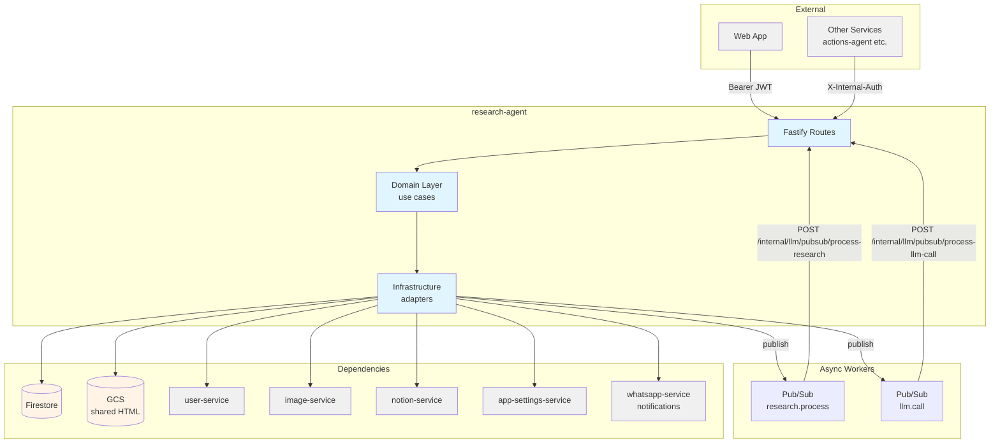
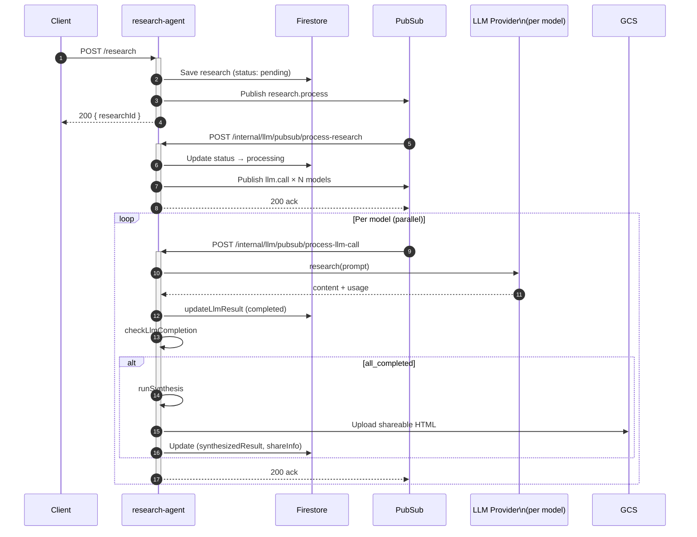

# Research Agent — Technical Reference

## Overview

Research-agent orchestrates parallel AI research across multiple LLM providers (Claude, GPT, Gemini, Perplexity). It fans out research prompts via Pub/Sub so each model call runs in its own Cloud Run instance, tracks token usage and cost per call, synthesizes results with source attribution, and auto-publishes shareable HTML to GCS. Runs on Cloud Run with auto-scaling.

## Architecture



## Data Flow



## Recent Changes

| Commit      | Description                                                                             | Date       |
| ----------- | --------------------------------------------------------------------------------------- | ---------- |
| `c4e3a13c`  | Release v3.3.0                                                                          | 2026-03-15 |
| `93aeac4a`  | Remove ZAI provider and GLM-4.7 models, finalize GLM-5                                  | 2026-03-12 |
| `e348b66e`  | Fix silent dispatch failures and nested transaction (INT-810, 811)                      | 2026-03-10 |
| `7237798d`  | Write tests for v8-ignore blocks                                                        | 2026-03-09 |
| `99febe66`  | Wire GitHub OAuth integration and update cross-service mocks                            | 2026-03-02 |
| `e6399f3b`  | Apply code review feedback for semantic checks                                          | 2026-02-28 |
| `a1a77b95`  | Add semantic checks to input improvement validator                                      | 2026-02-28 |
| `8fb906699` | Align thumbnail output contract with consumed parser fields (INT-605)                   | 2026-02-26 |
| `f451d51a`  | Audit and improve 27 prompts across all domains                                         | 2026-02-19 |
| `c72b7c53`  | Switch default LLM to Gemini 2.5 Flash, add Gemini fallback, increase title gen timeout | 2026-02-13 |

## API Endpoints

### Public Endpoints (Bearer JWT required)

| Method   | Path                                   | Purpose                                       |
| -------- | -------------------------------------- | --------------------------------------------- |
| `POST`   | `/research`                            | Submit new research for immediate processing  |
| `POST`   | `/research/draft`                      | Save research as draft (requires approval)    |
| `GET`    | `/research`                            | List authenticated user's researches          |
| `GET`    | `/research/:id`                        | Get single research by ID                     |
| `POST`   | `/research/:id/approve`                | Approve draft research and trigger processing |
| `POST`   | `/research/:id/confirm`                | Confirm partial failure decision              |
| `POST`   | `/research/:id/retry`                  | Retry research from failed status             |
| `POST`   | `/research/:id/enhance`                | Create enhanced research from a completed one |
| `POST`   | `/research/:id/export-notion`          | Manually trigger Notion export                |
| `DELETE` | `/research/:id`                        | Delete research                               |
| `DELETE` | `/research/:id/share`                  | Remove public share access (unshare)          |
| `PATCH`  | `/research/:id/favourite`              | Toggle favourite status                       |
| `GET`    | `/research/settings/notion`            | Get Notion export page configuration          |
| `POST`   | `/research/settings/notion`            | Save Notion export page configuration         |
| `POST`   | `/research/settings/notion/validate`   | Validate a Notion page ID before saving       |

### Internal Endpoints (X-Internal-Auth or Pub/Sub OIDC)

| Method | Path                                         | Purpose                                       | Caller               |
| ------ | -------------------------------------------- | --------------------------------------------- | -------------------- |
| `POST` | `/internal/research/draft`                   | Create draft research from another service    | actions-agent        |
| `POST` | `/internal/llm/pubsub/process-research`      | Receive `research.process` event from Pub/Sub | Cloud Pub/Sub        |
| `POST` | `/internal/llm/pubsub/process-llm-call`      | Receive `llm.call` event — execute one model  | Cloud Pub/Sub        |
| `POST` | `/internal/llm/pubsub/report-analytics`      | Receive `llm.report` analytics event          | Cloud Pub/Sub        |

## Domain Model

### Research

| Field                | Type                    | Description                                                  |
| -------------------- | ----------------------- | ------------------------------------------------------------ |
| `id`                 | `string`                | Unique identifier                                            |
| `userId`             | `string`                | Owning user                                                  |
| `title`              | `string`                | Auto-generated title (via Gemini 2.5 Flash)                  |
| `prompt`             | `string`                | Research question submitted by user                          |
| `originalPrompt`     | `string?`               | User's raw prompt before improvement (if accepted)           |
| `selectedModels`     | `ResearchModel[]`       | Models dispatched for research                               |
| `synthesisModel`     | `ResearchModel`         | Model used for synthesis step                                |
| `status`             | `ResearchStatus`        | Current lifecycle state                                      |
| `llmResults`         | `LlmResult[]`           | Per-model result records                                     |
| `inputContexts`      | `InputContext[]?`       | User-provided context documents (max 5, max 60k chars each)  |
| `synthesizedResult`  | `string?`               | Final synthesized markdown output                            |
| `synthesisError`     | `string?`               | Error message if synthesis failed                            |
| `partialFailure`     | `PartialFailure?`       | Partial failure state awaiting user decision                 |
| `shareInfo`          | `ShareInfo?`            | Public share URL and GCS metadata                            |
| `notionExportInfo`   | `NotionExportInfo?`     | Notion page IDs after export                                 |
| `attributionStatus`  | `AttributionStatus?`    | Source attribution validation result                         |
| `totalCostUsd`       | `number?`               | Aggregate cost across all LLM calls                          |
| `sourceResearchId`   | `string?`               | ID of source research (enhanced research only)               |
| `favourite`          | `boolean`               | User-starred flag                                            |

**ResearchStatus values:**

| Status                  | Meaning                                                 |
| ----------------------- | ------------------------------------------------------- |
| `draft`                 | Created by another service, awaiting user approval      |
| `pending`               | Submitted, awaiting Pub/Sub processing                  |
| `processing`            | LLM calls being dispatched                              |
| `awaiting_confirmation` | Partial failure detected, waiting for user decision     |
| `retrying`              | User-triggered retry of failed LLM calls                |
| `synthesizing`          | All LLMs done, synthesis model running                  |
| `completed`             | Synthesis done, result available                        |
| `failed`                | Terminal failure (all models failed or synthesis error) |

### LlmResult

| Field              | Type              | Description                                    |
| ------------------ | ----------------- | ---------------------------------------------- |
| `provider`         | `LlmProvider`     | Provider (google, openai, anthropic…)          |
| `model`            | `string`          | Model name from llm-contract                   |
| `status`           | `LlmResultStatus` | `pending`, `processing`, `completed`, `failed` |
| `result`           | `string?`         | Raw markdown from the model                    |
| `sources`          | `string[]?`       | URLs cited by the model                        |
| `inputTokens`      | `number?`         | Input token count                              |
| `outputTokens`     | `number?`         | Output token count                             |
| `costUsd`          | `number?`         | Cost in USD                                    |
| `durationMs`       | `number?`         | Wall-clock time for this call                  |
| `copiedFromSource` | `boolean?`        | True when result reused from source research   |

### InputContext

| Field     | Type      | Description                              |
| --------- | --------- | ---------------------------------------- |
| `id`      | `string`  | `{researchId}-ctx-{index}`               |
| `content` | `string`  | Document text (max 60,000 chars)         |
| `label`   | `string?` | Human-readable label                     |
| `addedAt` | `string`  | ISO 8601 timestamp                       |

## Pub/Sub

### Published Topics

| Topic env var                              | Event type         | Payload fields                              | Trigger                               |
| ------------------------------------------ | ------------------ | ------------------------------------------- | ------------------------------------- |
| `INTEXURAOS_PUBSUB_RESEARCH_PROCESS_TOPIC` | `research.process` | `researchId`, `userId`, `triggeredBy`       | Research submitted or draft approved  |
| `INTEXURAOS_PUBSUB_LLM_CALL_TOPIC`         | `llm.call`         | `researchId`, `userId`, `model`, `prompt`   | One per model during process-research |
| `INTEXURAOS_PUBSUB_WHATSAPP_SEND_TOPIC`    | WhatsApp send      | (notification payload)                      | LLM failure or research completion    |

### Subscribed Topics (HTTP Push)

| Endpoint                                       | Event type         | Action                                    |
| ---------------------------------------------- | ------------------ | ----------------------------------------- |
| `POST /internal/llm/pubsub/process-research`   | `research.process` | Dispatch individual LLM calls             |
| `POST /internal/llm/pubsub/process-llm-call`   | `llm.call`         | Execute single LLM call, check completion |
| `POST /internal/llm/pubsub/report-analytics`   | `llm.report`       | Report LLM usage to user-service          |

## Dependencies

### Internal Services

| Service              | Endpoint pattern                       | Purpose                                          |
| -------------------- | -------------------------------------- | ------------------------------------------------ |
| user-service         | `/internal/user/api-keys`              | Fetch decrypted API keys per provider            |
| user-service         | `/internal/user/llm-client`            | Get LLM client for model preference extraction   |
| user-service         | `/internal/user/report-llm-success`    | Report successful LLM call for analytics         |
| app-settings-service | `/internal/pricing`                    | Fetch LLM pricing at startup                     |
| image-service        | `/internal/images/prompts/generate`    | Generate cover image prompt from synthesis       |
| image-service        | `/internal/images/generate`            | Generate cover image                             |
| notion-service       | via notionServiceClient                | Validate Notion page ID and export research      |
| whatsapp-service     | via Pub/Sub                            | Send LLM failure and completion notifications    |

### Firestore Collections (owned)

| Collection                   | Description                                          |
| ---------------------------- | ---------------------------------------------------- |
| `researches`                 | LLM research queries, responses, synthesized results |
| `research_export_settings`   | Notion target page configuration per user            |
| `llm_api_logs`               | LLM API call audit logs with token usage and cost    |

## Configuration

| Variable                                   | Purpose                                             | Required |
| ------------------------------------------ | --------------------------------------------------- | -------- |
| `INTEXURAOS_GCP_PROJECT_ID`                | GCP project for Firestore and Pub/Sub               | Yes      |
| `INTEXURAOS_AUTH_JWKS_URL`                 | Auth0 JWKS URL for JWT verification                 | Yes      |
| `INTEXURAOS_AUTH_ISSUER`                   | Auth0 issuer for JWT verification                   | Yes      |
| `INTEXURAOS_AUTH_AUDIENCE`                 | Auth0 audience for JWT verification                 | Yes      |
| `INTEXURAOS_USER_SERVICE_URL`              | Base URL of user-service                            | Yes      |
| `INTEXURAOS_INTERNAL_AUTH_TOKEN`           | Shared secret for X-Internal-Auth header            | Yes      |
| `INTEXURAOS_WEB_APP_URL`                   | Base URL of web app (used in share links)           | Yes      |
| `INTEXURAOS_APP_SETTINGS_SERVICE_URL`      | Base URL of app-settings-service for pricing fetch  | Yes      |
| `INTEXURAOS_NOTION_SERVICE_URL`            | Base URL of notion-service                          | Yes      |
| `INTEXURAOS_IMAGE_PUBLIC_BASE_URL`         | Public CDN base URL for generated images            | Yes      |
| `INTEXURAOS_IMAGE_SERVICE_URL`             | Base URL of image-service                           | Yes      |
| `INTEXURAOS_SHARE_BASE_URL`                | Base URL for public shareable HTML pages            | Yes      |
| `INTEXURAOS_SHARED_CONTENT_BUCKET`         | GCS bucket name for shareable HTML uploads          | Yes      |
| `INTEXURAOS_PUBSUB_WHATSAPP_SEND_TOPIC`    | Pub/Sub topic for WhatsApp notifications            | Yes      |
| `INTEXURAOS_PUBSUB_RESEARCH_PROCESS_TOPIC` | Pub/Sub topic for research process events           | Yes      |
| `INTEXURAOS_PUBSUB_LLM_CALL_TOPIC`         | Pub/Sub topic for individual LLM call events        | Yes      |
| `INTEXURAOS_SENTRY_DSN`                    | Sentry DSN (optional, monitoring)                   | No       |
| `INTEXURAOS_ENVIRONMENT`                   | Environment name for Sentry tagging                 | No       |

## LLM Models

Research Agent loads pricing at startup for all models it uses. Models are split by role:

**Research models** (dispatched per user selection):
- `Gemini25Pro`, `Gemini25Flash`
- `ClaudeOpus45`, `ClaudeSonnet45`
- `O4MiniDeepResearch`, `GPT52`
- `Sonar`, `SonarPro`, `SonarDeepResearch`

**Fast model** (title generation):
- `Gemini20Flash`

**Image models** (cover image generation, selected based on available keys):
- `Gemini25FlashImage` (Google key) — default
- `GPTImage1` (OpenAI key) — preferred when synthesis uses a GPT model

## Gotchas

- **Pub/Sub ack pattern:** All internal Pub/Sub endpoints always return `200 OK`. Errors are logged but never cause a 4xx/5xx response — otherwise Cloud Pub/Sub would redeliver indefinitely.
- **LLM call idempotency:** `process-llm-call` checks if the model result is already `completed` or `failed` before re-executing. Safe to redeliver.
- **Synthesis race guard:** `runSynthesis` checks for `synthesizing` or `completed` status before proceeding, preventing duplicate synthesis from concurrent Pub/Sub deliveries.
- **Enhanced research cost tracking:** When enhancing a completed research, completed LLM results are copied with `copiedFromSource: true`. Their costs are aggregated into `sourceLlmCostUsd` so `totalCostUsd` reflects only new work.
- **Notion export is fire-and-forget:** The export runs asynchronously after the database is saved. Failure does not affect the research's `completed` status.
- **Notion export timing:** The export must happen after the database save so it reads the updated `shareInfo.coverImageUrl`. An earlier race condition (export before save) was fixed.
- **Attribution repair:** If synthesis output fails attribution validation, the service automatically calls the synthesizer again to repair it. The repair's cost is tracked in `auxiliaryCostUsd`.
- **Context labels:** If no label is supplied for an input context, `generateContextLabels` assigns one via LLM inference during synthesis.

## File Structure

```
apps/research-agent/src/
├── domain/
│   └── research/
│       ├── config/          # Synthesis prompts, title prompt
│       ├── models/          # Research, LlmResult, InputContext types
│       ├── ports/           # Repository, LLM provider, notification interfaces
│       ├── services/        # contextLabels helper
│       └── usecases/        # checkLlmCompletion, deleteResearch, enhanceResearch,
│                            # getResearch, listResearches, processResearch,
│                            # repairAttribution, retryFailedLlms, retryFromFailed,
│                            # runSynthesis, submitResearch, toggleResearchFavourite,
│                            # unshareResearch
├── infra/
│   ├── firestore/           # researchExportSettingsRepository
│   ├── gcs/                 # shareStorageAdapter (GCS HTML upload)
│   ├── image/               # imageServiceClient
│   ├── llm/                 # ClaudeAdapter, GeminiAdapter, GptAdapter,
│   │                        # PerplexityAdapter, InputValidationAdapter
│   ├── notification/        # WhatsAppNotificationSender, NoopNotificationSender
│   ├── notion/              # notionResearchExporter, notionServiceClient
│   ├── pricing/             # PricingClient
│   ├── pubsub/              # analyticsEventPublisher, llmCallPublisher,
│   │                        # researchEventPublisher
│   └── research/            # FirestoreResearchRepository
├── routes/
│   ├── helpers/             # synthesisHelper, completionHandlers
│   ├── schemas/             # Fastify JSON schemas
│   ├── internalRoutes.ts    # /internal/* endpoints
│   ├── researchExportRoutes.ts  # /research/settings/notion endpoints
│   └── researchRoutes.ts    # All /research/* public endpoints
├── index.ts                 # Entry point, pricing load, env validation
├── server.ts                # Fastify server setup
└── services.ts              # Dependency injection container
```
