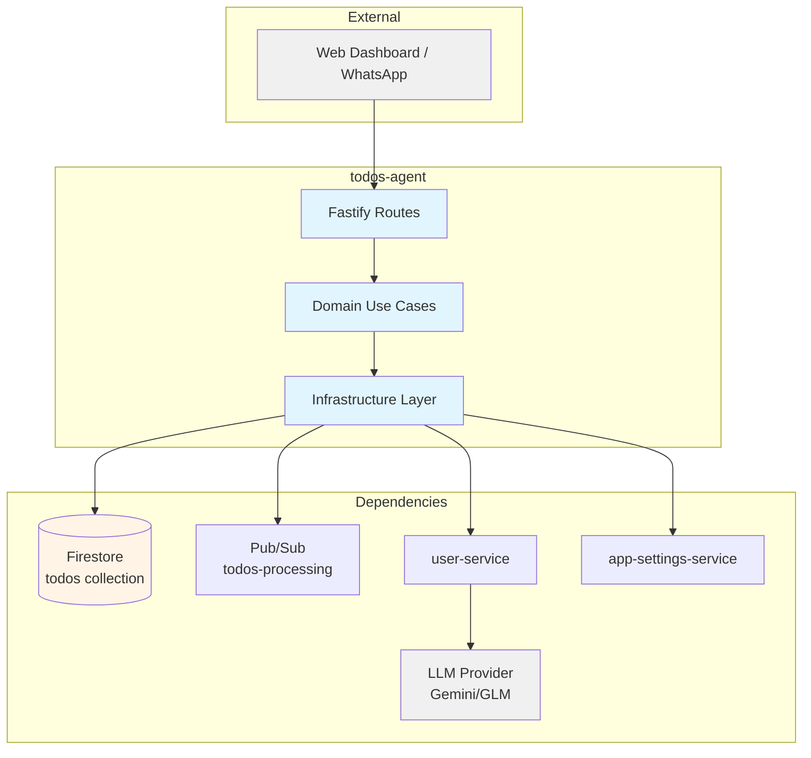
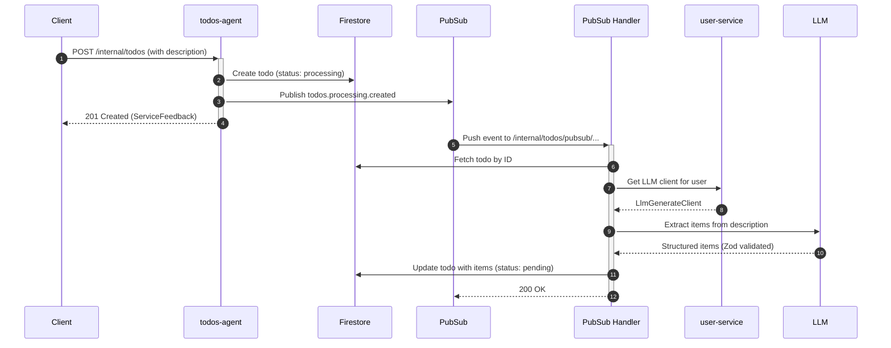
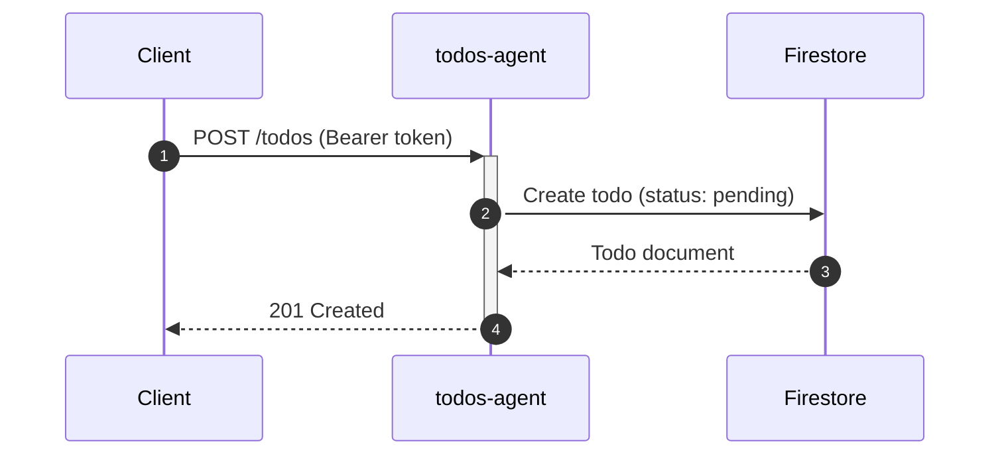

# Todos Agent — Technical Reference

## Overview

Todos-agent manages user-scoped tasks with support for todo items, priorities, due dates, tags, and AI-powered item extraction from natural language descriptions. Runs on Cloud Run with auto-scaling, uses Firestore for persistence, and integrates with user-service for LLM access.

## Architecture



## Data Flow

### Internal Todo Creation (AI Extraction)



### Public Todo CRUD



## Recent Changes

| Commit     | Description                                               | Date       |
| ---------- | --------------------------------------------------------- | ---------- |
| `44ea683a` | Release v3.2.0                                            | 2026-03-07 |
| `99febe66` | Wire GitHub OAuth integration, update cross-service mocks | 2026-03-02 |
| `b3f34d85` | Release v3.1.0                                            | 2026-02-22 |
| `c8a42105` | Release v3.0.0                                            | 2026-02-19 |
| `6063175b` | Add dev-mode log formatting for PM2 readability           | 2026-02-16 |
| `a52a6bbc` | Add Dash0 OpenTelemetry integration (#803)                | 2026-02-16 |
| `e60eafc1` | Standardize API key secrets to APP naming (#793)          | 2026-02-15 |
| `c72b7c53` | Switch default LLM to Gemini 2.5 Flash + fallback (#792)  | 2026-02-15 |
| `45f001c1` | Switch PM2 ecosystem to pnpm --filter (#790)              | 2026-02-14 |
| `0f69a74b` | Add default model selector with platform Zai fallback     | 2026-02-08 |
| `5aa3e1bd` | INT-427: Enable strict 100% coverage enforcement          | 2026-01-31 |

## API Endpoints

### Public Endpoints

| Method | Path                       | Description             | Auth         |
| ------ | -------------------------- | ----------------------- | ------------ |
| GET    | `/todos`                   | List todos (filterable) | Bearer token |
| POST   | `/todos`                   | Create todo             | Bearer token |
| GET    | `/todos/:id`               | Get specific todo       | Bearer token |
| PATCH  | `/todos/:id`               | Update todo             | Bearer token |
| DELETE | `/todos/:id`               | Delete todo             | Bearer token |
| POST   | `/todos/:id/items`         | Add item to todo        | Bearer token |
| PATCH  | `/todos/:id/items/:itemId` | Update todo item        | Bearer token |
| DELETE | `/todos/:id/items/:itemId` | Delete todo item        | Bearer token |
| POST   | `/todos/:id/items/reorder` | Reorder todo items      | Bearer token |
| POST   | `/todos/:id/archive`       | Archive todo            | Bearer token |
| POST   | `/todos/:id/unarchive`     | Unarchive todo          | Bearer token |
| POST   | `/todos/:id/cancel`        | Cancel todo             | Bearer token |

### Internal Endpoints

| Method | Path                                      | Description                | Auth         |
| ------ | ----------------------------------------- | -------------------------- | ------------ |
| POST   | `/internal/todos`                         | Create todo (internal)     | Internal key |
| POST   | `/internal/todos/pubsub/todos-processing` | Process Pub/Sub push event | Pub/Sub OIDC |

### System Endpoints

| Method | Path            | Description           | Auth |
| ------ | --------------- | --------------------- | ---- |
| GET    | `/health`       | Health check          | None |
| GET    | `/docs`         | Swagger UI            | None |
| GET    | `/openapi.json` | OpenAPI specification | None |

## Domain Model

### Todo

| Field         | Type           | Description                                   |
| ------------- | -------------- | --------------------------------------------- |
| `id`          | `string`       | Unique todo identifier (Firestore doc ID)     |
| `userId`      | `string`       | Owner user ID                                 |
| `title`       | `string`       | Todo title                                    |
| `description` | `string/null`  | Optional description (used for AI extraction) |
| `tags`        | `string[]`     | User-defined tags                             |
| `priority`    | `TodoPriority` | low / medium / high / urgent                  |
| `dueDate`     | `Date/null`    | Deadline                                      |
| `source`      | `string`       | Source system (whatsapp, manual, etc.)        |
| `sourceId`    | `string`       | ID in source system                           |
| `status`      | `TodoStatus`   | Current state                                 |
| `archived`    | `boolean`      | Soft delete flag                              |
| `items`       | `TodoItem[]`   | Sub-items                                     |
| `completedAt` | `Date/null`    | When marked completed                         |
| `createdAt`   | `Date`         | Creation timestamp                            |
| `updatedAt`   | `Date`         | Last update timestamp                         |

### TodoItem

| Field         | Type                  | Description            |
| ------------- | --------------------- | ---------------------- |
| `id`          | `string`              | Unique item identifier |
| `title`       | `string`              | Item title             |
| `status`      | `TodoItemStatus`      | pending / completed    |
| `priority`    | `TodoPriority / null` | Item priority          |
| `dueDate`     | `Date / null`         | Item deadline          |
| `position`    | `number`              | Display order          |
| `completedAt` | `Date / null`         | Completion time        |
| `createdAt`   | `Date`                | Creation timestamp     |
| `updatedAt`   | `Date`                | Last update timestamp  |

### Status Values

#### TodoStatus

| Status        | Meaning                                     |
| ------------- | ------------------------------------------- |
| `draft`       | Initial state, not yet visible in lists     |
| `processing`  | AI extraction in progress                   |
| `pending`     | Ready to work on                            |
| `in_progress` | Currently being worked on                   |
| `completed`   | All items completed or manually marked done |
| `cancelled`   | Cancelled before completion                 |

#### TodoItemStatus

| Status      | Meaning         |
| ----------- | --------------- |
| `pending`   | Not yet started |
| `completed` | Done            |

#### TodoPriority

| Priority | Meaning                     |
| -------- | --------------------------- |
| `low`    | Nice to have, can wait      |
| `medium` | Standard priority (default) |
| `high`   | Important, do soon          |
| `urgent` | Critical, do immediately    |

## Automatic Status Transitions

The `updateTodoItem` use case automatically computes todo status based on item states:

| Condition                        | Computed Status |
| -------------------------------- | --------------- |
| All items completed              | `completed`     |
| Some items completed             | `in_progress`   |
| No items completed               | `pending`       |
| Todo was cancelled or processing | No change       |

When a new item is added to a completed todo, the status reverts to `in_progress` and `completedAt` is cleared.

## Pub/Sub

### Published Events

| Topic              | Event Type                 | Payload                     | Trigger                   |
| ------------------ | -------------------------- | --------------------------- | ------------------------- |
| `todos-processing` | `todos.processing.created` | `{ todoId, userId, title }` | On internal todo creation |

### Subscribed Events

| Topic              | Handler                                   | Action                                   |
| ------------------ | ----------------------------------------- | ---------------------------------------- |
| `todos-processing` | `/internal/todos/pubsub/todos-processing` | Extract items via LLM, update to pending |

## Dependencies

### External Services

| Service      | Purpose                        | Failure Mode               |
| ------------ | ------------------------------ | -------------------------- |
| Gemini / GLM | Extract items from description | Add warning item, continue |

### Internal Services

| Service              | Endpoint                             | Purpose                              |
| -------------------- | ------------------------------------ | ------------------------------------ |
| user-service         | `/internal/users/:userId/llm-client` | Get user's LLM client                |
| app-settings-service | `/internal/settings/pricing`         | Fetch LLM pricing for model selector |

### Infrastructure

| Component                      | Purpose                |
| ------------------------------ | ---------------------- |
| Firestore (`todos` collection) | Todo persistence       |
| Pub/Sub (`todos-processing`)   | Async processing queue |

## Configuration

| Variable                              | Purpose                                | Required |
| ------------------------------------- | -------------------------------------- | -------- |
| `INTEXURAOS_GCP_PROJECT_ID`           | GCP project ID                         | Yes      |
| `INTEXURAOS_AUTH_JWKS_URL`            | Auth0 JWKS endpoint                    | Yes      |
| `INTEXURAOS_AUTH_ISSUER`              | Auth0 issuer                           | Yes      |
| `INTEXURAOS_AUTH_AUDIENCE`            | Auth0 audience                         | Yes      |
| `INTEXURAOS_INTERNAL_AUTH_TOKEN`      | Internal service auth key              | Yes      |
| `INTEXURAOS_TODOS_PROCESSING_TOPIC`   | Pub/Sub topic for processing           | Yes      |
| `INTEXURAOS_USER_SERVICE_URL`         | User-service base URL                  | Yes      |
| `INTEXURAOS_APP_SETTINGS_SERVICE_URL` | App-settings base URL (LLM pricing)    | Yes      |
| `INTEXURAOS_SENTRY_DSN`               | Sentry error tracking                  | No       |
| `INTEXURAOS_ENVIRONMENT`              | Environment name                       | No       |
| `INTEXURAOS_ZAI_APP_API_KEY`          | Platform Zai API key (LLM fallback)    | No       |
| `INTEXURAOS_GEMINI_APP_API_KEY`       | Platform Gemini API key (LLM fallback) | No       |

## Gotchas

- **Processing status**: Todos created via `/internal/todos` start with `processing` status and transition to `pending` asynchronously after AI extraction completes via the Pub/Sub handler. Todos created via the public `POST /todos` start directly as `pending`.
- **Description truncation**: Descriptions over 10,000 characters are truncated before LLM extraction (hard limit in both `processTodoCreated` and `todoItemExtractionService`).
- **Item extraction requires user API key**: If user has no configured LLM API key, extraction fails and a warning item is added to the todo. The todo still transitions to `pending`.
- **Archive restriction**: Only completed or cancelled todos can be archived. Already-archived todos return success without changes.
- **Cancel restriction**: Cannot cancel already completed todos (returns `INVALID_OPERATION`). Already-cancelled todos return success without changes.
- **Item ordering**: Reorder requires all item IDs to match existing items exactly — partial reorders are rejected with `INVALID_OPERATION`.
- **Max items cap**: LLM extraction results are capped at 50 items per todo.
- **Markdown stripping**: LLM responses wrapped in markdown code blocks (` ```json ... ``` `) are automatically stripped before parsing.
- **Pub/Sub auth**: The Pub/Sub handler accepts both Cloud Run OIDC (from header `noreply@google.com`) and internal auth token.
- **Tag filtering**: The `GET /todos` endpoint filters tags using OR logic (any matching tag), applied in-memory after Firestore query.
- **Adding items to completed todos**: Adding an item to a completed todo automatically reverts its status to `in_progress` and clears `completedAt`.

## AI Item Extraction

The service uses the user's configured LLM (via user-service) to extract structured items from todo descriptions:

1. Todo created with `status: processing` via `/internal/todos`
2. Pub/Sub event triggers `/internal/todos/pubsub/todos-processing`
3. `processTodoCreated` use case calls `todoItemExtractionService`
4. LLM parses description, returns items validated by Zod schema (`TodoExtractionResponseSchema`)
5. Items added to todo, status changed to `pending`

**Prompt:** `itemExtractionPrompt` from `@intexuraos/llm-prompts`

**Model chain:** Gemini 2.5 Flash (primary), GLM-4.7 (fallback), GLM-4.7-Flash (fallback)

**Fallback behaviors:**

- No items extracted: Adds informational item "No actionable items found in todo description"
- Extraction fails: Adds warning item "Item extraction failed ({error code})" with `high` priority
- No API key: Returns `NO_API_KEY` error, warning item added
- No description: Skips extraction entirely, transitions directly to `pending`

## File Structure

```
apps/todos-agent/src/
  domain/
    models/
      todo.ts                       # Todo and TodoItem entities, input types
    ports/
      todoRepository.ts             # Repository interface
      todoItemExtractionService.ts  # LLM extraction interface
    usecases/
      createTodo.ts                 # Create todo
      getTodo.ts                    # Get single todo by ID
      listTodos.ts                  # List todos with filters
      updateTodo.ts                 # Update todo fields
      deleteTodo.ts                 # Delete todo
      archiveTodo.ts                # Archive completed/cancelled todo
      unarchiveTodo.ts              # Unarchive todo
      cancelTodo.ts                 # Cancel todo
      processTodoCreated.ts         # AI extraction handler (Pub/Sub)
      addTodoItem.ts                # Add item to todo
      updateTodoItem.ts             # Update item (includes auto-status computation)
      deleteTodoItem.ts             # Delete item from todo
      reorderTodoItems.ts           # Reorder items by position
  infra/
    firestore/
      firestoreTodoRepository.ts    # Firestore implementation
    gemini/
      todoItemExtractionService.ts  # LLM extraction implementation
  routes/
    todoRoutes.ts                   # Public endpoints (12 routes)
    internalRoutes.ts               # Internal create endpoint
    pubsubRoutes.ts                 # Pub/Sub push handler
  services.ts                       # DI container
  config.ts                         # Config loader
  index.ts                          # Entrypoint
  server.ts                         # Fastify server setup
```
