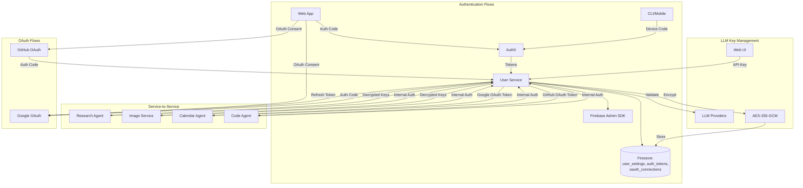
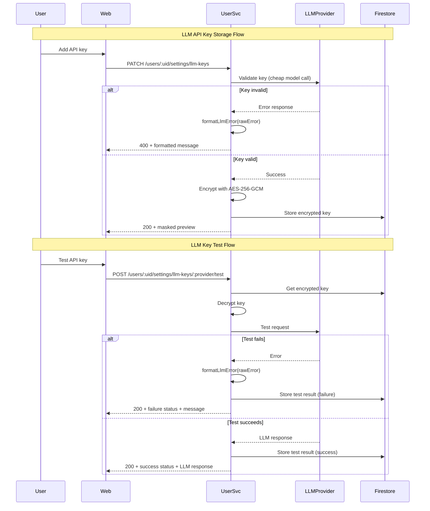

# User Service — Technical Reference

## Overview

User-service provides authentication, user settings management, LLM API key storage with encryption, and OAuth token management for Google and GitHub. It integrates with Auth0 for identity management and uses AES-256-GCM encryption for all sensitive data. Runs on Cloud Run with Fastify.

## Architecture



## Data Flow



## Recent Changes

| Commit     | Description                                                       | Date       |
| ---------- | ----------------------------------------------------------------- | ---------- |
| `1e742bbc` | Fix: remove schema enum to make isTranscriptionProvider coverable | 2026-03-06 |
| `ab863ba5` | Refactor: add isTranscriptionProvider type guard                  | 2026-03-06 |
| `0fff5af7` | Feat: add transcription preferences to user settings              | 2026-03-06 |
| `99febe66` | Fix: wire GitHub OAuth integration and update cross-service mocks | 2026-03-02 |
| `e07de959` | Feat: add GitHub OAuth integration (Stream A, tasks A1–A5)        | 2026-03-01 |
| `1478b385` | INT-571: log cascade failure + document over-clearing assumption  | 2026-02-22 |
| `cbd5d845` | INT-571: restrict default model selection to configured API keys  | 2026-02-22 |
| `b3f34d85` | Release v3.1.0                                                    | 2026-02-22 |
| `c8a42105` | Release v3.0.0                                                    | 2026-02-19 |
| `6063175b` | Dev-mode log formatting for PM2 readability                       | 2026-02-16 |
| `a52a6bbc` | Dash0 OpenTelemetry integration                                   | 2026-02-16 |
| `d5fbb354` | Fix start:local to use tsx instead of node                        | 2026-02-14 |
| `45f001c1` | Switch PM2 ecosystem to pnpm --filter                             | 2026-02-14 |

## API Endpoints

### Authentication Endpoints

| Method | Path                    | Description                             | Auth         |
| ------ | ----------------------- | --------------------------------------- | ------------ |
| POST   | `/auth/device/start`    | Start device code flow                  | None         |
| POST   | `/auth/device/poll`     | Poll for authentication token           | None         |
| POST   | `/auth/refresh`         | Refresh access token                    | None         |
| POST   | `/auth/oauth/token`     | OAuth token endpoint (ChatGPT Actions)  | None         |
| GET    | `/auth/oauth/authorize` | OAuth authorization endpoint            | None         |
| GET    | `/auth/config`          | Get Auth0 configuration                 | None         |
| POST   | `/auth/firebase-token`  | Exchange Auth0 token for Firebase token | Bearer token |
| GET    | `/auth/me`              | Get current user info                   | Bearer token |
| GET    | `/auth/login`           | Frontend login redirect                 | None         |
| GET    | `/auth/logout`          | Frontend logout redirect                | None         |

### User Settings Endpoints

| Method | Path                                            | Description                              | Auth         |
| ------ | ----------------------------------------------- | ---------------------------------------- | ------------ |
| GET    | `/users/:uid/settings`                          | Get user settings                        | Bearer token |
| PATCH  | `/users/:uid/settings`                          | Update default LLM model                 | Bearer token |
| PATCH  | `/users/:uid/settings/transcription`            | Update transcription provider preference | Bearer token |
| GET    | `/users/:uid/settings/llm-keys`                 | Get LLM API keys (masked) + defaultModel | Bearer token |
| PATCH  | `/users/:uid/settings/llm-keys`                 | Set/update LLM API key                   | Bearer token |
| POST   | `/users/:uid/settings/llm-keys/:provider/test`  | Test LLM API key                         | Bearer token |
| DELETE | `/users/:uid/settings/llm-keys/:provider`       | Delete LLM API key                       | Bearer token |

### OAuth Connection Endpoints (Google)

| Method | Path                                 | Description               | Auth         |
| ------ | ------------------------------------ | ------------------------- | ------------ |
| POST   | `/oauth/connections/google/initiate` | Start Google OAuth flow   | Bearer token |
| GET    | `/oauth/connections/google/callback` | Handle OAuth callback     | None         |
| GET    | `/oauth/connections/google/status`   | Get connection status     | Bearer token |
| DELETE | `/oauth/connections/google`          | Disconnect Google account | Bearer token |

### OAuth Connection Endpoints (GitHub)

| Method | Path                                 | Description               | Auth         |
| ------ | ------------------------------------ | ------------------------- | ------------ |
| POST   | `/oauth/connections/github/initiate` | Start GitHub OAuth flow   | Bearer token |
| GET    | `/oauth/connections/github/callback` | Handle OAuth callback     | None         |
| GET    | `/oauth/connections/github/status`   | Get connection status     | Bearer token |
| DELETE | `/oauth/connections/github`          | Disconnect GitHub account | Bearer token |

### Internal Endpoints

| Method | Path                                                | Description                     | Auth            |
| ------ | --------------------------------------------------- | ------------------------------- | --------------- |
| GET    | `/internal/users/:uid/llm-keys`                     | Get decrypted LLM API keys      | Internal header |
| POST   | `/internal/users/:uid/llm-keys/:provider/last-used` | Update last used timestamp      | Internal header |
| GET    | `/internal/users/:uid/oauth/google/token`           | Get valid Google OAuth token    | Internal header |
| GET    | `/internal/users/:uid/oauth/github/token`           | Get GitHub OAuth token          | Internal header |
| GET    | `/internal/users/:uid/settings`                     | Get user preferences            | Internal header |
| GET    | `/internal/users/by-github-username/:username`      | Find user by GitHub username    | Internal header |

## Domain Models

### UserSettings

| Field                        | Type                      | Description                        |
| ---------------------------- | ------------------------- | ---------------------------------- |
| `userId`                     | string                    | User identifier                    |
| `llmApiKeys`                 | LlmApiKeys                | AES-256 encrypted API keys         |
| `llmTestResults`             | LlmTestResults            | Last test result per provider      |
| `llmPreferences`             | LlmPreferences            | User's default model settings      |
| `transcriptionPreferences`   | TranscriptionPreferences  | User's transcription provider      |
| `notifications`              | NotificationSettings      | Notification filter rules          |
| `createdAt`                  | string                    | Creation timestamp                 |
| `updatedAt`                  | string                    | Last update timestamp              |

### LlmApiKeys

| Field        | Type           | Description                    |
| ------------ | -------------- | ------------------------------ |
| `google`     | EncryptedValue | Gemini API key (encrypted)     |
| `openai`     | EncryptedValue | OpenAI API key (encrypted)     |
| `anthropic`  | EncryptedValue | Anthropic API key (encrypted)  |
| `perplexity` | EncryptedValue | Perplexity API key (encrypted) |
| `zai`        | EncryptedValue | Zai GLM API key (encrypted)    |

### LlmTestResult

| Field      | Type                       | Description           |
| ---------- | -------------------------- | --------------------- |
| `status`   | `'success' \               | 'failure'`            | Test outcome |
| `message`  | string                     | LLM response or error |
| `testedAt` | string                     | ISO 8601 timestamp    |

### LlmPreferences

| Field          | Type     | Description                         |
| -------------- | -------- | ----------------------------------- |
| `defaultModel` | LLMModel | User's preferred default fast model |

### TranscriptionPreferences

| Field      | Type                  | Description                    |
| ---------- | --------------------- | ------------------------------ |
| `provider` | TranscriptionProvider | `'speechmatics'` (only option) |

### OAuthConnection

| Field       | Type                       | Description              |
| ----------- | -------------------------- | ------------------------ |
| `userId`    | string                     | User identifier          |
| `provider`  | `'google' \                | 'github'`                | OAuth provider |
| `email`     | string                     | User's email or username |
| `tokens`    | OAuthTokens                | Encrypted tokens         |
| `createdAt` | string                     | Connection timestamp     |
| `updatedAt` | string                     | Last refresh timestamp   |

### OAuthTokens

| Field          | Type   | Description                                   |
| -------------- | ------ | --------------------------------------------- |
| `accessToken`  | string | Encrypted access token                        |
| `refreshToken` | string | Encrypted refresh token (empty for GitHub)    |
| `expiresAt`    | string | Access token expiry (far-future for GitHub)   |
| `scope`        | string | Granted scopes                                |

### AuthTokens

| Field          | Type   | Description                    |
| -------------- | ------ | ------------------------------ |
| `accessToken`  | string | Auth0 access token             |
| `refreshToken` | string | Auth0 refresh token            |
| `tokenType`    | string | Token type (Bearer)            |
| `expiresIn`    | number | Expiry in seconds              |
| `scope`        | string | Granted scopes (optional)      |
| `idToken`      | string | OIDC ID token (optional)       |

## LLM Error Formatting

The `formatLlmError()` function parses provider-specific error responses and returns user-friendly messages. Error detection follows a specific precedence order.

### Error Parsing Order

```
1. Gemini (Google) JSON format
2. OpenAI error patterns
3. Anthropic JSON format
4. Generic fallback (with rate limit precedence)
```

### Rate Limit Precedence

The generic error parser checks for rate limits BEFORE API key errors. This prevents 429 responses from being misdiagnosed as invalid keys:

```typescript
// parseGenericError() checks in this order:
1. Rate limit patterns (429, rate_limit, quota exceeded, too many requests)
   -> "Rate limit exceeded. Please try again later."
2. API key patterns (api_key, invalid key)
   -> "The API key for this provider is invalid or expired"
3. Timeout, network, connection
4. Truncate long messages
```

### Provider-Specific Parsing

**Gemini (Google):**

- `API_KEY_INVALID` -> "The API key is invalid or has expired"
- `API_KEY_NOT_FOUND` -> "The API key does not exist"
- `PERMISSION_DENIED` -> "The API key lacks required permissions"
- `RESOURCE_EXHAUSTED` -> "Quota: X tokens/min"

**OpenAI:**

- Rate limit with details -> "tokens: 85000/90000 used, need 10000 more"
- Quota exceeded -> "OpenAI API quota exceeded. Check billing."
- Context length -> "The request exceeds the model's context limit"

**Anthropic:**

- Credit balance error -> "Insufficient Anthropic API credits. Please add funds at console.anthropic.com"
- Rate limit -> "Anthropic API rate limit reached"
- Overloaded -> "Anthropic API is temporarily overloaded"

## LLM Key Validation

Keys are validated before storage using cheap, fast models:

| Provider   | Validation Model |
| ---------- | ---------------- |
| Google     | gemini-2.0-flash |
| OpenAI     | gpt-4o-mini      |
| Anthropic  | claude-3.5-haiku |
| Perplexity | sonar            |
| Zai        | glm-4.7          |

Validation prompt: `Say "API key validated" in exactly 3 words.`

## Pub/Sub Events

None — user-service does not publish or subscribe to Pub/Sub events.

## Dependencies

### External Services

| Service       | Purpose                             |
| ------------- | ----------------------------------- |
| Auth0         | Identity management, authentication |
| Google OAuth  | OAuth token management              |
| GitHub OAuth  | OAuth token management              |
| LLM APIs      | Key validation (5 providers)        |

### Internal Services

| Service        | Communication Direction          |
| -------------- | -------------------------------- |
| research-agent | <- provides decrypted LLM keys   |
| image-service  | <- provides decrypted LLM keys   |
| calendar-agent | <- provides Google OAuth tokens  |
| code-agent     | <- provides GitHub OAuth tokens  |

### Infrastructure

| Component                                  | Purpose                             |
| ------------------------------------------ | ----------------------------------- |
| Firestore (`user_settings` collection)     | User settings storage               |
| Firestore (`auth_tokens` collection)       | Auth0 token cache                   |
| Firestore (`oauth_connections` collection) | OAuth token storage                 |
| Firebase Admin SDK                         | Firebase token generation           |
| `@intexuraos/infra-otel`                   | Dash0 OpenTelemetry tracing/metrics |

## Configuration

| Environment Variable                    | Required | Description                                               |
| --------------------------------------- | -------- | --------------------------------------------------------- |
| `INTEXURAOS_GCP_PROJECT_ID`             | Yes      | GCP project ID (Firestore, Firebase)                      |
| `INTEXURAOS_AUTH0_DOMAIN`               | Yes      | Auth0 tenant domain                                       |
| `INTEXURAOS_AUTH0_CLIENT_ID`            | Yes      | Auth0 application client ID                               |
| `INTEXURAOS_AUTH_JWKS_URL`              | Yes      | Auth0 JWKS endpoint for JWT verification                  |
| `INTEXURAOS_AUTH_ISSUER`                | Yes      | JWT issuer (Auth0 tenant URL)                             |
| `INTEXURAOS_AUTH_AUDIENCE`              | Yes      | JWT audience (API identifier)                             |
| `INTEXURAOS_TOKEN_ENCRYPTION_KEY`       | Yes      | Key for encrypting stored Auth0 tokens                    |
| `INTEXURAOS_ENCRYPTION_KEY`             | Yes      | AES-256 key for API key encryption (64 hex chars)         |
| `INTEXURAOS_INTERNAL_AUTH_TOKEN`        | Yes      | Shared secret for internal endpoints                      |
| `INTEXURAOS_APP_SETTINGS_SERVICE_URL`   | Yes      | URL of app-settings-service (fetches LLM pricing)         |
| `INTEXURAOS_WEB_APP_URL`                | Yes      | Web app URL for OAuth redirects                           |
| `INTEXURAOS_GOOGLE_OAUTH_CLIENT_ID`     | Yes      | Google OAuth client ID                                    |
| `INTEXURAOS_GOOGLE_OAUTH_CLIENT_SECRET` | Yes      | Google OAuth client secret                                |
| `INTEXURAOS_GITHUB_OAUTH_CLIENT_ID`     | Yes      | GitHub OAuth client ID                                    |
| `INTEXURAOS_GITHUB_OAUTH_CLIENT_SECRET` | Yes      | GitHub OAuth client secret                                |
| `INTEXURAOS_SENTRY_DSN`                 | No       | Sentry DSN for error tracking (optional)                  |
| `INTEXURAOS_DASH0_OTLP_ENDPOINT`        | No       | Dash0 OTLP endpoint for tracing/metrics (no-op if unset)  |

## Gotchas

**Encryption key format**: The `INTEXURAOS_ENCRYPTION_KEY` must be exactly 64 hex characters (32 bytes) for AES-256-GCM.

**Token refresh timing**: Refresh tokens are exchanged when they're within 5 minutes of expiration to prevent edge cases.

**Internal auth header**: The `X-Internal-Auth` header must match `INTEXURAOS_INTERNAL_AUTH_TOKEN` exactly for service-to-service calls.

**Device code polling**: The `interval` from Auth0's device code response should be respected to avoid rate limiting.

**OAuth token refresh**: If Google refresh fails (token revoked), the connection is deleted and user must reconnect. GitHub tokens never expire unless revoked.

**API key masking**: In logs and API responses, keys are masked showing only first 4 and last 4 characters.

**LLM key testing costs money**: The `/test` endpoint validates keys by making actual API calls to the provider.

**Rate limit vs API key errors**: Error parser checks rate limits before API key patterns to avoid misdiagnosis.

**Provider naming**: Internal provider names (`google`, `openai`, `anthropic`, `perplexity`, `zai`) differ from display names.

**Internal endpoints use response contract**: All internal endpoints return `{ success: true, data: ... }` or `{ success: false, error: { code, message } }`. Callers must read from `response.data` instead of the top level.

**Default model validation**: `PATCH /users/:uid/settings` validates `defaultModel` against `isFastModel()` from `@intexuraos/llm-contract` AND verifies the user has an API key configured for that model's provider. Unsupported model names return 400 `INVALID_REQUEST`.

**Default model cascade on key deletion**: Deleting an LLM API key automatically clears `defaultModel` if the current default belongs to the deleted provider.

**OAuth2 routes use raw send**: OAuth2 spec routes (`/auth/oauth/token`, `/auth/oauth/authorize`) intentionally bypass the response contract via `@allow-raw-send` annotations because the OAuth2 spec requires flat `{ error, error_description }` responses.

**Auth0 namespaced claims**: The `/auth/me` endpoint reads claims from `https://intexuraos.cloud/` namespace first, falling back to bare claims. Auth0 Actions must use this namespace when adding claims for API audiences.

**Error code mapping**: Internal endpoint error codes follow the standard response contract codes: `UNAUTHORIZED` (401), `NOT_FOUND` (404), `MISCONFIGURED` (503), `DOWNSTREAM_ERROR` (502).

**Pricing context at startup**: The service fetches LLM pricing from `app-settings-service` at boot. If that service is unavailable, startup fails.

**GitHub tokens never expire**: GitHub access tokens are stored with a far-future expiry (`9999-12-31`). They do not need refresh logic but can be revoked at any time.

**GitHub username as email**: GitHub connections store the GitHub username in the `email` field of OAuthConnection. The `findByProviderEmail` query is used to look up users by GitHub username.

**OAuth state TTL**: OAuth state tokens (base64url-encoded JSON) expire after 10 minutes. Expired state returns `INVALID_STATE`.

**Transcription provider validation**: Only `speechmatics` is currently a valid transcription provider. The `isTranscriptionProvider()` type guard validates at runtime.

## File Structure

```
apps/user-service/src/
  domain/
    identity/
      models/
        AuthToken.ts           # Auth token types
        AuthError.ts           # Auth error types
      ports/
        Auth0Client.ts         # Auth0 interface
        AuthTokenRepository.ts # Token storage interface
      usecases/
        refreshAccessToken.ts  # Token refresh logic
    settings/
      models/
        UserSettings.ts        # Settings aggregate (LLM keys, preferences, transcription)
        SettingsError.ts       # Settings error types
      ports/
        UserSettingsRepository.ts # Settings storage
        Encryptor.ts           # Encryption interface
        LlmValidator.ts        # Key validation interface
      usecases/
        getUserSettings.ts     # Get settings use case
      utils/
        maskApiKey.ts          # Key masking utility
      formatLlmError.ts        # Error message formatting
    oauth/
      models/
        OAuthConnection.ts     # OAuth connection types (Google + GitHub)
        OAuthError.ts          # OAuth error types
      ports/
        GoogleOAuthClient.ts   # Google OAuth interface
        GitHubOAuthClient.ts   # GitHub OAuth interface
        OAuthConnectionRepository.ts
      usecases/
        initiateOAuthFlow.ts         # Start Google OAuth
        exchangeOAuthCode.ts         # Exchange Google code for tokens
        getValidAccessToken.ts       # Get/refresh Google access token
        disconnectProvider.ts        # Revoke Google OAuth connection
        initiateGitHubOAuthFlow.ts   # Start GitHub OAuth
        exchangeGitHubOAuthCode.ts   # Exchange GitHub code for tokens
        disconnectGitHubProvider.ts  # Revoke GitHub OAuth connection
  infra/
    auth0/
      client.ts                # Auth0 SDK wrapper
    encryption.ts              # AES-256-GCM implementation
    firebase/
      admin.ts                 # Firebase Admin SDK
    firestore/
      authTokenRepository.ts   # Token storage
      userSettingsRepository.ts # Settings storage
      oauthConnectionRepository.ts # OAuth connection storage
      encryption.ts            # Firestore encryption helpers
    google/
      googleOAuthClient.ts     # Google OAuth client
    github/
      gitHubOAuthClient.ts     # GitHub OAuth client
    llm/
      LlmValidatorImpl.ts      # Key validation (5 providers)
  routes/
    deviceRoutes.ts            # Device code flow
    tokenRoutes.ts             # Token refresh
    firebaseRoutes.ts          # Firebase token exchange
    oauthRoutes.ts             # OAuth2 endpoints (ChatGPT Actions)
    oauthConnectionRoutes.ts   # Google OAuth connection management
    gitHubOAuthConnectionRoutes.ts # GitHub OAuth connection management
    configRoutes.ts            # Auth0 config
    settingsRoutes.ts          # User settings + default model + transcription
    llmKeysRoutes.ts           # LLM key management (CRUD + test)
    frontendRoutes.ts          # Login/logout/me pages
    internalRoutes.ts          # Service-to-service (6 endpoints)
    schemas.ts                 # Zod request schemas
    shared.ts                  # Shared helpers (loadAuth0Config)
    httpClient.ts              # HTTP client for Auth0 calls
  services.ts                  # DI container
  server.ts                    # Fastify server builder
  index.ts                     # Entry point with env validation
```
