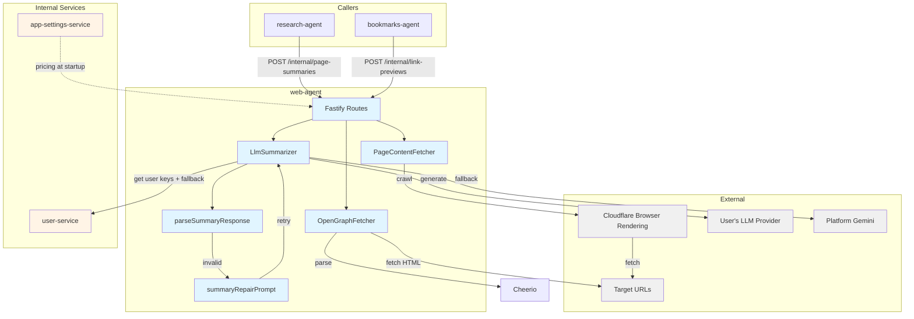
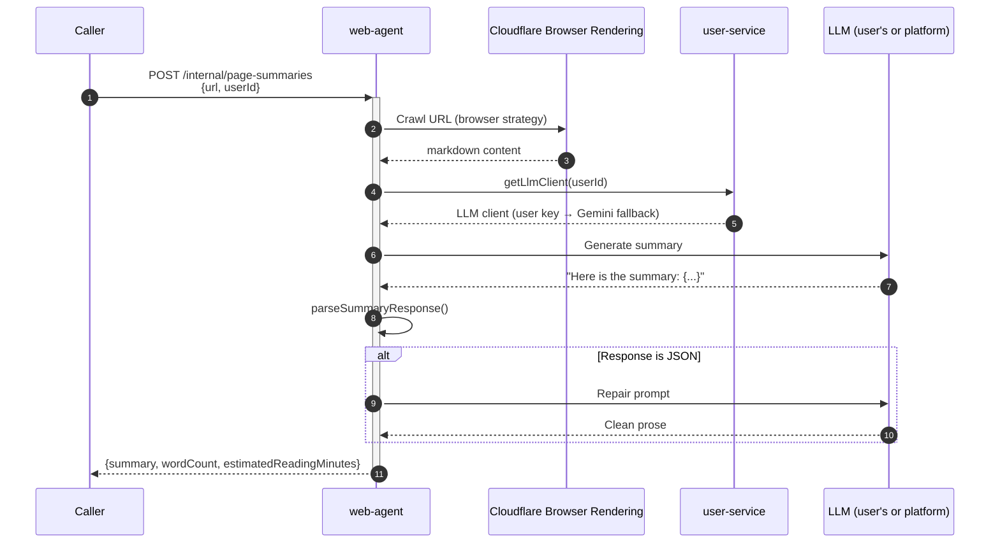

# Web Agent — Technical Reference

## Overview

Web Agent extracts web content and generates AI summaries. It uses Cloudflare Browser Rendering for headless browser content extraction, Cheerio for OpenGraph parsing, and the user's configured LLM (with a platform Gemini 2.5 Flash fallback) for summarization with automatic response repair.

Runs on Cloud Run with auto-scaling (0–1 instances). Port 8127 on local/dev. Distributed tracing via Dash0 OpenTelemetry (transparent preload).

## Architecture



## Data Flow — Page Summarization



## Recent Changes

| Commit     | Description                                                  | Date       |
| ---------- | ------------------------------------------------------------ | ---------- |
| `c4e3a13c` | Release v3.3.0                                               | 2026-03-13 |
| `93aeac4a` | Remove ZAI provider and GLM-4.7 models (INT-836)             | 2026-03-12 |
| `a6afbb28` | Write tests for v8-ignore blocks (INT-798)                   | 2026-03-09 |
| `44ea683a` | Release v3.2.0                                               | 2026-03-07 |
| `99febe66` | Fix GitHub OAuth integration and cross-service mocks         | 2026-03-02 |
| `b3f34d85` | Release v3.1.0                                               | 2026-02-22 |
| `c8a42105` | Release v3.0.0                                               | 2026-02-19 |
| `884bc168` | Add semver `version` field to PromptBuilder (1.0.0)          | 2026-02-19 |
| `6063175b` | Add dev-mode log formatting for PM2 readability              | 2026-02-16 |
| `a52a6bbc` | Add Dash0 OpenTelemetry integration (transparent preload)    | 2026-02-16 |
| `e60eafc1` | Rename `CRAWL4AI_API_KEY` to `CRAWL4AI_APP_API_KEY`          | 2026-02-15 |
| `c72b7c53` | Switch default LLM to Gemini 2.5 Flash + add Gemini fallback | 2026-02-15 |
| `0f69a74b` | Add platform fallback for users without API keys             | 2026-02-09 |
| `3a5d9380` | INT-533 Add content focus instructions to summary prompt     | 2026-02-07 |

## API Endpoints

### Internal Endpoints

| Method | Path                       | Description                                  | Auth           |
| ------ | -------------------------- | -------------------------------------------- | -------------- |
| POST   | `/internal/link-previews`  | Fetch OpenGraph metadata for URLs            | Internal token |
| POST   | `/internal/page-summaries` | Crawl and summarize a web page with user LLM | Internal token |

### System Endpoints

| Method | Path            | Description         | Auth |
| ------ | --------------- | ------------------- | ---- |
| GET    | `/health`       | Health check        | None |
| GET    | `/docs`         | Swagger UI          | None |
| GET    | `/openapi.json` | OpenAPI spec (JSON) | None |

### Link Previews Request

```typescript
interface FetchLinkPreviewsBody {
  urls: string[]; // 1-10 URLs
  timeoutMs?: number; // 1000-30000ms (default: 5000)
}
```

### Link Previews Response

```typescript
interface FetchLinkPreviewsResponse {
  results: LinkPreviewResult[];
  metadata: {
    requestedCount: number;
    successCount: number;
    failedCount: number;
    durationMs: number;
  };
}
```

### Page Summaries Request

```typescript
interface SummarizePageBody {
  url: string; // URL to summarize
  userId: string; // User ID for LLM key lookup
  maxSentences?: number; // 1-50 (default: 20)
  maxReadingMinutes?: number; // 1-10 (default: 3)
}
```

### Page Summaries Response

```typescript
interface SummarizePageResponse {
  result: PageSummaryResult;
  metadata: {
    durationMs: number;
  };
}

interface PageSummary {
  url: string;
  summary: string;
  wordCount: number;
  estimatedReadingMinutes: number;
}
```

## Domain Models

### LinkPreview

| Field         | Type                | Description                  |
| ------------- | ------------------- | ---------------------------- |
| `url`         | `string`            | Original URL                 |
| `title`       | `string \           | undefined`                   | og:title or HTML title |
| `description` | `string \           | undefined`                   | og:description or meta desc |
| `image`       | `string \           | undefined`                   | Resolved absolute og:image |
| `favicon`     | `string \           | undefined`                   | Favicon URL |
| `siteName`    | `string \           | undefined`                   | og:site_name |

### LinkPreviewError

| Code            | Meaning                                  |
| --------------- | ---------------------------------------- |
| `FETCH_FAILED`  | HTTP errors or network issues            |
| `TIMEOUT`       | Request exceeded timeout                 |
| `TOO_LARGE`     | Response over 2 MB                       |
| `INVALID_URL`   | Malformed URL or unsupported protocol    |
| `ACCESS_DENIED` | HTTP 403 — website blocked the request   |

### PageSummaryError

| Code           | Meaning                                           |
| -------------- | ------------------------------------------------- |
| `FETCH_FAILED` | Cloudflare Browser Rendering failed to fetch page |
| `TIMEOUT`      | Browser rendering exceeded 60s timeout            |
| `NO_CONTENT`   | No markdown extracted from page                   |
| `API_ERROR`    | LLM API error or user service error               |
| `INVALID_URL`  | Malformed URL or unsupported protocol             |
| `TOO_LARGE`    | Response exceeds size limit                       |
| `RATE_LIMITED` | Cloudflare returned HTTP 429                      |

## Key Components

### PageContentFetcher

Extracts page content via Cloudflare Browser Rendering `/markdown` endpoint without LLM extraction.

**Configuration:**

| Setting      | Default                      | Description             |
| ------------ | ---------------------------- | ----------------------- |
| `baseUrl`    | `https://api.cloudflare.com` | Cloudflare API endpoint |
| `accountId`  | (required)                   | Cloudflare account ID   |
| `apiToken`   | (required)                   | Cloudflare API token    |
| `timeoutMs`  | 60000                        | Request timeout         |

**Strategy:** Uses Cloudflare headless browser for JavaScript rendering.

### LlmSummarizer

Generates prose summaries with automatic repair on parse failures.

**Flow:**

1. Build prompt with language preservation and content focus instructions
2. Send to user's LLM via `llm-factory` (or platform fallback)
3. Parse response with `parseSummaryResponse()`
4. If JSON detected, send repair prompt and retry once
5. Return `PageSummary` or error

**Key features:**

- Prompt includes "Write in SAME LANGUAGE as original content" instruction
- Content focus section guides LLM to summarize actual page content, not platform descriptions (INT-533)
- Both `summaryPrompt` and `summaryRepairPrompt` implement `PromptBuilder` with `version: '1.0.0'`

### parseSummaryResponse

Validates LLM output is clean prose.

**Checks:**

- Not empty after cleaning
- Not JSON format (objects/arrays)
- Strips unwanted prefixes ("Here is", "Summary:", etc.)
- Strips markdown code blocks

**Returns:** `{ summary: string, wordCount: number }` or `ParseError`

### OpenGraphFetcher

Fetches and parses OpenGraph metadata.

**Browser-like headers:**

```typescript
{
  'User-Agent': 'Mozilla/5.0 (Windows NT 10.0; Win64; x64) AppleWebKit/537.36 (KHTML, like Gecko) Chrome/130.0.0.0 Safari/537.36',
  'Accept': 'text/html,application/xhtml+xml,application/xml;q=0.9,image/avif,image/webp,*/*;q=0.8',
  'Accept-Language': 'en-US,en;q=0.9',
  'Accept-Encoding': 'gzip, deflate, br',
  'Cache-Control': 'no-cache',
  'Connection': 'keep-alive',
  'Sec-Fetch-Dest': 'document',
  'Sec-Fetch-Mode': 'navigate',
  'Sec-Fetch-Site': 'none',
  'Sec-Fetch-User': '?1',
  'Upgrade-Insecure-Requests': '1',
}
```

**Configuration:**

| Setting           | Default        | Description           |
| ----------------- | -------------- | --------------------- |
| `timeoutMs`       | 5000           | Request timeout       |
| `maxResponseSize` | 2097152 (2 MB) | Maximum response size |

## Dependencies

### External Services

| Service                      | Purpose                                          | Failure Mode        |
| ---------------------------- | ------------------------------------------------ | ------------------- |
| Cloudflare Browser Rendering | Web page content extraction (/markdown endpoint) | Return FETCH_FAILED |
| User's LLM                   | Summary generation                               | Return API_ERROR    |
| Dash0                        | OpenTelemetry sink                               | Silent (optional)   |

### Internal Services

| Service              | Endpoint               | Purpose                                        |
| -------------------- | ---------------------- | ---------------------------------------------- |
| user-service         | `getLlmClient(userId)` | Get LLM client (user key or platform fallback) |
| app-settings-service | `fetchAllPricing()`    | LLM pricing context at startup                 |

**Integration Note:** web-agent uses `@intexuraos/internal-clients` for type-safe communication with user-service. This package provides:

- `createUserServiceClient()` — Factory for configured client
- `UserServiceClient` interface with `getLlmClient()` method
- Automatic error handling and result types
- Platform Gemini 2.5 Flash fallback when user has no API key

## Configuration

| Variable                              | Purpose                                       | Required |
| ------------------------------------- | --------------------------------------------- | -------- |
| `INTEXURAOS_INTERNAL_AUTH_TOKEN`      | Internal service auth                         | Yes      |
| `INTEXURAOS_CLOUDFLARE_ACCOUNT_ID`    | Cloudflare account ID                         | Yes      |
| `INTEXURAOS_CLOUDFLARE_API_TOKEN`     | Cloudflare API token (Browser Rendering Edit) | Yes      |
| `INTEXURAOS_USER_SERVICE_URL`         | User service base URL                         | Yes      |
| `INTEXURAOS_APP_SETTINGS_SERVICE_URL` | Pricing lookup                                | Yes      |
| `INTEXURAOS_SENTRY_DSN`               | Error tracking                                | Yes      |
| `INTEXURAOS_GEMINI_APP_API_KEY`       | Platform Gemini 2.5 Flash fallback            | Optional |
| `INTEXURAOS_DASH0_OTLP_ENDPOINT`      | Dash0 OpenTelemetry endpoint                  | Optional |

All required vars are validated at startup via `validateRequiredEnv()`. `INTEXURAOS_SENTRY_DSN` is validated separately with a direct check. Optional keys are passed to `createUserServiceClient()` and are no-ops when unset.

## Gotchas

**Fetch vs Summary separation** — PageContentFetcher only fetches content via Cloudflare; LlmSummarizer handles AI. This allows using the user's LLM keys rather than shared infrastructure.

**Platform fallback chain** — When a user has no API key for their chosen provider, `getLlmClient()` falls back to Gemini 2.5 Flash (platform key). `API_ERROR` with "No API key" only surfaces if the platform key is also unset.

**Repair mechanism** — If the LLM returns JSON, the parser detects it and triggers a repair prompt automatically. Only retries once.

**Language preservation** — Summary prompt explicitly instructs "Write in SAME LANGUAGE as original content" to prevent English summaries of non-English articles.

**403 handling** — Returns `ACCESS_DENIED` error code specifically for 403 responses, distinct from general `FETCH_FAILED`.

**Browser-like headers** — OpenGraphFetcher sends Chrome-like headers including Sec-Fetch-* to bypass basic bot detection.

**User LLM client** — Summaries use the user's API key from user-service when available; pricing is tracked per-user regardless of which key is used.

**Empty response handling** — `nonEmpty()` helper treats empty strings the same as undefined for fallback logic.

**Concurrent link previews** — All URLs fetched in parallel via Promise.all. One timeout does not affect others.

**Rate limiting (429)** — Cloudflare 429 responses return `RATE_LIMITED` error code, distinct from general `API_ERROR`.

**Content focus prompting** — Summary prompts include a CONTENT FOCUS section that prevents the LLM from describing the platform instead of the actual content (e.g., avoids "LinkedIn is a professional network" preambles).

**PromptBuilder versioning** — Both `summaryPrompt` and `summaryRepairPrompt` use the `PromptBuilder` interface with semver `version: '1.0.0'`. Bump the version when changing prompt content.

**Sentry logging** — Uses `createAppLogger()` from `@intexuraos/infra-sentry` for automatic error forwarding to Sentry.

**Response contract** — All internal routes use `reply.ok()` / `reply.fail()` instead of raw `reply.send()` / `reply.status()`.

**Dash0 OpenTelemetry** — Distributed tracing is loaded via `--import ./dist/otel-register.js` in the Dockerfile CMD. It is a no-op when `INTEXURAOS_DASH0_OTLP_ENDPOINT` is unset, so local dev is unaffected.

**No Firestore** — This service is stateless. It does not own any Firestore collections.

**Pricing at startup** — The service fetches LLM pricing from app-settings-service at startup and passes it to the user service client for cost tracking.

## File Structure

```
apps/web-agent/src/
  domain/
    linkpreview/
      models/
        LinkPreview.ts           # LinkPreview, LinkPreviewError types
      ports/
        linkPreviewFetcher.ts    # Fetcher interface
    pagesummary/
      models/
        PageSummary.ts           # PageSummary, PageSummaryError types
      ports/
        pageSummaryService.ts    # Service interface
  infra/
    linkpreview/
      openGraphFetcher.ts        # Cheerio-based OG extraction
    pagesummary/
      pageContentFetcher.ts      # Cloudflare Browser Rendering client (with RATE_LIMITED handling)
      llmSummarizer.ts           # User's LLM summarization (with platform fallback)
      crawl4aiClient.ts          # Legacy combined client (deprecated)
      parseSummaryResponse.ts    # Response validation
      buildSummaryRepairPrompt.ts # PromptBuilder prompts v1.0.0 (with content focus section)
  routes/
    internalRoutes.ts            # /internal/* endpoints
    schemas/
      linkPreviewSchemas.ts      # Request/response schemas
      pageSummarySchemas.ts      # Request/response schemas
  services.ts                    # DI container
  server.ts                      # Fastify server
  index.ts                       # Entry point
```

**Package Dependencies:**

- `@intexuraos/internal-clients` — Type-safe clients for internal services (with fallback chain)
- `@intexuraos/llm-pricing` — Pricing context for LLM cost tracking
- `@intexuraos/llm-factory` — User's LLM client generation
- `@intexuraos/infra-otel` — OpenTelemetry preload for Dash0 tracing
- `@intexuraos/llm-prompts` — PromptBuilder interface with semver versioning
- `@intexuraos/llm-utils` — `createDetailedParseErrorMessage()` for structured LLM parse error context
- `cheerio` — HTML parsing for OpenGraph metadata extraction

## Setup Guide

See [Cloudflare Browser Rendering Setup Guide](../../guides/cloudflare-browser-rendering-setup.md) for account creation, API token configuration, and troubleshooting.
