# Web App -- Technical Reference

## Overview

Single-page React application built with Vite, serving as the primary user interface for IntexuraOS. Uses Auth0 for authentication, Firestore for real-time data synchronization, and connects to 15+ backend microservices via REST APIs. Deploys as a Progressive Web App (PWA) to Google Cloud Storage behind a load balancer. Supports dark mode, an AI chat assistant (Intex Chat), an agent-based code task management system with collapsible tool output, multi-status filtering, saved data visualizations, assignee display on Linear boards, and a developer toolbar (DevBar) for local and dev machine environments.

## Architecture

```mermaid
graph TB
    subgraph "Client Browser"
        PWA[Progressive Web App]
        Auth0[Auth0 Lock]
        SW[Service Worker]
    end

    subgraph "Backend Services"
        USER[user-service]
        CMD[commands-agent]
        ACT[actions-agent]
        RES[research-agent]
        TODO[todos-agent]
        NOTE[notes-agent]
        BKMK[bookmarks-agent]
        CAL[calendar-agent]
        LIN[linear-agent]
        DATA[data-insights-agent]
        NOTIF[mobile-notifications]
        SETTINGS[app-settings-service]
        NOTION[notion-service]
        WA[whatsapp-service]
        CODE[code-agent]
        CHAT[chat-agent]
    end

    subgraph "Data & Auth"
        Firestore[(Firestore)]
        Auth0Svc[Auth0 API]
    end

    PWA --> Auth0Svc
    PWA --> USER
    PWA --> CMD
    PWA --> ACT
    PWA --> RES
    PWA --> TODO
    PWA --> NOTE
    PWA --> BKMK
    PWA --> CAL
    PWA --> LIN
    PWA --> DATA
    PWA --> NOTIF
    PWA --> SETTINGS
    PWA --> NOTION
    PWA --> WA
    PWA --> CODE
    PWA --> CHAT
    PWA --> Firestore
    SW --> PWA
```



## Recent Changes

| Commit     | Description                                                            | Date       |
| ---------- | ---------------------------------------------------------------------- | ---------- |
| `1ee7e8c6` | Fix single-space timestamp strip in isBodyLine for log viewer          | 2026-02-22 |
| `ef2724df` | Fix collapsible tool output in code task logs                          | 2026-02-22 |
| `fbe7c944` | Fix worker reorder buttons in settings UI                              | 2026-02-22 |
| `27f15cfc` | Collapsible tool output blocks in log viewer                           | 2026-02-22 |
| `c9acdce3` | Standardize delete confirmations across all pages                      | 2026-02-21 |
| `2e3ae30c` | Persist filter and sidebar collapse state across page refresh          | 2026-02-21 |
| `bcbd5075` | Multi-status filtering and fix pagination for code tasks               | 2026-02-21 |
| `3b081686` | INT-501: Prevent browser autofill on worker secret fields              | 2026-02-21 |
| `19442f43` | Handle null assignee in LinearIssuesPage guards                        | 2026-02-20 |
| `d36c76dd` | Add null to LinearIssue assignee type to match API response            | 2026-02-20 |
| `c221efd5` | Use emerald green for Linear board assignee badges                     | 2026-02-20 |
| `20a106c0` | Replace code task Summary with expandable PR events timeline           | 2026-02-20 |
| `6df58b52` | Display assignee name on Linear board issue cards                      | 2026-02-20 |
| `27ef6a7b` | INT-505: Show compare URL for PR synchronize events                    | 2026-02-19 |
| `0e07e938` | Show agent-type flow banner on planning tasks with implementation link | 2026-02-19 |
| `e8bbacd7` | GitHub PR summaries with lazy event loading                            | 2026-02-19 |

## Application Structure

```
apps/web/src/
├── components/         # Reusable UI components
│   ├── ui/             # Base UI components (Button, Card, Input)
│   ├── Chat/           # Chat system (FAB, Panel, BottomSheet, Message, Input)
│   ├── devbar/         # DevBar sub-components (tabs, filters, resize)
│   ├── ActionItem.tsx          # Single action display with buttons
│   ├── DevBar.tsx              # Developer toolbar (dev only)
│   ├── Layout.tsx              # Main app layout with sidebar
│   ├── Header.tsx              # Top navigation bar with theme toggle
│   ├── PREventsGroup.tsx       # PR events grouping component
│   ├── LinearIssueSelectorModal.tsx  # Modal for selecting Linear issues
│   ├── TaskConflictModal.tsx   # 409 conflict resolution modal
│   ├── TaskErrorModal.tsx      # Error-code-specific modal with actions
│   └── ...
├── context/            # React context providers
│   ├── AuthContext.tsx     # Auth0 authentication wrapper
│   ├── SyncQueueContext.tsx # Offline sync queue
│   ├── ThemeContext.tsx    # Dark/light/system theme management
│   └── pwa-context.tsx    # PWA install prompts
├── hooks/              # Custom React hooks
│   ├── useApiClient.ts    # API request wrapper with auth
│   ├── useActionChanges.ts # Firestore listener for actions
│   ├── useBookmarks.ts     # Bookmark CRUD
│   ├── useBookmarkChanges.ts # Firestore listener for bookmarks
│   ├── useCalendarEvents.ts  # Calendar event list with filtering
│   ├── useChartDefinition.ts # Chart definition management
│   ├── useChartPreview.ts    # Chart preview rendering
│   ├── useCodeTasks.ts    # Code task CRUD + polling + multi-status filter
│   ├── useCompositeFeeds.ts  # Composite feed management
│   ├── useCreateVisualization.ts # Create visualization mutations
│   ├── useDataInsights.ts    # Data insights feed data
│   ├── useDataSources.ts     # Static data source management
│   ├── useDevBarState.ts  # DevBar persistence and state
│   ├── useFailedCalendarEvents.ts # Failed calendar event recovery
│   ├── useFailedLinearIssues.ts  # Failed Linear issue tracking
│   ├── useGitHubPREvents.ts # GitHub PR event details (lazy-loaded)
│   ├── useGitHubPRSummaries.ts # GitHub PR summary list
│   ├── useLinearIssueOptions.ts # Linear issue selection options
│   ├── useLlmKeys.ts       # LLM API key management
│   ├── useNotes.ts         # Note CRUD
│   ├── usePm2Logs.ts     # PM2 log streaming via SSE
│   ├── usePubSubEvents.ts # Pub/Sub event streaming via SSE
│   ├── useResearch.ts      # Research report management
│   ├── useTaskView.ts      # Code task detail view state
│   ├── useTodos.ts         # Todo CRUD
│   ├── useUsageCosts.ts    # LLM usage cost data
│   ├── useVisualizations.ts  # Saved visualization management
│   ├── useWorkerSettings.ts # Worker config management
│   └── ...
├── pages/              # Route components
│   ├── HomePage.tsx       # Public landing page (brutalist design)
│   ├── LoginPage.tsx      # Auth0 login
│   ├── InboxPage.tsx      # Unified commands/actions inbox
│   ├── CodeTasksPage.tsx  # Code task list with multi-status filter
│   ├── CodeTaskNewPage.tsx # Create new code task (form + modal)
│   ├── CodeTaskViewPage.tsx # Code task detail with collapsible log viewer
│   ├── PREventsPage.tsx   # GitHub PR events with lazy-loaded summaries
│   ├── WorkerSettingsPage.tsx # Worker configuration with reorder
│   ├── ResearchAgentPage.tsx # Research query form
│   ├── CalendarPage.tsx   # Calendar events list
│   ├── LinearIssuesPage.tsx  # 3-column board with sub-issues and assignees
│   ├── VisualizationsListPage.tsx # Saved data visualizations
│   └── ...
├── services/           # API client functions
│   ├── apiClient.ts       # Base API request handler
│   ├── chatService.ts     # Chat agent API + session persistence
│   ├── codeAgentApi.ts    # Code agent API (tasks, workers, PR events)
│   ├── errorConfig.ts     # Declarative error display configuration
│   ├── linearApi.ts       # Linear API (connection, issues, webhook config, sync)
│   ├── researchSettingsApi.ts # Research Notion export settings
│   ├── whatsappApi.ts     # WhatsApp API (verification, messages, media)
│   ├── workerSettingsApi.ts # Worker settings CRUD + connectivity testing
│   └── ...
├── types/              # TypeScript type definitions
│   ├── actionConfig.ts    # Action button config types
│   ├── chat.ts            # Chat message, session, response types
│   └── index.ts           # All shared types
├── utils/              # Utility functions
│   ├── dateFormat.ts      # Centralized date/time formatting
│   ├── dateUtils.ts       # Calendar date utilities
│   ├── markdownUtils.ts   # Markdown/HTML stripping
│   ├── todoItemSort.ts    # Todo sorting logic
│   └── imageProxy.ts      # Image proxy URL builder
├── config.ts           # Environment configuration
├── App.tsx             # Main app with routing
└── index.tsx           # Application entry point
```

## Routes

| Route                                   | Page                              | Auth Required                   | Purpose                         |
| --------------------------------------- | --------------------------------- | ------------------------------- | ------------------------------- |
| `/`                                     | HomePage                          | No                              | Public landing page             |
| `/login`                                | LoginPage                         | No (redirects if authenticated) | Auth0 login                     |
| `/inbox`                                | InboxPage                         | Yes                             | Commands and actions queue      |
| `/research`                             | ResearchListPage                  | Yes                             | Research reports list           |
| `/research/new`                         | ResearchAgentPage                 | Yes                             | Create new research query       |
| `/research/:id`                         | ResearchDetailPage                | Yes                             | Research report detail          |
| `/code-tasks`                           | CodeTasksPage                     | Yes                             | Code task list                  |
| `/code-tasks/new`                       | CodeTaskNewPage                   | Yes                             | Create new code task            |
| `/code-tasks/:id`                       | CodeTaskViewPage                  | Yes                             | Code task detail with terminal  |
| `/code-tasks/pr-events`                 | PREventsPage                      | Yes                             | GitHub PR events view           |
| `/my-todos`                             | TodosListPage                     | Yes                             | Todo items                      |
| `/todos/:id`                            | Todo detail                       | Yes                             | Single todo item                |
| `/my-notes`                             | NotesListPage                     | Yes                             | Notes list                      |
| `/notes/:id`                            | Note detail                       | Yes                             | Single note                     |
| `/my-bookmarks`                         | BookmarksListPage                 | Yes                             | Bookmarks list                  |
| `/bookmarks/:id`                        | Bookmark detail                   | Yes                             | Single bookmark                 |
| `/notes`                                | WhatsAppNotesPage                 | Yes                             | WhatsApp notes                  |
| `/calendar`                             | CalendarPage                      | Yes                             | Calendar events                 |
| `/linear`                               | LinearIssuesPage                  | Yes                             | Linear issues dashboard         |
| `/data-insights`                        | CompositeFeedsListPage            | Yes                             | Data insights feeds             |
| `/data-insights/new`                    | CompositeFeedFormPage             | Yes                             | Create composite feed           |
| `/data-insights/visualizations`         | VisualizationsListPage            | Yes                             | Saved visualizations            |
| `/data-insights/:feedId/visualizations` | DataInsightsPage                  | Yes                             | Saved visualizations for a feed |
| `/data-insights/:id`                    | CompositeFeedFormPage             | Yes                             | Edit composite feed             |
| `/data-insights/static-sources`         | DataSourcesListPage               | Yes                             | Static data sources             |
| `/data-insights/static-sources/new`     | DataSourceFormPage                | Yes                             | Create data source              |
| `/data-insights/static-sources/:id`     | DataSourceFormPage                | Yes                             | Edit data source                |
| `/notifications`                        | MobileNotificationsListPage       | Yes                             | Push notifications history      |
| `/settings/whatsapp`                    | WhatsAppConnectionPage            | Yes                             | WhatsApp connection             |
| `/settings/mobile`                      | MobileNotificationsConnectionPage | Yes                             | Mobile notification settings    |
| `/settings/notion`                      | NotionConnectionPage              | Yes                             | Notion connection               |
| `/settings/calendar`                    | GoogleCalendarConnectionPage      | Yes                             | Google Calendar connection      |
| `/settings/linear`                      | LinearConnectionPage              | Yes                             | Linear connection + webhooks    |
| `/settings/workers`                     | WorkerSettingsPage                | Yes                             | Code worker configuration       |
| `/settings/api-keys`                    | ApiKeysSettingsPage               | Yes                             | LLM API key management          |
| `/settings/llm-pricing`                 | LlmPricingPage                    | Yes                             | LLM pricing configuration       |
| `/settings/usage-costs`                 | LlmCostsPage                      | Yes                             | LLM usage cost tracking         |
| `/settings/share-history`               | ShareHistoryPage                  | Yes                             | PWA share history               |
| `/share-target`                         | ShareTargetPage                   | Yes                             | PWA share target handler        |

**Note:** All routes use hash routing (`/#/path`) because the app is served from a GCS backend bucket which does not support SPA fallback. Legacy routes (`/notion`, `/whatsapp`, `/whatsapp-notes`, `/mobile-notifications`, `/mobile-notifications/list`) redirect to their canonical paths.

## API Client Pattern

All API calls use the `apiRequest` function from `apiClient.ts`:

```typescript
export async function apiRequest<T>(
  baseUrl: string,
  path: string,
  accessToken: string,
  options?: RequestOptions
): Promise<T>;
```

The `useApiClient` hook wraps this with Auth0 token management:

```typescript
const { request, isAuthenticated } = useApiClient();
const data = await request<ServiceUrlType>(path, options);
```

## Real-Time Updates

The app uses Firestore listeners for real-time updates:

**Action Changes Listener:**

- `useActionChanges` hook creates Firestore listener on `actions` collection
- Tracks changed action IDs in state
- Debounced batch fetch (500ms) to prevent excessive API calls
- Only enabled when Actions tab is active (cost optimization)

**Command Changes Listener:**

- `useCommandChanges` hook listens to `commands` collection
- Full refresh on changes (commands less frequent than actions)

**Bookmark Changes Listener:**

- `useBookmarkChanges` hook tracks Firestore bookmark mutations
- Triggers re-fetch of bookmark data

**Linear Issues:**

- Firestore-backed real-time board; no polling needed
- Supports parent-child sub-issues displayed with indentation
- Assignee names displayed with emerald green badges
- Null assignee values handled gracefully

## Code Task Features

### Multi-Status Filtering

Code tasks support simultaneous filtering by multiple statuses. The filter state persists in localStorage across page refreshes. All seven statuses are filterable: dispatched, running, planned, implemented, failed, interrupted, cancelled.

### Agent-Based Flow

Code tasks support an `agentType` field: `planning` or `execution`.

- **Planning agent:** Task produces a planning artifact. When an implementation task is linked (`implementationTaskId`), an `ImplementationLinkBanner` appears (emerald color) linking to the implementation task.
- **Execution agent:** Runs the code changes. A `DesignTaskBanner` (violet color) links back to the parent planning task with the label "DESIGN".
- **Single-phase tasks:** No banner shown.

### Collapsible Tool Output

Log lines from tool calls are grouped into collapsible sections. The log viewer detects `[tool]` tagged lines and groups subsequent indented output lines into expandable blocks. This prevents long tool results (file listings, test output, etc.) from overwhelming the log view. Each block shows a toggle to expand/collapse.

### Log Stream

Code task logs render via the `LogStream` component (inline in `CodeTaskViewPage.tsx`). Log lines are color-coded by tag:

| Tag                         | Color   |
| --------------------------- | ------- |
| `[user]`                    | cyan    |
| `[queued]`                  | amber   |
| `[resumed]`                 | emerald |
| `[prompt]`                  | orange  |
| `[instructions]`            | violet  |
| `[claude]`                  | blue    |
| `[tool]`                    | yellow  |
| `[error]`                   | red     |
| `[done]`                    | green   |
| `[hook]`                    | purple  |
| `[init]`                    | cyan    |
| `[system]`/`[orchestrator]` | slate   |

Features: follow mode (auto-scroll), manual scroll override, copy-all-logs button, live indicator, line count, collapsible tool output blocks. Log data streams from Firestore in real time.

### Standardized Delete Confirmations

All delete actions across the app (code tasks, data sources, todos, notes, bookmarks) use standardized confirmation dialogs to prevent accidental deletion.

## State Management

- **React Context** for global state (auth, sync queue, PWA, theme)
- **Component State** (`useState`) for local UI state
- **localStorage** for user preferences (active tab, filters, sidebar collapse state, filter expanded state, theme, chat sessions, chat panel size, DevBar state)
- **sessionStorage** for one-time flags (deep link fetch tracking)
- **Firestore** for real-time data synchronization (actions, commands, code task logs, Linear issues)

## Configuration

Environment variables (prefixed with `INTEXURAOS_`):

| Variable                                      | Purpose                          | Required |
| --------------------------------------------- | -------------------------------- | -------- |
| `INTEXURAOS_AUTH0_DOMAIN`                     | Auth0 domain                     | Yes      |
| `INTEXURAOS_AUTH0_SPA_CLIENT_ID`              | Auth0 client ID                  | Yes      |
| `INTEXURAOS_AUTH_AUDIENCE`                    | Auth0 API audience               | Yes      |
| `INTEXURAOS_USER_SERVICE_URL`                 | User service endpoint            | Yes      |
| `INTEXURAOS_WHATSAPP_SERVICE_URL`             | WhatsApp service endpoint        | Yes      |
| `INTEXURAOS_NOTION_SERVICE_URL`               | Notion service endpoint          | Yes      |
| `INTEXURAOS_MOBILE_NOTIFICATIONS_SERVICE_URL` | Mobile notifications endpoint    | Yes      |
| `INTEXURAOS_RESEARCH_AGENT_URL`               | Research agent endpoint          | Yes      |
| `INTEXURAOS_COMMANDS_AGENT_URL`               | Commands agent endpoint          | Yes      |
| `INTEXURAOS_ACTIONS_AGENT_URL`                | Actions agent endpoint           | Yes      |
| `INTEXURAOS_TODOS_AGENT_URL`                  | Todos agent endpoint             | Yes      |
| `INTEXURAOS_NOTES_AGENT_URL`                  | Notes agent endpoint             | Yes      |
| `INTEXURAOS_BOOKMARKS_AGENT_URL`              | Bookmarks agent endpoint         | Yes      |
| `INTEXURAOS_CALENDAR_AGENT_URL`               | Calendar agent endpoint          | Yes      |
| `INTEXURAOS_LINEAR_AGENT_URL`                 | Linear agent endpoint            | Yes      |
| `INTEXURAOS_CODE_AGENT_URL`                   | Code agent endpoint              | Yes      |
| `INTEXURAOS_CHAT_AGENT_URL`                   | Chat agent endpoint              | Yes      |
| `INTEXURAOS_DATA_INSIGHTS_AGENT_URL`          | Data insights endpoint           | Yes      |
| `INTEXURAOS_APP_SETTINGS_SERVICE_URL`         | App settings endpoint            | Yes      |
| `INTEXURAOS_FIREBASE_PROJECT_ID`              | Firebase project                 | Yes      |
| `INTEXURAOS_FIREBASE_API_KEY`                 | Firebase API key                 | Yes      |
| `INTEXURAOS_FIREBASE_AUTH_DOMAIN`             | Firebase auth domain             | Yes      |
| `INTEXURAOS_SENTRY_DSN_WEB`                   | Sentry error tracking            | Yes      |
| `INTEXURAOS_ENVIRONMENT`                      | Environment name                 | No       |
| `INTEXURAOS_BUILD_VERSION`                    | Auto-generated version           | No       |
| `INTEXURAOS_COMMIT_SHA`                       | Git commit SHA for version modal | No       |
| `INTEXURAOS_COMMIT_MESSAGE`                   | Git commit message               | No       |
| `INTEXURAOS_BUILD_DATE`                       | Build timestamp                  | No       |

## PWA Configuration

The app uses `vite-plugin-pwa` with Workbox:

- **Manifest:** Standalone display mode, portrait orientation
- **Share Target:** Handles shared links/text from other apps
- **Cache Strategy:**
  - JS/CSS: StaleWhileRevalidate (7 days)
  - Images: CacheFirst (30 days)
  - Fonts: CacheFirst (1 year)
  - API requests: No caching (bypassed)
- **Service Worker:** Auto-update with skipWaiting: true
- **Max file size:** 5MB (for large libraries like Vega + Auth0 Lock + Chat)

## Action Configuration

Buttons on action items are generated from `public/action-config.yaml`:

```yaml
buttons:
  - id: approve
    label: Approve
    endpoint:
      path: /actions/{actionId}/approve
      method: PATCH
    displayOn:
      status: awaiting_approval
```

The `actionConfigLoader` reads this at runtime and `ActionItem` renders buttons based on current action state.

## Firebase Integration

**Authentication:**

- `authenticateFirebase()` exchanges Auth0 token for Firebase custom token
- `getFirebaseAuth()` returns the Firebase auth instance
- Tokens are cached in memory

**Firestore:**

- `getFirestoreClient()` returns the Firestore instance
- Used for real-time listeners on `actions`, `commands`, `linear-issues`, and code task log collections
- `useTaskView` subscribes to Firestore for streaming code task log chunks to the `LogStream` component
- `LinearIssuesPage` listens to Firestore for real-time issue board updates

## Error Handling

**API Errors:**

- `ApiError` class with code, message, status, and details
- Displayed as red alert banners in pages
- Timeout after 30 seconds (configurable per request)
- Declarative error configuration in `errorConfig.ts` maps error codes to icons, colors, titles, messages, and action buttons
- Code task errors use `TaskErrorModal` with error-code-specific display (e.g., `WORKER_NOT_CONFIGURED` navigates to worker settings)
- 409 Conflict responses parsed into structured conflict info for `TaskConflictModal`
- Non-JSON responses (502/503/504) handled with user-friendly messages

**Sentry Integration:**

- Initialized in `index.tsx`
- `sendDefaultPii: true` for user context
- Traces sample rate: 100%

## Gotchas

- **Hash routing required:** Backend buckets do not support SPA fallback, all routes use `/#/path`
- **Firestore listener cleanup:** Listeners must be unsubscribed when components unmount or tabs switch
- **Auth0 token cache:** Uses `localstorage` to persist sessions across reloads
- **PWA share target:** Handles URL parameters differently due to hash routing (see `App.tsx` share redirect handler)
- **CostGuard markers:** Comments marked with `CostGuard` indicate cost optimization patterns (batching, debouncing, conditional listeners)
- **Vega bundle size:** Chart library is large; maximum file size for service worker caching is 5MB
- **Deep linking:** URL query parameters work with hash routing (`/#/inbox?action=xyz`)
- **Dev mode:** When `import.meta.env.DEV` is true (Vite dev server), service URLs use relative API paths (e.g., `/api/code`) proxied by Vite instead of absolute service URLs
- **DevBar visibility:** Only renders in dev environments (`import.meta.env.DEV`) and on `dev.intexuraos.cloud`; never in production
- **Chat guest sessions:** Unauthenticated users can use the chat with rate limiting via `X-Guest-Session` header; session ID persists in localStorage
- **Log stream (no xterm.js):** Code task logs use a custom `LogStream` component (inside `CodeTaskViewPage.tsx`) with CSS color classes per tag -- no external terminal library
- **Collapsible tool output:** Tool result lines are detected by `[tool]` tag and subsequent indented lines; they collapse into expandable blocks with `isBodyLine` checking for single-space timestamp prefix
- **CodeTaskViewPage keying:** The route mounts `CodeTaskViewPage` with `key={id}` to fully remount when navigating between tasks
- **PR events lazy loading:** `PREventsPage` loads summaries first via `useGitHubPRSummaries`; individual event details load lazily via `useGitHubPREvents` when a PR group is expanded
- **Worker secret autofill:** Secret input fields use `autoComplete="new-password"` to prevent browser autofill (INT-501)
- **Null assignee handling:** `LinearIssuesPage` guards against null assignee values from the API response

## Technology Stack

| Layer      | Technology                                                              |
| ---------- | ----------------------------------------------------------------------- |
| Framework  | React 19.1 with TypeScript                                              |
| Build      | Vite 7.3                                                                |
| Styling    | TailwindCSS 4.1 (dark mode support)                                     |
| Auth       | Auth0 SPA SDK                                                           |
| Real-time  | Firebase SDK (Firestore)                                                |
| PWA        | vite-plugin-pwa, workbox                                                |
| Icons      | lucide-react                                                            |
| Charts     | Vega, Vega-Lite, Vega-Embed                                             |
| Log stream | Custom `LogStream` component (CSS color-coded, collapsible tool blocks) |
| Markdown   | @uiw/react-md-editor                                                    |
| HTML parse | rehype-raw (PR event comment bodies)                                    |
| Deployment | GCS + Cloud Load Balancer                                               |

## Deployment

Built via Cloud Build:

1. TypeScript compilation
2. Vite production build
3. Upload to GCS bucket
4. Invalidate Cloud CDN cache

The app serves from `https://app.intexuraos.com` (production) or `https://dev.intexuraos.com` (development).
